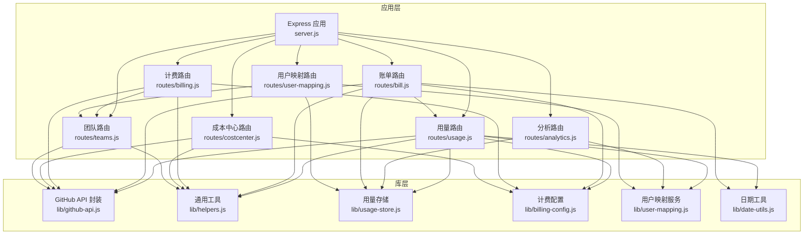
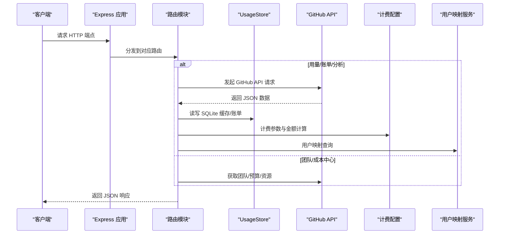
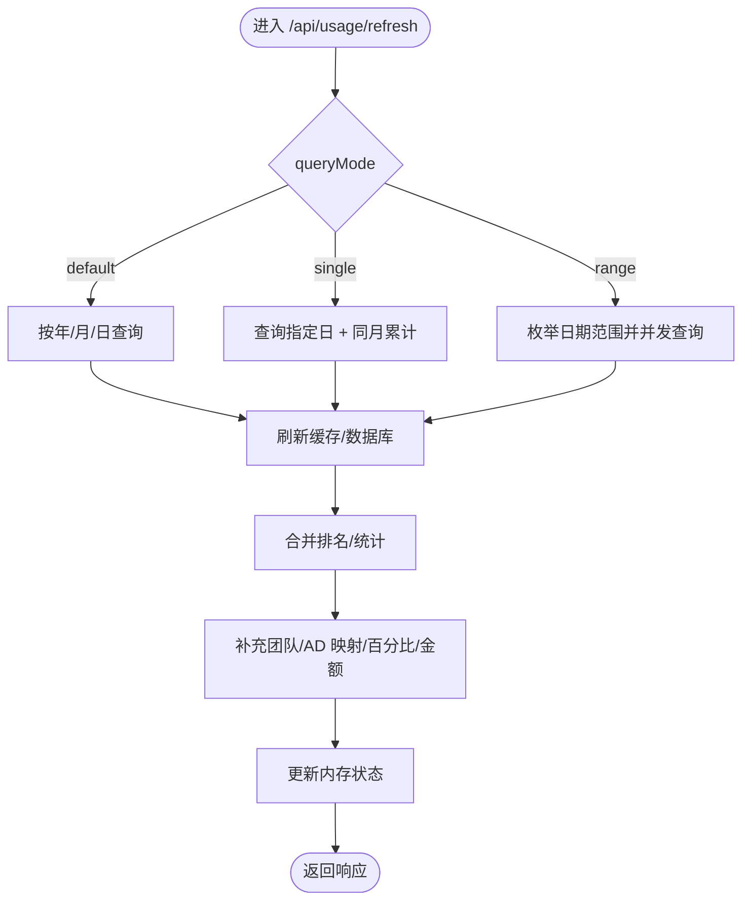
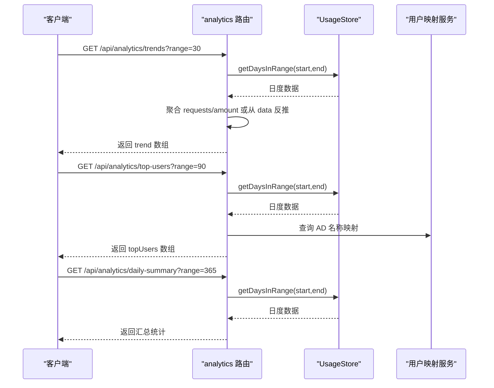
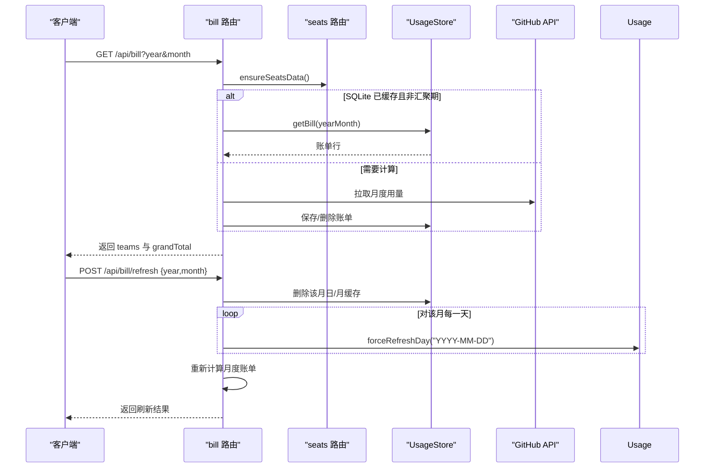
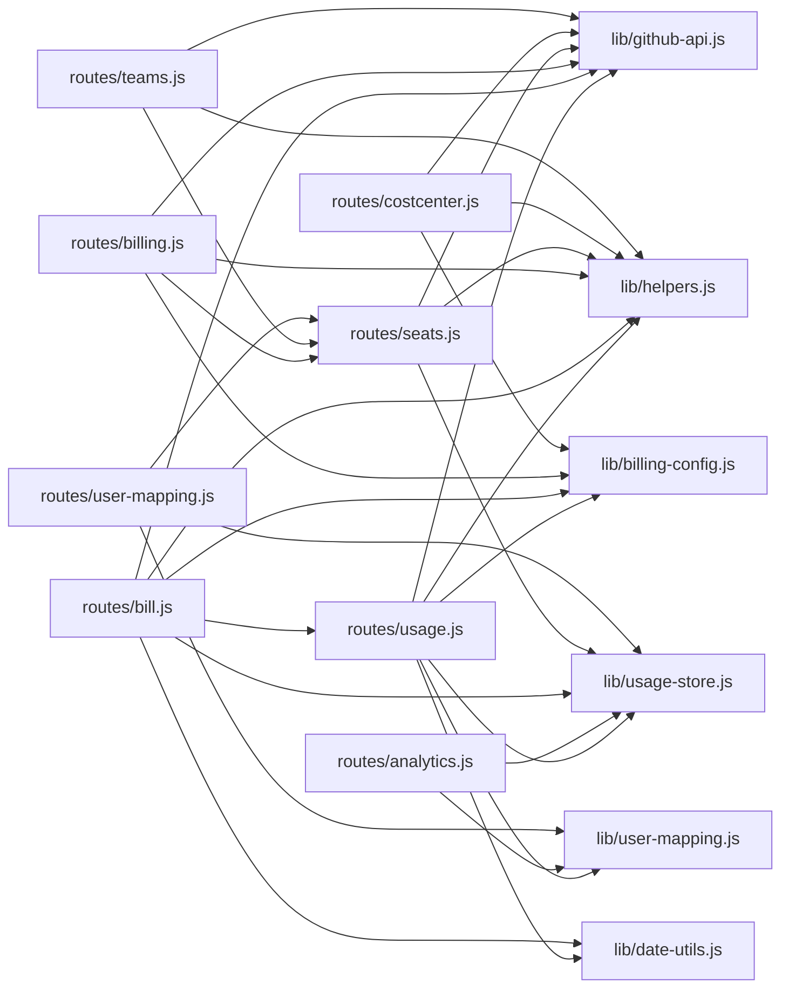

# API 接口参考

<cite>
**本文档引用的文件**
- [server.js](file://server.js)
- [routes/usage.js](file://routes/usage.js)
- [routes/analytics.js](file://routes/analytics.js)
- [routes/bill.js](file://routes/bill.js)
- [routes/billing.js](file://routes/billing.js)
- [routes/costcenter.js](file://routes/costcenter.js)
- [routes/teams.js](file://routes/teams.js)
- [routes/user-mapping.js](file://routes/user-mapping.js)
- [routes/seats.js](file://routes/seats.js)
- [lib/github-api.js](file://lib/github-api.js)
- [lib/helpers.js](file://lib/helpers.js)
- [lib/usage-store.js](file://lib/usage-store.js)
- [lib/billing-config.js](file://lib/billing-config.js)
- [lib/user-mapping.js](file://lib/user-mapping.js)
- [lib/date-utils.js](file://lib/date-utils.js)
- [package.json](file://package.json)
</cite>

## 目录
1. [简介](#简介)
2. [项目结构](#项目结构)
3. [核心组件](#核心组件)
4. [架构总览](#架构总览)
5. [详细组件分析](#详细组件分析)
6. [依赖关系分析](#依赖关系分析)
7. [性能考量](#性能考量)
8. [故障排查指南](#故障排查指南)
9. [结论](#结论)
10. [附录](#附录)

## 简介
本文件为 CopilotEnterpriseUsageDisplay 的完整 API 接口参考，覆盖以下主题域：
- 用量查询 API：支持单日、日期范围与默认模式的查询与刷新
- 数据分析 API：趋势数据、Top 用户排行、日汇总统计
- 账单管理 API：费用计算、月度账单、强制刷新
- 团队管理 API：Team 信息获取与成员列表管理
- 成本中心 API：资源管理、批量操作、预算控制
- 用户映射 API：文件上传、数据验证、状态查询与映射

本参考文档提供每个端点的 HTTP 方法、URL 模式、请求参数、响应格式与状态码，并辅以查询模式说明、流程图与时序图帮助理解。

## 项目结构
后端基于 Express，采用按功能模块划分的路由组织方式，核心依赖包括：
- GitHub API 封装与并发控制
- SQLite 缓存与 ETag 条目持久化
- 用户映射服务与座位数据缓存

**图表来源**
- [server.js:88-99](file://server.js#L88-L99)
- [routes/usage.js:13-469](file://routes/usage.js#L13-L469)
- [routes/analytics.js:7-131](file://routes/analytics.js#L7-L131)
- [routes/bill.js:13-406](file://routes/bill.js#L13-L406)
- [routes/billing.js:10-105](file://routes/billing.js#L10-L105)
- [routes/costcenter.js:110-251](file://routes/costcenter.js#L110-L251)
- [routes/teams.js:36-103](file://routes/teams.js#L36-L103)
- [routes/user-mapping.js:12-134](file://routes/user-mapping.js#L12-L134)
- [lib/github-api.js:1-320](file://lib/github-api.js#L1-L320)
- [lib/usage-store.js:10-324](file://lib/usage-store.js#L10-L324)
- [lib/helpers.js:1-83](file://lib/helpers.js#L1-L83)
- [lib/billing-config.js:1-25](file://lib/billing-config.js#L1-L25)
- [lib/user-mapping.js:1-158](file://lib/user-mapping.js#L1-L158)
- [lib/date-utils.js:1-46](file://lib/date-utils.js#L1-L46)

**章节来源**
- [server.js:88-99](file://server.js#L88-L99)
- [package.json:12-25](file://package.json#L12-L25)

## 核心组件
- GitHub API 封装：提供并发队列、重试退避、ETag 条件请求、单次飞行去重与 LRU 缓存
- 用量存储：SQLite 表 daily_usage、monthly_bill、etag_cache、seats_snapshot，提供按日期范围读取、清理、账单持久化等能力
- 计费配置：计划类型、配额、基础费用、超量单价与金额计算函数
- 用户映射服务：从本地 JSON 文件加载/监听变更，提供 GitHub 登录到 AD 映射查询
- 通用工具：数值转换、用户提取、查询参数构建、企业/组织端点构建
- 日期工具：解析日期字符串、枚举日期范围、构建日期键

**章节来源**
- [lib/github-api.js:1-320](file://lib/github-api.js#L1-L320)
- [lib/usage-store.js:10-324](file://lib/usage-store.js#L10-L324)
- [lib/billing-config.js:1-25](file://lib/billing-config.js#L1-L25)
- [lib/user-mapping.js:1-158](file://lib/user-mapping.js#L1-L158)
- [lib/helpers.js:1-83](file://lib/helpers.js#L1-L83)
- [lib/date-utils.js:1-46](file://lib/date-utils.js#L1-L46)

## 架构总览
下图展示各路由模块与核心库之间的交互关系，以及 GitHub API 的调用路径。

**图表来源**
- [server.js:88-99](file://server.js#L88-L99)
- [routes/usage.js:13-469](file://routes/usage.js#L13-L469)
- [routes/bill.js:13-406](file://routes/bill.js#L13-L406)
- [routes/analytics.js:7-131](file://routes/analytics.js#L7-L131)
- [routes/costcenter.js:110-251](file://routes/costcenter.js#L110-L251)
- [routes/teams.js:36-103](file://routes/teams.js#L36-L103)
- [lib/github-api.js:1-320](file://lib/github-api.js#L1-L320)
- [lib/usage-store.js:10-324](file://lib/usage-store.js#L10-L324)
- [lib/billing-config.js:1-25](file://lib/billing-config.js#L1-L25)
- [lib/user-mapping.js:1-158](file://lib/user-mapping.js#L1-L158)

## 详细组件分析

### 用量查询 API
- 端点：GET /api/usage
  - 功能：返回当前内存中的最新用量排名结果（含来源、模式、原始条数、配额）
  - 查询参数：无
  - 响应字段：ok、fetchedAt、source、rawItemsCount、mode、dateLabel、queryMode、ranking、includedQuota
  - 状态码：200
  - 示例：见“请求示例/响应示例”
  - 错误：无（内部状态）

- 端点：POST /api/usage/refresh
  - 功能：根据查询模式刷新并聚合用量
  - 请求体参数：
    - queryMode：default | single | range
    - date：YYYY-MM-DD（single 模式必填）
    - startDate / endDate：YYYY-MM-DD（range 模式必填，且长度 ≤ 31 天）
    - force：布尔或字符串“true”/“1”，强制绕过缓存
  - 响应字段：ok、fetchedAt、source、rawItemsCount、mode、dateLabel、queryMode、ranking、includedQuota、cacheHitRatio
  - 状态码：200；错误时返回 4xx/5xx
  - 查询模式说明：
    - default：按 BILLING_YEAR/MONTH（可选 BILLING_DAY）查询当月或当日
    - single：同时查询指定日期当日与同月累计，合并返回
    - range：对日期范围内逐日并发拉取并合并
  - 刷新策略：
    - 内存缓存命中：直接返回
    - SQLite 日缓存命中（当日）：按有效 TTL 返回
    - 否则：从 GitHub API 拉取，必要时回退到按用户逐个查询
  - 示例：见“请求示例/响应示例”

**图表来源**
- [routes/usage.js:387-462](file://routes/usage.js#L387-L462)
- [routes/usage.js:237-348](file://routes/usage.js#L237-L348)
- [routes/usage.js:350-367](file://routes/usage.js#L350-L367)
- [routes/usage.js:74-91](file://routes/usage.js#L74-L91)

**章节来源**
- [routes/usage.js:378-385](file://routes/usage.js#L378-L385)
- [routes/usage.js:387-462](file://routes/usage.js#L387-L462)
- [routes/usage.js:237-348](file://routes/usage.js#L237-L348)
- [routes/usage.js:350-367](file://routes/usage.js#L350-L367)
- [routes/usage.js:74-91](file://routes/usage.js#L74-L91)

### 数据分析 API
- 端点：GET /api/analytics/trends
  - 功能：返回指定天数范围内的每日请求总量与金额趋势
  - 查询参数：range=30|90|365（默认 30）
  - 响应字段：ok、range、trend[]（元素含 date、requests、amount）、cachedCount
  - 状态码：200；非法 range 返回 400
  - 示例：见“请求示例/响应示例”

- 端点：GET /api/analytics/top-users
  - 功能：返回指定天数范围内的 Top 20 用户（按请求量排序）
  - 查询参数：range=30|90|365（默认 30）
  - 响应字段：ok、range、topUsers[]（含 rank、user/adName、requests、amount）
  - 状态码：200
  - 示例：见“请求示例/响应示例”

- 端点：GET /api/analytics/daily-summary
  - 功能：返回指定天数范围内的总请求量/金额、平均日请求量/金额、有数据的天数
  - 查询参数：range=30|90|365（默认 30）
  - 响应字段：ok、range、totalRequests、totalAmount、avgDailyRequests、avgDailyAmount、daysWithData、totalDaysInRange
  - 状态码：200
  - 示例：见“请求示例/响应示例”

**图表来源**
- [routes/analytics.js:10-42](file://routes/analytics.js#L10-L42)
- [routes/analytics.js:44-91](file://routes/analytics.js#L44-L91)
- [routes/analytics.js:93-128](file://routes/analytics.js#L93-L128)
- [lib/usage-store.js:162-164](file://lib/usage-store.js#L162-L164)
- [lib/user-mapping.js:118-126](file://lib/user-mapping.js#L118-L126)

**章节来源**
- [routes/analytics.js:10-42](file://routes/analytics.js#L10-L42)
- [routes/analytics.js:44-91](file://routes/analytics.js#L44-L91)
- [routes/analytics.js:93-128](file://routes/analytics.js#L93-L128)
- [lib/usage-store.js:162-164](file://lib/usage-store.js#L162-L164)
- [lib/user-mapping.js:118-126](file://lib/user-mapping.js#L118-L126)

### 账单管理 API
- 端点：GET /api/bill
  - 功能：获取团队级月度账单（按团队聚合）
  - 查询参数：year、month（默认当前年/月）
  - 响应字段：ok、yearMonth、status（aggregating/partial/complete）、message、dateRange、teams[]、grandTotal{}
  - 状态码：200；当处于“数据汇聚期”返回特殊消息
  - 逻辑要点：
    - 当月前两日为“aggregating”，直接返回提示
    - 其他情况：优先从 SQLite 月度账单读取；否则从 GitHub 拉取并计算
    - 计算：按座位计划类型与配额、超量单价得出每用户费用并按团队聚合
  - 示例：见“请求示例/响应示例”

- 端点：POST /api/bill/refresh
  - 功能：强制刷新整个月的每日与月度账单
  - 请求体参数：year、month
  - 流程：
    - 清理该月 SQLite 日度与月度缓存
    - 并发刷新该月每一天（通过 usage 路由的强制刷新）
    - 重新计算月度账单并返回
  - 响应字段：ok、yearMonth、status、message、dateRange、refreshedDays、failedDates、teams[]、grandTotal、fetchedAt
  - 状态码：200；“数据汇聚期”返回空账单与提示
  - 示例：见“请求示例/响应示例”

**图表来源**
- [routes/bill.js:237-313](file://routes/bill.js#L237-L313)
- [routes/bill.js:321-403](file://routes/bill.js#L321-L403)
- [routes/seats.js:37-75](file://routes/seats.js#L37-L75)
- [lib/usage-store.js:282-320](file://lib/usage-store.js#L282-L320)
- [lib/billing-config.js:13-22](file://lib/billing-config.js#L13-L22)

**章节来源**
- [routes/bill.js:237-313](file://routes/bill.js#L237-L313)
- [routes/bill.js:321-403](file://routes/bill.js#L321-L403)
- [routes/seats.js:37-75](file://routes/seats.js#L37-L75)
- [lib/usage-store.js:282-320](file://lib/usage-store.js#L282-L320)
- [lib/billing-config.js:13-22](file://lib/billing-config.js#L13-L22)

### 团队管理 API
- 端点：GET /api/teams
  - 功能：返回用户到团队的映射（来自座位数据）
  - 查询参数：无
  - 响应字段：ok、fetchedAt、teams{}
  - 状态码：200

- 端点：GET /api/enterprise-teams
  - 功能：列出企业下所有团队及其成员数量（带缓存）
  - 查询参数：无
  - 响应字段：ok、teams[]（含 id/name/slug/description/membersCount/createdAt/htmlUrl）
  - 状态码：200；需 enterprise 模式

- 端点：GET /api/enterprise-teams/:teamId/members
  - 功能：分页获取团队成员列表
  - 查询参数：无
  - 响应字段：ok、totalMembers、members[]（含 login/avatarUrl/htmlUrl）
  - 状态码：200；需 enterprise 模式

- 端点：POST /api/teams/refresh
  - 功能：从 GitHub 拉取 Copilot 座位并重建用户-团队映射
  - 查询参数：无
  - 响应字段：ok、fetchedAt、totalUsers、teams{}
  - 状态码：200；需 enterprise 模式

**章节来源**
- [routes/teams.js:39-41](file://routes/teams.js#L39-L41)
- [routes/teams.js:43-62](file://routes/teams.js#L43-L62)
- [routes/teams.js:64-84](file://routes/teams.js#L64-L84)
- [routes/teams.js:86-100](file://routes/teams.js#L86-L100)

### 成本中心 API
- 端点：GET /api/cost-centers
  - 功能：列出企业成本中心，合并预算与已花费（按 SKU 过滤）
  - 查询参数：state=active|deleted（可选）
  - 响应字段：ok、fetchedAt、enterprise、seatBaseCost、total、costCenters[]
  - 状态码：200；需 enterprise 模式

- 端点：GET /api/cost-centers/by-name/:name
  - 功能：按名称获取成本中心详情（含预算与花费）
  - 查询参数：无
  - 响应字段：ok、fetchedAt、enterprise、seatBaseCost、costCenter{}
  - 状态码：200；未找到返回 404

- 端点：POST /api/cost-centers/:id/add-users-from-teams
  - 功能：从选定 Team 批量添加/移除用户到成本中心（支持 dryRun 与移除缺失用户）
  - 请求体参数：teamIds[]、dryRun、removeMissingUsers
  - 响应字段：ok、dryRun、removeMissingUsers、costCenter{}、selectedTeams[]、统计计数与批次数
  - 状态码：200；需 enterprise 模式

**章节来源**
- [routes/costcenter.js:113-141](file://routes/costcenter.js#L113-L141)
- [routes/costcenter.js:143-171](file://routes/costcenter.js#L143-L171)
- [routes/costcenter.js:173-248](file://routes/costcenter.js#L173-L248)

### 用户映射 API
- 端点：POST /user/upload-members
  - 功能：上传 Excel（.xlsx/.xls），解析并写入本地 user_mapping.json
  - 请求：multipart/form-data，file 字段
  - 响应字段：ok、message、totalRows、validRows、skipped、fileName
  - 状态码：200；文件类型不支持返回 400

- 端点：POST /user/reload-mapping
  - 功能：手动重新加载映射文件
  - 响应字段：ok、message、count、fetchedAt
  - 状态码：200

- 端点：GET /api/user/members
  - 功能：返回座位成员列表（含团队、AD 映射、计划类型、最后活跃时间）
  - 查询参数：无
  - 响应字段：ok、loadedAt、total、mappedCount、members[]
  - 状态码：200

- 端点：GET /api/user/info
  - 功能：按 GitHub 登录名查询 AD 映射信息
  - 查询参数：github（必填）
  - 响应字段：ok + 成功；或 ok=false + message
  - 状态码：200；缺少参数返回 400

**章节来源**
- [routes/user-mapping.js:79-94](file://routes/user-mapping.js#L79-L94)
- [routes/user-mapping.js:97-102](file://routes/user-mapping.js#L97-L102)
- [routes/user-mapping.js:105-122](file://routes/user-mapping.js#L105-L122)
- [routes/user-mapping.js:125-131](file://routes/user-mapping.js#L125-L131)

### 计费概览 API
- 端点：GET /api/seats
  - 功能：获取 Copilot 座位数据（可强制刷新）
  - 查询参数：refresh=1|true
  - 响应字段：ok、fetchedAt、totalSeats、seats[]
  - 状态码：200

- 端点：GET /api/billing/summary
  - 功能：计算企业整体计费概览（含计划分布、总配额、预估总费用）
  - 查询参数：无
  - 响应字段：ok、rawItems、planSummary[]、totalSeats、totalSeatsCost、totalIncludedQuota、totalPremiumRequests、premiumUnitPrice、grossPremiumCost、discountPremiumCost、overageRequests、overageCost、totalEstimatedCost
  - 状态码：200

- 端点：GET /api/billing/models
  - 功能：按模型维度汇总用量（按产品 Copilot 过滤）
  - 查询参数：year、month（可选，默认当前）
  - 响应字段：ok、year、month、models[]（含 model、grossQuantity、grossAmount、pricePerUnit）、totalQuantity、totalAmount
  - 状态码：200

**章节来源**
- [routes/billing.js:13-20](file://routes/billing.js#L13-L20)
- [routes/billing.js:22-62](file://routes/billing.js#L22-L62)
- [routes/billing.js:64-102](file://routes/billing.js#L64-L102)

## 依赖关系分析

**图表来源**
- [routes/usage.js:13-469](file://routes/usage.js#L13-L469)
- [routes/analytics.js:7-131](file://routes/analytics.js#L7-L131)
- [routes/bill.js:13-406](file://routes/bill.js#L13-L406)
- [routes/billing.js:10-105](file://routes/billing.js#L10-L105)
- [routes/costcenter.js:110-251](file://routes/costcenter.js#L110-L251)
- [routes/teams.js:36-103](file://routes/teams.js#L36-L103)
- [routes/user-mapping.js:12-134](file://routes/user-mapping.js#L12-L134)
- [routes/seats.js:37-75](file://routes/seats.js#L37-L75)
- [lib/github-api.js:1-320](file://lib/github-api.js#L1-L320)
- [lib/usage-store.js:10-324](file://lib/usage-store.js#L10-L324)
- [lib/helpers.js:1-83](file://lib/helpers.js#L1-L83)
- [lib/billing-config.js:1-25](file://lib/billing-config.js#L1-L25)
- [lib/user-mapping.js:1-158](file://lib/user-mapping.js#L1-L158)

**章节来源**
- [routes/usage.js:13-469](file://routes/usage.js#L13-L469)
- [routes/analytics.js:7-131](file://routes/analytics.js#L7-L131)
- [routes/bill.js:13-406](file://routes/bill.js#L13-L406)
- [routes/billing.js:10-105](file://routes/billing.js#L10-L105)
- [routes/costcenter.js:110-251](file://routes/costcenter.js#L110-L251)
- [routes/teams.js:36-103](file://routes/teams.js#L36-L103)
- [routes/user-mapping.js:12-134](file://routes/user-mapping.js#L12-L134)
- [routes/seats.js:37-75](file://routes/seats.js#L37-L75)

## 性能考量
- 并发与节流
  - GitHub API 并发上限由环境变量控制，避免触发速率限制
  - 支持单次飞行去重与 LRU 缓存，减少重复请求
- 缓存策略
  - SQLite 日度缓存：当日使用短 TTL，历史使用长 TTL
  - 月度账单缓存：历史月份直接读取；当前月在“数据汇聚期”返回提示
  - ETag 条件请求：命中 304 时复用缓存数据
- 聚合与回退
  - 优先使用 SQLite 聚合；若数据不完整则回退到 GitHub API
  - 未知用户场景下按用户逐个查询以补齐排名

**章节来源**
- [lib/github-api.js:25-48](file://lib/github-api.js#L25-L48)
- [lib/github-api.js:231-269](file://lib/github-api.js#L231-L269)
- [routes/usage.js:134-235](file://routes/usage.js#L134-L235)
- [routes/bill.js:87-128](file://routes/bill.js#L87-L128)
- [lib/usage-store.js:6-8](file://lib/usage-store.js#L6-L8)

## 故障排查指南
- 常见错误与处理
  - 缺少 GITHUB_TOKEN：返回 500，提示缺失
  - 速率限制：返回 429，携带速率限制信息
  - 403/429：自动退避重试，必要时等待 reset
  - 4xx/5xx：抛出 ApiError，统一由中间件返回
- 日志与可观测性
  - 访问日志包含方法、URL、状态码、耗时与动作标识
  - 未捕获异常与未处理拒绝会记录并优雅关闭
- 常见问题定位
  - 用量为空：检查 seats 数据是否加载、未知用户回退是否生效
  - 账单为空：确认当月是否处于“数据汇聚期”或无使用数据
  - 成本中心预算/花费为 null：检查预算页面权限与 SKU 过滤

**章节来源**
- [lib/github-api.js:14-21](file://lib/github-api.js#L14-L21)
- [lib/github-api.js:172-227](file://lib/github-api.js#L172-L227)
- [server.js:121-139](file://server.js#L121-L139)
- [routes/usage.js:332-337](file://routes/usage.js#L332-L337)
- [routes/bill.js:37-65](file://routes/bill.js#L37-L65)

## 结论
本 API 参考文档系统性地梳理了 Copilot 企业用量与账单相关的全部端点，明确了查询模式、缓存策略、错误处理与集成点。建议在生产环境中：
- 正确配置环境变量（如 ENTERPRISE_SLUG、GITHUB_TOKEN、并发与重试参数）
- 关注“数据汇聚期”的账单行为
- 合理使用强制刷新与批量操作，避免对 GitHub API 造成过大压力

## 附录

### 端点一览与规范摘要
- 用量查询
  - GET /api/usage：返回当前内存状态
  - POST /api/usage/refresh：按模式刷新并返回聚合结果
- 数据分析
  - GET /api/analytics/trends：趋势数据
  - GET /api/analytics/top-users：Top 用户排行
  - GET /api/analytics/daily-summary：日汇总统计
- 账单管理
  - GET /api/bill：月度账单（团队聚合）
  - POST /api/bill/refresh：强制刷新整月账单
- 团队管理
  - GET /api/teams：用户-团队映射
  - GET /api/enterprise-teams：团队列表
  - GET /api/enterprise-teams/:teamId/members：团队成员
  - POST /api/teams/refresh：刷新座位与映射
- 成本中心
  - GET /api/cost-centers：成本中心列表
  - GET /api/cost-centers/by-name/:name：成本中心详情
  - POST /api/cost-centers/:id/add-users-from-teams：批量添加/移除用户
- 用户映射
  - POST /user/upload-members：上传映射文件
  - POST /user/reload-mapping：重新加载映射
  - GET /api/user/members：成员列表
  - GET /api/user/info：按登录名查询映射
- 计费概览
  - GET /api/seats：座位数据
  - GET /api/billing/summary：企业计费概览
  - GET /api/billing/models：模型维度用量

### 请求示例与响应示例（示意）
- GET /api/usage
  - 请求：无
  - 响应：包含 fetchedAt、source、ranking、includedQuota 等字段
- POST /api/usage/refresh
  - 请求体（默认模式）：{ queryMode: "default", force: true }
  - 响应：包含 ranking、mode、dateLabel、cacheHitRatio 等
- GET /api/analytics/trends?range=30
  - 响应：包含 trend[]（元素含 date、requests、amount）
- GET /api/bill?year=2025&month=4
  - 响应：包含 teams[]、grandTotal、dateRange、status
- POST /api/bill/refresh { year: 2025, month: 4 }
  - 响应：包含 refreshedDays、failedDates、teams[]、grandTotal
- GET /api/teams
  - 响应：包含 teams{}（用户到团队映射）
- GET /api/cost-centers?state=active
  - 响应：包含 costCenters[]（含预算/花费）
- POST /api/cost-centers/:id/add-users-from-teams
  - 请求体：{ teamIds: [123,456], dryRun: true, removeMissingUsers: true }
  - 响应：包含统计计数与批次数
- POST /user/upload-members
  - 请求：multipart/form-data，file
  - 响应：包含 totalRows、validRows、skipped
- GET /api/user/info?github=alice
  - 响应：包含映射信息或 ok=false + message

### 状态码约定
- 200：成功
- 400：参数错误（如 range 值非法、日期范围超限）
- 403/429：权限不足或速率限制
- 404：资源不存在（如成本中心）
- 500：服务器内部错误