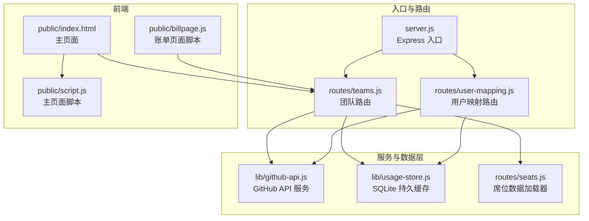
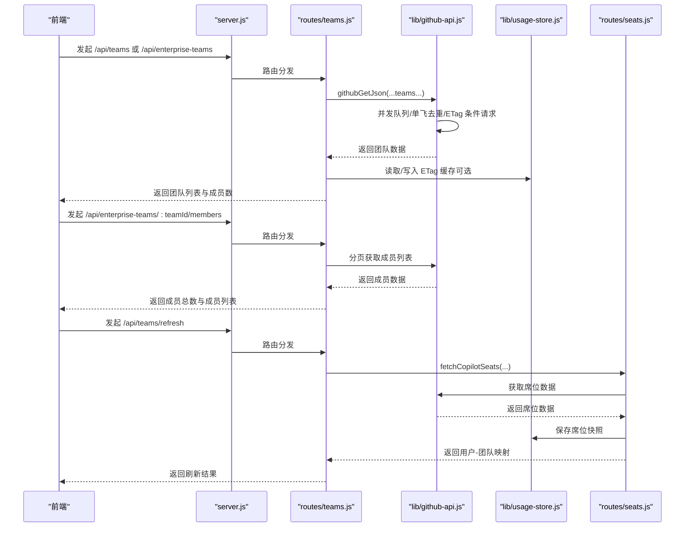
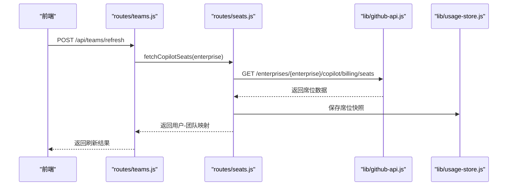
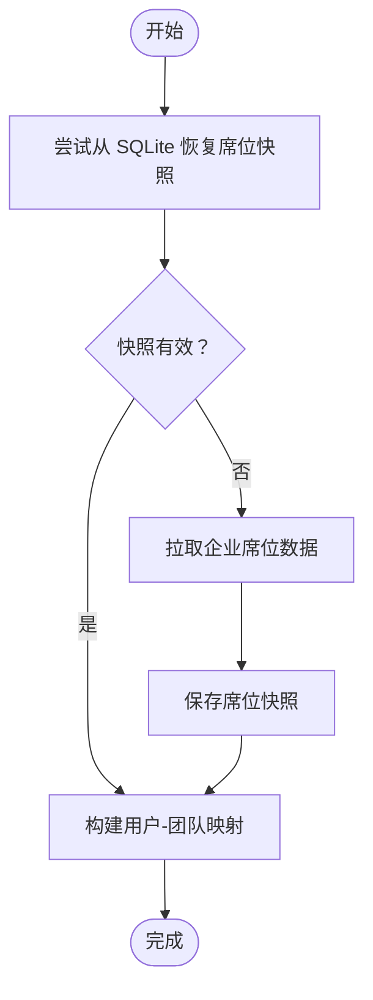
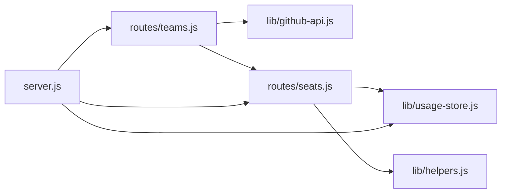

# 团队管理 API

<cite>
**本文引用的文件**
- [routes/teams.js](file://routes/teams.js)
- [lib/github-api.js](file://lib/github-api.js)
- [lib/usage-store.js](file://lib/usage-store.js)
- [lib/helpers.js](file://lib/helpers.js)
- [routes/seats.js](file://routes/seats.js)
- [server.js](file://server.js)
- [README.md](file://README.md)
- [public/index.html](file://public/index.html)
- [public/script.js](file://public/script.js)
- [public/billpage.js](file://public/billpage.js)
- [docs/github-enterprise-copilot-billing-scope-checklist.md](file://docs/github-enterprise-copilot-billing-scope-checklist.md)
</cite>

## 目录
1. [简介](#简介)
2. [项目结构](#项目结构)
3. [核心组件](#核心组件)
4. [架构总览](#架构总览)
5. [详细组件分析](#详细组件分析)
6. [依赖关系分析](#依赖关系分析)
7. [性能考量](#性能考量)
8. [故障排查指南](#故障排查指南)
9. [结论](#结论)
10. [附录](#附录)

## 简介
本文件为团队管理 API 的完整接口文档，聚焦以下目标：
- 详细说明团队信息获取接口：团队列表、成员列表、权限控制与访问限制
- 解释团队维度的用量分析与统计方法
- 说明团队数据的同步机制与更新策略
- 介绍团队数据结构与字段含义
- 提供团队查询与筛选的接口使用方法、请求参数、响应格式与实际应用场景示例

## 项目结构
后端采用模块化分层架构，团队管理相关能力集中在 routes/teams.js，并通过共享的缓存与 GitHub API 层实现高效、稳定的团队数据获取与同步。

图表来源
- [server.js:88-99](file://server.js#L88-L99)
- [routes/teams.js:36-103](file://routes/teams.js#L36-L103)
- [lib/github-api.js:108-168](file://lib/github-api.js#L108-L168)
- [lib/usage-store.js:10-79](file://lib/usage-store.js#L10-L79)
- [routes/seats.js:37-77](file://routes/seats.js#L37-L77)
- [public/index.html:1-103](file://public/index.html#L1-L103)
- [public/script.js:236-277](file://public/script.js#L236-L277)
- [public/billpage.js:148-189](file://public/billpage.js#L148-L189)

章节来源
- [server.js:88-99](file://server.js#L88-L99)
- [README.md:46-96](file://README.md#L46-L96)

## 核心组件
- 团队路由模块：提供团队列表、成员列表与团队刷新接口，封装企业模式校验与缓存策略
- GitHub API 服务：统一的并发控制、重试退避、ETag 条件请求与单飞去重
- 使用数据持久化：SQLite 缓存层，支持席位快照、ETag 持久化与月度账单存储
- 席位数据加载器：从企业席位 API 拉取用户、团队归属与计划类型，构建用户-团队映射
- 前端团队筛选：主页面与账单页面的 Team 多选筛选 UI 与逻辑

章节来源
- [routes/teams.js:36-103](file://routes/teams.js#L36-L103)
- [lib/github-api.js:108-168](file://lib/github-api.js#L108-L168)
- [lib/usage-store.js:10-79](file://lib/usage-store.js#L10-L79)
- [routes/seats.js:37-77](file://routes/seats.js#L37-L77)
- [public/script.js:236-277](file://public/script.js#L236-L277)
- [public/billpage.js:148-189](file://public/billpage.js#L148-L189)

## 架构总览
团队管理 API 的调用链路如下：
- 前端发起团队相关请求
- Express 路由解析并进行企业模式校验
- GitHub API 服务负责并发与缓存控制，必要时发起真实请求
- SQLite 持久化层提供 ETag 与席位快照缓存
- 席位数据加载器负责用户-团队映射的构建与更新
- 响应返回给前端，前端进行团队筛选与展示

图表来源
- [routes/teams.js:39-100](file://routes/teams.js#L39-L100)
- [lib/github-api.js:108-168](file://lib/github-api.js#L108-L168)
- [lib/usage-store.js:211-240](file://lib/usage-store.js#L211-L240)
- [routes/seats.js:9-35](file://routes/seats.js#L9-L35)

## 详细组件分析

### 团队信息获取接口
- GET /api/teams
  - 作用：返回当前缓存中的团队映射与刷新时间
  - 请求参数：无
  - 响应字段：
    - ok: 布尔，请求是否成功
    - fetchedAt: 字符串，ISO 时间戳，表示缓存数据的刷新时间
    - teams: 对象，键为用户登录名，值为该用户所属团队数组
  - 使用场景：前端在主页面展示用户与团队的对应关系，用于筛选与统计
  - 章节来源
    - [routes/teams.js:39-41](file://routes/teams.js#L39-L41)

- GET /api/enterprise-teams
  - 作用：返回企业下所有团队的基本信息与成员数
  - 请求参数：无
  - 响应字段：
    - ok: 布尔，请求是否成功
    - teams: 数组，元素包含：
      - id: 整数，团队 ID
      - name: 字符串，团队名称
      - slug: 字符串，团队 slug
      - description: 字符串，团队描述（可空）
      - membersCount: 整数或 null，团队成员数（优先使用 GitHub 返回值，否则使用缓存计数）
      - createdAt: 字符串或 null，团队创建时间
      - htmlUrl: 字符串，团队网页链接
  - 使用场景：前端在“用户 & Team 信息”面板展示团队列表，支持成员数统计
  - 章节来源
    - [routes/teams.js:43-62](file://routes/teams.js#L43-L62)

- GET /api/enterprise-teams/:teamId/members
  - 作用：分页返回团队成员列表
  - 请求参数：
    - teamId: 路径参数，必须为正整数字符串
  - 响应字段：
    - ok: 布尔，请求是否成功
    - totalMembers: 整数，成员总数
    - members: 数组，元素包含：
      - login: 字符串，GitHub 登录名
      - avatarUrl: 字符串，头像链接
      - htmlUrl: 字符串，成员主页链接
  - 使用场景：前端展开团队详情时加载成员列表
  - 章节来源
    - [routes/teams.js:64-84](file://routes/teams.js#L64-L84)

- POST /api/teams/refresh
  - 作用：强制刷新团队数据（基于企业席位数据构建用户-团队映射）
  - 请求参数：无
  - 响应字段：
    - ok: 布尔，请求是否成功
    - fetchedAt: 字符串，刷新时间
    - totalUsers: 整数，席位数据中的用户总数
    - teams: 对象，用户-团队映射
  - 使用场景：当席位数据发生变化或缓存失效时，主动触发刷新
  - 章节来源
    - [routes/teams.js:86-100](file://routes/teams.js#L86-L100)

图表来源
- [routes/teams.js:86-100](file://routes/teams.js#L86-L100)
- [routes/seats.js:9-35](file://routes/seats.js#L9-L35)
- [lib/github-api.js:108-168](file://lib/github-api.js#L108-L168)
- [lib/usage-store.js:211-240](file://lib/usage-store.js#L211-L240)

### 团队维度的用量分析与统计方法
- 团队成员数统计
  - 企业团队成员数优先使用 GitHub 返回的 members_count 字段；若不可用，则通过分页遍历 /memberships 接口统计
  - 成员数缓存 TTL 为 10 分钟，避免频繁调用 GitHub API
  - 章节来源
    - [routes/teams.js:12-34](file://routes/teams.js#L12-L34)

- 用户-团队映射
  - 基于企业席位数据构建用户-团队映射，用于主页面与账单页面的团队筛选
  - 刷新策略：优先从 SQLite 恢复最近快照，若未命中或强制刷新则重新拉取席位数据并保存快照
  - 章节来源
    - [routes/seats.js:37-77](file://routes/seats.js#L37-L77)
    - [lib/usage-store.js:211-240](file://lib/usage-store.js#L211-L240)

- 团队筛选
  - 主页面与账单页面均支持 Team 多选筛选，前端根据用户-团队映射生成筛选列表
  - 章节来源
    - [public/script.js:236-277](file://public/script.js#L236-L277)
    - [public/billpage.js:148-189](file://public/billpage.js#L148-L189)

图表来源
- [routes/seats.js:37-77](file://routes/seats.js#L37-L77)
- [lib/usage-store.js:211-240](file://lib/usage-store.js#L211-L240)

### 团队数据的同步机制与更新策略
- 缓存层次
  - 内存缓存：团队成员数缓存（TTL 10 分钟）、席位快照（TTL 10 分钟）
  - SQLite 持久缓存：ETag、席位快照、月度账单
  - GitHub API：最终数据源
  - 章节来源
    - [lib/github-api.js:58-98](file://lib/github-api.js#L58-L98)
    - [lib/usage-store.js:10-79](file://lib/usage-store.js#L10-L79)

- 同步策略
  - 企业模式校验：所有团队相关接口均要求企业模式（ENTERPRISE_SLUG 设置）
  - 单飞去重：相同参数的请求仅一次在途，避免重复调用
  - ETag 条件请求：数据未变化时返回 304，不消耗配额
  - 并发控制：最大并发数可配置，遇限流自动指数退避
  - 章节来源
    - [lib/github-api.js:108-168](file://lib/github-api.js#L108-L168)
    - [routes/teams.js:45-46](file://routes/teams.js#L45-L46)
    - [routes/teams.js:66-67](file://routes/teams.js#L66-L67)
    - [routes/teams.js:88-89](file://routes/teams.js#L88-L89)

### 权限控制与访问限制
- 企业模式限制
  - 所有团队相关接口仅在企业模式下可用（ENTERPRISE_SLUG 必须设置）
  - 章节来源
    - [routes/teams.js:45-46](file://routes/teams.js#L45-L46)
    - [routes/teams.js:66-67](file://routes/teams.js#L66-L67)
    - [routes/teams.js:88-89](file://routes/teams.js#L88-L89)

- GitHub API 权限
  - 建议角色：Enterprise owner 或 Billing manager
  - 建议 scope：manage_billing:copilot + read:enterprise
  - 章节来源
    - [docs/github-enterprise-copilot-billing-scope-checklist.md:14-21](file://docs/github-enterprise-copilot-billing-scope-checklist.md#L14-L21)

- 访问限制与错误处理
  - 429 速率限制：自动退避重试并返回友好提示
  - 403/404：根据消息判断权限不足或功能未启用
  - 章节来源
    - [lib/github-api.js:172-227](file://lib/github-api.js#L172-L227)

### 团队数据结构与字段说明
- 团队实体
  - id: 整数，唯一标识
  - name: 字符串，团队名称
  - slug: 字符串，团队 slug
  - description: 字符串，描述（可空）
  - membersCount: 整数或 null，成员数
  - createdAt: 字符串或 null，创建时间
  - htmlUrl: 字符串，团队网页链接
- 成员实体
  - login: 字符串，GitHub 登录名
  - avatarUrl: 字符串，头像链接
  - htmlUrl: 字符串，成员主页链接
- 用户-团队映射
  - 键：用户登录名
  - 值：该用户所属团队数组（字符串）

章节来源
- [routes/teams.js:53-60](file://routes/teams.js#L53-L60)
- [routes/teams.js:77-82](file://routes/teams.js#L77-L82)
- [routes/seats.js:18-30](file://routes/seats.js#L18-L30)

### 团队查询与筛选的接口使用方法
- 团队列表与成员数
  - GET /api/enterprise-teams：获取团队列表与成员数
  - GET /api/teams：获取用户-团队映射
  - GET /api/teams/refresh：刷新用户-团队映射
  - 章节来源
    - [routes/teams.js:43-62](file://routes/teams.js#L43-L62)
    - [routes/teams.js:39-41](file://routes/teams.js#L39-L41)
    - [routes/teams.js:86-100](file://routes/teams.js#L86-L100)

- 成员列表
  - GET /api/enterprise-teams/:teamId/members：分页获取成员列表
  - 章节来源
    - [routes/teams.js:64-84](file://routes/teams.js#L64-L84)

- 前端筛选
  - 主页面与账单页面均提供 Team 多选筛选，支持全选与反选
  - 章节来源
    - [public/script.js:236-277](file://public/script.js#L236-L277)
    - [public/billpage.js:148-189](file://public/billpage.js#L148-L189)

## 依赖关系分析
- 组件耦合
  - routes/teams.js 依赖 lib/github-api.js 与 routes/seats.js
  - routes/seats.js 依赖 lib/usage-store.js 与 lib/helpers.js
  - server.js 注入 teamCache 与 usageStore，贯穿整个生命周期
- 外部依赖
  - GitHub REST API（企业模式端点）
  - better-sqlite3（SQLite 持久化）
- 章节来源
  - [server.js:44-48](file://server.js#L44-L48)
  - [routes/teams.js:5-7](file://routes/teams.js#L5-L7)
  - [routes/seats.js:4-7](file://routes/seats.js#L4-L7)

图表来源
- [routes/teams.js:5-7](file://routes/teams.js#L5-L7)
- [routes/seats.js:4-7](file://routes/seats.js#L4-L7)
- [server.js:44-48](file://server.js#L44-L48)

## 性能考量
- 缓存策略
  - 团队成员数缓存（TTL 10 分钟）
  - GitHub API GET 缓存（LRU，TTL 按路径区分）
  - SQLite 持久化 ETag 与席位快照
- 并发与重试
  - 最大并发数可配置，遇限流自动退避
  - 单飞去重避免重复请求
- 前端体验
  - 主页面与账单页面支持 Team 多选筛选，提升查询效率
- 章节来源
  - [lib/github-api.js:25-48](file://lib/github-api.js#L25-L48)
  - [lib/github-api.js:172-227](file://lib/github-api.js#L172-L227)
  - [lib/github-api.js:231-269](file://lib/github-api.js#L231-L269)
  - [lib/usage-store.js:211-240](file://lib/usage-store.js#L211-L240)

## 故障排查指南
- 企业模式未启用
  - 现象：接口报错“Enterprise mode required”
  - 处理：检查 .env 中 ENTERPRISE_SLUG 是否设置
  - 章节来源
    - [routes/teams.js:45-46](file://routes/teams.js#L45-L46)
    - [routes/teams.js:66-67](file://routes/teams.js#L66-L67)
    - [routes/teams.js:88-89](file://routes/teams.js#L88-L89)

- GitHub API 速率限制
  - 现象：429 限流或 403 二次限流
  - 处理：降低并发或等待重试间隔；检查 GITHUB_MAX_CONCURRENT 与 GITHUB_MAX_RETRIES
  - 章节来源
    - [lib/github-api.js:172-227](file://lib/github-api.js#L172-L227)

- 数据未更新
  - 现象：团队成员数或用户-团队映射未及时更新
  - 处理：调用 POST /api/teams/refresh 强制刷新；检查 SQLite 快照是否有效
  - 章节来源
    - [routes/teams.js:86-100](file://routes/teams.js#L86-L100)
    - [lib/usage-store.js:211-240](file://lib/usage-store.js#L211-L240)

## 结论
团队管理 API 通过企业模式校验、三层缓存与并发控制，实现了稳定高效的团队信息获取与同步。结合前端 Team 多选筛选，能够快速定位团队维度的用量与账单数据，满足企业级 Copilot 使用管理需求。

## 附录
- 接口清单与用途概览
  - GET /api/teams：获取用户-团队映射
  - GET /api/enterprise-teams：获取团队列表与成员数
  - GET /api/enterprise-teams/:teamId/members：获取团队成员列表
  - POST /api/teams/refresh：刷新用户-团队映射
- 章节来源
  - [README.md:111-127](file://README.md#L111-L127)