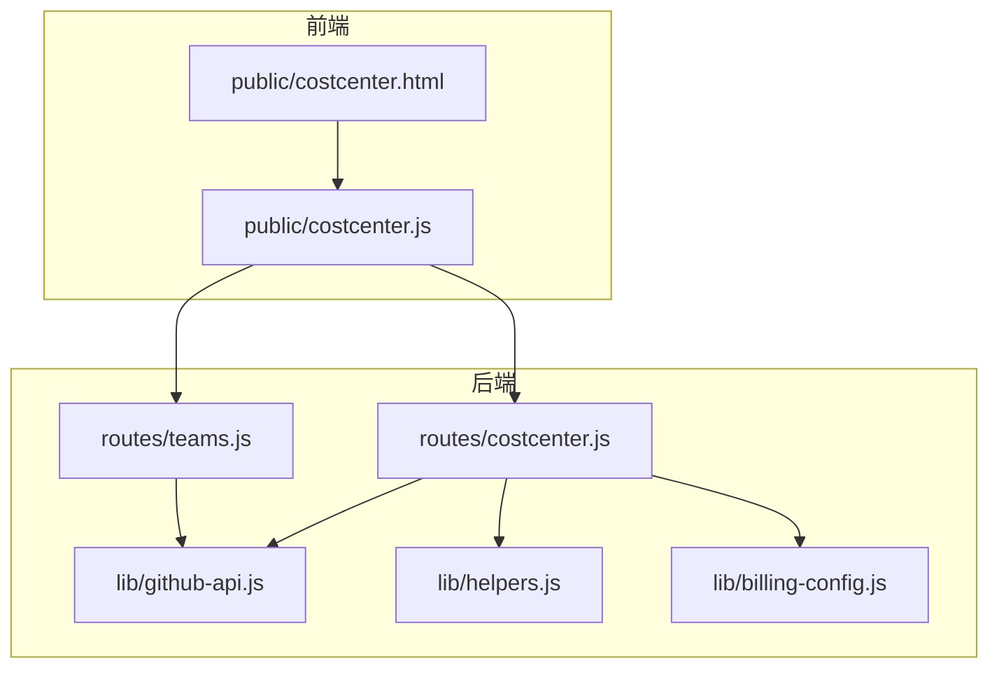
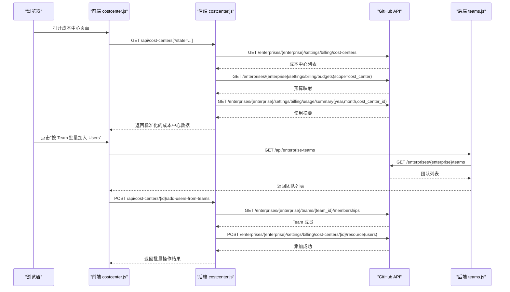
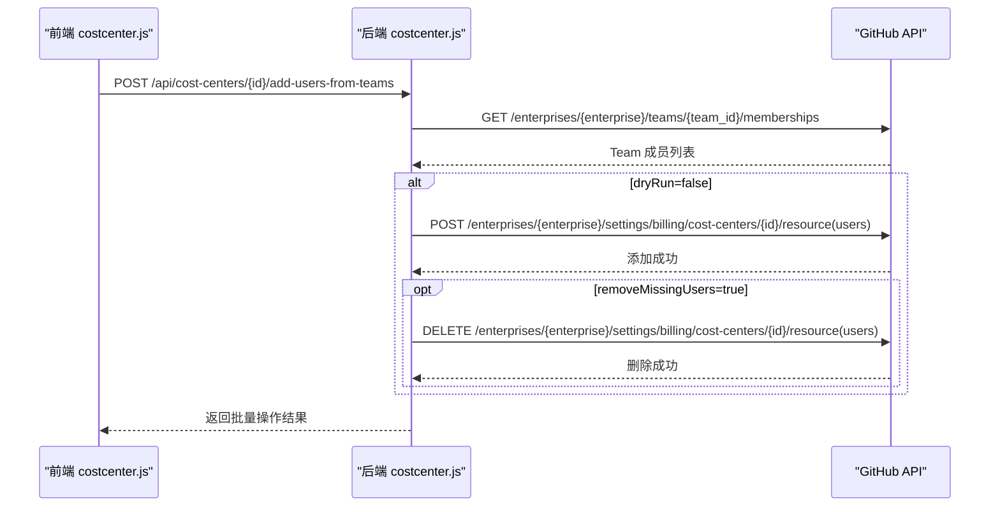
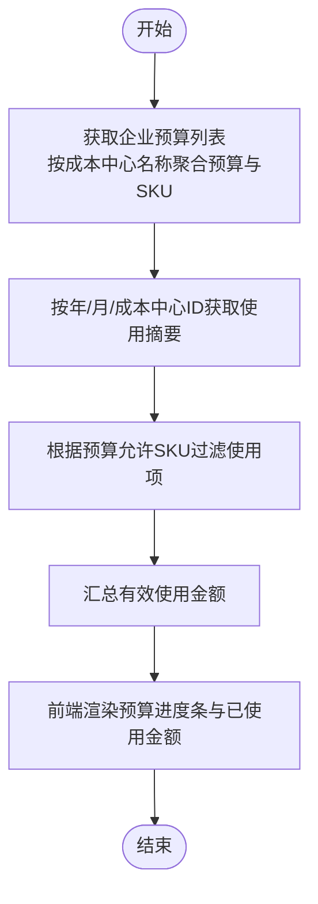
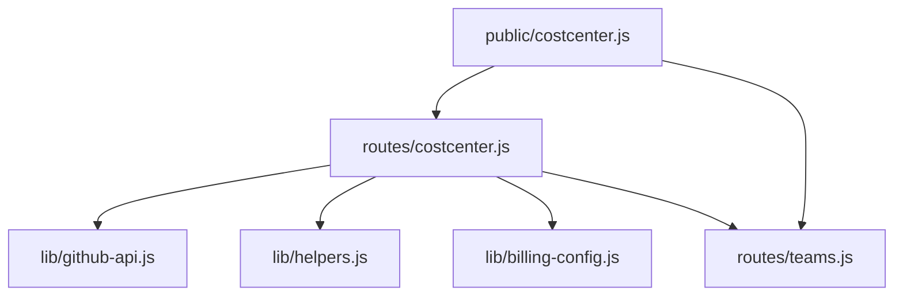

# 成本中心 API

<cite>
**本文引用的文件**
- [routes/costcenter.js](file://routes/costcenter.js)
- [public/costcenter.js](file://public/costcenter.js)
- [public/costcenter.html](file://public/costcenter.html)
- [lib/github-api.js](file://lib/github-api.js)
- [lib/helpers.js](file://lib/helpers.js)
- [lib/billing-config.js](file://lib/billing-config.js)
- [routes/teams.js](file://routes/teams.js)
- [README.md](file://README.md)
</cite>

## 目录
1. [简介](#简介)
2. [项目结构](#项目结构)
3. [核心组件](#核心组件)
4. [架构总览](#架构总览)
5. [详细组件分析](#详细组件分析)
6. [依赖分析](#依赖分析)
7. [性能考虑](#性能考虑)
8. [故障排查指南](#故障排查指南)
9. [结论](#结论)
10. [附录](#附录)

## 简介
本文件为“成本中心 API”的详细接口文档，涵盖成本中心的创建、查询、更新与删除接口说明，以及成本中心与团队的关联关系、数据同步机制、用户批量管理能力（添加、移除、状态更新）、预算控制与费用跟踪实现方法。文档还提供了成本中心数据结构定义、批量操作使用方法与注意事项，并给出完整的 API 端点说明、参数定义与实际使用示例路径。

## 项目结构
成本中心相关功能主要分布在后端路由层与前端页面脚本中：
- 后端路由：负责与 GitHub Enterprise Billing API 交互，聚合成本中心列表、详情、预算与使用情况，并提供批量用户同步接口。
- 前端页面：提供成本中心列表与详情展示、按 Team 批量加入 Users 的交互界面与结果反馈。
- 共享库：封装 GitHub API 调用、辅助函数与计费配置，支撑成本中心功能的稳定与可维护性。

图表来源
- [routes/costcenter.js:110-251](file://routes/costcenter.js#L110-L251)
- [public/costcenter.js:1-307](file://public/costcenter.js#L1-L307)
- [routes/teams.js:36-103](file://routes/teams.js#L36-L103)
- [lib/github-api.js:1-320](file://lib/github-api.js#L1-L320)
- [lib/helpers.js:1-83](file://lib/helpers.js#L1-L83)
- [lib/billing-config.js:1-25](file://lib/billing-config.js#L1-L25)

章节来源
- [routes/costcenter.js:110-251](file://routes/costcenter.js#L110-L251)
- [public/costcenter.js:1-307](file://public/costcenter.js#L1-L307)
- [routes/teams.js:36-103](file://routes/teams.js#L36-L103)
- [lib/github-api.js:1-320](file://lib/github-api.js#L1-L320)
- [lib/helpers.js:1-83](file://lib/helpers.js#L1-L83)
- [lib/billing-config.js:1-25](file://lib/billing-config.js#L1-L25)

## 核心组件
- 成本中心路由模块：提供成本中心列表查询、按名称查询、批量用户同步等接口。
- GitHub API 封装：统一处理并发、缓存、ETag 条件请求、重试与去重。
- 辅助函数：构建查询参数、端点信息、数值转换与错误处理。
- 计费配置：提供计划类型与费用计算的基础配置。
- 团队路由模块：提供企业团队列表与成员查询，支撑成本中心批量用户同步。

章节来源
- [routes/costcenter.js:110-251](file://routes/costcenter.js#L110-L251)
- [lib/github-api.js:1-320](file://lib/github-api.js#L1-L320)
- [lib/helpers.js:1-83](file://lib/helpers.js#L1-L83)
- [lib/billing-config.js:1-25](file://lib/billing-config.js#L1-L25)
- [routes/teams.js:36-103](file://routes/teams.js#L36-L103)

## 架构总览
成本中心功能的前后端交互流程如下：
- 前端页面加载后，通过路由模块发起请求获取成本中心列表或详情。
- 后端路由调用 GitHub API 获取成本中心、预算与使用摘要，并进行聚合与格式化。
- 批量用户同步接口会先拉取目标成本中心现有资源，再根据所选 Team 成员集合计算新增与可删除用户，最终通过批量资源接口进行添加或移除。

图表来源
- [routes/costcenter.js:113-171](file://routes/costcenter.js#L113-L171)
- [routes/costcenter.js:173-248](file://routes/costcenter.js#L173-L248)
- [routes/teams.js:43-62](file://routes/teams.js#L43-L62)
- [lib/github-api.js:291-301](file://lib/github-api.js#L291-L301)

章节来源
- [routes/costcenter.js:113-248](file://routes/costcenter.js#L113-L248)
- [routes/teams.js:43-62](file://routes/teams.js#L43-L62)
- [lib/github-api.js:291-301](file://lib/github-api.js#L291-L301)

## 详细组件分析

### 成本中心查询接口
- 列表查询
  - 方法与路径：GET /api/cost-centers
  - 查询参数：
    - state：可选，支持 active、deleted，用于筛选状态
  - 返回字段：
    - ok：布尔，请求是否成功
    - fetchedAt：字符串，数据抓取时间
    - enterprise：字符串，企业标识
    - seatBaseCost：数值，计划基础单价
    - total：数值，成本中心总数
    - costCenters：数组，每个元素包含：
      - id：字符串，成本中心 ID
      - name：字符串，成本中心名称
      - seatBaseCost：数值，计划基础单价
      - budgetAmount：数值或 null，预算总额
      - spentAmount：数值或 null，已使用金额
      - state：字符串，状态
      - azureSubscription：字符串，Azure 订阅标识
      - resources：数组，资源列表（包含 user、organization/repository 等）
  - 使用示例路径：
    - [GET /api/cost-centers:113-141](file://routes/costcenter.js#L113-L141)
    - [GET /enterprises/{enterprise}/settings/billing/cost-centers:121-122](file://routes/costcenter.js#L121-L122)

- 按名称查询
  - 方法与路径：GET /api/cost-centers/by-name/:name
  - 路径参数：
    - name：字符串，成本中心名称
  - 返回字段：与列表查询类似，但返回单个成本中心的详细信息
  - 使用示例路径：
    - [GET /api/cost-centers/by-name/:name:143-171](file://routes/costcenter.js#L143-L171)
    - [GET /enterprises/{enterprise}/settings/billing/cost-centers:150-151](file://routes/costcenter.js#L150-L151)

章节来源
- [routes/costcenter.js:113-171](file://routes/costcenter.js#L113-L171)

### 成本中心批量用户管理接口
- 批量添加用户（来自 Team）
  - 方法与路径：POST /api/cost-centers/:id/add-users-from-teams
  - 路径参数：
    - id：字符串，目标成本中心 ID
  - 请求体字段：
    - teamIds：数组，要同步的 Team ID 列表（至少一个）
    - dryRun：布尔，是否仅预览（不落库）
    - removeMissingUsers：布尔，执行时是否删除“Cost Center 有 / Team 无”的用户
  - 返回字段（示例路径见下方）：
    - ok：布尔
    - dryRun：布尔
    - removeMissingUsers：布尔
    - costCenter：对象，包含 id 与 name
    - selectedTeams：数组，已解析的 Team 信息
    - unresolvedTeams：数组，无法解析的 Team ID
    - requestedUsersCount：数值，请求用户总数
    - existingUsersCount：数值，已存在于成本中心的用户数
    - newUsersCount：数值，可新增用户数
    - usersToRemoveCount：数值，可删除用户数
    - existingUsers：数组，已存在用户列表
    - newUsers：数组，新增用户列表
    - usersToRemove：数组，可删除用户列表
    - addedBatches：数值，添加批次数
    - removedBatches：数值，移除批次数
    - batchSize：数值，批量大小（固定 50）
  - 使用示例路径：
    - [POST /api/cost-centers/:id/add-users-from-teams:173-248](file://routes/costcenter.js#L173-L248)
    - [POST /enterprises/{enterprise}/settings/billing/cost-centers/{id}/resource:219-233](file://routes/costcenter.js#L219-L233)

- 批量删除用户（来自 Team）
  - 当 removeMissingUsers 为 true 时，接口会在执行阶段删除“成本中心有而 Team 无”的用户。
  - 批量删除通过 DELETE 资源接口完成，批量大小同样为 50。
  - 使用示例路径：
    - [DELETE /enterprises/{enterprise}/settings/billing/cost-centers/{id}/resource:229-233](file://routes/costcenter.js#L229-L233)
    - [lib/github-api.js:297-301](file://lib/github-api.js#L297-L301)

- 前端交互流程
  - 预览变更：点击“预览变更”后，前端调用后端接口返回批量结果，展示新增、移除与已存在用户统计。
  - 确认执行：点击“确认加入 Users”后，前端再次调用后端接口，执行批量添加与可选删除。
  - 使用示例路径：
    - [public/costcenter.js:281-301](file://public/costcenter.js#L281-L301)

图表来源
- [routes/costcenter.js:173-248](file://routes/costcenter.js#L173-L248)
- [lib/github-api.js:291-301](file://lib/github-api.js#L291-L301)

章节来源
- [routes/costcenter.js:173-248](file://routes/costcenter.js#L173-L248)
- [public/costcenter.js:281-301](file://public/costcenter.js#L281-L301)
- [lib/github-api.js:291-301](file://lib/github-api.js#L291-L301)

### 成本中心与团队的关联关系与数据同步机制
- 关联关系
  - 成本中心资源包含多种类型，其中 user 类型代表用户资源。
  - 批量同步通过 Team 成员集合与成本中心现有用户集合对比，得出新增与可删除用户。
- 数据同步机制
  - 后端先获取目标成本中心的现有资源，再拉取所选 Team 的成员集合，计算差集与交集。
  - 对新增用户进行批量添加，对可删除用户进行批量移除。
  - 同步过程支持“预览模式”，通过 dryRun 参数仅返回结果而不落库。
- 使用示例路径：
  - [routes/costcenter.js:198-233](file://routes/costcenter.js#L198-L233)
  - [routes/teams.js:64-84](file://routes/teams.js#L64-L84)

章节来源
- [routes/costcenter.js:198-233](file://routes/costcenter.js#L198-L233)
- [routes/teams.js:64-84](file://routes/teams.js#L64-L84)

### 预算控制与费用跟踪实现方法
- 预算控制
  - 后端通过获取企业预算列表，按成本中心名称聚合预算金额与允许的产品 SKU 集合。
  - 使用摘要接口按年、月、成本中心 ID 查询使用金额，并结合允许 SKU 过滤有效使用项。
- 费用跟踪
  - 前端在成本中心列表与详情页展示预算进度条与已使用金额，支持按用户数计算席位订阅费。
  - 使用示例路径：
    - [routes/costcenter.js:31-62](file://routes/costcenter.js#L31-L62)
    - [routes/costcenter.js:64-90](file://routes/costcenter.js#L64-L90)
    - [lib/billing-config.js:13-22](file://lib/billing-config.js#L13-L22)
    - [public/costcenter.js:88-107](file://public/costcenter.js#L88-L107)

图表来源
- [routes/costcenter.js:31-90](file://routes/costcenter.js#L31-L90)
- [lib/billing-config.js:13-22](file://lib/billing-config.js#L13-L22)
- [public/costcenter.js:88-107](file://public/costcenter.js#L88-L107)

章节来源
- [routes/costcenter.js:31-90](file://routes/costcenter.js#L31-L90)
- [lib/billing-config.js:13-22](file://lib/billing-config.js#L13-L22)
- [public/costcenter.js:88-107](file://public/costcenter.js#L88-L107)

### 成本中心数据结构
- 成本中心对象字段
  - id：字符串，成本中心 ID
  - name：字符串，成本中心名称
  - seatBaseCost：数值，计划基础单价
  - budgetAmount：数值或 null，预算总额
  - spentAmount：数值或 null，已使用金额
  - state：字符串，状态
  - azureSubscription：字符串，Azure 订阅标识
  - resources：数组，资源列表，每项包含 type 与 name
- 预算与使用摘要
  - 预算映射：Map，键为成本中心名称（小写），值包含 amount 与 skus（Set）
  - 使用摘要：Map，键为成本中心名称（小写），值为汇总金额
- 使用示例路径：
  - [routes/costcenter.js:127-137](file://routes/costcenter.js#L127-L137)
  - [routes/costcenter.js:40-61](file://routes/costcenter.js#L40-L61)
  - [routes/costcenter.js:77-89](file://routes/costcenter.js#L77-L89)

章节来源
- [routes/costcenter.js:127-137](file://routes/costcenter.js#L127-L137)
- [routes/costcenter.js:40-61](file://routes/costcenter.js#L40-L61)
- [routes/costcenter.js:77-89](file://routes/costcenter.js#L77-L89)

### 批量操作使用方法与注意事项
- 使用方法
  - 在成本中心详情页打开“按 Team 批量加入 Users”面板，勾选一个或多个 Team，点击“预览变更”查看结果，确认后点击“确认加入 Users”执行。
  - 若存在“成本中心有 / Team 无”的用户，执行阶段会弹窗二次确认是否删除。
- 注意事项
  - teamIds 至少包含一个 Team ID。
  - dryRun 为 true 时仅返回结果，不落库。
  - removeMissingUsers 为 true 时会删除多余用户，建议谨慎使用。
  - 批量大小固定为 50，超过 50 的用户会被分批处理。
  - 使用示例路径：
    - [public/costcenter.js:281-301](file://public/costcenter.js#L281-L301)
    - [routes/costcenter.js:173-248](file://routes/costcenter.js#L173-L248)

章节来源
- [public/costcenter.js:281-301](file://public/costcenter.js#L281-L301)
- [routes/costcenter.js:173-248](file://routes/costcenter.js#L173-L248)

## 依赖分析
- 组件耦合
  - 成本中心路由依赖 GitHub API 封装与辅助函数，用于构建查询参数、端点信息与错误处理。
  - 批量用户同步接口依赖团队路由提供的企业团队列表与成员查询。
- 外部依赖
  - GitHub Enterprise Billing API：成本中心、预算、使用摘要、资源管理等。
  - 前端依赖：CopilotDashboard 命名空间提供的通用工具函数与缓存机制。

图表来源
- [routes/costcenter.js:110-251](file://routes/costcenter.js#L110-L251)
- [lib/github-api.js:1-320](file://lib/github-api.js#L1-L320)
- [lib/helpers.js:1-83](file://lib/helpers.js#L1-L83)
- [lib/billing-config.js:1-25](file://lib/billing-config.js#L1-L25)
- [routes/teams.js:36-103](file://routes/teams.js#L36-L103)
- [public/costcenter.js:1-307](file://public/costcenter.js#L1-L307)

章节来源
- [routes/costcenter.js:110-251](file://routes/costcenter.js#L110-L251)
- [lib/github-api.js:1-320](file://lib/github-api.js#L1-L320)
- [lib/helpers.js:1-83](file://lib/helpers.js#L1-L83)
- [lib/billing-config.js:1-25](file://lib/billing-config.js#L1-L25)
- [routes/teams.js:36-103](file://routes/teams.js#L36-L103)
- [public/costcenter.js:1-307](file://public/costcenter.js#L1-L307)

## 性能考虑
- 并发与去重
  - GitHub API 调用采用并发队列与单飞行去重，避免重复请求与触发二级限流。
- 缓存策略
  - LRU 缓存与 ETag 条件请求减少不必要的 API 调用；成本中心相关接口 TTL 为 3 分钟。
- 批量处理
  - 批量添加/删除用户采用分批处理（每批 50），降低单次请求压力。
- 前端渲染
  - 大表采用分片渲染与骨架屏，提升用户体验。

章节来源
- [lib/github-api.js:25-48](file://lib/github-api.js#L25-L48)
- [lib/github-api.js:58-98](file://lib/github-api.js#L58-L98)
- [routes/costcenter.js:218-233](file://routes/costcenter.js#L218-L233)
- [public/costcenter.js:125-151](file://public/costcenter.js#L125-L151)

## 故障排查指南
- 常见错误
  - Enterprise 模式未配置：当未设置 ENTERPRISE_SLUG 时，成本中心相关接口会抛出错误。
  - 缺少参数：批量同步接口缺少 teamIds 或目标成本中心 ID 时会报错。
  - GitHub API 限流：当触发速率限制时，接口会自动重试并返回友好提示。
- 排查步骤
  - 检查环境变量 ENTERPRISE_SLUG 是否正确设置。
  - 确认请求体参数是否完整（teamIds、dryRun、removeMissingUsers）。
  - 查看返回的 rateLimit 信息，必要时降低并发或等待重试。
- 使用示例路径：
  - [lib/helpers.js:58-80](file://lib/helpers.js#L58-L80)
  - [lib/github-api.js:172-227](file://lib/github-api.js#L172-L227)
  - [routes/costcenter.js:173-182](file://routes/costcenter.js#L173-L182)

章节来源
- [lib/helpers.js:58-80](file://lib/helpers.js#L58-L80)
- [lib/github-api.js:172-227](file://lib/github-api.js#L172-L227)
- [routes/costcenter.js:173-182](file://routes/costcenter.js#L173-L182)

## 结论
成本中心 API 提供了完整的成本中心查询、预算与费用跟踪能力，并通过与团队的关联实现了高效的用户批量管理。后端通过 GitHub API 封装与缓存策略保障了稳定性与性能，前端则提供了直观的交互与结果反馈。建议在生产环境中合理设置并发与批量大小，谨慎使用删除选项，并关注 GitHub API 的速率限制与缓存策略。

## 附录
- 端点一览（来自项目文档）
  - GET /api/cost-centers：获取成本中心列表
  - GET /api/cost-centers/by-name/:name：按名称获取成本中心详情
  - POST /api/cost-centers/:id/add-users-from-teams：按 Team 批量加入 Users
  - GET /api/enterprise-teams：获取企业团队列表
  - GET /api/enterprise-teams/:teamId/members：获取团队成员列表
- 使用示例路径
  - [README.md:111-127](file://README.md#L111-L127)
  - [README.md:323-376](file://README.md#L323-L376)