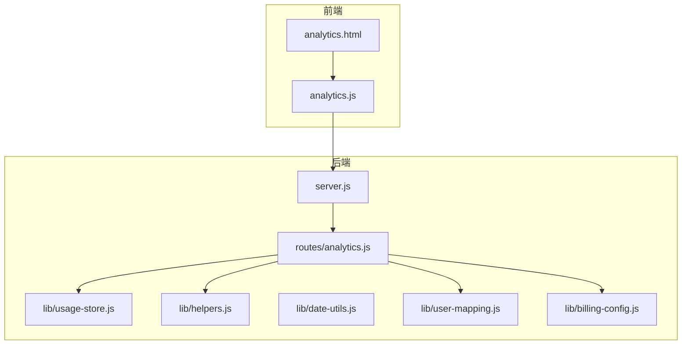
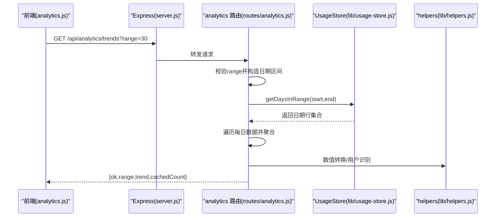
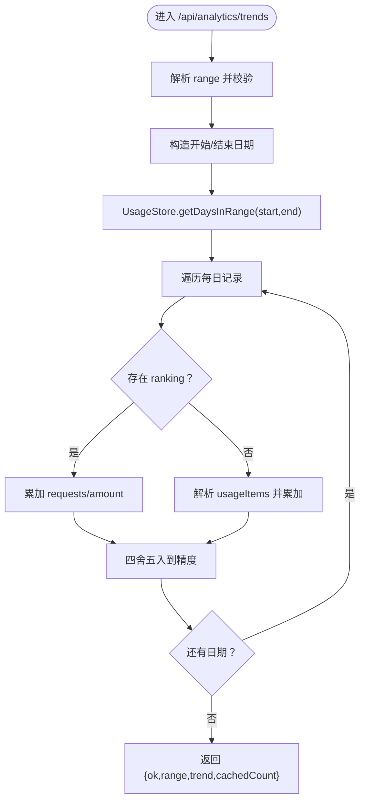
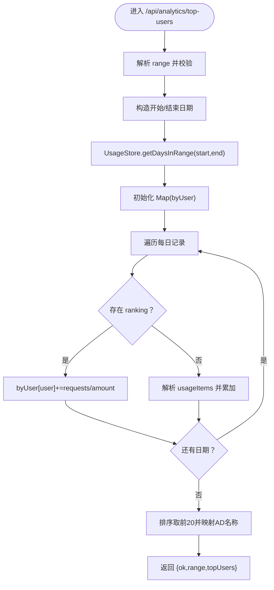
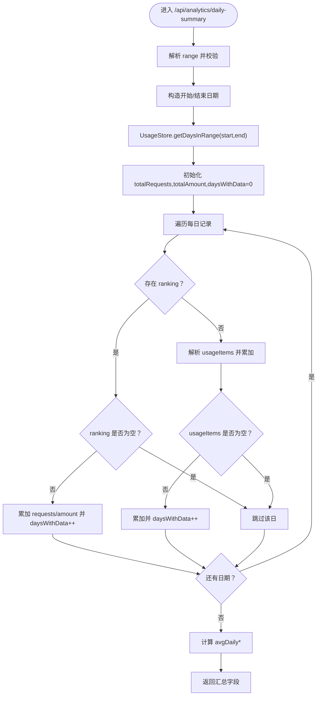
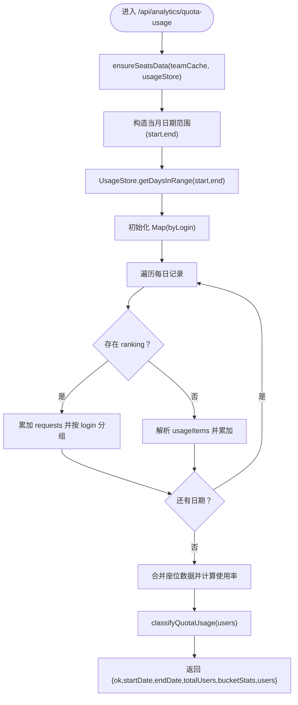
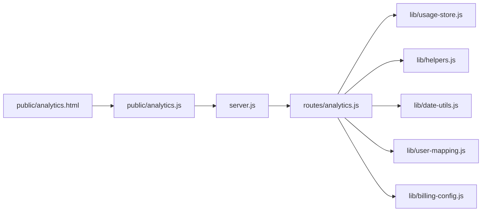

# 数据分析 API

<cite>
**本文引用的文件**
- [server.js](file://server.js)
- [routes/analytics.js](file://routes/analytics.js)
- [lib/usage-store.js](file://lib/usage-store.js)
- [lib/helpers.js](file://lib/helpers.js)
- [lib/date-utils.js](file://lib/date-utils.js)
- [lib/user-mapping.js](file://lib/user-mapping.js)
- [lib/billing-config.js](file://lib/billing-config.js)
- [public/analytics.html](file://public/analytics.html)
- [public/analytics.js](file://public/analytics.js)
- [package.json](file://package.json)
</cite>

## 更新摘要
**变更内容**
- 新增配额使用分析 API 端点：/api/analytics/quota-usage
- 添加配额使用桶分类功能，支持五个使用率区间分析
- 更新前端配额使用图表渲染和用户筛选功能
- 增强团队视角分析功能，支持按团队维度的配额使用统计

## 目录
1. [简介](#简介)
2. [项目结构](#项目结构)
3. [核心组件](#核心组件)
4. [架构总览](#架构总览)
5. [详细组件分析](#详细组件分析)
6. [依赖关系分析](#依赖关系分析)
7. [性能与优化](#性能与优化)
8. [故障排查指南](#故障排查指南)
9. [结论](#结论)
10. [附录：接口定义与使用示例](#附录接口定义与使用示例)

## 简介
本文件为"数据分析 API"的完整接口文档，覆盖趋势分析、Top 用户排行、汇总统计、配额使用分析等端点，解释数据聚合算法（按日、按周、按月）、图表数据格式与时序组织方式，以及性能优化策略（缓存与查询优化）。同时提供各统计指标的计算方法与业务含义说明，并给出前端调用与数据展示的参考路径。

## 项目结构
该服务采用 Express 作为 Web 框架，通过路由模块化组织 API；数据分析相关逻辑集中在 analytics 路由中，底层数据存储使用 SQLite（better-sqlite3），并提供按日期范围的高效查询能力；前端页面通过公共脚本发起并渲染分析结果。

**图表来源**
- [server.js:88-98](file://server.js#L88-L98)
- [routes/analytics.js:7-131](file://routes/analytics.js#L7-L131)
- [lib/usage-store.js:10-79](file://lib/usage-store.js#L10-L79)
- [lib/helpers.js:1-83](file://lib/helpers.js#L1-L83)
- [lib/date-utils.js:1-46](file://lib/date-utils.js#L1-L46)
- [lib/user-mapping.js:1-158](file://lib/user-mapping.js#L1-L158)
- [lib/billing-config.js:1-25](file://lib/billing-config.js#L1-L25)
- [public/analytics.html:1-58](file://public/analytics.html#L1-L58)
- [public/analytics.js:1-235](file://public/analytics.js#L1-L235)

**章节来源**
- [server.js:88-98](file://server.js#L88-L98)
- [routes/analytics.js:7-131](file://routes/analytics.js#L7-L131)
- [lib/usage-store.js:10-79](file://lib/usage-store.js#L10-L79)
- [public/analytics.html:1-58](file://public/analytics.html#L1-L58)
- [public/analytics.js:1-235](file://public/analytics.js#L1-L235)

## 核心组件
- 路由层：提供 /api/analytics/trends、/api/analytics/top-users、/api/analytics/daily-summary、/api/analytics/quota-usage 四个端点，负责参数校验、时间窗口构造、调用数据存储与聚合计算、返回统一结构。
- 数据存储层：UsageStore 提供 SQLite 存储与查询，支持按日期范围检索、缺失/新鲜度检查、ETag 缓存镜像等。
- 辅助工具：helpers 提供数值转换、用户识别、错误处理、配额使用桶分类；date-utils 提供日期解析与枚举；user-mapping 提供用户映射服务；billing-config 提供套餐配置。
- 前端：analytics.html 页面承载 UI 结构，analytics.js 发起并渲染趋势、Top 用户、配额使用等图表。

**章节来源**
- [routes/analytics.js:10-128](file://routes/analytics.js#L10-L128)
- [lib/usage-store.js:162-198](file://lib/usage-store.js#L162-L198)
- [lib/helpers.js:5-36](file://lib/helpers.js#L5-L36)
- [lib/date-utils.js:8-43](file://lib/date-utils.js#L8-L43)
- [lib/user-mapping.js:118-134](file://lib/user-mapping.js#L118-L134)
- [lib/billing-config.js:11-16](file://lib/billing-config.js#L11-L16)
- [public/analytics.html:17-49](file://public/analytics.html#L17-L49)
- [public/analytics.js:159-189](file://public/analytics.js#L159-L189)

## 架构总览
后端启动时挂载 analytics 路由，路由在请求到来时：
- 解析 range 参数（30/90/365），构造开始/结束日期；
- 从 UsageStore 获取指定日期范围内的记录；
- 对每日数据进行聚合：支持两种模式（ranking 或 data.payload.usageItems）；
- 返回统一响应体，前端以图表渲染。

**图表来源**
- [server.js:88-98](file://server.js#L88-L98)
- [routes/analytics.js:10-42](file://routes/analytics.js#L10-L42)
- [lib/usage-store.js:162-164](file://lib/usage-store.js#L162-L164)
- [lib/helpers.js:5-28](file://lib/helpers.js#L5-L28)

## 详细组件分析

### 趋势分析端点：/api/analytics/trends
- 请求参数
  - range：可选，单位天，默认 30；允许值 30、90、365
- 时间窗口构造
  - 结束日期为当前 UTC 日期，开始日期为结束日期减去 range-1 天
- 数据聚合
  - 若当日存在 ranking 字段，则将其视为 Top 用户排行数组，累加 requests 与 amount
  - 否则解析 data.payload.usageItems，按 netQuantity/grossQuantity/quantity/requests 与 netAmount/grossAmount/amount 选择性累加
  - 对 requests 保留两位小数，amount 保留四位小数
- 响应字段
  - ok：布尔
  - range：请求的天数
  - trend：数组，元素为 { date, requests, amount }
  - cachedCount：本次返回的 trend 长度（即所覆盖的天数）

**图表来源**
- [routes/analytics.js:10-42](file://routes/analytics.js#L10-L42)
- [lib/usage-store.js:162-164](file://lib/usage-store.js#L162-L164)
- [lib/helpers.js:5-12](file://lib/helpers.js#L5-L12)

**章节来源**
- [routes/analytics.js:10-42](file://routes/analytics.js#L10-L42)

### Top 用户排行端点：/api/analytics/top-users
- 请求参数
  - range：可选，单位天，默认 30；允许值 30、90、365
- 时间窗口构造与聚合
  - 同趋势分析，构造日期区间
  - 使用 Map 按用户聚合 requests 与 amount
  - 若存在 ranking，直接累加；否则解析 usageItems
  - 过滤 unknown 用户
  - 按 requests 降序取前 20 名
  - 使用 user-mapping 将 GitHub 用户名映射为 AD 名称
- 响应字段
  - ok：布尔
  - range：请求的天数
  - topUsers：数组，元素为 { rank, user, adName?, requests, amount }

**图表来源**
- [routes/analytics.js:44-91](file://routes/analytics.js#L44-L91)
- [lib/user-mapping.js:118-122](file://lib/user-mapping.js#L118-L122)

**章节来源**
- [routes/analytics.js:44-91](file://routes/analytics.js#L44-L91)
- [lib/user-mapping.js:118-122](file://lib/user-mapping.js#L118-L122)

### 汇总统计端点：/api/analytics/daily-summary
- 请求参数
  - range：可选，单位天，默认 30；允许值 30、90、365
- 统计口径
  - 遍历日期区间，若当日存在 ranking 则按条目累加；否则解析 usageItems
  - 计算：
    - totalRequests、totalAmount：总量
    - daysWithData：存在有效数据的天数（ranking 非空或 usageItems 非空）
    - avgDailyRequests、avgDailyAmount：按 daysWithData 计算的日均值（若为 0 则为 0）
    - totalDaysInRange：所覆盖的总天数
- 响应字段
  - ok：布尔
  - range：请求的天数
  - totalRequests、totalAmount、avgDailyRequests、avgDailyAmount、daysWithData、totalDaysInRange

**图表来源**
- [routes/analytics.js:93-128](file://routes/analytics.js#L93-L128)

**章节来源**
- [routes/analytics.js:93-128](file://routes/analytics.js#L93-L128)

### 配额使用分析端点：/api/analytics/quota-usage
- 功能概述
  - 分析当前计费周期内用户的 Copilot Premium Requests 使用情况
  - 基于套餐配额计算使用率，按五个区间进行桶分类
  - 提供用户级别的使用详情和团队维度的统计
- 请求参数
  - 无查询参数
- 时间窗口构造
  - 开始日期为当月1日，结束日期为当前日期
  - 自动获取当前计费周期的日期范围
- 数据聚合流程
  - 从 UsageStore 获取当月所有日期记录
  - 聚合每日 requests 数量：支持 ranking 模式和 usageItems 模式
  - 与座位数据（seats）结合，计算每个用户的使用率
  - 按套餐类型（business/enterprise）应用不同的配额限制
- 配额使用桶分类
  - 配额使用小于 5%
  - 配额使用 大于 5% 小于 50%
  - 配额使用 大于 50% 小于 100%
  - 配额使用 大于 100% 小于 200%
  - 配额使用 大于 200%
- 响应字段
  - ok：布尔
  - startDate：计费周期开始日期（YYYY-MM-DD）
  - endDate：计费周期结束日期（YYYY-MM-DD）
  - totalUsers：用户总数
  - bucketStats：桶统计数组，每个元素包含 { name, count, users }
  - users：用户详情数组，每个元素包含 { login, user, team, planType, requests, quota, usagePercent }

**图表来源**
- [routes/analytics.js:96-179](file://routes/analytics.js#L96-L179)
- [lib/helpers.js:148-171](file://lib/helpers.js#L148-L171)

**章节来源**
- [routes/analytics.js:96-179](file://routes/analytics.js#L96-L179)
- [lib/helpers.js:148-171](file://lib/helpers.js#L148-L171)

### 数据聚合算法与时间序列组织
- 时间序列组织
  - 以"YYYY-MM-DD"为键，按日存储；数据库提供索引 idx_daily_usage_date，支持范围查询
  - 通过 getDaysInRange(start,end) 返回有序列表，便于前端按日期绘制折线图
- 聚合模式
  - ranking 模式：当日已按用户聚合的排行数组，直接累加 requests/amount
  - data 模式：解析 usageItems，优先级 netQuantity/grossQuantity/quantity/requests 与 netAmount/grossAmount/amount
- 按周/按月汇总
  - 当前端点仅支持按日聚合；如需按周/按月，可在客户端侧对日期进行分组（例如基于 ISO 周或自然月）再进行 sum/avg 聚合
- 配额使用计算
  - 使用率 = (实际使用量 / 套餐配额) × 100%
  - 不同套餐类型有不同的配额限制：business 默认 300，enterprise 1000
  - 使用率四舍五入到百分比精度

**章节来源**
- [lib/usage-store.js:24-79](file://lib/usage-store.js#L24-L79)
- [lib/usage-store.js:162-164](file://lib/usage-store.js#L162-L164)
- [routes/analytics.js:20-38](file://routes/analytics.js#L20-L38)
- [lib/billing-config.js:11-16](file://lib/billing-config.js#L11-L16)

### 图表数据格式
- 趋势图（/api/analytics/trends）
  - 返回字段：ok、range、trend[]
  - trend 元素：{ date, requests, amount }
  - 前端以 date 为 X 轴，requests 与 amount 分别作为两条 Y 轴数据绘制折线
- Top 用户（/api/analytics/top-users）
  - 返回字段：ok、range、topUsers[]
  - topUsers 元素：{ rank, user, adName?, requests, amount }
  - 前端以 user 为横轴（水平柱状图），requests 为数值
- 配额使用分析（/api/analytics/quota-usage）
  - 返回字段：ok、startDate、endDate、totalUsers、bucketStats[]、users[]
  - bucketStats 元素：{ name, count, users[] }
  - users 元素：{ login, user, team, planType, requests, quota, usagePercent }
  - 前端使用环形图展示五个使用率桶的分布，点击桶可查看具体用户列表

**章节来源**
- [public/analytics.js:50-114](file://public/analytics.js#L50-L114)
- [public/analytics.js:117-156](file://public/analytics.js#L117-L156)
- [public/analytics.js:486-584](file://public/analytics.js#L486-L584)
- [routes/analytics.js:10-42](file://routes/analytics.js#L10-L42)
- [routes/analytics.js:44-91](file://routes/analytics.js#L44-L91)
- [routes/analytics.js:96-179](file://routes/analytics.js#L96-L179)

## 依赖关系分析
- server.js 挂载 analytics 路由，并注入 usageStore、userMappingService 单例
- analytics 路由依赖 helpers（数值/用户识别/错误处理、配额使用桶分类）、date-utils（日期工具）、UsageStore（SQLite 查询）、billing-config（套餐配置）
- 前端 analytics.html 引入 analytics.js，后者通过 C.apiFetchJson 并发拉取四个端点，分别渲染汇总卡片、趋势图、Top 用户图和配额使用图

**图表来源**
- [server.js:88-98](file://server.js#L88-L98)
- [routes/analytics.js:7-131](file://routes/analytics.js#L7-L131)
- [lib/usage-store.js:10-79](file://lib/usage-store.js#L10-L79)
- [lib/helpers.js:1-83](file://lib/helpers.js#L1-L83)
- [lib/date-utils.js:1-46](file://lib/date-utils.js#L1-L46)
- [lib/user-mapping.js:1-158](file://lib/user-mapping.js#L1-L158)
- [lib/billing-config.js:1-25](file://lib/billing-config.js#L1-L25)
- [public/analytics.html:53-55](file://public/analytics.html#L53-L55)
- [public/analytics.js:159-171](file://public/analytics.js#L159-L171)

**章节来源**
- [server.js:88-98](file://server.js#L88-L98)
- [routes/analytics.js:7-131](file://routes/analytics.js#L7-L131)
- [public/analytics.js:159-171](file://public/analytics.js#L159-L171)

## 性能与优化
- 数据存储与查询
  - SQLite 表 daily_usage 建有索引 idx_daily_usage_date，getDaysInRange 使用范围查询，时间复杂度 O(log N + M)，N 为总行数，M 为返回行数
  - 支持 getMissingDays/getFreshDays，用于发现缺失或过期数据，避免重复拉取
- 缓存策略
  - ETag 缓存：内存 LRU 与 SQLite etag_cache 双向镜像，减少重复请求
  - GitHub API 请求具备并发队列、重试与单飞去重，降低限流风险
- 前端优化
  - 并发拉取四个端点，减少等待时间
  - 使用 Chart.js 渲染，支持响应式与交互式提示
  - 配额使用图表支持点击展开用户详情列表
- 建议
  - 对于大范围查询，可考虑在客户端侧进行分页或分批渲染
  - 如需周/月聚合，可在前端进行 groupBy 操作，避免后端额外负担

**章节来源**
- [lib/usage-store.js:52-54](file://lib/usage-store.js#L52-L54)
- [lib/usage-store.js:162-198](file://lib/usage-store.js#L162-L198)
- [lib/github-api.js:67-74](file://lib/github-api.js#L67-L74)
- [public/analytics.js:166-171](file://public/analytics.js#L166-L171)

## 故障排查指南
- 常见错误
  - range 参数非法：返回 400，提示 range 必须为 30、90、365
  - GitHub API 错误：writeError 会根据 ApiError.statusCode 返回对应状态码，并在错误对象中携带 rateLimit（如有）
  - 未知错误：统一返回 500，message 为错误信息
- 日志与可观测性
  - server.js 中间件记录每次请求的 action、响应时间、状态码等
  - GitHub API 层记录速率限制与缓存命中情况
- 前端提示
  - analytics.js 在加载失败时显示错误框，成功后显示"已是最新/较旧/过期"提示
  - 配额使用图表支持用户点击桶展开详细用户列表

**章节来源**
- [routes/analytics.js:13](file://routes/analytics.js#L13)
- [lib/helpers.js:30-36](file://lib/helpers.js#L30-L36)
- [server.js:17-38](file://server.js#L17-L38)
- [lib/github-api.js:14-21](file://lib/github-api.js#L14-L21)
- [public/analytics.js:23-184](file://public/analytics.js#L23-L184)

## 结论
数据分析 API 提供了稳定、可扩展的趋势、排行、汇总与配额使用分析能力，结合 SQLite 存储与前端可视化，能够满足企业级 Copilot 使用分析场景。通过合理的参数校验、聚合策略与缓存机制，系统在准确性与性能之间取得良好平衡。新增的配额使用分析功能为企业提供了更深入的用量洞察，帮助识别超配额使用的用户并进行针对性管理。建议后续可增加按周/月聚合与数据导出能力，进一步提升分析深度与易用性。

## 附录：接口定义与使用示例

### 接口清单
- GET /api/analytics/trends
  - 查询参数：range（30/90/365，默认 30）
  - 响应：{ ok, range, trend[], cachedCount }
  - trend 元素：{ date, requests, amount }
- GET /api/analytics/top-users
  - 查询参数：range（30/90/365，默认 30）
  - 响应：{ ok, range, topUsers[] }
  - topUsers 元素：{ rank, user, adName?, requests, amount }
- GET /api/analytics/daily-summary
  - 查询参数：range（30/90/365，默认 30）
  - 响应：{ ok, range, totalRequests, totalAmount, avgDailyRequests, avgDailyAmount, daysWithData, totalDaysInRange }
- GET /api/analytics/quota-usage
  - 查询参数：无
  - 响应：{ ok, startDate, endDate, totalUsers, bucketStats[], users[] }
  - bucketStats 元素：{ name, count, users[] }
  - users 元素：{ login, user, team, planType, requests, quota, usagePercent }

### 前端调用与渲染
- 页面入口：analytics.html
- 调用方式：analytics.js 内部通过 Promise.all 并发请求四个端点，分别渲染汇总卡片、趋势图、Top 用户图和配额使用图
- 刷新与时间范围切换：点击"刷新"按钮或切换"30天/90天/1年"标签
- 配额使用图表交互：点击环形图的桶区域可展开该区间的用户列表，支持按团队筛选

**章节来源**
- [public/analytics.html:17-49](file://public/analytics.html#L17-L49)
- [public/analytics.js:159-189](file://public/analytics.js#L159-L189)
- [public/analytics.js:603-615](file://public/analytics.js#L603-L615)