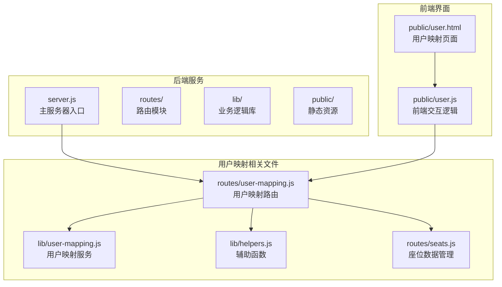
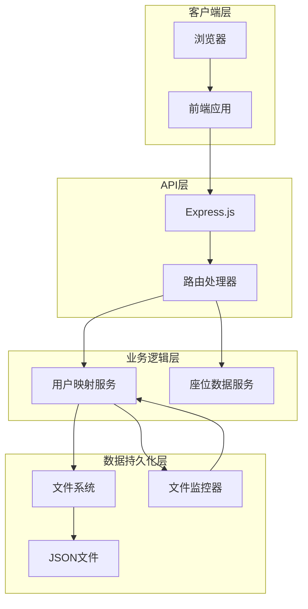
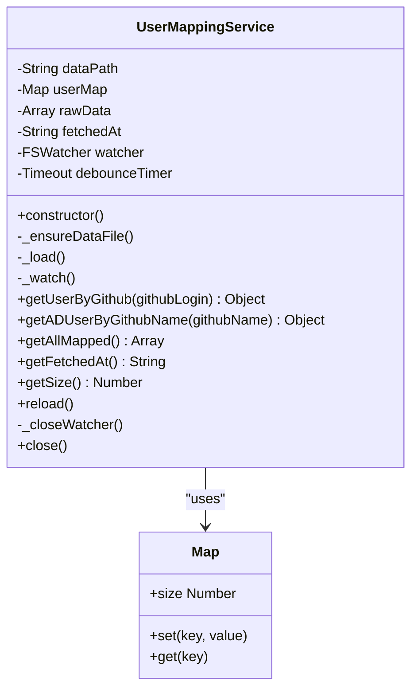
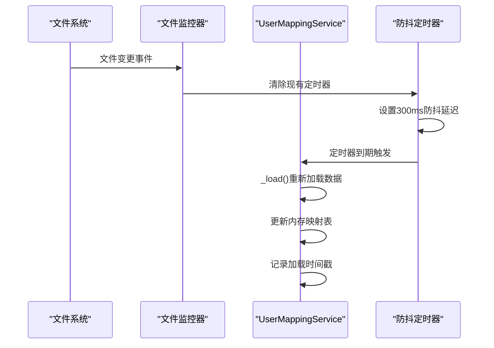
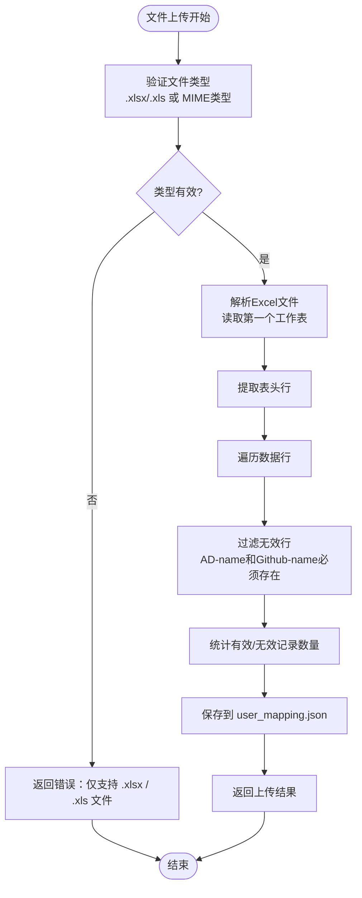
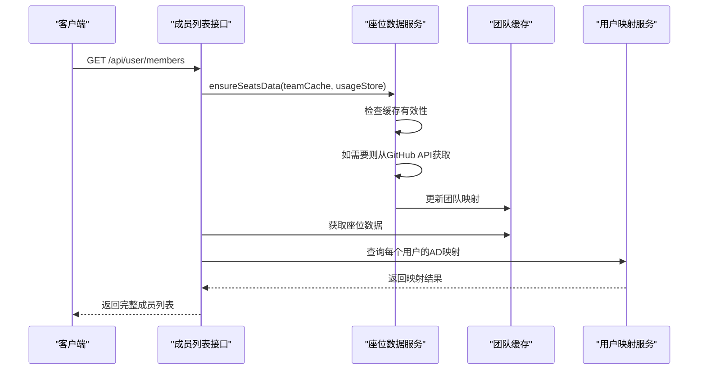
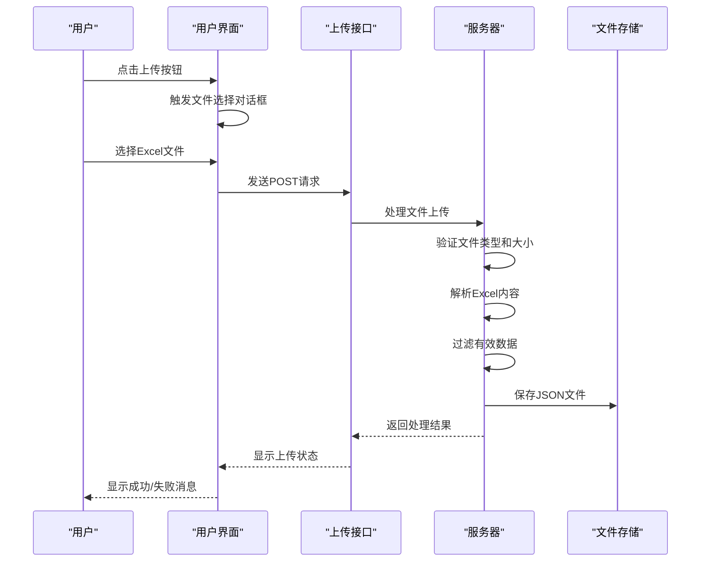
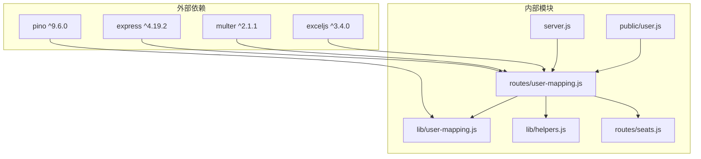
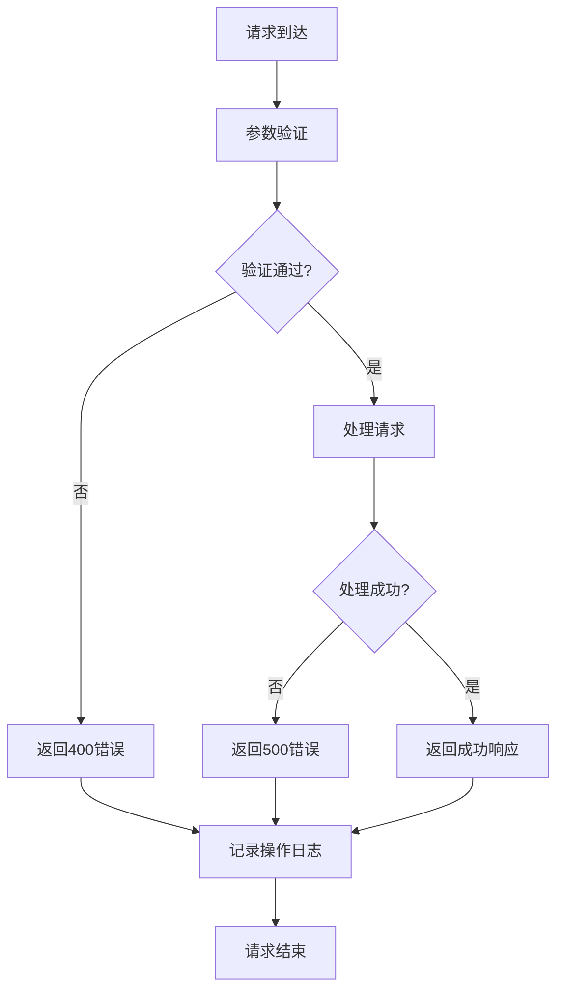

# 用户映射 API

<cite>
**本文档引用的文件**
- [routes/user-mapping.js](file://routes/user-mapping.js)
- [lib/user-mapping.js](file://lib/user-mapping.js)
- [server.js](file://server.js)
- [lib/helpers.js](file://lib/helpers.js)
- [routes/seats.js](file://routes/seats.js)
- [public/user.html](file://public/user.html)
- [public/user.js](file://public/user.js)
- [package.json](file://package.json)
</cite>

## 目录
1. [简介](#简介)
2. [项目结构](#项目结构)
3. [核心组件](#核心组件)
4. [架构概览](#架构概览)
5. [详细组件分析](#详细组件分析)
6. [依赖关系分析](#依赖关系分析)
7. [性能考虑](#性能考虑)
8. [故障排除指南](#故障排除指南)
9. [结论](#结论)

## 简介

用户映射 API 是 GitHub Copilot 企业版用量展示仪表板中的核心功能模块，负责管理用户身份映射关系。该模块提供了完整的用户映射文件上传、热重载、成员列表查询和映射状态查询功能，支持将 GitHub 用户名与 Active Directory (AD) 用户名进行关联，以便进行更精确的用量统计和分析。

## 项目结构

用户映射功能主要分布在以下目录结构中：



**图表来源**
- [server.js:1-182](file://server.js#L1-L182)
- [routes/user-mapping.js:1-135](file://routes/user-mapping.js#L1-L135)
- [lib/user-mapping.js:1-158](file://lib/user-mapping.js#L1-L158)

**章节来源**
- [server.js:88-99](file://server.js#L88-L99)
- [package.json:1-26](file://package.json#L1-L26)

## 核心组件

### 用户映射服务 (UserMappingService)

用户映射服务是单例模式的类，负责管理用户映射数据的加载、存储和查询。它实现了自动热重载机制，通过文件系统监控实现数据的实时更新。

### 路由处理器 (User Mapping Router)

路由处理器提供四个主要接口：
- 映射文件上传接口
- 手动重载接口  
- 成员列表查询接口
- 映射状态查询接口

### 前端交互层

前端提供了直观的用户界面，支持文件上传、手动重载、成员列表刷新和排序功能。

**章节来源**
- [lib/user-mapping.js:7-22](file://lib/user-mapping.js#L7-L22)
- [routes/user-mapping.js:12-135](file://routes/user-mapping.js#L12-L135)
- [public/user.html:1-54](file://public/user.html#L1-L54)

## 架构概览

用户映射系统的整体架构采用分层设计，确保了良好的可维护性和扩展性：



**图表来源**
- [server.js:40-48](file://server.js#L40-L48)
- [lib/user-mapping.js:98-116](file://lib/user-mapping.js#L98-L116)
- [routes/user-mapping.js:12-135](file://routes/user-mapping.js#L12-L135)

## 详细组件分析

### 用户映射服务 (UserMappingService)

用户映射服务是整个系统的核心，实现了以下关键功能：

#### 数据结构设计



**图表来源**
- [lib/user-mapping.js:7-158](file://lib/user-mapping.js#L7-L158)

#### 热重载机制

服务实现了基于文件系统监控的热重载机制：



**图表来源**
- [lib/user-mapping.js:98-116](file://lib/user-mapping.js#L98-L116)
- [lib/user-mapping.js:140-142](file://lib/user-mapping.js#L140-L142)

#### 数据验证规则

服务在加载数据时实施严格的验证规则：

| 字段 | 必需性 | 验证规则 | 处理方式 |
|------|--------|----------|----------|
| AD-name | 必需 | 非空字符串，去除首尾空白 | 保留有效条目 |
| Github-name | 必需 | 非空字符串，去除首尾空白 | 保留有效条目 |
| AD-mail | 可选 | 字符串，去除首尾空白 | 保留或为空 |
| Github-mail | 可选 | 字符串，去除首尾空白 | 保留或为空 |

**章节来源**
- [lib/user-mapping.js:50-76](file://lib/user-mapping.js#L50-L76)

### 路由处理器 (User Mapping Router)

路由处理器提供了四个核心接口，每个接口都有明确的功能和响应格式。

#### 映射文件上传接口

**接口定义**
- 方法：POST
- 路径：`/user/upload-members`
- 内容类型：multipart/form-data
- 表单字段：`file` (必需)

**文件格式要求**

虽然代码中支持 `.xlsx` 和 `.xls` 格式，但实际数据存储格式为 JSON：



**图表来源**
- [routes/user-mapping.js:24-35](file://routes/user-mapping.js#L24-L35)
- [routes/user-mapping.js:79-94](file://routes/user-mapping.js#L79-L94)

**响应格式**
```javascript
{
  "ok": true,
  "message": "成功 X 条，跳过 Y 条",
  "totalRows": 100,
  "validRows": 95,
  "skipped": 5,
  "fileName": "user_mapping.xlsx"
}
```

**章节来源**
- [routes/user-mapping.js:79-94](file://routes/user-mapping.js#L79-L94)

#### 手动重载接口

**接口定义**
- 方法：POST
- 路径：`/user/reload-mapping`

**功能说明**
手动触发映射数据的重新加载，通常用于强制刷新从文件系统读取的数据。

**响应格式**
```javascript
{
  "ok": true,
  "message": "映射数据已加载",
  "count": 100,
  "fetchedAt": "2024-01-01T00:00:00.000Z"
}
```

**章节来源**
- [routes/user-mapping.js:97-102](file://routes/user-mapping.js#L97-L102)

#### 成员列表查询接口

**接口定义**
- 方法：GET
- 路径：`/api/user/members`

**功能说明**
获取完整的成员列表，包含 GitHub 用户信息和对应的 AD 映射信息。

**数据更新策略**
该接口在查询前会确保座位数据的最新性，通过 `ensureSeatsData` 函数实现：



**图表来源**
- [routes/user-mapping.js:105-122](file://routes/user-mapping.js#L105-L122)
- [routes/seats.js:37-75](file://routes/seats.js#L37-L75)

**响应格式**
```javascript
{
  "ok": true,
  "loadedAt": "2024-01-01T00:00:00.000Z",
  "total": 100,
  "mappedCount": 95,
  "members": [
    {
      "login": "john.doe",
      "team": "Engineering,DevOps",
      "adName": "John Doe",
      "adMail": "john.doe@company.com",
      "planType": "business",
      "lastActivityAt": "2024-01-01T10:00:00Z"
    }
  ]
}
```

**章节来源**
- [routes/user-mapping.js:105-122](file://routes/user-mapping.js#L105-L122)

#### 映射状态查询接口

**接口定义**
- 方法：GET
- 路径：`/api/user/info`
- 查询参数：`github` (必需)

**功能说明**
根据 GitHub 用户名查询对应的 AD 映射信息。

**响应格式**
```javascript
// 成功响应
{
  "ok": true,
  "githubName": "john.doe",
  "adName": "John Doe",
  "adMail": "john.doe@company.com",
  "githubMail": "john.doe@github.com"
}

// 未找到映射
{
  "ok": false,
  "message": "未找到映射记录",
  "githubName": "john.doe"
}
```

**章节来源**
- [routes/user-mapping.js:125-131](file://routes/user-mapping.js#L125-L131)

### 前端交互组件

前端提供了完整的用户界面，支持文件上传、手动重载、成员列表刷新和排序功能。

#### 文件上传流程



**图表来源**
- [public/user.js:209-248](file://public/user.js#L209-L248)
- [routes/user-mapping.js:79-94](file://routes/user-mapping.js#L79-L94)

#### 成员列表管理

前端实现了完整的成员列表管理功能，包括：
- 分页显示（每页15条记录）
- 排序功能（按用户名、团队、AD名称等排序）
- 实时映射状态显示
- 错误处理和状态反馈

**章节来源**
- [public/user.html:17-46](file://public/user.html#L17-L46)
- [public/user.js:164-203](file://public/user.js#L164-L203)

## 依赖关系分析

用户映射系统的关键依赖关系如下：



**图表来源**
- [package.json:12-21](file://package.json#L12-L21)
- [server.js:3-8](file://server.js#L3-L8)

### 关键依赖说明

| 依赖包 | 版本 | 用途 |
|--------|------|------|
| express | ^4.19.2 | Web应用框架 |
| multer | ^2.1.1 | 文件上传处理 |
| exceljs | ^3.4.0 | Excel文件解析 |
| pino | ^9.6.0 | 日志记录 |
| lru-cache | ^10.4.3 | 缓存管理 |

**章节来源**
- [package.json:12-21](file://package.json#L12-L21)

## 性能考虑

### 文件处理性能

- **文件大小限制**：最大支持10MB的Excel文件
- **内存使用**：Excel解析在服务器端完成，避免客户端内存压力
- **并发处理**：Multer配置支持单文件上传，避免并发冲突

### 数据访问优化

- **缓存策略**：座位数据使用LRU缓存，减少GitHub API调用
- **防抖机制**：文件监控使用300ms防抖，避免频繁重载
- **懒加载**：映射数据按需加载，启动时只初始化基础结构

### 响应时间优化

- **异步处理**：所有I/O操作都是异步的
- **错误快速返回**：验证失败立即返回错误
- **状态码规范**：使用标准HTTP状态码

## 故障排除指南

### 常见问题及解决方案

#### 文件上传失败

**问题症状**：上传后返回错误信息

**可能原因**：
1. 文件类型不支持（非 .xlsx/.xls）
2. 文件大小超过限制（>10MB）
3. Excel文件格式损坏
4. 服务器磁盘空间不足

**解决步骤**：
1. 确认文件扩展名为 `.xlsx` 或 `.xls`
2. 检查文件大小是否小于10MB
3. 使用Excel重新保存文件
4. 检查服务器磁盘空间

**相关代码位置**：
- [routes/user-mapping.js:24-35](file://routes/user-mapping.js#L24-L35)
- [routes/user-mapping.js:79-94](file://routes/user-mapping.js#L79-L94)

#### 映射数据不更新

**问题症状**：上传新文件后查询仍显示旧数据

**可能原因**：
1. 文件监控器异常
2. 文件权限问题
3. JSON文件格式错误

**解决步骤**：
1. 手动触发重载：POST `/user/reload-mapping`
2. 检查文件监控日志
3. 验证JSON文件格式
4. 重启服务

**相关代码位置**：
- [lib/user-mapping.js:98-116](file://lib/user-mapping.js#L98-L116)
- [routes/user-mapping.js:97-102](file://routes/user-mapping.js#L97-L102)

#### 成员列表查询失败

**问题症状**：获取成员列表时报错

**可能原因**：
1. GitHub API连接失败
2. 缓存数据过期
3. 权限不足

**解决步骤**：
1. 检查GitHub API连接状态
2. 等待缓存自动刷新
3. 验证GitHub访问令牌
4. 检查企业版配置

**相关代码位置**：
- [routes/user-mapping.js:105-122](file://routes/user-mapping.js#L105-L122)
- [routes/seats.js:37-75](file://routes/seats.js#L37-L75)

### 错误处理机制

系统实现了多层次的错误处理：



**相关代码位置**：
- [lib/helpers.js:30-36](file://lib/helpers.js#L30-L36)
- [server.js:120-139](file://server.js#L120-L139)

### 日志记录

系统使用Pino日志库记录关键操作和错误信息：

| 日志级别 | 用途 | 示例消息 |
|----------|------|----------|
| info | 正常操作 | "UserMappingService: loaded mappings" |
| warn | 警告信息 | "UserMappingService: fs.watch error, falling back" |
| error | 错误信息 | "UserMappingService: failed to load data" |
| fatal | 致命错误 | "Uncaught exception" |

**相关代码位置**：
- [lib/user-mapping.js:81-90](file://lib/user-mapping.js#L81-L90)
- [server.js:120-139](file://server.js#L120-L139)

## 结论

用户映射 API 提供了一个完整、可靠的用户身份映射解决方案。其特点包括：

1. **完整的功能覆盖**：支持文件上传、热重载、成员查询和映射查询
2. **健壮的错误处理**：多层验证和错误处理机制
3. **高效的性能设计**：防抖机制、缓存策略和异步处理
4. **友好的用户体验**：直观的前端界面和清晰的状态反馈
5. **可扩展的架构**：模块化设计便于功能扩展

该系统特别适合需要将GitHub Copilot使用数据与企业身份管理系统集成的场景，为企业级用户管理和计费提供了坚实的技术基础。