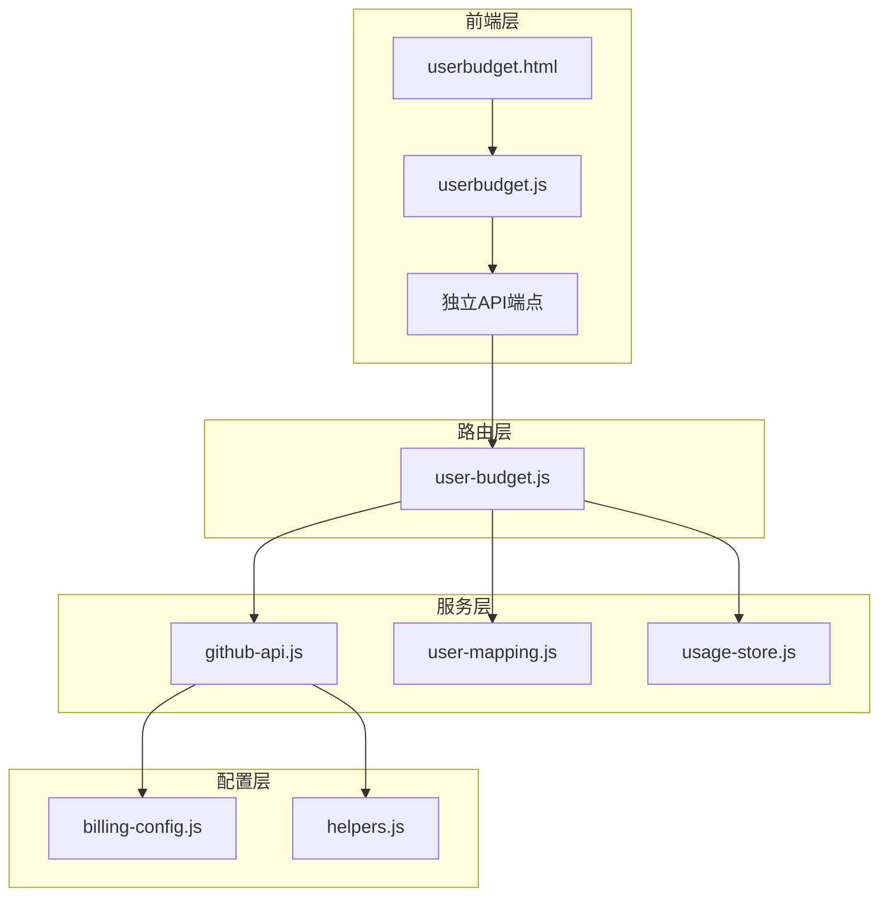
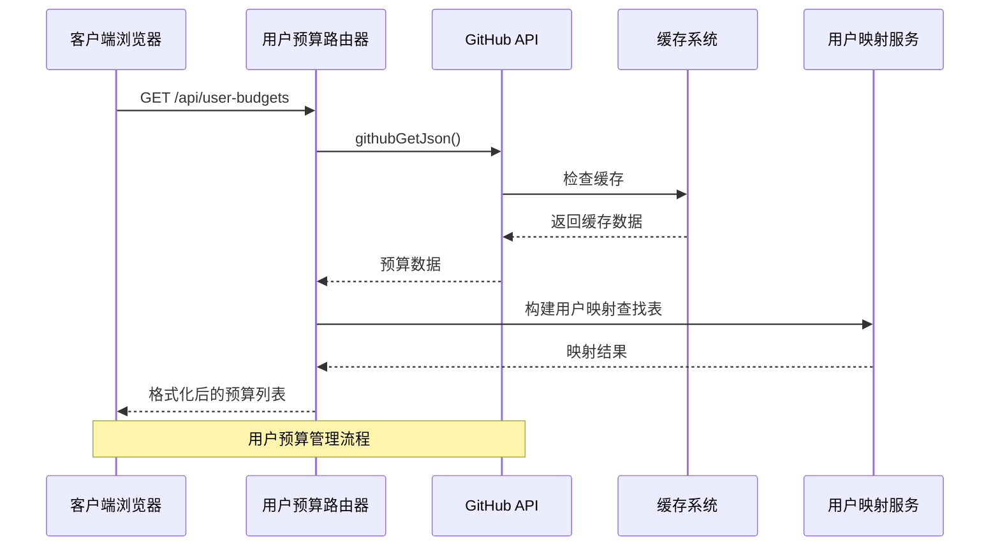
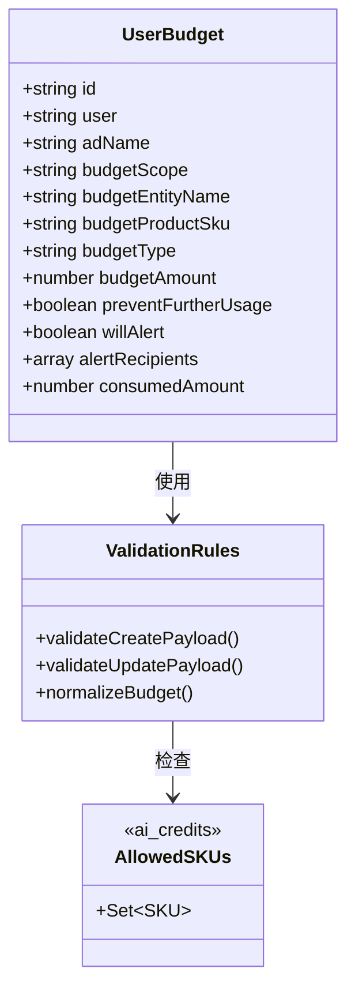
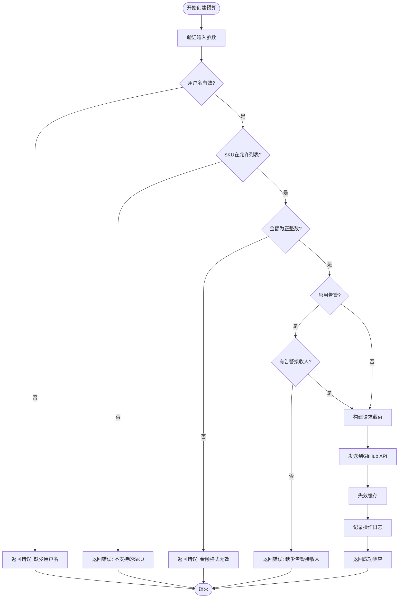
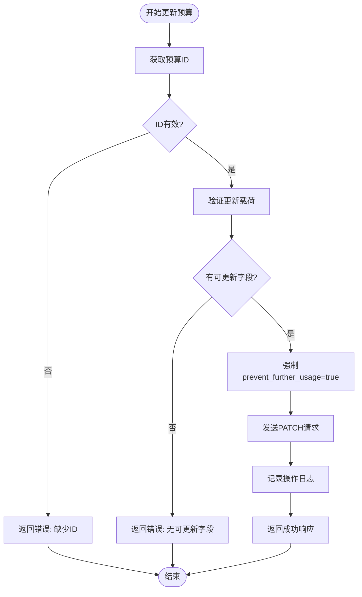
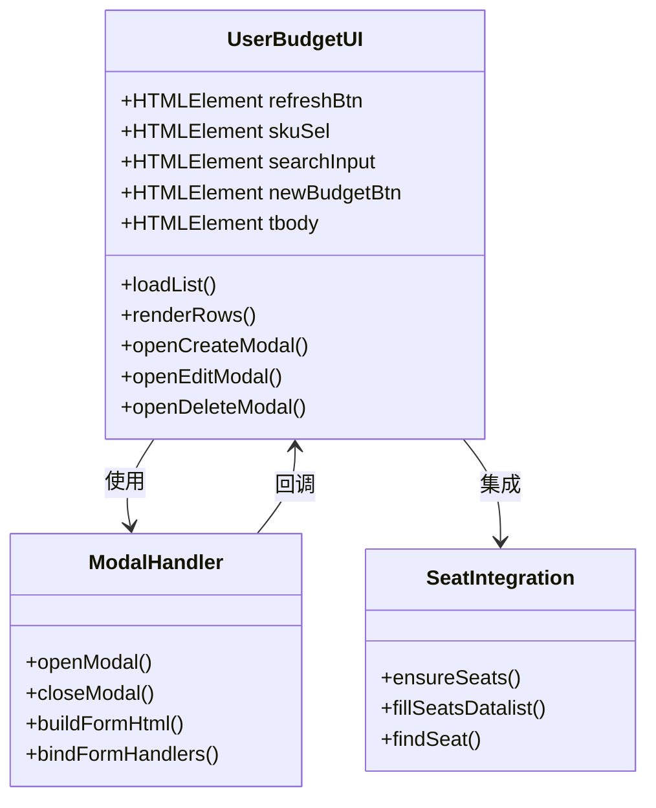
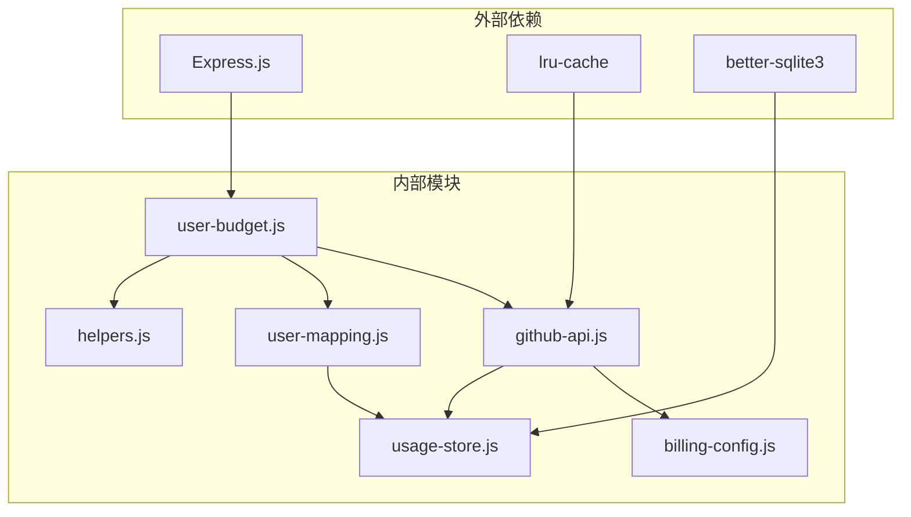

# 用户预算API

<cite>
**本文档引用的文件**
- [routes/user-budget.js](file://routes/user-budget.js)
- [public/userbudget.js](file://public/userbudget.js)
- [public/userbudget.html](file://public/userbudget.html)
- [lib/github-api.js](file://lib/github-api.js)
- [lib/user-mapping.js](file://lib/user-mapping.js)
- [lib/helpers.js](file://lib/helpers.js)
- [lib/billing-config.js](file://lib/billing-config.js)
- [lib/usage-store.js](file://lib/usage-store.js)
- [server.js](file://server.js)
- [README.md](file://README.md)
</cite>

## 更新摘要
**变更内容**
- 新增独立的用户预算管理API端点（GET/POST/PATCH/DELETE）
- 增强的前端界面集成，提供独立的用户预算管理页面
- README.md版本信息更新为v3.7，强调用户预算管理的独立性
- 强调用户预算管理与成本中心预算界面的分离

## 目录
1. [简介](#简介)
2. [项目结构](#项目结构)
3. [核心组件](#核心组件)
4. [架构概览](#架构概览)
5. [详细组件分析](#详细组件分析)
6. [依赖关系分析](#依赖关系分析)
7. [性能考虑](#性能考虑)
8. [故障排除指南](#故障排除指南)
9. [结论](#结论)

## 简介

用户预算API是Copilot企业版用量管理系统的核心功能模块，专门用于管理基于用户的预算控制。该API允许管理员为每个GitHub用户设置AI信用额度或高级请求的预算限制，提供实时监控和告警功能，确保企业Copilot使用成本的可控性。

**更新** 该模块现已提供独立的管理界面，与成本中心预算界面完全分离，支持完整的CRUD操作（创建、读取、更新、删除）以及用户映射集成，提供直观的Web界面管理体验。

系统采用Express.js框架构建，通过GitHub Enterprise Billing API进行预算管理，支持独立的用户预算管理页面，提供用户级预算的精细化控制能力。

## 项目结构

用户预算API位于项目的路由层，与前端界面和后端服务紧密集成：

**图表来源**
- [routes/user-budget.js:1-215](file://routes/user-budget.js#L1-L215)
- [public/userbudget.js:1-333](file://public/userbudget.js#L1-L333)
- [lib/github-api.js:1-334](file://lib/github-api.js#L1-L334)

**章节来源**
- [server.js:147-159](file://server.js#L147-L159)
- [routes/user-budget.js:119-214](file://routes/user-budget.js#L119-L214)

## 核心组件

### 路由处理器 (User Budget Router)

用户预算路由处理器提供了完整的RESTful API接口，支持以下操作：

- **GET /api/user-budgets** - 获取所有用户预算列表（包含AD名称映射）
- **GET /api/user-budgets/:id** - 获取特定预算详情（包含consumed_amount）
- **POST /api/user-budgets** - 创建新预算
- **PATCH /api/user-budgets/:id** - 更新现有预算（仅允许更新金额和告警设置）
- **DELETE /api/user-budgets/:id** - 删除预算

### 独立管理界面

提供独立的Web界面，包含：
- 预算列表展示和筛选（支持SKU和搜索过滤）
- 实时预算进度条显示（基于consumed_amount）
- 创建/编辑/删除模态框
- 用户搜索和过滤功能
- 与席位数据的集成（通过/datalist自动补全）

### GitHub API集成

通过专用的GitHub API客户端处理：
- 并发队列管理
- 重试和退避机制
- 缓存和ETag支持
- 单次飞行去重

**章节来源**
- [routes/user-budget.js:4-10](file://routes/user-budget.js#L4-L10)
- [public/userbudget.html:17-54](file://public/userbudget.html#L17-L54)

## 架构概览

用户预算API采用分层架构设计，确保职责分离和可维护性：

**图表来源**
- [routes/user-budget.js:126-141](file://routes/user-budget.js#L126-L141)
- [lib/github-api.js:237-275](file://lib/github-api.js#L237-L275)

## 详细组件分析

### 数据模型和验证

用户预算的数据结构设计简洁而完整：

**图表来源**
- [routes/user-budget.js:36-54](file://routes/user-budget.js#L36-L54)
- [routes/user-budget.js:76-117](file://routes/user-budget.js#L76-L117)

### API工作流程

#### 预算创建流程

**图表来源**
- [routes/user-budget.js:160-182](file://routes/user-budget.js#L160-L182)
- [routes/user-budget.js:76-92](file://routes/user-budget.js#L76-L92)

#### 预算更新流程

**图表来源**
- [routes/user-budget.js:184-197](file://routes/user-budget.js#L184-L197)
- [routes/user-budget.js:94-117](file://routes/user-budget.js#L94-L117)

### 前端交互组件

#### 预算管理界面

**图表来源**
- [public/userbudget.js:5-333](file://public/userbudget.js#L5-L333)

**章节来源**
- [public/userbudget.js:45-78](file://public/userbudget.js#L45-L78)
- [public/userbudget.js:131-194](file://public/userbudget.js#L131-L194)

## 依赖关系分析

### 组件间依赖

用户预算API的依赖关系清晰明确：

**图表来源**
- [routes/user-budget.js:11-22](file://routes/user-budget.js#L11-L22)
- [lib/github-api.js:8-10](file://lib/github-api.js#L8-L10)

### 关键依赖特性

1. **GitHub API客户端**：提供并发控制、重试机制和缓存支持
2. **用户映射服务**：支持GitHub用户名到AD名称的转换
3. **缓存系统**：基于ETag的智能缓存和失效机制
4. **配置管理**：灵活的企业级配置选项

**章节来源**
- [lib/github-api.js:25-48](file://lib/github-api.js#L25-L48)
- [lib/user-mapping.js:7-22](file://lib/user-mapping.js#L7-L22)

## 性能考虑

### 缓存策略

系统实现了多层次的缓存机制：

- **LRU缓存**：最多缓存500个GET请求结果
- **ETag缓存**：持久化存储到SQLite数据库
- **预算专用缓存**：预算相关接口15分钟TTL
- **单次飞行去重**：避免重复请求相同资源

### 并发控制

- 最大并发GitHub API请求：默认3个
- 指数退避重试：最多3次重试
- 请求队列管理：智能排队避免过载

### 内存优化

- SQLite数据库：高效的数据持久化
- 文件系统监控：自动检测配置文件变化
- 响应式UI：前端懒加载和虚拟滚动

## 故障排除指南

### 常见问题诊断

#### GitHub API连接问题

**症状**：API请求失败，返回403或429状态码

**解决方案**：
1. 检查GITHUB_TOKEN环境变量配置
2. 验证GitHub Enterprise访问权限
3. 查看速率限制状态和剩余配额

#### 预算创建失败

**症状**：创建预算时报错"缺少GitHub登录名"

**解决方案**：
1. 确保用户已在GitHub上存在
2. 验证用户映射文件配置正确
3. 检查预算金额格式（必须为正整数）

#### 前端界面异常

**症状**：页面加载失败或功能不可用

**解决方案**：
1. 检查网络连接和CORS配置
2. 验证会话认证状态
3. 清除浏览器缓存重新加载

**章节来源**
- [lib/github-api.js:178-233](file://lib/github-api.js#L178-L233)
- [lib/helpers.js:30-36](file://lib/helpers.js#L30-L36)

## 结论

用户预算API是一个设计精良的企业级预算管理解决方案，具有以下优势：

1. **完整的功能覆盖**：支持所有必要的预算管理操作
2. **可靠的架构设计**：分层架构确保了良好的可维护性
3. **优秀的用户体验**：直观的Web界面和实时反馈
4. **强大的扩展性**：模块化设计便于功能扩展
5. **完善的错误处理**：全面的错误捕获和恢复机制
6. **独立管理界面**：与成本中心预算界面完全分离，避免作用域混淆

**更新** 该API为企业提供了精细化的Copilot使用成本控制能力，通过灵活的预算设置和实时监控，帮助企业有效管理AI工具使用成本，同时保持良好的用户体验。v3.7版本的独立管理页面进一步增强了用户预算管理的可用性和管理效率。