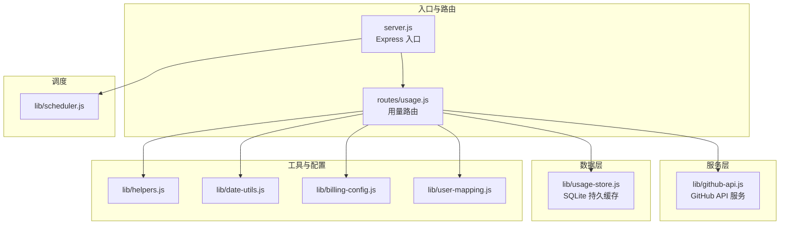
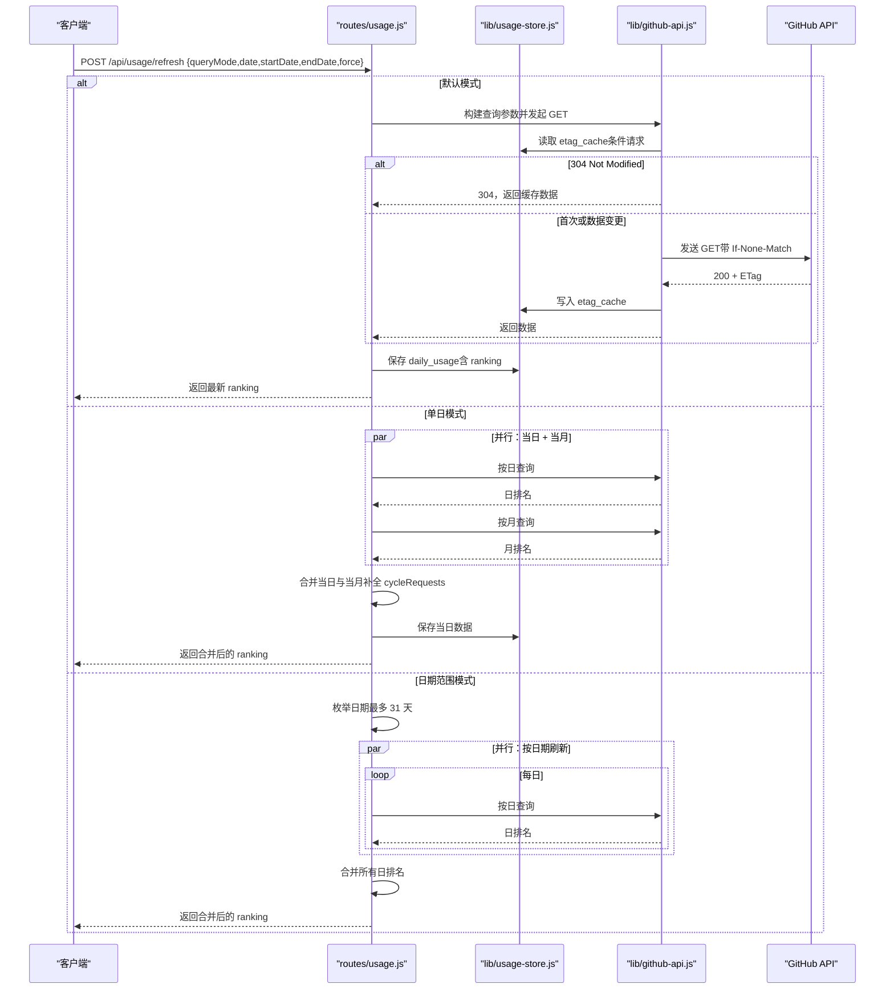
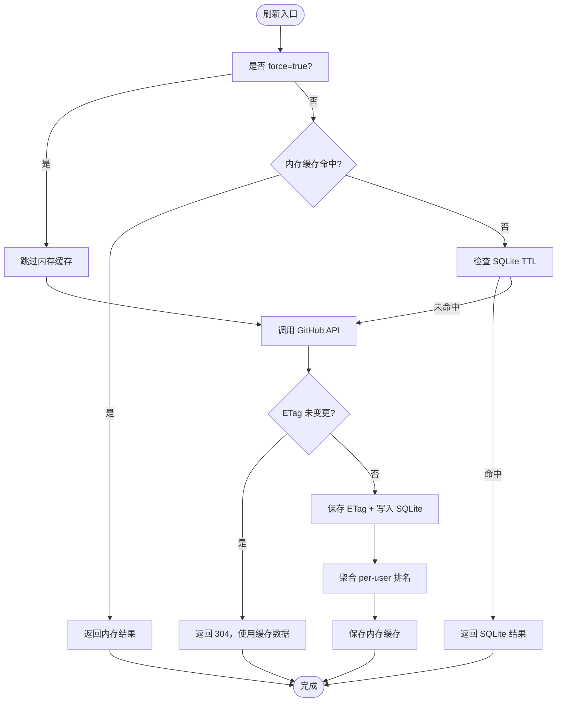
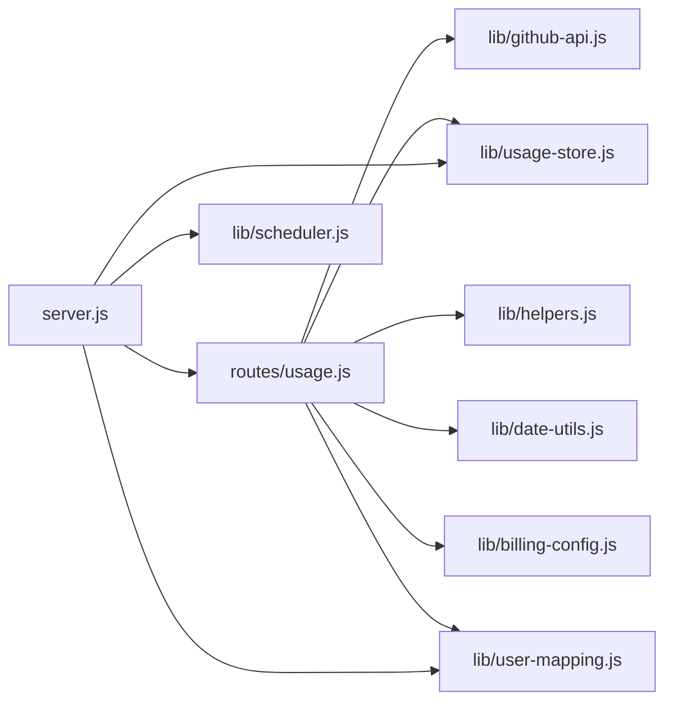

# 用量查询 API

<cite>
**本文引用的文件**
- [routes/usage.js](file://routes/usage.js)
- [lib/usage-store.js](file://lib/usage-store.js)
- [lib/github-api.js](file://lib/github-api.js)
- [lib/helpers.js](file://lib/helpers.js)
- [lib/date-utils.js](file://lib/date-utils.js)
- [lib/billing-config.js](file://lib/billing-config.js)
- [lib/user-mapping.js](file://lib/user-mapping.js)
- [lib/scheduler.js](file://lib/scheduler.js)
- [server.js](file://server.js)
- [README.md](file://README.md)
</cite>

## 目录
1. [简介](#简介)
2. [项目结构](#项目结构)
3. [核心组件](#核心组件)
4. [架构总览](#架构总览)
5. [详细组件分析](#详细组件分析)
6. [依赖关系分析](#依赖关系分析)
7. [性能考量](#性能考量)
8. [故障排查指南](#故障排查指南)
9. [结论](#结论)
10. [附录](#附录)

## 简介
本文件为用量查询 API 的详细接口文档，聚焦两个核心端点：
- GET /api/usage：返回当前内存中的最新用量排行与元数据
- POST /api/usage/refresh：刷新用量数据，支持三种查询模式（默认、单日、日期范围），并可强制回源覆盖缓存

文档还涵盖：
- 查询参数与模式说明（queryMode、date、startDate、endDate、force）
- 返回数据结构（ranking 数组字段含义）
- 缓存机制（内存缓存、SQLite 持久缓存、ETag 条件请求）
- per-user-fallback 降级机制与数据完整性保障
- 请求与响应示例、错误处理说明

## 项目结构
后端采用模块化分层架构，用量查询相关的关键模块如下：
- 路由层：routes/usage.js 提供 /api/usage 与 /api/usage/refresh
- 服务层：lib/github-api.js 提供 GitHub API 并发队列、LRU 缓存、ETag 条件请求、单次飞行去重
- 数据层：lib/usage-store.js 提供 SQLite 持久缓存（daily_usage、etag_cache、monthly_bill 等）
- 工具与配置：lib/helpers.js、lib/date-utils.js、lib/billing-config.js、lib/user-mapping.js
- 入口与调度：server.js、lib/scheduler.js



图表来源
- [server.js:1-182](file://server.js#L1-L182)
- [routes/usage.js:1-470](file://routes/usage.js#L1-L470)
- [lib/github-api.js:1-320](file://lib/github-api.js#L1-L320)
- [lib/usage-store.js:1-324](file://lib/usage-store.js#L1-L324)
- [lib/helpers.js:1-83](file://lib/helpers.js#L1-L83)
- [lib/date-utils.js:1-46](file://lib/date-utils.js#L1-L46)
- [lib/billing-config.js:1-25](file://lib/billing-config.js#L1-L25)
- [lib/user-mapping.js:1-158](file://lib/user-mapping.js#L1-L158)
- [lib/scheduler.js:1-160](file://lib/scheduler.js#L1-L160)

章节来源
- [server.js:1-182](file://server.js#L1-L182)
- [routes/usage.js:1-470](file://routes/usage.js#L1-L470)

## 核心组件
- 用量路由（routes/usage.js）
  - 提供 GET /api/usage：返回内存中的最新状态（fetchedAt、source、rawItemsCount、mode、ranking、includedQuota 等）
  - 提供 POST /api/usage/refresh：根据 queryMode 刷新数据，支持默认、单日、日期范围三种模式，并可强制回源
- GitHub API 服务（lib/github-api.js）
  - 并发队列与单次飞行去重，GET LRU 缓存，ETag 条件请求，重试与指数退避
- SQLite 持久缓存（lib/usage-store.js）
  - daily_usage 表存储每日原始数据、模式、原始计数、来源、抓取时间与 per-user 排名
  - etag_cache 表持久化 ETag，支持重启恢复
  - monthly_bill 表存储月度账单
- 工具与配置（lib/helpers.js、lib/date-utils.js、lib/billing-config.js、lib/user-mapping.js）
  - 辅助函数（数值转换、用户识别、构建查询参数与端点）
  - 日期工具（解析、枚举、构建日期键）
  - 计费配置（配额、单价、金额计算）
  - 用户映射（AD 名称映射）
- 调度器（lib/scheduler.js）
  - 启动后刷新当天数据，每天固定时间刷新最近 N 天，避免 GitHub API 延迟导致的“锁死”

章节来源
- [routes/usage.js:1-470](file://routes/usage.js#L1-L470)
- [lib/github-api.js:1-320](file://lib/github-api.js#L1-L320)
- [lib/usage-store.js:1-324](file://lib/usage-store.js#L1-L324)
- [lib/helpers.js:1-83](file://lib/helpers.js#L1-L83)
- [lib/date-utils.js:1-46](file://lib/date-utils.js#L1-L46)
- [lib/billing-config.js:1-25](file://lib/billing-config.js#L1-L25)
- [lib/user-mapping.js:1-158](file://lib/user-mapping.js#L1-L158)
- [lib/scheduler.js:1-160](file://lib/scheduler.js#L1-L160)

## 架构总览
用量查询的典型调用链路如下：



图表来源
- [routes/usage.js:387-462](file://routes/usage.js#L387-L462)
- [lib/github-api.js:231-269](file://lib/github-api.js#L231-L269)
- [lib/usage-store.js:137-160](file://lib/usage-store.js#L137-L160)

## 详细组件分析

### GET /api/usage
- 功能：返回当前内存中的最新用量排行与元数据
- 响应字段
  - ok：布尔，请求是否成功
  - fetchedAt：字符串，本次刷新时间（ISO 8601）
  - source：字符串，数据来源（如 enterprise:slug 或 org:name）
  - rawItemsCount：整数，原始用量项数量
  - mode：字符串，数据来源模式（direct、per-user-fallback、sqlite-cycle）
  - dateLabel：字符串，日期标签（默认模式为“年-月（可带日）”）
  - queryMode：字符串，查询模式（default、single、range）
  - ranking：数组，每条包含
    - rank：整数，排名
    - user：字符串，GitHub 用户名
    - requests：数值，该用户请求量（保留两位小数）
    - amount：数值，按计划计算的金额（保留四位小数）
  - includedQuota：数值，包含配额（来自配置）

请求示例
- GET /api/usage

响应示例
- 200 OK
```json
{
  "ok": true,
  "fetchedAt": "2026-04-28T12:00:00Z",
  "source": "enterprise:your-enterprise",
  "rawItemsCount": 1234,
  "mode": "direct",
  "dateLabel": "2026-04",
  "queryMode": "default",
  "ranking": [
    {
      "rank": 1,
      "user": "alice",
      "requests": 123.45,
      "amount": 23.4567
    }
  ],
  "includedQuota": 300
}
```

章节来源
- [routes/usage.js:378-385](file://routes/usage.js#L378-L385)

### POST /api/usage/refresh
- 功能：刷新用量数据，支持三种查询模式与可选强制回源
- 请求体字段
  - queryMode：字符串，查询模式
    - default：默认模式（当前月）
    - single：单日模式（需提供 date）
    - range：日期范围模式（需提供 startDate、endDate）
  - date：字符串，YYYY-MM-DD，单日模式必填
  - startDate：字符串，YYYY-MM-DD，日期范围模式必填
  - endDate：字符串，YYYY-MM-DD，日期范围模式必填
  - force：布尔或字符串，是否强制回源（跳过内存与 SQLite TTL）
- 响应字段
  - ok：布尔，请求是否成功
  - fetchedAt：字符串，本次刷新时间
  - source：字符串，数据来源
  - rawItemsCount：整数，原始用量项数量
  - mode：字符串，数据来源模式
  - dateLabel：字符串，日期标签
  - queryMode：字符串，实际使用的查询模式
  - ranking：数组，每条包含
    - rank：整数，排名
    - user：字符串，GitHub 用户名
    - requests：数值，该用户请求量
    - amount：数值，按计划计算的金额
  - includedQuota：数值，包含配额
  - cacheHitRatio：整数，缓存命中百分比（0-100）

请求示例
- 默认模式
  - POST /api/usage/refresh
  - Body: {}
- 单日模式
  - POST /api/usage/refresh
  - Body: {"queryMode":"single","date":"2026-04-28"}
- 日期范围模式
  - POST /api/usage/refresh
  - Body: {"queryMode":"range","startDate":"2026-04-26","endDate":"2026-04-28"}
- 强制回源
  - POST /api/usage/refresh
  - Body: {"queryMode":"single","date":"2026-04-28","force":true}

响应示例
- 200 OK
```json
{
  "ok": true,
  "fetchedAt": "2026-04-28T12:00:00Z",
  "source": "enterprise:your-enterprise",
  "rawItemsCount": 1234,
  "mode": "direct",
  "dateLabel": "2026-04-28",
  "queryMode": "single",
  "ranking": [
    {
      "rank": 1,
      "user": "alice",
      "requests": 123.45,
      "amount": 23.4567
    }
  ],
  "includedQuota": 300,
  "cacheHitRatio": 75
}
```

错误处理
- 参数非法：如日期格式错误、日期范围超过 31 天、缺少必要字段
- GitHub API 错误：速率限制、403/429、5xx 等，统一包装为 ApiError 并返回友好消息
- per-user fallback 失败：日排名为空但原始项存在时触发，失败会记录错误但不影响整体返回

章节来源
- [routes/usage.js:387-462](file://routes/usage.js#L387-L462)
- [lib/github-api.js:14-21](file://lib/github-api.js#L14-L21)
- [lib/helpers.js:30-36](file://lib/helpers.js#L30-L36)

### 查询参数与模式详解
- queryMode
  - default：默认模式，查询当前月（受 BILLING_YEAR/MONTH/DAY 环境变量影响）
  - single：单日模式，需提供 date（YYYY-MM-DD）
  - range：日期范围模式，需提供 startDate、endDate（最多 31 天）
- date：YYYY-MM-DD，单日模式必填
- startDate/endDate：YYYY-MM-DD，范围模式必填
- force：布尔或字符串，true/1/"true"/"1" 等均视为强制回源
- 环境变量
  - BILLING_YEAR/MONTH/DAY：决定默认查询的年、月、日
  - PRODUCT/MODEL：过滤产品与模型
  - ENTERPRISE_SLUG/ORG_NAME：决定 GitHub API 端点（enterprise 或 org）

章节来源
- [routes/usage.js:392-443](file://routes/usage.js#L392-L443)
- [lib/helpers.js:38-82](file://lib/helpers.js#L38-L82)
- [README.md:196-217](file://README.md#L196-L217)

### 返回数据结构详解
- ranking 数组中的字段
  - rank：整数，用户在该周期内的排名
  - user：字符串，GitHub 用户名
  - requests：数值，该用户请求量（保留两位小数）
  - amount：数值，按计划计算的金额（保留四位小数）
- 其他字段
  - fetchedAt：字符串，本次刷新时间
  - source：字符串，数据来源（如 enterprise:slug 或 org:name）
  - rawItemsCount：整数，原始用量项数量
  - mode：字符串，数据来源模式（direct、per-user-fallback、sqlite-cycle）
  - dateLabel：字符串，日期标签
  - queryMode：字符串，实际使用的查询模式
  - includedQuota：数值，包含配额

章节来源
- [routes/usage.js:28-53](file://routes/usage.js#L28-L53)
- [routes/usage.js:378-385](file://routes/usage.js#L378-L385)

### 缓存机制
- 三层缓存体系
  - 内存缓存（refreshCache）：5 分钟 TTL，存放最近查询的 ranking
  - SQLite 持久缓存（daily_usage）：动态 TTL
    - 近 3 天：1 小时 TTL（应对 GitHub API 24–48h 延迟）
    - 更老：90 天 TTL
  - GitHub API：ETag 条件请求，数据未变返回 304 Not Modified
- ETag 条件请求
  - 内存 etagCache + SQLite etag_cache 双层镜像
  - 首次启动从 SQLite 恢复 ETag，随后在内存与 SQLite 之间同步
- 单次飞行去重（in-flight dedup）
  - 对相同参数的并发请求只发起一次，其余复用同一 Promise



图表来源
- [routes/usage.js:237-348](file://routes/usage.js#L237-L348)
- [lib/github-api.js:231-269](file://lib/github-api.js#L231-L269)
- [lib/usage-store.js:137-160](file://lib/usage-store.js#L137-L160)

章节来源
- [routes/usage.js:11-18](file://routes/usage.js#L11-L18)
- [routes/usage.js:258-267](file://routes/usage.js#L258-L267)
- [lib/github-api.js:67-74](file://lib/github-api.js#L67-L74)
- [lib/usage-store.js:6-8](file://lib/usage-store.js#L6-L8)

### per-user-fallback 降级机制与数据完整性
- 何时触发
  - direct 模式下，若返回的 ranking 为空但原始 usageItems 非空，且已知用户列表存在，则按用户逐个查询并聚合
  - 单日模式下，若 SQLite 缓存的 ranking 为空但原始项存在，触发 per-user-fallback 并写回 SQLite
- 数据完整性保障
  - buildCycleFromSQLite 三重校验（coverage、recency、non-empty ranking）不满足则降级到 GitHub API
  - 月末天数计算修复（UTC 时区），避免漏掉最后一天
  - 近端 3 天模式必须为 per-user-fallback，避免后台聚合未完成的中间态导致“当日请求量 > 本周期请求量”的矛盾

章节来源
- [routes/usage.js:289-348](file://routes/usage.js#L289-L348)
- [routes/usage.js:134-235](file://routes/usage.js#L134-L235)
- [README.md:485-491](file://README.md#L485-L491)

### 日期模式与范围
- 默认模式：当前月（受 BILLING_YEAR/MONTH/DAY 环境变量影响）
- 单日模式：按日查询，同时并行获取当月 cycleRequests，合并返回
- 日期范围模式：最多 31 天，按日期枚举并行刷新，最终合并 ranking

章节来源
- [routes/usage.js:398-443](file://routes/usage.js#L398-L443)
- [lib/date-utils.js:19-33](file://lib/date-utils.js#L19-L33)

### 计费与配额
- includedQuota：包含配额（默认 300）
- PLAN_CONFIG：business（300/19）、enterprise（1000/39）
- amount 计算：requests ≤ quota → 基础价；否则 基础价 + 超额 × 单价

章节来源
- [lib/billing-config.js:11-22](file://lib/billing-config.js#L11-L22)
- [routes/usage.js:74-91](file://routes/usage.js#L74-L91)

### 用户映射与团队信息
- userMappingService：将 GitHub 用户名映射为 AD 展示名
- teamCache：包含用户团队映射与席位信息，用于 percentage 与 team 字段

章节来源
- [lib/user-mapping.js:118-122](file://lib/user-mapping.js#L118-L122)
- [routes/usage.js:69-91](file://routes/usage.js#L69-L91)

## 依赖关系分析
- routes/usage.js 依赖
  - lib/github-api.js：GitHub API 调用、ETag、LRU 缓存、单次飞行去重
  - lib/usage-store.js：SQLite 持久缓存（daily_usage、etag_cache）
  - lib/helpers.js：参数构建、用户识别、错误封装
  - lib/date-utils.js：日期解析与枚举
  - lib/billing-config.js：配额与金额计算
  - lib/user-mapping.js：用户映射
- server.js 依赖
  - routes/usage.js：用量路由
  - lib/usage-store.js：SQLite 实例
  - lib/user-mapping.js：用户映射服务
  - lib/scheduler.js：自动刷新调度器



图表来源
- [routes/usage.js:1-470](file://routes/usage.js#L1-L470)
- [server.js:1-182](file://server.js#L1-L182)

章节来源
- [routes/usage.js:1-470](file://routes/usage.js#L1-L470)
- [server.js:1-182](file://server.js#L1-L182)

## 性能考量
- 并发控制：GitHub API 并发队列（默认 3），避免触发二级限流
- 单次飞行去重：相同参数的并发请求只发起一次
- 缓存策略：内存（5 分钟）→ SQLite（动态 TTL）→ GitHub API，显著减少 API 调用
- 动态 TTL：近 3 天 1 小时，更老 90 天，避免 GitHub 延迟导致的“锁死”
- 批量刷新：范围模式按最大并发并行，提升吞吐
- 自动刷新：启动后立即刷新当天，每天固定时间刷新最近 N 天

章节来源
- [lib/github-api.js:25-48](file://lib/github-api.js#L25-L48)
- [routes/usage.js:396-414](file://routes/usage.js#L396-L414)
- [lib/scheduler.js:54-157](file://lib/scheduler.js#L54-L157)

## 故障排查指南
- 速率限制
  - 现象：429/403 rate limit
  - 处理：自动指数退避重试，等待 resetAt 或 retry-after
- 304 Not Modified
  - 现象：数据未变更，返回 304
  - 处理：使用缓存数据，不消耗 API 额度
- per-user fallback 失败
  - 现象：日排名为空但原始项存在，触发 per-user fallback
  - 处理：失败会记录错误，但不影响整体返回
- 缓存命中率低
  - 现象：cacheHitRatio 低
  - 处理：检查 force 参数、ETag 是否正确、SQLite 是否损坏
- 日期范围超过 31 天
  - 现象：报错“日期范围不能超过 31 天”
  - 处理：缩短范围或改用默认/单日模式

章节来源
- [lib/github-api.js:172-227](file://lib/github-api.js#L172-L227)
- [routes/usage.js:398-401](file://routes/usage.js#L398-L401)
- [routes/usage.js:297-307](file://routes/usage.js#L297-L307)

## 结论
用量查询 API 通过三层缓存与 ETag 条件请求，结合 per-user-fallback 降级与数据完整性校验，实现了高可用、高性能的用量排行查询能力。默认模式、单日模式与日期范围模式覆盖了常见使用场景，配合强制回源与自动刷新调度器，既能满足日常快速浏览，也能在数据异常时进行精准修复。

## 附录
- 环境变量参考
  - GITHUB_TOKEN、ENTERPRISE_SLUG、BILLING_YEAR、BILLING_MONTH、BILLING_DAY、PRODUCT、MODEL、CACHE_TTL、GITHUB_MAX_CONCURRENT、GITHUB_MAX_RETRIES、GITHUB_API_BASE、PORT、SCHED_DISABLED、SCHED_DAILY_TIMES、SCHED_BACKFILL_DAYS、SCHED_STARTUP_DELAY_MS
- 相关端点
  - GET /api/health：健康检查
  - POST /api/bill/refresh：按月强制刷新（Team 月度账单）
  - GET /api/seats：Copilot 席位数据
  - GET /api/teams：Teams 列表
  - GET /api/analytics/trends：趋势数据
  - GET /api/analytics/top-users：Top 用户排行
  - GET /api/analytics/daily-summary：每日汇总

章节来源
- [README.md:196-217](file://README.md#L196-L217)
- [README.md:111-127](file://README.md#L111-L127)