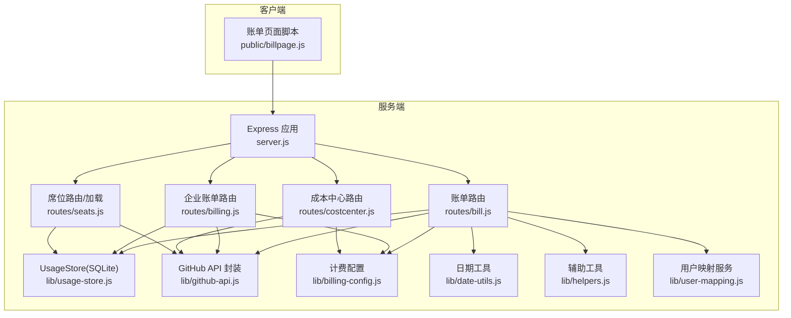
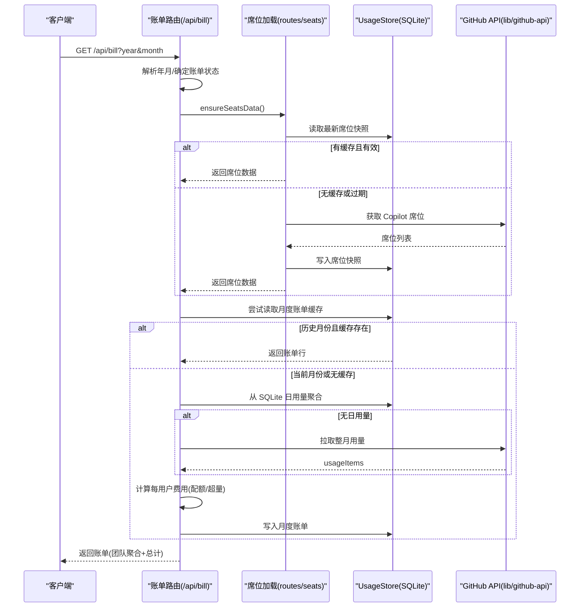
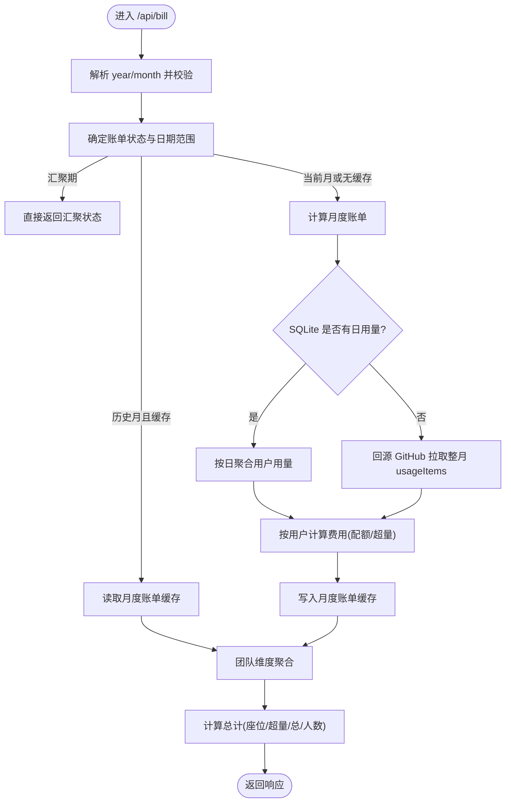
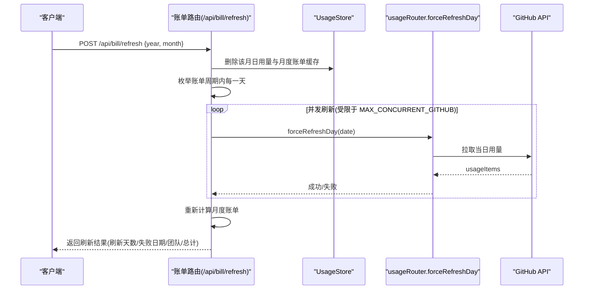
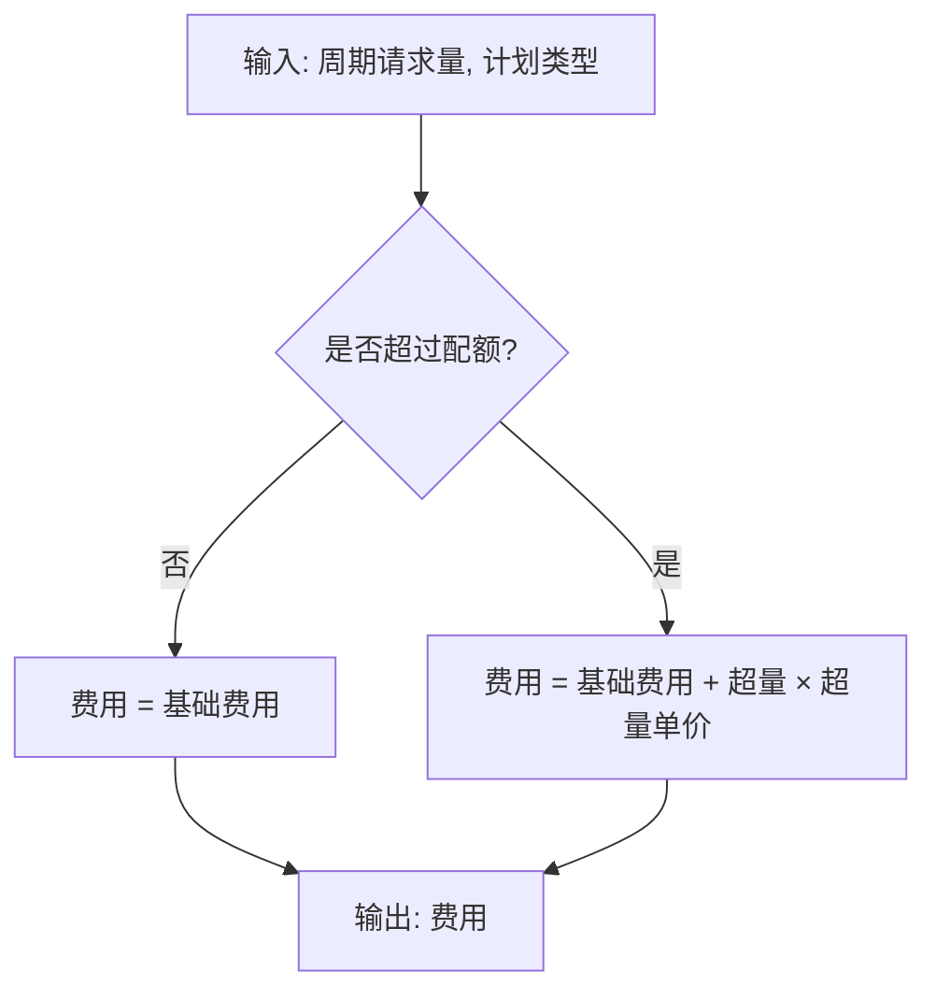
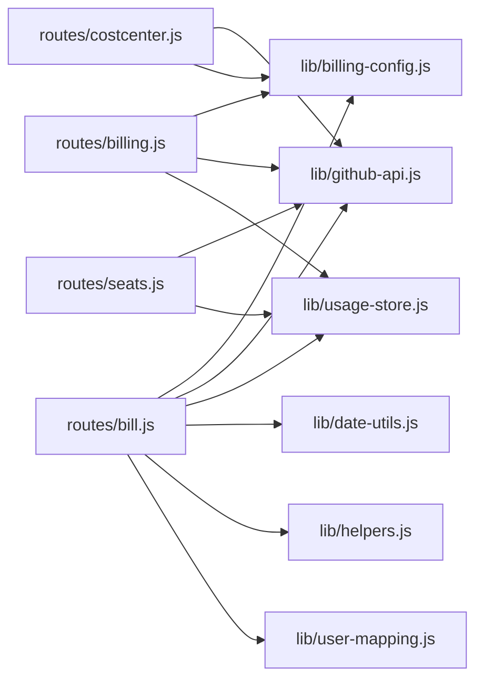

# 账单管理 API

<cite>
**本文引用的文件列表**
- [server.js](file://server.js)
- [routes/bill.js](file://routes/bill.js)
- [routes/billing.js](file://routes/billing.js)
- [routes/costcenter.js](file://routes/costcenter.js)
- [routes/seats.js](file://routes/seats.js)
- [lib/billing-config.js](file://lib/billing-config.js)
- [lib/usage-store.js](file://lib/usage-store.js)
- [lib/github-api.js](file://lib/github-api.js)
- [lib/helpers.js](file://lib/helpers.js)
- [lib/date-utils.js](file://lib/date-utils.js)
- [lib/user-mapping.js](file://lib/user-mapping.js)
- [public/billpage.js](file://public/billpage.js)
</cite>

## 目录
1. [简介](#简介)
2. [项目结构](#项目结构)
3. [核心组件](#核心组件)
4. [架构总览](#架构总览)
5. [详细组件分析](#详细组件分析)
6. [依赖关系分析](#依赖关系分析)
7. [性能与缓存策略](#性能与缓存策略)
8. [故障排查指南](#故障排查指南)
9. [结论](#结论)
10. [附录：API 定义与响应示例](#附录api-定义与响应示例)

## 简介
本文件为“账单管理 API”的权威接口文档，覆盖以下主题：
- 费用计算逻辑：不同计划类型的配额、单价与超量计费规则
- 月度账单生成流程：数据聚合、团队维度分析、历史数据对比
- 强制刷新功能：使用场景、参数与执行过程
- 成本控制与预算管理：预算查询、预算与实际消耗对比
- 账单数据结构：团队信息、用户明细与费用汇总
- 账单导出能力：前端页面导出流程与格式说明
- 完整 API 端点说明、参数定义与响应示例

## 项目结构
后端基于 Express，路由模块化组织，核心账单相关模块如下：
- 路由层：账单路由、企业账单概览、成本中心路由、席位数据加载等
- 业务配置：计费配置与计划类型常量
- 数据存储：SQLite 缓存（每日用量、月度账单、ETag 缓存、席位快照）
- 外部集成：GitHub API 封装（并发、重试、ETag 条件请求、LRU 缓存）
- 辅助工具：日期工具、参数构建、错误处理
- 前端页面：账单页 JS 实现查询、强制刷新与渲染

图表来源
- [server.js:88-99](file://server.js#L88-L99)
- [routes/bill.js:13-406](file://routes/bill.js#L13-L406)
- [routes/billing.js:10-105](file://routes/billing.js#L10-L105)
- [routes/costcenter.js:110-251](file://routes/costcenter.js#L110-L251)
- [routes/seats.js:37-77](file://routes/seats.js#L37-L77)
- [lib/usage-store.js:10-324](file://lib/usage-store.js#L10-L324)
- [lib/github-api.js:1-320](file://lib/github-api.js#L1-L320)
- [lib/billing-config.js:1-25](file://lib/billing-config.js#L1-L25)
- [lib/date-utils.js:1-46](file://lib/date-utils.js#L1-L46)
- [lib/helpers.js:1-83](file://lib/helpers.js#L1-L83)
- [lib/user-mapping.js:1-158](file://lib/user-mapping.js#L1-L158)
- [public/billpage.js:1-285](file://public/billpage.js#L1-L285)

章节来源
- [server.js:88-99](file://server.js#L88-L99)
- [routes/bill.js:13-406](file://routes/bill.js#L13-L406)
- [routes/billing.js:10-105](file://routes/billing.js#L10-L105)
- [routes/costcenter.js:110-251](file://routes/costcenter.js#L110-L251)
- [routes/seats.js:37-77](file://routes/seats.js#L37-L77)
- [lib/usage-store.js:10-324](file://lib/usage-store.js#L10-L324)
- [lib/github-api.js:1-320](file://lib/github-api.js#L1-L320)
- [lib/billing-config.js:1-25](file://lib/billing-config.js#L1-L25)
- [lib/date-utils.js:1-46](file://lib/date-utils.js#L1-L46)
- [lib/helpers.js:1-83](file://lib/helpers.js#L1-L83)
- [lib/user-mapping.js:1-158](file://lib/user-mapping.js#L1-L158)
- [public/billpage.js:1-285](file://public/billpage.js#L1-L285)

## 核心组件
- 计费配置与金额计算
  - 配置项：基础配额、基础费用、超量单价
  - 计算函数：按配额阈值分段计费
- 月度账单路由
  - 查询账单：解析年月、确定账单状态（汇聚/部分/完成）、读取缓存或拉取 GitHub API、按用户与团队聚合、返回汇总
  - 强制刷新：清理月度缓存与每日缓存、并发回源 GitHub 拉取每日用量、重新计算并返回
- 企业账单概览路由
  - 席位概览：按计划类型统计席位数量与配额
  - 估算总成本：结合 GitHub 用量与计划配额计算超量成本与总估算
  - 模型用量：按模型聚合 Copilot 用量与金额
- 成本中心路由
  - 列表与详情：查询预算与当月实际消耗，支持 SKU 过滤
  - 批量添加用户：从 Team 同步成员到成本中心
- 席位数据加载
  - 优先从 SQLite 快照恢复，否则调用 GitHub API 获取并持久化
- 数据存储
  - SQLite 表：daily_usage、monthly_bill、etag_cache、seats_snapshot
  - 提供按日期范围聚合、删除月度账单、保存账单等操作
- GitHub API 封装
  - 并发队列、重试退避、ETag 条件请求、LRU 缓存、单飞去重
- 辅助工具
  - 参数构建、端点选择（enterprise/org）、错误统一处理
- 用户映射服务
  - Github 登录名到 AD 昵称映射，用于账单展示

章节来源
- [lib/billing-config.js:11-22](file://lib/billing-config.js#L11-L22)
- [routes/bill.js:237-403](file://routes/bill.js#L237-L403)
- [routes/billing.js:13-102](file://routes/billing.js#L13-L102)
- [routes/costcenter.js:113-248](file://routes/costcenter.js#L113-L248)
- [routes/seats.js:37-77](file://routes/seats.js#L37-L77)
- [lib/usage-store.js:24-79](file://lib/usage-store.js#L24-L79)
- [lib/github-api.js:25-48](file://lib/github-api.js#L25-L48)
- [lib/helpers.js:38-80](file://lib/helpers.js#L38-L80)
- [lib/user-mapping.js:118-130](file://lib/user-mapping.js#L118-L130)

## 架构总览
账单系统围绕“月度账单”主流程展开，结合 SQLite 缓存与 GitHub API，实现高可用与低延迟的账单查询与刷新。

图表来源
- [routes/bill.js:237-313](file://routes/bill.js#L237-L313)
- [routes/seats.js:37-77](file://routes/seats.js#L37-L77)
- [lib/usage-store.js:282-320](file://lib/usage-store.js#L282-L320)
- [lib/github-api.js:231-269](file://lib/github-api.js#L231-L269)

## 详细组件分析

### 组件一：月度账单查询与聚合
- 功能要点
  - 解析年月参数，校验范围
  - 判断账单状态：汇聚期（前两日）、部分（当前月非结束）、完成（历史月）
  - 优先从 SQLite 月度账单缓存读取；若历史月且缓存为空，会触发重新计算以清理过期空缓存
  - 若无缓存或当前月，则从 SQLite 日用量聚合；若无日用量则回源 GitHub 拉取整月 usageItems
  - 按用户计算费用：基础费用 + 超量费用；超量 = max(0, 请求总数 - 配额)
  - 团队维度聚合：按团队汇总成员数、座位费用、超量费用、总费用，并排序
  - 返回字段：年月、状态、消息、日期范围、团队列表、总计
- 关键路径
  - 账单状态判定与日期范围：[routes/bill.js:29-65](file://routes/bill.js#L29-L65)
  - 月度账单计算与持久化：[routes/bill.js:134-198](file://routes/bill.js#L134-L198)
  - 团队聚合：[routes/bill.js:203-233](file://routes/bill.js#L203-L233)
  - 查询端点：[routes/bill.js:237-313](file://routes/bill.js#L237-L313)

图表来源
- [routes/bill.js:237-313](file://routes/bill.js#L237-L313)
- [routes/bill.js:134-198](file://routes/bill.js#L134-L198)
- [routes/bill.js:203-233](file://routes/bill.js#L203-L233)

章节来源
- [routes/bill.js:29-65](file://routes/bill.js#L29-L65)
- [routes/bill.js:134-198](file://routes/bill.js#L134-L198)
- [routes/bill.js:203-233](file://routes/bill.js#L203-L233)
- [routes/bill.js:237-313](file://routes/bill.js#L237-L313)

### 组件二：强制刷新（Force Refresh）
- 使用场景
  - 修复历史月账单缓存异常（如空请求但仍有座位费用）
  - 强制重建月度账单，确保数据一致性
- 执行流程
  - 清理月度账单缓存与该月所有日用量缓存
  - 枚举账单周期内的每一天，通过 usageRouter.forceRefreshDay 并发回源 GitHub 拉取
  - 重新计算月度账单并返回刷新结果（刷新天数、失败日期、团队与总计）
- 关键路径
  - 强制刷新端点：[routes/bill.js:321-403](file://routes/bill.js#L321-L403)
  - 日期枚举：[lib/date-utils.js:19-33](file://lib/date-utils.js#L19-L33)
  - GitHub 并发与重试：[lib/github-api.js:25-48](file://lib/github-api.js#L25-L48)

图表来源
- [routes/bill.js:321-403](file://routes/bill.js#L321-L403)
- [lib/date-utils.js:19-33](file://lib/date-utils.js#L19-L33)
- [lib/github-api.js:25-48](file://lib/github-api.js#L25-L48)

章节来源
- [routes/bill.js:321-403](file://routes/bill.js#L321-L403)
- [lib/date-utils.js:19-33](file://lib/date-utils.js#L19-L33)
- [lib/github-api.js:25-48](file://lib/github-api.js#L25-L48)

### 组件三：费用计算逻辑与计划类型
- 计费配置
  - business：基础配额、基础费用、超量单价
  - enterprise：更高配额与基础费用
- 计算规则
  - 若周期内请求量 ≤ 配额：按基础费用计
  - 否则：基础费用 + 超量 × 超量单价
- 关键路径
  - 配置与计算函数：[lib/billing-config.js:11-22](file://lib/billing-config.js#L11-L22)
  - 用户级费用计算：[routes/bill.js:165-191](file://routes/bill.js#L165-L191)

图表来源
- [lib/billing-config.js:11-22](file://lib/billing-config.js#L11-L22)
- [routes/bill.js:165-191](file://routes/bill.js#L165-L191)

章节来源
- [lib/billing-config.js:11-22](file://lib/billing-config.js#L11-L22)
- [routes/bill.js:165-191](file://routes/bill.js#L165-L191)

### 组件四：企业账单概览与模型用量
- 席位概览
  - 统计各计划类型席位数量、总配额、总基础费用
  - 结合 GitHub 用量计算超量请求与超量费用，得出总估算费用
- 模型用量
  - 按模型聚合 grossQuantity/grossAmount，支持按产品过滤
- 关键路径
  - 席位与概览：[routes/billing.js:13-62](file://routes/billing.js#L13-L62)
  - 模型用量：[routes/billing.js:64-102](file://routes/billing.js#L64-L102)

章节来源
- [routes/billing.js:13-62](file://routes/billing.js#L13-L62)
- [routes/billing.js:64-102](file://routes/billing.js#L64-L102)

### 组件五：成本中心与预算管理
- 功能
  - 列出成本中心，查询每个成本中心的预算总额与当月实际消耗（按 SKU 过滤）
  - 支持从 Team 批量同步成员到成本中心
- 关键路径
  - 成本中心列表与详情：[routes/costcenter.js:113-171](file://routes/costcenter.js#L113-L171)
  - 批量添加用户：[routes/costcenter.js:173-248](file://routes/costcenter.js#L173-L248)
  - 预算与消耗聚合：[routes/costcenter.js:31-90](file://routes/costcenter.js#L31-L90)

章节来源
- [routes/costcenter.js:113-171](file://routes/costcenter.js#L113-L171)
- [routes/costcenter.js:173-248](file://routes/costcenter.js#L173-L248)
- [routes/costcenter.js:31-90](file://routes/costcenter.js#L31-L90)

### 组件六：席位数据加载与缓存
- 优先从 SQLite seats_snapshot 恢复，否则调用 GitHub API 获取并写入快照
- TTL 与快照裁剪策略，避免无限增长
- 关键路径
  - 加载与缓存：[routes/seats.js:37-77](file://routes/seats.js#L37-L77)
  - SQLite 快照表与清理：[lib/usage-store.js:38-111](file://lib/usage-store.js#L38-L111)

章节来源
- [routes/seats.js:37-77](file://routes/seats.js#L37-L77)
- [lib/usage-store.js:38-111](file://lib/usage-store.js#L38-L111)

### 组件七：账单数据结构与前端渲染
- 账单响应结构
  - 年月、状态、消息、日期范围、团队列表、总计
  - 团队对象包含成员数、座位费用、超量费用、总费用、用户明细
  - 用户明细包含登录名、AD 昵称、计划类型、座位费用、请求量、配额、超量请求、超量费用、总费用
- 前端渲染
  - 支持按团队筛选、展开/折叠团队、显示合计
  - 强制刷新按钮触发 /api/bill/refresh 并展示刷新进度
- 关键路径
  - 响应结构与渲染：[routes/bill.js:287-309](file://routes/bill.js#L287-L309)
  - 前端查询与强制刷新：[public/billpage.js:194-281](file://public/billpage.js#L194-L281)

章节来源
- [routes/bill.js:287-309](file://routes/bill.js#L287-L309)
- [public/billpage.js:194-281](file://public/billpage.js#L194-L281)

## 依赖关系分析
- 路由依赖
  - 账单路由依赖计费配置、GitHub API、日期工具、SQLite 存储、用户映射服务
  - 企业账单路由依赖计费配置、GitHub API、SQLite 存储
  - 成本中心路由依赖计费配置、GitHub API
  - 席位路由依赖 GitHub API、SQLite 存储
- 数据存储
  - daily_usage：按日期存储原始用量与排名
  - monthly_bill：按年月与用户存储账单行
  - etag_cache：缓存 GET 响应的 ETag
  - seats_snapshot：席位快照与 TTL 控制
- 外部依赖
  - GitHub API：Copilot 席位、用量、预算、成本中心等接口
  - better-sqlite3：本地持久化
  - lru-cache：HTTP GET 缓存

图表来源
- [routes/bill.js:7-11](file://routes/bill.js#L7-L11)
- [routes/billing.js:5-8](file://routes/billing.js#L5-L8)
- [routes/costcenter.js:5-8](file://routes/costcenter.js#L5-L8)
- [routes/seats.js:5-7](file://routes/seats.js#L5-L7)
- [lib/usage-store.js:1-9](file://lib/usage-store.js#L1-L9)

章节来源
- [routes/bill.js:7-11](file://routes/bill.js#L7-L11)
- [routes/billing.js:5-8](file://routes/billing.js#L5-L8)
- [routes/costcenter.js:5-8](file://routes/costcenter.js#L5-L8)
- [routes/seats.js:5-7](file://routes/seats.js#L5-L7)
- [lib/usage-store.js:1-9](file://lib/usage-store.js#L1-L9)

## 性能与缓存策略
- 并发与重试
  - GitHub API 并发上限可配置，默认 3；支持指数退避与最大等待时间
- 缓存
  - SQLite：月度账单缓存、ETag 缓存、席位快照
  - LRU：HTTP GET 缓存，按路径类型设置 TTL
- TTL 与清理
  - 日用量缓存默认 90 天；席位快照最多保留 20 个
- 去重与条件请求
  - 单飞去重、ETag 条件请求减少重复拉取

章节来源
- [lib/github-api.js:25-48](file://lib/github-api.js#L25-L48)
- [lib/usage-store.js:6-8](file://lib/usage-store.js#L6-L8)
- [lib/usage-store.js:195-198](file://lib/usage-store.js#L195-L198)
- [lib/github-api.js:58-98](file://lib/github-api.js#L58-L98)

## 故障排查指南
- 常见错误与定位
  - GitHub API 速率限制：检查 rateLimit 字段，等待重置或降低并发
  - 缺少环境变量：ENTERPRISE_SLUG 或 ORG_NAME、GITHUB_TOKEN
  - 无效年月参数：year 在 2020-2100，month 在 1-12
  - 强制刷新失败：查看 failedDates，确认网络与权限
- 日志与可观测性
  - 访问日志包含 action 映射，便于定位路由行为
  - 错误响应包含 message 与可选 rateLimit
- 建议排查步骤
  - 检查环境变量与 GitHub Token 权限
  - 查看 /api/health 与服务器日志
  - 对历史月使用强制刷新修复缓存

章节来源
- [lib/helpers.js:30-36](file://lib/helpers.js#L30-L36)
- [server.js:54-86](file://server.js#L54-L86)
- [routes/bill.js:321-403](file://routes/bill.js#L321-L403)

## 结论
本账单管理 API 通过“计划类型配额 + 超量计费”的清晰规则，结合 SQLite 缓存与 GitHub API 的高效集成，实现了稳定、可审计的月度账单生成与成本控制能力。强制刷新机制保障了历史数据一致性，成本中心接口提供了预算与实际消耗的可视化对比，适合企业级 Copilot 使用成本治理。

## 附录：API 定义与响应示例

### 1) 月度账单查询
- 方法与路径
  - GET /api/bill
- 查询参数
  - year: 数字，年份（默认当前年）
  - month: 数字，月份（默认当前月）
- 响应字段
  - ok: 布尔
  - yearMonth: 字符串，格式 YYYY-MM
  - status: 字符串，aggregating/partial/complete
  - message: 字符串，提示信息
  - dateRange: 对象，start/end
  - teams: 数组，团队对象
  - grandTotal: 对象，seatCost/overageCost/totalCost/totalMembers
- 示例
  - 成功响应（节选）：包含 teams 与 grandTotal

章节来源
- [routes/bill.js:237-313](file://routes/bill.js#L237-L313)

### 2) 强制刷新（重建月度账单）
- 方法与路径
  - POST /api/bill/refresh
- 请求体
  - year: 数字，年份
  - month: 数字，月份
- 响应字段
  - ok: 布尔
  - yearMonth/status/message/dateRange
  - refreshedDays: 数字，成功刷新天数
  - failedDates: 数组，失败日期列表
  - teams/grandTotal: 同上
  - fetchedAt: 字符串，本次刷新时间
- 示例
  - 成功响应（节选）：包含 refreshedDays、failedDates、teams、grandTotal

章节来源
- [routes/bill.js:321-403](file://routes/bill.js#L321-L403)

### 3) 席位数据
- 方法与路径
  - GET /api/seats?refresh=1|true
- 响应字段
  - ok: 布尔
  - fetchedAt: 字符串
  - totalSeats: 数字
  - seats: 数组，包含 login、team、planType、lastActivity 等
- 示例
  - 成功响应（节选）：包含 seats 列表

章节来源
- [routes/billing.js:13-20](file://routes/billing.js#L13-L20)

### 4) 企业账单概览
- 方法与路径
  - GET /api/billing/summary
- 响应字段
  - ok: 布尔
  - planSummary: 数组，plan、seats、baseCost、totalCost、quotaPerSeat、totalQuota
  - totalSeatsCost/totalIncludedQuota/totalPremiumRequests/premiumUnitPrice
  - grossPremiumCost/discountPremiumCost/overageRequests/overageCost/totalEstimatedCost
- 示例
  - 成功响应（节选）：包含 planSummary 与估算总成本

章节来源
- [routes/billing.js:22-62](file://routes/billing.js#L22-L62)

### 5) 模型用量
- 方法与路径
  - GET /api/billing/models?year&month
- 响应字段
  - ok: 布尔
  - year/month
  - models: 数组，model、grossQuantity、grossAmount、pricePerUnit
  - totalQuantity/totalAmount
- 示例
  - 成功响应（节选）：包含 models 列表与总量

章节来源
- [routes/billing.js:64-102](file://routes/billing.js#L64-L102)

### 6) 成本中心列表
- 方法与路径
  - GET /api/cost-centers?state=active|deleted
- 响应字段
  - ok: 布尔
  - enterprise: 字符串
  - seatBaseCost: 数字
  - total: 数字
  - costCenters: 数组，id/name/budgetAmount/spentAmount/state/azureSubscription/resources
- 示例
  - 成功响应（节选）：包含 costCenters 列表

章节来源
- [routes/costcenter.js:113-141](file://routes/costcenter.js#L113-L141)

### 7) 成本中心详情
- 方法与路径
  - GET /api/cost-centers/by-name/:name
- 响应字段
  - ok: 布尔
  - enterprise/seatBaseCost
  - costCenter: 对象，id/name/budgetAmount/spentAmount/state/azureSubscription/resources
- 示例
  - 成功响应（节选）：包含 costCenter

章节来源
- [routes/costcenter.js:143-171](file://routes/costcenter.js#L143-L171)

### 8) 从 Team 批量添加用户到成本中心
- 方法与路径
  - POST /api/cost-centers/:id/add-users-from-teams
- 请求体
  - teamIds: 数组，Team ID 列表
  - dryRun: 布尔，预演模式
  - removeMissingUsers: 布尔，移除不在 Team 中的用户
- 响应字段
  - ok: 布尔
  - dryRun/removeMissingUsers
  - costCenter: 对象，id/name
  - selectedTeams/unresolvedTeams
  - requestedUsersCount/existingUsersCount/newUsersCount/usersToRemoveCount
  - existingUsers/newUsers/usersToRemove
  - addedBatches/removedBatches/batchSize
- 示例
  - 成功响应（节选）：包含批量操作统计

章节来源
- [routes/costcenter.js:173-248](file://routes/costcenter.js#L173-L248)

### 9) 前端账单页面交互
- 页面路径
  - GET /billpage
- 交互
  - 选择年月后点击“查询”，调用 /api/bill
  - 点击“强制刷新”，调用 /api/bill/refresh
  - 支持按团队筛选、展开/折叠团队、显示合计
- 示例
  - 查询与强制刷新流程（节选）

章节来源
- [server.js:111-113](file://server.js#L111-L113)
- [public/billpage.js:194-281](file://public/billpage.js#L194-L281)