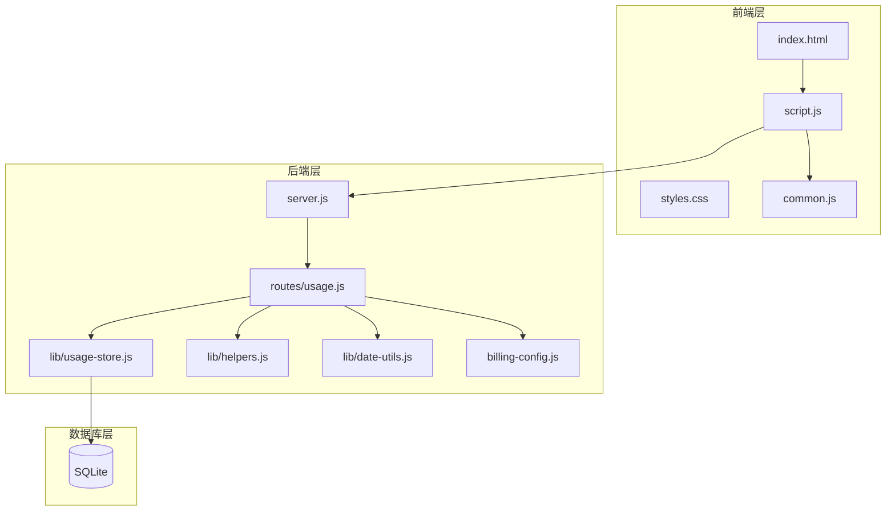
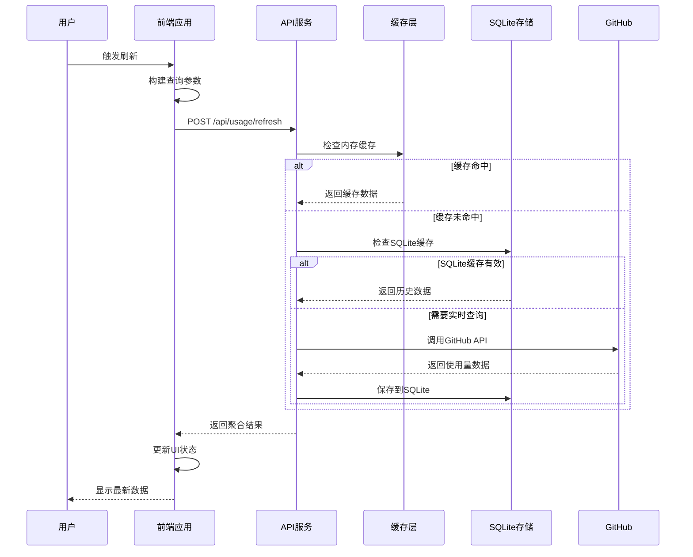
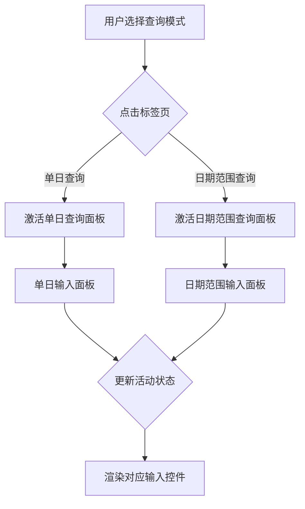
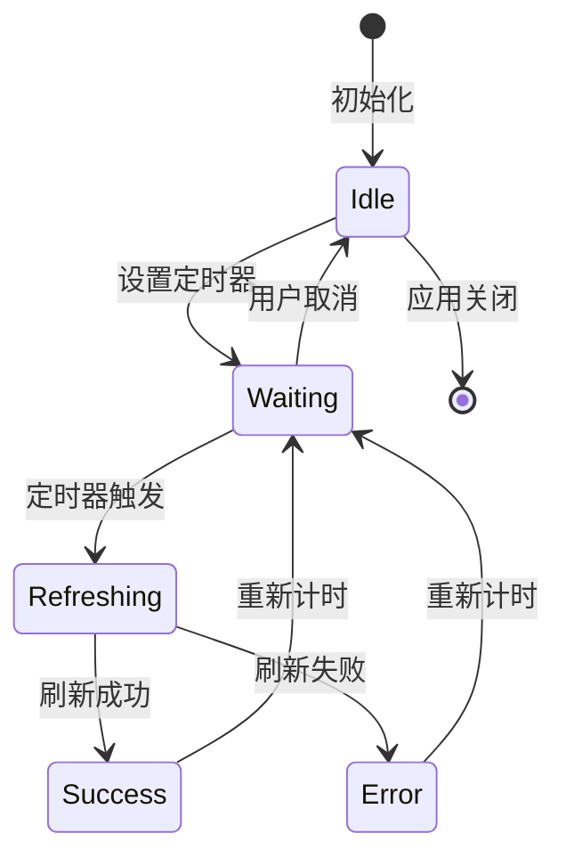
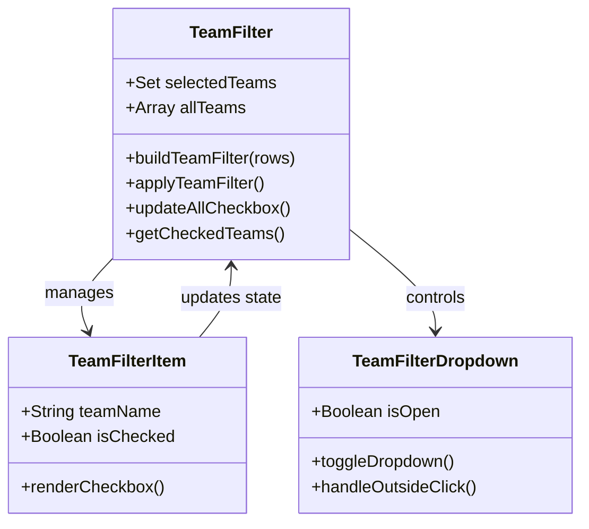
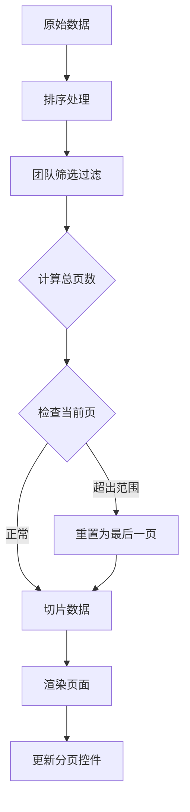
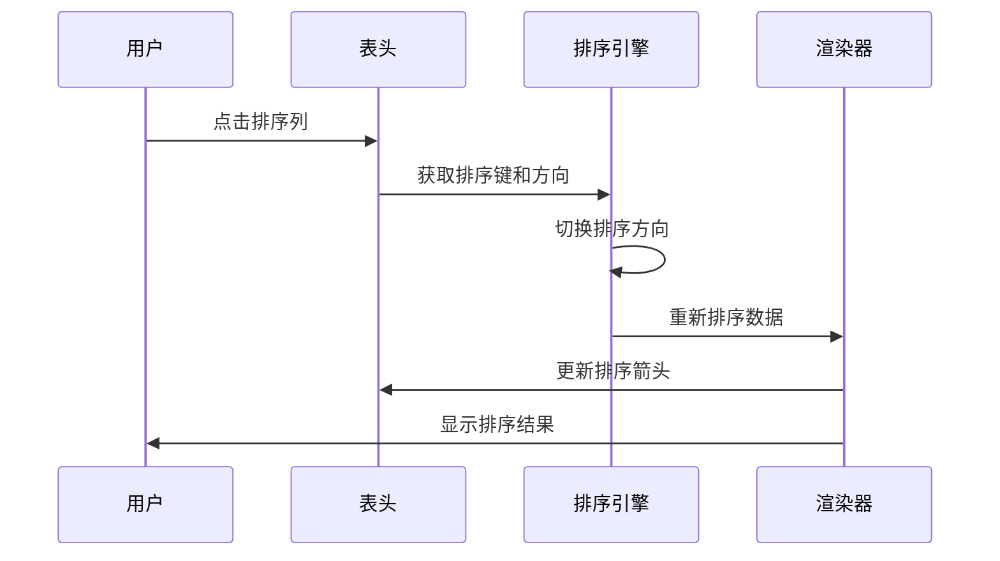
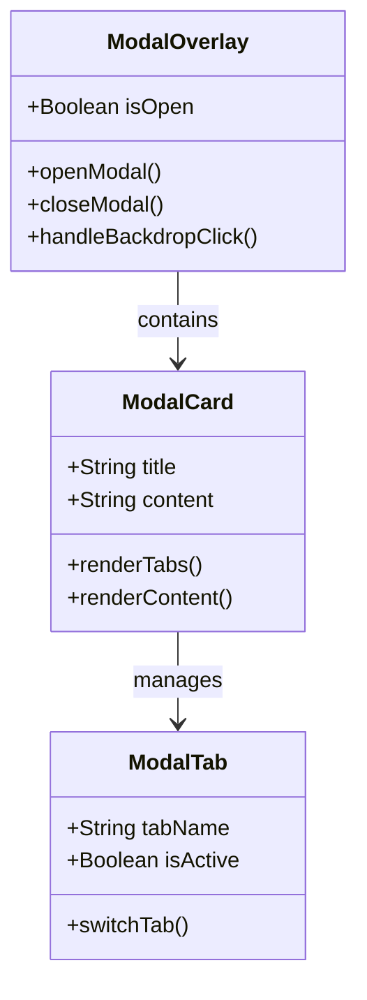
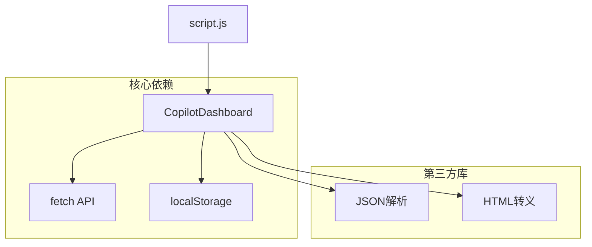
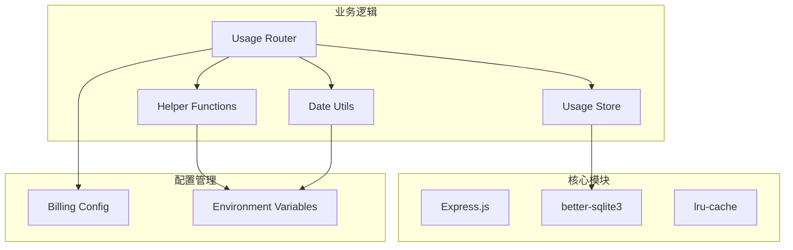

# 主页面（Index）设计文档

<cite>
**本文档引用的文件**
- [index.html](file://public/index.html)
- [script.js](file://public/script.js)
- [styles.css](file://public/styles.css)
- [common.js](file://public/common.js)
- [usage.js](file://routes/usage.js)
- [usage-store.js](file://lib/usage-store.js)
- [helpers.js](file://lib/helpers.js)
- [date-utils.js](file://lib/date-utils.js)
- [server.js](file://server.js)
- [billing-config.js](file://lib/billing-config.js)
</cite>

## 目录
1. [简介](#简介)
2. [项目结构](#项目结构)
3. [核心组件](#核心组件)
4. [架构概览](#架构概览)
5. [详细组件分析](#详细组件分析)
6. [依赖关系分析](#依赖关系分析)
7. [性能考虑](#性能考虑)
8. [故障排除指南](#故障排除指南)
9. [结论](#结论)

## 简介

CopilotEnterpriseUsageDisplay 是一个企业级 GitHub Copilot 使用量监控仪表板，专注于展示每用户的用量排行。该主页面提供了直观的数据可视化界面，支持多种查询模式、自动刷新、团队筛选和丰富的交互功能。

## 项目结构

该项目采用前后端分离的架构设计，主要包含以下模块：



**图表来源**
- [server.js:1-182](file://server.js#L1-L182)
- [usage.js:1-470](file://routes/usage.js#L1-L470)

**章节来源**
- [server.js:1-182](file://server.js#L1-L182)
- [package.json:1-26](file://package.json#L1-L26)

## 核心组件

### 主页面布局组件

主页面采用卡片式布局设计，包含以下核心区域：

1. **查询栏** - 支持单日查询和日期范围查询
2. **自动刷新控制** - 下拉选择器和定时器管理
3. **用量排行表格** - 用户请求量、Premium requests百分比和金额排序
4. **团队筛选器** - 多选机制和状态管理
5. **分页控件** - 表格分页功能
6. **模态框** - 信息展示和交互

**章节来源**
- [index.html:10-103](file://public/index.html#L10-L103)
- [script.js:31-44](file://public/script.js#L31-L44)

### 数据流组件

系统采用双缓存策略：
- **浏览器本地缓存** - localStorage 实现的客户端缓存
- **服务器内存缓存** - 内存中的刷新去重和共享缓存
- **SQLite持久化缓存** - 用于历史数据和跨会话持久化

**章节来源**
- [script.js:42-43](file://public/script.js#L42-L43)
- [usage.js:16-24](file://routes/usage.js#L16-L24)
- [usage-store.js:10-20](file://lib/usage-store.js#L10-L20)

## 架构概览

系统采用三层架构设计，实现了清晰的职责分离：



**图表来源**
- [script.js:299-326](file://public/script.js#L299-L326)
- [usage.js:387-462](file://routes/usage.js#L387-L462)

## 详细组件分析

### 查询界面设计

#### 查询模式切换机制

系统支持两种查询模式，通过标签页实现无缝切换：



**图表来源**
- [script.js:84-93](file://public/script.js#L84-L93)
- [index.html:18-32](file://public/index.html#L18-L32)

#### 输入验证和默认值

- **单日查询**：默认设置为当天日期
- **日期范围查询**：默认设置为当月第一天到当天
- **输入验证**：确保日期格式正确性和范围合理性

**章节来源**
- [script.js:79-82](file://public/script.js#L79-L82)
- [script.js:84-93](file://public/script.js#L84-L93)

### 自动刷新功能

#### 定时器管理系统



**图表来源**
- [script.js:342-349](file://public/script.js#L342-L349)
- [script.js:349-349](file://public/script.js#L349-L349)

#### 下拉选择器设计

自动刷新选项提供四种频率：
- 关闭（0秒）
- 60秒（1分钟）
- 180秒（3分钟）
- 300秒（5分钟）

**章节来源**
- [index.html:35-42](file://public/index.html#L35-L42)
- [script.js:342-349](file://public/script.js#L342-L349)

### 团队筛选功能

#### 多选机制实现



**图表来源**
- [script.js:236-277](file://public/script.js#L236-L277)
- [index.html:55-63](file://public/index.html#L55-L63)

#### 状态管理策略

- **全选/反选**：通过复选框的 indeterminate 状态实现
- **部分选择**：动态计算选中数量
- **状态同步**：确保UI状态与数据状态一致

**章节来源**
- [script.js:256-268](file://public/script.js#L256-L268)
- [script.js:276-277](file://public/script.js#L276-L277)

### 表格分页功能

#### 分页算法设计



**图表来源**
- [script.js:133-172](file://public/script.js#L133-L172)
- [script.js:174-179](file://public/script.js#L174-L179)

#### 用户体验优化

- **最大可见页数**：限制同时显示的页码数量
- **省略号标记**：使用省略号表示中间省略的页码
- **响应式设计**：在小屏幕上自动调整显示策略

**章节来源**
- [script.js:159-172](file://public/script.js#L159-L172)
- [script.js:174-179](file://public/script.js#L174-L179)

### 排序功能实现

#### 多字段排序机制



**图表来源**
- [script.js:95-112](file://public/script.js#L95-L112)
- [script.js:181-188](file://public/script.js#L181-L188)

#### 排序字段定义

- **用户**：字符串排序，支持升序/降序
- **Team**：字符串排序，默认升序
- **请求量**：数值排序，默认降序
- **Premium requests(%)**：数值排序，默认降序
- **金额(USD)**：数值排序，默认降序

**章节来源**
- [script.js:95-112](file://public/script.js#L95-L112)
- [script.js:181-188](file://public/script.js#L181-L188)

### 模态框组件设计

#### 设计模式



**图表来源**
- [index.html:88-97](file://public/index.html#L88-L97)
- [script.js:351-356](file://public/script.js#L351-L356)

#### 事件处理机制

- **点击外部区域**：自动关闭模态框
- **ESC键支持**：键盘快捷键关闭
- **模态框内滚动**：独立滚动条
- **标签页切换**：动态内容加载

**章节来源**
- [script.js:351-356](file://public/script.js#L351-L356)
- [script.js:394-465](file://public/script.js#L394-L465)

### 响应式设计实现

#### 移动端适配策略


**图表来源**
- [styles.css:321-330](file://public/styles.css#L321-L330)
- [styles.css:125-140](file://public/styles.css#L125-L140)

#### 关键响应式特性

- **视口设置**：`width=device-width, initial-scale=1.0`
- **弹性布局**：使用 CSS Grid 和 Flexbox
- **字体缩放**：使用 `clamp()` 函数实现流式字体大小
- **触摸友好的控件**：按钮和输入框的最小点击区域

**章节来源**
- [index.html:5](file://public/index.html#L5-L5)
- [styles.css:321-330](file://public/styles.css#L321-L330)

## 依赖关系分析

### 前端依赖图



**图表来源**
- [common.js:39-53](file://public/common.js#L39-L53)
- [script.js:299-326](file://public/script.js#L299-L326)

### 后端依赖关系



**图表来源**
- [server.js:88-99](file://server.js#L88-L99)
- [usage.js:13-14](file://routes/usage.js#L13-L14)

**章节来源**
- [server.js:88-99](file://server.js#L88-L99)
- [usage.js:13-14](file://routes/usage.js#L13-L14)

## 性能考虑

### 前端性能优化技巧

#### DOM操作优化

1. **批量DOM更新**：使用 `innerHTML` 替代多次 `createElement`
2. **事件委托**：利用事件冒泡减少事件监听器数量
3. **虚拟滚动**：对于大数据集使用虚拟化技术
4. **防抖节流**：对频繁触发的操作进行优化

#### 事件委托实现

```javascript
// 事件委托示例
document.addEventListener('click', function(e) {
    const target = e.target.closest('.page-btn');
    if (target) {
        const page = parseInt(target.dataset.page);
        handlePageChange(page);
    }
});
```

#### 缓存策略

- **内存缓存**：避免重复的API调用
- **本地缓存**：跨会话持久化用户偏好
- **CDN缓存**：静态资源的高效传输

### 后端性能优化

#### 数据库优化

- **索引优化**：为常用查询字段建立索引
- **查询优化**：使用预编译语句防止SQL注入
- **连接池**：合理管理数据库连接
- **事务处理**：确保数据一致性

#### 缓存策略

- **多级缓存**：内存缓存 + 文件缓存 + 数据库缓存
- **智能过期**：根据数据新鲜度设置不同的过期时间
- **缓存预热**：启动时预加载常用数据

## 故障排除指南

### 常见问题诊断

#### API调用失败

1. **检查网络连接**：确认能够访问GitHub API
2. **验证认证配置**：检查环境变量设置
3. **查看错误日志**：分析具体的错误信息
4. **重试机制**：实现指数退避重试

#### 数据显示异常

1. **清除缓存**：删除localStorage中的缓存数据
2. **检查权限**：确认有足够的访问权限
3. **验证数据格式**：检查返回数据的完整性
4. **调试模式**：启用详细的日志输出

#### 性能问题

1. **监控内存使用**：定期检查内存泄漏
2. **优化查询**：减少不必要的数据请求
3. **压缩资源**：使用gzip压缩静态文件
4. **懒加载**：实现按需加载机制

**章节来源**
- [common.js:19-23](file://public/common.js#L19-L23)
- [usage.js:459-461](file://routes/usage.js#L459-L461)

## 结论

CopilotEnterpriseUsageDisplay 主页面设计体现了现代Web应用的最佳实践，通过合理的架构设计和丰富的交互功能，为用户提供了一个直观、高效的用量监控界面。系统的主要优势包括：

1. **清晰的架构分离**：前后端职责明确，便于维护和扩展
2. **强大的缓存机制**：多层次缓存策略确保良好的性能表现
3. **丰富的交互体验**：支持多种查询模式和实时数据更新
4. **响应式设计**：适配各种设备和屏幕尺寸
5. **完善的错误处理**：提供友好的错误提示和恢复机制

未来可以考虑的功能增强包括：
- 添加更多图表可视化选项
- 实现导出功能支持
- 增强搜索和过滤能力
- 提供更多自定义配置选项