# 前端公共模块

<cite>
**本文档引用的文件**
- [common.js](file://public/common.js)
- [styles.css](file://public/styles.css)
- [script.js](file://public/script.js)
- [index.html](file://public/index.html)
- [billpage.html](file://public/billpage.html)
- [billpage.js](file://public/billpage.js)
- [costcenter.js](file://public/costcenter.js)
- [user.js](file://public/user.js)
- [helpers.js](file://lib/helpers.js)
- [github-api.js](file://lib/github-api.js)
- [logger.js](file://lib/logger.js)
- [date-utils.js](file://lib/date-utils.js)
- [usage-store.js](file://lib/usage-store.js)
- [billing-config.js](file://lib/billing-config.js)
- [scheduler.js](file://lib/scheduler.js)
- [analytics.js](file://routes/analytics.js)
- [bill.js](file://routes/bill.js)
- [package.json](file://package.json)
</cite>

## 更新摘要
**变更内容**
- 主页面加载体验改进：新增本地缓存检查、服务端缓存回退和后台刷新机制
- 添加月选择器下拉菜单：支持当前月和过去11个月的历史数据查询
- 强制刷新按钮：允许用户绕过缓存强制重新计算数据
- 自动刷新功能：主页增加自动刷新下拉菜单，支持多种刷新间隔

## 目录
1. [简介](#简介)
2. [项目结构](#项目结构)
3. [核心组件](#核心组件)
4. [架构总览](#架构总览)
5. [详细组件分析](#详细组件分析)
6. [依赖关系分析](#依赖关系分析)
7. [性能考量](#性能考量)
8. [故障排查指南](#故障排查指南)
9. [结论](#结论)
10. [附录](#附录)

## 简介
本设计文档聚焦 CopilotEnterpriseUsageDisplay 的前端公共模块，系统性阐述其设计模式与实现要点，包括：
- IIFE 封装与命名空间管理策略
- 全局状态管理（用户会话、配置参数、缓存数据）
- 通用工具函数（日期处理、数据格式化、网络请求封装）
- 样式系统组织（CSS 变量、组件样式、响应式设计）
- 错误处理与日志记录的统一机制
- 国际化支持与多语言切换能力
- 前端安全防护（XSS 防护、CSRF 对策）
- 模块化最佳实践（代码分割与按需加载）

## 项目结构
前端公共模块位于 public 目录，采用 IIFE 包裹的共享脚本 common.js，配合各页面专用脚本（script.js、costcenter.js、user.js）实现复用与解耦。样式系统通过 styles.css 统一管理，包含 CSS 变量、组件样式与响应式断点。

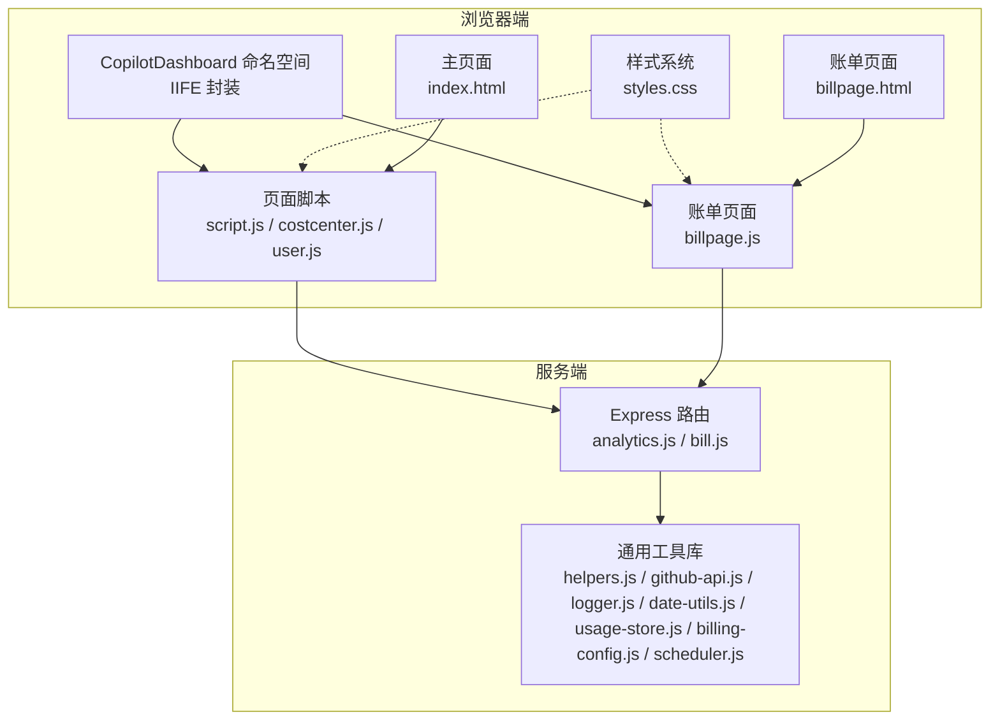

**图表来源**
- [common.js:5-112](file://public/common.js#L5-L112)
- [script.js:1-631](file://public/script.js#L1-L631)
- [billpage.js:1-300](file://public/billpage.js#L1-L300)
- [index.html:1-103](file://public/index.html#L1-L103)
- [billpage.html:1-68](file://public/billpage.html#L1-L68)
- [styles.css:1-1301](file://public/styles.css#L1-L1301)
- [analytics.js:1-132](file://routes/analytics.js#L1-L132)
- [bill.js:1-407](file://routes/bill.js#L1-L407)
- [helpers.js:1-83](file://lib/helpers.js#L1-L83)
- [github-api.js:1-320](file://lib/github-api.js#L1-L320)
- [logger.js:1-41](file://lib/logger.js#L1-L41)
- [date-utils.js:1-46](file://lib/date-utils.js#L1-L46)
- [usage-store.js:1-324](file://lib/usage-store.js#L1-L324)
- [billing-config.js:1-25](file://lib/billing-config.js#L1-L25)
- [scheduler.js:1-160](file://lib/scheduler.js#L1-L160)

**章节来源**
- [common.js:1-113](file://public/common.js#L1-L113)
- [styles.css:1-1301](file://public/styles.css#L1-L1301)

## 核心组件
- 命名空间与 IIFE 封装：通过立即执行函数表达式将公共方法暴露在 CopilotDashboard 命名空间下，避免全局污染，便于跨页面复用。
- 通用工具函数：包括 HTML 转义、时间格式化、错误判定与消息生成、API 请求封装、数字与金额格式化、骨架屏渲染、本地缓存等。
- 页面脚本：script.js（用量看板）、costcenter.js（成本中心）、user.js（成员映射）、billpage.js（月度账单），均依赖 CopilotDashboard 提供的统一能力。
- 样式系统：基于 CSS 变量的主题体系，组件级样式与响应式布局，确保一致的视觉与交互体验。

**章节来源**
- [common.js:5-112](file://public/common.js#L5-L112)
- [script.js:1-631](file://public/script.js#L1-L631)
- [billpage.js:1-300](file://public/billpage.js#L1-L300)
- [costcenter.js:1-307](file://public/costcenter.js#L1-L307)
- [user.js:1-341](file://public/user.js#L1-L341)
- [styles.css:1-1301](file://public/styles.css#L1-L1301)

## 架构总览
前端公共模块与服务端模块协同工作：页面脚本通过 CopilotDashboard.apiFetchJson 发起请求；服务端路由调用 lib 下的工具库（helpers、github-api、usage-store 等）完成数据聚合与缓存；日志系统统一记录访问与异常信息。

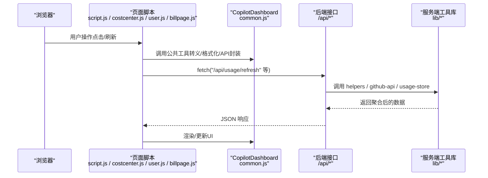

**图表来源**
- [script.js:312-326](file://public/script.js#L312-L326)
- [billpage.js:195-224](file://public/billpage.js#L195-L224)
- [common.js:39-53](file://public/common.js#L39-L53)
- [helpers.js:30-36](file://lib/helpers.js#L30-L36)
- [github-api.js:172-227](file://lib/github-api.js#L172-L227)
- [usage-store.js:137-160](file://lib/usage-store.js#L137-L160)

## 详细组件分析

### IIFE 封装与命名空间管理
- 设计模式：使用 IIFE 创建闭包，将工具函数收敛到 CopilotDashboard 命名空间，避免全局变量冲突。
- 关键导出：escapeHtml、formatTs、setError、isRateLimitPayload、formatRateLimitMessage、apiFetchJson、toNumber、formatUsd、renderSkeletonRows、setMetaRefreshing、getCachedData、setCachedData。
- 优势：跨页面复用、职责清晰、易于测试与维护。

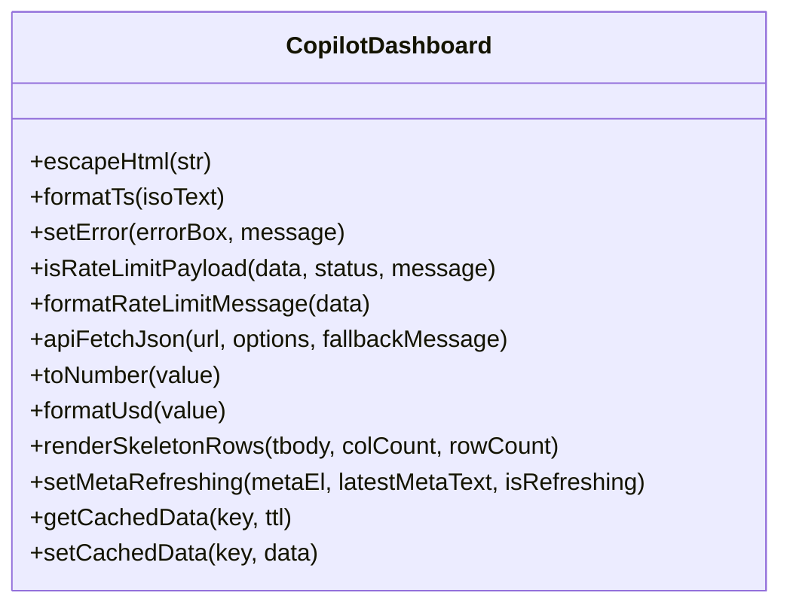

**图表来源**
- [common.js:5-112](file://public/common.js#L5-L112)

**章节来源**
- [common.js:5-112](file://public/common.js#L5-L112)

### 全局状态管理
- 用户会话与配置参数：通过环境变量与服务端路由传递，前端以查询参数或请求体形式参与数据构建。
- 缓存数据：
  - 本地缓存：localStorage + TTL，用于短期数据复用（如用量看板、成本中心列表）。
  - 服务端缓存：SQLite 持久化（usage-store），支持 ETag、座位快照、月度账单等。
- 状态更新：页面脚本在刷新完成后写入本地缓存，并根据响应更新元信息与分页状态。

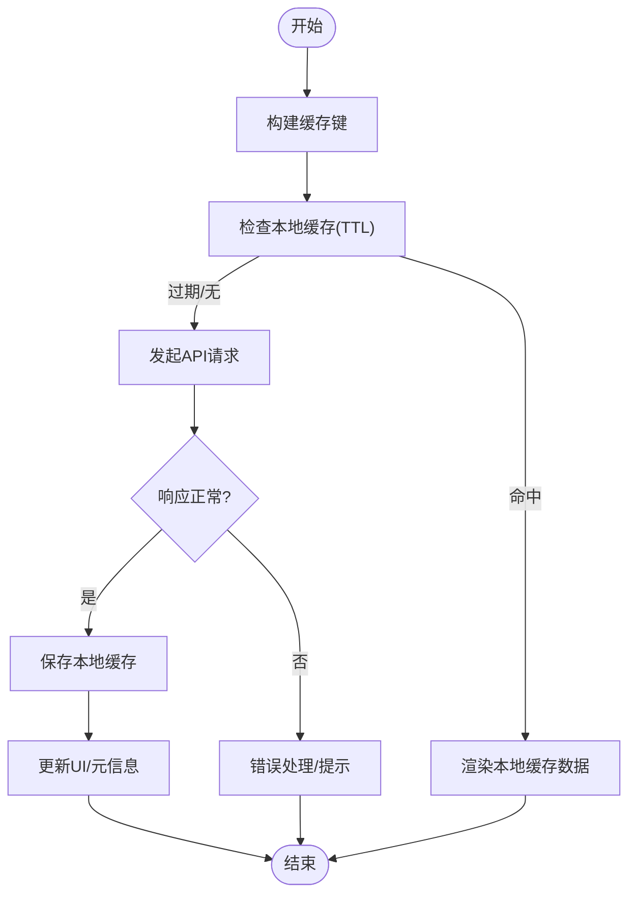

**图表来源**
- [script.js:296-326](file://public/script.js#L296-L326)
- [billpage.js:195-224](file://public/billpage.js#L195-L224)
- [common.js:83-96](file://public/common.js#L83-L96)
- [usage-store.js:243-278](file://lib/usage-store.js#L243-L278)

**章节来源**
- [script.js:32-44](file://public/script.js#L32-L44)
- [billpage.js:27-31](file://public/billpage.js#L27-L31)
- [common.js:83-110](file://public/common.js#L83-L110)
- [usage-store.js:1-324](file://lib/usage-store.js#L1-L324)

### 主页面加载体验改进
**更新** 主页面现在包含更完善的初始化流程，显著提升了用户体验：

- **本地缓存检查**：启动时首先检查 localStorage 中的缓存数据，如果存在且未过期则立即渲染
- **服务端缓存回退**：如果本地缓存不存在，则尝试从服务端内存缓存获取数据
- **骨架屏渲染**：在等待数据加载时显示骨架屏，提升感知性能
- **后台刷新**：无论是否有缓存，都会触发后台刷新以获取最新数据

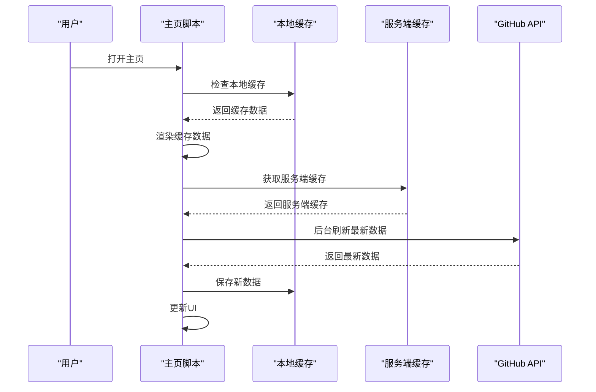

**图表来源**
- [script.js:328-350](file://public/script.js#L328-L350)
- [common.js:83-96](file://public/common.js#L83-L96)

**章节来源**
- [script.js:79-82](file://public/script.js#L79-L82)
- [script.js:328-350](file://public/script.js#L328-L350)

### 月选择器下拉菜单
**更新** 新增月选择器功能，支持用户选择特定月份进行数据查询：

- **账单汇总页面**：在模态框中提供月选择器，支持当前月和过去11个月的历史数据
- **账单页面**：提供独立的月选择器，支持精确的年月选择
- **强制刷新功能**：允许用户绕过缓存强制重新计算指定月份的数据

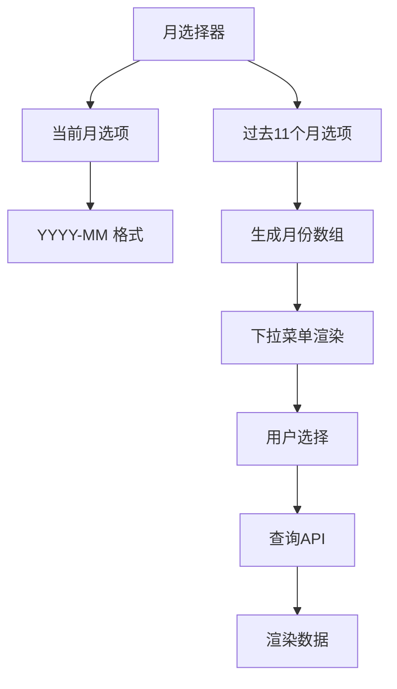

**图表来源**
- [script.js:488-507](file://public/script.js#L488-L507)
- [billpage.js:21-25](file://public/billpage.js#L21-L25)

**章节来源**
- [script.js:488-507](file://public/script.js#L488-L507)
- [billpage.js:21-25](file://public/billpage.js#L21-L25)

### 强制刷新按钮
**更新** 新增强制刷新功能，允许用户绕过所有缓存强制重新计算数据：

- **账单汇总页面**：提供"强制刷新"按钮，跳过3分钟缓存直接回源 GitHub
- **账单页面**：提供"强制刷新"按钮，清除该月本地缓存并逐日回源 GitHub API
- **安全确认**：强制刷新操作需要用户确认，防止误操作
- **进度反馈**：显示刷新进度和失败日期信息

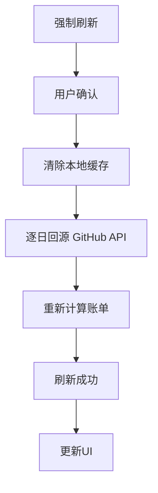

**图表来源**
- [script.js:504](file://public/script.js#L504)
- [billpage.js:240-284](file://public/billpage.js#L240-L284)

**章节来源**
- [script.js:504](file://public/script.js#L504)
- [billpage.js:240-284](file://public/billpage.js#L240-L284)

### 自动刷新功能
**更新** 主页面新增自动刷新下拉菜单，支持多种刷新间隔：

- **下拉菜单**：提供60秒、180秒、300秒的自动刷新选项
- **定时器管理**：自动管理定时器的启动和停止
- **状态同步**：刷新按钮状态与自动刷新状态保持同步

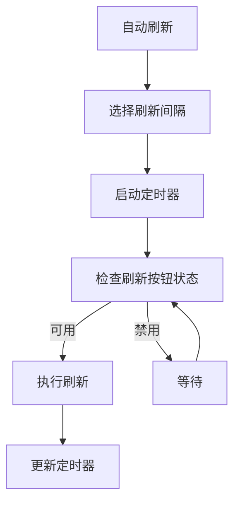

**图表来源**
- [script.js:352-360](file://public/script.js#L352-L360)

**章节来源**
- [script.js:352-360](file://public/script.js#L352-L360)
- [index.html:35-42](file://public/index.html#L35-L42)

### 通用工具函数
- 日期处理：parseDateStr、enumerateDays、buildDateKey，用于解析日期字符串、生成日期序列与构建键值。
- 数据格式化：toNumber、formatUsd、formatTs、renderSkeletonRows，保证数值与金额展示一致性。
- 网络请求封装：apiFetchJson，统一处理响应体解析、错误判定（含速率限制）、错误消息生成。
- 安全与健壮性：escapeHtml 防止 XSS；isRateLimitPayload/formatRateLimitMessage 识别并提示速率限制。

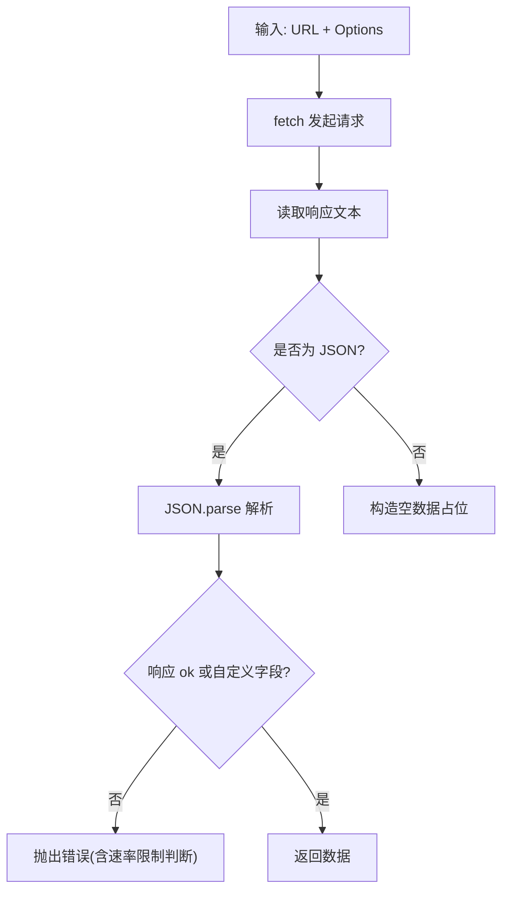

**图表来源**
- [common.js:39-53](file://public/common.js#L39-L53)
- [github-api.js:108-168](file://lib/github-api.js#L108-L168)

**章节来源**
- [date-utils.js:1-46](file://lib/date-utils.js#L1-L46)
- [common.js:8-110](file://public/common.js#L8-L110)
- [github-api.js:108-227](file://lib/github-api.js#L108-L227)

### 样式系统组织
- CSS 变量：定义主题色板、字体族、阴影与间距，集中管理品牌视觉规范。
- 组件样式：卡片、表格、标签页、模态框、预算进度条、月选择器、强制刷新按钮等组件化样式，遵循 BEM 风格与语义化类名。
- 响应式设计：使用 clamp、flex 布局与媒体查询，适配桌面与移动设备。

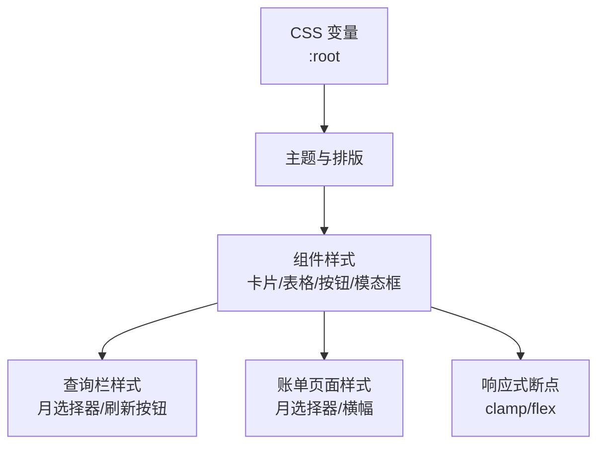

**图表来源**
- [styles.css:11-28](file://public/styles.css#L11-L28)
- [styles.css:1248-1301](file://public/styles.css#L1248-L1301)

**章节来源**
- [styles.css:1-1301](file://public/styles.css#L1-L1301)

### 错误处理与日志记录
- 前端错误处理：统一通过 setError 展示错误信息；apiFetchJson 内部识别速率限制与业务错误，生成用户可读提示。
- 服务端日志：pino 日志器按级别输出访问日志、调试信息与错误堆栈；敏感字段脱敏（Authorization、token 等）。
- GitHub API 错误：ApiError 类型化错误，携带状态码与速率限制信息，便于前端统一处理。

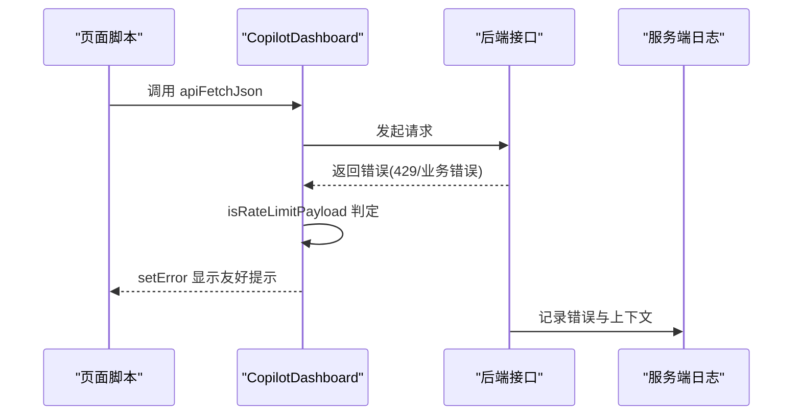

**图表来源**
- [common.js:25-53](file://public/common.js#L25-L53)
- [logger.js:1-41](file://lib/logger.js#L1-L41)
- [github-api.js:14-21](file://lib/github-api.js#L14-L21)

**章节来源**
- [common.js:19-53](file://public/common.js#L19-L53)
- [logger.js:1-41](file://lib/logger.js#L1-L41)
- [github-api.js:14-22](file://lib/github-api.js#L14-L22)

### 国际化与多语言支持
- 当前前端代码主要使用中文文案与本地化时间格式（toLocaleString）。若需国际化，建议：
  - 在页面脚本中引入 i18n 库（如 format-message 或 vue-i18n），将文案提取为键值。
  - 通过 URL 查询参数或浏览器语言设置切换语言，动态加载对应字典。
  - 保持日期与金额格式化逻辑可配置，以适配不同区域习惯。

### 前端安全防护
- XSS 防护：所有用户输入与动态内容均通过 CopilotDashboard.escapeHtml 进行 HTML 转义，避免脚本注入。
- CSRF 保护：建议在服务端启用 CSRF Token 校验，并在前端请求头中携带（如 X-CSRF-Token）。当前仓库未见显式 CSRF 实现，可在路由层补充中间件与令牌校验。
- 敏感信息脱敏：服务端日志对 Authorization、token、password 等字段进行脱敏处理。

**章节来源**
- [common.js:8-10](file://public/common.js#L8-L10)
- [logger.js:16-19](file://lib/logger.js#L16-L19)

### 模块化与按需加载
- 代码组织：common.js 作为公共模块，script.js/costcenter.js/user.js/billpage.js 作为页面模块，职责分离。
- 按需加载：页面脚本在初始化时优先渲染骨架屏，随后异步刷新数据；成本中心模块采用分块渲染（CC_RENDER_CHUNK_SIZE）提升大列表性能。
- 代码分割：建议将第三方库（如 lru-cache、pino）拆分为独立 bundle，结合路由懒加载进一步优化首屏。

**章节来源**
- [script.js:65-75](file://public/script.js#L65-L75)
- [billpage.js:195-224](file://public/billpage.js#L195-L224)
- [package.json:12-24](file://package.json#L12-L24)

## 依赖关系分析
前端公共模块与服务端工具库之间存在清晰的依赖链：页面脚本依赖 CopilotDashboard；CopilotDashboard 依赖 helpers 与 github-api；github-api 依赖 logger 与 billing-config；usage-store 提供 SQLite 缓存能力；scheduler 负责定时任务调度。

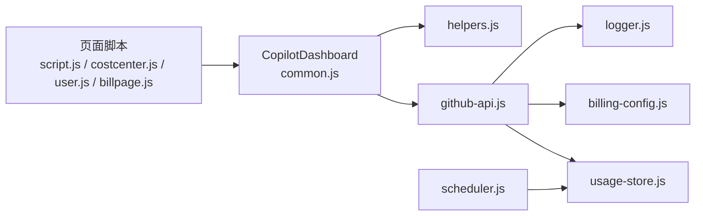

**图表来源**
- [script.js:1-631](file://public/script.js#L1-L631)
- [billpage.js:1-300](file://public/billpage.js#L1-L300)
- [costcenter.js:1-307](file://public/costcenter.js#L1-L307)
- [user.js:1-341](file://public/user.js#L1-L341)
- [common.js:1-113](file://public/common.js#L1-L113)
- [helpers.js:1-83](file://lib/helpers.js#L1-L83)
- [github-api.js:1-320](file://lib/github-api.js#L1-L320)
- [logger.js:1-41](file://lib/logger.js#L1-L41)
- [billing-config.js:1-25](file://lib/billing-config.js#L1-L25)
- [usage-store.js:1-324](file://lib/usage-store.js#L1-L324)
- [scheduler.js:1-160](file://lib/scheduler.js#L1-L160)

**章节来源**
- [helpers.js:1-83](file://lib/helpers.js#L1-L83)
- [github-api.js:1-320](file://lib/github-api.js#L1-L320)
- [usage-store.js:1-324](file://lib/usage-store.js#L1-L324)
- [scheduler.js:1-160](file://lib/scheduler.js#L1-L160)

## 性能考量
- 缓存策略：本地缓存（localStorage + TTL）与服务端缓存（SQLite + ETag）双层缓存，减少重复请求。
- 并发控制：GitHub API 请求通过并发队列与 LRU 缓存降低压力，支持条件请求与去重。
- 渲染优化：骨架屏与分块渲染（成本中心）提升感知性能；分页与排序在客户端完成，避免不必要的网络往返。
- 数据压缩：SQLite 表结构与索引设计（如 idx_daily_usage_date）优化查询性能。
- **新增**：自动刷新功能减少用户手动操作，提升数据新鲜度。

## 故障排查指南
- 速率限制：前端通过 isRateLimitPayload 识别 429 与速率限制提示；服务端记录速率限制状态并等待 reset。
- 网络错误：apiFetchJson 统一捕获并展示友好错误；检查 GITHUB_TOKEN、GITHUB_API_BASE 等环境变量。
- 缓存问题：本地缓存过期或损坏时，清除缓存键或等待 TTL 自然失效；服务端 ETag 缓存可通过 SQLite 清理。
- 日志定位：查看服务端日志（pino）中的访问日志与错误堆栈，定位异常请求与响应。
- **新增**：强制刷新功能可用于解决缓存数据异常问题。

**章节来源**
- [common.js:25-53](file://public/common.js#L25-L53)
- [github-api.js:190-227](file://lib/github-api.js#L190-L227)
- [logger.js:1-41](file://lib/logger.js#L1-L41)

## 结论
CopilotEnterpriseUsageDisplay 的前端公共模块通过 IIFE 封装与命名空间管理，实现了高内聚、低耦合的工具集；结合本地与服务端缓存、统一的错误处理与日志记录，保障了良好的用户体验与可观测性。最新的更新包括主页面加载体验改进、月选择器下拉菜单和强制刷新按钮等功能，进一步提升了用户的操作便利性和数据准确性。建议后续增强国际化支持、完善 CSRF 保护，并在页面脚本中引入路由懒加载与代码分割，持续优化性能与可维护性。

## 附录
- 关键实现路径参考：
  - IIFE 与命名空间：[common.js:5-112](file://public/common.js#L5-L112)
  - 页面脚本（用量看板）：[script.js:1-631](file://public/script.js#L1-L631)
  - 页面脚本（账单页面）：[billpage.js:1-300](file://public/billpage.js#L1-L300)
  - 页面脚本（成本中心）：[costcenter.js:1-307](file://public/costcenter.js#L1-L307)
  - 页面脚本（成员映射）：[user.js:1-341](file://public/user.js#L1-L341)
  - 主页面HTML：[index.html:1-103](file://public/index.html#L1-L103)
  - 账单页面HTML：[billpage.html:1-68](file://public/billpage.html#L1-L68)
  - 通用工具（helpers）：[helpers.js:1-83](file://lib/helpers.js#L1-L83)
  - GitHub API 封装：[github-api.js:1-320](file://lib/github-api.js#L1-L320)
  - 日志系统：[logger.js:1-41](file://lib/logger.js#L1-L41)
  - 日期工具：[date-utils.js:1-46](file://lib/date-utils.js#L1-L46)
  - 使用缓存（SQLite）：[usage-store.js:1-324](file://lib/usage-store.js#L1-L324)
  - 计费配置：[billing-config.js:1-25](file://lib/billing-config.js#L1-L25)
  - 调度器：[scheduler.js:1-160](file://lib/scheduler.js#L1-L160)
  - 路由（分析）：[analytics.js:1-132](file://routes/analytics.js#L1-L132)
  - 路由（账单）：[bill.js:1-407](file://routes/bill.js#L1-L407)
  - 依赖声明：[package.json:12-24](file://package.json#L12-L24)