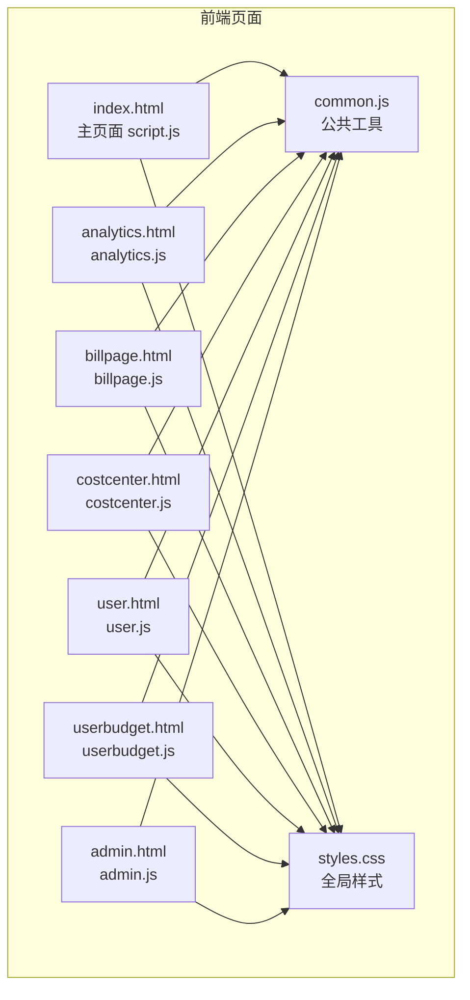
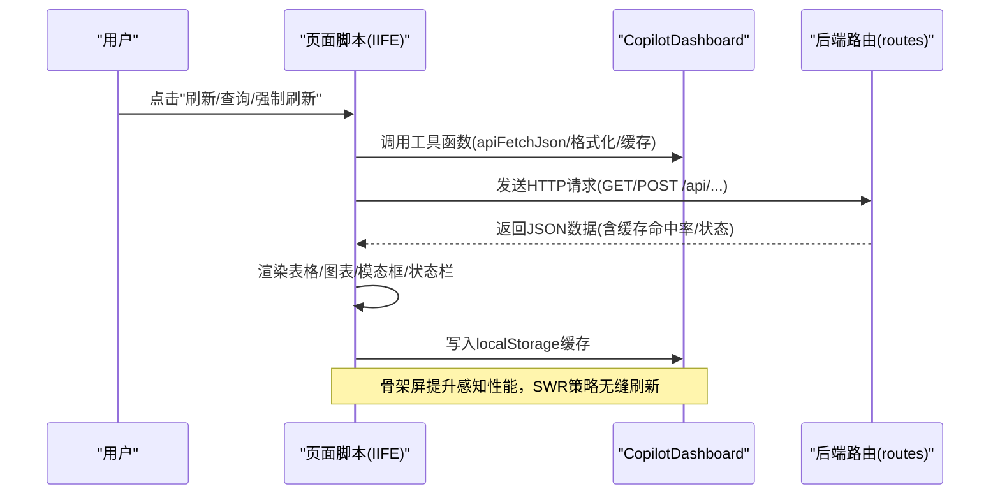
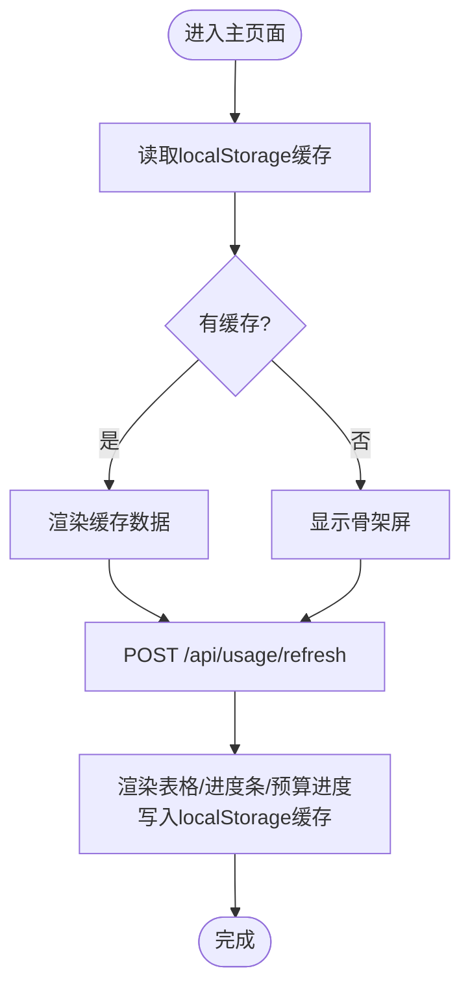
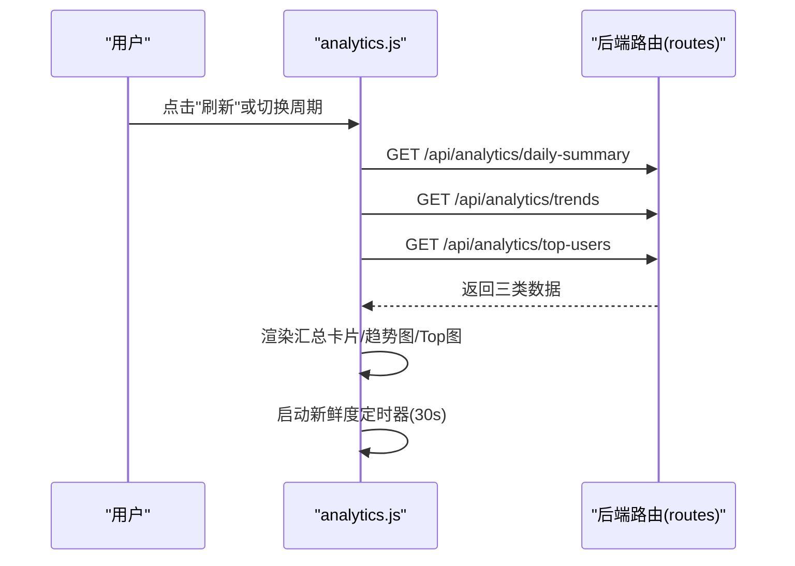
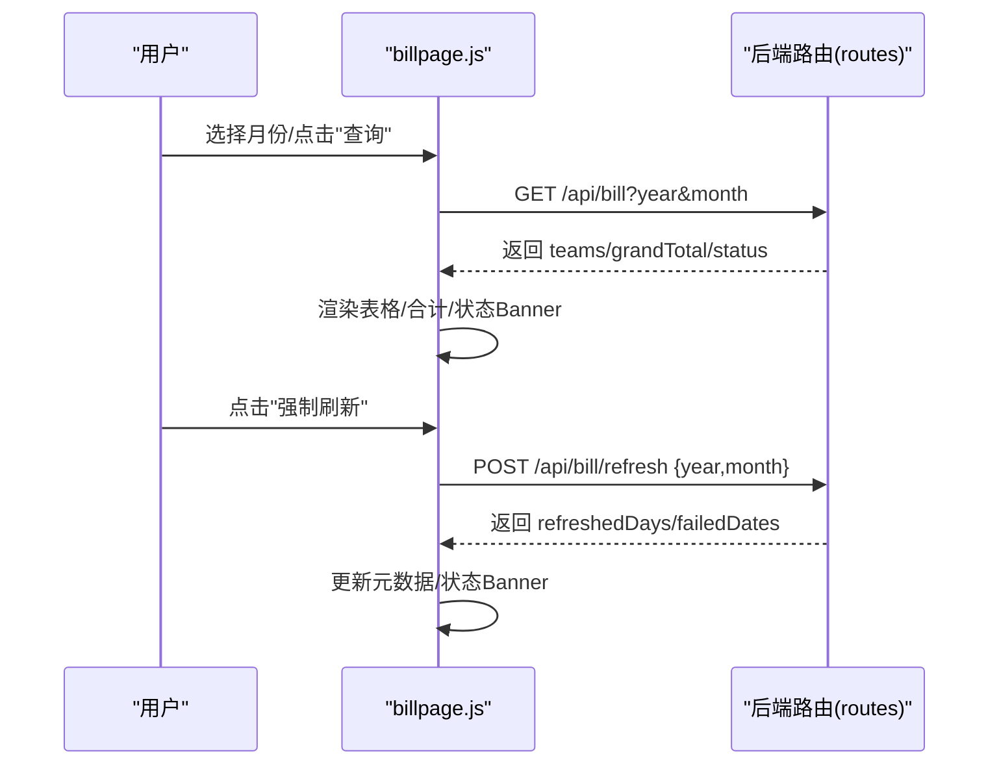
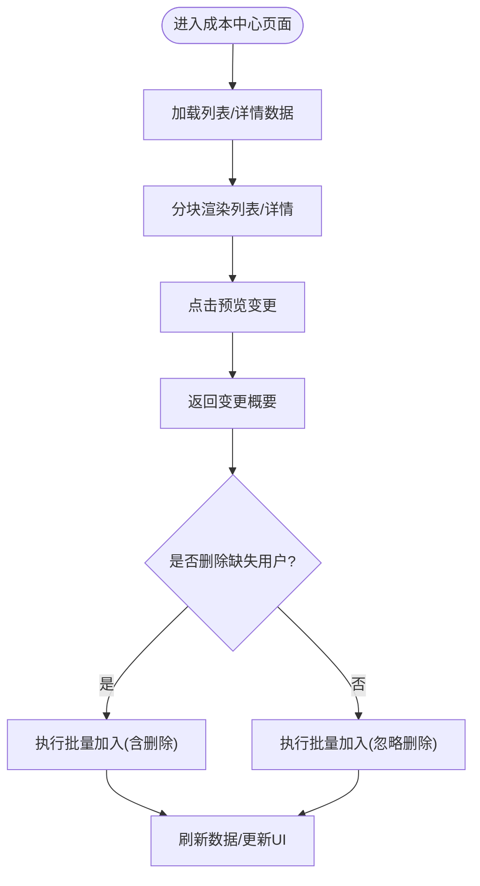
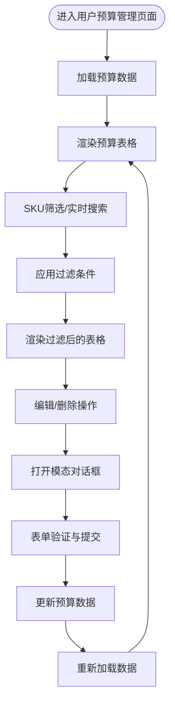
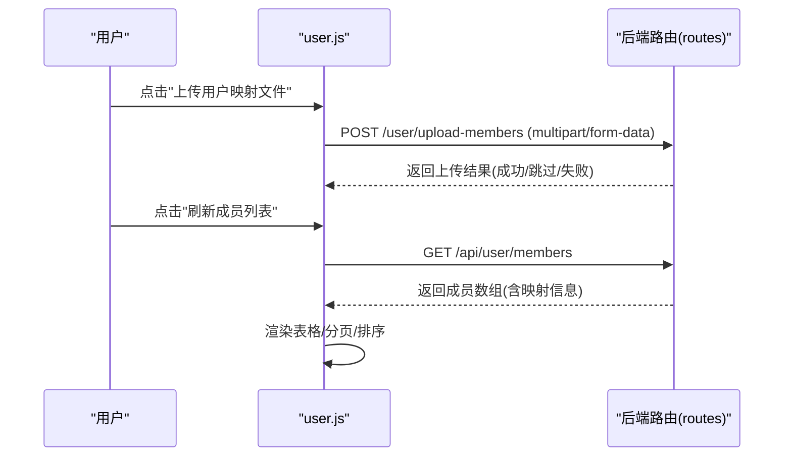
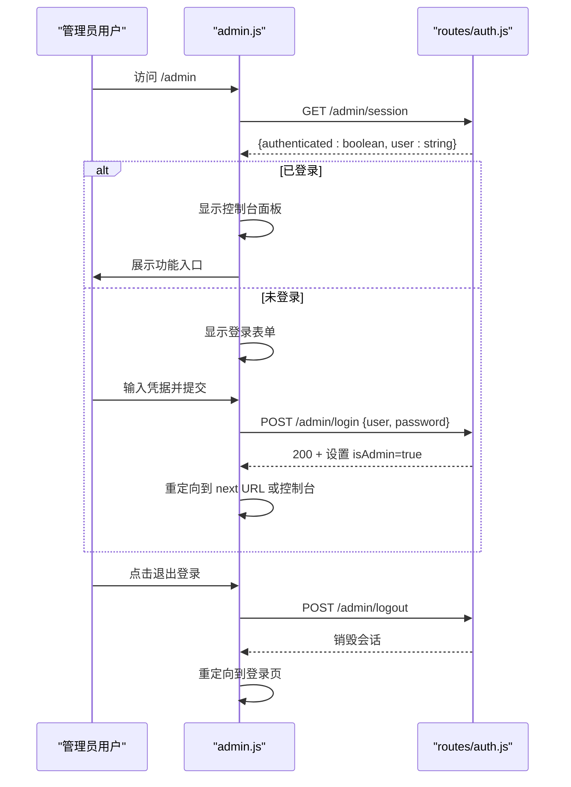
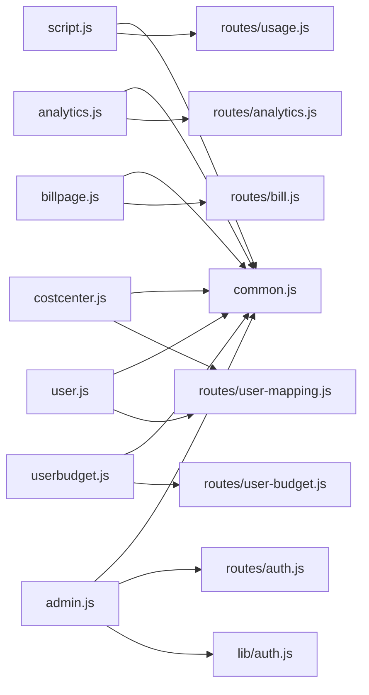

# 前端页面

<cite>
**本文引用的文件**
- [README.md](file://README.md)
- [index.html](file://public/index.html)
- [script.js](file://public/script.js)
- [analytics.html](file://public/analytics.html)
- [analytics.js](file://public/analytics.js)
- [billpage.html](file://public/billpage.html)
- [billpage.js](file://public/billpage.js)
- [costcenter.html](file://public/costcenter.html)
- [costcenter.js](file://public/costcenter.js)
- [user.html](file://public/user.html)
- [user.js](file://public/user.js)
- [userbudget.html](file://public/userbudget.html)
- [userbudget.js](file://public/userbudget.js)
- [admin.html](file://public/admin.html)
- [admin.js](file://public/admin.js)
- [common.js](file://public/common.js)
- [styles.css](file://public/styles.css)
- [usage.js](file://routes/usage.js)
- [bill.js](file://routes/bill.js)
- [user-mapping.js](file://routes/user-mapping.js)
- [user-budget.js](file://routes/user-budget.js)
- [auth.js](file://routes/auth.js)
- [lib/auth.js](file://lib/auth.js)
- [server.js](file://server.js)
</cite>

## 更新摘要
**所做更改**
- 新增用户预算管理页面(UserBudget)的完整文档，包含独立前端界面、表单处理、模态对话框、实时数据过滤等功能
- 更新管理员控制台集成，添加UserBudget管理页面的直接导航链接
- 增强公共模块设计模式说明，包含IIFE封装和命名空间管理
- 完善前端性能优化策略，涵盖分批渲染、骨架屏和缓存策略
- 添加组件复用和样式管理的最佳实践指导

## 目录
1. [简介](#简介)
2. [项目结构](#项目结构)
3. [核心组件](#核心组件)
4. [架构总览](#架构总览)
5. [详细组件分析](#详细组件分析)
6. [依赖关系分析](#依赖关系分析)
7. [性能考虑](#性能考虑)
8. [故障排查指南](#故障排查指南)
9. [结论](#结论)
10. [附录](#附录)

## 简介
本设计文档聚焦 CopilotEnterpriseUsageDisplay 的前端页面，围绕主页面用量排行、数据分析、月度账单、成本中心、用户预算管理与用户映射六大页面，系统阐述功能设计、用户交互与数据可视化实现，并总结公共模块设计模式、IIFE 封装与命名空间管理，以及前端性能优化与组件复用最佳实践。

**更新** 新增用户预算管理页面，提供独立的前端界面、表单处理、模态对话框、实时数据过滤、视觉进度指示等特性。更新管理员控制台集成，添加直接导航链接，实现完整的后台管理功能。

## 项目结构
前端页面位于 public 目录，采用"页面 HTML + 页面脚本 + 公共模块 + 全局样式"的组织方式。页面通过 IIFE 包裹，使用 CopilotDashboard 命名空间共享工具函数，避免全局变量污染；样式采用 CSS 变量与模块化类名，便于主题与复用。

**图表来源**
- [index.html:1-103](file://public/index.html#L1-L103)
- [script.js:1-541](file://public/script.js#L1-L541)
- [analytics.html:1-58](file://public/analytics.html#L1-L58)
- [analytics.js:1-235](file://public/analytics.js#L1-L235)
- [billpage.html:1-67](file://public/billpage.html#L1-L67)
- [billpage.js:1-285](file://public/billpage.js#L1-L285)
- [costcenter.html:1-71](file://public/costcenter.html#L1-L71)
- [costcenter.js:1-307](file://public/costcenter.js#L1-L307)
- [user.html:1-54](file://public/user.html#L1-L54)
- [user.js:1-341](file://public/user.js#L1-L341)
- [userbudget.html:1-76](file://public/userbudget.html#L1-L76)
- [userbudget.js:1-333](file://public/userbudget.js#L1-L333)
- [admin.html:1-207](file://public/admin.html#L1-L207)
- [admin.js:1-138](file://public/admin.js#L1-L138)
- [common.js:1-113](file://public/common.js#L1-L113)
- [styles.css:1-1335](file://public/styles.css#L1-L1335)

**章节来源**
- [README.md:69-96](file://README.md#L69-L96)
- [index.html:1-103](file://public/index.html#L1-L103)
- [analytics.html:1-58](file://public/analytics.html#L1-L58)
- [billpage.html:1-67](file://public/billpage.html#L1-L67)
- [costcenter.html:1-71](file://public/costcenter.html#L1-L71)
- [user.html:1-54](file://public/user.html#L1-L54)
- [userbudget.html:1-76](file://public/userbudget.html#L1-L76)
- [admin.html:1-207](file://public/admin.html#L1-L207)

## 核心组件
- 公共模块 CopilotDashboard（IIFE + 命名空间）
  - 提供通用工具：HTML 转义、时间格式化、错误处理、速率限制判断与消息格式化、API 请求封装、数值与货币格式化、骨架屏渲染、本地缓存读写等。
  - 作用：统一跨页面工具函数，避免全局变量泄漏，提升可维护性。
- 页面脚本（IIFE）
  - 主页面：查询模式切换、排序、分页、Team 筛选、模态框、自动刷新、缓存与骨架屏、进度条与预算进度可视化。
  - 数据分析：多指标卡片、趋势图与 Top 用户柱状图、新鲜度徽章、并行请求与定时刷新。
  - 月度账单：按月查询、Team 筛选、展开/折叠用户明细、强制刷新、Banner 状态提示。
  - 成本中心：列表/详情、资源分组、预算进度条、按 Team 批量加入 Users、预览与二次确认。
  - 用户预算管理：SKU 筛选、搜索过滤、新建/编辑/删除预算、模态对话框、预算进度可视化。
  - 用户映射：Excel 上传、映射重载、成员列表、分页与排序、映射状态可视化。
  - 管理员控制台：登录认证、会话管理、权限控制、管理入口导航。
- 全局样式
  - 设计系统：星巴克风格绿为主色，暖中性背景，Serif 标题字体，Sans-serif 正文字体。
  - 组件：查询栏、表格、分页、模态框、Team 筛选下拉、预算进度条、新鲜度徽章、骨架屏动画、管理员登录表单、用户预算表单等。

**章节来源**
- [common.js:1-113](file://public/common.js#L1-L113)
- [script.js:1-541](file://public/script.js#L1-L541)
- [analytics.js:1-235](file://public/analytics.js#L1-L235)
- [billpage.js:1-285](file://public/billpage.js#L1-L285)
- [costcenter.js:1-307](file://public/costcenter.js#L1-L307)
- [user.js:1-341](file://public/user.js#L1-L341)
- [userbudget.js:1-333](file://public/userbudget.js#L1-L333)
- [admin.js:1-138](file://public/admin.js#L1-L138)
- [styles.css:1-1335](file://public/styles.css#L1-L1335)

## 架构总览
前端页面通过 IIFE 封装，依赖公共模块 CopilotDashboard 提供的工具函数；页面脚本通过 fetch 调用后端路由（/api/usage、/api/analytics/*、/api/bill、/api/cost-centers/*、/api/user/*、/api/user-budgets/* 等），实现数据驱动的渲染与交互。

**图表来源**
- [script.js:312-326](file://public/script.js#L312-L326)
- [analytics.js:159-189](file://public/analytics.js#L159-L189)
- [billpage.js:208-222](file://public/billpage.js#L208-L222)
- [common.js:39-53](file://public/common.js#L39-L53)
- [usage.js:387-462](file://routes/usage.js#L387-L462)
- [bill.js:237-313](file://routes/bill.js#L237-L313)
- [user-mapping.js:105-122](file://routes/user-mapping.js#L105-L122)
- [user-budget.js:126-141](file://routes/user-budget.js#L126-L141)

## 详细组件分析

### 主页面：用量排行
- 查询界面
  - 查询模式：按日期查询（单日）、按日期范围查询（默认），切换 Tab 切换输入面板。
  - 时间选择：单日默认今日，范围默认当月1日~今日。
  - 自动刷新：下拉选择 60/180/300 秒，定时触发后台刷新。
  - Team 筛选：下拉多选 Team，全选/反选，筛选后自动回到第1页。
- 数据展示
  - 表头：用户、Team、请求量、Premium requests(%)、金额(USD)；单日模式额外显示当日请求与本周期请求。
  - 排序：点击表头按列升/降序；排序后回到第1页。
  - 分页：每页15条，最多显示5个页码，省略号分隔；排序/筛选/刷新自动回到第1页。
  - 进度条：本周期请求按配额基线绘制进度条，超配额标红。
  - 预算进度：预算/花费可视化，颜色分级（正常/预警/超支）。
- 交互与模态框
  - 用户与 Team 信息：加载席位与 Teams 列表，支持展开 Team 成员。
  - 整体账单汇总：按计划类型统计席位、包含额度、超额用量与费用。
  - 模型使用排行：按月查看各模型请求量与费用占比。
  - 预算与费用：Cost Center 预算进度条与席位订阅费计算。
- 缓存与骨架屏
  - 首屏：若 localStorage 缓存存在则先渲染，随后统一发起一次刷新请求。
  - 骨架屏：渲染前插入骨架行，减少长时间白屏感知。
  - 本地缓存：键值为查询体序列化，TTL 5分钟，命中率显示在元数据区。

**图表来源**
- [script.js:328-340](file://public/script.js#L328-L340)
- [script.js:312-326](file://public/script.js#L312-L326)
- [common.js:83-96](file://public/common.js#L83-L96)

**章节来源**
- [index.html:16-84](file://public/index.html#L16-L84)
- [script.js:31-44](file://public/script.js#L31-L44)
- [script.js:84-93](file://public/script.js#L84-L93)
- [script.js:190-234](file://public/script.js#L190-L234)
- [script.js:236-277](file://public/script.js#L236-L277)
- [script.js:290-326](file://public/script.js#L290-L326)
- [script.js:342-349](file://public/script.js#L342-L349)
- [script.js:351-540](file://public/script.js#L351-L540)
- [common.js:65-75](file://public/common.js#L65-L75)
- [common.js:83-96](file://public/common.js#L83-L96)

### 数据分析页面：趋势与统计
- 查询与刷新
  - 统计周期：30/90/365 天，Tab 切换。
  - 并行请求：一次性拉取"日汇总/趋势/Top 用户"，提升首屏速度。
  - 新鲜度：加载时间戳 + 徽章（新鲜/老化/陈旧），每30秒刷新一次。
- 可视化
  - 趋势图：双轴（请求量/费用），曲线平滑，悬停提示数值。
  - Top 用户柱状图：横向柱状图，按请求量排序。
  - 汇总卡片：总请求量、总费用、日均请求、日均费用、有数据天数/总天数。
- 交互
  - 图表切换：趋势/Top 用户两个面板。
  - 刷新按钮：重新加载当前周期数据。

**图表来源**
- [analytics.html:17-49](file://public/analytics.html#L17-L49)
- [analytics.js:159-189](file://public/analytics.js#L159-L189)
- [analytics.js:193-211](file://public/analytics.js#L193-L211)
- [analytics.js:213-230](file://public/analytics.js#L213-L230)
- [routes/analytics.js:10-42](file://routes/analytics.js#L10-L42)
- [routes/analytics.js:44-91](file://routes/analytics.js#L44-L91)
- [routes/analytics.js:93-128](file://routes/analytics.js#L93-L128)

**章节来源**
- [analytics.html:17-49](file://public/analytics.html#L17-L49)
- [analytics.js:16-47](file://public/analytics.js#L16-L47)
- [analytics.js:49-114](file://public/analytics.js#L49-L114)
- [analytics.js:116-156](file://public/analytics.js#L116-L156)
- [analytics.js:158-189](file://public/analytics.js#L158-L189)
- [analytics.js:193-211](file://public/analytics.js#L193-L211)
- [analytics.js:213-230](file://public/analytics.js#L213-L230)
- [routes/analytics.js:10-42](file://routes/analytics.js#L10-L42)
- [routes/analytics.js:44-91](file://routes/analytics.js#L44-L91)
- [routes/analytics.js:93-128](file://routes/analytics.js#L93-L128)

### 月度账单页面：Team 维度分析与强制刷新
- 查询与筛选
  - 月选择器：默认当前年月。
  - Team 筛选：多选 Team，筛选后仅展示选中 Team。
  - 展开/折叠：点击 Team 行展开查看用户明细；筛选时强制展开。
- 数据与统计
  - 表格：Team、成员数、席位费、套餐外附加费、总费用。
  - 合计：按可见 Team 计算合计（成员数/席位费/超额费/总费用）。
  - 状态 Banner：聚合中/部分数据/完成状态提示。
- 强制刷新
  - 二次确认：清除该月 SQLite 缓存，逐日回源 GitHub API，重新计算账单。
  - 返回信息：刷新天数与失败日期列表，UI 追加到元数据区。

**图表来源**
- [billpage.html:19-59](file://public/billpage.html#L19-L59)
- [billpage.js:194-222](file://public/billpage.js#L194-L222)
- [billpage.js:229-281](file://public/billpage.js#L229-L281)
- [routes/bill.js:237-313](file://routes/bill.js#L237-L313)
- [routes/bill.js:321-403](file://routes/bill.js#L321-L403)

**章节来源**
- [billpage.html:19-59](file://public/billpage.html#L19-L59)
- [billpage.js:26-58](file://public/billpage.js#L26-L58)
- [billpage.js:50-146](file://public/billpage.js#L50-L146)
- [billpage.js:148-189](file://public/billpage.js#L148-L189)
- [billpage.js:191-222](file://public/billpage.js#L191-L222)
- [billpage.js:229-281](file://public/billpage.js#L229-L281)
- [routes/bill.js:237-313](file://routes/bill.js#L237-L313)
- [routes/bill.js:321-403](file://routes/bill.js#L321-L403)

### 成本中心页面：详情、资源分组与批量同步
- 列表与详情
  - 列表：名称、席位订阅费、预算进度、状态、用户数量；支持展开资源明细。
  - 详情：名称、状态、Azure Subscription、资源分组（Users/Organizations/Repositories/Others）。
- 预算进度条
  - 预算/花费可视化，颜色分级（正常/预警/超支）。
- 按 Team 批量加入 Users
  - 预览变更：请求用户数、已存在用户数、可新增用户数、可删除用户数。
  - 二次确认：当存在"Cost Center 有 / Team 无"的用户时，弹窗确认是否删除。
  - 执行：调用后端聚合接口，支持 dryRun 与 removeMissingUsers。
- 渲染优化
  - 分块渲染：每帧渲染固定数量行，避免阻塞主线程。

**图表来源**
- [costcenter.html:17-63](file://public/costcenter.html#L17-L63)
- [costcenter.js:125-170](file://public/costcenter.js#L125-L170)
- [costcenter.js:172-182](file://public/costcenter.js#L172-L182)
- [costcenter.js:198-216](file://public/costcenter.js#L198-L216)
- [costcenter.js:218-301](file://public/costcenter.js#L218-L301)

**章节来源**
- [costcenter.html:17-63](file://public/costcenter.html#L17-L63)
- [costcenter.js:37-58](file://public/costcenter.js#L37-L58)
- [costcenter.js:88-107](file://public/costcenter.js#L88-L107)
- [costcenter.js:125-170](file://public/costcenter.js#L125-L170)
- [costcenter.js:172-182](file://public/costcenter.js#L172-L182)
- [costcenter.js:198-216](file://public/costcenter.js#L198-L216)
- [costcenter.js:218-301](file://public/costcenter.js#L218-L301)

### 用户预算管理页面：SKU 筛选与实时过滤
- 查询界面
  - SKU 筛选：支持 ai_credits 与 premium_requests 两种 SKU 类型。
  - 实时搜索：按 GitHub 登录名或 AD 名称进行实时搜索过滤。
  - 刷新按钮：手动刷新预算数据。
  - 新建预算：一键打开新建预算模态对话框。
- 数据展示
  - 表头：GitHub 登录、AD 名称、SKU、预算金额、防超支、警告、操作。
  - 预算金额：以美元整数格式显示，支持货币格式化。
  - 防超支：布尔值显示，user scope 强制开启不可关闭。
  - 警告状态：图标显示是否启用警告通知及接收人信息。
  - 操作：编辑、删除按钮，支持对单个预算进行管理。
- 模态对话框
  - 新建预算：包含 GitHub 登录、AD 名称、SKU 选择、预算金额、警告设置等表单字段。
  - 编辑预算：基于现有预算信息的表单，支持金额调整和警告设置修改。
  - 删除确认：二次确认对话框，明确删除风险和影响。
- 表单处理
  - 自动映射：根据 GitHub 登录名自动填充 AD 名称。
  - 数据验证：预算金额必须为正整数，启用警告时必须至少填写一名接收人。
  - 重复检查：新建时检查用户+SKU组合的唯一性。
- 预算进度可视化
  - 当月已用：显示已消费金额与预算总额的比例。
  - 进度条：根据使用比例显示正常/预警/超支状态。
  - 颜色分级：绿色（正常）/黄色（预警）/红色（超支）。

**图表来源**
- [userbudget.html:17-54](file://public/userbudget.html#L17-L54)
- [userbudget.js:34-78](file://public/userbudget.js#L34-L78)
- [userbudget.js:131-194](file://public/userbudget.js#L131-L194)
- [userbudget.js:267-322](file://public/userbudget.js#L267-L322)

**章节来源**
- [userbudget.html:17-54](file://public/userbudget.html#L17-L54)
- [userbudget.js:16-33](file://public/userbudget.js#L16-L33)
- [userbudget.js:34-78](file://public/userbudget.js#L34-L78)
- [userbudget.js:85-100](file://public/userbudget.js#L85-L100)
- [userbudget.js:102-130](file://public/userbudget.js#L102-L130)
- [userbudget.js:131-194](file://public/userbudget.js#L131-L194)
- [userbudget.js:196-265](file://public/userbudget.js#L196-L265)
- [userbudget.js:267-322](file://public/userbudget.js#L267-L322)

### 用户映射页面：文件上传、成员管理与状态可视化
- 功能
  - Excel 上传：支持 .xlsx / .xls，校验必需列，写入本地 JSON。
  - 映射重载：手动触发重载内存映射，或依赖文件变更自动热重载。
  - 成员列表：刷新成员列表，展示 GitHub 用户名、Team、AD 显示名/邮箱、计划类型、最后活跃时间、映射状态（已映射/未映射）。
  - 分页与排序：每页15条，支持列排序。
- 状态可视化
  - 映射状态 Badge：已映射/未映射，突出显示已映射的 AD 名称。
- 交互
  - 上传成功/失败状态提示，错误框显示。

**图表来源**
- [user.html:17-46](file://public/user.html#L17-L46)
- [user.js:205-248](file://public/user.js#L205-L248)
- [user.js:284-323](file://public/user.js#L284-L323)
- [user-mapping.js:79-94](file://routes/user-mapping.js#L79-L94)
- [user-mapping.js:105-122](file://routes/user-mapping.js#L105-L122)

**章节来源**
- [user.html:17-46](file://public/user.html#L17-L46)
- [user.js:29-57](file://public/user.js#L29-L57)
- [user.js:164-203](file://public/user.js#L164-L203)
- [user.js:205-248](file://public/user.js#L205-L248)
- [user.js:284-323](file://public/user.js#L284-L323)
- [user-mapping.js:79-94](file://routes/user-mapping.js#L79-L94)
- [user-mapping.js:105-122](file://routes/user-mapping.js#L105-L122)

### 管理员控制台：登录认证与权限管理
- 登录流程
  - 会话检测：加载时通过 GET /admin/session 判断当前是否已登录。
  - 未登录状态：显示登录表单，POST /admin/login 验证凭据。
  - 已登录状态：显示管理员控制台，包含欢迎信息和功能入口。
- 权限控制
  - 页面守卫：requireAdminPage 检查会话 isAdmin 标志，未授权重定向至 /admin?next=。
  - API 守卫：requireAdminApi 返回 401 状态码而非重定向。
  - 凭据验证：bcrypt 密码哈希比对，支持环境变量配置。
- 控制台功能
  - 功能入口：用户映射管理、Team 月度账单、Cost Center 管理、User Budget 管理、返回用量看板。
  - 会话管理：POST /admin/logout 退出登录，销毁会话。
  - 安全措施：登录成功后重新生成会话ID，防止会话固定攻击。
- UI 组件
  - 登录表单：用户名、密码输入，错误提示，加载状态。
  - 控制台面板：欢迎信息、功能导航、退出按钮。
  - 响应式布局：支持不同屏幕尺寸的自适应显示。

**图表来源**
- [admin.html:184-207](file://public/admin.html#L184-L207)
- [admin.js:53-138](file://public/admin.js#L53-L138)
- [routes/auth.js:17-41](file://routes/auth.js#L17-L41)
- [lib/auth.js:39-62](file://lib/auth.js#L39-L62)

**章节来源**
- [admin.html:1-207](file://public/admin.html#L1-L207)
- [admin.js:1-138](file://public/admin.js#L1-L138)
- [routes/auth.js:1-41](file://routes/auth.js#L1-L41)
- [lib/auth.js:1-62](file://lib/auth.js#L1-L62)

## 依赖关系分析
- 页面到公共模块
  - script.js/analytics.js/billpage.js/costcenter.js/user.js/userbudget.js/admin.js 均通过 C = CopilotDashboard 引用公共工具。
- 页面到后端路由
  - 主页面：/api/usage、/api/usage/refresh、/api/seats、/api/enterprise-teams、/api/enterprise-teams/:id/members、/api/billing/summary、/api/billing/models、/api/cost-centers。
  - 数据分析：/api/analytics/trends、/api/analytics/top-users、/api/analytics/daily-summary。
  - 月度账单：/api/bill、/api/bill/refresh。
  - 成本中心：/api/cost-centers、/api/cost-centers/:name、/api/cost-centers/:id/add-users-from-teams。
  - 用户预算管理：/api/user-budgets、/api/user-budgets/:id、/api/user-budgets、/api/user-budgets/:id、/api/user-budgets/:id。
  - 用户映射：/user/upload-members、/user/reload-mapping、/api/user/members、/api/user/info。
  - 管理员认证：/admin/login、/admin/logout、/admin/session。
- 公共模块依赖
  - fetch 封装、错误处理、速率限制提示、本地缓存、骨架屏、格式化工具。

**图表来源**
- [script.js:4-4](file://public/script.js#L4-L4)
- [analytics.js:4-4](file://public/analytics.js#L4-L4)
- [billpage.js:4-4](file://public/billpage.js#L4-L4)
- [costcenter.js:4-4](file://public/costcenter.js#L4-L4)
- [user.js:4-4](file://public/user.js#L4-L4)
- [userbudget.js:4-4](file://public/userbudget.js#L4-L4)
- [admin.js:4-4](file://public/admin.js#L4-L4)
- [common.js:1-113](file://public/common.js#L1-L113)
- [usage.js:1-14](file://routes/usage.js#L1-L14)
- [bill.js:1-14](file://routes/bill.js#L1-L14)
- [user-mapping.js:1-12](file://routes/user-mapping.js#L1-L12)
- [user-budget.js:1-215](file://routes/user-budget.js#L1-L215)
- [auth.js:1-41](file://routes/auth.js#L1-L41)
- [lib/auth.js:1-62](file://lib/auth.js#L1-L62)

**章节来源**
- [script.js:4-4](file://public/script.js#L4-L4)
- [analytics.js:4-4](file://public/analytics.js#L4-L4)
- [billpage.js:4-4](file://public/billpage.js#L4-L4)
- [costcenter.js:4-4](file://public/costcenter.js#L4-L4)
- [user.js:4-4](file://public/user.js#L4-L4)
- [userbudget.js:4-4](file://public/userbudget.js#L4-L4)
- [admin.js:4-4](file://public/admin.js#L4-L4)
- [usage.js:1-14](file://routes/usage.js#L1-L14)
- [bill.js:1-14](file://routes/bill.js#L1-L14)
- [user-mapping.js:1-12](file://routes/user-mapping.js#L1-L12)
- [user-budget.js:1-215](file://routes/user-budget.js#L1-L215)
- [auth.js:1-41](file://routes/auth.js#L1-L41)
- [lib/auth.js:1-62](file://lib/auth.js#L1-L62)

## 性能考虑
- 骨架屏与首屏体验
  - 骨架屏：渲染前插入骨架行，显著降低感知等待。
  - 首屏：优先展示 localStorage 缓存，后台静默刷新，配合 SWR 策略。
- 分批渲染
  - 成本中心列表采用 requestAnimationFrame 分块渲染，避免大表渲染阻塞主线程。
  - 用户预算管理页面支持实时过滤，使用高效的 applyFilter 函数。
- 并发与去重
  - 主页面并行请求多指标（趋势/Top/汇总），数据分析页面并行拉取三类数据。
  - 后端使用 in-flight 去重与缓存，前端使用本地缓存与骨架屏，减少重复请求。
- 缓存策略
  - 本地缓存：键为查询体序列化，TTL 5 分钟；命中率显示在元数据区。
  - 三层缓存：内存(5min) → SQLite(90天/1小时) → GitHub API。
- 交互优化
  - 自动刷新定时器，避免频繁手动刷新。
  - 新鲜度徽章与定时器，帮助用户判断数据时效。
- 管理员控制台优化
  - 会话状态快速检测，避免不必要的登录尝试。
  - 响应式布局适配不同设备，提升移动端体验。
- 用户预算管理优化
  - 实时搜索过滤，使用低延迟的 applyFilter 函数。
  - 模态对话框异步加载，避免阻塞主界面。
  - 预算进度条使用 CSS 动画，提升视觉反馈。

**章节来源**
- [common.js:65-75](file://public/common.js#L65-L75)
- [common.js:83-96](file://public/common.js#L83-L96)
- [script.js:328-340](file://public/script.js#L328-L340)
- [script.js:312-326](file://public/script.js#L312-L326)
- [costcenter.js:133-150](file://public/costcenter.js#L133-L150)
- [analytics.js:159-189](file://public/analytics.js#L159-L189)
- [analytics.js:213-230](file://public/analytics.js#L213-L230)
- [userbudget.js:34-43](file://public/userbudget.js#L34-L43)
- [userbudget.js:85-100](file://public/userbudget.js#L85-L100)
- [admin.js:53-138](file://public/admin.js#L53-L138)
- [README.md:218-242](file://README.md#L218-L242)

## 故障排查指南
- 速率限制与恢复
  - 前端：识别速率限制响应与消息，格式化恢复时间提示。
  - 后端：指数退避重试、单次请求去重、ETag 条件请求减少配额消耗。
- 错误展示
  - 统一错误框显示，支持速率限制友好提示。
- 强制刷新
  - 主页面：POST /api/usage/refresh 支持 force 参数，跳过内存与 SQLite TTL。
  - 月度账单：POST /api/bill/refresh 清除该月缓存并逐日回源，返回刷新天数与失败日期。
- 用户预算管理故障
  - 数据加载失败：检查 /api/user-budgets 接口可用性和企业权限配置。
  - 表单验证错误：确认预算金额为正整数，警告设置符合要求。
  - 重复预算：同一用户+SKU组合只能存在一个预算。
- 管理员认证故障
  - 登录失败：检查用户名密码是否正确，确认环境变量配置。
  - 会话失效：重新登录获取新会话，检查浏览器 Cookie 设置。
  - 权限拒绝：确认 isAdmin 标志设置，检查 requireAdminPage/requireAdminApi 中间件。
- 日志与可观测性
  - 后端日志包含 action、成功/失败、响应时间等，便于定位问题。

**章节来源**
- [common.js:25-37](file://public/common.js#L25-L37)
- [common.js:19-29](file://public/common.js#L19-L29)
- [script.js:312-326](file://public/script.js#L312-L326)
- [billpage.js:229-281](file://public/billpage.js#L229-L281)
- [usage.js:387-462](file://routes/usage.js#L387-L462)
- [bill.js:321-403](file://routes/bill.js#L321-L403)
- [user-budget.js:76-92](file://routes/user-budget.js#L76-L92)
- [user-budget.js:94-117](file://routes/user-budget.js#L94-L117)
- [auth.js:17-41](file://routes/auth.js#L17-L41)
- [lib/auth.js:39-62](file://lib/auth.js#L39-L62)
- [README.md:243-289](file://README.md#L243-L289)

## 结论
本前端页面以 CopilotDashboard 公共模块为核心，通过 IIFE 封装与命名空间管理，实现跨页面工具函数复用与全局变量隔离；以骨架屏、分批渲染与本地缓存策略提升性能与用户体验；以模态框、Team 筛选、预算进度条与交互式图表完善数据可视化与可操作性。配合后端三层缓存与强制刷新机制，形成稳定、高效、可维护的用量与账单可视化体系。

**更新** 新增的用户预算管理页面提供了完整的 SKU 级预算控制功能，包含实时过滤、模态对话框表单处理和预算进度可视化。管理员控制台集成了 User Budget 管理入口，通过 requireAdminPage 中间件实现统一的权限控制。所有页面均采用一致的公共模块设计模式，确保代码复用和维护性。

## 附录
- 设计规范与样式
  - 设计系统：主色、强调色、表面色、字体、阴影。
  - 组件：查询栏、表格、分页、模态框、Team 筛选、预算进度条、新鲜度徽章、骨架屏动画、管理员登录表单、用户预算表单。
- API 一览（页面相关）
  - 主页面：/api/usage、/api/usage/refresh、/api/seats、/api/enterprise-teams、/api/enterprise-teams/:id/members、/api/billing/summary、/api/billing/models、/api/cost-centers。
  - 数据分析：/api/analytics/trends、/api/analytics/top-users、/api/analytics/daily-summary。
  - 月度账单：/api/bill、/api/bill/refresh。
  - 成本中心：/api/cost-centers、/api/cost-centers/:name、/api/cost-centers/:id/add-users-from-teams。
  - 用户预算管理：/api/user-budgets、/api/user-budgets/:id、/api/user-budgets、/api/user-budgets/:id、/api/user-budgets/:id。
  - 用户映射：/user/upload-members、/user/reload-mapping、/api/user/members、/api/user/info。
  - 管理员认证：/admin/login、/admin/logout、/admin/session。
- 安全配置
  - 环境变量：ADMIN_USER、ADMIN_PASSWORD_HASH。
  - 密码哈希：bcrypt 哈希存储，支持盐值生成。
  - 会话安全：重新生成会话ID，防止会话固定攻击。
  - 权限控制：requireAdminPage 页面守卫，requireAdminApi API守卫。

**章节来源**
- [styles.css:11-28](file://public/styles.css#L11-L28)
- [styles.css:404-450](file://public/styles.css#L404-L450)
- [styles.css:789-800](file://public/styles.css#L789-L800)
- [styles.css:1302-1335](file://public/styles.css#L1302-L1335)
- [usage.js:378-385](file://routes/usage.js#L378-L385)
- [usage.js:387-462](file://routes/usage.js#L387-L462)
- [bill.js:237-313](file://routes/bill.js#L237-L313)
- [bill.js:321-403](file://routes/bill.js#L321-L403)
- [user-budget.js:126-141](file://routes/user-budget.js#L126-L141)
- [user-budget.js:143-158](file://routes/user-budget.js#L143-L158)
- [user-budget.js:160-182](file://routes/user-budget.js#L160-L182)
- [user-budget.js:184-197](file://routes/user-budget.js#L184-L197)
- [user-budget.js:199-211](file://routes/user-budget.js#L199-L211)
- [user-mapping.js:79-94](file://routes/user-mapping.js#L79-L94)
- [user-mapping.js:97-102](file://routes/user-mapping.js#L97-L102)
- [user-mapping.js:105-122](file://routes/user-mapping.js#L105-L122)
- [user-mapping.js:124-131](file://routes/user-mapping.js#L124-L131)
- [auth.js:17-41](file://routes/auth.js#L17-L41)
- [lib/auth.js:13-37](file://lib/auth.js#L13-L37)
- [lib/auth.js:39-62](file://lib/auth.js#L39-L62)
- [server.js:54-65](file://server.js#L54-L65)
- [server.js:115-120](file://server.js#L115-L120)