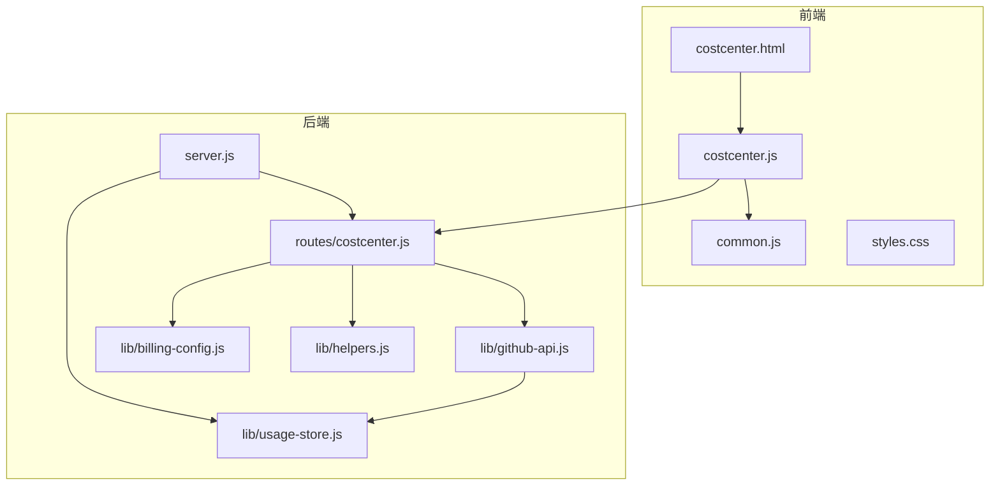
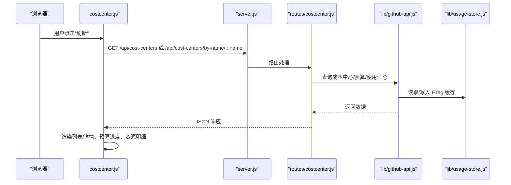
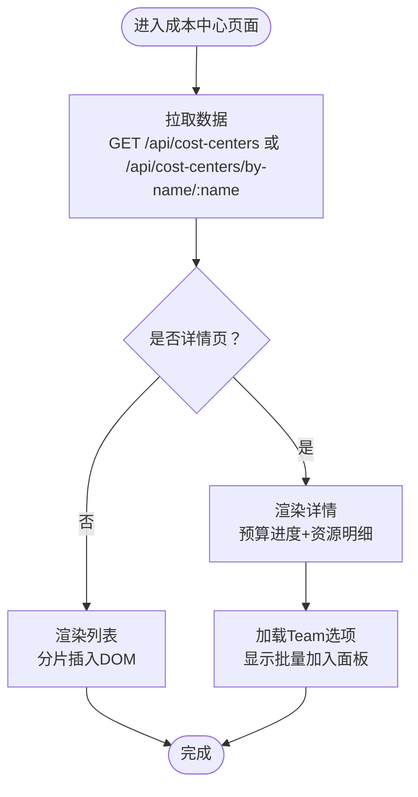
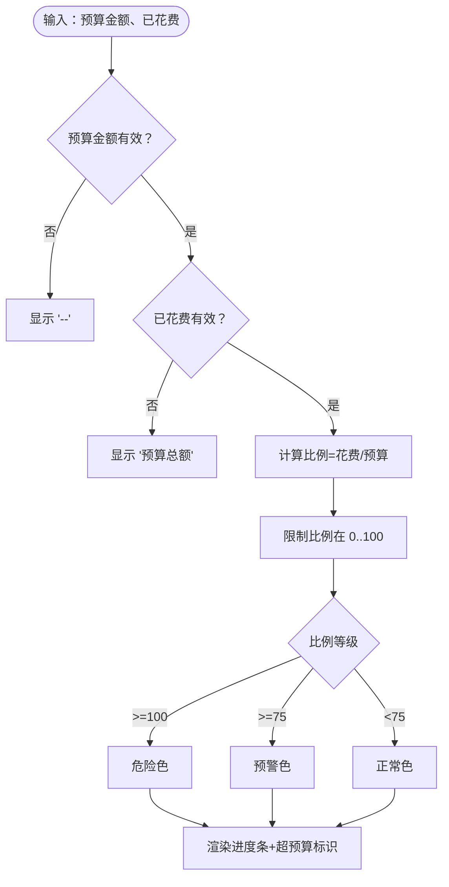
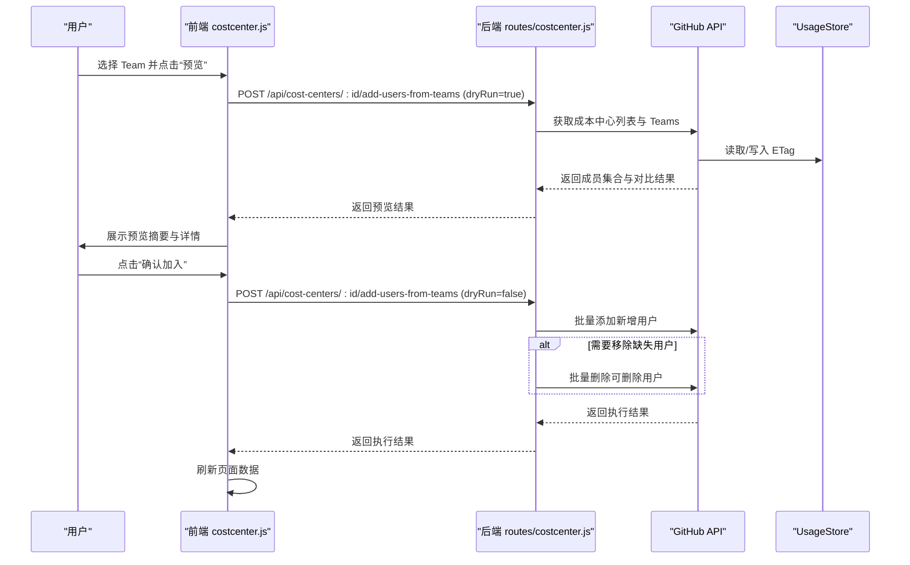
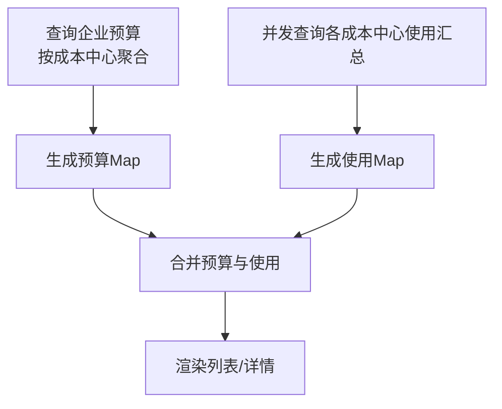
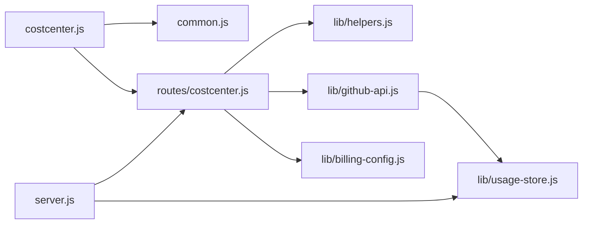

# 成本中心页面（CostCenter）

<cite>
**本文引用的文件**
- [public/costcenter.html](file://public/costcenter.html)
- [public/costcenter.js](file://public/costcenter.js)
- [public/common.js](file://public/common.js)
- [public/styles.css](file://public/styles.css)
- [routes/costcenter.js](file://routes/costcenter.js)
- [lib/github-api.js](file://lib/github-api.js)
- [lib/helpers.js](file://lib/helpers.js)
- [lib/billing-config.js](file://lib/billing-config.js)
- [server.js](file://server.js)
- [lib/usage-store.js](file://lib/usage-store.js)
- [data/user_mapping.json](file://data/user_mapping.json)
</cite>

## 目录
1. [简介](#简介)
2. [项目结构](#项目结构)
3. [核心组件](#核心组件)
4. [架构总览](#架构总览)
5. [详细组件分析](#详细组件分析)
6. [依赖关系分析](#依赖关系分析)
7. [性能考虑](#性能考虑)
8. [故障排查指南](#故障排查指南)
9. [结论](#结论)
10. [附录](#附录)

## 简介
本设计文档围绕 CopilotEnterpriseUsageDisplay 的“成本中心”页面，系统性阐述成本中心详情的展示设计、预算与使用情况的可视化、批量管理（多选、预览、执行）、Team 同步与自动匹配机制、预算进度计算与视觉反馈、层级与组织结构支持、权限与数据访问限制、备份与恢复机制，以及性能优化策略（分页与搜索过滤）。文档以前端 HTML/JS 与后端 Express 路由为核心，结合 GitHub API 访问层与本地缓存/持久化能力，提供端到端的实现与设计说明。

## 项目结构
成本中心页面由前端静态页面与脚本、公共工具库、后端路由与 API 访问层组成，并通过本地数据库进行缓存与持久化。关键模块如下：
- 前端页面与脚本：成本中心列表页与详情页、通用工具函数、样式表
- 后端路由：成本中心列表、详情、Team 批量加入 Users 的接口
- API 访问层：GitHub API 封装、并发队列、ETag 缓存、LRU 缓存
- 辅助模块：计费配置、环境变量解析、URL 构建
- 数据存储：SQLite 数据库存储每日用量、座位快照、ETag 缓存、月度账单

图表来源
- [public/costcenter.html](file://public/costcenter.html)
- [public/costcenter.js](file://public/costcenter.js)
- [public/common.js](file://public/common.js)
- [routes/costcenter.js](file://routes/costcenter.js)
- [lib/github-api.js](file://lib/github-api.js)
- [lib/helpers.js](file://lib/helpers.js)
- [lib/billing-config.js](file://lib/billing-config.js)
- [server.js](file://server.js)
- [lib/usage-store.js](file://lib/usage-store.js)

章节来源
- [public/costcenter.html](file://public/costcenter.html)
- [public/costcenter.js](file://public/costcenter.js)
- [public/common.js](file://public/common.js)
- [routes/costcenter.js](file://routes/costcenter.js)
- [lib/github-api.js](file://lib/github-api.js)
- [lib/helpers.js](file://lib/helpers.js)
- [lib/billing-config.js](file://lib/billing-config.js)
- [server.js](file://server.js)
- [lib/usage-store.js](file://lib/usage-store.js)

## 核心组件
- 成本中心页面（列表/详情）
  - 支持状态筛选（全部/active/deleted），刷新按钮，元数据显示（企业、总数、最后刷新时间）
  - 列表渲染：名称、席位订阅费、套餐外预算、状态、用户数量
  - 详情渲染：扩展资源明细网格（Users/Organizations/Repositories/Others）
- 预算进度可视化
  - 预算单元格包含“已花费/预算总额”、“百分比”、“进度条”与“超预算标识”
  - 进度条颜色分级：正常/预警/危险
- 批量管理（Team 同步）
  - 选择一个或多个 Team，预览变更（新增用户、已存在用户、可删除用户）
  - 确认加入 Users，支持“移除缺失用户”的二次确认
- 缓存与性能
  - 前端本地缓存（localStorage）+ 分片渲染（requestAnimationFrame）
  - 后端 GitHub API LRU 缓存与 ETag 条件请求，降低重复调用
- 数据持久化
  - SQLite 存储 ETag、日用量、座位快照、月度账单等

章节来源
- [public/costcenter.html](file://public/costcenter.html)
- [public/costcenter.js](file://public/costcenter.js)
- [public/common.js](file://public/common.js)
- [routes/costcenter.js](file://routes/costcenter.js)
- [lib/github-api.js](file://lib/github-api.js)
- [lib/usage-store.js](file://lib/usage-store.js)

## 架构总览
成本中心页面的数据流从浏览器发起，经由前端脚本调用后端路由，后端路由通过 GitHub API 获取企业级成本中心、预算与使用情况，再返回给前端渲染；同时利用本地缓存与数据库提升性能与稳定性。

图表来源
- [public/costcenter.js](file://public/costcenter.js)
- [routes/costcenter.js](file://routes/costcenter.js)
- [lib/github-api.js](file://lib/github-api.js)
- [lib/usage-store.js](file://lib/usage-store.js)

## 详细组件分析

### 成本中心列表与详情渲染
- 列表页
  - 支持状态筛选（active/deleted），默认 active
  - 刷新时先显示骨架屏，随后分片插入 DOM，避免阻塞
  - 预算单元格格式化显示“已花费/预算总额”与进度条
  - 用户数量统计基于资源类型为 user 的条目
- 详情页
  - 展示成本中心基本信息（ID、名称、状态、Azure Subscription、各类资源数量）
  - 展开资源明细网格，按类型分组显示（Users/Organizations/Repositories/Others）
  - 团队同步面板可见，加载企业 Team 列表用于批量加入 Users

图表来源
- [public/costcenter.js](file://public/costcenter.js)
- [routes/costcenter.js](file://routes/costcenter.js)

章节来源
- [public/costcenter.html](file://public/costcenter.html)
- [public/costcenter.js](file://public/costcenter.js)
- [routes/costcenter.js](file://routes/costcenter.js)

### 预算进度计算与视觉反馈
- 计算逻辑
  - 预算金额为空或无效时显示“--”
  - 已花费为空时显示“-- spent”与预算总额
  - 否则计算占比百分比，限定在 0~100
  - 根据占比划分等级：正常（<75%）、预警（>=75% 且 <100%）、危险（>=100%）
  - 超过预算时显示“超预算”提示
- 视觉呈现
  - 预算单元格包含“已花费/预算总额”文本与百分比
  - 进度条宽度与百分比一致，颜色随等级变化
  - 危险等级附加“超预算”标识

图表来源
- [public/costcenter.js](file://public/costcenter.js)

章节来源
- [public/costcenter.js](file://public/costcenter.js)

### 批量管理（Team 同步）设计
- 自动匹配与手动调整
  - 选择一个或多个 Team，系统获取 Team 成员集合
  - 对比目标成本中心现有 Users，区分“已存在用户”“可新增用户”“可删除用户”
  - 预览模式：仅计算不变更
  - 执行模式：批量添加新增用户，可选移除“在 Team 中不存在但在成本中心存在”的用户
- 幂等与安全
  - 新增与删除均采用批处理（每批固定大小），减少单次请求压力
  - 删除前二次确认，避免误删
- 结果反馈
  - 显示请求用户数、已存在数、可新增数、可删除数
  - 展示未识别 Team ID 与具体用户列表（折叠细节）

图表来源
- [public/costcenter.js](file://public/costcenter.js)
- [routes/costcenter.js](file://routes/costcenter.js)
- [lib/github-api.js](file://lib/github-api.js)
- [lib/usage-store.js](file://lib/usage-store.js)

章节来源
- [public/costcenter.js](file://public/costcenter.js)
- [routes/costcenter.js](file://routes/costcenter.js)
- [lib/github-api.js](file://lib/github-api.js)

### 预算数据来源与计算
- 预算映射
  - 通过 GitHub API 分页查询企业级预算，按成本中心名称聚合，合并 SKU 与预算金额
- 使用汇总
  - 根据年/月/成本中心 ID 查询使用汇总，按允许的 SKU 过滤后求和
  - 使用汇总采用并发分块（chunk）以提升吞吐
- 计费配置
  - 依据计划类型与配额/超价策略计算基础费用（此处用于列表页“席位订阅费”展示）

图表来源
- [routes/costcenter.js](file://routes/costcenter.js)
- [lib/billing-config.js](file://lib/billing-config.js)

章节来源
- [routes/costcenter.js](file://routes/costcenter.js)
- [lib/billing-config.js](file://lib/billing-config.js)

### 权限控制与数据访问限制
- 环境变量与端点约束
  - 后端通过构建端点函数校验环境变量（ENTERPRISE_SLUG 或 ORG_NAME），仅支持 enterprise 模式
  - 若未设置，抛出错误并阻止访问
- API 错误处理
  - 统一错误响应体，包含消息与可选速率限制信息
  - 429/速率限制场景提供人性化提示

章节来源
- [lib/helpers.js](file://lib/helpers.js)
- [routes/costcenter.js](file://routes/costcenter.js)

### 成本中心层级与组织结构支持
- 资源类型分组
  - 成本中心资源包含 user、organization/org、repository/repo、other 等类型
  - 渲染时按类型分组显示，便于理解资源构成
- 组织结构体现
  - 通过 Organizations 与 Repositories 数量直观反映成本中心覆盖范围

章节来源
- [public/costcenter.js](file://public/costcenter.js)

### 数据备份与恢复机制
- ETag 缓存与本地持久化
  - GitHub API 请求命中 ETag 时返回 304，避免重复拉取
  - ETag 与数据持久化至 SQLite，重启后可恢复
- 日用量与座位快照
  - 日用量与座位快照定期清理，保留最近若干天/快照，防止无限增长
- 月度账单
  - 月度账单按年月聚合，支持重新计算与替换

章节来源
- [lib/github-api.js](file://lib/github-api.js)
- [lib/usage-store.js](file://lib/usage-store.js)

## 依赖关系分析
- 前端依赖
  - costcenter.js 依赖 common.js 提供的通用工具（格式化、缓存、错误处理）
  - 页面依赖样式表统一视觉风格
- 后端依赖
  - routes/costcenter.js 依赖 helpers 构建端点、helpers.toNumber 数值转换
  - 依赖 github-api 进行 GitHub API 访问与缓存
  - 依赖 billing-config 提供计费配置
  - server.js 挂载路由并初始化 UsageStore 与 ETag 缓存

图表来源
- [public/costcenter.js](file://public/costcenter.js)
- [public/common.js](file://public/common.js)
- [routes/costcenter.js](file://routes/costcenter.js)
- [lib/helpers.js](file://lib/helpers.js)
- [lib/github-api.js](file://lib/github-api.js)
- [lib/billing-config.js](file://lib/billing-config.js)
- [server.js](file://server.js)
- [lib/usage-store.js](file://lib/usage-store.js)

章节来源
- [public/costcenter.js](file://public/costcenter.js)
- [public/common.js](file://public/common.js)
- [routes/costcenter.js](file://routes/costcenter.js)
- [lib/helpers.js](file://lib/helpers.js)
- [lib/github-api.js](file://lib/github-api.js)
- [lib/billing-config.js](file://lib/billing-config.js)
- [server.js](file://server.js)
- [lib/usage-store.js](file://lib/usage-store.js)

## 性能考虑
- 前端渲染优化
  - 分片渲染：使用 requestAnimationFrame 分批插入行，避免长时间阻塞主线程
  - 骨架屏：刷新时先渲染骨架行，提升感知速度
  - 本地缓存：localStorage 缓存最近一次数据，减少网络往返
- 后端 API 优化
  - LRU 缓存与 ETag 条件请求：命中缓存直接返回，未变更返回 304
  - 并发队列与重试退避：限制并发、指数回退，提高稳定性
  - 分块并发：使用 Promise.all 并发查询使用汇总，缩短总耗时
- 数据库与缓存
  - SQLite 存储 ETag、日用量、座位快照，定期清理过期数据
  - TTL 策略：不同路径设置不同缓存时长，平衡新鲜度与性能

章节来源
- [public/costcenter.js](file://public/costcenter.js)
- [public/common.js](file://public/common.js)
- [lib/github-api.js](file://lib/github-api.js)
- [lib/usage-store.js](file://lib/usage-store.js)

## 故障排查指南
- 速率限制
  - 前端检测到速率限制时，提示“预计恢复时间”，建议稍后再试
  - 后端统一捕获 429/403 速率限制，返回带恢复时间的消息
- 网络异常
  - 统一错误响应体，包含 message；若包含 rateLimit 信息，前端会格式化提示
- 数据为空
  - 列表为空时显示“当前筛选下没有 cost center 数据”
  - 详情为空时显示“未找到该 cost center”
- Team 同步问题
  - 未识别 Team ID：在结果中列出
  - 执行前二次确认：若存在可删除用户，弹窗确认是否删除

章节来源
- [public/common.js](file://public/common.js)
- [routes/costcenter.js](file://routes/costcenter.js)
- [lib/github-api.js](file://lib/github-api.js)

## 结论
成本中心页面通过清晰的预算进度可视化、完善的批量 Team 同步流程、稳健的前后端缓存与数据库机制，实现了高效、可观测的成本中心管理体验。前端采用分片渲染与本地缓存，后端通过并发与 ETag 缓存降低 API 压力，整体具备良好的可扩展性与可维护性。后续可在前端引入分页与搜索过滤、后端引入更细粒度的权限控制与审计日志，进一步增强可用性与安全性。

## 附录
- 样式与交互
  - 预算进度条、资源标签、展开/收起按钮、团队选择面板等 UI 组件均在样式表中定义
- 数据文件
  - 用户映射数据位于 data/user_mapping.json，用于用户信息关联与展示

章节来源
- [public/styles.css](file://public/styles.css)
- [data/user_mapping.json](file://data/user_mapping.json)