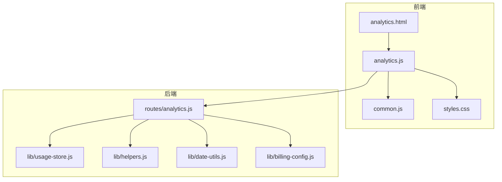
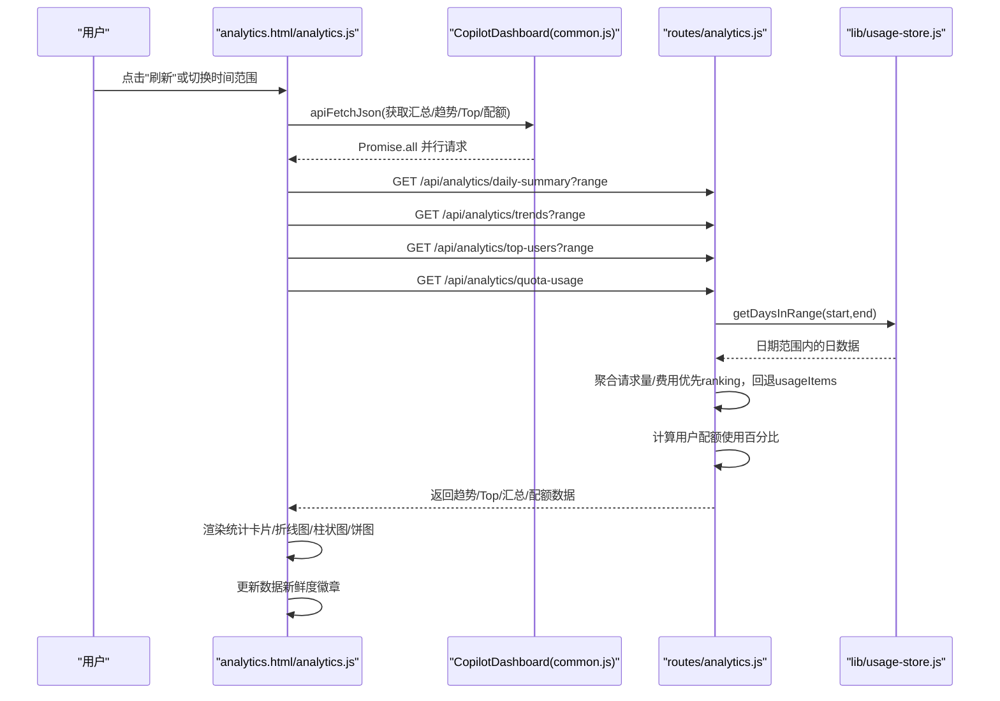
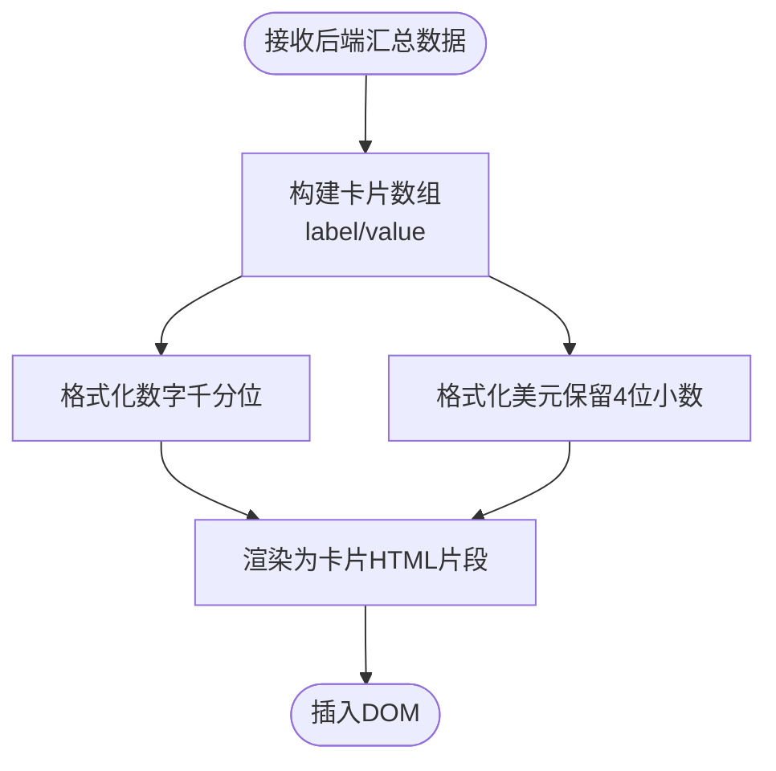
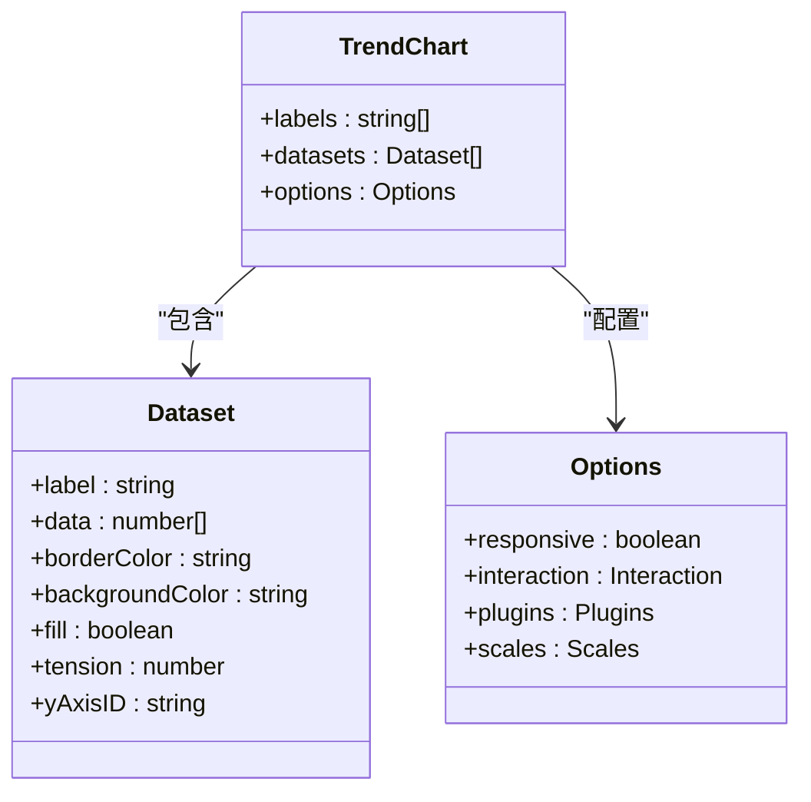
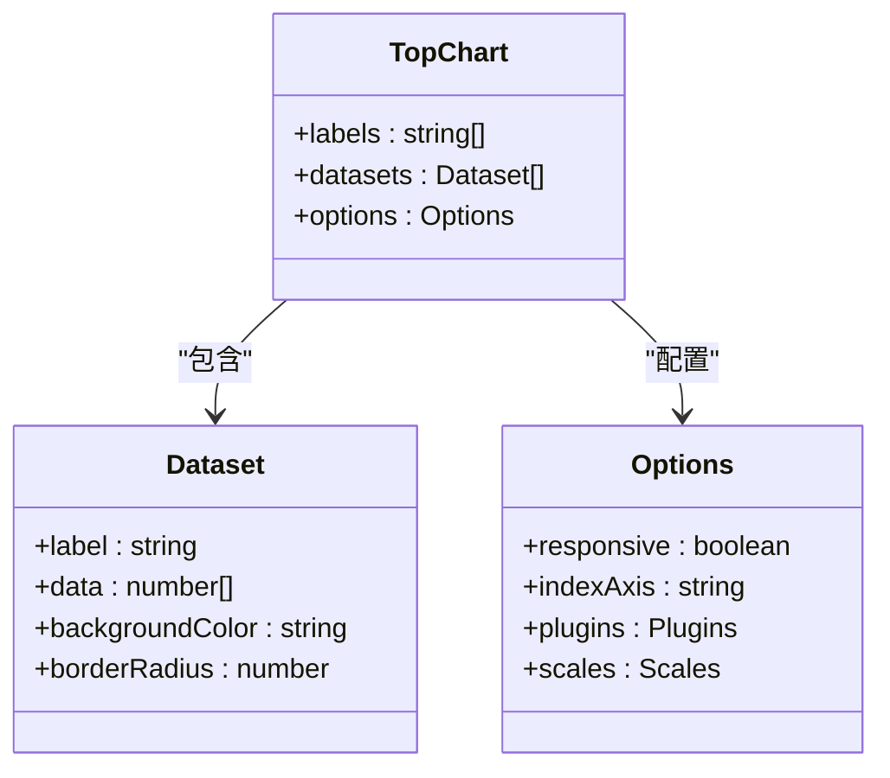
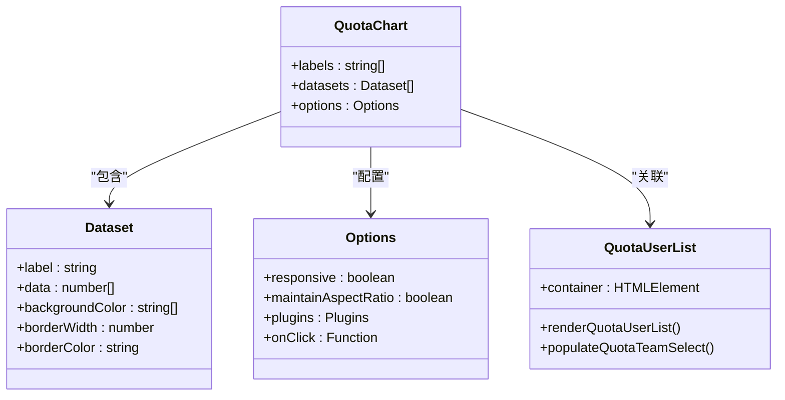
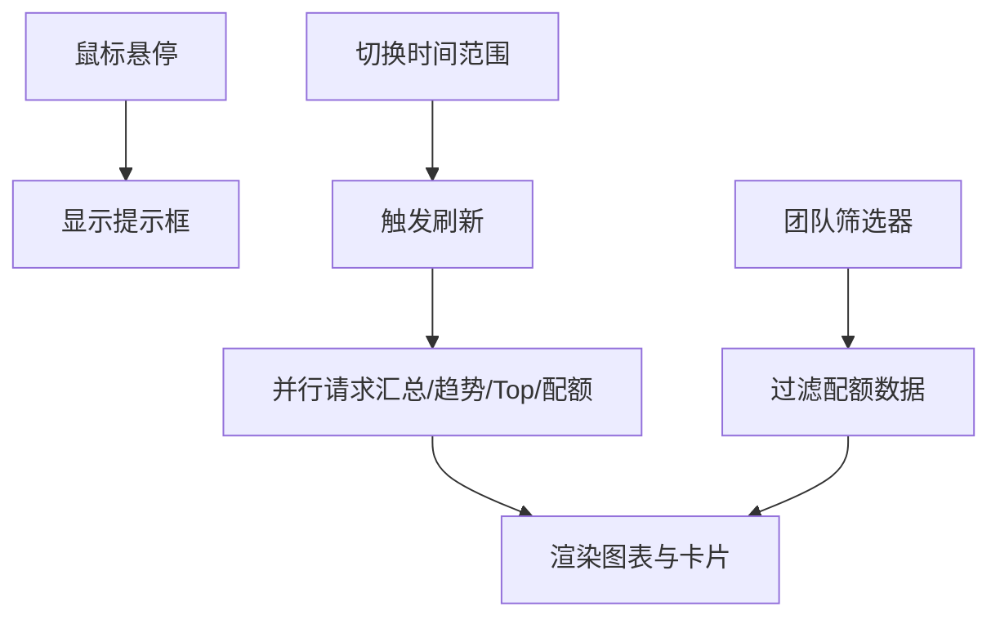
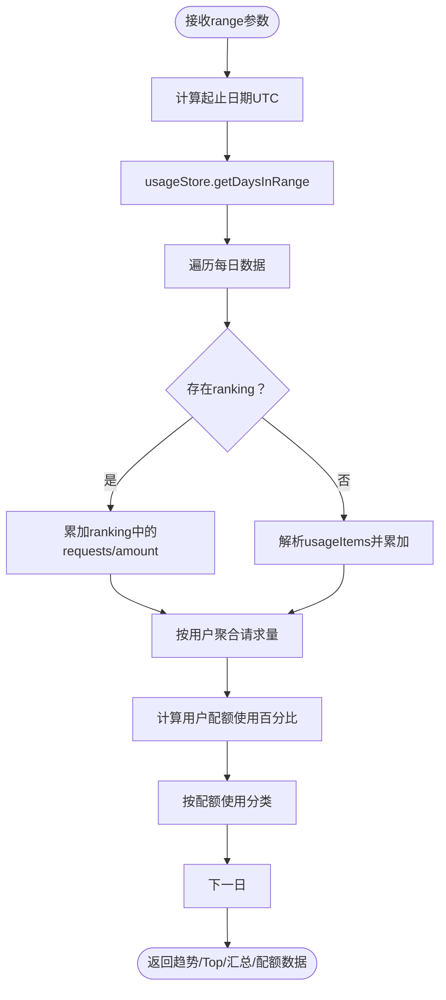
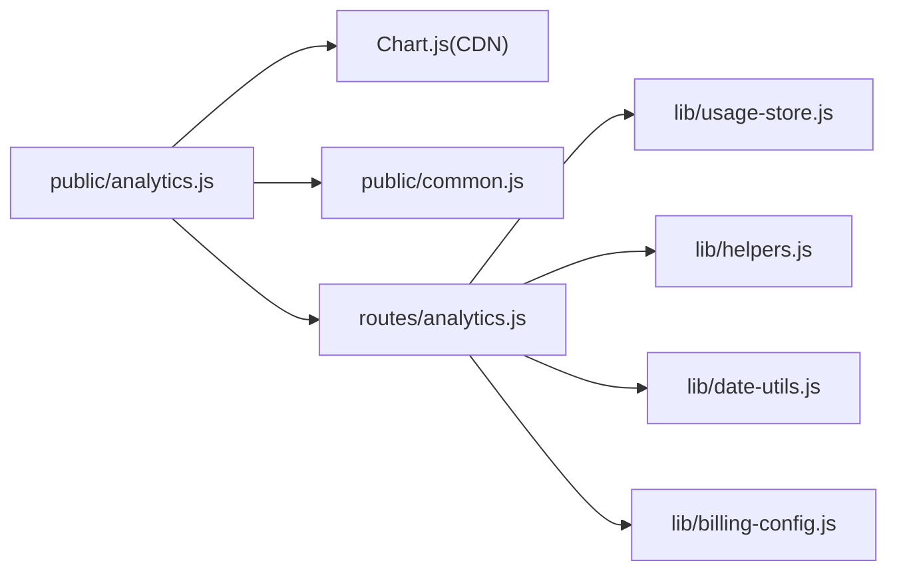

# 数据分析页面 (Analytics)

<cite>
**本文引用的文件**
- [analytics.html](file://public/analytics.html)
- [analytics.js](file://public/analytics.js)
- [common.js](file://public/common.js)
- [analytics.js](file://routes/analytics.js)
- [usage-store.js](file://lib/usage-store.js)
- [date-utils.js](file://lib/date-utils.js)
- [helpers.js](file://lib/helpers.js)
- [billing-config.js](file://lib/billing-config.js)
- [styles.css](file://public/styles.css)
- [README.md](file://README.md)
- [package.json](file://package.json)
</cite>

## 更新摘要
**变更内容**
- 新增"本周期套餐用量"标签页，提供配额使用分析功能
- 添加配额使用饼图和用户分类功能
- 新增配额使用API路由和相关数据处理逻辑
- 扩展用户活动分类功能，支持配额使用分类

## 目录
1. [简介](#简介)
2. [项目结构](#项目结构)
3. [核心组件](#核心组件)
4. [架构概览](#架构概览)
5. [详细组件分析](#详细组件分析)
6. [依赖关系分析](#依赖关系分析)
7. [性能考量](#性能考量)
8. [故障排查指南](#故障排查指南)
9. [结论](#结论)
10. [附录](#附录)

## 简介
本设计文档聚焦 CopilotEnterpriseUsageDisplay 的数据分析页面（Analytics），围绕趋势图表（折线图）、统计面板（总量、平均值、峰值等）、交互式图表能力（缩放、平移、数据钻取）、时间序列数据处理与聚合、图表库选择与配置（响应式布局与主题定制）、数据导出（CSV/图片）、性能优化（分页与懒加载）、以及用户体验（加载状态与错误处理）进行全面阐述。**更新**：新增配额使用分析功能，提供"本周期套餐用量"标签页，支持用户配额使用情况的可视化分析。

## 项目结构
数据分析页面由前端 HTML/JS/CSS 与后端路由/数据层共同组成，采用模块化分层架构：
- 前端：analytics.html（页面结构）、analytics.js（图表渲染与交互）、common.js（通用工具）、styles.css（样式与主题）
- 后端：routes/analytics.js（分析 API 路由）、lib/usage-store.js（SQLite 持久化与查询）、lib/helpers.js（通用辅助函数）、lib/date-utils.js（日期工具）、lib/billing-config.js（计费配置）

**图表来源**
- [analytics.html:1-102](file://public/analytics.html#L1-L102)
- [analytics.js:1-651](file://public/analytics.js#L1-L651)
- [common.js:1-113](file://public/common.js#L1-L113)
- [analytics.js:1-297](file://routes/analytics.js#L1-L297)
- [usage-store.js:1-333](file://lib/usage-store.js#L1-L333)
- [helpers.js:1-185](file://lib/helpers.js#L1-L185)
- [billing-config.js:1-25](file://lib/billing-config.js#L1-L25)
- [date-utils.js:1-46](file://lib/date-utils.js#L1-L46)
- [styles.css:1-1301](file://public/styles.css#L1-L1301)

**章节来源**
- [analytics.html:1-102](file://public/analytics.html#L1-L102)
- [analytics.js:1-651](file://public/analytics.js#L1-L651)
- [common.js:1-113](file://public/common.js#L1-L113)
- [analytics.js:1-297](file://routes/analytics.js#L1-L297)
- [usage-store.js:1-333](file://lib/usage-store.js#L1-L333)
- [helpers.js:1-185](file://lib/helpers.js#L1-L185)
- [billing-config.js:1-25](file://lib/billing-config.js#L1-L25)
- [date-utils.js:1-46](file://lib/date-utils.js#L1-L46)
- [styles.css:1-1301](file://public/styles.css#L1-L1301)

## 核心组件
- 统计卡片面板：展示总请求量、总费用、日均请求、日均费用、有数据天数/总天数等关键指标。
- 趋势图（折线图）：双轴展示请求量（左轴）与费用（右轴），支持响应式与交互式提示。
- Top 用户柱状图：横向柱状图展示前 20 用户的请求量排行。
- **新增** 配额使用饼图：展示用户配额使用情况的分布，支持按团队筛选。
- 查询范围与刷新：支持 30/90/365 天范围切换与手动刷新。
- 数据新鲜度提示：显示"最新/老化/陈旧"状态徽章，并定时更新。
- 错误处理与加载状态：统一的错误提示与按钮禁用/文案切换。

**章节来源**
- [analytics.html:35-41](file://public/analytics.html#L35-L41)
- [analytics.js:36-47](file://public/analytics.js#L36-L47)
- [analytics.js:50-114](file://public/analytics.js#L50-L114)
- [analytics.js:117-156](file://public/analytics.js#L117-L156)
- [analytics.js:485-584](file://public/analytics.js#L485-L584)
- [analytics.js:214-230](file://public/analytics.js#L214-L230)

## 架构概览
前端通过 Chart.js 渲染图表，使用 CopilotDashboard 命名空间提供的通用方法进行 API 请求与错误处理。后端路由根据 range 参数生成时间序列数据，优先使用 SQLite 中的 per-user 聚合结果（ranking 字段），回退到原始 usageItems，最终返回趋势、Top 用户、日汇总统计和**新增的配额使用数据**。

**图表来源**
- [analytics.js:261-297](file://public/analytics.js#L261-L297)
- [common.js:39-53](file://public/common.js#L39-L53)
- [analytics.js:12-44](file://routes/analytics.js#L12-L44)
- [analytics.js:96-179](file://routes/analytics.js#L96-L179)
- [analytics.js:44-91](file://routes/analytics.js#L44-L91)
- [analytics.js:93-128](file://routes/analytics.js#L93-L128)
- [usage-store.js:162-164](file://lib/usage-store.js#L162-L164)

**章节来源**
- [analytics.js:261-297](file://public/analytics.js#L261-L297)
- [common.js:39-53](file://public/common.js#L39-L53)
- [analytics.js:12-179](file://routes/analytics.js#L12-L179)
- [usage-store.js:162-164](file://lib/usage-store.js#L162-L164)

## 详细组件分析

### 统计卡片面板
- 展示内容：总请求量、总费用、日均请求、日均费用、有数据天数/总天数。
- 渲染逻辑：将后端返回的数值格式化为中文数字与美元格式，拼接为卡片 HTML。
- 交互：卡片随刷新与范围切换实时更新。

**图表来源**
- [analytics.js:50-61](file://public/analytics.js#L50-L61)
- [analytics.js:39-47](file://public/analytics.js#L39-L47)

**章节来源**
- [analytics.js:50-61](file://public/analytics.js#L50-L61)
- [analytics.js:39-47](file://public/analytics.js#L39-L47)

### 趋势图（折线图）
- 数据源：后端 /api/analytics/trends，按日期聚合请求量与费用。
- 图表类型：Line（双Y轴），左轴为请求量，右轴为费用。
- 交互：悬停提示、索引模式交互、响应式布局。
- 样式：自定义颜色、填充、曲线张力、轴标题。

**图表来源**
- [analytics.js:64-128](file://public/analytics.js#L64-L128)

**章节来源**
- [analytics.js:64-128](file://public/analytics.js#L64-L128)

### Top 用户柱状图（Top 用户排行）
- 数据源：后端 /api/analytics/top-users，按用户聚合请求量，取前 20。
- 图表类型：Bar（水平），indexAxis: "y"。
- 交互：悬停提示显示请求量。
- 样式：统一绿色背景、圆角柱形、轴标题。

**图表来源**
- [analytics.js:131-176](file://public/analytics.js#L131-L176)

**章节来源**
- [analytics.js:131-176](file://public/analytics.js#L131-L176)

### **新增** 配额使用饼图（本周期套餐用量）
- 数据源：后端 /api/analytics/quota-usage，计算每个用户的配额使用百分比。
- 图表类型：Doughnut（环形图），展示用户配额使用分布。
- 分类标准：小于5%、5%-50%、50%-100%、100%-200%、大于200%。
- 交互：点击扇区显示对应用户列表，支持按团队筛选。
- 样式：五色渐变配色方案，响应式布局。

**图表来源**
- [analytics.js:485-584](file://public/analytics.js#L485-L584)

**章节来源**
- [analytics.js:485-584](file://public/analytics.js#L485-L584)
- [routes/analytics.js:96-179](file://routes/analytics.js#L96-L179)
- [helpers.js:148-171](file://lib/helpers.js#L148-L171)

### 交互式图表与数据钻取
- 缩放/平移：Chart.js 默认支持缩放与平移（需启用插件），当前页面未显式启用，但具备扩展能力。
- 数据钻取：通过时间范围切换（30/90/365 天）实现按粒度钻取。
- **新增** 配额钻取：通过团队筛选器实现按团队的配额使用分析。
- 交互提示：悬停索引模式与自定义提示回调。

**图表来源**
- [analytics.js:88-94](file://public/analytics.js#L88-L94)
- [analytics.js:261-297](file://public/analytics.js#L261-L297)
- [analytics.js:603-627](file://public/analytics.js#L603-L627)

**章节来源**
- [analytics.js:88-94](file://public/analytics.js#L88-L94)
- [analytics.js:261-297](file://public/analytics.js#L261-L297)
- [analytics.js:603-627](file://public/analytics.js#L603-L627)

### 时间序列数据处理与聚合
- 路由层聚合：优先使用 SQLite 中的 ranking 字段（per-user 聚合结果），不存在则回退 usageItems。
- 聚合维度：按日期累加 requests 与 amount；按用户累加 requests 与 amount。
- **新增** 配额计算：基于座位信息和计划配额计算用户配额使用百分比。
- 日期范围：根据 range 参数计算起止日期，使用 UTC 日期字符串查询。

**图表来源**
- [analytics.js:12-44](file://routes/analytics.js#L12-L44)
- [analytics.js:46-94](file://routes/analytics.js#L46-L94)
- [analytics.js:96-179](file://routes/analytics.js#L96-L179)
- [usage-store.js:162-164](file://lib/usage-store.js#L162-L164)

**章节来源**
- [analytics.js:12-179](file://routes/analytics.js#L12-L179)
- [usage-store.js:162-164](file://lib/usage-store.js#L162-L164)

### 图表库选择与配置
- 图表库：Chart.js（CDN 引入），版本 4。
- 配置要点：响应式、交互模式、双轴、提示回调、轴标题与刻度限制。
- 主题定制：通过 CSS 变量与 Chart.js 颜色配置实现品牌风格统一。

**章节来源**
- [analytics.html:97-99](file://public/analytics.html#L97-L99)
- [analytics.js:97-128](file://public/analytics.js#L97-L128)
- [styles.css:1-1301](file://public/styles.css#L1-L1301)

### 数据导出（CSV/图片）
- CSV 导出：当前页面未实现前端导出按钮；后端未暴露 CSV 导出接口。
- 图片导出：Chart.js 支持 canvas 导出图片，可在页面中添加导出按钮并调用 Chart.toBase64Image 或下载 Canvas。
- 建议：在现有刷新按钮旁增加"导出图片"按钮，或在菜单中增加"导出CSV"入口（需后端新增 /api/analytics/export）。

**章节来源**
- [analytics.js:261-297](file://public/analytics.js#L261-L297)

### 用户体验优化
- 加载状态：刷新按钮禁用与文案切换，避免重复提交。
- 错误处理：统一 setError，区分速率限制与一般错误，友好提示。
- 数据新鲜度：定时更新徽章，区分"最新/老化/陈旧"。
- **新增** 配额使用筛选：提供团队筛选器，支持按团队查看配额使用情况。

**章节来源**
- [analytics.js:261-297](file://public/analytics.js#L261-L297)
- [common.js:19-37](file://public/common.js#L19-L37)
- [analytics.js:214-230](file://public/analytics.js#L214-L230)
- [analytics.js:603-627](file://public/analytics.js#L603-L627)

## 依赖关系分析
- 前端依赖：Chart.js（CDN）、CopilotDashboard（common.js）。
- 后端依赖：better-sqlite3（SQLite）、express（路由）、pino（日志）。
- 内部依赖：usage-store.js 提供 SQLite 查询与预编译语句；helpers.js 提供通用工具；date-utils.js 提供日期解析与枚举。

**图表来源**
- [analytics.js:1-651](file://public/analytics.js#L1-L651)
- [analytics.js:1-297](file://routes/analytics.js#L1-L297)
- [usage-store.js:1-333](file://lib/usage-store.js#L1-L333)
- [helpers.js:1-185](file://lib/helpers.js#L1-L185)
- [date-utils.js:1-46](file://lib/date-utils.js#L1-L46)
- [billing-config.js:1-25](file://lib/billing-config.js#L1-L25)

**章节来源**
- [package.json:12-21](file://package.json#L12-L21)
- [analytics.js:1-651](file://public/analytics.js#L1-L651)
- [analytics.js:1-297](file://routes/analytics.js#L1-L297)
- [usage-store.js:1-333](file://lib/usage-store.js#L1-L333)
- [helpers.js:1-185](file://lib/helpers.js#L1-L185)
- [date-utils.js:1-46](file://lib/date-utils.js#L1-L46)
- [billing-config.js:1-25](file://lib/billing-config.js#L1-L25)

## 性能考量
- 数据来源：所有分析 API 均从 SQLite 读取，不直接调用 GitHub API，响应迅速。
- 并行请求：前端使用 Promise.all 并行获取汇总、趋势、Top 用户和**新增的配额使用**数据，减少总等待时间。
- 前端缓存：common.js 提供 localStorage 缓存工具（getCachedData/setCachedData），可用于短期缓存分析结果。
- 图表性能：Chart.js 默认响应式与交互，建议在大数据集时启用懒加载与分页（见下一节）。
- 后端优化：SQLite 预编译语句与索引（idx_daily_usage_date）提升查询效率。

**章节来源**
- [README.md:571-585](file://README.md#L571-L585)
- [analytics.js:268-272](file://public/analytics.js#L268-L272)
- [common.js:83-96](file://public/common.js#L83-L96)
- [usage-store.js:83-129](file://lib/usage-store.js#L83-L129)

## 故障排查指南
- 速率限制：后端与前端均识别 GitHub API 速率限制，返回友好提示与恢复时间。
- 错误提示：setError 统一显示错误消息；刷新按钮在错误时保持可用状态以便再次尝试。
- 数据新鲜度：若显示"陈旧"徽章，建议刷新或等待缓存更新。
- 网络问题：检查 /api/analytics/* 是否可达，确认后端服务运行正常。
- **新增** 配额数据问题：检查座位数据是否正确加载，确认用户配额计算逻辑正常。

**章节来源**
- [common.js:25-37](file://public/common.js#L25-L37)
- [common.js:19-23](file://public/common.js#L19-L23)
- [analytics.js:214-230](file://public/analytics.js#L214-L230)

## 结论
数据分析页面通过 Chart.js 实现了清晰的趋势与排行可视化，结合 SQLite 的高效查询与并行请求策略，提供了良好的用户体验。**更新**：新增的配额使用分析功能进一步完善了数据分析能力，支持用户配额使用情况的深度分析。建议在未来版本中补充数据导出（CSV/图片）能力与交互式缩放/平移功能，并进一步优化大数据集下的懒加载与分页策略。

## 附录
- API 列表（内部）：
  - GET /api/analytics/trends?range=30
  - GET /api/analytics/top-users?range=30
  - GET /api/analytics/daily-summary?range=30
  - **新增** GET /api/analytics/quota-usage
- 依赖库：
  - Chart.js（CDN）
  - better-sqlite3
  - express
  - pino

**章节来源**
- [README.md:123-126](file://README.md#L123-L126)
- [package.json:12-21](file://package.json#L12-L21)