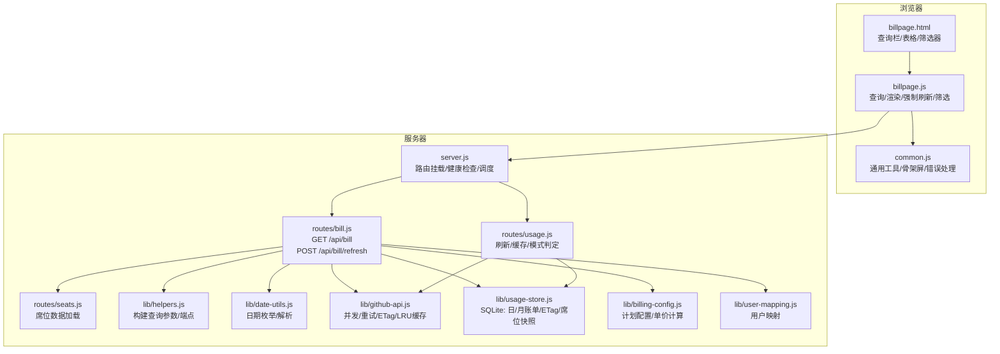
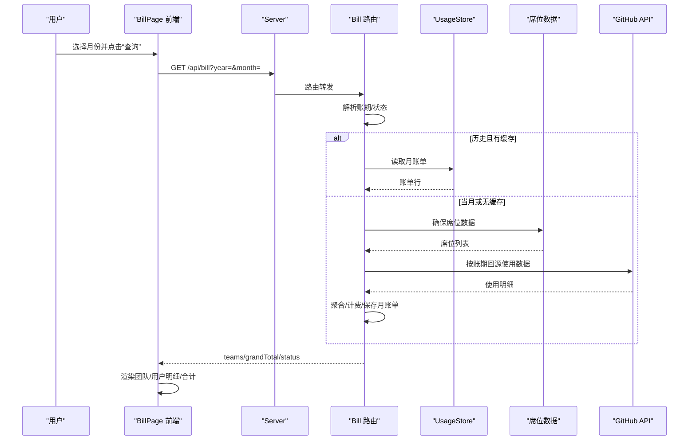
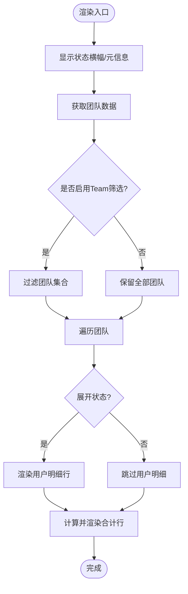
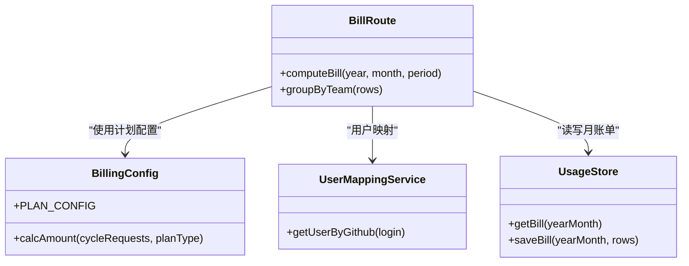
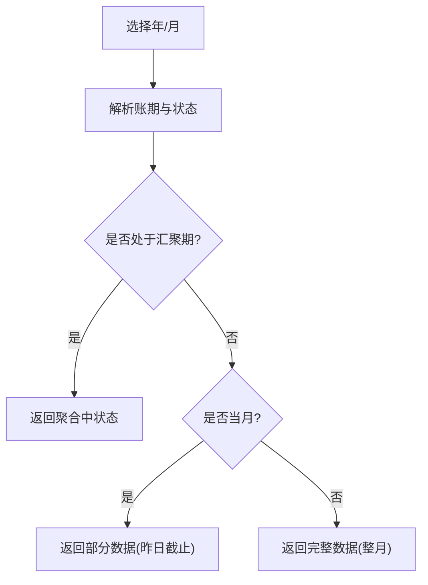
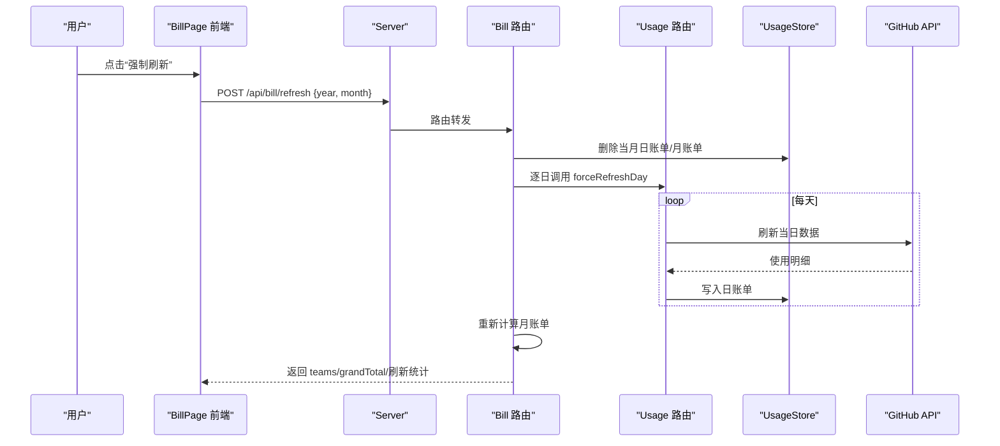
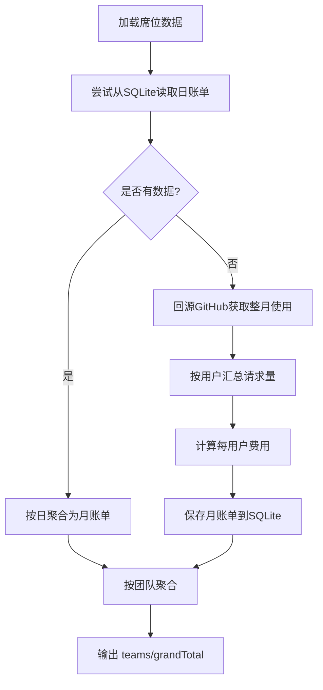
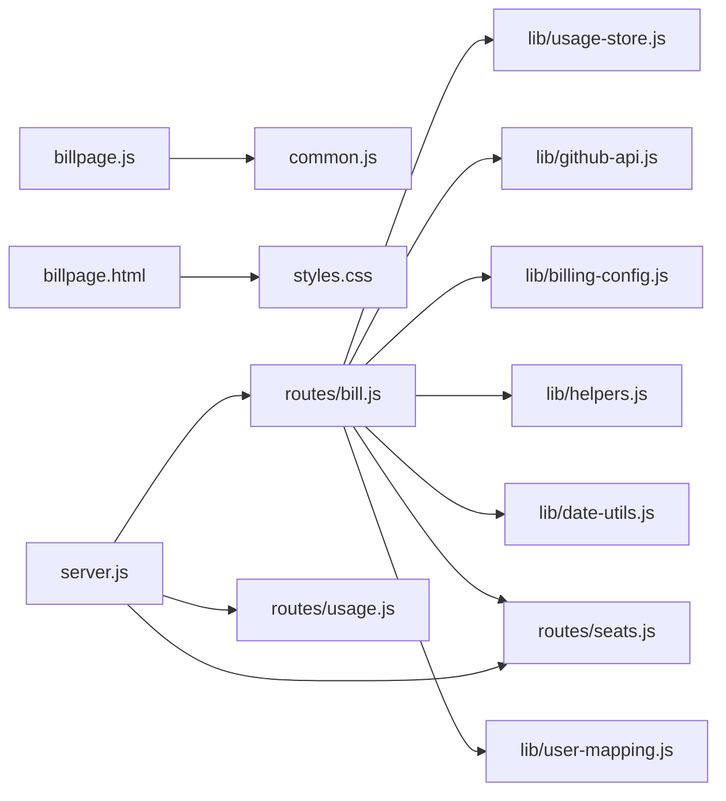

# 月度账单页面 (BillPage)

<cite>
**本文引用的文件**
- [public/billpage.html](file://public/billpage.html)
- [public/billpage.js](file://public/billpage.js)
- [routes/bill.js](file://routes/bill.js)
- [lib/usage-store.js](file://lib/usage-store.js)
- [lib/billing-config.js](file://lib/billing-config.js)
- [lib/github-api.js](file://lib/github-api.js)
- [lib/date-utils.js](file://lib/date-utils.js)
- [public/common.js](file://public/common.js)
- [routes/seats.js](file://routes/seats.js)
- [routes/usage.js](file://routes/usage.js)
- [lib/helpers.js](file://lib/helpers.js)
- [lib/user-mapping.js](file://lib/user-mapping.js)
- [server.js](file://server.js)
- [public/styles.css](file://public/styles.css)
</cite>

## 目录
1. [简介](#简介)
2. [项目结构](#项目结构)
3. [核心组件](#核心组件)
4. [架构总览](#架构总览)
5. [详细组件分析](#详细组件分析)
6. [依赖关系分析](#依赖关系分析)
7. [性能考量](#性能考量)
8. [故障排查指南](#故障排查指南)
9. [结论](#结论)
10. [附录](#附录)

## 简介
本设计文档聚焦于 Copilot Enterprise 月度账单页面（BillPage），系统性阐述账单详情展示、团队与用户维度的费用分析、历史数据对比、强制刷新机制、数据聚合算法、预算控制与超支提醒的视觉反馈、权限与安全、以及性能优化策略（含大数据集分页与虚拟滚动建议）。目标是帮助开发者与产品人员理解前端交互、后端聚合与缓存、以及如何在大规模数据场景下保持稳定与高效。

## 项目结构
BillPage 页面由前端 HTML/JS 与后端路由共同构成：
- 前端页面负责查询、筛选、渲染与交互；后端路由负责账单聚合、缓存与强制刷新。
- 核心数据来源为 GitHub API 的 Copilot Premium Request Usage，结合本地 SQLite 缓存与席位数据，最终输出团队与用户的费用明细。

图表来源
- [server.js:111-113](file://server.js#L111-L113)
- [routes/bill.js:13-14](file://routes/bill.js#L13-L14)
- [routes/usage.js:13-14](file://routes/usage.js#L13-L14)
- [routes/seats.js:37-75](file://routes/seats.js#L37-L75)
- [lib/github-api.js:307-320](file://lib/github-api.js#L307-L320)
- [lib/usage-store.js:10-79](file://lib/usage-store.js#L10-L79)
- [lib/billing-config.js:11-24](file://lib/billing-config.js#L11-L24)
- [lib/helpers.js:38-82](file://lib/helpers.js#L38-L82)
- [lib/date-utils.js:19-33](file://lib/date-utils.js#L19-L33)
- [lib/user-mapping.js:7-22](file://lib/user-mapping.js#L7-L22)

章节来源
- [server.js:88-99](file://server.js#L88-L99)
- [public/billpage.html:1-67](file://public/billpage.html#L1-L67)
- [public/billpage.js:1-285](file://public/billpage.js#L1-L285)

## 核心组件
- 查询与筛选
  - 月度选择器、查询按钮、强制刷新按钮、Team 筛选下拉。
- 渲染与状态
  - 团队级汇总、用户级明细、合计行、Banner 状态提示。
- 数据聚合
  - 团队维度费用聚合、用户维度费用计算、计划配额与超支计费。
- 强制刷新
  - 清理缓存、逐日回源 GitHub、重新计算并返回结果。
- 权限与安全
  - 环境变量校验、ETag 条件请求、速率限制处理、错误降级。
- 性能优化
  - SQLite 缓存、并发节流、LRU 缓存、骨架屏、可选虚拟滚动。

章节来源
- [public/billpage.html:19-36](file://public/billpage.html#L19-L36)
- [public/billpage.js:50-146](file://public/billpage.js#L50-L146)
- [routes/bill.js:134-198](file://routes/bill.js#L134-L198)
- [routes/bill.js:321-403](file://routes/bill.js#L321-L403)
- [lib/github-api.js:108-227](file://lib/github-api.js#L108-L227)
- [lib/usage-store.js:10-79](file://lib/usage-store.js#L10-L79)

## 架构总览
前端通过 GET /api/bill 获取账单数据，后端优先从 SQLite 月账单表读取；若为当月或缓存不完整，则回源 GitHub API 计算并持久化。强制刷新会清理当月日账单与月账单，逐日回源并重新聚合。

图表来源
- [public/billpage.js:194-222](file://public/billpage.js#L194-L222)
- [routes/bill.js:237-313](file://routes/bill.js#L237-L313)
- [routes/bill.js:134-198](file://routes/bill.js#L134-L198)
- [routes/seats.js:37-75](file://routes/seats.js#L37-L75)
- [lib/usage-store.js:282-320](file://lib/usage-store.js#L282-L320)

## 详细组件分析

### 1) 账单详情展示设计
- 表格列：Team、成员数、席位费、套餐外附加费、总费用。
- 展示逻辑
  - 团队行：支持点击展开/收起用户明细。
  - 用户行：显示登录名、计划类型、请求量/配额、席位费、超支费用、小计。
  - 合计行：根据可见团队累加。
- Banner 与元信息
  - 显示账期范围与状态（进行中/已完结）。
  - 聚合中/部分数据状态提示。
- 安全与可访问性
  - 内容转义防止 XSS。
  - 骨架屏提升加载体验。

图表来源
- [public/billpage.js:50-146](file://public/billpage.js#L50-L146)

章节来源
- [public/billpage.html:42-59](file://public/billpage.html#L42-L59)
- [public/billpage.js:50-146](file://public/billpage.js#L50-L146)

### 2) 团队维度费用分析与用户级别用量明细
- 团队维度
  - 成员数、席位费、超支费用、总费用。
  - 按团队名称排序，用户按登录名排序。
- 用户维度
  - 登录名、计划类型、请求总量/配额、席位费、超支请求与费用、小计。
  - 通过用户映射服务补充 AD 名称等字段。
- 计费规则
  - 不同计划类型有不同的配额与单价，超支按超出配额部分计费。

图表来源
- [routes/bill.js:134-198](file://routes/bill.js#L134-L198)
- [routes/bill.js:203-233](file://routes/bill.js#L203-L233)
- [lib/billing-config.js:11-24](file://lib/billing-config.js#L11-L24)
- [lib/user-mapping.js:118-122](file://lib/user-mapping.js#L118-L122)
- [lib/usage-store.js:282-320](file://lib/usage-store.js#L282-L320)

章节来源
- [routes/bill.js:161-191](file://routes/bill.js#L161-L191)
- [routes/bill.js:203-233](file://routes/bill.js#L203-L233)
- [lib/billing-config.js:11-24](file://lib/billing-config.js#L11-L24)
- [lib/user-mapping.js:118-122](file://lib/user-mapping.js#L118-L122)

### 3) 历史数据对比与时间轴选择
- 时间轴选择
  - 月度选择器默认当前月，支持键盘回车触发查询。
- 历史对比
  - 通过账期范围（开始/结束）与状态（聚合中/部分/完成）区分数据完整性。
  - 当月前两日为“数据汇聚时间”，返回“聚合中”状态；否则显示截至昨日的部分数据。
- 实现要点
  - 后端根据年月推导账期与状态。
  - 前端据此更新元信息与横幅提示。

图表来源
- [routes/bill.js:29-65](file://routes/bill.js#L29-L65)
- [public/billpage.js:194-222](file://public/billpage.js#L194-L222)

章节来源
- [routes/bill.js:29-65](file://routes/bill.js#L29-L65)
- [public/billpage.html:21-22](file://public/billpage.html#L21-L22)

### 4) 强制刷新功能设计理念与实现机制
- 设计理念
  - 在怀疑缓存不准确或需要对齐上游数据时，允许管理员强制回源 GitHub 并覆盖当月缓存。
- 实现流程
  - 前端弹窗确认，禁用按钮，显示“强制刷新中”横幅。
  - 后端清理当月日账单与月账单，枚举账期内的每一天，按并发阈值逐日回源刷新。
  - 重新计算月账单并返回刷新统计（成功/失败天数）。
- 安全与可观测性
  - 严格校验年月范围，记录失败日期以便追踪。
  - 记录清理与刷新过程的日志。

图表来源
- [public/billpage.js:229-281](file://public/billpage.js#L229-L281)
- [routes/bill.js:321-403](file://routes/bill.js#L321-L403)
- [routes/usage.js:273-277](file://routes/usage.js#L273-L277)
- [lib/usage-store.js:205-207](file://lib/usage-store.js#L205-L207)

章节来源
- [public/billpage.js:229-281](file://public/billpage.js#L229-L281)
- [routes/bill.js:321-403](file://routes/bill.js#L321-L403)
- [routes/usage.js:273-277](file://routes/usage.js#L273-L277)

### 5) 月度账单的数据聚合算法
- 数据来源
  - SQLite 月账单表（历史与缓存）。
  - GitHub API（当月或缓存缺失时）。
- 聚合步骤
  - 1) 加载席位数据（确保用户-团队映射与计划类型）。
  - 2) 尝试从 SQLite 读取账期内的日账单，若不完整则回源 GitHub 获取整月使用明细。
  - 3) 对每个席位用户计算：请求总量、配额、超支请求、超支费用、总费用，并持久化到月账单表。
  - 4) 按团队聚合：成员数、席位费、超支费用、总费用，并排序输出。
- 关键点
  - 若整月无使用数据，清理旧缓存并返回空账单。
  - 金额计算保留精度，避免浮点误差。

图表来源
- [routes/bill.js:134-198](file://routes/bill.js#L134-L198)
- [routes/bill.js:203-233](file://routes/bill.js#L203-L233)
- [lib/usage-store.js:162-168](file://lib/usage-store.js#L162-L168)
- [lib/usage-store.js:282-320](file://lib/usage-store.js#L282-L320)

章节来源
- [routes/bill.js:134-198](file://routes/bill.js#L134-L198)
- [routes/bill.js:203-233](file://routes/bill.js#L203-L233)

### 6) 预算控制与超支提醒的视觉反馈设计
- 视觉反馈
  - 当月部分数据时，Banner 提示“当前账单周期未结束，显示截至昨日数据”。
  - 聚合中时，Banner 提示“每月前两天为数据汇聚时间，核账中”。
  - 可结合样式系统为不同状态设置不同的横幅颜色与图标。
- 业务含义
  - 通过状态与横幅向用户传达数据完整性，避免误判。
- 建议
  - 在团队/用户行中增加“超支”标记或颜色高亮，便于快速识别。

章节来源
- [routes/bill.js:29-65](file://routes/bill.js#L29-L65)
- [public/billpage.js:40-47](file://public/billpage.js#L40-L47)
- [public/styles.css:106-108](file://public/styles.css#L106-L108)

### 7) 账单数据的权限控制与安全考虑
- 环境变量与端点
  - 通过环境变量确定企业/组织作用域与查询参数，避免硬编码。
- 请求安全
  - GitHub API 使用 Bearer Token 与条件请求（ETag），减少重复请求。
  - 速率限制处理与指数退避重试，避免触发 429。
- 错误处理
  - 统一错误响应体，包含速率限制信息以便前端友好提示。
- 缓存一致性
  - ETag 缓存与 SQLite 持久化配合，保证跨进程/重启的一致性。

章节来源
- [lib/helpers.js:58-82](file://lib/helpers.js#L58-L82)
- [lib/github-api.js:108-227](file://lib/github-api.js#L108-L227)
- [lib/github-api.js:67-74](file://lib/github-api.js#L67-L74)
- [lib/usage-store.js:242-278](file://lib/usage-store.js#L242-L278)

### 8) 账单导出功能（建议）
- 现状
  - 代码库未提供导出 Excel 的实现。
- 建议方案
  - 前端在渲染完成后，将 teams 与 grandTotal 数据序列化为 CSV/Excel。
  - 后端提供 /api/bill/export 接口，接收 year/month 参数，返回 Excel 文件。
  - 导出内容应包含团队、成员、席位费、超支费用、总费用、用户明细等。
- 注意事项
  - 控制导出大小，避免一次性导出整年的大量数据。
  - 支持分页/筛选后的导出。

[本节为概念性建议，不直接分析具体文件]

## 依赖关系分析
- 前端依赖
  - common.js 提供统一的错误处理、骨架屏、USD 格式化等工具。
  - styles.css 提供横幅状态样式与表格布局。
- 后端依赖
  - routes/bill.js 依赖 usage-store、github-api、billing-config、helpers、date-utils、seats。
  - routes/usage.js 为 bill 路由提供强制刷新能力与日账单缓存。
  - server.js 注入 usageRouter，使 bill 路由可调用强制刷新。

图表来源
- [public/billpage.js:33-38](file://public/billpage.js#L33-L38)
- [public/styles.css:106-108](file://public/styles.css#L106-L108)
- [routes/bill.js:13-14](file://routes/bill.js#L13-L14)
- [server.js:98-99](file://server.js#L98-L99)

章节来源
- [public/billpage.js:33-38](file://public/billpage.js#L33-L38)
- [routes/bill.js:13-14](file://routes/bill.js#L13-L14)
- [server.js:98-99](file://server.js#L98-L99)

## 性能考量
- 缓存策略
  - SQLite 月账单表：历史月份直接命中，避免重复计算。
  - SQLite 日账单表：按账期范围聚合，支持部分覆盖与回源。
  - ETag 缓存与 LRU 缓存：减少 GitHub API 调用次数。
- 并发与节流
  - GitHub 并发上限与重试退避，避免触发速率限制。
  - 强制刷新按块并发，降低总耗时。
- 前端体验
  - 骨架屏占位，减少白屏时间。
  - 可选虚拟滚动：当团队/用户数量巨大时，建议采用虚拟滚动以降低 DOM 节点数量。
- 大数据集优化建议
  - 分页：按团队分页加载，仅渲染可见区域。
  - 虚拟滚动：仅渲染可视窗口内的行，动态计算偏移与高度。
  - 懒加载：首次只加载团队行，用户明细按需展开时再渲染。

章节来源
- [lib/usage-store.js:10-79](file://lib/usage-store.js#L10-L79)
- [lib/github-api.js:25-48](file://lib/github-api.js#L25-L48)
- [public/common.js:65-75](file://public/common.js#L65-L75)

## 故障排查指南
- 常见问题
  - “请选择月份”：前端校验失败，检查 monthPicker 是否为空。
  - “无法获取 Copilot 席位数据”：席位数据加载失败或过期，检查环境变量与 GitHub Token。
  - 速率限制：429 或 403 secondary rate limit，等待重置或降低并发。
  - “强制刷新失败”：某日刷新失败，查看失败日期列表并重试。
- 前端错误处理
  - 统一错误提示与横幅显示，区分速率限制与业务错误。
- 后端日志
  - 关注账期解析、缓存命中、回源 API、SQLite 写入与删除操作。

章节来源
- [public/billpage.js:194-222](file://public/billpage.js#L194-L222)
- [routes/bill.js:321-403](file://routes/bill.js#L321-L403)
- [public/common.js:25-37](file://public/common.js#L25-L37)
- [lib/github-api.js:196-227](file://lib/github-api.js#L196-L227)

## 结论
BillPage 通过“前端查询/筛选 + 后端聚合/缓存”的架构，在保证数据准确性的同时兼顾性能与用户体验。团队与用户双层明细清晰呈现费用构成，强制刷新机制保障了数据一致性。建议后续完善预算控制可视化与账单导出能力，并在大数据场景下引入分页与虚拟滚动以进一步优化性能。

## 附录
- 环境变量与配置
  - 计划配额与单价：通过环境变量配置，影响每用户的费用计算。
  - GitHub API 并发与重试：通过环境变量控制，避免触发速率限制。
- 术语
  - 聚合中：当月前两日数据汇聚阶段。
  - 部分：当月非最后两日，返回截至昨日的数据。
  - 完成：历史月份或当月最后两日后，返回整月数据。

章节来源
- [lib/billing-config.js:11-24](file://lib/billing-config.js#L11-L24)
- [lib/github-api.js:25-27](file://lib/github-api.js#L25-L27)
- [routes/bill.js:29-65](file://routes/bill.js#L29-L65)