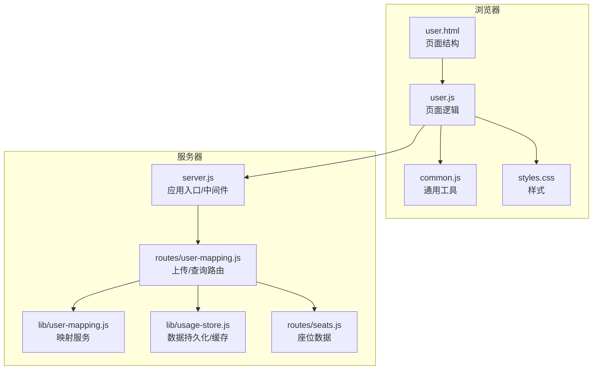
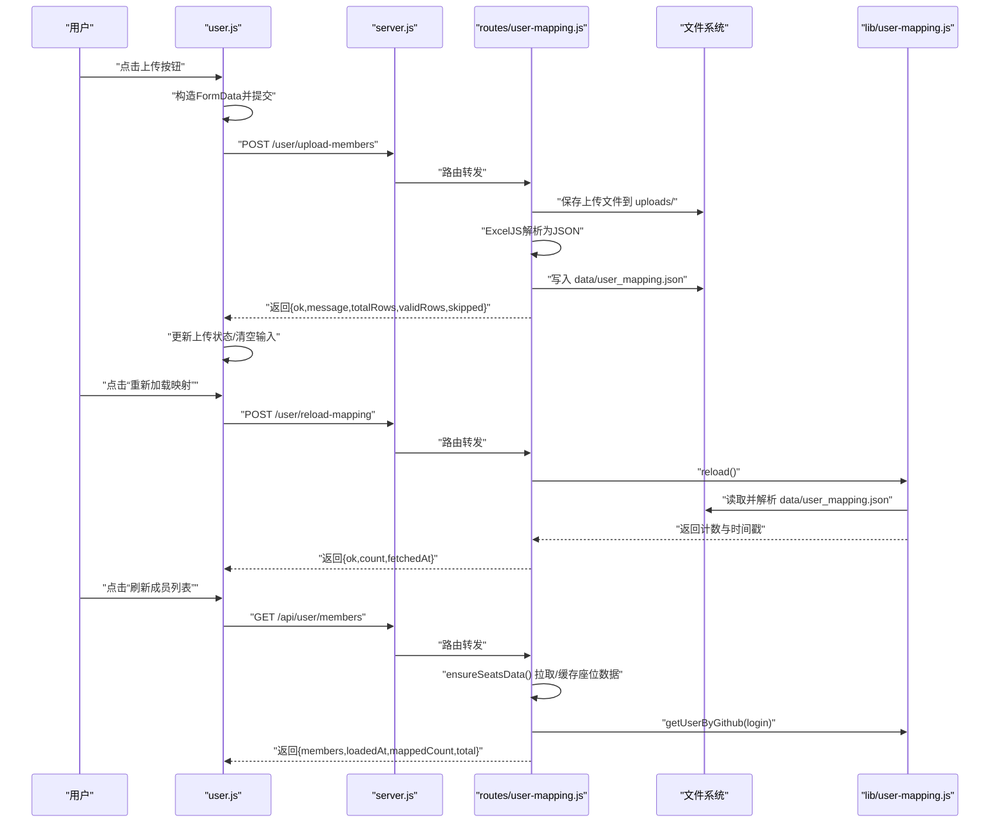
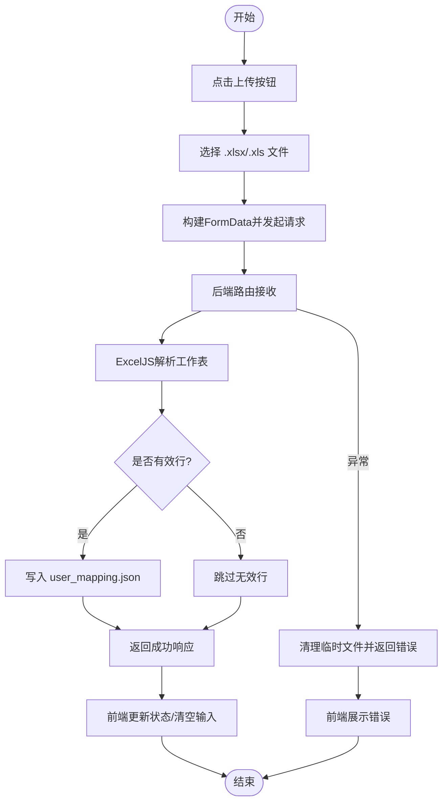
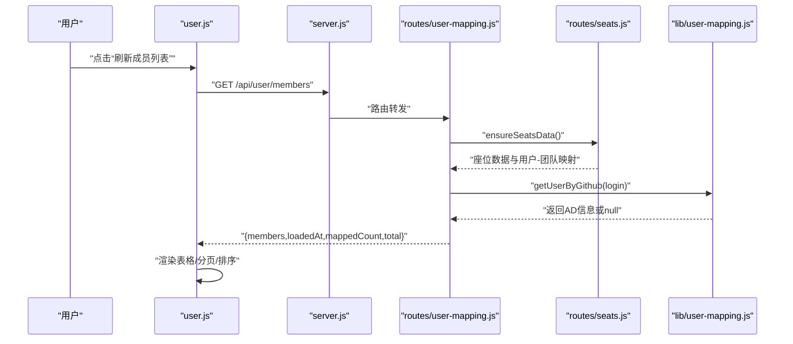
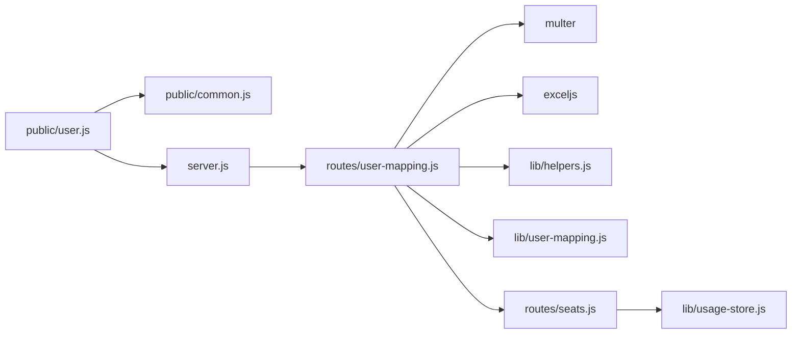

# 用户映射页面（User）

<cite>
**本文引用的文件**
- [public/user.html](file://public/user.html)
- [public/user.js](file://public/user.js)
- [public/common.js](file://public/common.js)
- [public/styles.css](file://public/styles.css)
- [routes/user-mapping.js](file://routes/user-mapping.js)
- [lib/user-mapping.js](file://lib/user-mapping.js)
- [lib/usage-store.js](file://lib/usage-store.js)
- [routes/seats.js](file://routes/seats.js)
- [server.js](file://server.js)
</cite>

## 目录
1. [简介](#简介)
2. [项目结构](#项目结构)
3. [核心组件](#核心组件)
4. [架构总览](#架构总览)
5. [详细组件分析](#详细组件分析)
6. [依赖关系分析](#依赖关系分析)
7. [性能考量](#性能考量)
8. [故障排查指南](#故障排查指南)
9. [结论](#结论)
10. [附录](#附录)

## 简介
本设计文档聚焦于 Copilot Enterprise Usage Display 的“用户映射页面”，围绕以下目标展开：
- 文件上传：拖拽与点击选择、进度与状态提示、错误处理
- 成员列表管理：增删改查与批量处理能力（当前页面以“刷新成员列表”为主）
- 状态可视化：成功、失败、进行中等状态指示
- 数据校验与格式检查：Excel 解析与字段校验
- 热重载：基于文件系统监控的自动重载与防抖
- 映射文件解析与数据结构转换：从 Excel 到 JSON 再到内存映射
- 安全与大小限制：文件类型与大小限制
- 交互设计最佳实践：确认与撤销建议、错误反馈与可访问性

## 项目结构
用户映射页面由前端 HTML、脚本与样式，以及后端路由与服务组成。核心路径如下：
- 前端页面与脚本：public/user.html、public/user.js、public/common.js、public/styles.css
- 后端路由：routes/user-mapping.js
- 业务服务：lib/user-mapping.js
- 数据存储与缓存：lib/usage-store.js
- 团队与座位数据：routes/seats.js
- 应用入口与中间件：server.js

图表来源
- [public/user.html](file://public/user.html)
- [public/user.js](file://public/user.js)
- [public/common.js](file://public/common.js)
- [public/styles.css](file://public/styles.css)
- [server.js](file://server.js)
- [routes/user-mapping.js](file://routes/user-mapping.js)
- [lib/user-mapping.js](file://lib/user-mapping.js)
- [lib/usage-store.js](file://lib/usage-store.js)
- [routes/seats.js](file://routes/seats.js)

章节来源
- [public/user.html](file://public/user.html)
- [public/user.js](file://public/user.js)
- [server.js](file://server.js)

## 核心组件
- 页面容器与控件：上传按钮、状态提示、重新加载映射、刷新成员列表、表格与分页、错误区域
- 前端渲染与交互：排序、分页、骨架屏、错误展示
- 后端路由：上传映射文件、手动重载映射、获取成员列表、按 GitHub 登录查询 AD 用户信息
- 服务层：用户映射服务（文件读取、内存映射、文件变更监听与防抖）
- 数据层：SQLite 持久化（座位快照、ETag 缓存等），用于成员列表的团队与计划信息
- 共享工具：通用错误处理、时间格式化、速率限制提示

章节来源
- [public/user.html](file://public/user.html)
- [public/user.js](file://public/user.js)
- [routes/user-mapping.js](file://routes/user-mapping.js)
- [lib/user-mapping.js](file://lib/user-mapping.js)
- [lib/usage-store.js](file://lib/usage-store.js)
- [routes/seats.js](file://routes/seats.js)
- [public/common.js](file://public/common.js)

## 架构总览
用户映射页面的端到端流程如下：
- 用户在页面点击“上传用户映射文件”，选择 .xlsx/.xls 文件
- 前端通过 /user/upload-members 提交文件，后端使用 multer 接收并限制大小与类型
- 后端使用 ExcelJS 解析 Excel，生成 JSON 并写入 data/user_mapping.json
- 前端收到成功响应后更新上传状态，并可点击“重新加载映射”触发后端强制重载
- “刷新成员列表”调用 /api/user/members，后端先确保座位数据可用，再合并映射服务中的 AD 信息，返回成员列表
- 映射服务内部通过 fs.watch + 防抖实现文件变更的自动重载

图表来源
- [public/user.js](file://public/user.js)
- [routes/user-mapping.js](file://routes/user-mapping.js)
- [lib/user-mapping.js](file://lib/user-mapping.js)
- [routes/seats.js](file://routes/seats.js)
- [server.js](file://server.js)

## 详细组件分析

### 文件上传与进度显示
- 前端交互
  - 通过隐藏的 fileInput 触发选择文件；点击“上传用户映射文件”按钮触发 fileInput.click()
  - 选择文件后，构造 FormData 并向 /user/upload-members 发起 POST 请求
  - 上传中设置状态文本与样式，成功或失败分别更新状态与错误区域
- 后端接收与解析
  - 使用 multer 配置：磁盘存储目录 uploads、文件名规则、大小限制 10MB、类型过滤（.xlsx/.xls 或指定 MIME）
  - 使用 ExcelJS 读取第一个工作表，将首行作为列头，逐行转为对象数组
  - 过滤出有效行（必须包含“AD-name”和“Github-name”），写入 data/user_mapping.json
- 错误处理
  - 上传失败时清理临时文件并返回统一错误体
  - 前端根据响应 ok 字段与状态码决定展示成功或失败消息

图表来源
- [public/user.js](file://public/user.js)
- [routes/user-mapping.js](file://routes/user-mapping.js)

章节来源
- [public/user.js](file://public/user.js)
- [routes/user-mapping.js](file://routes/user-mapping.js)

### 成员列表管理与批量处理
- 当前页面的“刷新成员列表”按钮会拉取 /api/user/members
- 后端确保座位数据可用（优先从 SQLite 快照读取，否则从 GitHub API 获取并缓存）
- 将座位数据与映射服务中的 AD 信息合并，返回成员列表及元数据（总数、映射数量、加载时间）
- 前端负责排序、分页、骨架屏与错误展示
- 批量处理：页面未提供批量勾选与批量操作按钮，如需扩展可在现有分页与排序基础上增加多选与批量动作

图表来源
- [public/user.js](file://public/user.js)
- [routes/user-mapping.js](file://routes/user-mapping.js)
- [routes/seats.js](file://routes/seats.js)
- [lib/user-mapping.js](file://lib/user-mapping.js)

章节来源
- [public/user.js](file://public/user.js)
- [routes/user-mapping.js](file://routes/user-mapping.js)
- [routes/seats.js](file://routes/seats.js)

### 状态可视化与交互反馈
- 成功/失败/进行中
  - 上传状态：上传中/成功/失败 文本与样式类切换
  - 刷新成员列表：禁用按钮、骨架屏占位、完成后恢复按钮与分页
  - 重新加载映射：禁用按钮、旋转指示、完成后恢复按钮与计数展示
  - 错误区域：统一隐藏/显示与内容设置
- 排序与分页
  - 表头点击切换升/降序，重排后回到第一页
  - 分页组件支持省略号与最大可见页数控制
- 骨架屏
  - 在刷新成员列表时渲染骨架行，提升感知性能

章节来源
- [public/user.js](file://public/user.js)
- [public/common.js](file://public/common.js)
- [public/styles.css](file://public/styles.css)

### 用户映射数据的验证机制与格式检查
- Excel 解析
  - 读取首行作为列头，逐行转为对象，值统一 trim
  - 仅保留“AD-name”和“Github-name”均非空的有效行
- JSON 输出
  - 写入 data/user_mapping.json，供映射服务读取
- 映射服务加载
  - 读取 JSON 并校验为数组
  - 构建 Map（键为小写 Github 名称），同时维护有效条目数组与 fetchedAt 时间戳
  - 记录被跳过的条目数量，便于统计

章节来源
- [routes/user-mapping.js](file://routes/user-mapping.js)
- [lib/user-mapping.js](file://lib/user-mapping.js)

### 热重载与用户体验优化
- 热重载实现
  - 映射服务使用 fs.watch 监听 data/user_mapping.json 变更
  - 防抖（300ms）避免频繁重载导致抖动
  - 监听器错误优雅降级（关闭监听器并记录日志）
- 用户体验
  - 上传成功后立即可刷新成员列表，映射结果即时生效
  - 重新加载映射按钮用于强制刷新（覆盖文件系统变更监听）
  - 骨架屏与禁用态减少用户误操作与视觉闪烁

章节来源
- [lib/user-mapping.js](file://lib/user-mapping.js)
- [public/user.js](file://public/user.js)

### 映射文件解析算法与数据结构转换
- 输入：Excel 工作表（首行列头）
- 中间结构：对象数组（每行一个对象，键为列头，值为单元格值）
- 过滤：仅保留“AD-name”和“Github-name”非空的行
- 输出：标准化后的对象数组（键为“AD-name”、“AD-mail”、“Github-name”、“Github-mail”）
- 内存映射：Map（键为小写的 Github 名称，值为包含 AD 与 Github 信息的对象）

图表来源
- [routes/user-mapping.js](file://routes/user-mapping.js)
- [lib/user-mapping.js](file://lib/user-mapping.js)

章节来源
- [routes/user-mapping.js](file://routes/user-mapping.js)
- [lib/user-mapping.js](file://lib/user-mapping.js)

### 安全考虑与大小限制
- 文件类型限制：仅允许 .xlsx 与 .xls（MIME 与扩展名双重校验）
- 文件大小限制：10MB
- 临时文件清理：解析失败或成功后均尝试删除 uploads 下的临时文件
- 响应统一错误：通过通用错误处理器返回标准错误体，避免泄露内部细节

章节来源
- [routes/user-mapping.js](file://routes/user-mapping.js)
- [public/common.js](file://public/common.js)

### 交互设计最佳实践
- 确认与撤销
  - 上传映射文件属于高风险操作（覆盖全局映射），建议在上传前增加二次确认对话框
  - 对于“重新加载映射”与“刷新成员列表”，可考虑在短时间内提供撤销按钮或快速重试
- 错误反馈
  - 统一使用错误区域展示，避免弹窗打断用户操作
  - 速率限制场景（GitHub API）通过通用工具函数识别并友好提示
- 可访问性
  - 表格排序使用可访问的 aria 属性与键盘导航
  - 骨架屏动画避免对光标跟随与屏幕阅读器造成干扰

章节来源
- [public/user.js](file://public/user.js)
- [public/common.js](file://public/common.js)
- [public/styles.css](file://public/styles.css)

## 依赖关系分析
- 前端依赖
  - user.js 依赖 common.js（错误展示、时间格式化、速率限制提示）
  - user.html 引入 user.js 与公共样式
- 后端依赖
  - server.js 挂载 routes/user-mapping.js，并注入共享依赖（UsageStore、TeamCache、UserMappingService）
  - routes/user-mapping.js 依赖 multer、ExcelJS、helpers.writeError
  - 映射服务依赖 fs、path、logger
  - 成员列表依赖 seats.ensureSeatsData 与 usage-store 的座位快照

图表来源
- [public/user.js](file://public/user.js)
- [public/common.js](file://public/common.js)
- [server.js](file://server.js)
- [routes/user-mapping.js](file://routes/user-mapping.js)
- [lib/user-mapping.js](file://lib/user-mapping.js)
- [routes/seats.js](file://routes/seats.js)
- [lib/usage-store.js](file://lib/usage-store.js)

章节来源
- [server.js](file://server.js)
- [routes/user-mapping.js](file://routes/user-mapping.js)
- [lib/user-mapping.js](file://lib/user-mapping.js)
- [routes/seats.js](file://routes/seats.js)
- [lib/usage-store.js](file://lib/usage-store.js)

## 性能考量
- 前端
  - 骨架屏与分页降低大列表渲染压力
  - 排序与分页在客户端完成，注意大数据量时的性能影响
- 后端
  - 映射文件变更监听采用 fs.watch + 防抖，避免频繁 IO
  - 成员列表优先从 SQLite 快照读取，减少 GitHub API 调用
  - 上传解析仅在单文件写入，避免阻塞其他请求
- 存储
  - SQLite 用于座位快照与 ETag 缓存，控制快照数量上限防止无限增长

章节来源
- [lib/user-mapping.js](file://lib/user-mapping.js)
- [routes/seats.js](file://routes/seats.js)
- [lib/usage-store.js](file://lib/usage-store.js)

## 故障排查指南
- 上传失败
  - 检查文件类型与大小是否符合要求
  - 查看后端日志与错误响应体，确认 uploads 与 data 目录权限
- 映射不生效
  - 点击“重新加载映射”强制刷新
  - 检查 data/user_mapping.json 是否存在且为合法数组
- 成员列表为空
  - 确认座位数据已成功拉取并缓存
  - 检查 GitHub API 凭据与企业/组织配置
- 速率限制
  - 前端工具函数会识别并提示，等待冷却后再试

章节来源
- [routes/user-mapping.js](file://routes/user-mapping.js)
- [lib/user-mapping.js](file://lib/user-mapping.js)
- [routes/seats.js](file://routes/seats.js)
- [public/common.js](file://public/common.js)

## 结论
用户映射页面在前端与后端之间形成了清晰的职责边界：前端负责交互与展示，后端负责文件解析、数据持久化与服务集成。通过防抖热重载、骨架屏与统一错误处理，系统在可用性与稳定性方面表现良好。后续可在上传确认、批量操作与更细粒度的错误提示方面进一步优化。

## 附录
- 关键接口
  - POST /user/upload-members：上传映射文件并解析
  - POST /user/reload-mapping：强制重载映射
  - GET /api/user/members：获取成员列表（含映射信息）
  - GET /api/user/info：按 GitHub 登录查询 AD 用户信息
- 数据文件
  - data/user_mapping.json：映射数据 JSON
  - data/usage.db：SQLite 数据库（座位快照、ETag 缓存等）