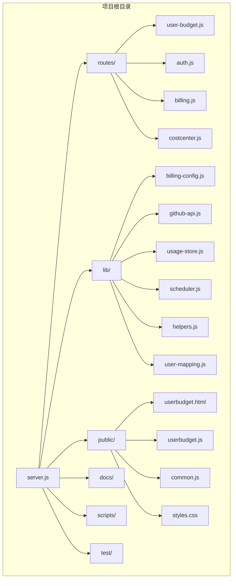
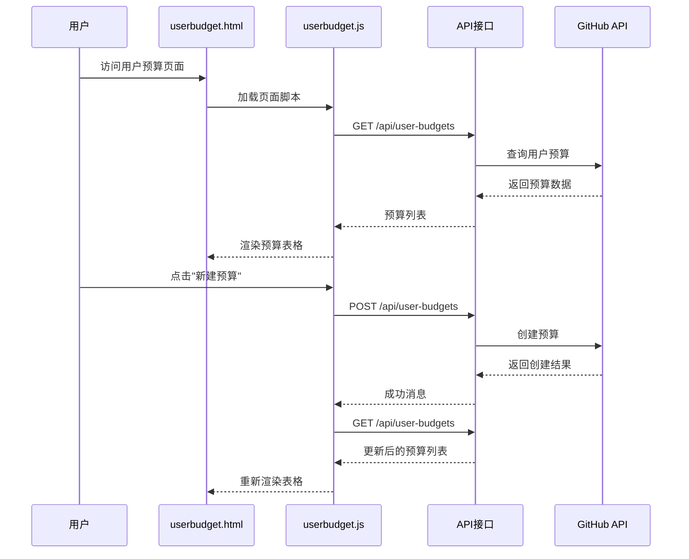
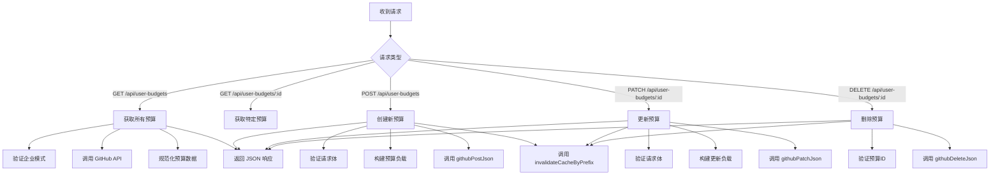
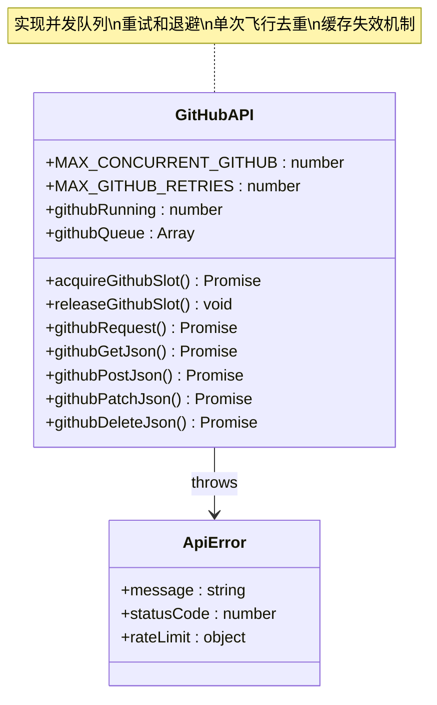
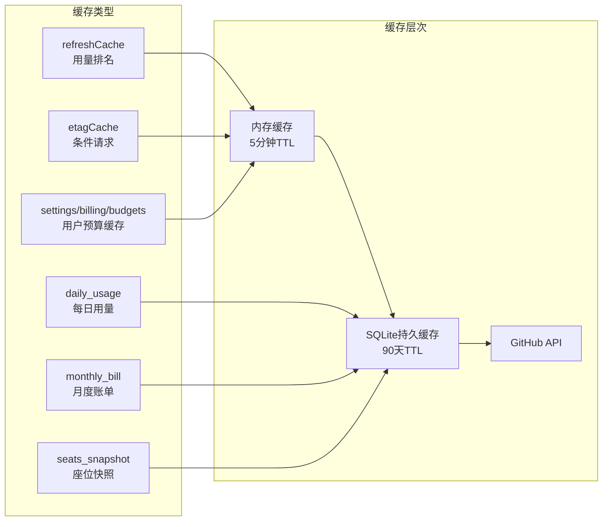
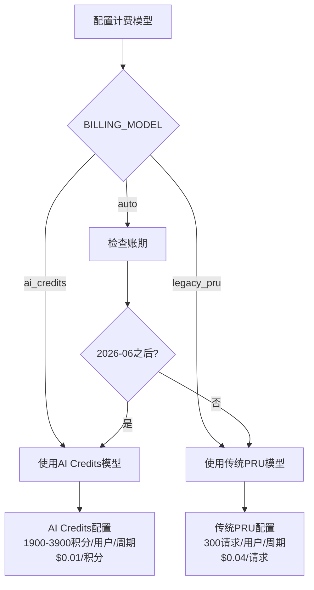
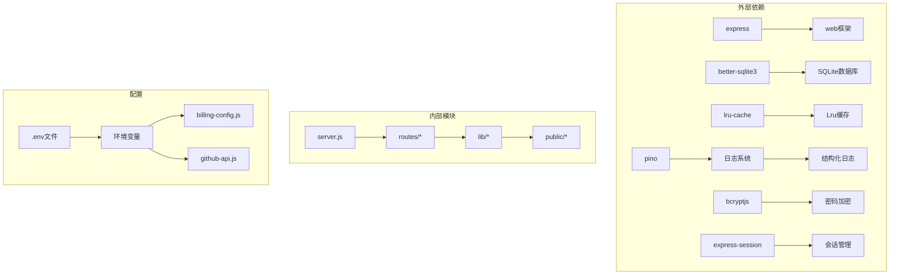
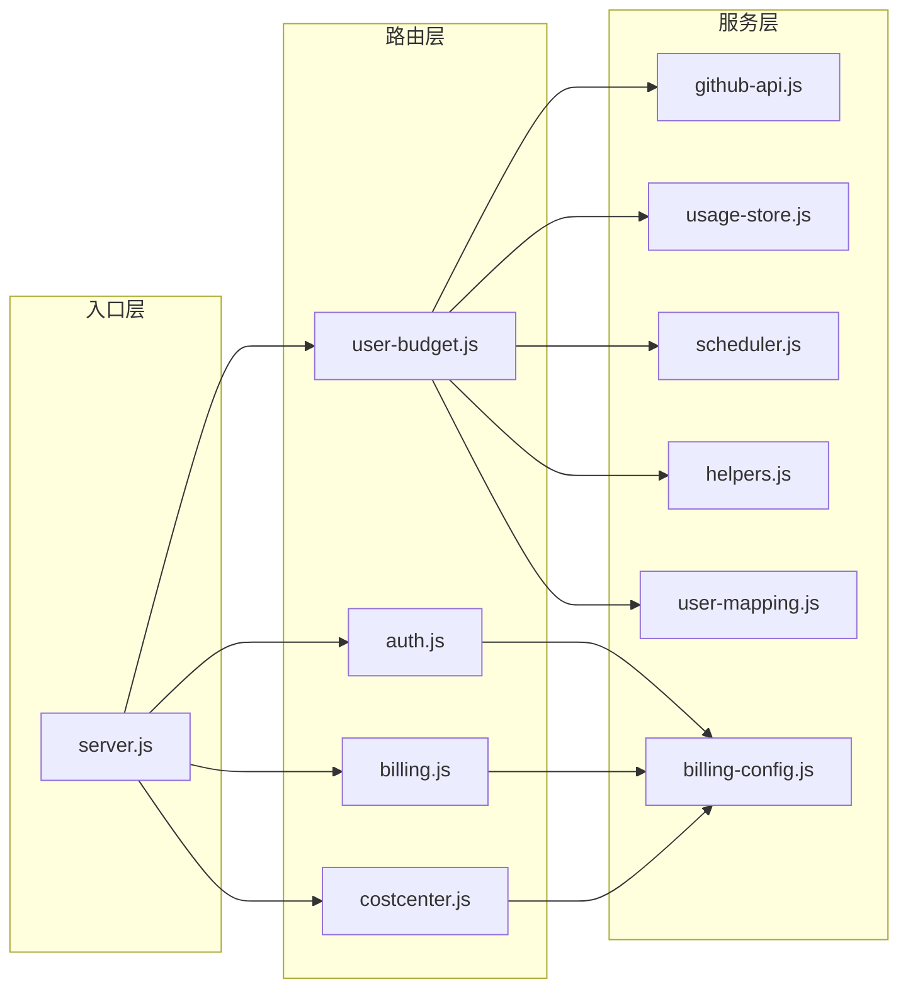

# 用户预算管理系统

<cite>
**本文档引用的文件**
- [README.md](file://README.md)
- [package.json](file://package.json)
- [server.js](file://server.js)
- [lib/billing-config.js](file://lib/billing-config.js)
- [lib/github-api.js](file://lib/github-api.js)
- [lib/usage-store.js](file://lib/usage-store.js)
- [lib/scheduler.js](file://lib/scheduler.js)
- [lib/helpers.js](file://lib/helpers.js)
- [lib/user-mapping.js](file://lib/user-mapping.js)
- [routes/user-budget.js](file://routes/user-budget.js)
- [routes/auth.js](file://routes/auth.js)
- [routes/billing.js](file://routes/billing.js)
- [routes/costcenter.js](file://routes/costcenter.js)
- [public/userbudget.html](file://public/userbudget.html)
- [public/userbudget.js](file://public/userbudget.js)
- [public/common.js](file://public/common.js)
- [public/styles.css](file://public/styles.css)
</cite>

## 更新摘要
**变更内容**
- 新增独立的用户预算管理前端界面（public/userbudget.html和public/userbudget.js）
- 增强的JavaScript实现包含300+行代码，提供完整的CRUD操作
- 实时数据过滤和视觉进度指示功能
- 更新GitHub API集成，新增githubPatchJson函数用于预算更新后的缓存失效
- 新增用户预算管理页面的详细组件分析

## 目录
1. [简介](#简介)
2. [项目结构](#项目结构)
3. [核心组件](#核心组件)
4. [架构概览](#架构概览)
5. [详细组件分析](#详细组件分析)
6. [依赖关系分析](#依赖关系分析)
7. [性能考虑](#性能考虑)
8. [故障排除指南](#故障排除指南)
9. [结论](#结论)

## 简介

用户预算管理系统是一个基于 Node.js + Express 的 GitHub Copilot 用量与账单可视化仪表盘，专门面向 GitHub Enterprise 管理员，提供用户级别的预算管理功能。该系统支持企业级用户预算的创建、查询、更新和删除操作，通过 GitHub Billing API 实现预算数据的实时同步。

**更新** 新增独立的用户预算管理前端界面，提供完整的CRUD操作体验和实时数据过滤功能。

系统主要功能包括：
- 用户预算的 CRUD 操作（创建、查询、更新、删除）
- 与 GitHub Billing API 的深度集成
- 前后端分离的架构设计
- 完善的错误处理和日志记录
- 安全的管理员认证机制
- 实时数据过滤和视觉进度指示
- 缓存失效机制确保数据一致性

## 项目结构

该项目采用模块化分层架构，主要目录结构如下：

**图表来源**
- [server.js:1-243](file://server.js#L1-L243)
- [package.json:1-28](file://package.json#L1-L28)

**章节来源**
- [README.md:55-111](file://README.md#L55-L111)
- [server.js:147-159](file://server.js#L147-L159)

## 核心组件

### 1. 服务器入口 (server.js)
系统的核心入口文件，负责：
- 初始化 Express 应用程序
- 配置会话中间件和安全设置
- 挂载所有路由模块
- 启动调度器和优雅关闭处理
- **新增** 管理员页面访问保护，包括 `/userbudget` 和 `/userbudget.html`

### 2. 预算管理路由 (routes/user-budget.js)
专门处理用户预算相关的 API 请求：
- GET /api/user-budgets - 获取所有用户预算
- GET /api/user-budgets/:id - 获取特定预算详情
- POST /api/user-budgets - 创建新预算
- PATCH /api/user-budgets/:id - 更新预算
- DELETE /api/user-budgets/:id - 删除预算
- **新增** GET /userbudget - 返回用户预算管理页面

### 3. GitHub API 服务 (lib/github-api.js)
封装 GitHub API 调用的基础设施：
- 并发队列控制
- 重试和退避机制
- GET 缓存 (LRU)
- ETag 条件请求
- 单次飞行去重
- **新增** githubPatchJson 函数用于预算更新后的缓存失效

### 4. 使用存储 (lib/usage-store.js)
SQLite 数据库存储层：
- 三层缓存架构（内存 → SQLite → GitHub API）
- 日常用量数据持久化
- 座位快照管理
- ETag 缓存持久化

**章节来源**
- [server.js:1-243](file://server.js#L1-L243)
- [routes/user-budget.js:1-215](file://routes/user-budget.js#L1-L215)
- [lib/github-api.js:1-334](file://lib/github-api.js#L1-L334)
- [lib/usage-store.js:1-333](file://lib/usage-store.js#L1-L333)

## 架构概览

系统采用分层架构设计，实现了前后端分离和模块化组织：

```mermaid
graph TB
subgraph "前端层"
A[userbudget.html]
B[userbudget.js]
C[common.js]
D[styles.css]
end
subgraph "后端入口"
E[server.js]
end
subgraph "路由层"
F[user-budget.js]
G[auth.js]
H[billing.js]
I[costcenter.js]
end
subgraph "服务层"
J[github-api.js]
K[usage-store.js]
L[scheduler.js]
M[helpers.js]
N[user-mapping.js]
end
subgraph "配置层"
O[billing-config.js]
end
subgraph "数据存储"
P[usage.db]
Q[user_mapping.json]
end
A --> E
B --> E
C --> E
D --> E
E --> F
E --> G
E --> H
E --> I
F --> J
F --> K
F --> L
F --> M
F --> N
G --> O
H --> O
I --> O
J --> P
K --> P
N --> Q
```

**图表来源**
- [server.js:147-159](file://server.js#L147-L159)
- [routes/user-budget.js:119-214](file://routes/user-budget.js#L119-L214)
- [lib/github-api.js:73-80](file://lib/github-api.js#L73-L80)
- [lib/usage-store.js:10-20](file://lib/usage-store.js#L10-L20)

## 详细组件分析

### 用户预算管理页面

#### 前端组件 (public/userbudget.js)
用户预算管理页面的 JavaScript 实现，提供了完整的 CRUD 操作界面，包含300+行增强代码：

**更新** 增强的JavaScript实现包含以下功能：
- 实时数据过滤（SKU筛选和搜索）
- 视觉进度指示（预算使用进度条）
- 弹窗表单（新建/编辑/删除）
- 自动座位映射（基于 `/api/seats`）
- 骨架屏加载效果
- 错误处理和用户反馈

**图表来源**
- [public/userbudget.js:85-100](file://public/userbudget.js#L85-L100)
- [public/userbudget.js:238-258](file://public/userbudget.js#L238-L258)

#### 后端路由 (routes/user-budget.js)
后端路由处理用户预算的所有 API 请求，并实现缓存失效机制：

**更新** 新增缓存失效机制：
- 创建预算后调用 `invalidateCacheByPrefix("settings/billing/budgets")`
- 更新预算后调用 `invalidateCacheByPrefix("settings/billing/budgets")`
- 删除预算后调用 `invalidateCacheByPrefix("settings/billing/budgets")`

**图表来源**
- [routes/user-budget.js:126-141](file://routes/user-budget.js#L126-L141)
- [routes/user-budget.js:160-182](file://routes/user-budget.js#L160-L182)
- [routes/user-budget.js:184-197](file://routes/user-budget.js#L184-L197)
- [routes/user-budget.js:199-211](file://routes/user-budget.js#L199-L211)

#### GitHub API 集成

##### 并发控制和重试机制
系统实现了智能的 GitHub API 调用控制：

**更新** 新增 githubPatchJson 函数：
- 用于预算更新操作
- 自动调用 `invalidateCacheByPrefix("settings/billing/budgets")`
- 确保缓存一致性

**图表来源**
- [lib/github-api.js:25-48](file://lib/github-api.js#L25-L48)
- [lib/github-api.js:178-233](file://lib/github-api.js#L178-L233)
- [lib/github-api.js:309-313](file://lib/github-api.js#L309-L313)

##### 缓存架构
系统采用三层缓存架构来优化性能：

**更新** 新增用户预算缓存：
- settings/billing/budgets 路径的缓存
- 支持按前缀失效机制
- 确保预算数据的一致性

**图表来源**
- [README.md:263-280](file://README.md#L263-L280)
- [lib/usage-store.js:24-87](file://lib/usage-store.js#L24-L87)

**章节来源**
- [public/userbudget.html:1-76](file://public/userbudget.html#L1-L76)
- [public/userbudget.js:1-333](file://public/userbudget.js#L1-L333)
- [routes/user-budget.js:1-215](file://routes/user-budget.js#L1-L215)
- [lib/github-api.js:1-334](file://lib/github-api.js#L1-L334)
- [lib/usage-store.js:1-333](file://lib/usage-store.js#L1-L333)

### 计费配置管理

#### 双计费模型支持
系统支持两种计费模型的无缝切换：

**图表来源**
- [lib/billing-config.js:47-51](file://lib/billing-config.js#L47-L51)
- [lib/billing-config.js:21-32](file://lib/billing-config.js#L21-L32)

**章节来源**
- [lib/billing-config.js:1-84](file://lib/billing-config.js#L1-L84)

## 依赖关系分析

### 核心依赖关系

**图表来源**
- [package.json:12-23](file://package.json#L12-L23)
- [server.js:1-11](file://server.js#L1-L11)

### 模块间依赖

系统模块间的依赖关系清晰，遵循单一职责原则：

**更新** 新增用户预算页面依赖：
- public/common.js 提供共享前端工具
- public/styles.css 提供样式支持
- public/userbudget.html 提供页面结构

**图表来源**
- [server.js:147-159](file://server.js#L147-L159)
- [routes/user-budget.js:119-214](file://routes/user-budget.js#L119-L214)

**章节来源**
- [package.json:1-28](file://package.json#L1-28)
- [server.js:147-159](file://server.js#L147-L159)

## 性能考虑

### 缓存策略
系统实现了多层次的缓存策略来优化性能：

1. **内存缓存**：5分钟TTL，存储最近查询的用量排名
2. **SQLite持久缓存**：90天TTL，存储每日用量原始数据
3. **GitHub API缓存**：基于ETag的条件请求，零数据变更时返回304
4. ****新增** 用户预算缓存**：针对 `/settings/billing/budgets` 路径的缓存，支持按前缀失效

### 并发控制
- GitHub API调用限制为每秒3个并发
- 实现了队列机制防止过度并发
- 支持指数退避重试（最大8秒等待）

### 数据持久化
- SQLite数据库使用WAL模式提高并发性能
- 自动清理过期数据防止数据库膨胀
- 预编译SQL语句减少解析开销

### 前端性能优化
- 骨架屏加载效果提升用户体验
- 实时数据过滤减少DOM操作
- 缓存用户映射数据避免重复请求

## 故障排除指南

### 常见问题诊断

#### 1. GitHub API 限流问题
**症状**：API调用返回429状态码
**解决方法**：
- 检查GITHUB_MAX_CONCURRENT配置
- 查看日志中的重试信息
- 等待速率限制重置

#### 2. 缓存数据不一致
**症状**：页面显示过期数据
**解决方法**：
- 使用force参数强制刷新
- 检查缓存TTL设置
- 清理缓存后重新加载

#### 3. 权限问题
**症状**：403 Forbidden错误
**解决方法**：
- 验证GITHUB_TOKEN权限
- 检查ENTERPRISE_SLUG配置
- 确认用户具有billing manager权限

#### 4. 用户预算页面加载失败
**症状**：用户预算页面无法加载或显示空白
**解决方法**：
- 检查 /userbudget 路由是否正确挂载
- 验证管理员认证状态
- 查看浏览器控制台错误信息
- 确认 /api/user-budgets 接口正常工作

**章节来源**
- [lib/github-api.js:178-233](file://lib/github-api.js#L178-L233)
- [lib/usage-store.js:203-206](file://lib/usage-store.js#L203-L206)

## 结论

用户预算管理系统是一个设计精良的企业级应用，具有以下特点：

### 技术优势
- **模块化架构**：清晰的分层设计和单一职责原则
- **高性能缓存**：三层缓存架构显著减少API调用
- **安全可靠**：完善的认证机制和错误处理
- **可扩展性**：易于添加新功能和维护
- ****新增** 独立前端界面**：提供完整的用户预算管理体验

### 架构亮点
- 前后端分离的设计模式
- 智能的缓存和重试机制
- 完善的日志和监控系统
- 严格的错误处理和恢复机制
- **新增** 实时数据过滤和视觉进度指示

### 应用价值
该系统为企业管理员提供了强大的用户预算管理能力，通过GitHub Billing API实现了预算数据的实时同步，帮助企业更好地控制和管理Copilot使用成本。

**更新** 新增的用户预算管理前端界面显著提升了用户体验：
- 独立的管理页面，与成本中心预算解耦
- 实时数据过滤和搜索功能
- 视觉化的预算使用进度指示
- 完整的CRUD操作支持
- 自动化的缓存失效机制确保数据一致性

该系统将继续演进，为GitHub Enterprise用户提供更加完善和易用的预算管理解决方案。