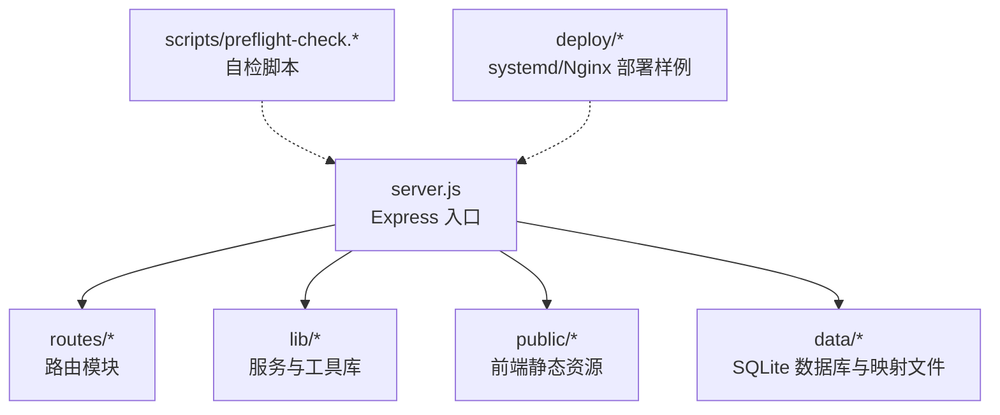
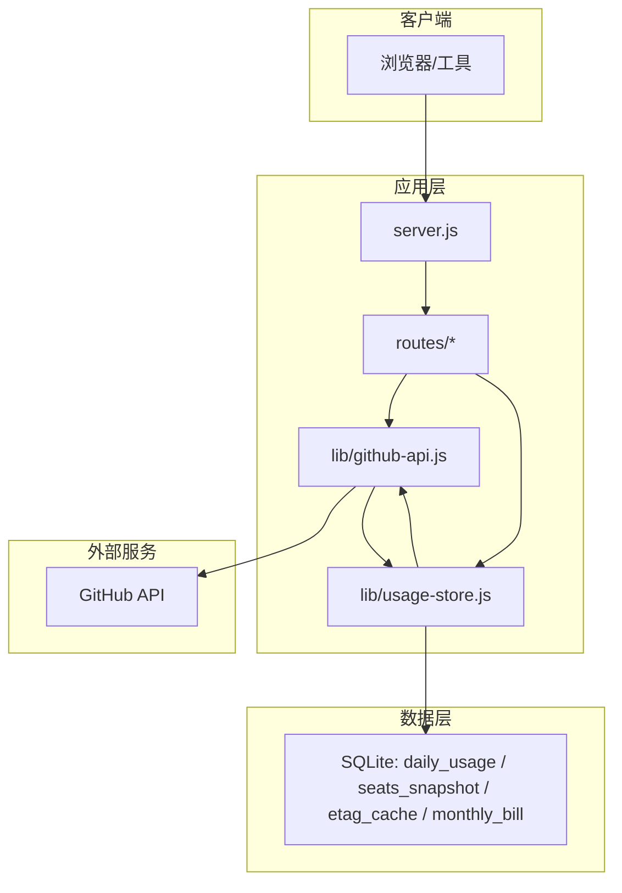

# 快速开始

<cite>
**本文引用的文件**
- [README.md](file://README.md)
- [package.json](file://package.json)
- [.env.example](file://.env.example)
- [server.js](file://server.js)
- [scripts/preflight-check.js](file://scripts/preflight-check.js)
- [scripts/preflight-check.sh](file://scripts/preflight-check.sh)
- [lib/github-api.js](file://lib/github-api.js)
- [lib/usage-store.js](file://lib/usage-store.js)
- [routes/usage.js](file://routes/usage.js)
- [deploy/copilot-dashboard.service](file://deploy/copilot-dashboard.service)
- [deploy/nginx-copilot-dashboard.conf](file://deploy/nginx-copilot-dashboard.conf)
- [test/billing-config.test.js](file://test/billing-config.test.js)
</cite>

## 目录
1. [简介](#简介)
2. [项目结构](#项目结构)
3. [核心组件](#核心组件)
4. [架构总览](#架构总览)
5. [详细组件分析](#详细组件分析)
6. [依赖分析](#依赖分析)
7. [性能考虑](#性能考虑)
8. [故障排除指南](#故障排除指南)
9. [结论](#结论)
10. [附录](#附录)

## 简介
本指南面向首次接触 CopilotEnterpriseUsageDisplay 的管理员与开发者，帮助你在最短时间内完成安装、配置与启动，并在生产环境中安全运行。你将学到：
- 前置要求（Node.js 版本、GitHub PAT 权限）
- 环境变量与 .env 配置要点
- 依赖安装与应用启动（开发与生产）
- 启动前自检脚本的使用与推荐策略
- 常见问题排查与基本运维建议

## 项目结构
该项目采用模块化分层架构，后端以 Express 为核心，路由按功能拆分，数据层通过 SQLite 持久化，前端静态资源位于 public 目录，配套自检脚本与 systemd/Nginx 部署样例。

图表来源
- [server.js:1-182](file://server.js#L1-L182)
- [routes/usage.js:1-200](file://routes/usage.js#L1-L200)
- [lib/github-api.js:1-200](file://lib/github-api.js#L1-L200)
- [lib/usage-store.js:1-200](file://lib/usage-store.js#L1-L200)

章节来源
- [README.md:46-96](file://README.md#L46-L96)

## 核心组件
- 服务入口与中间件：负责加载 .env、挂载路由、统一访问日志、健康检查、全局错误处理与优雅关闭。
- 路由层：按功能拆分（用量、账单、Teams、Cost Center、Analytics、用户映射、账单页等）。
- 服务层：封装 GitHub API 调用、并发队列、重试退避、ETag 条件请求、单次飞行去重、LRU 缓存。
- 数据层：SQLite 持久化（daily_usage、seats_snapshot、etag_cache、monthly_bill 等表）。
- 前端静态资源：HTML/CSS/JS，按页面组织，SPA 路由回退到 index.html。
- 自检脚本：Shell 与 Node 两版，覆盖环境变量、DNS/网络、Token 有效性、必要 API 权限探测。

章节来源
- [server.js:1-182](file://server.js#L1-L182)
- [lib/github-api.js:1-200](file://lib/github-api.js#L1-L200)
- [lib/usage-store.js:1-200](file://lib/usage-store.js#L1-L200)
- [routes/usage.js:1-200](file://routes/usage.js#L1-L200)

## 架构总览
系统采用三层缓存（内存 5 分钟 → SQLite 90 天 → GitHub API）与 ETag 条件请求，显著降低 API 调用频率；同时内置自动刷新调度器与按月/按日强制刷新机制，应对 GitHub Billing API 的数据延迟。

图表来源
- [server.js:1-182](file://server.js#L1-L182)
- [lib/github-api.js:1-200](file://lib/github-api.js#L1-L200)
- [lib/usage-store.js:1-200](file://lib/usage-store.js#L1-L200)

## 详细组件分析

### 快速开始：安装与配置
- 前置要求
  - Node.js 版本：>= 18
  - GitHub PAT（classic）：具备 Enterprise billing 读取权限
- 安装依赖
  - 克隆仓库后执行依赖安装
- 配置 .env
  - 复制示例文件并填写必要参数
  - 必填项：GITHUB_TOKEN、ENTERPRISE_SLUG（或 ORG_NAME）
  - 可选项：PRODUCT、MODEL、USER_LIST、ORG_LIST、MAX_USERS、GITHUB_API_BASE、PORT、CACHE_TTL 等
- 启动
  - 开发模式：自动监听文件变更重启
  - 生产模式：直接启动，建议配合 systemd 与 Nginx

章节来源
- [README.md:130-179](file://README.md#L130-L179)
- [.env.example:1-35](file://.env.example#L1-L35)
- [package.json:6-11](file://package.json#L6-L11)

### 环境变量与 .env 配置
- 必填
  - GITHUB_TOKEN：GitHub PAT（需 Enterprise billing 读取权限）
  - ENTERPRISE_SLUG：企业 slug（推荐用于按用户排行）
  - 或 ORG_NAME：组织名（当无法枚举用户时可选）
- 可选
  - PRODUCT、MODEL：产品与模型过滤
  - USER_LIST、ORG_LIST：限定用户/组织集合
  - MAX_USERS：按用户回退查询的用户上限
  - GITHUB_API_BASE：自定义 GitHub API 基地址（如 GHE）
  - PORT：服务端口
  - CACHE_TTL：前端缓存时长（秒）
  - 其他高级参数：并发、重试、调度器等（见“环境变量说明”）

章节来源
- [README.md:196-217](file://README.md#L196-L217)
- [.env.example:1-35](file://.env.example#L1-L35)

### 启动与运行模式
- 开发模式
  - 使用自动重启脚本，适合本地调试与开发
- 生产模式
  - 使用 systemd 服务单元与 Nginx 反代
  - systemd 管理开机自启、异常重启与日志输出
  - Nginx 将 80 端口反代到 Node.js 的 3000 端口

章节来源
- [README.md:167-179](file://README.md#L167-L179)
- [README.md:412-470](file://README.md#L412-L470)
- [deploy/copilot-dashboard.service:1-18](file://deploy/copilot-dashboard.service#L1-L18)
- [deploy/nginx-copilot-dashboard.conf:1-14](file://deploy/nginx-copilot-dashboard.conf#L1-L14)

### 启动前自检脚本
- 作用：在启动前验证环境变量、网络连通性、Token 有效性、必要 API 权限（席位与 Premium Usage），并探测可选功能（Cost Centers、Budgets）
- 两种实现
  - Shell 版：适合 CI/CD 与服务器预检查
  - Node 版：便于与项目日志体系整合
- 严格模式
  - 默认：出现 FAIL 即返回失败
  - 严格模式：WARN 也被视为失败

章节来源
- [README.md:180-194](file://README.md#L180-L194)
- [scripts/preflight-check.sh:1-182](file://scripts/preflight-check.sh#L1-L182)
- [scripts/preflight-check.js:1-188](file://scripts/preflight-check.js#L1-L188)

### GitHub API 与三层缓存
- GitHub API 层
  - 并发队列、最大重试次数、指数退避、单次飞行去重、ETag 条件请求、LRU 缓存
- SQLite 持久化
  - daily_usage、seats_snapshot、etag_cache、monthly_bill 等表
  - 预编译语句、定期清理、动态 TTL 抖动防护
- 三层缓存
  - 内存缓存（5 分钟）→ SQLite（90 天）→ GitHub API

章节来源
- [lib/github-api.js:1-200](file://lib/github-api.js#L1-L200)
- [lib/usage-store.js:1-200](file://lib/usage-store.js#L1-L200)
- [README.md:218-242](file://README.md#L218-L242)

### 强制刷新与自动刷新
- 自动刷新调度器（默认开启）
  - 启动后延迟刷新当天数据；每天固定时间刷新今天与最近 N 天
  - 可通过环境变量关闭或调整
- 按月强制刷新
  - 清空该月 SQLite 缓存后逐日回源 GitHub，重新计算账单
- 按日强制刷新
  - 支持单日/日期范围，force:true 跳过内存与 SQLite TTL

章节来源
- [README.md:243-289](file://README.md#L243-L289)
- [routes/usage.js:120-200](file://routes/usage.js#L120-L200)

### 健康检查与错误处理
- 健康检查端点：返回运行状态、运行时长、内存占用、时间戳
- 全局错误中间件：记录上下文并返回统一错误格式
- 优雅关闭：释放资源、停止定时器、10 秒强制退出兜底

章节来源
- [server.js:100-140](file://server.js#L100-L140)
- [server.js:150-182](file://server.js#L150-L182)

### 测试运行
- 单元测试：使用 vitest 运行测试套件
- 监听模式：开发时自动重跑变更的测试

章节来源
- [package.json:9-10](file://package.json#L9-L10)
- [test/billing-config.test.js:1-70](file://test/billing-config.test.js#L1-L70)

## 依赖分析
- 后端运行时依赖
  - Express：Web 框架
  - better-sqlite3：SQLite 访问
  - dotenv：.env 加载
  - lru-cache：LRU 缓存
  - pino/pino-pretty：结构化日志
  - exceljs、multer：Excel 上传与解析
- 开发依赖
  - vitest：测试框架

章节来源
- [package.json:12-24](file://package.json#L12-L24)

## 性能考虑
- 三层缓存与 ETag 条件请求显著降低 API 调用
- 动态 TTL 抖动防护避免 GitHub Billing API 延迟导致的缓存“锁死”
- 并发队列与单次飞行去重避免重复请求
- SQLite 预编译语句与索引优化查询性能

章节来源
- [README.md:218-242](file://README.md#L218-L242)
- [lib/github-api.js:1-200](file://lib/github-api.js#L1-L200)
- [lib/usage-store.js:1-200](file://lib/usage-store.js#L1-L200)

## 故障排除指南
- 启动前自检
  - 使用 Shell 或 Node 版自检脚本，严格模式下 WARN 也会失败
  - 关注必填环境变量、DNS/网络可达性、Token 有效性与必要 API 权限
- 常见问题
  - 401/403：检查 GITHUB_TOKEN 是否有效、scope 是否包含 Enterprise billing 读取
  - 404：确认 ENTERPRISE_SLUG 正确，或相关功能未启用
  - 5xx：GitHub 服务端错误，稍后重试或检查网络
  - 速率限制：适当降低并发与重试次数，或等待配额恢复
- 生产环境建议
  - 先运行自检，再启动服务
  - 使用 systemd 与 Nginx，配置健康检查端点
  - 监控日志与缓存命中率，关注最近 3 天数据新鲜度

章节来源
- [scripts/preflight-check.sh:1-182](file://scripts/preflight-check.sh#L1-L182)
- [scripts/preflight-check.js:1-188](file://scripts/preflight-check.js#L1-L188)
- [server.js:100-140](file://server.js#L100-L140)

## 结论
通过本快速开始指南，你可以在几分钟内完成安装、配置与启动，并在生产环境中借助自检脚本与 systemd/Nginx 部署样例实现稳定运行。建议在上线前务必运行自检脚本，确保环境变量、网络与权限配置正确，从而获得最佳的用户体验与稳定性。

## 附录

### 环境变量一览（摘要）
- 必填：GITHUB_TOKEN、ENTERPRISE_SLUG（或 ORG_NAME）
- 可选：PRODUCT、MODEL、USER_LIST、ORG_LIST、MAX_USERS、GITHUB_API_BASE、PORT、CACHE_TTL
- 高级：GITHUB_MAX_CONCURRENT、GITHUB_MAX_RETRIES、SCHED_*、LOG_LEVEL 等

章节来源
- [README.md:196-217](file://README.md#L196-L217)
- [.env.example:1-35](file://.env.example#L1-L35)