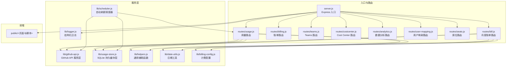
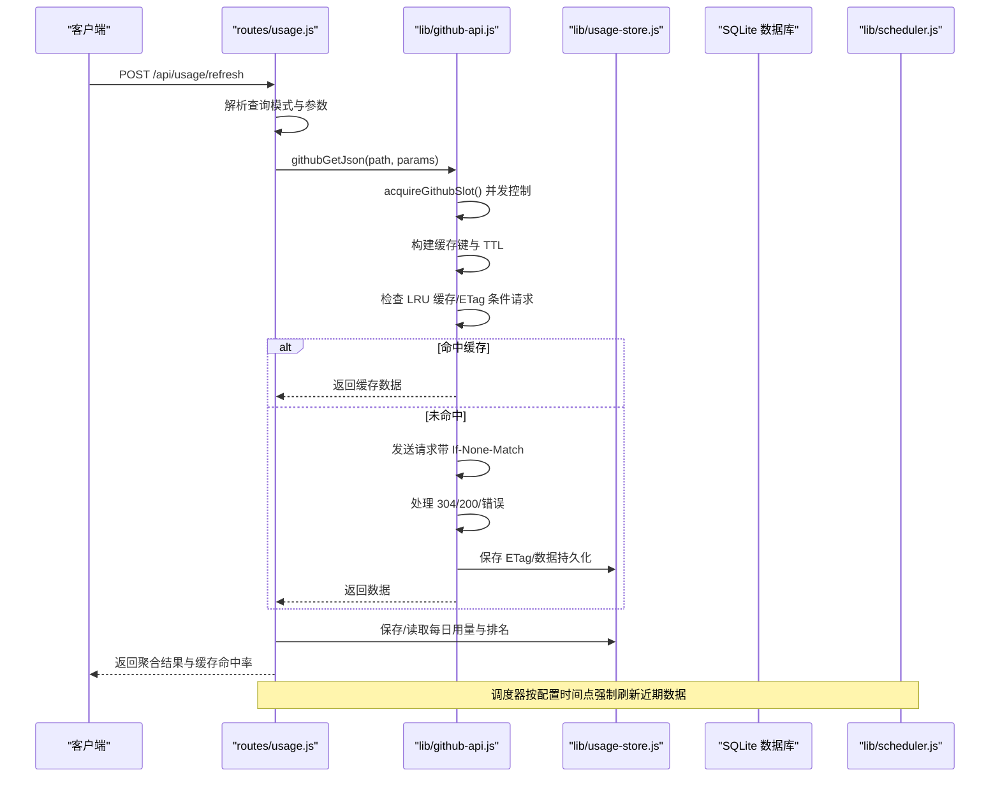
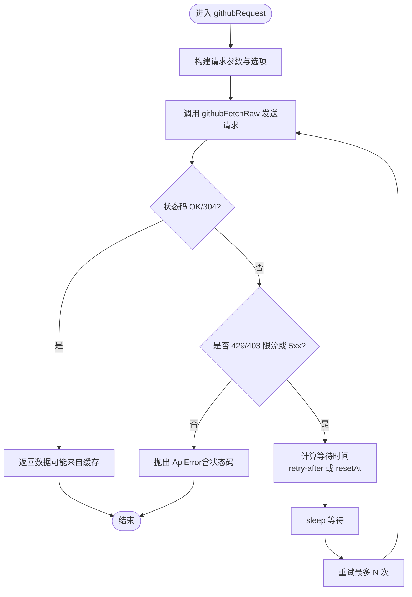
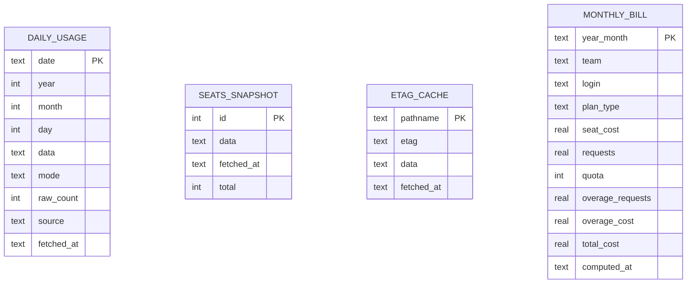
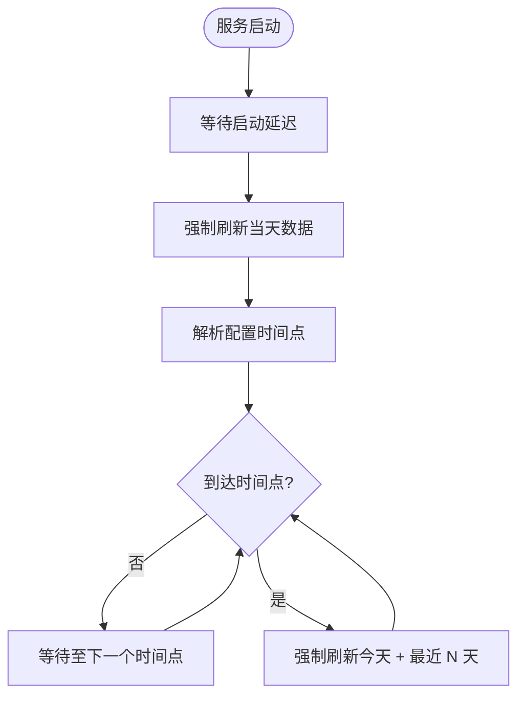
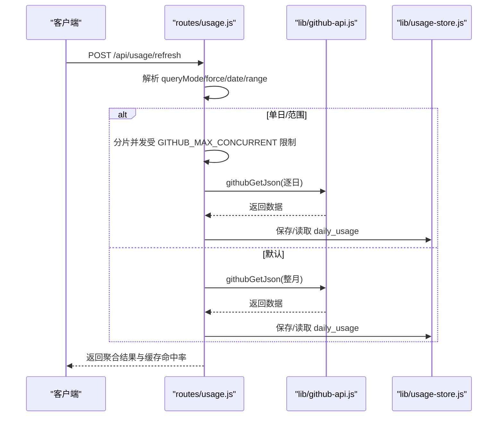
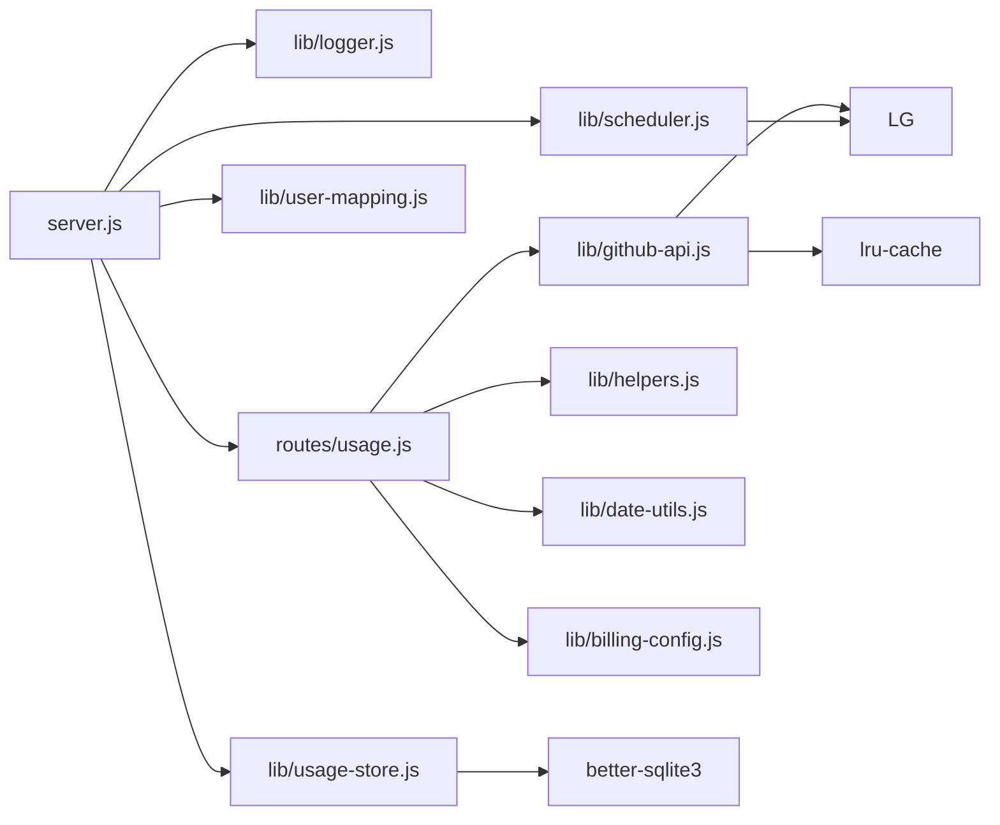

# API 集成问题排查指南

<cite>
**本文引用的文件**
- [lib/github-api.js](file://lib/github-api.js)
- [lib/scheduler.js](file://lib/scheduler.js)
- [lib/usage-store.js](file://lib/usage-store.js)
- [routes/usage.js](file://routes/usage.js)
- [server.js](file://server.js)
- [lib/billing-config.js](file://lib/billing-config.js)
- [lib/logger.js](file://lib/logger.js)
- [lib/helpers.js](file://lib/helpers.js)
- [lib/date-utils.js](file://lib/date-utils.js)
- [package.json](file://package.json)
- [README.md](file://README.md)
</cite>

## 目录
1. [简介](#简介)
2. [项目结构](#项目结构)
3. [核心组件](#核心组件)
4. [架构概览](#架构概览)
5. [详细组件分析](#详细组件分析)
6. [依赖关系分析](#依赖关系分析)
7. [性能考量](#性能考量)
8. [故障排查指南](#故障排查指南)
9. [结论](#结论)
10. [附录](#附录)

## 简介
本指南聚焦 CopilotEnterpriseUsageDisplay 项目中 GitHub API 集成的常见问题与排查方法，涵盖认证失败、权限不足、网络超时、API 限流、并发控制、请求去重、重试策略、ETag 缓存与条件请求、数据延迟与不完整数据处理、以及 API 调用监控与性能优化建议。目标是帮助运维与开发人员快速定位并解决集成问题，保障数据准确性与时效性。

## 项目结构
项目采用模块化分层架构，后端入口为 server.js，路由层位于 routes/，服务层与基础设施位于 lib/，前端静态资源位于 public/。GitHub API 集成主要集中在 lib/github-api.js，并通过 routes/usage.js 等路由模块对外提供查询与刷新能力。

图表来源
- [server.js:1-182](file://server.js#L1-L182)
- [routes/usage.js:1-470](file://routes/usage.js#L1-L470)
- [lib/github-api.js:1-320](file://lib/github-api.js#L1-L320)
- [lib/usage-store.js:1-324](file://lib/usage-store.js#L1-L324)
- [lib/scheduler.js:1-160](file://lib/scheduler.js#L1-L160)
- [lib/helpers.js:1-83](file://lib/helpers.js#L1-L83)
- [lib/date-utils.js:1-46](file://lib/date-utils.js#L1-L46)
- [lib/billing-config.js:1-25](file://lib/billing-config.js#L1-L25)
- [lib/logger.js:1-41](file://lib/logger.js#L1-L41)

章节来源
- [server.js:1-182](file://server.js#L1-L182)
- [README.md:46-96](file://README.md#L46-L96)

## 核心组件
- GitHub API 服务层：负责并发队列、请求去重、LRU 缓存、ETag 条件请求、指数退避重试、速率限制处理与错误包装。
- SQLite 持久缓存层：提供每日用量、席位快照、ETag 缓存、月度账单等数据的持久化存储与查询。
- 自动刷新调度器：按配置的时间点定期强制刷新近期数据，缓解 GitHub API 延迟带来的数据不完整问题。
- 用量路由：封装查询与刷新逻辑，支持按日、按范围、默认模式，具备内存与 SQLite 缓存命中率统计。
- 计费配置与辅助函数：提供计划配置、费用计算、查询参数构建、端点构建等支撑能力。
- 结构化日志：统一的日志级别与序列化，便于问题定位与审计。

章节来源
- [lib/github-api.js:1-320](file://lib/github-api.js#L1-L320)
- [lib/usage-store.js:1-324](file://lib/usage-store.js#L1-L324)
- [lib/scheduler.js:1-160](file://lib/scheduler.js#L1-L160)
- [routes/usage.js:1-470](file://routes/usage.js#L1-L470)
- [lib/billing-config.js:1-25](file://lib/billing-config.js#L1-L25)
- [lib/helpers.js:1-83](file://lib/helpers.js#L1-L83)
- [lib/logger.js:1-41](file://lib/logger.js#L1-L41)

## 架构概览
下图展示了 GitHub API 集成的关键交互路径与缓存层次，以及调度器与用量路由如何协同工作。

图表来源
- [routes/usage.js:378-462](file://routes/usage.js#L378-L462)
- [lib/github-api.js:108-168](file://lib/github-api.js#L108-L168)
- [lib/github-api.js:231-269](file://lib/github-api.js#L231-L269)
- [lib/usage-store.js:137-160](file://lib/usage-store.js#L137-L160)
- [lib/scheduler.js:54-157](file://lib/scheduler.js#L54-L157)

## 详细组件分析

### GitHub API 服务层（并发、去重、缓存、重试、ETag）
- 并发控制：通过全局计数与队列限制最大并发数，默认从环境变量读取，避免触发二级限流。
- 请求去重：对相同缓存键的请求进行 in-flight 去重，避免重复打 GitHub API。
- LRU 缓存：针对 GET 请求的响应体进行缓存，结合路径 TTL 策略，减少重复请求。
- ETag 条件请求：在内存与 SQLite 中维护 ETag 映射，发送 If-None-Match，命中 304 时不消耗配额。
- 重试策略：对 429/403（二级限流）、5xx 错误进行指数退避重试，尊重 retry-after 与 x-ratelimit-reset。
- 错误包装：统一抛出 ApiError，携带状态码与速率限制信息，便于上层处理。

图表来源
- [lib/github-api.js:172-227](file://lib/github-api.js#L172-L227)
- [lib/github-api.js:108-168](file://lib/github-api.js#L108-L168)

章节来源
- [lib/github-api.js:23-48](file://lib/github-api.js#L23-L48)
- [lib/github-api.js:57-98](file://lib/github-api.js#L57-L98)
- [lib/github-api.js:108-168](file://lib/github-api.js#L108-L168)
- [lib/github-api.js:172-227](file://lib/github-api.js#L172-L227)
- [lib/github-api.js:231-269](file://lib/github-api.js#L231-L269)
- [lib/github-api.js:271-289](file://lib/github-api.js#L271-L289)
- [lib/github-api.js:307-319](file://lib/github-api.js#L307-L319)

### SQLite 持久缓存层（Daily Usage、ETag、月度账单）
- Daily Usage：按日期存储原始数据、模式、原始计数、来源与 fetched_at，支持按范围查询与新鲜度判断。
- ETag 缓存：持久化 ETag 与数据，重启后恢复，提升条件请求命中率。
- Seats Snapshot：保存席位快照并限制数量，避免无限增长。
- 月度账单：按年月维度存储 Team 维度的账单明细，支持删除与重建。

图表来源
- [lib/usage-store.js:24-79](file://lib/usage-store.js#L24-L79)
- [lib/usage-store.js:102-129](file://lib/usage-store.js#L102-L129)
- [lib/usage-store.js:243-278](file://lib/usage-store.js#L243-L278)

章节来源
- [lib/usage-store.js:1-324](file://lib/usage-store.js#L1-L324)

### 自动刷新调度器（每日强制刷新）
- 启动后延迟刷新当天数据，随后按配置时间点强制刷新今天与最近 N 天，避免 GitHub API 延迟导致的不完整数据长期缓存。
- 支持禁用（SCHED_DISABLED）、时间列表（SCHED_DAILY_TIMES）、回填天数（SCHED_BACKFILL_DAYS）、启动延迟（SCHED_STARTUP_DELAY_MS）等配置。

图表来源
- [lib/scheduler.js:54-157](file://lib/scheduler.js#L54-L157)
- [server.js:147-148](file://server.js#L147-L148)

章节来源
- [lib/scheduler.js:1-160](file://lib/scheduler.js#L1-L160)
- [server.js:147-148](file://server.js#L147-L148)

### 用量路由（查询模式、缓存命中、强制刷新）
- 查询模式：默认、单日、日期范围；支持 force 参数跳过内存与 SQLite TTL。
- 缓存命中：内存 refreshCache、SQLite daily_usage、GitHub API；返回 cacheHitRatio。
- 强制刷新：按日与按月强制回源，配合调度器与前端按钮使用。

图表来源
- [routes/usage.js:387-462](file://routes/usage.js#L387-L462)
- [routes/usage.js:279-348](file://routes/usage.js#L279-L348)
- [routes/usage.js:396-414](file://routes/usage.js#L396-L414)

章节来源
- [routes/usage.js:1-470](file://routes/usage.js#L1-L470)

## 依赖关系分析
- server.js 作为入口，初始化日志、用户映射、UsageStore、团队缓存，并恢复 ETag 缓存，挂载各路由模块，启动调度器。
- routes/usage.js 依赖 github-api、usage-store、helpers、date-utils、billing-config，实现查询与刷新。
- lib/github-api.js 依赖 lru-cache、logger、billing-config，提供并发、缓存、ETag、重试等能力。
- lib/usage-store.js 依赖 better-sqlite3，提供 SQLite 数据持久化。
- lib/scheduler.js 依赖 logger，提供定时强制刷新。

图表来源
- [server.js:1-182](file://server.js#L1-L182)
- [routes/usage.js:1-470](file://routes/usage.js#L1-L470)
- [lib/github-api.js:1-320](file://lib/github-api.js#L1-L320)
- [lib/usage-store.js:1-324](file://lib/usage-store.js#L1-L324)
- [lib/scheduler.js:1-160](file://lib/scheduler.js#L1-L160)
- [lib/helpers.js:1-83](file://lib/helpers.js#L1-L83)
- [lib/date-utils.js:1-46](file://lib/date-utils.js#L1-L46)
- [lib/billing-config.js:1-25](file://lib/billing-config.js#L1-L25)
- [lib/logger.js:1-41](file://lib/logger.js#L1-L41)

章节来源
- [server.js:1-182](file://server.js#L1-L182)
- [package.json:12-21](file://package.json#L12-L21)

## 性能考量
- 并发控制：通过 GITHUB_MAX_CONCURRENT 限制并发，避免触发二级限流；在批量刷新时按并发分片。
- 缓存策略：三层缓存（内存 LRU + SQLite + GitHub API），结合 ETag 条件请求，显著降低 API 调用。
- 动态 TTL：近 3 天 1 小时，更老 90 天，缓解 GitHub Billing API 24–48 小时延迟导致的数据不完整。
- 请求去重：in-flight 去重避免重复请求，提升并发场景下的吞吐。
- 日志级别：生产默认 info，必要时开启 debug/warn 定位问题，避免过度输出影响性能。

章节来源
- [lib/github-api.js:25-48](file://lib/github-api.js#L25-L48)
- [lib/github-api.js:57-98](file://lib/github-api.js#L57-L98)
- [routes/usage.js:253-267](file://routes/usage.js#L253-L267)
- [lib/logger.js:13-38](file://lib/logger.js#L13-L38)

## 故障排查指南

### 1. 认证失败（GITHUB_TOKEN 缺失或无效）
- 现象
  - 请求立即失败，返回 401/403。
  - 日志中出现缺失令牌或权限不足提示。
- 排查步骤
  - 确认 .env 中设置了 GITHUB_TOKEN，并具有 Enterprise billing 管理权限。
  - 使用 preflight 脚本验证 Token 有效性与权限范围。
  - 检查 GITHUB_API_BASE 是否指向正确的企业实例。
- 解决方案
  - 生成具备 billing manager 权限的 PAT（classic），更新 .env。
  - 如使用 GitHub Apps，确认安装范围与权限配置。

章节来源
- [lib/github-api.js:111-112](file://lib/github-api.js#L111-L112)
- [lib/helpers.js:58-80](file://lib/helpers.js#L58-L80)
- [README.md:180-194](file://README.md#L180-L194)

### 2. 权限不足（角色与 scope 不匹配）
- 现象
  - 访问特定端点返回 403，错误消息包含 rate limit 或 secondary rate limit。
- 排查步骤
  - 对照 README 的权限核对清单，确认角色与 scope。
  - 使用 preflight 脚本进行能力探测。
- 解决方案
  - 为 Token 账户授予 Enterprise billing manager 或相应权限。
  - 如使用 GitHub Apps，确认安装到企业范围并授权 billing 管理。

章节来源
- [lib/github-api.js:190-193](file://lib/github-api.js#L190-L193)
- [README.md:196-217](file://README.md#L196-L217)

### 3. 网络超时与连接问题
- 现象
  - 请求超时或 fetch 抛错，重试后仍失败。
- 排查步骤
  - 检查服务所在网络能否访问 GitHub API 基础地址。
  - 使用 preflight 脚本进行 DNS 与连通性检查。
  - 在高并发场景下适当提高 GITHUB_MAX_CONCURRENT 与 GITHUB_MAX_RETRIES。
- 解决方案
  - 配置代理或防火墙放行。
  - 调整重试等待策略与最大重试次数。

章节来源
- [lib/github-api.js:172-227](file://lib/github-api.js#L172-L227)
- [README.md:180-194](file://README.md#L180-L194)

### 4. API 限流（429/403 二级限流）
- 现象
  - 请求返回 429 或 403，错误消息包含 rate limit 或 secondary rate limit。
- 排查步骤
  - 查看日志中的 retry-after 与 x-ratelimit-reset。
  - 检查 GITHUB_MAX_CONCURRENT 是否过高。
- 解决方案
  - 降低并发或延长等待时间，尊重 retry-after。
  - 使用指数退避重试策略，避免集中重试。

章节来源
- [lib/github-api.js:190-206](file://lib/github-api.js#L190-L206)
- [lib/github-api.js:207-224](file://lib/github-api.js#L207-L224)

### 5. 并发控制与请求去重问题
- 现象
  - 多标签页同时刷新导致重复请求或队列堆积。
- 排查步骤
  - 检查 GITHUB_MAX_CONCURRENT 设置是否合理。
  - 观察日志中 acquireGithubSlot/releaseGithubSlot 的排队情况。
- 解决方案
  - 调整 GITHUB_MAX_CONCURRENT，避免触发二级限流。
  - 保持 in-flight 去重生效，避免 force 刷新时的重复打点。

章节来源
- [lib/github-api.js:25-48](file://lib/github-api.js#L25-L48)
- [routes/usage.js:396-414](file://routes/usage.js#L396-L414)

### 6. 重试策略与时机判断
- 现象
  - 重试过于频繁或等待时间过短导致持续限流。
- 排查步骤
  - 查看日志中的 attempt、waitMs、remaining。
  - 确认 retry-after 与 resetAt 的优先级。
- 解决方案
  - 优先使用 retry-after；否则使用 resetAt；最后使用指数退避。
  - 设置最大等待时间（MAX_RETRY_WAIT_MS）防止无限等待。

章节来源
- [lib/github-api.js:196-206](file://lib/github-api.js#L196-L206)
- [lib/github-api.js:207-224](file://lib/github-api.js#L207-L224)

### 7. ETag 缓存与条件请求问题
- 现象
  - 304 Not Modified 未按预期触发，或缓存不一致导致数据陈旧。
- 排查步骤
  - 检查 initEtagCache 是否正确从 SQLite 恢复 ETag。
  - 确认 buildCacheKey 与 githubGetCache 的键生成是否一致。
  - 观察日志中 ETag conditional request 与 304 命中。
- 解决方案
  - 确保 ETag 持久化与恢复流程正常。
  - 对于强制刷新，清除相关缓存键或使用 force 参数。

章节来源
- [lib/github-api.js:67-74](file://lib/github-api.js#L67-L74)
- [lib/github-api.js:231-269](file://lib/github-api.js#L231-L269)
- [lib/github-api.js:271-289](file://lib/github-api.js#L271-L289)
- [lib/usage-store.js:243-278](file://lib/usage-store.js#L243-L278)

### 8. 数据延迟与不完整数据
- 现象
  - GitHub Billing API 存在 24–48 小时延迟，导致首次拉取为空或不完整。
- 排查步骤
  - 检查调度器是否按配置时间点强制刷新。
  - 使用按日/按月强制刷新接口覆盖缓存。
  - 关注 buildCycleFromSQLite 的完整性校验逻辑。
- 解决方案
  - 启用调度器并在合适时间点强制刷新。
  - 对于月度聚合，确保 SQLite 中覆盖完整、近端新鲜、ranking 非空。

章节来源
- [lib/scheduler.js:54-157](file://lib/scheduler.js#L54-L157)
- [routes/usage.js:120-235](file://routes/usage.js#L120-L235)
- [routes/usage.js:273-277](file://routes/usage.js#L273-L277)

### 9. API 调用监控与性能优化
- 监控建议
  - 使用结构化日志（info/debug/warn/error）观察缓存命中、重试、ETag 条件请求与速率限制。
  - 在生产环境启用 info 级别，必要时临时提升至 debug。
- 性能优化
  - 合理设置 GITHUB_MAX_CONCURRENT，避免触发二级限流。
  - 使用分片并发（Promise.all）与 in-flight 去重。
  - 利用动态 TTL 与 ETag 减少 API 调用。
  - 定期清理 SQLite 中的过期数据与 ETag。

章节来源
- [lib/logger.js:13-38](file://lib/logger.js#L13-L38)
- [lib/github-api.js:25-48](file://lib/github-api.js#L25-L48)
- [lib/github-api.js:57-98](file://lib/github-api.js#L57-L98)
- [lib/usage-store.js:195-198](file://lib/usage-store.js#L195-L198)
- [lib/usage-store.js:275-278](file://lib/usage-store.js#L275-L278)

## 结论
通过并发控制、请求去重、LRU 缓存、ETag 条件请求、指数退避重试与调度器强制刷新等机制，CopilotEnterpriseUsageDisplay 能够稳定地从 GitHub API 获取用量数据。遇到问题时，建议从认证与权限、网络连通性、限流与重试策略、缓存一致性与 TTL、以及调度器配置等方面入手排查，并结合结构化日志进行定位与优化。

## 附录
- 环境变量参考
  - GITHUB_TOKEN、ENTERPRISE_SLUG、BILLING_YEAR、BILLING_MONTH、BILLING_DAY、PRODUCT、MODEL、INCLUDED_QUOTA、CACHE_TTL、GITHUB_MAX_CONCURRENT、GITHUB_MAX_RETRIES、GITHUB_API_BASE、PORT、SCHED_DISABLED、SCHED_DAILY_TIMES、SCHED_BACKFILL_DAYS、SCHED_STARTUP_DELAY_MS、LOG_LEVEL
- 常用端点
  - /api/health、/api/usage、/api/usage/refresh、/api/bill/refresh、/api/seats、/api/teams、/api/cost-centers、/api/analytics/*

章节来源
- [README.md:196-217](file://README.md#L196-L217)
- [README.md:111-127](file://README.md#L111-L127)