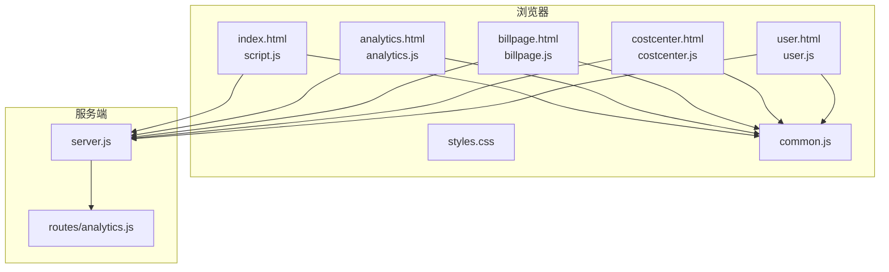
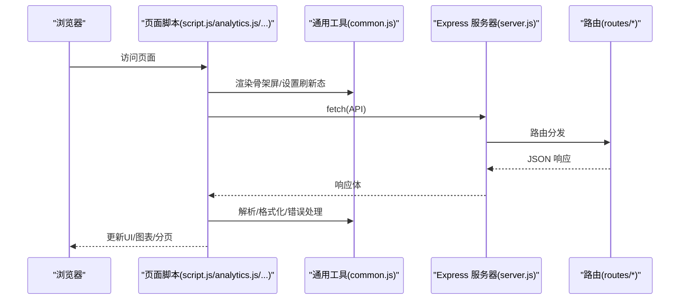
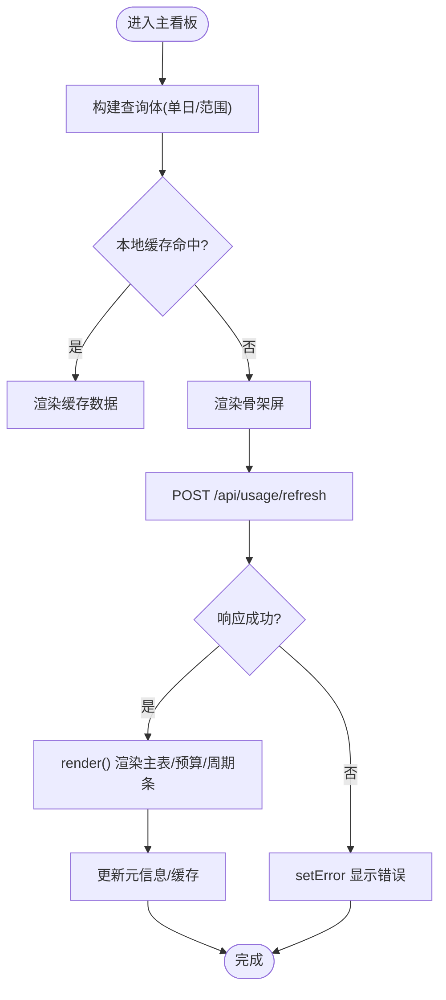
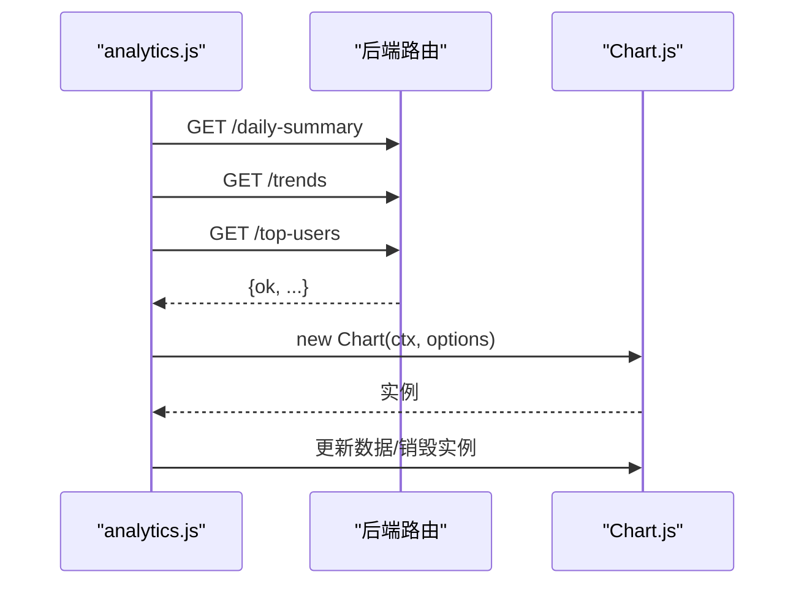
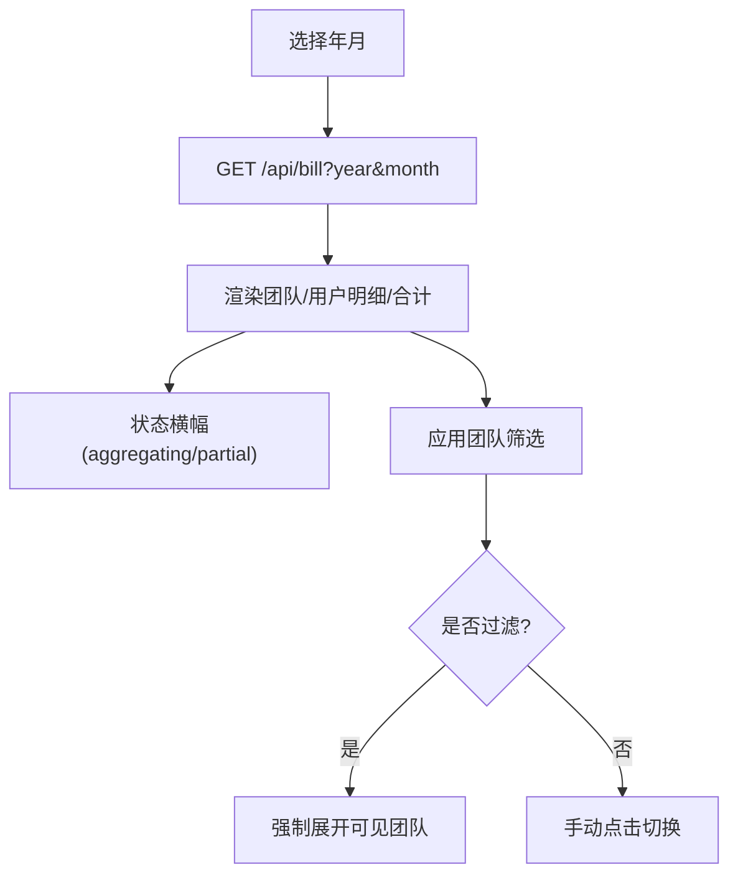
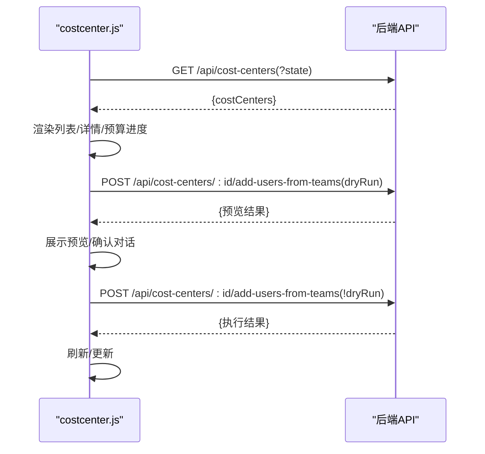
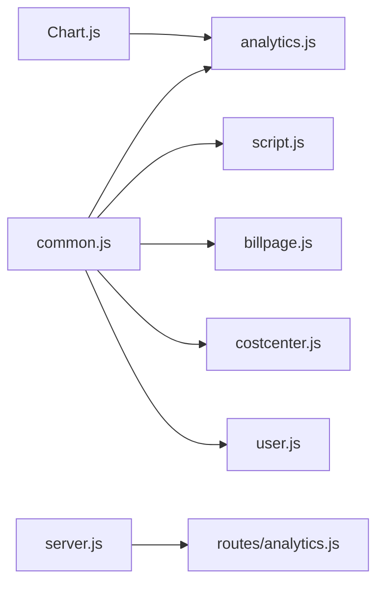
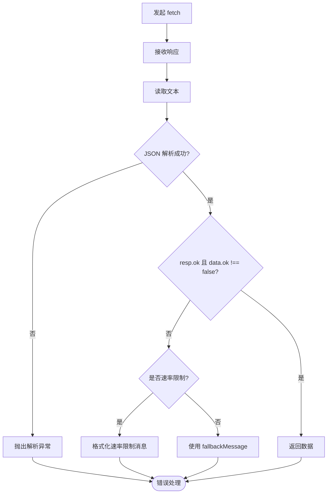

# 前端界面问题

<cite>
**本文引用的文件**
- [public/index.html](file://public/index.html)
- [public/script.js](file://public/script.js)
- [public/styles.css](file://public/styles.css)
- [public/common.js](file://public/common.js)
- [public/analytics.html](file://public/analytics.html)
- [public/analytics.js](file://public/analytics.js)
- [public/billpage.html](file://public/billpage.html)
- [public/billpage.js](file://public/billpage.js)
- [public/costcenter.html](file://public/costcenter.html)
- [public/costcenter.js](file://public/costcenter.js)
- [public/user.html](file://public/user.html)
- [public/user.js](file://public/user.js)
- [routes/analytics.js](file://routes/analytics.js)
- [server.js](file://server.js)
- [package.json](file://package.json)
</cite>

## 目录
1. [简介](#简介)
2. [项目结构](#项目结构)
3. [核心组件](#核心组件)
4. [架构总览](#架构总览)
5. [详细组件分析](#详细组件分析)
6. [依赖关系分析](#依赖关系分析)
7. [性能考量](#性能考量)
8. [故障排查指南](#故障排查指南)
9. [结论](#结论)
10. [附录](#附录)

## 简介
本指南面向 CopilotEnterpriseUsageDisplay 的前端界面问题排查，聚焦以下方面：
- 页面加载与资源加载失败、JS 执行异常、CSS 样式异常
- 数据加载失败的诊断：AJAX 请求失败、API 响应格式错误、数据解析异常
- 图表显示异常：Chart.js 初始化、数据格式、渲染性能
- 用户交互失效：事件绑定、表单校验、分页
- 浏览器兼容性：ES6+、DOM API、第三方库
- 前端性能优化与调试工具使用

## 项目结构
前端由多页面组成，共享通用工具模块与样式：
- 主看板页面：index.html + script.js + common.js + styles.css
- 数据分析页面：analytics.html + analytics.js + Chart.js
- 账单查询页面：billpage.html + billpage.js + common.js
- Cost Center 管理：costcenter.html + costcenter.js + common.js
- 用户映射管理：user.html + user.js + common.js
- 服务器：server.js 提供静态资源与路由

**图表来源**
- [public/index.html:1-103](file://public/index.html#L1-L103)
- [public/script.js:1-541](file://public/script.js#L1-L541)
- [public/analytics.html:1-58](file://public/analytics.html#L1-L58)
- [public/analytics.js:1-235](file://public/analytics.js#L1-L235)
- [public/billpage.html:1-67](file://public/billpage.html#L1-L67)
- [public/billpage.js:1-285](file://public/billpage.js#L1-L285)
- [public/costcenter.html:1-71](file://public/costcenter.html#L1-L71)
- [public/costcenter.js:1-307](file://public/costcenter.js#L1-L307)
- [public/user.html:1-54](file://public/user.html#L1-L54)
- [public/user.js:1-341](file://public/user.js#L1-L341)
- [public/common.js:1-113](file://public/common.js#L1-L113)
- [public/styles.css:1-800](file://public/styles.css#L1-L800)
- [routes/analytics.js:1-132](file://routes/analytics.js#L1-L132)
- [server.js:1-182](file://server.js#L1-L182)

**章节来源**
- [public/index.html:1-103](file://public/index.html#L1-L103)
- [public/script.js:1-541](file://public/script.js#L1-L541)
- [public/common.js:1-113](file://public/common.js#L1-L113)
- [public/styles.css:1-800](file://public/styles.css#L1-L800)
- [server.js:1-182](file://server.js#L1-L182)

## 核心组件
- 通用工具模块（common.js）
  - 提供 HTML 转义、时间格式化、错误设置、API 请求封装、数字格式化、USD 格式化、骨架屏渲染、元信息刷新态、localStorage 缓存等能力
- 主看板（index.html + script.js）
  - 查询模式切换（单日/范围）、排序、分页、团队筛选、模态弹窗、自动刷新、缓存与本地存储
- 数据分析（analytics.html + analytics.js）
  - Chart.js 折线图与柱状图渲染、双轴配置、响应式、标签页切换
- 账单查询（billpage.html + billpage.js）
  - 月度账单查询、强制刷新、团队筛选、展开/折叠明细、总计 Footer
- Cost Center（costcenter.html + costcenter.js）
  - 列表/详情渲染、资源分组展示、预算进度条、批量加入用户（含预览/确认）
- 用户映射（user.html + user.js）
  - 文件上传、重新加载映射、刷新成员列表、表格排序与分页
- 样式（styles.css）
  - 设计系统变量、布局、主题色、组件样式（表格、分页、模态、预算进度、团队筛选）

**章节来源**
- [public/common.js:1-113](file://public/common.js#L1-L113)
- [public/script.js:1-541](file://public/script.js#L1-L541)
- [public/analytics.js:1-235](file://public/analytics.js#L1-L235)
- [public/billpage.js:1-285](file://public/billpage.js#L1-L285)
- [public/costcenter.js:1-307](file://public/costcenter.js#L1-L307)
- [public/user.js:1-341](file://public/user.js#L1-L341)
- [public/styles.css:1-800](file://public/styles.css#L1-L800)

## 架构总览
前端通过 fetch 发起 AJAX 请求，调用后端路由；后端以 Express 提供静态资源与 API。通用工具模块统一处理错误、速率限制与缓存。

**图表来源**
- [public/script.js:312-326](file://public/script.js#L312-L326)
- [public/analytics.js:159-189](file://public/analytics.js#L159-L189)
- [public/common.js:39-53](file://public/common.js#L39-L53)
- [server.js:88-98](file://server.js#L88-L98)
- [routes/analytics.js:10-42](file://routes/analytics.js#L10-L42)

## 详细组件分析

### 主看板（index.html + script.js）
- 关键交互
  - 查询模式切换（单日/范围）、刷新按钮、自动刷新下拉、团队筛选下拉、表头排序、分页
- 数据流
  - 构建查询体 → 本地缓存命中则直接渲染 → 否则骨架屏 → 发送 /api/usage/refresh → 渲染主表/预算进度/周期条 → 更新元信息与缓存
- 错误处理
  - 统一通过 setError 展示错误；速率限制通过 isRateLimitPayload/formatRateLimitMessage 区分提示

**图表来源**
- [public/script.js:291-340](file://public/script.js#L291-L340)
- [public/script.js:191-234](file://public/script.js#L191-L234)
- [public/common.js:19-23](file://public/common.js#L19-L23)

**章节来源**
- [public/index.html:1-103](file://public/index.html#L1-L103)
- [public/script.js:1-541](file://public/script.js#L1-L541)
- [public/common.js:1-113](file://public/common.js#L1-L113)

### 数据分析（analytics.html + analytics.js + Chart.js）
- 关键交互
  - 时间范围（30/90/365）切换、刷新、图表标签页（趋势/Top用户）
- 数据流
  - 并行请求 /api/analytics/daily-summary、trends、top-users → 渲染汇总卡片 → 渲染折线图/柱状图 → 更新新鲜度徽章
- 图表初始化
  - 每次渲染前 destroy 旧实例，避免内存泄漏
  - 双轴配置：左轴请求量、右轴费用

**图表来源**
- [public/analytics.html:53-55](file://public/analytics.html#L53-L55)
- [public/analytics.js:159-189](file://public/analytics.js#L159-L189)
- [public/analytics.js:50-114](file://public/analytics.js#L50-L114)
- [public/analytics.js:117-156](file://public/analytics.js#L117-L156)

**章节来源**
- [public/analytics.html:1-58](file://public/analytics.html#L1-L58)
- [public/analytics.js:1-235](file://public/analytics.js#L1-L235)
- [routes/analytics.js:1-132](file://routes/analytics.js#L1-L132)

### 账单查询（billpage.html + billpage.js）
- 关键交互
  - 月度选择器、查询/强制刷新、团队筛选、行点击展开/折叠
- 数据流
  - 查询 → 渲染表头/明细/合计 → 状态横幅 → 过滤生效时强制展开

**图表来源**
- [public/billpage.html:1-67](file://public/billpage.html#L1-L67)
- [public/billpage.js:194-222](file://public/billpage.js#L194-L222)
- [public/billpage.js:50-146](file://public/billpage.js#L50-L146)

**章节来源**
- [public/billpage.html:1-67](file://public/billpage.html#L1-L67)
- [public/billpage.js:1-285](file://public/billpage.js#L1-L285)

### Cost Center（costcenter.html + costcenter.js）
- 关键交互
  - 状态筛选、刷新、展开资源详情、批量加入用户（预览/确认）
- 数据流
  - 列表/详情 → 渲染预算进度条/资源分组 → 预览变更 → 确认执行 → 刷新页面

**图表来源**
- [public/costcenter.html:1-71](file://public/costcenter.html#L1-L71)
- [public/costcenter.js:235-254](file://public/costcenter.js#L235-L254)
- [public/costcenter.js:281-301](file://public/costcenter.js#L281-L301)

**章节来源**
- [public/costcenter.html:1-71](file://public/costcenter.html#L1-L71)
- [public/costcenter.js:1-307](file://public/costcenter.js#L1-L307)

### 用户映射（user.html + user.js）
- 关键交互
  - 上传映射文件、重新加载映射、刷新成员列表、表格排序、分页
- 数据流
  - 上传 → 成功/失败反馈 → 重新加载映射 → 刷新成员列表 → 排序/分页渲染

**章节来源**
- [public/user.html:1-54](file://public/user.html#L1-L54)
- [public/user.js:1-341](file://public/user.js#L1-L341)

## 依赖关系分析
- 第三方库
  - Chart.js：数据分析页面使用
  - Express：静态资源与路由
- 前端模块耦合
  - 各页面脚本依赖 common.js 提供的统一工具
  - 页面与后端路由通过 /api/* 通信

**图表来源**
- [public/analytics.html:53-55](file://public/analytics.html#L53-L55)
- [public/script.js:1-541](file://public/script.js#L1-L541)
- [public/analytics.js:1-235](file://public/analytics.js#L1-L235)
- [public/billpage.js:1-285](file://public/billpage.js#L1-L285)
- [public/costcenter.js:1-307](file://public/costcenter.js#L1-L307)
- [public/user.js:1-341](file://public/user.js#L1-L341)
- [public/common.js:1-113](file://public/common.js#L1-L113)
- [server.js:88-98](file://server.js#L88-L98)
- [routes/analytics.js:1-132](file://routes/analytics.js#L1-L132)

**章节来源**
- [package.json:12-21](file://package.json#L12-L21)
- [server.js:1-182](file://server.js#L1-L182)

## 性能考量
- 骨架屏与增量渲染
  - 使用 renderSkeletonRows 在网络延迟时提升感知性能
- 分页与虚拟滚动
  - 主看板与用户映射采用分页；成本中心列表采用分块插入（requestAnimationFrame）降低主线程阻塞
- 缓存策略
  - 本地 localStorage 缓存与后端 ETag 缓存结合，减少重复请求
- 图表性能
  - 每次渲染前销毁旧实例，避免内存泄漏；响应式配置与合理 ticks 控制渲染开销

**章节来源**
- [public/common.js:65-75](file://public/common.js#L65-L75)
- [public/costcenter.js:133-150](file://public/costcenter.js#L133-L150)
- [public/analytics.js:50-114](file://public/analytics.js#L50-L114)
- [public/analytics.js:117-156](file://public/analytics.js#L117-L156)

## 故障排查指南

### 一、页面加载与资源加载失败
- 症状
  - 白屏、样式未生效、脚本报错
- 排查步骤
  - 检查静态资源路径：确认 index.html 引入的 styles.css 与脚本路径正确
  - 打开浏览器开发者工具 Network 面板，查看 404/5xx
  - 检查 CSP/跨域策略（如从 CDN 引入 Chart.js）
  - 确认 server.js 已启用静态资源中间件
- 常见原因
  - 路径拼写错误、相对路径在子路径下失效、CDN 不可用、浏览器缓存导致版本不一致

**章节来源**
- [public/index.html:7-100](file://public/index.html#L7-L100)
- [public/analytics.html:53-55](file://public/analytics.html#L53-L55)
- [server.js:13-14](file://server.js#L13-L14)

### 二、JavaScript 执行异常
- 症状
  - 控制台报错（如 undefined、Cannot read property），页面无响应
- 排查步骤
  - 定位报错堆栈，检查对应 DOM 是否存在（如 script.js 中大量 querySelector）
  - 检查 ES6+ 语法兼容性（如箭头函数、模板字符串、const/let）
  - 确认 common.js 已在页面头部加载
- 常见原因
  - DOM 未就绪即访问元素、模块加载顺序错误、浏览器不支持新语法

**章节来源**
- [public/script.js:1-50](file://public/script.js#L1-L50)
- [public/common.js:1-10](file://public/common.js#L1-L10)

### 三、CSS 样式问题
- 症状
  - 布局错乱、颜色不正确、字体未加载
- 排查步骤
  - 检查 styles.css 是否被正确加载
  - 使用 Elements 面板检查样式覆盖链
  - 字体加载失败时，检查 Google Fonts 可达性
- 常见原因
  - CSS 优先级冲突、字体资源不可达、媒体查询断点导致的响应式问题

**章节来源**
- [public/styles.css:1-800](file://public/styles.css#L1-L800)

### 四、数据加载失败（AJAX/响应/解析）
- 症状
  - “加载失败”“请求失败”“刷新失败”，错误框显示
- 排查步骤
  - 查看 Network 面板：请求是否 200，响应体是否 JSON
  - 检查后端路由是否正确挂载（server.js）
  - 使用 common.js 的 apiFetchJson 封装：响应非 OK 或包含 { ok:false } 时会抛出错误
  - 速率限制：当响应为 429 或包含速率限制字段时，formatRateLimitMessage 会给出明确提示
- 常见原因
  - 后端路由未挂载、上游 API 限流、响应体非 JSON、跨域/代理配置错误

**图表来源**
- [public/common.js:39-53](file://public/common.js#L39-L53)

**章节来源**
- [public/common.js:19-53](file://public/common.js#L19-L53)
- [server.js:88-98](file://server.js#L88-L98)

### 五、图表显示异常（Chart.js）
- 症状
  - 图表空白、渲染闪烁、双轴错位、内存泄漏
- 排查步骤
  - 确认 Canvas 上下文有效（analytics.js 中 getContext("2d")）
  - 每次渲染前 destroy 旧实例（analytics.js）
  - 检查数据数组长度与类型（数值/日期字符串）
  - 确保 Chart.js 版本与 UMD 引入方式兼容
- 常见原因
  - 重复实例未销毁、数据为空或类型不匹配、容器尺寸变化未触发 resize

**章节来源**
- [public/analytics.html:53-55](file://public/analytics.html#L53-L55)
- [public/analytics.js:50-114](file://public/analytics.js#L50-L114)
- [public/analytics.js:117-156](file://public/analytics.js#L117-L156)

### 六、用户交互功能失效
- 主看板
  - 排序/分页/筛选/模态：检查事件绑定是否在 DOM 就绪后执行；确认 active/open 类名切换逻辑
- 账单查询
  - 行点击展开/折叠：检查 selectedTeams 过滤状态对交互的影响
- Cost Center
  - 批量加入：确认预览/确认流程与后端接口返回结构一致
- 用户映射
  - 分页/排序：检查分页按钮事件绑定与当前页边界

**章节来源**
- [public/script.js:174-188](file://public/script.js#L174-L188)
- [public/script.js:236-277](file://public/script.js#L236-L277)
- [public/billpage.js:136-145](file://public/billpage.js#L136-L145)
- [public/costcenter.js:281-301](file://public/costcenter.js#L281-L301)
- [public/user.js:152-162](file://public/user.js#L152-L162)

### 七、浏览器兼容性
- ES6+ 支持
  - 箭头函数、const/let、模板字符串、Promise、fetch、Array.from、Set、Map
- DOM API
  - querySelector/querySelectorAll、dataset、classList、addEventListener、JSON.parse/stringify
- 第三方库
  - Chart.js 需要现代浏览器支持；如需兼容旧版 IE，考虑引入 polyfill 或降级方案
- 建议
  - 使用 Babel/打包工具时保留必要 polyfill；在 CI 中增加兼容性测试

**章节来源**
- [public/script.js:1-50](file://public/script.js#L1-L50)
- [public/analytics.js:1-20](file://public/analytics.js#L1-L20)
- [public/common.js:1-10](file://public/common.js#L1-L10)
- [package.json:12-21](file://package.json#L12-L21)

### 八、前端性能优化与调试
- 性能优化
  - 骨架屏与懒渲染：已在多处使用
  - 分块渲染：成本中心列表分块插入
  - 缓存：本地缓存与后端 ETag 结合
  - 图表销毁：避免重复实例
- 调试工具
  - Network：观察请求/响应、缓存命中、速率限制
  - Performance：检测长任务、重排重绘
  - Memory：监控内存泄漏（图表实例销毁）
  - Console：定位错误堆栈与速率限制提示

**章节来源**
- [public/common.js:65-96](file://public/common.js#L65-L96)
- [public/costcenter.js:133-150](file://public/costcenter.js#L133-L150)
- [public/analytics.js:50-114](file://public/analytics.js#L50-L114)

## 结论
本指南提供了 CopilotEnterpriseUsageDisplay 前端界面问题的系统化排查方法，覆盖资源加载、JS 执行、样式、数据加载、图表、交互、兼容性与性能优化。建议在开发与运维流程中结合浏览器开发者工具与后端日志，快速定位并解决问题。

## 附录
- 快速检查清单
  - 资源路径与 CDN 可达性
  - common.js 加载顺序
  - fetch 响应与 JSON 解析
  - Chart.js 实例销毁
  - 事件绑定时机与状态过滤
  - ES6+ 语法与 DOM API 兼容
  - 缓存与 ETag 配置