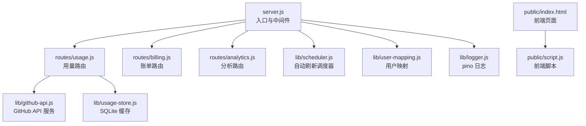
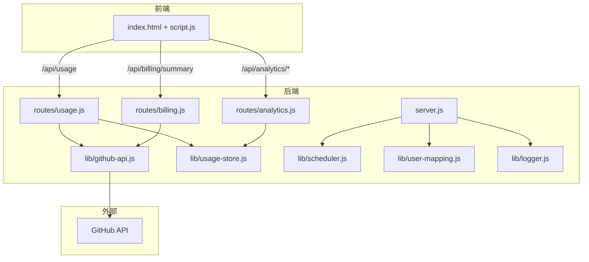
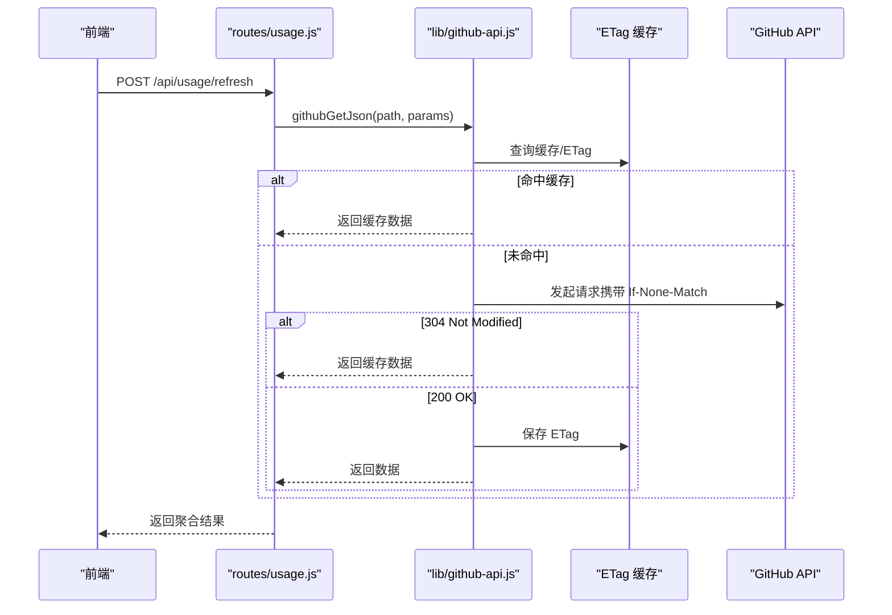
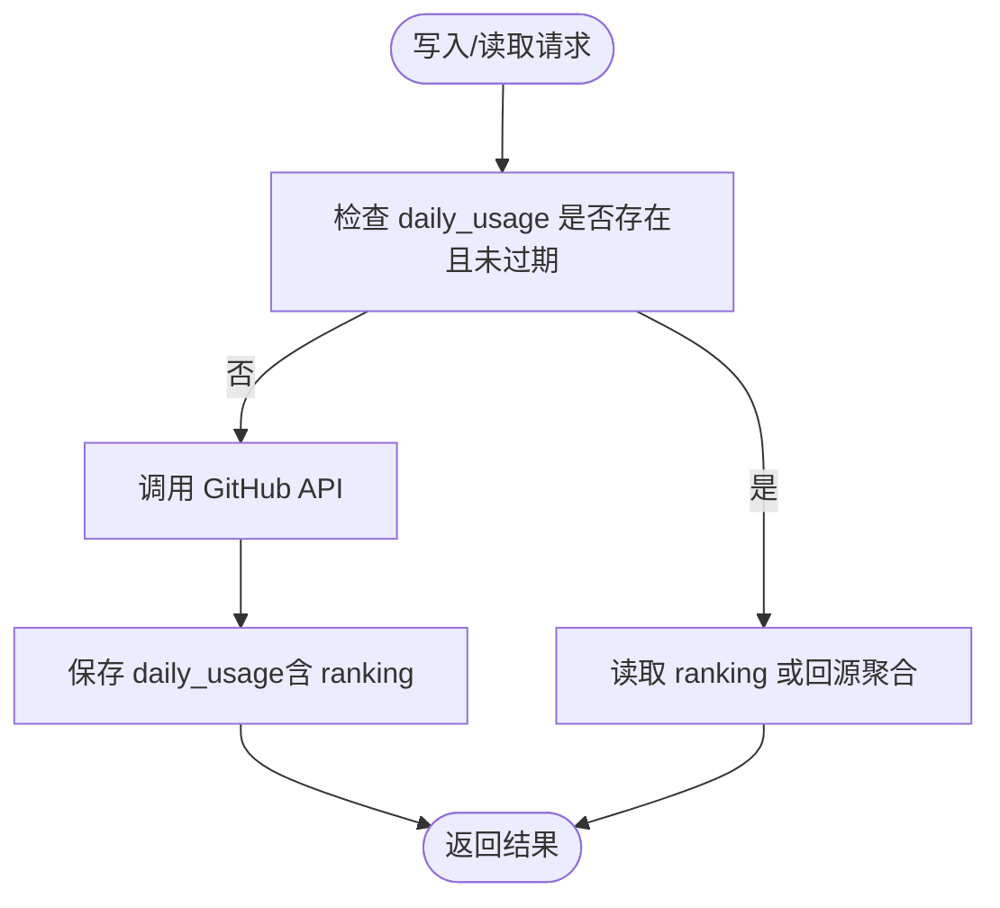
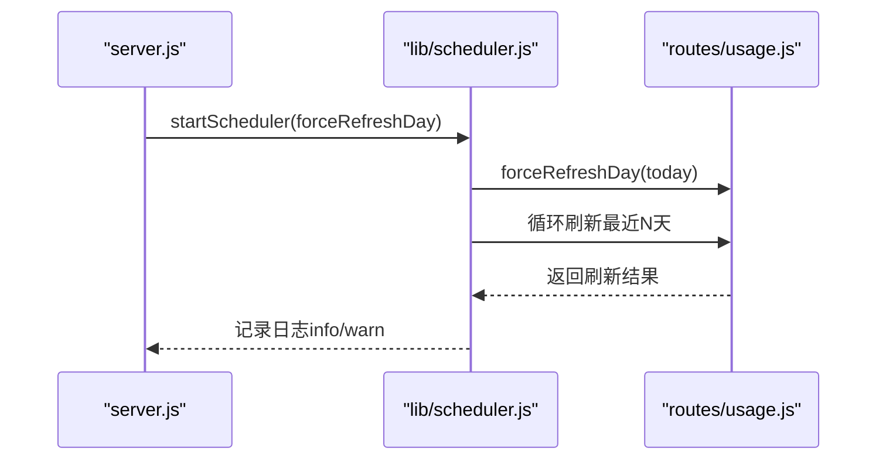
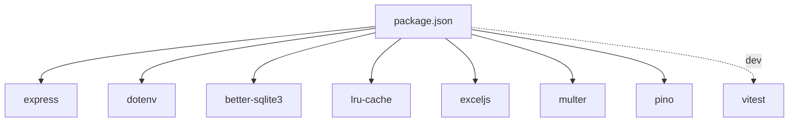

# 故障排除与常见问题

<cite>
**本文引用的文件**
- [README.md](file://README.md)
- [server.js](file://server.js)
- [lib/logger.js](file://lib/logger.js)
- [lib/github-api.js](file://lib/github-api.js)
- [lib/usage-store.js](file://lib/usage-store.js)
- [lib/scheduler.js](file://lib/scheduler.js)
- [lib/user-mapping.js](file://lib/user-mapping.js)
- [routes/usage.js](file://routes/usage.js)
- [routes/billing.js](file://routes/billing.js)
- [routes/analytics.js](file://routes/analytics.js)
- [lib/helpers.js](file://lib/helpers.js)
- [scripts/preflight-check.js](file://scripts/preflight-check.js)
- [package.json](file://package.json)
- [deploy/copilot-dashboard.service](file://deploy/copilot-dashboard.service)
- [deploy/nginx-copilot-dashboard.conf](file://deploy/nginx-copilot-dashboard.conf)
- [public/index.html](file://public/index.html)
- [public/script.js](file://public/script.js)
</cite>

## 目录
1. [简介](#简介)
2. [项目结构](#项目结构)
3. [核心组件](#核心组件)
4. [架构总览](#架构总览)
5. [详细组件分析](#详细组件分析)
6. [依赖关系分析](#依赖关系分析)
7. [性能考量](#性能考量)
8. [故障排除指南](#故障排除指南)
9. [结论](#结论)
10. [附录](#附录)

## 简介
本指南面向技术支持与系统管理员，围绕 CopilotEnterpriseUsageDisplay 的部署、运行与维护提供系统化的故障排除与常见问题解答。内容覆盖权限配置、网络连通、API 调用失败、日志分析与调试、GitHub API 相关问题（认证、速率限制、数据延迟）、缓存一致性与性能问题、前端页面问题、性能优化与监控、以及升级迁移的风险控制与应急处理。

## 项目结构
项目采用模块化分层架构：入口层（Express）、路由层、服务层（GitHub API、SQLite 缓存、调度器、用户映射）、前端静态资源与页面脚本。核心运行路径包括：
- 入口与中间件：server.js
- 日志：lib/logger.js（pino）
- GitHub API 服务：lib/github-api.js（并发队列、重试、ETag、单次请求去重）
- 数据缓存：lib/usage-store.js（SQLite）
- 自动刷新：lib/scheduler.js
- 用户映射：lib/user-mapping.js
- 路由：routes/usage.js、routes/billing.js、routes/analytics.js 等
- 前端：public/index.html + public/script.js

**图表来源**
- [server.js:1-182](file://server.js#L1-L182)
- [routes/usage.js:1-470](file://routes/usage.js#L1-L470)
- [routes/billing.js:1-106](file://routes/billing.js#L1-L106)
- [routes/analytics.js:1-132](file://routes/analytics.js#L1-L132)
- [lib/github-api.js:1-320](file://lib/github-api.js#L1-L320)
- [lib/usage-store.js:1-324](file://lib/usage-store.js#L1-L324)
- [lib/scheduler.js:1-160](file://lib/scheduler.js#L1-L160)
- [lib/user-mapping.js:1-158](file://lib/user-mapping.js#L1-L158)
- [lib/logger.js:1-41](file://lib/logger.js#L1-L41)
- [public/index.html:1-103](file://public/index.html#L1-L103)
- [public/script.js:1-541](file://public/script.js#L1-L541)

**章节来源**
- [README.md:46-96](file://README.md#L46-L96)
- [server.js:1-182](file://server.js#L1-L182)

## 核心组件
- 入口与中间件：负责 HTTP 访问日志、URL 动作映射、全局错误处理、健康检查、优雅关闭、调度器启动与资源回收。
- GitHub API 服务：并发队列、重试与指数退避、ETag 条件请求、单次请求去重、LRU 缓存、速率限制检测与告警。
- SQLite 缓存：三层缓存（内存/SQLite/GitHub）与 ETag 持久化、动态 TTL（近期 1 小时，历史 90 天）、月度账单持久化。
- 自动刷新调度器：启动后立即刷新当天，随后在指定本地时间点刷新近期 N 天，失败仅记录警告。
- 用户映射：文件监听与去抖，自动热重载映射表。
- 前端：SWR 缓存、骨架屏、分页、排序、图表数据来源于 SQLite。

**章节来源**
- [server.js:16-182](file://server.js#L16-L182)
- [lib/github-api.js:23-320](file://lib/github-api.js#L23-L320)
- [lib/usage-store.js:10-324](file://lib/usage-store.js#L10-L324)
- [lib/scheduler.js:1-160](file://lib/scheduler.js#L1-L160)
- [lib/user-mapping.js:1-158](file://lib/user-mapping.js#L1-L158)
- [routes/usage.js:13-470](file://routes/usage.js#L13-L470)
- [routes/analytics.js:1-132](file://routes/analytics.js#L1-L132)

## 架构总览
系统通过三层缓存显著降低 GitHub API 调用频率，并在前端采用 SWR 与骨架屏提升刷新体验。调度器在后台定期刷新，缓解 GitHub Billing API 的 24–48 小时延迟影响。

**图表来源**
- [server.js:1-182](file://server.js#L1-L182)
- [routes/usage.js:1-470](file://routes/usage.js#L1-L470)
- [routes/billing.js:1-106](file://routes/billing.js#L1-L106)
- [routes/analytics.js:1-132](file://routes/analytics.js#L1-L132)
- [lib/github-api.js:1-320](file://lib/github-api.js#L1-L320)
- [lib/usage-store.js:1-324](file://lib/usage-store.js#L1-L324)
- [lib/scheduler.js:1-160](file://lib/scheduler.js#L1-L160)
- [lib/user-mapping.js:1-158](file://lib/user-mapping.js#L1-L158)
- [lib/logger.js:1-41](file://lib/logger.js#L1-L41)

## 详细组件分析

### GitHub API 服务（并发、重试、ETag、单次请求去重）
- 并发控制：通过队列与最大并发数限制，避免触发二级速率限制。
- 重试与退避：对速率限制与 5xx 错误进行指数退避重试，支持 retry-after 与 reset 时间。
- ETag 条件请求：持久化 ETag，304 时不消耗配额。
- 单次请求去重：同一参数的请求在飞行中会被复用，避免重复打 API。
- LRU 缓存：GET 请求结果按路径键缓存，结合 TTL 策略。

**图表来源**
- [routes/usage.js:387-462](file://routes/usage.js#L387-L462)
- [lib/github-api.js:108-168](file://lib/github-api.js#L108-L168)
- [lib/github-api.js:231-269](file://lib/github-api.js#L231-L269)

**章节来源**
- [lib/github-api.js:23-320](file://lib/github-api.js#L23-L320)
- [routes/usage.js:378-462](file://routes/usage.js#L378-L462)

### SQLite 缓存与 ETag 持久化
- daily_usage：按日期存储原始数据、聚合排名、模式、来源、抓取时间。
- seats_snapshot：席位快照，限制保留数量，避免膨胀。
- etag_cache：ETag 持久化，重启后恢复。
- monthly_bill：月度账单结果，按年月主键存储。
- 动态 TTL：近期（≤3 天）1 小时，历史 90 天，避免 GitHub 延迟导致的缓存“锁死”。

**图表来源**
- [lib/usage-store.js:137-193](file://lib/usage-store.js#L137-L193)
- [routes/usage.js:279-348](file://routes/usage.js#L279-L348)

**章节来源**
- [lib/usage-store.js:10-324](file://lib/usage-store.js#L10-L324)
- [routes/usage.js:253-277](file://routes/usage.js#L253-L277)

### 自动刷新调度器
- 启动后延迟刷新当天；在本地时间点（默认 03:00、12:00）刷新最近 N 天（默认 2）。
- 多实例安全：通过环境变量禁用在只读副本上运行。
- 失败仅记录警告，不影响主流程。

**图表来源**
- [server.js:146-148](file://server.js#L146-L148)
- [lib/scheduler.js:54-157](file://lib/scheduler.js#L54-L157)
- [routes/usage.js:273-277](file://routes/usage.js#L273-L277)

**章节来源**
- [lib/scheduler.js:1-160](file://lib/scheduler.js#L1-L160)
- [server.js:146-168](file://server.js#L146-L168)

### 用户映射服务（文件监听与热重载）
- 使用 fs.watch + 去抖机制，避免频繁重载。
- 数据文件不存在时自动创建空数组，加载失败时记录警告。

**章节来源**
- [lib/user-mapping.js:1-158](file://lib/user-mapping.js#L1-L158)

### 前端页面与交互
- 首屏加载：SWR 缓存 + 骨架屏，提升感知性能。
- 分页与排序：本地分页与排序，支持页码跳转与排序箭头。
- 模态框：用户与 Team 信息、账单汇总、模型排行、预算与费用。
- 自动刷新：可选 60/180/300 秒自动刷新。

**章节来源**
- [public/index.html:1-103](file://public/index.html#L1-L103)
- [public/script.js:1-541](file://public/script.js#L1-L541)

## 依赖关系分析
- 运行时依赖：Express、better-sqlite3、pino、lru-cache、dotenv、exceljs、multer。
- 开发依赖：vitest。
- systemd 与 Nginx：systemd 服务单元与反向代理配置。

**图表来源**
- [package.json:12-25](file://package.json#L12-L25)

**章节来源**
- [package.json:1-26](file://package.json#L1-L26)
- [deploy/copilot-dashboard.service:1-18](file://deploy/copilot-dashboard.service#L1-L18)
- [deploy/nginx-copilot-dashboard.conf:1-14](file://deploy/nginx-copilot-dashboard.conf#L1-L14)

## 性能考量
- 三层缓存：内存（5 分钟）→ SQLite（动态 TTL）→ GitHub API，显著降低 API 调用。
- ETag 条件请求：未变化返回 304，不消耗配额。
- 单次请求去重：多标签页同时刷新时复用同一请求。
- 动态 TTL 抖动防护：近期 1 小时，避免 GitHub 延迟导致的缓存“锁死”。
- 自动刷新：后台定期刷新，减少前端高峰压力。
- 前端分批渲染：requestAnimationFrame 分片渲染，避免主线程阻塞。

**章节来源**
- [README.md:218-242](file://README.md#L218-L242)
- [routes/usage.js:253-277](file://routes/usage.js#L253-L277)
- [lib/github-api.js:243-268](file://lib/github-api.js#L243-L268)
- [public/script.js:133-142](file://public/script.js#L133-L142)

## 故障排除指南

### 一、权限配置错误
症状
- 访问 GitHub API 返回 401、403 或 404。
- 启动前自检失败。

排查步骤
- 确认 .env 中 GITHUB_TOKEN 与 ENTERPRISE_SLUG 设置正确。
- 使用自检脚本验证网络连通、DNS 解析、Token 有效性与必要端点可用性。
- 若为组织维度，确认 ORG_NAME 或 ENTERPRISE_SLUG 二选一配置正确。

定位要点
- 自检脚本会分别对 /user、/meta、seat 与 premium usage 端点进行探测，并给出状态标签。
- server.js 的访问日志会记录 action 与状态码，便于定位。

**章节来源**
- [scripts/preflight-check.js:1-188](file://scripts/preflight-check.js#L1-L188)
- [server.js:16-86](file://server.js#L16-L86)
- [lib/helpers.js:58-80](file://lib/helpers.js#L58-L80)

### 二、网络连接问题
症状
- DNS 解析失败、无法访问 GitHub API。
- 请求超时或连接中断。

排查步骤
- 使用自检脚本的 DNS 与连通性检查。
- 检查代理与防火墙策略，确保 443 端口可达。
- 如使用反向代理（Nginx），确认配置正确并监听 80→3000。

定位要点
- 自检脚本对 api.github.com 的 /meta 与 /user 进行探测。
- systemd 服务单元与 journalctl 可用于查看服务状态与错误。

**章节来源**
- [scripts/preflight-check.js:96-111](file://scripts/preflight-check.js#L96-L111)
- [deploy/nginx-copilot-dashboard.conf:1-14](file://deploy/nginx-copilot-dashboard.conf#L1-L14)
- [deploy/copilot-dashboard.service:1-18](file://deploy/copilot-dashboard.service#L1-L18)

### 三、API 调用失败（认证、速率限制、数据延迟）
症状
- 403/429、速率限制告警、数据为空或不完整。
- 页面提示“请稍后再试”。

排查步骤
- 查看 pino 日志，关注 warn/error 级别，识别重试与退避行为。
- 检查 GITHUB_MAX_CONCURRENT 与 GITHUB_MAX_RETRIES 配置是否合理。
- 对于 GitHub Billing API 的 24–48 小时延迟，使用“按日/按月强制刷新”或等待调度器刷新。

定位要点
- lib/github-api.js 中对速率限制与 5xx 的重试与退避逻辑。
- routes/usage.js 的“per-user-fallback”回退与 SQLite 聚合兜底。

**章节来源**
- [lib/github-api.js:170-227](file://lib/github-api.js#L170-L227)
- [routes/usage.js:325-348](file://routes/usage.js#L325-L348)
- [README.md:243-296](file://README.md#L243-L296)

### 四、日志分析与调试
症状
- 无法定位错误来源、响应慢、缓存命中异常。

排查步骤
- 设置 LOG_LEVEL=debug 或 trace，观察访问日志、缓存命中/未命中、ETag 条件请求、重试次数与 in-flight 去重。
- 生产环境使用 JSON 格式日志，结合日志收集系统检索。
- 使用 server.js 的 /api/health 检查运行状态与内存占用。

定位要点
- lib/logger.js 的 redact 与 serializers，自动脱敏敏感信息。
- server.js 的访问日志中间件与全局错误处理。

**章节来源**
- [lib/logger.js:1-41](file://lib/logger.js#L1-L41)
- [server.js:16-139](file://server.js#L16-L139)
- [README.md:504-544](file://README.md#L504-L544)

### 五、缓存相关问题（不一致、数据丢失、性能下降）
症状
- 页面显示“该日期暂无用量数据（账单数据通常有 24～48 小时延迟）”。
- 缓存命中率异常或刷新后数据未更新。

排查步骤
- 使用“按日强制刷新”或“按月强制刷新”清除 SQLite 中的 daily_usage 与 monthly_bill，重新回源 GitHub。
- 检查 SQLite 表结构与索引是否存在，确认动态 TTL 与 ETag 持久化正常。
- 关注近期（≤3 天）1 小时 TTL 与历史 90 天 TTL 的差异。

定位要点
- routes/usage.js 的 buildCycleFromSQLite 三重完整性校验（覆盖、新鲜度、ranking 非空）。
- lib/usage-store.js 的 getEffectiveTTL、deleteDaysInMonth、saveDay 等。

**章节来源**
- [routes/usage.js:134-235](file://routes/usage.js#L134-L235)
- [routes/usage.js:279-348](file://routes/usage.js#L279-L348)
- [lib/usage-store.js:24-79](file://lib/usage-store.js#L24-L79)
- [README.md:243-296](file://README.md#L243-L296)

### 六、前端页面问题（数据加载失败、图表显示异常、交互失效）
症状
- 表格空白、无数据、自动刷新按钮不可用。
- 图表不显示或显示异常。

排查步骤
- 检查浏览器控制台是否有网络错误或跨域问题。
- 确认 /api/usage/refresh 返回的 ranking 与 includedQuota 正常。
- 检查本地缓存（localStorage）与前端 SWR 缓存是否过期。
- 确认分页与排序逻辑未因空数据而异常。

定位要点
- public/script.js 的刷新流程、骨架屏渲染、分页与排序逻辑。
- 前端错误提示与 modal 打开失败的错误信息。

**章节来源**
- [public/script.js:298-340](file://public/script.js#L298-L340)
- [public/script.js:133-188](file://public/script.js#L133-L188)
- [public/index.html:1-103](file://public/index.html#L1-103)

### 七、性能优化与监控
建议
- 合理设置 GITHUB_MAX_CONCURRENT 与 GITHUB_MAX_RETRIES，避免触发速率限制。
- 使用动态 TTL 与 ETag 减少 API 调用。
- 前端分页与排序在本地完成，避免一次性传输大量数据。
- 监控 /api/health 的 uptime、memoryMB、timestamp，结合日志分析峰值与异常。

监控指标
- 缓存命中率：页面顶部显示百分比。
- 日志级别：info/warn/error，区分一般访问与异常事件。
- 健康检查：uptime、内存、时间戳。

**章节来源**
- [server.js:100-108](file://server.js#L100-L108)
- [README.md:236-242](file://README.md#L236-L242)
- [README.md:515-524](file://README.md#L515-L524)

### 八、系统升级与迁移
风险控制
- 升级前运行自检脚本，确保环境变量、网络与权限正确。
- 多副本部署时，在非主副本设置 SCHED_DISABLED=true，避免重复刷新。
- 迁移前备份 data/usage.db 与 data/user_mapping.json。
- 升级后验证 /api/health 与 /api/usage/refresh 的返回。

应急处理
- 若出现缓存不一致：使用“按月强制刷新”或“按日强制刷新”。
- 若服务异常：systemctl status copilot-dashboard，journalctl -u copilot-dashboard -f 查看日志。

**章节来源**
- [scripts/preflight-check.js:1-188](file://scripts/preflight-check.js#L1-L188)
- [lib/scheduler.js:59-62](file://lib/scheduler.js#L59-L62)
- [deploy/copilot-dashboard.service:1-18](file://deploy/copilot-dashboard.service#L1-L18)

## 结论
通过三层缓存、ETag 条件请求、单次请求去重与自动刷新调度器，系统在 GitHub API 延迟与配额限制下仍能稳定运行。结合 pino 结构化日志与自检脚本，可以快速定位权限、网络与 API 调用问题；借助“按日/按月强制刷新”与动态 TTL，可有效解决缓存不一致与数据延迟问题；前端 SWR 与分页排序进一步提升了用户体验。升级与迁移过程中，务必做好自检、备份与回滚预案，确保业务连续性。

## 附录

### 常用端点与操作
- /api/health：健康检查
- POST /api/usage/refresh：刷新用量数据（支持 force:true）
- POST /api/bill/refresh：按月强制刷新账单
- GET /api/seats：获取席位数据（支持 ?refresh=1）
- GET /api/analytics/*：趋势、Top 用户、日汇总
- /billpage：Team 月度账单页面（隐式入口）

**章节来源**
- [README.md:111-127](file://README.md#L111-L127)
- [server.js:100-118](file://server.js#L100-L118)
- [routes/usage.js:387-462](file://routes/usage.js#L387-L462)
- [routes/billing.js:13-20](file://routes/billing.js#L13-L20)
- [routes/analytics.js:10-132](file://routes/analytics.js#L10-L132)