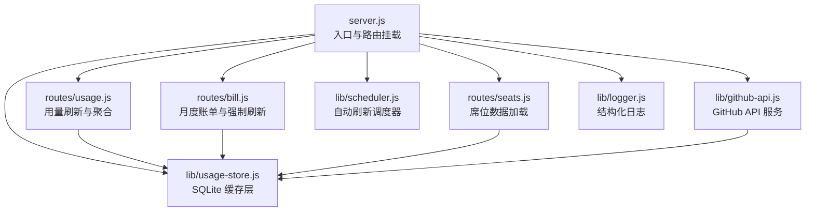
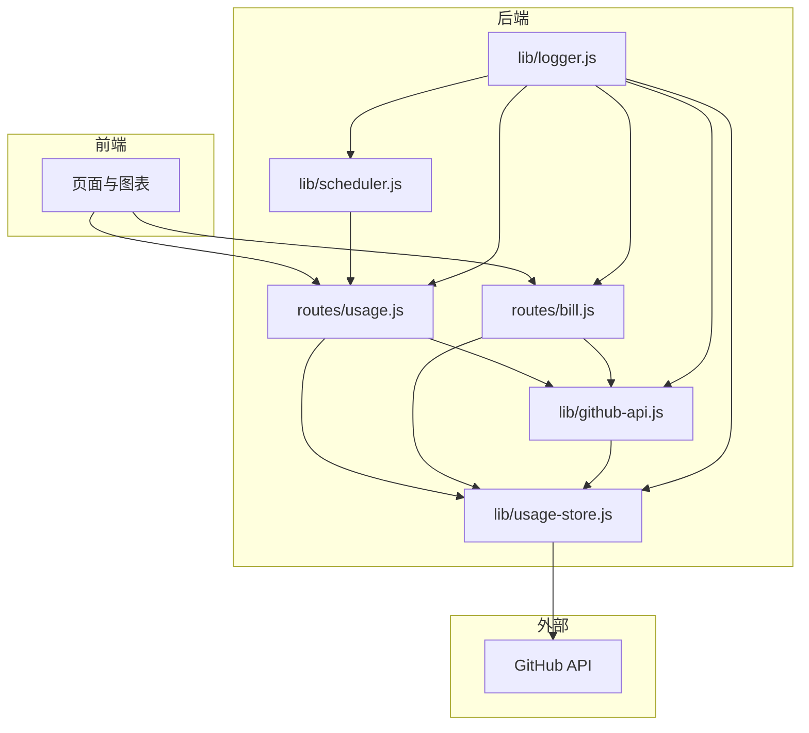
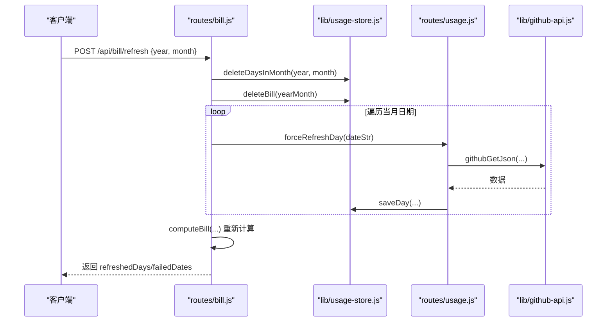
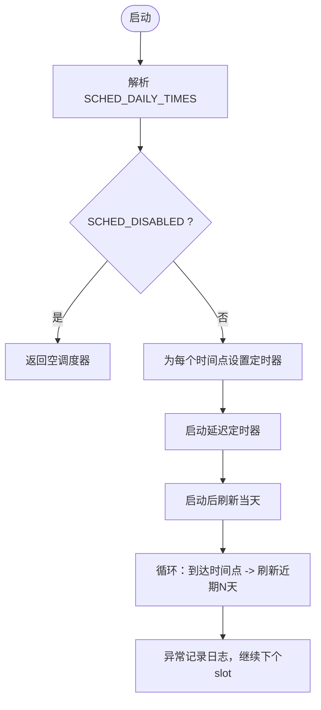
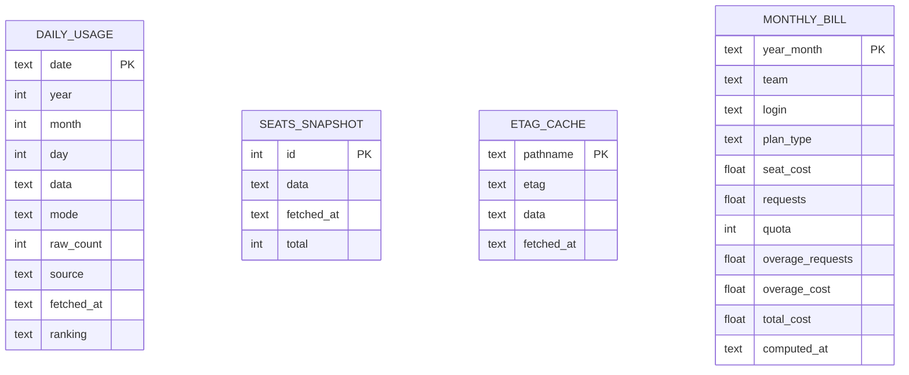
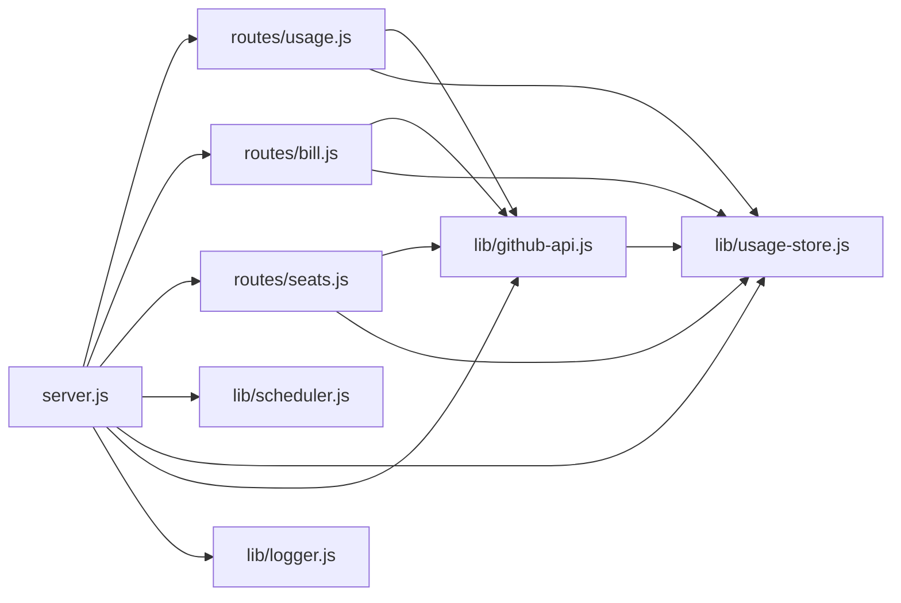

# 数据刷新与同步问题

<cite>
**本文引用的文件**
- [server.js](file://server.js)
- [scheduler.js](file://lib/scheduler.js)
- [usage-store.js](file://lib/usage-store.js)
- [github-api.js](file://lib/github-api.js)
- [usage.js](file://routes/usage.js)
- [bill.js](file://routes/bill.js)
- [seats.js](file://routes/seats.js)
- [helpers.js](file://lib/helpers.js)
- [date-utils.js](file://lib/date-utils.js)
- [logger.js](file://lib/logger.js)
- [README.md](file://README.md)
- [sqlite-cache-design.md](file://docs/sqlite-cache-design.md)
- [package.json](file://package.json)
</cite>

## 目录
1. [简介](#简介)
2. [项目结构](#项目结构)
3. [核心组件](#核心组件)
4. [架构总览](#架构总览)
5. [详细组件分析](#详细组件分析)
6. [依赖关系分析](#依赖关系分析)
7. [性能考量](#性能考量)
8. [故障排查指南](#故障排查指南)
9. [结论](#结论)
10. [附录](#附录)

## 简介
本指南聚焦 CopilotEnterpriseUsageDisplay 的数据刷新与同步问题，围绕以下目标展开：
- 强制刷新机制故障排除：按日强制刷新、按月强制刷新、强制刷新失败处理
- 自动刷新调度器诊断：调度时间配置、任务执行状态、异常处理
- 数据同步问题排查：GitHub API 数据延迟、SQLite 缓存同步、数据一致性验证
- 缓存修复：缓存不完整与过期的清理、回源与重新计算流程
- 批量数据处理：并发控制、错误重试、进度监控
- 数据质量检查：完整性验证、异常检测与修复策略

## 项目结构
后端采用模块化分层架构，入口 server.js 挂载路由与调度器，lib 层封装缓存与 API 服务，routes 层实现业务路由。

**图表来源**
- [server.js:146-148](file://server.js#L146-L148)
- [scheduler.js:54-157](file://lib/scheduler.js#L54-L157)
- [usage-store.js:10-324](file://lib/usage-store.js#L10-L324)
- [github-api.js:108-227](file://lib/github-api.js#L108-L227)
- [usage.js:13-470](file://routes/usage.js#L13-L470)
- [bill.js:13-407](file://routes/bill.js#L13-L407)
- [seats.js:37-78](file://routes/seats.js#L37-L78)
- [logger.js:13-41](file://lib/logger.js#L13-L41)

**章节来源**
- [server.js:146-148](file://server.js#L146-L148)
- [README.md:46-96](file://README.md#L46-L96)

## 核心组件
- 自动刷新调度器：基于环境变量配置的每日定时任务，启动后立即刷新当天，随后在指定本地时间点强制刷新近期天数。
- GitHub API 服务：并发队列、重试退避、ETag 条件请求、单飞去重，保障稳定性与效率。
- SQLite 缓存层：三层缓存（内存 → SQLite → GitHub），持久化每日用量、ETag、席位快照与月度账单。
- 用量刷新路由：支持按日/范围/默认三种模式，强制刷新跳过内存与 SQLite TTL，回源并覆盖写入。
- 按月强制刷新路由：清空月度缓存，按并发节流逐日回源，重新计算账单并返回进度。

**章节来源**
- [scheduler.js:1-160](file://lib/scheduler.js#L1-L160)
- [github-api.js:1-320](file://lib/github-api.js#L1-L320)
- [usage-store.js:1-324](file://lib/usage-store.js#L1-L324)
- [usage.js:13-470](file://routes/usage.js#L13-L470)
- [bill.js:13-407](file://routes/bill.js#L13-L407)

## 架构总览
系统通过“内存缓存 → SQLite → GitHub API”的三层缓存链路，结合调度器与强制刷新接口，实现高效、可靠的用量与账单数据刷新。

**图表来源**
- [usage.js:378-462](file://routes/usage.js#L378-L462)
- [bill.js:237-403](file://routes/bill.js#L237-L403)
- [scheduler.js:54-157](file://lib/scheduler.js#L54-L157)
- [github-api.js:108-227](file://lib/github-api.js#L108-L227)
- [usage-store.js:24-79](file://lib/usage-store.js#L24-L79)
- [logger.js:13-41](file://lib/logger.js#L13-L41)

## 详细组件分析

### 强制刷新机制（按日/按月/失败处理）
- 按日强制刷新
  - 触发方式：POST /api/usage/refresh，请求体传入 queryMode="single" 与 date，并设置 force=true
  - 行为：跳过内存 refreshCache 与 SQLite TTL 检查，直接调用 GitHub API，覆盖写入 SQLite
  - 单飞去重：同一参数的并发请求会被复用，避免重复打 GitHub
- 按月强制刷新
  - 触发方式：POST /api/bill/refresh，请求体包含 year 与 month
  - 行为：删除该月 daily_usage 与 monthly_bill，按 GITHUB_MAX_CONCURRENT 并发逐日回源，重新计算账单，返回 refreshedDays 与 failedDates
- 强制刷新失败处理
  - 单日失败：记录 warn 日志并返回失败日期列表，可单独重试该日
  - 月度失败：根据 failedDates 逐日重试或扩大重试窗口，必要时清理缓存后全量回源

**图表来源**
- [bill.js:321-403](file://routes/bill.js#L321-L403)
- [usage.js:273-277](file://routes/usage.js#L273-L277)
- [github-api.js:231-269](file://lib/github-api.js#L231-L269)
- [usage-store.js:205-207](file://lib/usage-store.js#L205-L207)

**章节来源**
- [usage.js:387-462](file://routes/usage.js#L387-L462)
- [bill.js:315-403](file://routes/bill.js#L315-L403)
- [README.md:243-289](file://README.md#L243-L289)

### 自动刷新调度器（诊断要点）
- 配置项
  - SCHED_DISABLED：禁用调度器（多副本部署时可在非主副本关闭）
  - SCHED_DAILY_TIMES：本地时间点列表，默认 03:00,12:00
  - SCHED_BACKFILL_DAYS：每次回填天数，默认 2（今天+昨天+前天）
  - SCHED_STARTUP_DELAY_MS：启动后首次刷新延迟，默认 5000ms
- 执行状态
  - 启动后延迟刷新当天，随后在每个配置时间点强制刷新近期天数
  - 每次调度记录 info/warn 日志，失败仅记录警告不影响主流程
- 异常处理
  - 调度器内部 try/catch 包裹，slot 运行异常记录错误日志
  - stop() 方法清理所有定时器，优雅关闭时调用

**图表来源**
- [scheduler.js:59-157](file://lib/scheduler.js#L59-L157)

**章节来源**
- [scheduler.js:14-19](file://lib/scheduler.js#L14-L19)
- [scheduler.js:59-157](file://lib/scheduler.js#L59-L157)
- [server.js:146-148](file://server.js#L146-L148)

### 数据同步问题排查（GitHub API 延迟、SQLite 同步、一致性）
- GitHub API 数据延迟
  - 系统默认 TTL 为 90 天，近 3 天采用 1 小时 TTL，避免 24–48h 延迟写入空/不完整数据被长期缓存锁死
  - per-user fallback 机制：当 direct 聚合无已知用户时，按用户并发查询并持久化 ranking
- SQLite 同步与一致性
  - daily_usage 表：按日期主键写入，INSERT OR REPLACE 简化逻辑
  - seats_snapshot：10 分钟 TTL，启动恢复，防止席位数据膨胀
  - etag_cache：持久化 ETag，重启恢复，条件请求减少配额消耗
  - 月度账单：monthly_bill 按月写入，历史周期直接读取，避免重复计算

**图表来源**
- [usage-store.js:24-71](file://lib/usage-store.js#L24-L71)
- [usage-store.js:280-321](file://lib/usage-store.js#L280-L321)

**章节来源**
- [usage-store.js:6-8](file://lib/usage-store.js#L6-L8)
- [usage-store.js:137-198](file://lib/usage-store.js#L137-L198)
- [usage-store.js:211-239](file://lib/usage-store.js#L211-L239)
- [usage-store.js:243-278](file://lib/usage-store.js#L243-L278)
- [usage-store.js:282-320](file://lib/usage-store.js#L282-L320)
- [sqlite-cache-design.md:51-121](file://docs/sqlite-cache-design.md#L51-L121)

### 缓存修复（不完整与过期）
- 缓存不完整
  - daily_usage.ranking 为空：触发 per-user fallback，重新写入 ranking
  - seats_snapshot 过期：10 分钟 TTL，强制刷新或从 GitHub 重新拉取
- 缓存过期
  - daily_usage：getFreshDays() 按 TTL 过滤，超过 90 天或近 3 天 1 小时 TTL
  - etag_cache：cleanupEtagCache() 清理过期条目
- 修复流程
  - 强制刷新：force=true 跳过 TTL，直接回源并覆盖写入
  - 清理缓存：deleteDaysInMonth()、deleteBill()、cleanupOldData()/cleanupEtagCache()
  - 重新计算：按并发逐日回源，重新聚合并持久化

**章节来源**
- [usage.js:289-313](file://routes/usage.js#L289-L313)
- [usage-store.js:180-198](file://lib/usage-store.js#L180-L198)
- [usage-store.js:205-207](file://lib/usage-store.js#L205-L207)
- [usage-store.js:275-278](file://lib/usage-store.js#L275-L278)
- [bill.js:352-355](file://routes/bill.js#L352-L355)

### 批量数据处理（并发、重试、进度）
- 并发控制
  - GITHUB_MAX_CONCURRENT：限制 GitHub API 并发，默认 3
  - MAX_CONCURRENT_GITHUB：并发队列，单飞去重，避免重复请求
- 错误重试
  - githubRequest() 指数退避，最大等待 60s，支持 retry-after、速率限制与 5xx 重试
- 进度监控
  - 按月强制刷新返回 refreshedDays 与 failedDates
  - 按日/范围刷新返回 cacheHitRatio，直观反映缓存命中情况

**章节来源**
- [github-api.js:25-48](file://lib/github-api.js#L25-L48)
- [github-api.js:172-227](file://lib/github-api.js#L172-L227)
- [bill.js:360-375](file://routes/bill.js#L360-L375)
- [usage.js:404-414](file://routes/usage.js#L404-L414)

## 依赖关系分析

**图表来源**
- [server.js:89-98](file://server.js#L89-L98)
- [usage.js:13-470](file://routes/usage.js#L13-L470)
- [bill.js:13-407](file://routes/bill.js#L13-L407)
- [seats.js:37-78](file://routes/seats.js#L37-L78)
- [scheduler.js:54-157](file://lib/scheduler.js#L54-L157)
- [usage-store.js:10-324](file://lib/usage-store.js#L10-L324)
- [github-api.js:1-320](file://lib/github-api.js#L1-L320)
- [logger.js:13-41](file://lib/logger.js#L13-L41)

**章节来源**
- [server.js:89-98](file://server.js#L89-L98)
- [package.json:12-21](file://package.json#L12-L21)

## 性能考量
- 缓存策略
  - 内存缓存（5 分钟）→ SQLite（90 天/10 分钟）→ GitHub API，显著降低 API 调用
  - ETag 条件请求减少配额消耗，单飞去重避免重复查询
- 并发与退避
  - 并发队列与指数退避，避免触发二级限流
- 本地聚合
  - Analytics 页面从 SQLite ranking 聚合，响应 < 10ms

**章节来源**
- [README.md:218-242](file://README.md#L218-L242)
- [sqlite-cache-design.md:17-43](file://docs/sqlite-cache-design.md#L17-L43)
- [github-api.js:172-227](file://lib/github-api.js#L172-L227)

## 故障排查指南

### 强制刷新机制故障排除
- 按日强制刷新失败
  - 现象：返回错误或部分日期失败
  - 排查：检查 GitHub API 速率限制、单飞去重是否生效、日志中是否有 retry-after
  - 处理：缩小日期范围重试、提高 GITHUB_MAX_RETRIES、等待配额恢复
- 按月强制刷新失败
  - 现象：failedDates 非空
  - 排查：逐日重试失败日期、确认 GITHUB_MAX_CONCURRENT 设置合理
  - 处理：清理该月缓存后全量回源，或分批重试
- 强制刷新未生效
  - 现象：数据未更新
  - 排查：确认 force=true、检查 refreshCache 与 SQLite TTL、确认单飞去重未阻塞
  - 处理：等待单飞完成或重启服务后再次刷新

**章节来源**
- [usage.js:387-462](file://routes/usage.js#L387-L462)
- [bill.js:321-403](file://routes/bill.js#L321-L403)
- [github-api.js:172-227](file://lib/github-api.js#L172-L227)

### 自动刷新调度器诊断
- 调度未启动
  - 检查 SCHED_DISABLED 是否为 true
  - 检查 SCHED_DAILY_TIMES 是否为空或格式错误
- 调度时间不准确
  - 检查本地时区与 SCHED_DAILY_TIMES 设置
  - 确认系统时间同步
- 调度器异常
  - 查看日志中 Scheduler: unexpected error 与 Scheduler: refresh failed
  - 使用 scheduler.stop() 清理定时器后重启服务

**章节来源**
- [scheduler.js:59-69](file://lib/scheduler.js#L59-L69)
- [scheduler.js:120-125](file://lib/scheduler.js#L120-L125)
- [server.js:150-168](file://server.js#L150-L168)

### 数据同步问题排查
- GitHub API 数据延迟
  - 现象：当日数据不完整或为空
  - 排查：确认 TTL 策略（近 3 天 1 小时），等待 24–48h 延迟窗口
  - 处理：使用按日强制刷新或等待调度器回填
- SQLite 缓存不同步
  - 现象：ranking 为空或缺失
  - 排查：检查 per-user fallback 是否触发、确认 seats 数据可用
  - 处理：强制刷新该日、清理缓存后回源
- 数据一致性验证
  - 月度汇总：buildCycleFromSQLite() 三重校验（覆盖、新鲜度、ranking 非空）
  - 月度账单：检查 monthly_bill 是否存在、computed_at 是否最新

**章节来源**
- [usage.js:134-235](file://routes/usage.js#L134-L235)
- [bill.js:262-285](file://routes/bill.js#L262-L285)
- [sqlite-cache-design.md:492-532](file://docs/sqlite-cache-design.md#L492-L532)

### 缓存修复与回源
- 清理过期数据
  - daily_usage：cleanupOldData(90 天)
  - etag_cache：cleanupEtagCache(30 天)
- 回源与重新计算
  - deleteDaysInMonth() + deleteBill() 清理月度缓存
  - 按并发逐日回源，重新写入 ranking 与账单

**章节来源**
- [usage-store.js:195-198](file://lib/usage-store.js#L195-L198)
- [usage-store.js:275-278](file://lib/usage-store.js#L275-L278)
- [bill.js:352-355](file://routes/bill.js#L352-L355)

### 批量数据处理故障排除
- 并发过高触发限流
  - 降低 GITHUB_MAX_CONCURRENT 或增大重试等待
- 部分日期失败
  - 记录 failedDates，单独重试或扩大重试窗口
- 进度监控不足
  - 使用 refreshedDays/failedDates 与 cacheHitRatio 评估刷新效果

**章节来源**
- [github-api.js:25-48](file://lib/github-api.js#L25-L48)
- [github-api.js:172-227](file://lib/github-api.js#L172-L227)
- [bill.js:360-375](file://routes/bill.js#L360-L375)
- [usage.js:404-414](file://routes/usage.js#L404-L414)

### 数据质量检查
- 完整性验证
  - 检查 getDaysInRange() 与 getMissingDays()，确认日期范围覆盖完整
  - 检查 getFreshDays()，识别过期数据
- 异常检测
  - 日志中关注 GitHub API retry、rate limit、304/200 状态
  - per-user fallback 失败记录
- 修复策略
  - 对缺失日期执行强制刷新
  - 对过期数据清理后回源
  - 对异常配额等待后重试

**章节来源**
- [usage-store.js:162-193](file://lib/usage-store.js#L162-L193)
- [github-api.js:172-227](file://lib/github-api.js#L172-L227)
- [usage.js:297-308](file://routes/usage.js#L297-L308)

## 结论
通过强制刷新（按日/按月）、自动调度器与完善的三层缓存体系，系统在 GitHub API 延迟与配额限制下实现了稳定的数据刷新与同步。故障排查应围绕并发控制、重试退避、缓存一致性与调度配置展开，结合日志与进度指标快速定位并修复问题。

## 附录
- 环境变量与配置
  - SCHED_DISABLED、SCHED_DAILY_TIMES、SCHED_BACKFILL_DAYS、SCHED_STARTUP_DELAY_MS
  - GITHUB_MAX_CONCURRENT、GITHUB_MAX_RETRIES、CACHE_TTL
- 常用运维操作
  - 清理过期数据：cleanupOldData、cleanupEtagCache
  - 重置缓存：删除 usage.db 后重启服务
  - 查看缓存状态：统计 daily_usage、seats 快照、ETag 条目数量

**章节来源**
- [README.md:196-217](file://README.md#L196-L217)
- [sqlite-cache-design.md:544-587](file://docs/sqlite-cache-design.md#L544-L587)