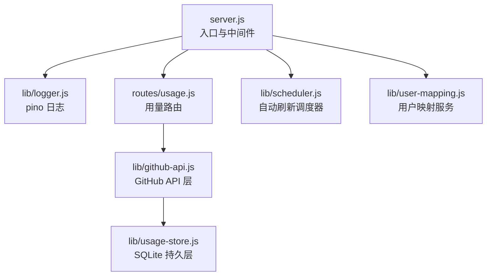
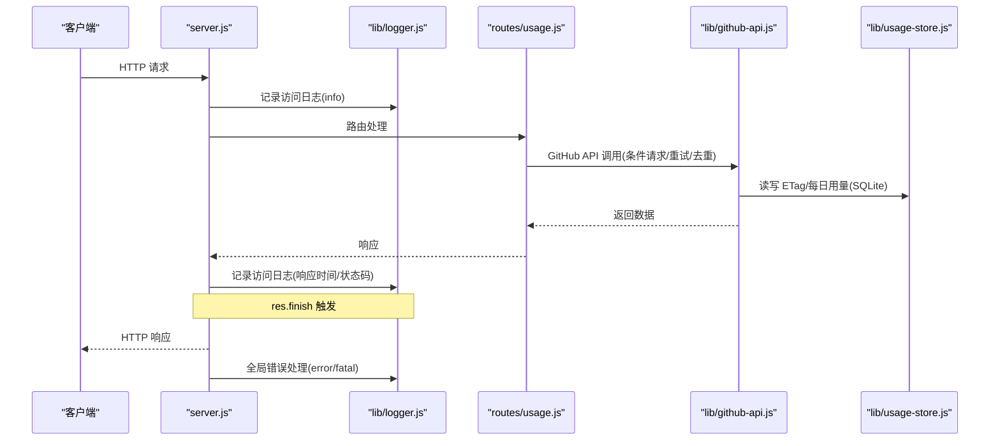
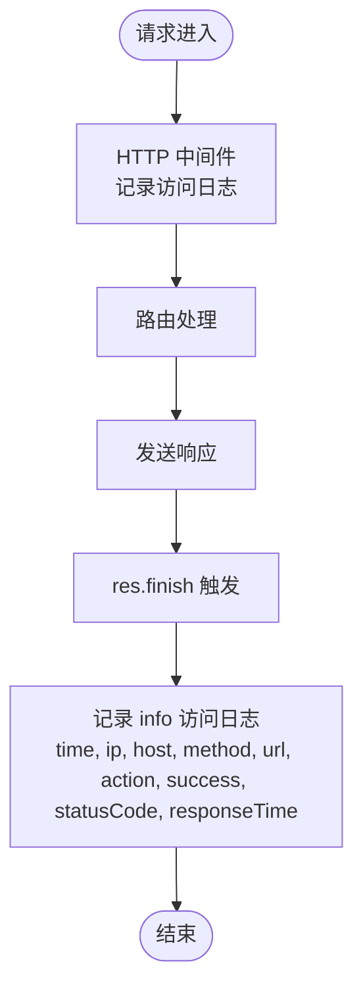
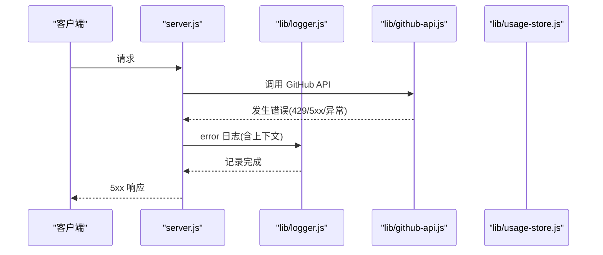
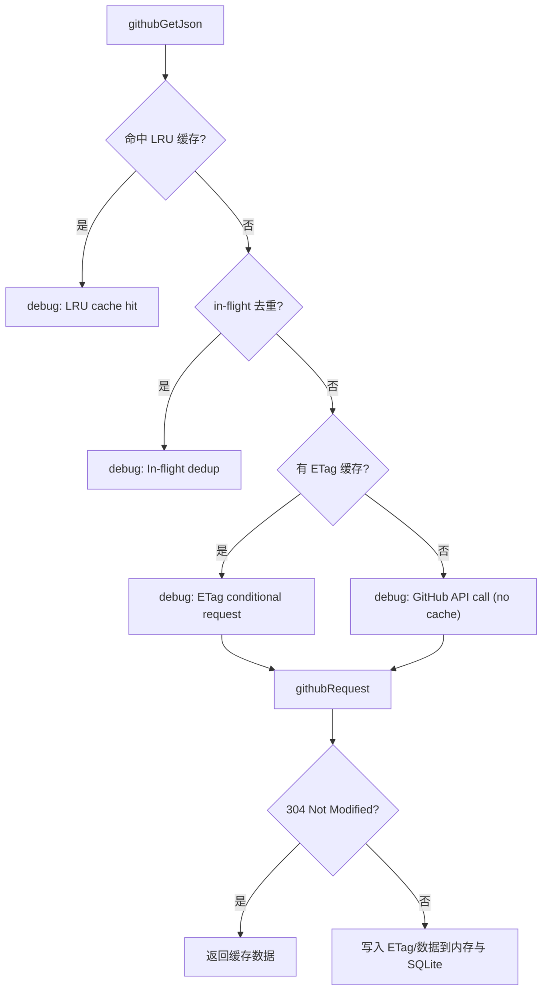
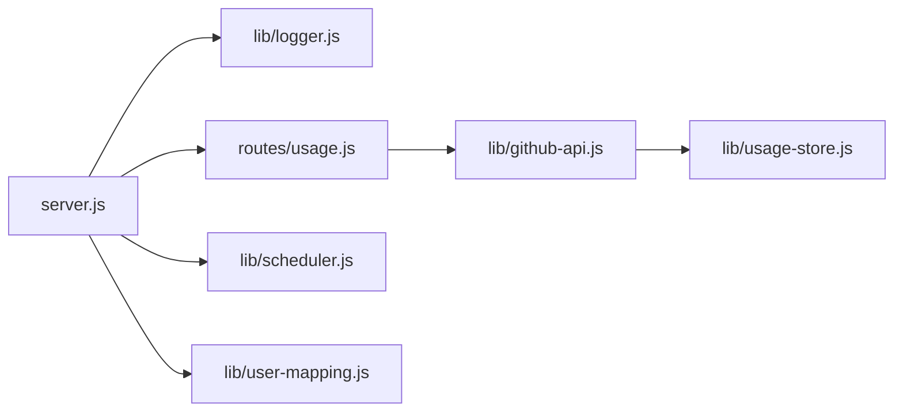

# 日志分析与调试

<cite>
**本文引用的文件**
- [lib/logger.js](file://lib/logger.js)
- [server.js](file://server.js)
- [lib/github-api.js](file://lib/github-api.js)
- [lib/usage-store.js](file://lib/usage-store.js)
- [routes/usage.js](file://routes/usage.js)
- [lib/scheduler.js](file://lib/scheduler.js)
- [lib/user-mapping.js](file://lib/user-mapping.js)
- [package.json](file://package.json)
- [README.md](file://README.md)
</cite>

## 目录
1. [简介](#简介)
2. [项目结构](#项目结构)
3. [核心组件](#核心组件)
4. [架构总览](#架构总览)
5. [详细组件分析](#详细组件分析)
6. [依赖关系分析](#依赖关系分析)
7. [性能考量](#性能考量)
8. [故障排查指南](#故障排查指南)
9. [结论](#结论)
10. [附录](#附录)

## 简介
本指南面向 CopilotEnterpriseUsageDisplay 的运维与开发人员，系统讲解基于 pino 的结构化日志体系，涵盖日志级别、字段含义、访问日志分析、错误诊断、缓存与 ETag 条件请求日志、性能监控与调试配置，以及日志轮转与远程收集的最佳实践。文档以仓库现有实现为依据，提供可操作的分析方法与排障流程。

## 项目结构
- 入口与中间件：Express 应用在入口文件中挂载访问日志中间件、全局错误处理、健康检查与优雅关闭。
- 日志系统：集中于 lib/logger.js，使用 pino，开发模式彩色 pretty 输出，生产模式 JSON 输出，并内置敏感信息脱敏与自定义序列化器。
- 缓存与 API 层：lib/github-api.js 对 GitHub API 进行并发控制、重试退避、LRU 缓存、ETag 条件请求与 in-flight 去重，并输出丰富的 debug/warn/info 日志。
- 数据持久层：lib/usage-store.js 通过 SQLite 存储每日用量、ETag、账单等，关键操作输出 info/warn 日志。
- 路由与刷新：routes/usage.js 提供用量查询与刷新接口，内部集成内存/SQLite 缓存与 per-user fallback，并记录缓存命中/回源等日志。
- 调度器：lib/scheduler.js 定时自动刷新，输出 info/warn/error 日志。
- 用户映射：lib/user-mapping.js 在文件加载与变更时输出 info/warn/error 日志。
- 环境变量与依赖：package.json 与 README 描述了日志相关环境变量与功能。

**图表来源**
- [server.js:16-38](file://server.js#L16-L38)
- [lib/logger.js:13-38](file://lib/logger.js#L13-L38)
- [lib/github-api.js:1-320](file://lib/github-api.js#L1-L320)
- [lib/usage-store.js:1-324](file://lib/usage-store.js#L1-L324)
- [routes/usage.js:1-470](file://routes/usage.js#L1-L470)
- [lib/scheduler.js](file://lib/scheduler.js)
- [lib/user-mapping.js](file://lib/user-mapping.js)

**章节来源**
- [server.js:16-38](file://server.js#L16-L38)
- [lib/logger.js:13-38](file://lib/logger.js#L13-L38)
- [README.md:516-556](file://README.md#L516-L556)

## 核心组件
- pino 结构化日志：统一的日志入口，支持多级别输出、敏感信息脱敏、自定义序列化器、开发/生产差异化传输。
- 访问日志中间件：在 res.finish 事件中记录时间、来源、方法、URL、动作、成功与否、状态码、响应时间。
- GitHub API 层：并发队列、重试退避、LRU 缓存、ETag 条件请求、in-flight 去重，输出 debug/warn/info。
- SQLite 持久层：ETag、每日用量、账单等表，关键操作输出 info/warn。
- 调度器：定时刷新与失败日志。
- 全局错误处理：捕获未捕获异常与未处理拒绝，输出 error/fatal。

**章节来源**
- [lib/logger.js:13-38](file://lib/logger.js#L13-L38)
- [server.js:16-38](file://server.js#L16-L38)
- [lib/github-api.js:170-227](file://lib/github-api.js#L170-L227)
- [lib/usage-store.js:232-238](file://lib/usage-store.js#L232-L238)
- [lib/scheduler.js](file://lib/scheduler.js)
- [server.js:120-139](file://server.js#L120-L139)

## 架构总览
下图展示了访问日志、错误日志与缓存/ETag 日志在系统中的位置与交互。

**图表来源**
- [server.js:16-38](file://server.js#L16-L38)
- [server.js:120-139](file://server.js#L120-L139)
- [lib/github-api.js:170-227](file://lib/github-api.js#L170-L227)
- [lib/usage-store.js:242-278](file://lib/usage-store.js#L242-L278)
- [routes/usage.js:387-462](file://routes/usage.js#L387-L462)

## 详细组件分析

### pino 日志系统与级别策略
- 级别策略（来自实现注释与 README）：
  - trace：完整请求/响应体、SQL、原始 GitHub API 响应（需设置 LOG_LEVEL=trace）
  - debug：缓存命中/未命中、ETag 条件请求、in-flight 去重、重试次数
  - info：HTTP 访问日志（默认生产级别）
  - warn：速率限制接近阈值、重试等待、非关键性恢复
  - error：未捕获异常、GitHub API 失败、数据库错误、堆栈追踪
- 开发/生产差异：
  - 开发模式：pino-pretty 彩色输出，便于本地阅读
  - 生产模式：JSON 输出，利于日志收集与检索
- 敏感信息脱敏：自动遮蔽 authorization、token、password、secret 等字段
- 自定义序列化器：请求日志提取 remoteAddress、remoteHostname、userAgent；错误日志捕获堆栈

**章节来源**
- [lib/logger.js:5-12](file://lib/logger.js#L5-L12)
- [lib/logger.js:13-38](file://lib/logger.js#L13-L38)
- [README.md:527-542](file://README.md#L527-L542)

### 访问日志分析
- 记录时机：在 res.finish 事件中记录一次访问日志，包含时间、来源、方法、URL、动作、成功与否、状态码、响应时间。
- 动作映射：将 URL 与方法映射为语义化动作标签，便于聚合分析。
- 分析要点：
  - 响应时间分布：识别慢请求与异常波动
  - 状态码分布：快速定位 5xx、4xx 异常
  - 动作维度：区分 refresh_usage、get_seats、health_check 等关键路径
  - 来源维度：IP/主机名可用于识别来源与异常来源

**图表来源**
- [server.js:16-38](file://server.js#L16-L38)

**章节来源**
- [server.js:16-38](file://server.js#L16-L38)
- [server.js:54-86](file://server.js#L54-L86)
- [README.md:516-556](file://README.md#L516-L556)

### 错误日志与诊断流程
- 全局错误处理：捕获未捕获异常与未处理拒绝，输出 error/fatal，并记录访问上下文（IP、主机名、动作、状态码）。
- 诊断步骤：
  1. 定位错误：根据 error/fatal 日志中的时间、动作、状态码与堆栈
  2. 上下文提取：从日志中提取 remoteAddress、remoteHostname、method、url、action
  3. 根因分析：结合 GitHub API 层日志（重试、速率限制）、SQLite 操作日志（ETag/账单写入）与路由刷新日志（缓存命中/回源）
  4. 复现验证：在相同动作与参数下复现问题，观察日志链路

**图表来源**
- [server.js:120-139](file://server.js#L120-L139)
- [lib/github-api.js:170-227](file://lib/github-api.js#L170-L227)

**章节来源**
- [server.js:120-139](file://server.js#L120-L139)
- [lib/github-api.js:170-227](file://lib/github-api.js#L170-L227)

### 缓存与 ETag 条件请求日志
- LRU 缓存命中/未命中：在 githubGetJson 中记录 debug 日志，包含 pathname 与 key
- ETag 条件请求：命中缓存时记录 debug，包含 etag；无缓存时记录 debug 提示无缓存
- in-flight 去重：当同一 key 正在请求时记录 debug
- SQLite ETag 恢复与持久化：启动时从 SQLite 恢复 ETag，记录 info；每次 GET 200 写入 ETag，记录 info
- 路由刷新缓存：内存 refreshCache、SQLite 缓存命中/回源、per-user fallback 失败等均有 debug/info 日志

**图表来源**
- [lib/github-api.js:231-269](file://lib/github-api.js#L231-L269)
- [lib/github-api.js:67-74](file://lib/github-api.js#L67-L74)
- [lib/usage-store.js:242-278](file://lib/usage-store.js#L242-L278)

**章节来源**
- [lib/github-api.js:231-269](file://lib/github-api.js#L231-L269)
- [lib/github-api.js:67-74](file://lib/github-api.js#L67-L74)
- [lib/usage-store.js:242-278](file://lib/usage-store.js#L242-L278)
- [routes/usage.js:237-348](file://routes/usage.js#L237-L348)

### 性能监控日志
- 响应时间分析：访问日志包含 responseTime，可用于计算 P50/P90/P99
- 并发请求监控：GitHub API 层的并发队列与 in-flight 去重日志，有助于评估并发压力
- 资源使用：健康检查端点返回内存占用与运行时长，可结合日志进行关联分析

**章节来源**
- [server.js:16-38](file://server.js#L16-L38)
- [lib/github-api.js:29-48](file://lib/github-api.js#L29-L48)
- [server.js:100-108](file://server.js#L100-L108)

### 调试环境配置
- LOG_LEVEL：开发环境默认 debug，生产环境默认 info；可通过环境变量覆盖
- 开发工具：pino-pretty 彩色输出，便于本地快速定位问题
- 详细日志输出：设置 LOG_LEVEL=trace 可获取完整请求/响应体、SQL、原始 GitHub API 响应

**章节来源**
- [lib/logger.js:3,14](file://lib/logger.js#L3,L14)
- [README.md:537-542](file://README.md#L537-L542)

## 依赖关系分析
- server.js 依赖 lib/logger.js 输出访问与错误日志
- routes/usage.js 依赖 lib/github-api.js 与 lib/usage-store.js，内部产生缓存/刷新日志
- lib/github-api.js 依赖 lib/usage-store.js 持久化 ETag
- lib/scheduler.js 与 lib/user-mapping.js 产出 info/warn/error 日志

**图表来源**
- [server.js:1-182](file://server.js#L1-L182)
- [routes/usage.js:1-470](file://routes/usage.js#L1-L470)
- [lib/github-api.js:1-320](file://lib/github-api.js#L1-L320)
- [lib/usage-store.js:1-324](file://lib/usage-store.js#L1-L324)
- [lib/scheduler.js](file://lib/scheduler.js)
- [lib/user-mapping.js](file://lib/user-mapping.js)

**章节来源**
- [server.js:1-182](file://server.js#L1-L182)
- [routes/usage.js:1-470](file://routes/usage.js#L1-L470)
- [lib/github-api.js:1-320](file://lib/github-api.js#L1-L320)
- [lib/usage-store.js:1-324](file://lib/usage-store.js#L1-L324)

## 性能考量
- 访问日志开销：info 级别访问日志为结构化 JSON，通常开销较小；trace 级别会记录完整请求/响应体，建议仅在定位复杂问题时启用。
- GitHub API 日志：debug/warn 日志有助于定位重试与限流问题，但高频重试会放大日志体量，建议在生产环境关注 warn 与 error。
- SQLite 日志：ETag/账单写入等 info/warn 日志对性能影响极低，但建议定期清理过期数据以维持数据库健康。

[本节为通用指导，无需特定文件来源]

## 故障排查指南

### 1) 访问日志分析
- 快速定位：筛选目标动作（如 refresh_usage、get_seats、health_check），观察响应时间与状态码分布
- 异常定位：关注 5xx/4xx 比例异常的时间窗口，结合错误日志定位根因

**章节来源**
- [server.js:16-38](file://server.js#L16-L38)
- [server.js:54-86](file://server.js#L54-L86)

### 2) 错误日志诊断流程
- 步骤一：在 error/fatal 日志中提取时间、动作、状态码、堆栈
- 步骤二：在 GitHub API 层日志中查找重试、速率限制、5xx 等线索
- 步骤三：在 SQLite 层日志中确认 ETag/账单写入是否异常
- 步骤四：在路由刷新日志中核对缓存命中/回源与 per-user fallback 是否正常

**章节来源**
- [server.js:120-139](file://server.js#L120-L139)
- [lib/github-api.js:170-227](file://lib/github-api.js#L170-L227)
- [lib/usage-store.js:242-278](file://lib/usage-store.js#L242-L278)
- [routes/usage.js:237-348](file://routes/usage.js#L237-L348)

### 3) 缓存与 ETag 日志解读
- LRU 命中：debug 日志包含 pathname 与 key，用于核对缓存键构建是否正确
- 条件请求：debug 日志包含 etag，用于确认是否命中 304
- 去重：debug 日志包含 key，用于确认 in-flight 去重是否生效
- ETag 恢复：info 日志包含数量，用于确认重启后缓存恢复是否完整

**章节来源**
- [lib/github-api.js:231-269](file://lib/github-api.js#L231-L269)
- [lib/github-api.js:67-74](file://lib/github-api.js#L67-L74)

### 4) 性能监控与资源使用
- 响应时间：通过访问日志的 responseTime 计算 P50/P90/P99，识别慢请求
- 并发压力：关注 GitHub API 层的重试与 warn 日志，评估并发队列与 in-flight 去重效果
- 资源使用：健康检查端点返回内存占用与运行时长，结合日志进行关联分析

**章节来源**
- [server.js:16-38](file://server.js#L16-L38)
- [lib/github-api.js:29-48](file://lib/github-api.js#L29-L48)
- [server.js:100-108](file://server.js#L100-L108)

### 5) 调试环境配置
- LOG_LEVEL：开发环境默认 debug，生产环境默认 info；必要时设置 LOG_LEVEL=trace
- 开发工具：pino-pretty 彩色输出，便于本地快速定位
- 详细日志：仅在定位复杂问题时启用 trace，避免日志体量过大

**章节来源**
- [lib/logger.js:3,14](file://lib/logger.js#L3,L14)
- [README.md:537-542](file://README.md#L537-L542)

### 6) 日志轮转、存储与远程收集最佳实践
- 日志轮转：建议使用 systemd/journald 或 logrotate 对 stdout/stderr 进行轮转
- 存储：生产环境建议将 JSON 日志写入文件并定期归档
- 远程收集：通过 journald/fluent-bit/logstash 等工具采集，结合结构化字段进行检索与告警

[本节为通用指导，无需特定文件来源]

## 结论
本项目采用 pino 结构化日志，覆盖访问、缓存、错误、调度与用户映射等关键路径，提供了完善的日志分析与调试能力。通过合理设置 LOG_LEVEL、利用访问日志与缓存日志、结合错误日志与健康检查指标，可以高效定位性能瓶颈与异常根因，并建立可靠的日志轮转与远程收集体系。

[本节为总结，无需特定文件来源]

## 附录

### A. 日志字段说明（来自实现）
- 访问日志字段：time、remoteAddress、remoteHostname、method、url、action、success、statusCode、responseTime
- 错误日志字段：err.message、err.stack、time、remoteAddress、remoteHostname、method、url、action、success、statusCode
- GitHub API 日志字段：method、pathname、status、attempt、waitMs、remaining、etag、key、pathname
- SQLite 日志字段：count、removed、err.message、year、month、haveDays、expectedDays、missingDate、fetched_at、mode、raw_count、items

**章节来源**
- [server.js:24-34](file://server.js#L24-L34)
- [server.js:122-135](file://server.js#L122-L135)
- [lib/github-api.js:207-210](file://lib/github-api.js#L207-L210)
- [lib/github-api.js:238-256](file://lib/github-api.js#L238-L256)
- [lib/usage-store.js:73](file://lib/usage-store.js#L73)
- [lib/usage-store.js:232-238](file://lib/usage-store.js#L232-L238)
- [routes/usage.js:157-161](file://routes/usage.js#L157-L161)
- [routes/usage.js:174-198](file://routes/usage.js#L174-L198)
- [routes/usage.js:293](file://routes/usage.js#L293)

### B. 环境变量与日志相关
- LOG_LEVEL：控制日志级别（trace/debug/info/warn/error）
- NODE_ENV：决定开发/生产模式（开发模式启用 pino-pretty）

**章节来源**
- [lib/logger.js:3,14](file://lib/logger.js#L3,L14)
- [README.md:537-542](file://README.md#L537-L542)