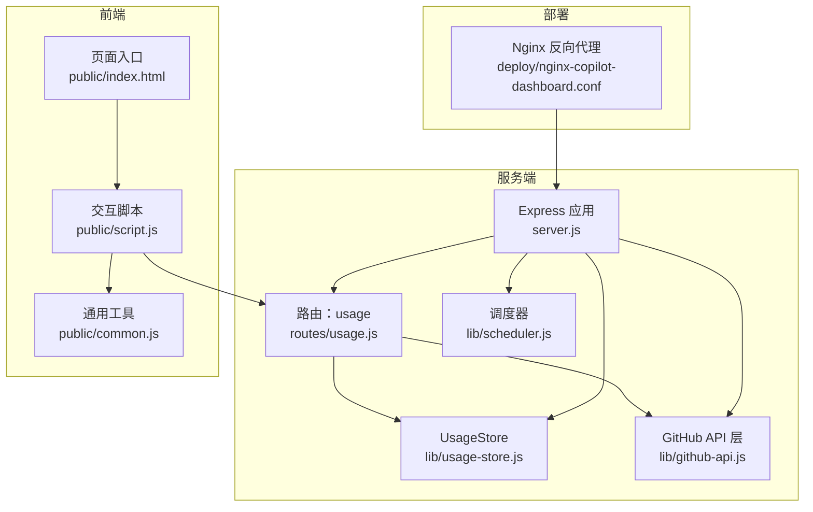
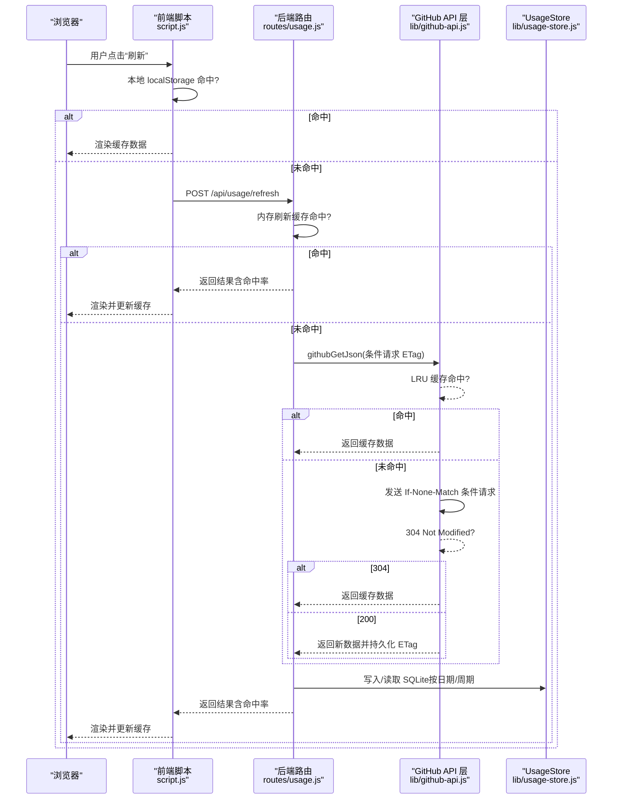
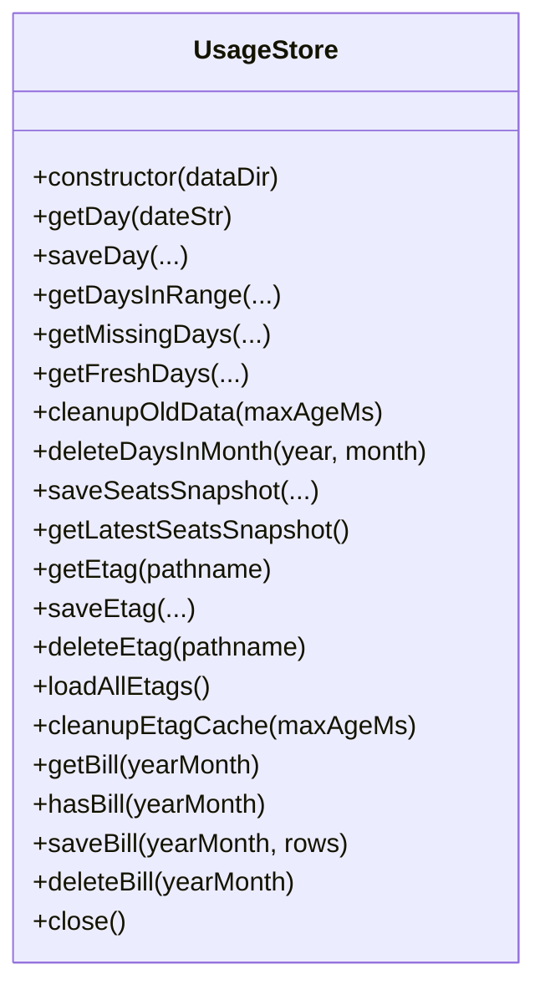
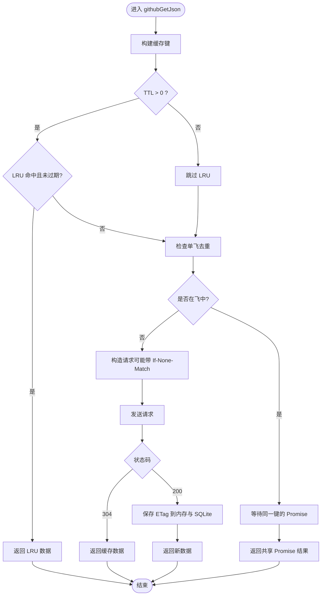
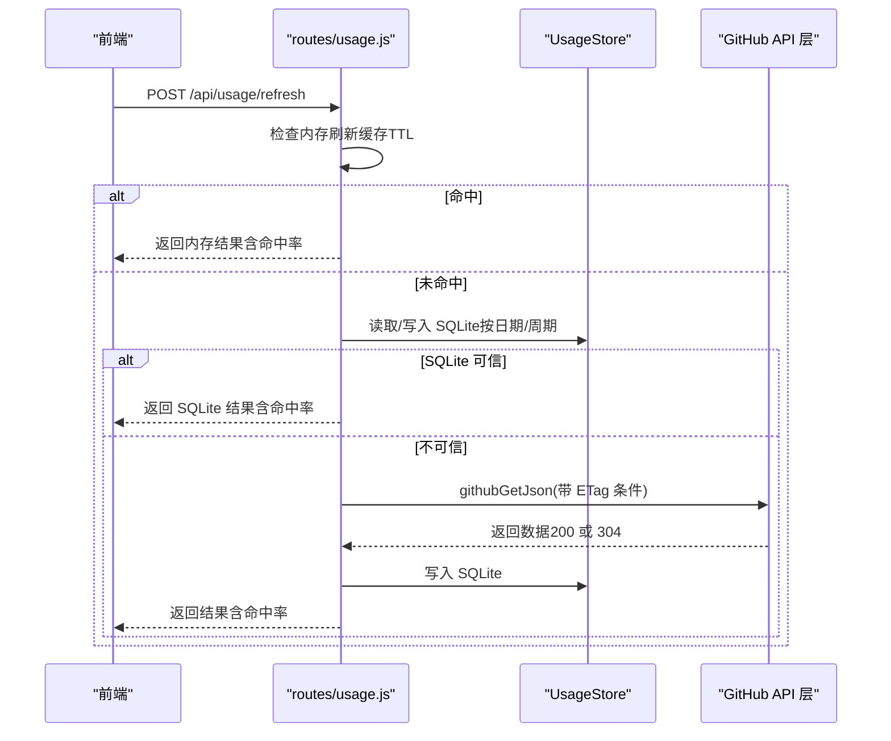
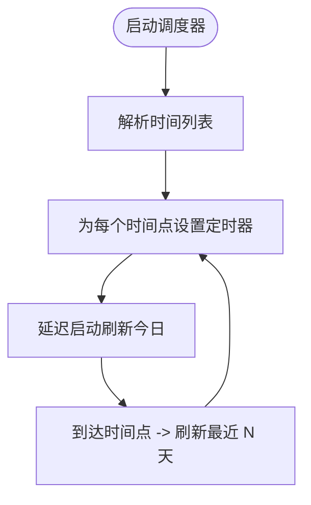
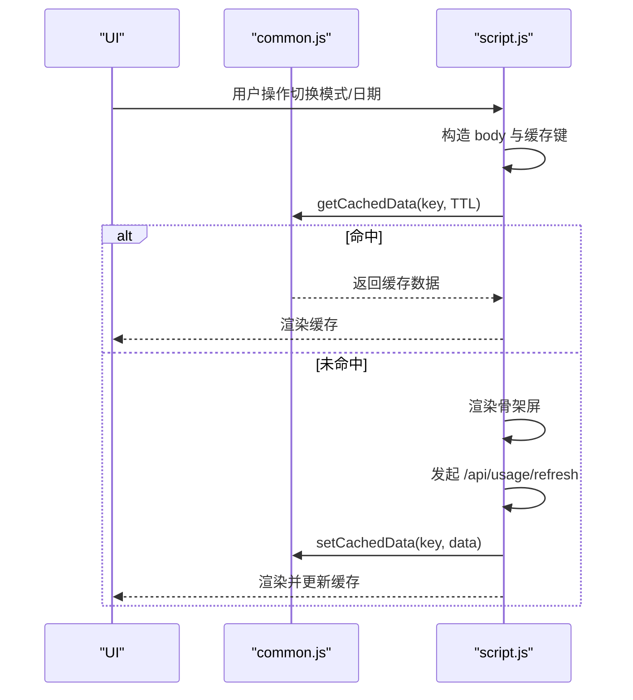
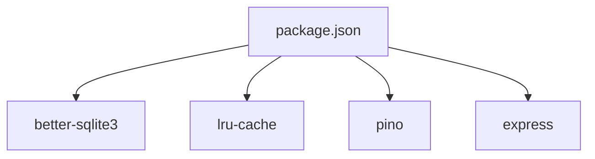

# 缓存与性能问题

<cite>
**本文引用的文件**   
- [server.js](file://server.js)
- [usage-store.js](file://lib/usage-store.js)
- [github-api.js](file://lib/github-api.js)
- [usage.js](file://routes/usage.js)
- [scheduler.js](file://lib/scheduler.js)
- [index.html](file://public/index.html)
- [script.js](file://public/script.js)
- [common.js](file://public/common.js)
- [nginx-copilot-dashboard.conf](file://deploy/nginx-copilot-dashboard.conf)
- [package.json](file://package.json)
</cite>

## 目录
1. [简介](#简介)
2. [项目结构](#项目结构)
3. [核心组件](#核心组件)
4. [架构总览](#架构总览)
5. [详细组件分析](#详细组件分析)
6. [依赖关系分析](#依赖关系分析)
7. [性能考量](#性能考量)
8. [故障排除指南](#故障排除指南)
9. [结论](#结论)
10. [附录](#附录)

## 简介
本指南聚焦于 CopilotEnterpriseUsageDisplay 的三层缓存与性能问题排查，覆盖以下方面：
- 三层缓存架构：内存缓存（进程内 LRU、内存 Map）、SQLite 持久缓存、ETag 条件请求
- 缓存命中率异常分析：统计解读、下降原因与优化策略
- 数据库性能诊断：SQLite 查询优化、索引使用与存储空间监控
- 前端缓存策略故障排除：浏览器本地缓存、SWR 策略与数据新鲜度
- 内存泄漏与资源占用异常检测：进程监控、内存分析与瓶颈定位
- 缓存一致性修复与预防：跨层失效与一致性保障

## 项目结构
项目采用“服务端 + 前端静态资源”的结构，服务端通过 Express 提供 API，前端通过静态文件提供 SPA 页面与交互逻辑。

图表来源
- [server.js:1-182](file://server.js#L1-L182)
- [usage-store.js:1-324](file://lib/usage-store.js#L1-L324)
- [github-api.js:1-320](file://lib/github-api.js#L1-L320)
- [usage.js:1-470](file://routes/usage.js#L1-L470)
- [scheduler.js:1-160](file://lib/scheduler.js#L1-L160)
- [index.html:1-103](file://public/index.html#L1-L103)
- [script.js:1-541](file://public/script.js#L1-L541)
- [common.js:1-113](file://public/common.js#L1-L113)
- [nginx-copilot-dashboard.conf:1-14](file://deploy/nginx-copilot-dashboard.conf#L1-L14)

章节来源
- [server.js:1-182](file://server.js#L1-L182)
- [package.json:1-26](file://package.json#L1-L26)

## 核心组件
- 服务端应用与中间件：HTTP 访问日志、全局错误处理、健康检查、优雅停机
- UsageStore：SQLite 数据访问层，负责 daily_usage、seats_snapshot、etag_cache、monthly_bill 表的读写与清理
- GitHub API 层：并发队列、重试退避、LRU GET 缓存、ETag 条件请求、单飞去重
- Usage 路由：内存刷新缓存、SQLite 周期聚合校验、GitHub API 回源、缓存命中率统计
- 调度器：每日定时刷新最近 N 天数据，绕过 TTL 强制回源
- 前端：localStorage 缓存、SWR 策略、自动刷新、数据新鲜度展示

章节来源
- [server.js:16-182](file://server.js#L16-L182)
- [usage-store.js:10-324](file://lib/usage-store.js#L10-L324)
- [github-api.js:23-320](file://lib/github-api.js#L23-L320)
- [usage.js:13-470](file://routes/usage.js#L13-L470)
- [scheduler.js:54-160](file://lib/scheduler.js#L54-L160)
- [script.js:296-326](file://public/script.js#L296-L326)
- [common.js:82-96](file://public/common.js#L82-L96)

## 架构总览
三层缓存与请求路径如下：

图表来源
- [script.js:296-326](file://public/script.js#L296-L326)
- [usage.js:237-348](file://routes/usage.js#L237-L348)
- [github-api.js:231-289](file://lib/github-api.js#L231-L289)
- [usage-store.js:241-278](file://lib/usage-store.js#L241-L278)

## 详细组件分析

### 组件一：UsageStore（SQLite 持久缓存）
- 表结构与索引
  - daily_usage：按日期主键，包含年月日、原始数据、模式、原始计数、来源、抓取时间、排名等字段；索引 idx_daily_usage_date
  - seats_snapshot：席位快照表，按 fetched_at 倒序；索引 idx_seats_snapshot_fetched
  - etag_cache：按 pathname 主键，保存 etag、数据与抓取时间；索引 idx_etag_cache_fetched
  - monthly_bill：账单表，复合主键（年月、登录），索引 idx_monthly_bill_ym
- 关键能力
  - 按日期/范围读取、缺失日期计算、新鲜度判断、清理过期数据
  - ETag 缓存的读取、保存、批量加载与清理
  - 席位快照上限控制，避免无限增长
- 性能要点
  - WAL 模式 + NORMAL 同步提升并发读写
  - 合理索引覆盖常见查询路径
  - 定期清理过期数据，控制表规模

图表来源
- [usage-store.js:10-324](file://lib/usage-store.js#L10-L324)

章节来源
- [usage-store.js:24-79](file://lib/usage-store.js#L24-L79)
- [usage-store.js:83-129](file://lib/usage-store.js#L83-L129)
- [usage-store.js:137-198](file://lib/usage-store.js#L137-L198)
- [usage-store.js:211-239](file://lib/usage-store.js#L211-L239)
- [usage-store.js:243-278](file://lib/usage-store.js#L243-L278)
- [usage-store.js:282-320](file://lib/usage-store.js#L282-L320)

### 组件二：GitHub API 层（LRU + ETag + 单飞去重）
- 并发控制：最大并发、排队释放
- LRU GET 缓存：按路径 TTL 管理，配合单飞去重 Map 避免重复请求
- ETag 条件请求：内存镜像 etagCache（与 SQLite etag_cache 同步），304 时返回缓存数据
- 重试与退避：指数退避 + retry-after + 速率限制恢复时间
- TTL 规则：针对不同路径设置不同 TTL，近期数据更短 TTL

图表来源
- [github-api.js:231-289](file://lib/github-api.js#L231-L289)
- [github-api.js:108-168](file://lib/github-api.js#L108-L168)
- [github-api.js:67-74](file://lib/github-api.js#L67-L74)
- [usage-store.js:262-273](file://lib/usage-store.js#L262-L273)

章节来源
- [github-api.js:25-48](file://lib/github-api.js#L25-L48)
- [github-api.js:59-65](file://lib/github-api.js#L59-L65)
- [github-api.js:172-227](file://lib/github-api.js#L172-L227)
- [github-api.js:231-289](file://lib/github-api.js#L231-L289)
- [github-api.js:67-74](file://lib/github-api.js#L67-L74)

### 组件三：Usage 路由（内存刷新缓存 + 周期聚合校验）
- 内存刷新缓存：按日期/范围的 Map 缓存，结合 TTL 控制
- 单次请求去重：Map 存储进行中的 Promise，避免重复拉取
- SQLite 周期聚合校验：构建周期排名前，检查覆盖度、新鲜度与非空性，不满足则回源 GitHub
- GitHub 回源：聚合用户维度或直接回源，必要时触发 per-user fallback
- 命中率统计：对批量请求统计缓存命中比例，返回给前端

图表来源
- [usage.js:237-348](file://routes/usage.js#L237-L348)
- [usage-store.js:137-198](file://lib/usage-store.js#L137-L198)
- [github-api.js:231-289](file://lib/github-api.js#L231-L289)

章节来源
- [usage.js:16-25](file://routes/usage.js#L16-L25)
- [usage.js:134-235](file://routes/usage.js#L134-L235)
- [usage.js:237-348](file://routes/usage.js#L237-L348)

### 组件四：调度器（每日定时刷新）
- 启动时刷新今日数据，随后在指定本地时间点刷新最近 N 天
- 强制刷新：绕过内存与 SQLite TTL，直接回源 GitHub
- 多实例安全：可通过环境变量禁用

图表来源
- [scheduler.js:54-160](file://lib/scheduler.js#L54-L160)

章节来源
- [scheduler.js:54-160](file://lib/scheduler.js#L54-L160)

### 组件五：前端缓存策略（localStorage + SWR）
- localStorage 缓存：键由查询参数哈希生成，带 TTL 校验
- SWR 策略：首次渲染优先使用缓存，后台发起刷新，更新缓存并渲染
- 自动刷新：可选 60/180/300 秒轮询
- 新鲜度展示：后端返回命中率，前端追加到元信息

图表来源
- [script.js:296-326](file://public/script.js#L296-L326)
- [common.js:82-96](file://public/common.js#L82-L96)

章节来源
- [script.js:296-326](file://public/script.js#L296-L326)
- [common.js:82-96](file://public/common.js#L82-L96)

## 依赖关系分析
- 服务端依赖
  - better-sqlite3：SQLite 访问
  - lru-cache：LRU 缓存
  - pino：结构化日志
  - express：Web 服务器
- 前端依赖
  - 通过静态资源引入，无包管理器依赖

图表来源
- [package.json:12-21](file://package.json#L12-L21)

章节来源
- [package.json:12-21](file://package.json#L12-L21)

## 性能考量
- 缓存分层收益
  - 内存缓存：极低延迟，适合高频短期访问
  - SQLite：持久化与跨进程共享，支持周期聚合与历史回溯
  - ETag：减少网络往返与 GitHub API 费用，降低速率限制风险
- 查询与索引
  - 日期范围查询依赖 idx_daily_usage_date
  - 最近 N 天聚合依赖 fetched_at 索引
  - 建议定期执行 VACUUM 与 ANALYZE（如需要）以保持统计信息准确
- 并发与吞吐
  - GitHub 并发与重试策略平衡了稳定性与吞吐
  - Express 默认并发受 Node.js 事件循环影响，建议通过反向代理与多实例扩展

[本节为通用指导，无需特定文件来源]

## 故障排除指南

### 三层缓存架构故障诊断
- 内存缓存（进程内 LRU/Map）
  - 现象：频繁回源、命中率低
  - 排查：开启 debug 日志观察 LRU 命中/未命中、单飞去重命中；检查 TTL 是否过短导致抖动
  - 修复：适当提高 TTL、扩大 LRU 容量、合并相似请求
- SQLite 持久缓存
  - 现象：周期聚合失败、数据缺失、新鲜度不足
  - 排查：确认 fetched_at 是否在近期窗口内、ranking 是否为空、覆盖天数是否完整
  - 修复：触发强制刷新、清理过期数据、检查索引是否存在
- ETag 条件请求
  - 现象：304 频繁但数据未更新、ETag 不一致
  - 排查：确认内存 etagCache 与 SQLite etag_cache 是否同步；检查 pathname 键是否稳定
  - 修复：重启后恢复持久化 ETag；确保查询参数排序一致；必要时清理过期 ETag

章节来源
- [github-api.js:59-65](file://lib/github-api.js#L59-L65)
- [github-api.js:231-289](file://lib/github-api.js#L231-L289)
- [usage-store.js:241-278](file://lib/usage-store.js#L241-L278)
- [server.js:50-51](file://server.js#L50-L51)

### 缓存命中率异常分析
- 统计解读
  - 前端返回的 cacheHitRatio = 已缓存天数 / 总查询天数 × 100%
  - 后端 debug 日志包含“Refresh cache hit”“SQLite cache hit”“ETag conditional request”等标记
- 下降原因
  - TTL 过短：近期数据频繁过期
  - 内存/SQLite 缓存容量不足：LRU 淘汰或 SQLite 清理
  - 查询参数不稳定：键不一致导致缓存碎片化
  - GitHub 速率限制：触发重试与退避，影响吞吐
- 优化策略
  - 合理设置 CACHE_TTL（前端）与路径 TTL（后端）
  - 扩大 LRU 容量、增加 SQLite 索引覆盖
  - 规范查询参数顺序与键生成
  - 调整 GitHub 并发与重试参数

章节来源
- [usage.js:457-458](file://routes/usage.js#L457-L458)
- [github-api.js:59-65](file://lib/github-api.js#L59-L65)
- [github-api.js:88-98](file://lib/github-api.js#L88-L98)
- [usage.js:237-251](file://routes/usage.js#L237-L251)

### 数据库性能问题诊断
- 查询优化
  - 使用 EXPLAIN QUERY PLAN 分析日期范围查询与排序
  - 确认 idx_daily_usage_date、idx_seats_snapshot_fetched、idx_etag_cache_fetched 是否被使用
- 索引使用情况
  - 若出现全表扫描，考虑添加复合索引或调整查询条件
- 存储空间监控
  - 定期检查 usage.db 文件大小
  - 清理过期数据（cleanupOldData、cleanupEtagCache、席位快照上限）

章节来源
- [usage-store.js:52-54](file://lib/usage-store.js#L52-L54)
- [usage-store.js:195-198](file://lib/usage-store.js#L195-L198)
- [usage-store.js:275-278](file://lib/usage-store.js#L275-L278)
- [usage-store.js:226-239](file://lib/usage-store.js#L226-L239)

### 前端缓存策略故障排除
- 浏览器缓存
  - 现象：页面刷新后数据未更新
  - 排查：检查 localStorage 中对应键是否存在、是否过期
  - 修复：清除过期缓存、调整 TTL、在刷新按钮旁提示“后台刷新中”
- SWR 策略
  - 现象：首次渲染慢、闪烁
  - 排查：确认骨架屏渲染逻辑与缓存命中分支
  - 修复：优化骨架屏数量与显示时机
- 数据新鲜度
  - 现象：显示“后台刷新中”，但长时间未更新
  - 排查：检查后端健康状态、GitHub API 速率限制、调度器运行状态
  - 修复：调整自动刷新间隔、检查网络连通性

章节来源
- [script.js:296-326](file://public/script.js#L296-L326)
- [common.js:82-96](file://public/common.js#L82-L96)
- [server.js:100-108](file://server.js#L100-L108)

### 内存泄漏与资源占用异常检测
- 进程监控
  - 使用 /api/health 查看内存占用（RSS MB）与运行时长
  - 观察日志中的内存指标变化趋势
- 内存分析
  - 采集堆快照，关注 LRU 缓存对象、Map 容器、Promise 队列
- 瓶颈定位
  - 结合访问日志与 debug 日志，定位高延迟请求链路
  - 检查 GitHub 并发与 SQLite 事务开销

章节来源
- [server.js:100-108](file://server.js#L100-L108)
- [github-api.js:25-48](file://lib/github-api.js#L25-L48)
- [usage-store.js:131-133](file://lib/usage-store.js#L131-L133)

### 缓存数据不一致的修复与预防
- 修复
  - 强制刷新：调用 /api/usage/refresh 并传入 force=true
  - 清理过期：清理 SQLite 与 ETag 缓存，触发重新抓取
- 预防
  - 严格键生成规则（查询参数排序、规范化）
  - 设置合理的 TTL 与近期窗口
  - 定期清理与监控，建立告警机制

章节来源
- [usage.js:273-277](file://routes/usage.js#L273-L277)
- [usage-store.js:195-198](file://lib/usage-store.js#L195-L198)
- [usage-store.js:275-278](file://lib/usage-store.js#L275-L278)

## 结论
本项目通过“内存缓存 + SQLite 持久缓存 + ETag 条件请求”的三层架构，在保证数据新鲜度的同时显著降低了 GitHub API 调用频率与成本。故障排查应围绕三层缓存的命中与一致性展开，并结合数据库索引、前端 SWR 策略与进程监控进行系统性诊断与优化。

[本节为总结，无需特定文件来源]

## 附录
- 部署与代理
  - Nginx 反向代理将 80 端口转发至本地 3000 端口
- 环境变量与配置
  - LOG_LEVEL、CACHE_TTL、GITHUB_MAX_CONCURRENT、GITHUB_MAX_RETRIES 等
- 健康检查
  - /api/health 返回运行时长、内存占用、时间戳等

章节来源
- [nginx-copilot-dashboard.conf:1-14](file://deploy/nginx-copilot-dashboard.conf#L1-L14)
- [server.js:100-108](file://server.js#L100-L108)