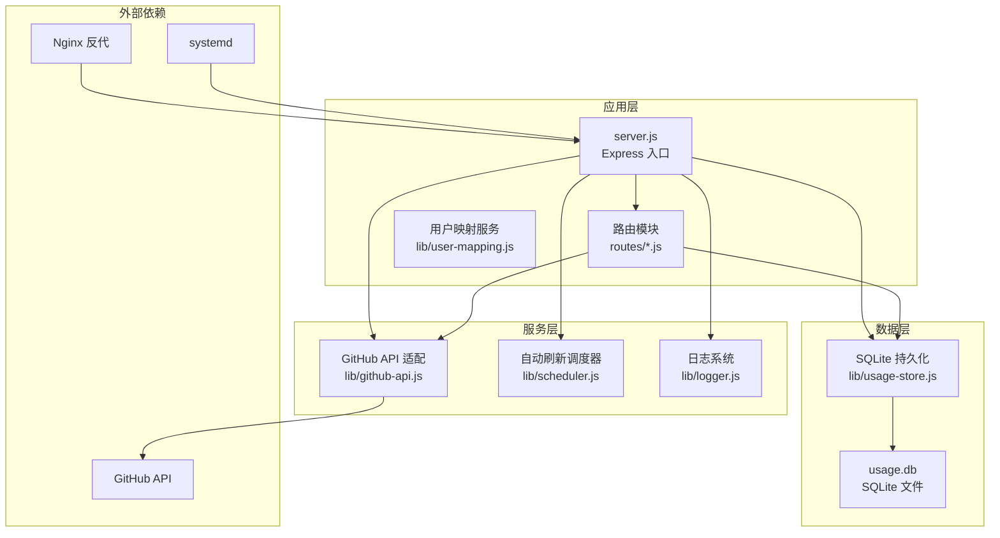
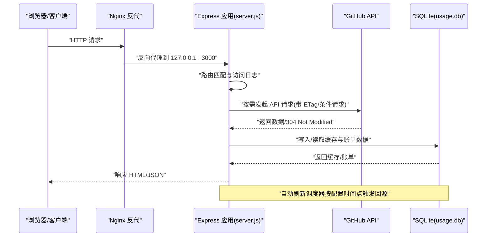
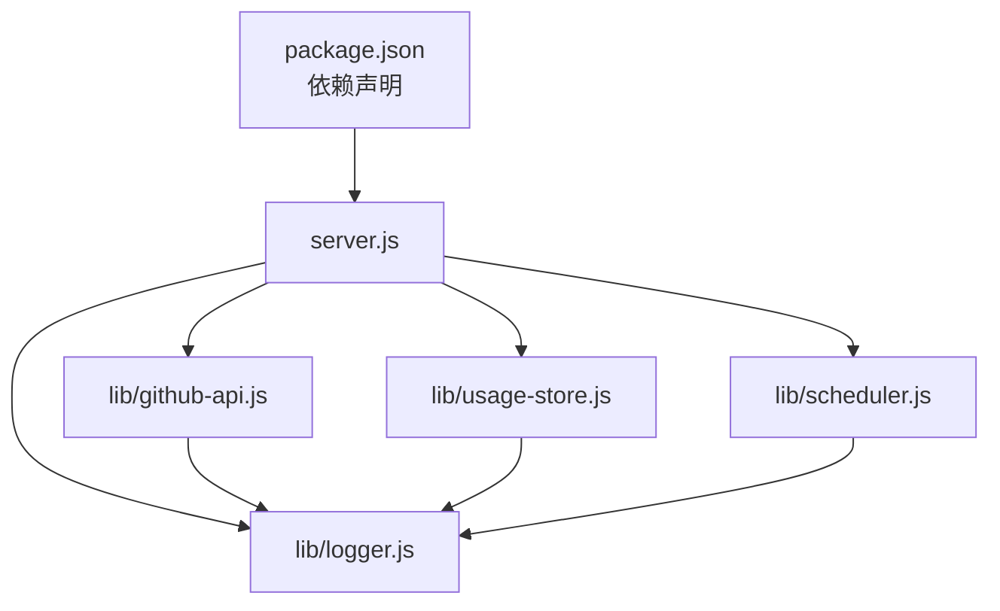
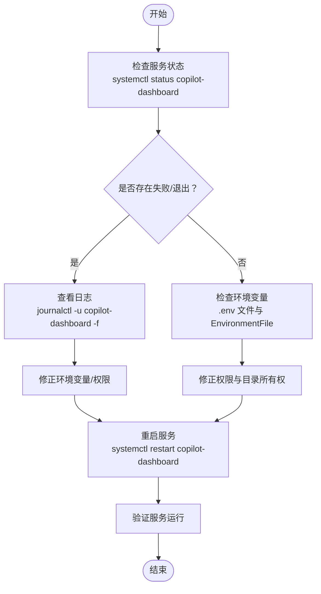
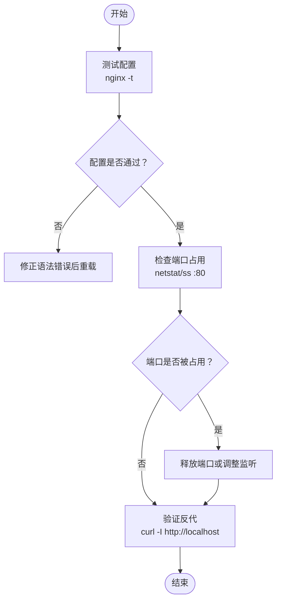

# 部署问题排查

<cite>
**本文引用的文件**
- [README.md](file://README.md)
- [package.json](file://package.json)
- [server.js](file://server.js)
- [lib/logger.js](file://lib/logger.js)
- [lib/github-api.js](file://lib/github-api.js)
- [lib/usage-store.js](file://lib/usage-store.js)
- [lib/scheduler.js](file://lib/scheduler.js)
- [.env.example](file://.env.example)
- [scripts/preflight-check.sh](file://scripts/preflight-check.sh)
- [scripts/preflight-check.js](file://scripts/preflight-check.js)
- [deploy/copilot-dashboard.service](file://deploy/copilot-dashboard.service)
- [deploy/nginx-copilot-dashboard.conf](file://deploy/nginx-copilot-dashboard.conf)
- [data/usage.db](file://data/usage.db)
</cite>

## 目录
1. [简介](#简介)
2. [项目结构](#项目结构)
3. [核心组件](#核心组件)
4. [架构概览](#架构概览)
5. [详细组件分析](#详细组件分析)
6. [依赖关系分析](#依赖关系分析)
7. [性能考虑](#性能考虑)
8. [故障排查指南](#故障排查指南)
9. [结论](#结论)
10. [附录](#附录)

## 简介
本指南面向 CopilotEnterpriseUsageDisplay 的运维与部署人员，聚焦生产环境部署与运行期间的常见问题与解决路径。内容涵盖：
- Node.js 版本与依赖要求
- 权限与环境变量配置
- 网络与 API 连通性检查
- systemd 服务与日志管理
- Nginx 反向代理配置与常见问题
- 文件权限与数据目录所有权
- 启动前自检脚本使用与输出解读
- 部署验证流程与故障定位步骤

## 项目结构
该项目采用模块化分层架构，后端以 Express 为核心，结合 SQLite 缓存、GitHub API 三层缓存与调度器，提供 Copilot 用量可视化与账单汇总能力。

图表来源
- [server.js:1-182](file://server.js#L1-L182)
- [lib/github-api.js:1-320](file://lib/github-api.js#L1-L320)
- [lib/usage-store.js:1-324](file://lib/usage-store.js#L1-L324)
- [lib/scheduler.js:1-160](file://lib/scheduler.js#L1-L160)
- [lib/logger.js:1-41](file://lib/logger.js#L1-L41)

章节来源
- [README.md:46-96](file://README.md#L46-L96)
- [package.json:1-26](file://package.json#L1-L26)

## 核心组件
- 应用入口与路由：负责挂载路由、健康检查、全局错误处理与优雅关闭。
- GitHub API 适配：封装并发队列、重试退避、ETag 条件请求、单次飞行去重与 LRU 缓存。
- SQLite 持久化：提供每日用量、席位快照、ETag 缓存与月度账单的存储与查询。
- 自动刷新调度器：按配置时间点自动回源刷新，缓解 GitHub Billing API 延迟影响。
- 日志系统：统一访问日志与错误日志，支持结构化输出与敏感信息脱敏。
- 启动前自检脚本：Shell 与 Node 两版，覆盖环境变量、DNS/网络、Token 有效性与关键 API 可达性。

章节来源
- [server.js:1-182](file://server.js#L1-L182)
- [lib/github-api.js:1-320](file://lib/github-api.js#L1-L320)
- [lib/usage-store.js:1-324](file://lib/usage-store.js#L1-L324)
- [lib/scheduler.js:1-160](file://lib/scheduler.js#L1-L160)
- [lib/logger.js:1-41](file://lib/logger.js#L1-L41)
- [scripts/preflight-check.sh:1-182](file://scripts/preflight-check.sh#L1-L182)
- [scripts/preflight-check.js:1-188](file://scripts/preflight-check.js#L1-L188)

## 架构概览
系统运行时的关键交互如下：

图表来源
- [server.js:100-144](file://server.js#L100-L144)
- [lib/github-api.js:108-168](file://lib/github-api.js#L108-L168)
- [lib/usage-store.js:24-79](file://lib/usage-store.js#L24-L79)
- [lib/scheduler.js:54-157](file://lib/scheduler.js#L54-L157)

## 详细组件分析

### systemd 服务配置与故障排除
- 服务单元文件位置与关键配置项：工作目录、用户、可执行命令、重启策略、环境文件、日志输出。
- 常见问题与排查：
  - 服务无法启动：检查 WorkingDirectory 是否存在、权限是否正确、Node.js 可执行路径是否可用。
  - 环境变量未生效：确认 EnvironmentFile 指向正确的 .env 路径且文件存在。
  - 自动重启频繁：查看 Restart=on-failure 与 RestartSec 配置，结合 journalctl 日志定位根本原因。
- 常用管理命令：
  - 启动/停止/重启：systemctl start/stop/restart copilot-dashboard
  - 查看状态：systemctl status copilot-dashboard
  - 实时日志：journalctl -u copilot-dashboard -f

章节来源
- [deploy/copilot-dashboard.service:1-18](file://deploy/copilot-dashboard.service#L1-L18)
- [README.md:434-449](file://README.md#L434-L449)

### Nginx 反向代理配置与诊断
- 配置要点：监听 80 端口、将请求转发至 127.0.0.1:3000、设置必要的头部信息。
- 常见问题与排查：
  - 端口冲突：确认 80 端口未被占用，或调整监听端口。
  - 配置语法错误：使用 nginx -t 测试配置，修正语法错误后重载。
  - 代理不通：检查 upstream 地址可达性、防火墙策略与 SELinux/AppArmor 设置。
- 常用命令：
  - 配置测试：nginx -t
  - 重载配置：systemctl reload nginx

章节来源
- [deploy/nginx-copilot-dashboard.conf:1-14](file://deploy/nginx-copilot-dashboard.conf#L1-L14)
- [README.md:451-460](file://README.md#L451-L460)

### 启动前自检脚本使用与输出解读
- 两版差异：
  - Shell 版：适合 CI/CD 与服务器预检查，使用 curl 发送请求，支持严格模式。
  - Node 版：便于与项目日志体系整合，使用 fetch 发送请求，支持严格模式。
- 检查项：
  - 必填环境变量校验（GITHUB_TOKEN、ENTERPRISE_SLUG 等）
  - DNS 与网络连通性
  - Token 有效性（/user 与 /meta）
  - 关键 API 可达性（席位与 Premium Usage）
  - 可选功能探测（Cost Centers / Budgets）
- 输出级别与退出码：
  - PASS/WARN/FAIL
  - 默认：有 FAIL 时退出码为 1
  - 严格模式(--strict)：有 WARN 也返回 1

章节来源
- [scripts/preflight-check.sh:1-182](file://scripts/preflight-check.sh#L1-L182)
- [scripts/preflight-check.js:1-188](file://scripts/preflight-check.js#L1-L188)
- [README.md:297-314](file://README.md#L297-L314)

### GitHub API 与缓存层
- 并发与重试：通过队列与指数退避处理速率限制与 5xx 错误。
- ETag 条件请求：减少不必要的 API 调用，提升缓存命中率。
- SQLite 缓存：三层缓存（内存 LRU → SQLite → GitHub）显著降低 API 调用频率。
- 自动刷新：缓解 GitHub Billing API 24–48 小时延迟，避免缓存“锁死”。

章节来源
- [lib/github-api.js:23-98](file://lib/github-api.js#L23-L98)
- [lib/github-api.js:170-227](file://lib/github-api.js#L170-L227)
- [lib/usage-store.js:24-79](file://lib/usage-store.js#L24-L79)
- [lib/scheduler.js:1-160](file://lib/scheduler.js#L1-L160)
- [README.md:218-242](file://README.md#L218-L242)

### 日志系统与健康检查
- 日志级别与输出：info/warn/error 等级，生产环境 JSON 格式，开发环境美化输出。
- 敏感信息脱敏：自动遮蔽 Authorization、Token、Password、Secret 等字段。
- 健康检查端点：/api/health 返回运行状态、运行时长、内存占用等。

章节来源
- [lib/logger.js:1-41](file://lib/logger.js#L1-L41)
- [server.js:100-108](file://server.js#L100-L108)
- [README.md:515-543](file://README.md#L515-L543)

## 依赖关系分析

图表来源
- [package.json:12-21](file://package.json#L12-L21)
- [server.js:1-12](file://server.js#L1-L12)
- [lib/github-api.js:1-11](file://lib/github-api.js#L1-L11)
- [lib/usage-store.js:1-5](file://lib/usage-store.js#L1-L5)
- [lib/scheduler.js:1-22](file://lib/scheduler.js#L1-L22)
- [lib/logger.js:1-4](file://lib/logger.js#L1-L4)

章节来源
- [package.json:1-26](file://package.json#L1-L26)

## 性能考虑
- 缓存策略：三层缓存与 ETag 条件请求显著降低 API 调用，提高响应速度。
- 并发控制：通过队列限制并发，避免触发 GitHub 二级速率限制。
- 自动刷新：定时回源刷新，平衡数据新鲜度与 API 调用成本。
- SQLite 优化：WAL 模式与预编译语句减少磁盘 I/O 与解析开销。

章节来源
- [lib/github-api.js:57-98](file://lib/github-api.js#L57-L98)
- [lib/usage-store.js:16-19](file://lib/usage-store.js#L16-L19)
- [lib/scheduler.js:1-160](file://lib/scheduler.js#L1-L160)

## 故障排查指南

### 通用部署失败排查清单
- Node.js 版本不兼容
  - 要求：Node.js >= 18
  - 排查：node -v 确认版本；安装与升级 Node.js
- 权限配置错误
  - systemd 用户与工作目录：确认 User 与 WorkingDirectory 正确
  - 环境变量：确认 .env 文件存在且包含必要变量
  - 数据目录：确认 data/ 目录存在且属于 www-data
- 网络连接问题
  - DNS 与连通性：nslookup 与 curl 测试
  - API 基础地址：GITHUB_API_BASE 正确
- systemd 服务启动失败
  - 查看状态：systemctl status copilot-dashboard
  - 实时日志：journalctl -u copilot-dashboard -f
  - 重启策略：检查 Restart=on-failure 与 RestartSec
- Nginx 反向代理问题
  - 配置测试：nginx -t
  - 端口占用：netstat 或 ss 检查 80 端口
  - 反代路径：确认 proxy_pass 指向 127.0.0.1:3000

章节来源
- [README.md:132-136](file://README.md#L132-L136)
- [README.md:412-462](file://README.md#L412-L462)
- [deploy/copilot-dashboard.service:1-18](file://deploy/copilot-dashboard.service#L1-L18)
- [deploy/nginx-copilot-dashboard.conf:1-14](file://deploy/nginx-copilot-dashboard.conf#L1-L14)
- [scripts/preflight-check.sh:96-113](file://scripts/preflight-check.sh#L96-L113)
- [scripts/preflight-check.js:96-111](file://scripts/preflight-check.js#L96-L111)

### systemd 服务故障排除流程

图表来源
- [deploy/copilot-dashboard.service:1-18](file://deploy/copilot-dashboard.service#L1-L18)
- [README.md:444-449](file://README.md#L444-L449)

### Nginx 反向代理诊断流程

图表来源
- [deploy/nginx-copilot-dashboard.conf:1-14](file://deploy/nginx-copilot-dashboard.conf#L1-L14)
- [README.md:458-460](file://README.md#L458-L460)

### 启动前自检脚本使用与输出解读
- Shell 版与 Node 版对比
  - Shell 版：适合 CI/CD 与快速检查，使用 curl
  - Node 版：便于与项目日志整合，使用 fetch
- 输出级别与严格模式
  - PASS：检查通过
  - WARN：潜在风险（严格模式下视为失败）
  - FAIL：严重问题（立即失败）
  - 严格模式(--strict)：将 WARN 视为 FAIL
- 常见失败场景
  - 环境变量缺失或格式错误
  - DNS 解析失败或 API 端口不可达
  - Token 无效或权限不足
  - 关键 API 不可用（席位或用量接口）

章节来源
- [scripts/preflight-check.sh:1-182](file://scripts/preflight-check.sh#L1-L182)
- [scripts/preflight-check.js:1-188](file://scripts/preflight-check.js#L1-L188)
- [README.md:297-314](file://README.md#L297-L314)

### 文件权限、目录所有权与环境变量配置
- 文件权限与所有权
  - 应用目录与 data/ 目录归属：www-data 用户
  - .env 文件权限：仅允许运行用户读取
- 环境变量配置
  - 必填：GITHUB_TOKEN、ENTERPRISE_SLUG
  - 可选：PORT、GITHUB_API_BASE、CACHE_TTL、SCHED_* 系列变量
  - 验证：使用自检脚本或直接在 shell 中打印 env

章节来源
- [README.md:422-432](file://README.md#L422-L432)
- [.env.example:1-35](file://.env.example#L1-L35)
- [scripts/preflight-check.sh:70-90](file://scripts/preflight-check.sh#L70-L90)
- [scripts/preflight-check.js:72-86](file://scripts/preflight-check.js#L72-L86)

### 部署验证流程与故障定位步骤
- 部署验证流程
  1) 安装 Node.js 18 与依赖
  2) 复制代码与 .env，安装生产依赖
  3) 准备 data/ 与 uploads/ 目录并设置权限
  4) 部署 systemd 服务与 Nginx 配置
  5) 使用自检脚本进行启动前检查
  6) 启动服务并验证健康检查端点
- 故障定位步骤
  - systemd：查看状态与日志，确认环境变量与权限
  - Nginx：测试配置与端口占用，验证反代路径
  - 应用：检查健康检查端点与日志级别，定位 API 调用与缓存问题

章节来源
- [README.md:412-462](file://README.md#L412-L462)
- [scripts/preflight-check.sh:180-182](file://scripts/preflight-check.sh#L180-L182)
- [scripts/preflight-check.js:176-187](file://scripts/preflight-check.js#L176-L187)
- [server.js:100-108](file://server.js#L100-L108)

## 结论
通过规范的部署流程、严格的权限与环境变量配置、完善的 systemd 与 Nginx 配置以及启动前自检脚本，可以有效降低 CopilotEnterpriseUsageDisplay 在生产环境中的部署与运行风险。遇到问题时，建议按照“服务状态 → 日志分析 → 网络连通 → API 权限 → 缓存与调度”的顺序逐步排查，结合自检脚本与健康检查端点快速定位根因。

## 附录

### 环境变量参考
- 必填：GITHUB_TOKEN、ENTERPRISE_SLUG
- 可选：PORT、GITHUB_API_BASE、CACHE_TTL、SCHED_* 系列变量
- 示例：参考 .env.example

章节来源
- [.env.example:1-35](file://.env.example#L1-L35)
- [README.md:196-217](file://README.md#L196-L217)

### 健康检查端点
- 路径：/api/health
- 返回：运行状态、运行时长、内存占用等

章节来源
- [server.js:100-108](file://server.js#L100-L108)