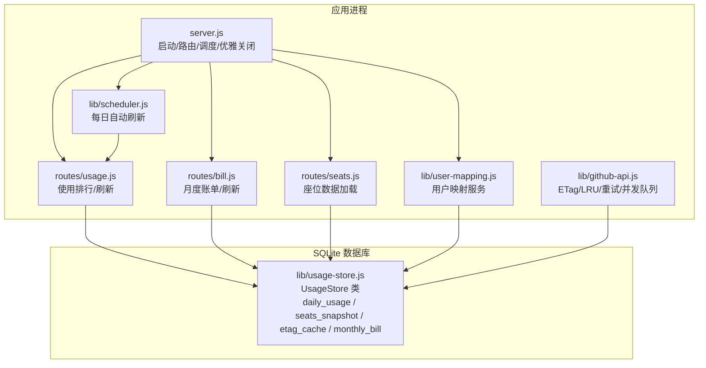
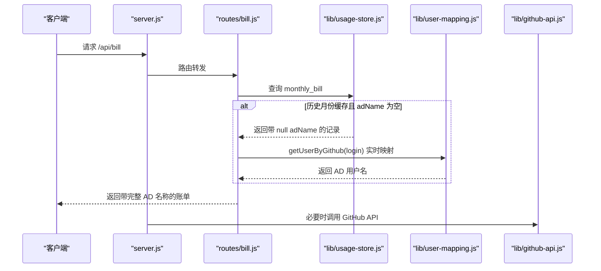
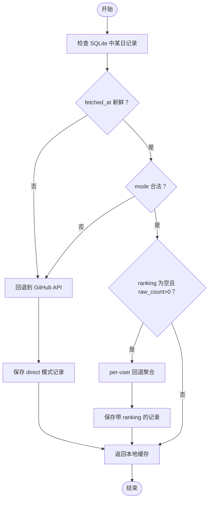
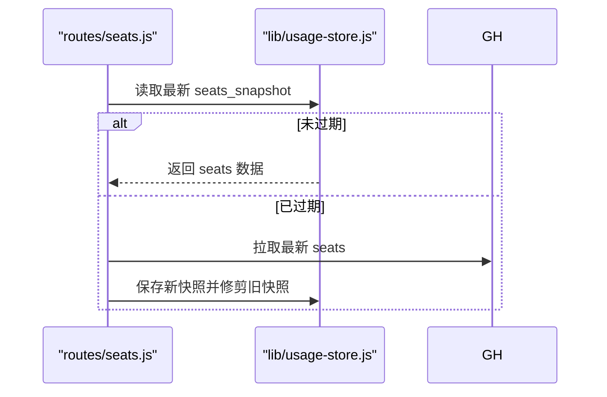
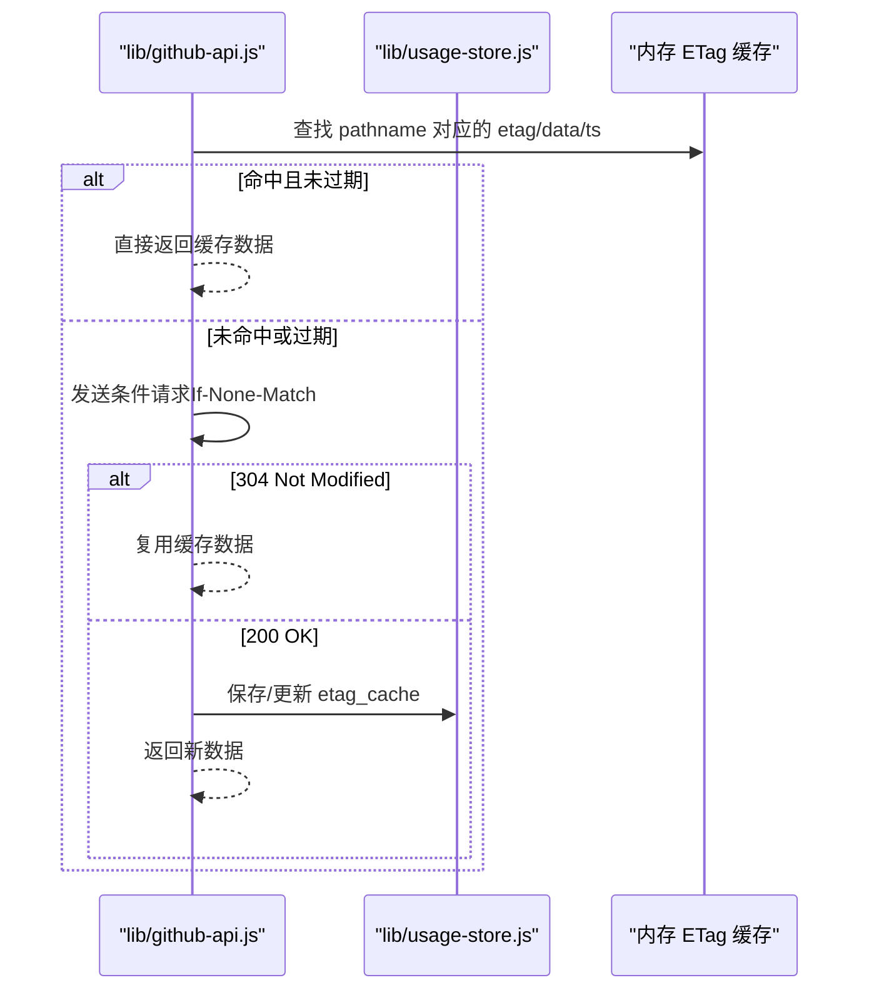
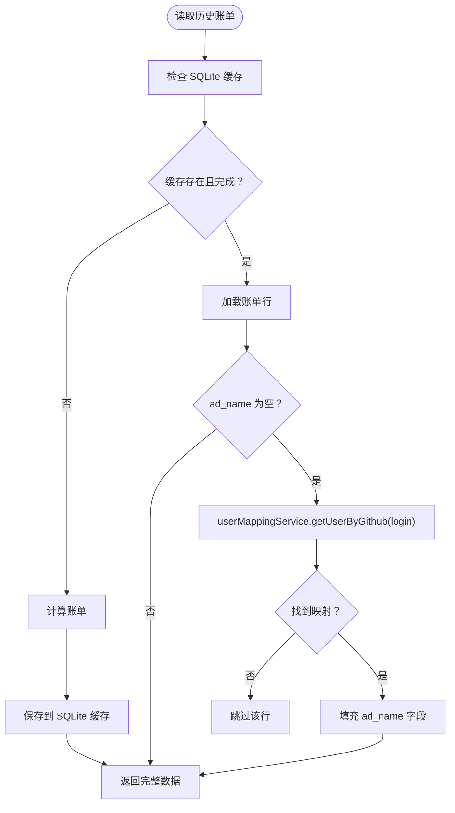
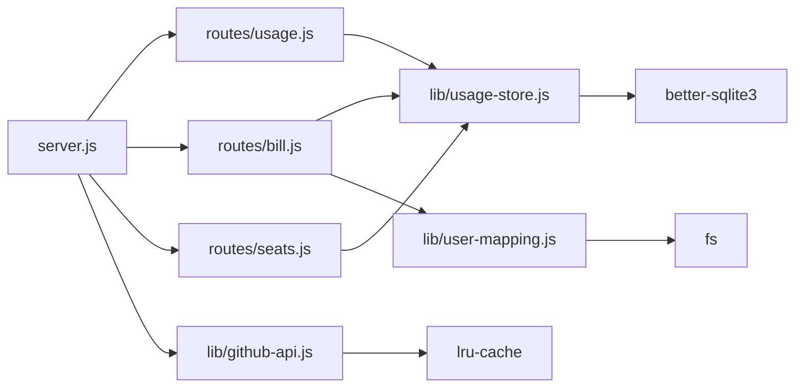

# 数据库设计

<cite>
**本文引用的文件**
- [usage-store.js](file://lib/usage-store.js)
- [server.js](file://server.js)
- [github-api.js](file://lib/github-api.js)
- [scheduler.js](file://lib/scheduler.js)
- [usage.js](file://routes/usage.js)
- [bill.js](file://routes/bill.js)
- [seats.js](file://routes/seats.js)
- [billing-config.js](file://lib/billing-config.js)
- [user-mapping.js](file://lib/user-mapping.js)
- [user-mapping.js](file://routes/user-mapping.js)
- [package.json](file://package.json)
</cite>

## 更新摘要
**变更内容**
- 新增 monthly_bill 表的 ad_name 列设计与实现
- 添加读时自愈机制的详细说明
- 更新 schema 迁移和自愈逻辑的技术细节
- 完善数据库版本管理和数据一致性保障

## 目录
1. [简介](#简介)
2. [项目结构](#项目结构)
3. [核心组件](#核心组件)
4. [架构总览](#架构总览)
5. [详细组件分析](#详细组件分析)
6. [依赖关系分析](#依赖关系分析)
7. [性能考量](#性能考量)
8. [故障排查指南](#故障排查指南)
9. [结论](#结论)
10. [附录](#附录)

## 简介
本文件系统性梳理 CopilotEnterpriseUsageDisplay 的 SQLite 数据库存储设计，覆盖表结构、索引策略、数据完整性约束、事务与并发控制、预编译语句优化、缓存与失效策略、性能优化、迁移与版本管理、备份恢复与维护建议。重点解释 daily_usage、seats_snapshot、etag_cache、monthly_bill 四个核心表的设计目标与字段语义，并结合运行时行为（如 TTL、清理、事务）给出可操作的运维与扩展指导。

**更新** 新增了 monthly_bill 表的 ad_name 列设计和读时自愈机制，实现了历史数据的自动补全和数据一致性保障。

## 项目结构
该项目采用"服务端 + 路由层 + 数据访问层"的分层组织：
- 服务入口负责启动、路由挂载、调度器与优雅关闭
- 路由层负责业务逻辑编排（使用/计费/座位/分析）
- 数据访问层封装 SQLite 模式、预编译语句、缓存与事务

**图表来源**
- [server.js:1-182](file://server.js#L1-L182)
- [usage-store.js:1-324](file://lib/usage-store.js#L1-L324)
- [github-api.js:1-320](file://lib/github-api.js#L1-L320)
- [scheduler.js:1-160](file://lib/scheduler.js#L1-L160)
- [usage.js:1-470](file://routes/usage.js#L1-L470)
- [bill.js:1-407](file://routes/bill.js#L1-L407)
- [seats.js:1-78](file://routes/seats.js#L1-L78)
- [user-mapping.js:1-158](file://lib/user-mapping.js#L1-L158)

**章节来源**
- [server.js:1-182](file://server.js#L1-L182)
- [usage-store.js:1-324](file://lib/usage-store.js#L1-L324)

## 核心组件
- UsageStore：封装 SQLite 连接、模式初始化、预编译语句、数据读写、清理与事务
- GitHub API 层：ETag 条件请求缓存（内存镜像 + SQLite 持久化），配合并发队列与重试
- 用户映射服务：提供 GitHub 用户名到 AD 用户名的实时映射功能
- 调度器：按计划时间自动刷新最近几天的使用数据
- 路由层：根据业务需求在 SQLite 与 GitHub API 之间进行数据选择与回退

**章节来源**
- [usage-store.js:10-133](file://lib/usage-store.js#L10-L133)
- [github-api.js:67-74](file://lib/github-api.js#L67-L74)
- [scheduler.js:54-157](file://lib/scheduler.js#L54-L157)
- [usage.js:377-462](file://routes/usage.js#L377-L462)
- [bill.js:237-313](file://routes/bill.js#L237-L313)
- [user-mapping.js:7-22](file://lib/user-mapping.js#L7-L22)

## 架构总览
下图展示数据库与各模块的交互关系，强调 SQLite 在"使用排行、座位快照、ETag 缓存、月度账单"四个维度上的作用，以及读时自愈机制的工作流程。

**图表来源**
- [server.js:88-98](file://server.js#L88-L98)
- [bill.js:267-294](file://routes/bill.js#L267-L294)
- [usage-store.js:288-330](file://lib/usage-store.js#L288-L330)
- [user-mapping.js:118-122](file://lib/user-mapping.js#L118-L122)

## 详细组件分析

### daily_usage 表：使用排行与日粒度缓存
- 设计目标
  - 存储按日聚合的 Copilot 使用排行与原始数据，支持"按日/按周期"两种查询路径
  - 提供 TTL 控制与"新鲜度"校验，避免 GitHub API 延迟导致的"日 > 周期"矛盾
- 字段与语义
  - date：主键，字符串格式 "YYYY-MM-DD"，用于快速定位某日记录
  - year/month/day：整数，便于按月/年筛选与排序
  - data：JSON 文本，包含当日原始使用项列表
  - mode：字符串，指示数据来源模式（direct/per-user-fallback/sqlite-cycle 等）
  - raw_count：整数，当日原始条目数量，用于完整性检查
  - source：字符串，GitHub API 的 scope 描述
  - fetched_at：字符串（ISO 时间戳），用于 TTL 判定与新鲜度校验
  - ranking：JSON 文本（可空），按用户聚合的排行结果；为空表示当日聚合失败或尚未生成
- 索引与约束
  - 主键：date
  - 辅助索引：idx_daily_usage_date(date)，加速按日期范围查询
- 关键流程
  - 读取：优先从 SQLite 取某日记录，结合 fetched_at 与 mode 做新鲜度与完整性校验
  - 写入：INSERT OR REPLACE，确保幂等更新；ranking 可为空占位
  - 清理：按 fetched_at 超过阈值删除旧记录
- 业务意义
  - ranking 为空但 raw_count > 0：当日聚合失败，可能需要回退到 per-user 查询
  - mode 非 per-user-fallback 且接近月底：可能处于中间态，不应用于构建周期总数

**图表来源**
- [usage.js:279-348](file://routes/usage.js#L279-L348)
- [usage-store.js:137-160](file://lib/usage-store.js#L137-L160)

**章节来源**
- [usage-store.js:24-36](file://lib/usage-store.js#L24-L36)
- [usage-store.js:52](file://lib/usage-store.js#L52)
- [usage.js:134-235](file://routes/usage.js#L134-L235)
- [usage.js:279-348](file://routes/usage.js#L279-L348)

### seats_snapshot 表：座位快照与 TTL 策略
- 设计目标
  - 缓存企业 Copilot 座位信息，减少对 GitHub API 的频繁拉取
  - 通过 fetched_at 与 TTL 控制数据新鲜度
  - 限制快照数量上限，防止无限增长
- 字段与语义
  - id：自增主键
  - data：JSON 文本，座位数组（包含 login、team、planType 等）
  - fetched_at：字符串（ISO 时间戳）
  - total：整数，data 数组长度
- 索引与约束
  - 主键：id
  - 辅助索引：idx_seats_snapshot_fetched(fetched_at)，用于按时间倒序与清理
- 关键流程
  - 读取：ORDER BY fetched_at DESC LIMIT 1，取最新快照
  - 写入：INSERT，随后按上限修剪旧快照
  - 修剪：仅保留最近 N 个快照（MAX_SEATS_SNAPSHOTS）

**图表来源**
- [seats.js:37-75](file://routes/seats.js#L37-L75)
- [usage-store.js:102-111](file://lib/usage-store.js#L102-L111)
- [usage-store.js:227-239](file://lib/usage-store.js#L227-L239)

**章节来源**
- [usage-store.js:38-43](file://lib/usage-store.js#L38-L43)
- [usage-store.js:53](file://lib/usage-store.js#L53)
- [seats.js:37-75](file://routes/seats.js#L37-L75)

### etag_cache 表：条件请求缓存与失效策略
- 设计目标
  - 将 GitHub API 的 ETag 与响应体持久化到 SQLite，实现"条件请求"缓存
  - 与内存中的 LRU 缓存协同，提升命中率与减少网络开销
- 字段与语义
  - pathname：主键，GET 请求的完整路径 + 查询参数键值对排序后的组合键
  - etag：字符串，ETag 值
  - data：JSON 文本，上次响应体
  - fetched_at：字符串（ISO 时间戳），用于 TTL 清理
- 索引与约束
  - 主键：pathname
  - 辅助索引：idx_etag_cache_fetched(fetched_at)，用于清理过期条目
- 关键流程
  - 初始化：启动时从 SQLite 加载所有 ETag 条目到内存缓存
  - 查询：若内存命中且未过期，直接返回；否则发起条件请求（If-None-Match）
  - 更新：收到 304 Not Modified 则复用缓存；收到 200 则更新内存与 SQLite
  - 清理：按 fetched_at 超过阈值删除

**图表来源**
- [github-api.js:67-74](file://lib/github-api.js#L67-L74)
- [github-api.js:231-289](file://lib/github-api.js#L231-L289)
- [usage-store.js:113-119](file://lib/usage-store.js#L113-L119)

**章节来源**
- [usage-store.js:45-50](file://lib/usage-store.js#L45-L50)
- [usage-store.js:54](file://lib/usage-store.js#L54)
- [github-api.js:67-74](file://lib/github-api.js#L67-L74)
- [github-api.js:231-289](file://lib/github-api.js#L231-L289)

### monthly_bill 表：月度账单计算结果存储与读时自愈机制
- 设计目标
  - 存储按用户/团队维度的月度账单明细，支持历史查询与重新计算
  - 以 year_month 为主键的一部分，保证同一周期内唯一性
  - **新增**：持久化 AD 用户名映射，实现历史数据的读时自愈
- 字段与语义
  - year_month：字符串，"YYYY-MM"
  - team：字符串，用户所属团队
  - login：字符串，GitHub 用户名
  - **ad_name**：字符串（可空），AD 用户名，用于显示已映射的用户名称
  - plan_type：字符串，计划类型（business/enterprise）
  - seat_cost：实数，固定座席费用
  - requests：实数，当月总请求数
  - quota：整数，包含配额
  - overage_requests：实数，超出配额请求数
  - overage_cost：实数，超配额费用
  - total_cost：实数，当月总费用
  - computed_at：字符串（ISO 时间戳），计算完成时间
- 索引与约束
  - 主键：year_month + login（复合主键）
  - 辅助索引：idx_monthly_bill_ym(year_month)，加速按周期查询
- 关键流程
  - 读取：按 year_month 排序返回明细，自动将 ad_name 映射为 adName 字段
  - 写入：事务批量删除后插入，保证一致性
  - 清理：按 year_month 删除或全量清理
  - **新增**：读时自愈 - 对历史缓存中的空 ad_name 字段进行实时补全

**读时自愈机制工作流程**：

**图表来源**
- [bill.js:267-294](file://routes/bill.js#L267-L294)
- [usage-store.js:288-330](file://lib/usage-store.js#L288-L330)
- [user-mapping.js:118-122](file://lib/user-mapping.js#L118-L122)

**章节来源**
- [usage-store.js:56-70](file://lib/usage-store.js#L56-L70)
- [usage-store.js:70](file://lib/usage-store.js#L70)
- [bill.js:267-294](file://routes/bill.js#L267-L294)
- [user-mapping.js:118-122](file://lib/user-mapping.js#L118-L122)

### 预编译语句、事务与并发控制
- 预编译语句
  - 在构造函数中一次性创建常用 SQL 语句，避免重复解析与提升执行效率
  - 涵盖 daily_usage、seats_snapshot、etag_cache、monthly_bill 的常见读写场景
- 事务
  - 月度账单写入使用事务包裹，先删除再插入，保证原子性与一致性
- 并发控制
  - GitHub API 层使用并发队列与"飞行中去重"（in-flight dedup）降低重复请求
  - SQLite 通过 WAL 模式与 NORMAL 同步级别平衡性能与可靠性

**章节来源**
- [usage-store.js:83-137](file://lib/usage-store.js#L83-L137)
- [usage-store.js:304-315](file://lib/usage-store.js#L304-L315)
- [github-api.js:25-48](file://lib/github-api.js#L25-L48)
- [github-api.js:243-268](file://lib/github-api.js#L243-L268)

## 依赖关系分析
- 组件耦合
  - server.js 作为入口，依赖 UsageStore、UserMappingService、调度器
  - routes 层依赖 UsageStore 与 GitHub API 层
  - UsageStore 依赖 better-sqlite3（SQLite 客户端）
  - **新增**：UserMappingService 提供用户映射服务，被 bill 路由用于读时自愈
- 外部依赖
  - better-sqlite3：SQLite 访问
  - lru-cache：内存缓存（ETag 与 GitHub GET 缓存）
  - dotenv：环境变量加载

**图表来源**
- [server.js:6-9](file://server.js#L6-L9)
- [package.json:12-21](file://package.json#L12-L21)
- [usage-store.js:3](file://lib/usage-store.js#L3)
- [github-api.js:8](file://lib/github-api.js#L8)
- [user-mapping.js:1-158](file://lib/user-mapping.js#L1-L158)

**章节来源**
- [package.json:12-21](file://package.json#L12-L21)
- [server.js:6-9](file://server.js#L6-L9)

## 性能考量
- 索引设计
  - daily_usage(date)：按日期范围查询与去重
  - seats_snapshot(fetched_at)：按时间倒序与清理
  - etag_cache(fetched_at)：按时间清理
  - monthly_bill(year_month)：按周期查询
- 查询优化
  - 使用预编译语句减少解析开销
  - 按需裁剪字段（如仅取 date 用于缺失日检测）
  - 日期范围查询使用 ISO 字符串比较，避免转换成本
- 缓存策略
  - SQLite TTL：90 天（默认）用于 daily_usage，近期（3 天内）使用更短 TTL
  - ETag 缓存：内存 + SQLite 双层缓存，条件请求减少带宽
  - 座位快照 TTL：10 分钟，限制快照数量上限
  - **新增**：读时自愈缓存：UserMappingService 内部缓存映射结果，避免重复查询
- 事务与并发
  - 月度账单写入使用事务，保证一致性
  - GitHub API 并发队列与 in-flight 去重，避免重复请求

**章节来源**
- [usage-store.js:52-70](file://lib/usage-store.js#L52-L70)
- [usage.js:258-267](file://routes/usage.js#L258-L267)
- [github-api.js:25-48](file://lib/github-api.js#L25-L48)
- [github-api.js:243-268](file://lib/github-api.js#L243-L268)
- [user-mapping.js:118-122](file://lib/user-mapping.js#L118-L122)

## 故障排查指南
- 常见问题与定位
  - 使用排行为空或不完整：检查 daily_usage 中对应日期是否缺失、ranking 是否为空、mode 是否为 per-user-fallback
  - 月度账单为空：确认是否处于"数据汇聚期"或 SQLite 中是否存在"零使用"缓存；必要时强制刷新
  - **新增**：AD 用户名显示为 GitHub 登录名：检查 monthly_bill 中 ad_name 是否为空，确认 user_mapping.json 文件是否正确加载
  - ETag 缓存未生效：检查 pathname 键是否一致、ETag 是否正确、fetched_at 是否过期
  - 座位数据过期：检查 fetched_at 与 TTL、是否成功写入快照
- 日志与可观测性
  - server.js 中统一记录 HTTP 请求日志
  - routes 层记录刷新/回退/失败事件
  - UsageStore 记录修剪快照等后台操作
  - **新增**：UserMappingService 记录映射加载和查询日志
- 修复建议
  - 强制刷新：使用 /api/bill/refresh 或单日刷新接口
  - 清理缓存：删除指定日期范围或周期的数据
  - 重启后恢复：启动时自动从 SQLite 恢复 ETag 与座位快照
  - **新增**：重新加载映射：使用 /api/user/reload-mapping 重新加载 user_mapping.json 文件

**章节来源**
- [server.js:16-38](file://server.js#L16-L38)
- [usage.js:387-462](file://routes/usage.js#L387-L462)
- [bill.js:321-403](file://routes/bill.js#L321-L403)
- [github-api.js:67-74](file://lib/github-api.js#L67-L74)
- [usage-store.js:227-239](file://lib/usage-store.js#L227-L239)
- [user-mapping.js:98-116](file://lib/user-mapping.js#L98-L116)

## 结论
该数据库设计围绕"日级缓存 + 条件请求 + 月度汇总"的核心路径展开，通过合理的索引、预编译语句、事务与 TTL 策略，在保证数据一致性的同时显著降低了对外部 API 的依赖与网络开销。daily_usage 与 monthly_bill 作为关键表，分别承担"短期高频缓存"和"长期结算依据"的职责；seats_snapshot 与 etag_cache 则分别解决"座位元数据"和"条件请求缓存"的痛点。

**更新** 新增的 ad_name 列和读时自愈机制进一步增强了数据一致性保障，确保历史账单数据能够自动补全用户映射信息，提升了用户体验和系统的健壮性。建议在生产环境中结合监控与日志，持续评估索引命中率与清理策略效果，并按需调整 TTL 与并发参数。

## 附录
- 数据迁移与版本管理
  - 新增列：daily_usage 的 ranking 列通过迁移添加，兼容已有数据
  - **新增**：monthly_bill 的 ad_name 列通过迁移添加，使用幂等 ALTER TABLE 语句
  - 版本演进：通过 ALTER TABLE 与条件判断实现平滑升级
- 备份与恢复
  - SQLite 文件备份：定期复制 usage.db
  - 恢复策略：停止服务后替换 db 文件，启动后自动重建内存 ETag 缓存
  - **新增**：user_mapping.json 文件备份：定期备份用户映射配置
- 扩展建议
  - 增加审计日志表记录关键写入事件
  - 为高频查询增加复合索引（如 daily_usage(year, month)）
  - 引入只读副本与 WAL 模式下的并发读写优化
  - **新增**：考虑为 ad_name 列添加索引以优化查询性能

**章节来源**
- [usage-store.js:73-87](file://lib/usage-store.js#L73-L87)
- [github-api.js:67-74](file://lib/github-api.js#L67-L74)
- [user-mapping.js:24-34](file://lib/user-mapping.js#L24-L34)