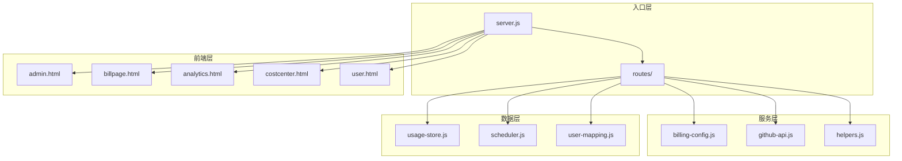
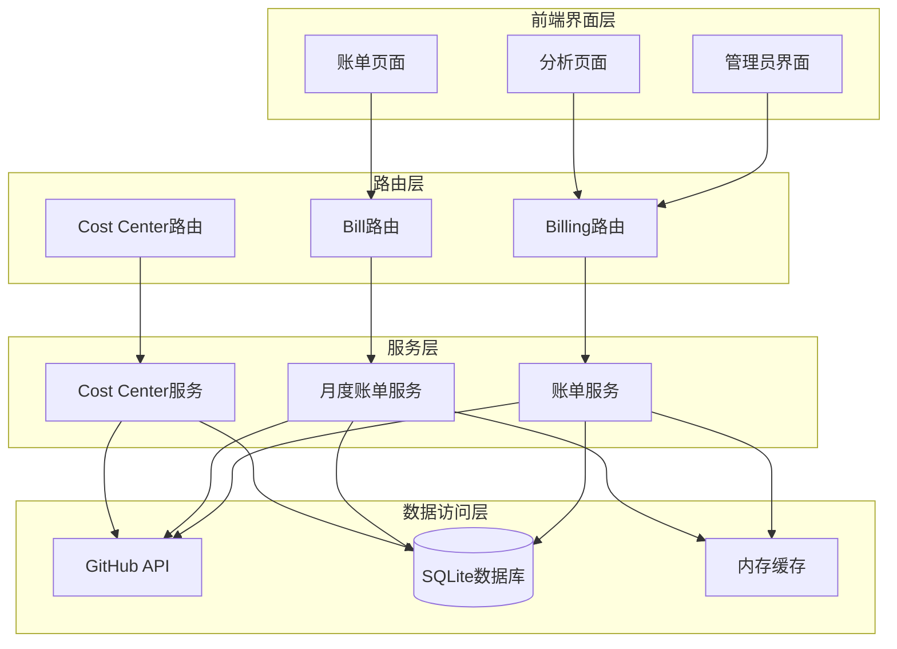
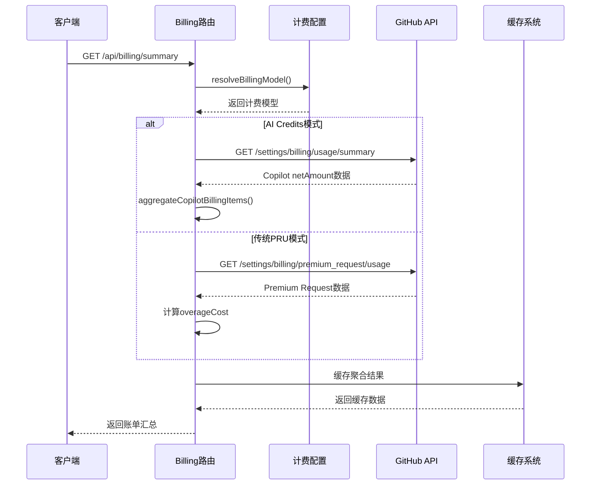
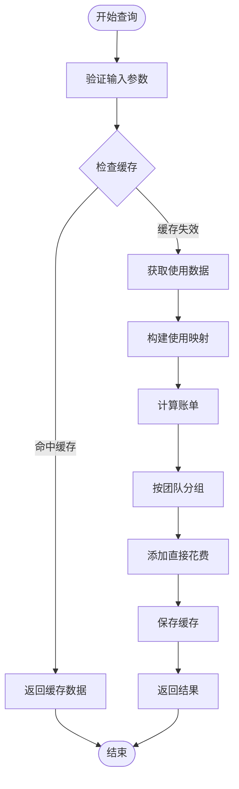
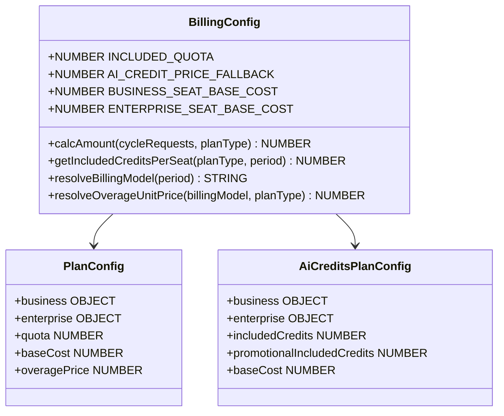
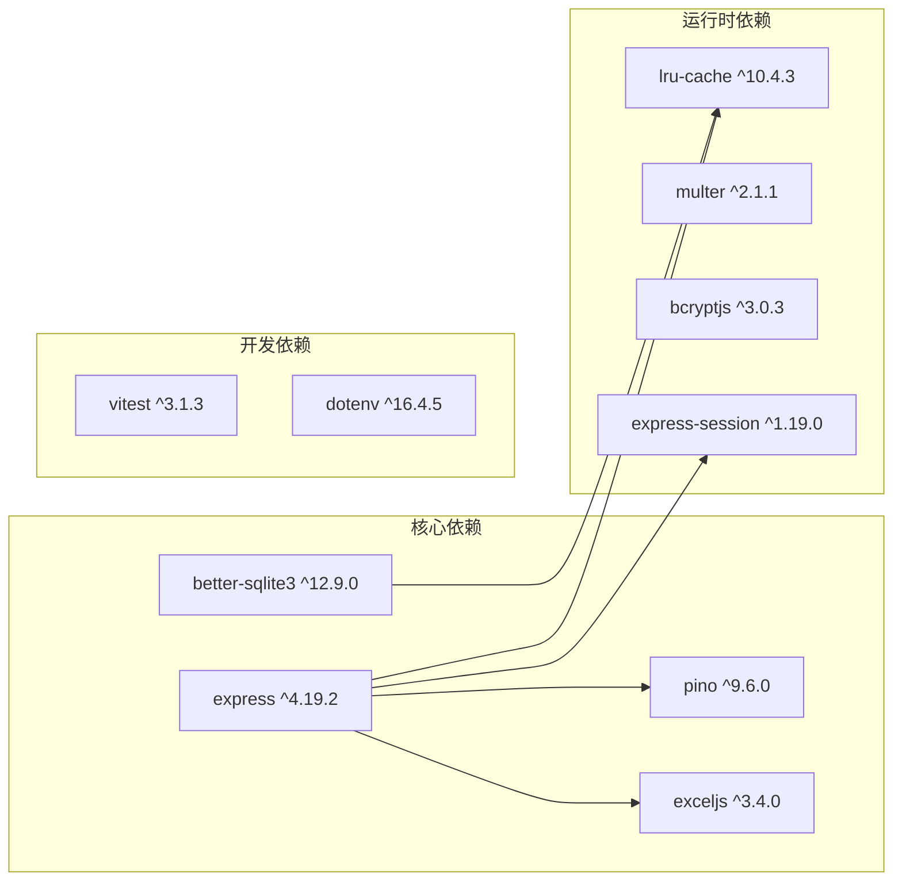

# AI Credits 账单支持

<cite>
**本文档引用的文件**
- [README.md](file://README.md)
- [package.json](file://package.json)
- [server.js](file://server.js)
- [lib/billing-config.js](file://lib/billing-config.js)
- [lib/github-api.js](file://lib/github-api.js)
- [lib/helpers.js](file://lib/helpers.js)
- [routes/billing.js](file://routes/billing.js)
- [routes/bill.js](file://routes/bill.js)
- [routes/costcenter.js](file://routes/costcenter.js)
- [public/billpage.js](file://public/billpage.js)
</cite>

## 目录
1. [简介](#简介)
2. [项目结构](#项目结构)
3. [核心组件](#核心组件)
4. [架构概览](#架构概览)
5. [详细组件分析](#详细组件分析)
6. [依赖关系分析](#依赖关系分析)
7. [性能考虑](#性能考虑)
8. [故障排除指南](#故障排除指南)
9. [结论](#结论)

## 简介

AI Credits 账单支持是 GitHub Copilot 企业用量展示仪表盘的核心功能模块，专为支持 GitHub Copilot usage-based billing（按使用量计费）而设计。该项目基于 Node.js + Express 构建，提供完整的 AI Credits 账单管理功能，包括整体账单汇总、团队月度账单、模型使用排行等核心功能。

该系统支持双计费模型兼容，既可处理传统的 Premium Request 模式，也可处理新的 AI Credits 模式。通过智能的 API 选择机制和数据回退策略，确保在不同计费模型之间无缝切换。

## 项目结构

项目采用模块化分层架构，主要分为以下几个层次：

**图表来源**
- [server.js:1-234](file://server.js#L1-L234)
- [package.json:1-28](file://package.json#L1-L28)

**章节来源**
- [README.md:55-111](file://README.md#L55-L111)
- [server.js:139-151](file://server.js#L139-L151)

## 核心组件

### 计费配置管理

AI Credits 账单支持的核心在于灵活的计费配置系统，支持多种计费模式的自动切换：

- **双计费模型支持**：`legacy_pru`（传统 Premium Request）和 `ai_credits`（AI Credits）
- **自动模式切换**：根据账期自动选择合适的计费模型
- **促销期支持**：2026年6月至8月的AI Credits促销额度支持
- **单价配置**：支持自定义AI Credits单价兜底

### GitHub API 集成

系统通过智能的API选择机制处理不同计费模型的数据获取：

- **端点自动选择**：根据计费模型自动选择合适的GitHub API端点
- **数据回退机制**：当主API返回产品级SKU时，自动尝试备选端点获取真实模型名称
- **增强账单API**：支持AI Credits模式下的增强账单汇总API

### SQLite 缓存系统

为了优化性能和减少API调用，系统实现了多层次的缓存架构：

- **内存缓存**：5分钟TTL的快速访问缓存
- **持久化缓存**：90天TTL的SQLite数据库缓存
- **动态TTL策略**：近3天1小时，更老90天的智能缓存策略

**章节来源**
- [lib/billing-config.js:1-84](file://lib/billing-config.js#L1-L84)
- [lib/github-api.js:1-327](file://lib/github-api.js#L1-L327)
- [lib/helpers.js:1-301](file://lib/helpers.js#L1-L301)

## 架构概览

AI Credits 账单支持采用分层架构设计，确保系统的可维护性和扩展性：

**图表来源**
- [server.js:142-150](file://server.js#L142-L150)
- [routes/billing.js:17-329](file://routes/billing.js#L17-L329)
- [routes/bill.js:61-624](file://routes/bill.js#L61-L624)

## 详细组件分析

### 整体账单汇总组件

整体账单汇总是AI Credits模式的核心功能，负责聚合所有账单数据并提供统一的视图：

**图表来源**
- [routes/billing.js:60-203](file://routes/billing.js#L60-L203)
- [lib/billing-config.js:47-51](file://lib/billing-config.js#L47-L51)
- [lib/helpers.js:180-192](file://lib/helpers.js#L180-L192)

该组件的关键特性包括：

- **智能计费模型选择**：根据账期自动选择AI Credits或传统PRU模式
- **增强账单聚合**：AI Credits模式下聚合Copilot netAmount数据
- **overage成本计算**：优先使用API权威netAmount，回退到本地计算
- **数据源审计**：记录金额来源用于审计跟踪

### 团队月度账单组件

团队月度账单组件提供详细的团队级账单视图，支持按月查询和导出功能：

**图表来源**
- [routes/bill.js:244-310](file://routes/bill.js#L244-L310)
- [routes/bill.js:320-379](file://routes/bill.js#L320-L379)

该组件的核心功能：

- **智能缓存策略**：检查缓存完整性，必要时重新计算
- **团队级聚合**：按团队分组计算席位费和超额费用
- **直接花费集成**：从GitHub API直接读取Cost Center花费
- **Excel导出支持**：支持多工作表的Excel文件导出

### 计费配置组件

计费配置组件管理所有计费相关的配置和计算逻辑：

**图表来源**
- [lib/billing-config.js:16-32](file://lib/billing-config.js#L16-L32)
- [lib/billing-config.js:58-69](file://lib/billing-config.js#L58-L69)

**章节来源**
- [lib/billing-config.js:1-84](file://lib/billing-config.js#L1-L84)
- [routes/billing.js:17-329](file://routes/billing.js#L17-L329)
- [routes/bill.js:61-624](file://routes/bill.js#L61-L624)

## 依赖关系分析

系统依赖关系清晰，各模块职责明确：

**图表来源**
- [package.json:12-27](file://package.json#L12-L27)

**章节来源**
- [package.json:1-28](file://package.json#L1-L28)

## 性能考虑

系统在设计时充分考虑了性能优化：

### 缓存策略
- **三层缓存架构**：内存缓存(5分钟) → SQLite缓存(90天) → GitHub API
- **动态TTL策略**：近3天1小时，更老90天，避免数据延迟导致的缓存锁死
- **ETag条件请求**：数据未变化时返回304，不消耗API配额

### 并发控制
- **GitHub API并发队列**：可配置的最大并发数(默认3)
- **单飞行去重**：避免相同请求的重复执行
- **指数退避重试**：处理API限流和瞬时错误

### 数据处理优化
- **分批渲染**：处理大量数据时使用requestAnimationFrame进行分块渲染
- **预编译SQL语句**：减少SQL解析开销
- **智能数据聚合**：优先使用ranking聚合数据，确保数据一致性

## 故障排除指南

### 常见问题及解决方案

**1. GitHub API 限流问题**
- 检查 `GITHUB_MAX_CONCURRENT` 和 `GITHUB_MAX_RETRIES` 配置
- 查看日志中的速率限制信息
- 实施指数退避策略

**2. 缓存数据不一致**
- 使用强制刷新功能重新计算账单
- 检查SQLite数据库文件完整性
- 验证ETag缓存同步状态

**3. 计费模型切换问题**
- 确认 `BILLING_MODEL` 环境变量设置
- 检查账期是否超过AI Credits模式的时间阈值
- 验证GitHub API版本兼容性

**4. Excel导出失败**
- 检查磁盘空间和文件权限
- 验证ExcelJS库版本兼容性
- 确认数据格式符合导出要求

**章节来源**
- [lib/github-api.js:176-233](file://lib/github-api.js#L176-L233)
- [routes/bill.js:401-484](file://routes/bill.js#L401-L484)

## 结论

AI Credits 账单支持模块为 GitHub Copilot 企业用户提供了完整的按使用量计费解决方案。通过智能的计费模型切换、高效的缓存策略和强大的数据处理能力，该系统能够稳定地处理复杂的账单计算需求。

系统的主要优势包括：

- **双计费模型兼容**：无缝支持传统PRU和AI Credits两种模式
- **智能数据回退**：确保在不同API响应格式间的数据一致性
- **高性能缓存架构**：大幅减少GitHub API调用，提高系统响应速度
- **完整的审计功能**：提供详细的金额来源和数据处理记录
- **灵活的导出功能**：支持Excel等多种格式的数据导出

该模块的设计充分体现了现代Web应用的最佳实践，为GitHub Copilot的企业用户提供了可靠、高效、易用的账单管理解决方案。