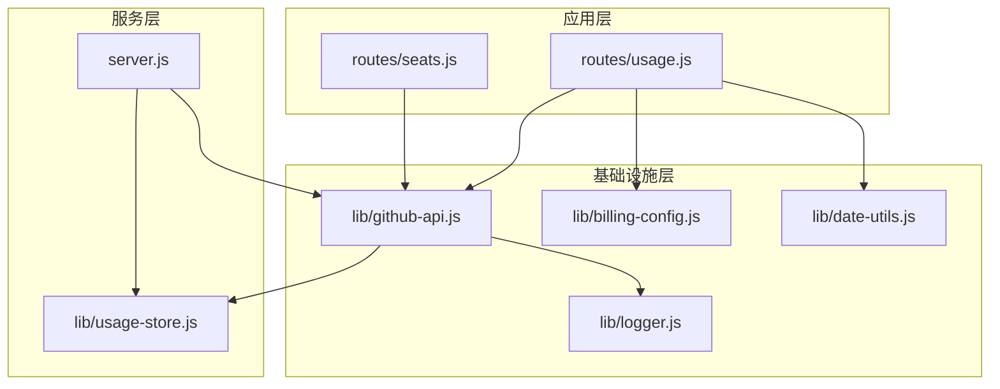
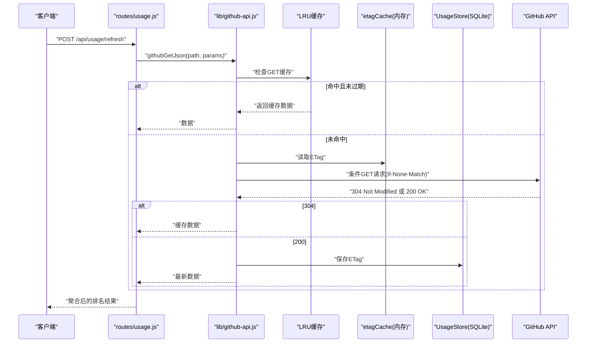
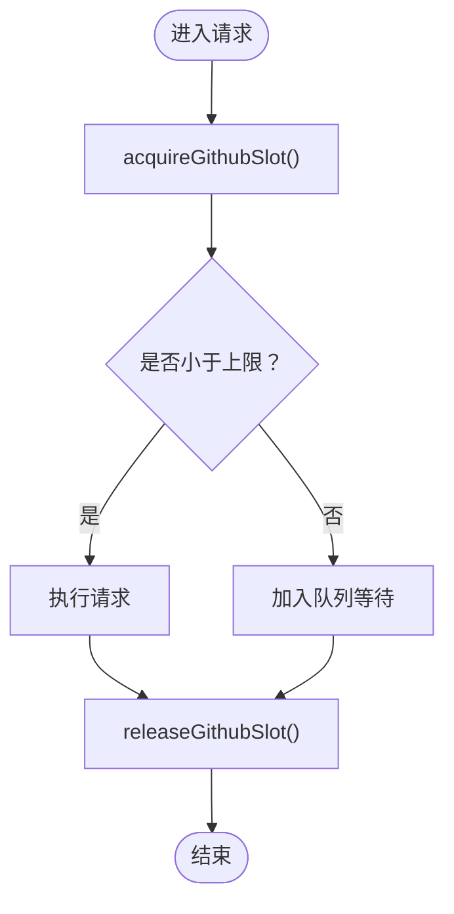
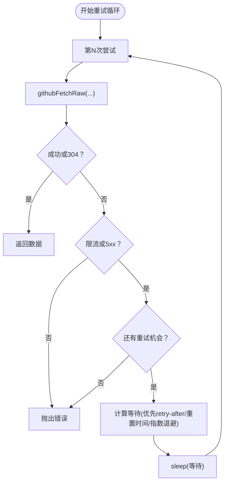
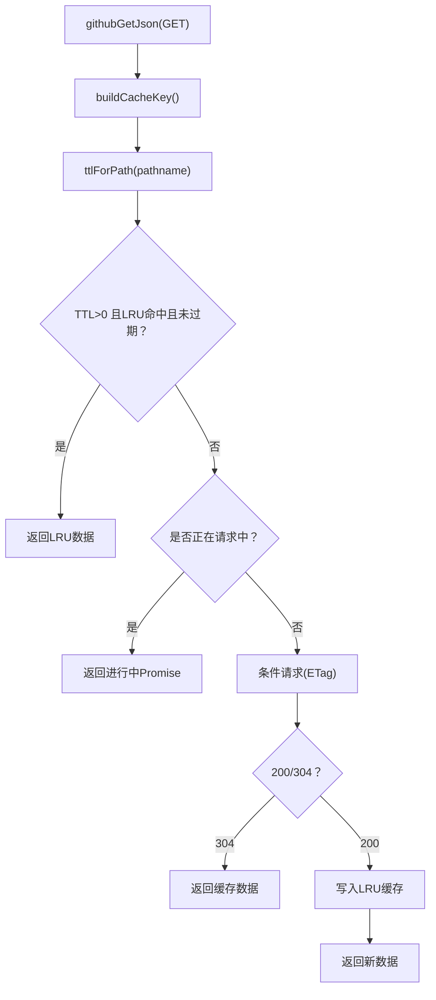
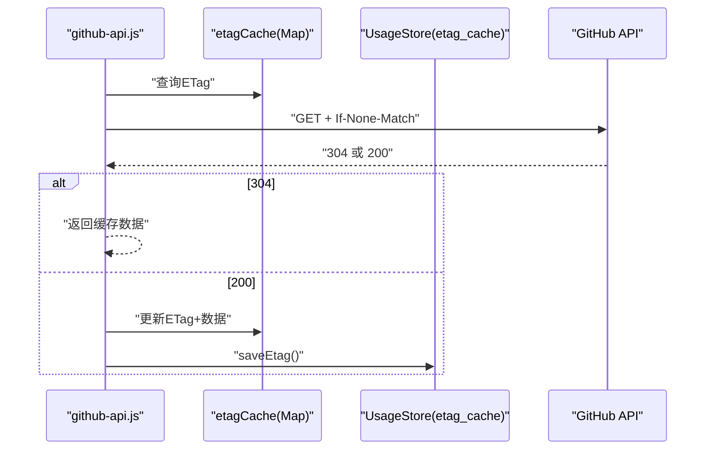
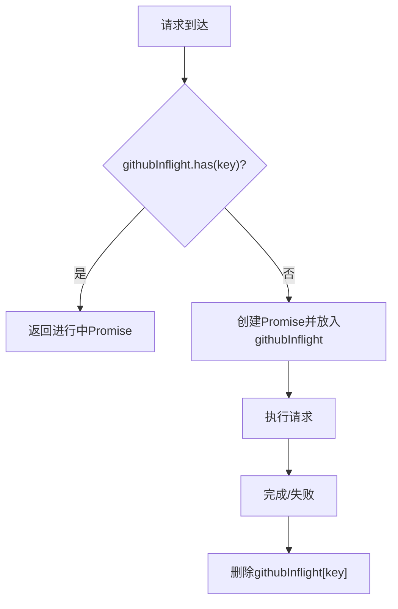
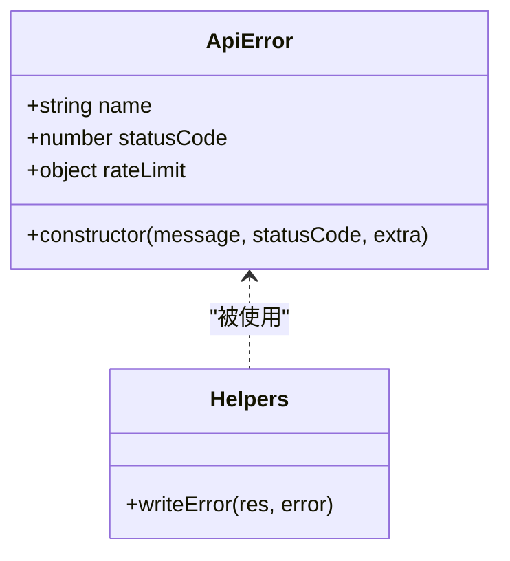
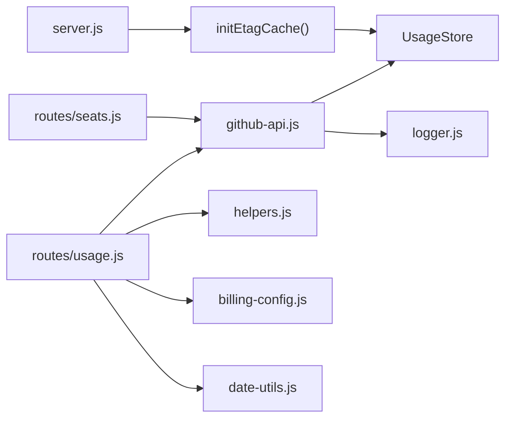

# GitHub API 集成模块

<cite>
**本文档引用的文件**
- [lib/github-api.js](file://lib/github-api.js)
- [lib/usage-store.js](file://lib/usage-store.js)
- [lib/helpers.js](file://lib/helpers.js)
- [lib/scheduler.js](file://lib/scheduler.js)
- [lib/billing-config.js](file://lib/billing-config.js)
- [lib/logger.js](file://lib/logger.js)
- [lib/date-utils.js](file://lib/date-utils.js)
- [routes/usage.js](file://routes/usage.js)
- [routes/seats.js](file://routes/seats.js)
- [server.js](file://server.js)
</cite>

## 目录
1. [简介](#简介)
2. [项目结构](#项目结构)
3. [核心组件](#核心组件)
4. [架构总览](#架构总览)
5. [详细组件分析](#详细组件分析)
6. [依赖关系分析](#依赖关系分析)
7. [性能考量](#性能考量)
8. [故障排查指南](#故障排查指南)
9. [结论](#结论)
10. [附录：使用示例与最佳实践](#附录使用示例与最佳实践)

## 简介
本文件面向 GitHub API 集成模块，系统性阐述其封装设计与运行机制，涵盖并发控制队列、重试与退避策略、LRU 缓存、ETag 条件请求、单飞行去重等关键能力；同时解释 ApiError 错误类、MAX_CONCURRENT_GITHUB 与 MAX_GITHUB_RETRIES 的配置原理、githubFetchRaw 的底层请求处理、githubRequest 的重试包装逻辑；并详述 buildCacheKey 的缓存键生成、ttlForPath 的 TTL 策略、invalidateCacheByPrefix 的缓存失效机制。最后提供 githubGetJson、githubPostJson、githubDeleteJson 等高阶 API 的使用示例与最佳实践。

## 项目结构
该模块位于 lib/github-api.js，围绕 GitHub API 请求构建了统一的基础设施层，向上提供路由与业务模块可直接使用的高阶 API，并通过 UsageStore 与 SQLite 持久化 ETag 缓存，结合内存中的 LRU 缓存与单飞行去重，形成多层缓存与并发控制体系。

图表来源
- [server.js:50-51](file://server.js#L50-L51)
- [lib/github-api.js:67-74](file://lib/github-api.js#L67-L74)
- [lib/usage-store.js:45-50](file://lib/usage-store.js#L45-L50)

章节来源
- [lib/github-api.js:1-320](file://lib/github-api.js#L1-L320)
- [server.js:1-182](file://server.js#L1-L182)

## 核心组件
- 并发控制队列：通过 acquireGithubSlot/releaseGithubSlot 与全局计数器 githubRunning 控制最大并发请求数，避免超出 GitHub 速率限制。
- 重试与退避：githubRequest 在遇到 429/403（二次限流）或 5xx 时按指数退避策略等待，最多重试 MAX_GITHUB_RETRIES 次。
- LRU 缓存：针对 GET 请求的内存缓存，配合自定义 TTL 策略，提升热点数据访问效率。
- ETag 条件请求：基于 SQLite 持久化的 ETag 映射，构建 in-memory 的 etagCache，发起 If-None-Match 条件请求，命中 304 则返回缓存数据。
- 单飞行去重：githubInflight Map 记录同一路径的进行中请求，避免重复并发请求。
- 高阶 API：githubGetJson、githubGetWithHeaders、githubPostJson、githubDeleteJson、githubRequestJson 提供统一的调用入口。
- 工具函数：buildCacheKey、ttlForPath、invalidateCacheByPrefix、getLastRateLimit 等辅助缓存与错误处理。

章节来源
- [lib/github-api.js:23-48](file://lib/github-api.js#L23-L48)
- [lib/github-api.js:57-104](file://lib/github-api.js#L57-L104)
- [lib/github-api.js:170-227](file://lib/github-api.js#L170-L227)
- [lib/github-api.js:229-305](file://lib/github-api.js#L229-L305)

## 架构总览
下图展示从路由到 GitHub API 的完整调用链路，以及缓存与持久化层的交互。

图表来源
- [routes/usage.js:387-462](file://routes/usage.js#L387-L462)
- [lib/github-api.js:231-269](file://lib/github-api.js#L231-L269)
- [lib/github-api.js:108-168](file://lib/github-api.js#L108-L168)
- [lib/usage-store.js:242-278](file://lib/usage-store.js#L242-L278)

## 详细组件分析

### 并发控制队列与速率限制
- 全局并发上限由 MAX_CONCURRENT_GITHUB 决定，默认来自环境变量 GITHUB_MAX_CONCURRENT，最小为 1。
- acquireGithubSlot 在未达上限时立即放行；否则将回调推入队列等待。
- releaseGithubSlot 释放一个槽位并唤醒下一个等待者。
- 最近一次速率限制信息 lastRateLimit 会随响应头更新，可通过 getLastRateLimit 获取。

图表来源
- [lib/github-api.js:25-48](file://lib/github-api.js#L25-L48)

章节来源
- [lib/github-api.js:25-51](file://lib/github-api.js#L25-L51)

### 重试与退避策略
- githubRequest 对失败请求进行最多 MAX_GITHUB_RETRIES+1 次尝试。
- 识别限流与 5xx 错误：429 主限流、403 含“secondary rate limit”或“rate limit”、或剩余配额为 0 的 403。
- 优先使用响应头 retry-after；否则在存在 x-ratelimit-reset 时等待至重置时间；否则采用 2^n*500ms 的指数退避，上限不超过 8s。
- 所有重试均记录日志，包含方法、路径、状态码、尝试次数与等待时长。

图表来源
- [lib/github-api.js:172-227](file://lib/github-api.js#L172-L227)

章节来源
- [lib/github-api.js:170-227](file://lib/github-api.js#L170-L227)

### LRU 缓存与 TTL 策略
- 使用 lru-cache 库维护 githubGetCache，max=500，TTL 由 ttlForPath 动态决定。
- GET 请求命中缓存且未过期则直接返回；否则走条件请求流程。
- 不同路径具有不同 TTL：如 seats、memberships、teams、budgets、usage、cost-centers 等均有定制 TTL。
- 当 TTL>0 时，githubGetJson 将数据写入 LRU 缓存；githubGetWithHeaders 则在返回带头部时同样更新 ETag。

图表来源
- [lib/github-api.js:231-269](file://lib/github-api.js#L231-L269)
- [lib/github-api.js:78-98](file://lib/github-api.js#L78-L98)
- [lib/github-api.js:271-289](file://lib/github-api.js#L271-L289)

章节来源
- [lib/github-api.js:59-60](file://lib/github-api.js#L59-L60)
- [lib/github-api.js:78-98](file://lib/github-api.js#L78-L98)
- [lib/github-api.js:231-269](file://lib/github-api.js#L231-L269)

### ETag 条件请求与持久化
- 初始化阶段通过 initEtagCache 将 SQLite 中的 etag_cache 恢复到内存映射 etagCache。
- 发起条件请求时携带 If-None-Match，若 304，则返回上次缓存数据，避免网络与解析开销。
- 成功后将新的 ETag 与数据写回 etagCache，并持久化到 SQLite。
- 路由侧在修改操作后通过 invalidateCacheByPrefix 清理相关前缀缓存，确保一致性。

图表来源
- [lib/github-api.js:67-74](file://lib/github-api.js#L67-L74)
- [lib/github-api.js:108-168](file://lib/github-api.js#L108-L168)
- [lib/usage-store.js:242-278](file://lib/usage-store.js#L242-L278)

章节来源
- [lib/github-api.js:62-74](file://lib/github-api.js#L62-L74)
- [lib/github-api.js:108-168](file://lib/github-api.js#L108-L168)
- [lib/usage-store.js:242-278](file://lib/usage-store.js#L242-L278)

### 单飞行去重（Single-Flight Dedup）
- githubInflight 以缓存键为索引存储进行中的 Promise，避免同一路径的重复并发请求。
- 请求完成后清理该键，保证后续请求能正常发起。
- 与 LRU 缓存配合，既减少网络压力，也避免重复计算。

图表来源
- [lib/github-api.js:243-268](file://lib/github-api.js#L243-L268)

章节来源
- [lib/github-api.js:60](file://lib/github-api.js#L60)
- [lib/github-api.js:243-268](file://lib/github-api.js#L243-L268)

### 错误处理与 ApiError
- 自定义 ApiError 类，支持 statusCode、rateLimit 等字段，便于上层统一处理。
- helpers.writeError 将 ApiError 映射为 JSON 响应，包含 rateLimit 字段以便前端展示。
- githubRequest 在限流或非预期错误时抛出 ApiError，重试循环中累积最后一次错误。

图表来源
- [lib/github-api.js:14-21](file://lib/github-api.js#L14-L21)
- [lib/helpers.js:30-36](file://lib/helpers.js#L30-L36)

章节来源
- [lib/github-api.js:14-21](file://lib/github-api.js#L14-L21)
- [lib/helpers.js:30-36](file://lib/helpers.js#L30-L36)

### 配置与环境变量
- MAX_CONCURRENT_GITHUB：来自 GITHUB_MAX_CONCURRENT，最小为 1。
- MAX_GITHUB_RETRIES：来自 GITHUB_MAX_RETRIES，最小为 0。
- GITHUB_TOKEN：必填，用于认证。
- GITHUB_API_BASE：可选，用于自定义 API 基址，默认 https://api.github.com。
- LOG_LEVEL：日志级别，开发环境默认 debug。
- 其他业务相关环境变量：ENTERPRISE_SLUG、ORG_NAME、BILLING_YEAR/MONTH/DAY、PRODUCT、MODEL 等。

章节来源
- [lib/github-api.js:25-27](file://lib/github-api.js#L25-L27)
- [lib/github-api.js:111-112](file://lib/github-api.js#L111-L112)
- [lib/logger.js:13-14](file://lib/logger.js#L13-L14)
- [lib/billing-config.js:6-9](file://lib/billing-config.js#L6-L9)

### 底层请求与头部处理
- githubFetchRaw 统一构造请求头：Accept、Authorization、X-GitHub-Api-Version。
- 支持 If-None-Match 条件请求；304 返回时携带 cachedData 与 etagNotModified 标记。
- 解析响应头 x-ratelimit-* 更新 lastRateLimit；成功保存 ETag。
- 返回标准化对象，包含 status、ok、statusText、data、headers、rateLimit、etag。

章节来源
- [lib/github-api.js:108-168](file://lib/github-api.js#L108-L168)

### 高阶 API 与使用模式
- githubGetJson：GET 请求，结合 LRU/TTL/ETag/单飞行，返回数据。
- githubGetWithHeaders：GET 请求，返回带 headers 的结果，可用于提取 ETag 并持久化。
- githubPostJson/githubDeleteJson：对变更型请求进行包装，并在成功后按前缀失效缓存。
- githubRequestJson：通用方法，直接调用 githubRequest。

章节来源
- [lib/github-api.js:231-305](file://lib/github-api.js#L231-L305)

## 依赖关系分析
- server.js 在启动时调用 initEtagCache，恢复 SQLite 中的 ETag 到内存映射。
- routes/usage.js 与 routes/seats.js 通过 githubGetJson 等 API 与 GitHub 交互。
- lib/usage-store.js 提供 ETag 的持久化接口，支撑条件请求与缓存一致性。
- lib/helpers.js 提供错误统一处理与查询参数构建。
- lib/scheduler.js 通过定时任务触发强制刷新，绕过本地缓存。

图表来源
- [server.js:50-51](file://server.js#L50-L51)
- [lib/github-api.js:307-319](file://lib/github-api.js#L307-L319)
- [lib/usage-store.js:242-278](file://lib/usage-store.js#L242-L278)

章节来源
- [server.js:50-51](file://server.js#L50-L51)
- [routes/usage.js:387-462](file://routes/usage.js#L387-L462)
- [routes/seats.js:37-75](file://routes/seats.js#L37-L75)

## 性能考量
- 并发控制：合理设置 GITHUB_MAX_CONCURRENT，避免触发 GitHub 限流；在批量刷新场景中可按 MAX_CONCURRENT_GITHUB 分批并发。
- 缓存命中：针对高频路径（如 seats、memberships、teams、usage 等）利用 TTL 与 ETag 减少网络往返。
- 单飞行去重：避免热点路径的重复请求，降低抖动与资源浪费。
- 退避策略：指数退避与固定上限组合，平衡重试效率与对上游的压力。
- 日志级别：生产环境建议 INFO，必要时临时提升至 DEBUG 定位问题。

## 故障排查指南
- 速率限制：关注 429/403（含 rate limit 或 secondary rate limit），查看 rateLimit 字段；必要时降低并发或延长等待。
- 304 未修改：确认 ETag 是否正确持久化；检查缓存键是否一致。
- 重试过多：检查 MAX_GITHUB_RETRIES 设置；观察 retry-after 与 x-ratelimit-reset 行为。
- 缓存不一致：对变更型操作调用后使用 invalidateCacheByPrefix 清理相关前缀。
- 错误统一：使用 helpers.writeError 输出标准错误响应，便于前端展示与定位。

章节来源
- [lib/helpers.js:30-36](file://lib/helpers.js#L30-L36)
- [lib/github-api.js:170-227](file://lib/github-api.js#L170-L227)
- [lib/github-api.js:100-104](file://lib/github-api.js#L100-L104)

## 结论
该模块通过并发队列、重试退避、LRU 缓存、ETag 条件请求与单飞行去重，构建了稳定高效的 GitHub API 访问层。配合 UsageStore 的持久化 ETag 与 server.js 的初始化流程，实现了冷热数据协同与缓存一致性。高阶 API 为路由层提供了简洁统一的调用接口，便于扩展与维护。

## 附录：使用示例与最佳实践

### 配置项与环境变量
- GITHUB_MAX_CONCURRENT：控制最大并发，默认 3。
- GITHUB_MAX_RETRIES：最大重试次数，默认 3。
- GITHUB_TOKEN：必填，用于认证。
- GITHUB_API_BASE：可选，自定义 API 基址。
- LOG_LEVEL：日志级别，开发环境默认 debug。
- ENTERPRISE_SLUG/ORG_NAME：决定企业或组织作用域端点。
- BILLING_YEAR/MONTH/DAY、PRODUCT、MODEL：查询参数构建。

章节来源
- [lib/github-api.js:25-27](file://lib/github-api.js#L25-L27)
- [lib/github-api.js:111-112](file://lib/github-api.js#L111-L112)
- [lib/logger.js:13-14](file://lib/logger.js#L13-L14)
- [lib/billing-config.js:6-9](file://lib/billing-config.js#L6-L9)

### 高阶 API 调用方式
- githubGetJson(pathname, searchParams)
  - 适用：读取数据，自动处理 LRU/TTL/ETag/单飞行。
  - 示例路径：[lib/github-api.js:231-269](file://lib/github-api.js#L231-L269)
- githubGetWithHeaders(pathname, searchParams)
  - 适用：需要响应头（如 ETag）的场景。
  - 示例路径：[lib/github-api.js:271-289](file://lib/github-api.js#L271-L289)
- githubPostJson(pathname, body)
  - 适用：新增/更新数据，成功后按前缀失效缓存。
  - 示例路径：[lib/github-api.js:291-295](file://lib/github-api.js#L291-L295)
- githubDeleteJson(pathname, body)
  - 适用：删除数据，成功后按前缀失效缓存。
  - 示例路径：[lib/github-api.js:297-301](file://lib/github-api.js#L297-L301)
- githubRequestJson(method, pathname, searchParams, body)
  - 适用：通用请求包装，直接调用 githubRequest。
  - 示例路径：[lib/github-api.js:303-305](file://lib/github-api.js#L303-L305)

### 最佳实践
- 批量刷新：按 MAX_CONCURRENT_GITHUB 分批并发，避免瞬时峰值。
- 变更后清理：对写操作成功后调用 invalidateCacheByPrefix 清理相关前缀，确保一致性。
- 查询参数：使用 helpers.buildQueryParams 构建统一查询参数，避免遗漏关键字段。
- 错误处理：捕获 ApiError 并通过 helpers.writeError 输出，保留 rateLimit 信息。
- 调度刷新：结合 lib/scheduler.js 的定时任务，每日在指定时刻强制刷新最近 N 天数据。

章节来源
- [routes/usage.js:396-414](file://routes/usage.js#L396-L414)
- [routes/usage.js:391-394](file://routes/usage.js#L391-L394)
- [lib/helpers.js:38-56](file://lib/helpers.js#L38-L56)
- [lib/scheduler.js:54-157](file://lib/scheduler.js#L54-L157)