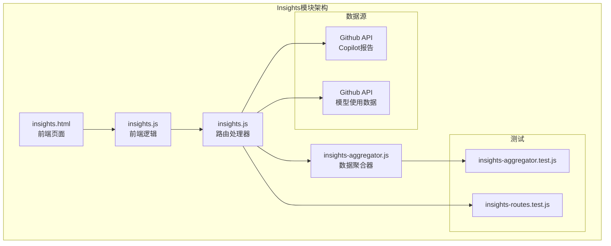
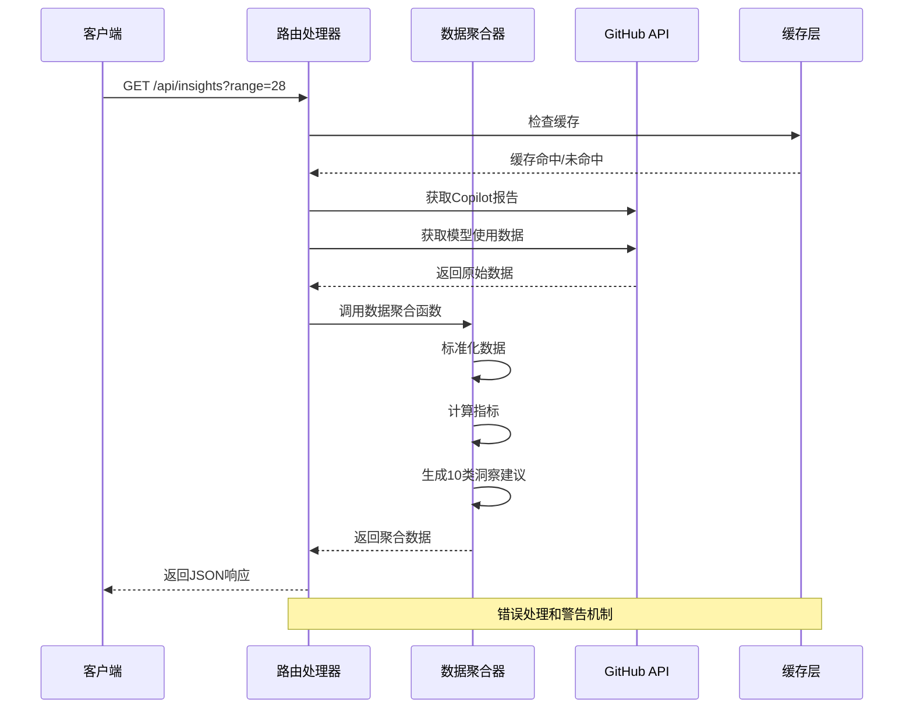
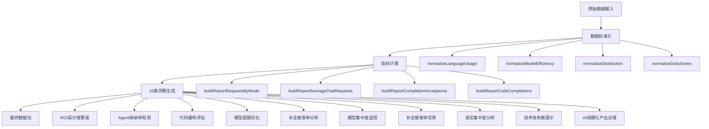
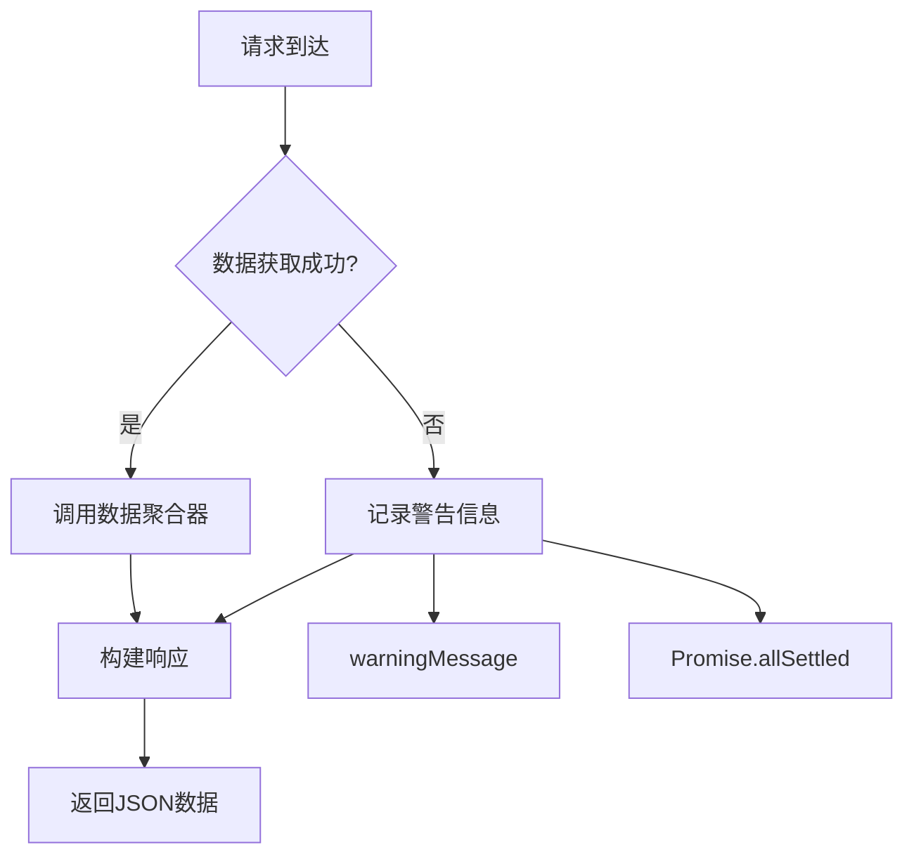
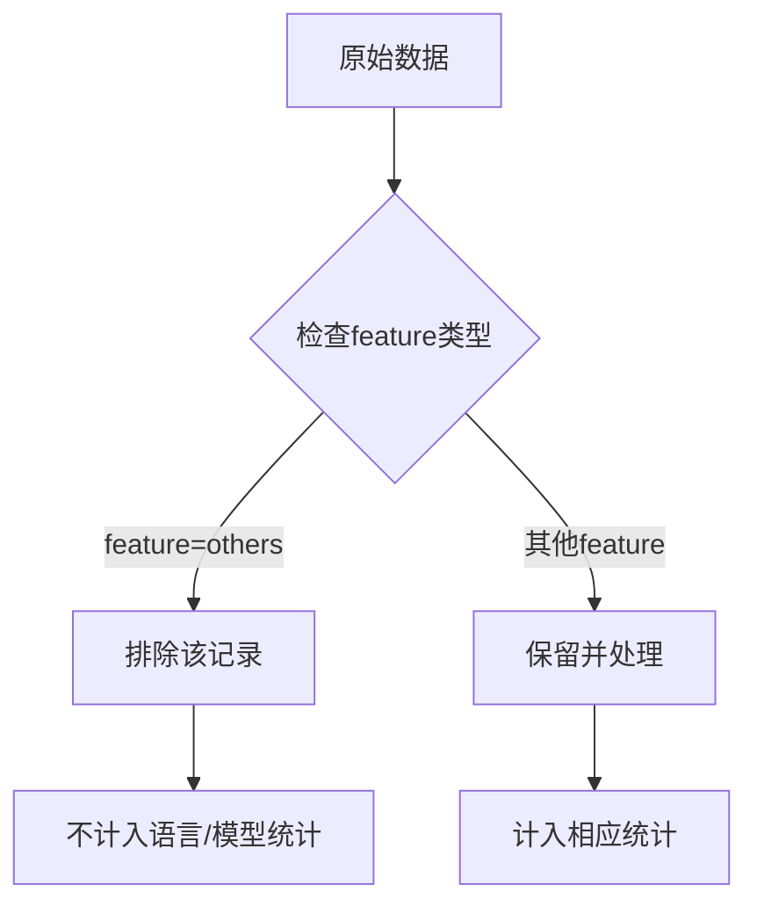
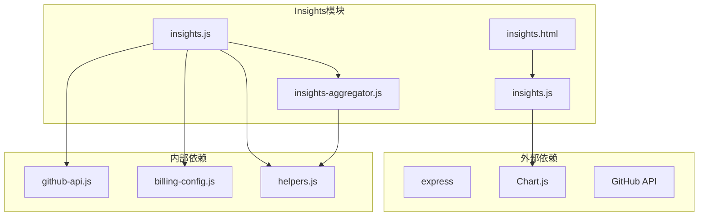

# Insights数据聚合模块

<cite>
**本文档引用的文件**
- [insights-aggregator.js](file://lib/insights-aggregator.js)
- [insights.js](file://routes/insights.js)
- [insights.html](file://public/insights.html)
- [insights.js](file://public/insights.js)
- [insights-aggregator.test.js](file://test/insights-aggregator.test.js)
- [insights-routes.test.js](file://test/insights-routes.test.js)
- [README.md](file://README.md)
- [server.js](file://server.js)
- [package.json](file://package.json)
</cite>

## 更新摘要
**变更内容**
- 新增完整的Copilot Insights仪表板功能
- 添加数据聚合器模块(lib/insights-aggregator.js)实现
- 新建路由系统(routes/insights.js)处理API请求
- 开发前端页面(public/insights.html, public/insights.js)提供可视化界面
- 创建完整的测试套件(test/insights-aggregator.test.js, test/insights-routes.test.js)
- 集成智能洞察引擎和业务规则推荐系统
- **大幅增强** 规则引擎从4个扩展到10个推荐类型，包括Agent采用率差距检测、完成接受率分析、模型集中风险等新功能
- **新增** GitHub报表others桶过滤功能，确保数据准确性与GitHub UI对齐

## 目录
1. [简介](#简介)
2. [项目结构](#项目结构)
3. [核心组件](#核心组件)
4. [架构概览](#架构概览)
5. [详细组件分析](#详细组件分析)
6. [依赖关系分析](#依赖关系分析)
7. [性能考虑](#性能考虑)
8. [故障排查指南](#故障排查指南)
9. [结论](#结论)

## 简介

Insights数据聚合模块是Copilot Enterprise Usage Display项目中的核心分析组件，负责将GitHub Copilot的企业级使用数据转换为可理解的洞察报告。该模块实现了完整的数据聚合、归一化和智能洞察生成功能，为管理员提供关于Copilot使用情况的深度分析。

该模块主要包含以下功能：
- 数据源聚合：从GitHub API获取Copilot使用报告和模型使用数据
- 数据标准化：将不同格式的数据统一转换为标准结构
- 指标计算：计算活跃用户、Agent采用率、代码生成效率等关键指标
- 智能洞察：基于阈值规则生成优化建议和最佳实践指导
- 可视化准备：生成前端图表所需的标准化数据结构

**大幅增强** 规则引擎现已支持10种不同类型的业务洞察，涵盖ROI优化、Agent采用率差距检测、代码重构评估、模型配额优化、补全接受率分析、模型集中度监控、语言分布分析、技术栈平衡检查以及AI规模化产出治理等多个维度。**新增** GitHub报表others桶过滤功能，确保数据准确性与GitHub UI对齐。

**章节来源**
- [README.md:617-622](file://README.md#L617-L622)

## 项目结构

Insights模块在项目中的组织结构如下：

**图表来源**
- [insights.html:1-81](file://public/insights.html#L1-L81)
- [insights.js:1-263](file://public/insights.js#L1-L263)
- [insights.js:1-129](file://routes/insights.js#L1-L129)
- [insights-aggregator.js:1-671](file://lib/insights-aggregator.js#L1-L671)

**章节来源**
- [README.md:617-622](file://README.md#L617-L622)
- [server.js:179-181](file://server.js#L179-L181)

## 核心组件

### 数据聚合器 (insights-aggregator.js)

数据聚合器是整个Insights模块的核心，负责将原始数据转换为标准化的洞察报告。它包含以下主要功能：

#### 数据标准化函数
- `normalizeLanguageUsage`: 标准化语言使用数据
- `normalizeModelEfficiency`: 标准化模型效率数据
- `normalizeDistribution`: 标准化分布数据
- `normalizeDailySeries`: 标准化每日系列数据

#### 指标计算函数
- `buildReportRequestsByMode`: 计算各聊天模式的请求分布
- `buildReportAverageChatRequests`: 计算平均聊天请求数
- `buildReportCompletionAcceptance`: 计算代码补全接受率
- `buildReportCodeCompletions`: 计算代码补全统计数据

#### 智能洞察引擎
- `generateInsightRecommendations`: 基于阈值规则生成洞察建议
- `buildAgentAdoption`: 计算Agent采用率
- `buildReportAgentAdoption`: 从报告数据计算Agent采用率

**大幅增强** 智能洞察规则引擎现已支持10种不同类型的业务洞察，包括：
1. **ROI高价值警报** - 深度Agent研发模式检测
2. **Agent采纳率偏低** - 能力未规模化落地预警
3. **代码资产重构评估** - 大量删除即重构信号识别
4. **模型配额优化** - Agent模式下模型表现分化分析
5. **补全接受率偏低** - 上下文或建议质量影响信任度检测
6. **模型集中度偏高** - 单点依赖与成本波动风险预警
7. **补全接受率优秀** - 可作为最佳实践样板识别
8. **语言集中度偏高** - 单一语言主导分析
9. **技术栈失衡提示** - 核心语言高、TypeScript低检测
10. **AI规模化产出治理** - 变更量达规模化水平预警

**新增** `isOthersFeature()` 函数用于排除GitHub合成的'others'桶，确保数据准确性与GitHub UI对齐。

**章节来源**
- [insights-aggregator.js:1-671](file://lib/insights-aggregator.js#L1-L671)

### 路由处理器 (routes/insights.js)

路由处理器负责处理前端的Insights请求，协调数据获取和聚合过程：

#### 主要功能
- `downloadMetricsReport`: 下载并解析Copilot指标报告
- `fetchLiveSources`: 获取实时数据源
- `buildInsightsPayload`: 构建最终的Insights数据包
- `parseRange`: 解析时间范围参数

#### 数据源管理
- GitHub Copilot企业级报告API
- 模型使用API
- 错误处理和警告机制

**更新** 新增对GitHub AI Credit使用API的支持，提供模型使用数据补充。

**章节来源**
- [insights.js:1-129](file://routes/insights.js#L1-L129)

### 前端界面 (public/insights.js)

前端界面提供了丰富的可视化展示，包含多种图表类型：

#### 图表组件
- **用户活跃度图表**: 日活跃用户、周活跃用户趋势
- **聊天模式分析**: 各种聊天模式的使用分布
- **代码补全分析**: 补全建议和接受率统计
- **模型效率对比**: 不同模型的吞吐量和接受率对比
- **语言使用分布**: 各编程语言的使用情况

#### 交互功能
- 时间范围切换 (7/28/90天)
- 图表自适应和缩放
- 实时数据刷新
- 响应式布局设计

**更新** 新增双Tab界面设计，包含Copilot IDE Usage和Code Generation两个分析面板，提供更全面的洞察分析。

**章节来源**
- [insights.html:1-81](file://public/insights.html#L1-L81)
- [insights.js:1-263](file://public/insights.js#L1-L263)

## 架构概览

Insights模块采用了清晰的分层架构，确保了良好的可维护性和扩展性：

**图表来源**
- [insights.js:107-118](file://routes/insights.js#L107-L118)
- [insights-aggregator.js:530-646](file://lib/insights-aggregator.js#L530-L646)

### 数据流处理

Insights模块的数据处理流程包括以下几个关键步骤：

1. **数据获取**: 从GitHub API获取Copilot使用报告和模型使用数据
2. **数据标准化**: 将不同格式的数据转换为统一的标准结构
3. **指标计算**: 计算各种业务指标和统计数据
4. **洞察生成**: 基于10类阈值规则生成智能建议
5. **数据包装**: 将结果包装为前端友好的格式

**大幅增强** 智能洞察引擎现支持10种业务规则类型，涵盖AI工具采用率、代码生成效率、模型使用优化、技术栈平衡、规模化产出治理等多个方面。**新增** others桶过滤逻辑，确保数据准确性与GitHub UI对齐。

**章节来源**
- [insights-aggregator.js:530-646](file://lib/insights-aggregator.js#L530-L646)

## 详细组件分析

### 数据聚合器深度分析

数据聚合器实现了复杂的业务逻辑，包含多个专门的数据处理函数：

#### 核心数据处理函数

**图表来源**
- [insights-aggregator.js:10-671](file://lib/insights-aggregator.js#L10-L671)

#### 智能洞察规则引擎

洞察引擎基于预定义的10类业务规则生成优化建议：

| 规则类型 | 触发条件 | 严重级别 | 建议内容 |
|---------|---------|---------|---------|
| ROI高价值警报 | Agent采用率>70%，Agent贡献>40% | 高 | 建议进行进阶Agent培训和模板沉淀 |
| Agent采纳率偏低 | Agent采用率<30%且活跃用户>0 | 中 | 建议开展Agent模式实操培训与内部案例分享 |
| 代码资产重构评估 | 平均Agent删除行数>400 | 中 | 建议结合CI/CD的单元测试覆盖率评估重构安全性 |
| 模型配额优化 | 多个Agent模型存在差异 | 中 | 建议将复杂Agent模式的底层模型优先分配给高吞吐模型 |
| 补全接受率偏低 | 补全接受率<20%且建议数>=50 | 中 | 建议完善copilot-instructions.md上下文和优化提示词 |
| 模型集中度偏高 | 单模型占比>60% | 中 | 建议按任务类型评估多模型分配策略 |
| 补全接受率优秀 | 补全接受率>=35% | 低 | 建议沉淀当前高接受率团队的最佳实践 |
| 语言集中度偏高 | 单一语言占比>50% | 低 | 建议针对主力语言沉淀提示词模板 |
| 技术栈失衡提示 | 核心语言高但TypeScript<10% | 低 | 建议为前端团队配置统一的提示词上下文 |
| AI规模化产出治理 | AI参与变更量>100000行 | 低 | 建议强化AI生成代码的评审、测试覆盖与安全扫描门禁 |

**大幅增强** 规则引擎从原有的4个类型扩展到10个类型，新增了Agent采用率差距检测、补全接受率分析、模型集中度监控、技术栈平衡检查、AI规模化产出治理等新功能。

**章节来源**
- [insights-aggregator.js:383-528](file://lib/insights-aggregator.js#L383-L528)

### 路由处理器分析

路由处理器负责协调整个数据获取和处理流程：

#### 错误处理机制

**图表来源**
- [insights.js:83-88](file://routes/insights.js#L83-L88)

#### 数据源协调

路由处理器同时处理多个数据源，确保即使部分API不可用也能提供部分数据：

- **Copilot使用报告**: 从GitHub API获取28天企业级报告
- **模型使用数据**: 从AI信用使用API获取模型使用情况
- **错误降级**: 当API不可用时提供警告而非完全失败

**更新** 新增对GitHub AI Credit使用API的支持，提供模型使用数据补充。

**章节来源**
- [insights.js:61-102](file://routes/insights.js#L61-L102)

### 前端可视化组件

前端界面提供了丰富的图表展示和交互功能：

#### 图表类型和用途

| 图表类型 | 数据来源 | 展示内容 |
|---------|---------|---------|
| 日活跃用户趋势 | usage.daily_active_users | Copilot日活跃用户变化 |
| 周活跃用户趋势 | usage.weekly_active_users | Copilot周活跃用户变化 |
| 平均聊天请求数 | usage.average_chat_requests | 每活跃用户的平均聊天请求数 |
| 聊天模式分布 | usage.requests_per_chat_mode | 各聊天模式的请求分布 |
| 代码补全统计 | usage.code_completions | 补全建议和接受数量 |
| 接受率趋势 | usage.completion_acceptance_rate | 代码补全接受率变化 |
| 模型使用分布 | usage.chat_model_usage | 各模型的使用分布 |
| 语言使用分布 | usage.language_usage | 各编程语言的使用分布 |
| 模型效率对比 | codeGeneration.model_efficiency | 不同模型的效率对比 |

**更新** 新增双Tab界面设计，包含Copilot IDE Usage和Code Generation两个分析面板，提供更全面的洞察分析。

**章节来源**
- [insights.html:39-74](file://public/insights.html#L39-L74)
- [insights.js:139-204](file://public/insights.js#L139-L204)

### Others桶过滤机制

**新增** 为了确保数据准确性与GitHub UI对齐，数据聚合器新增了专门的others桶过滤机制：

#### 过滤逻辑

GitHub的28天报表会将长尾`(language|model) × feature`组合汇总成一个合成的`feature=others`（并配`language/model=others`）兜底桶，其中混入了`agent_edit`/`copilot_cli`的删除活动。这个伪桶必须从按语言、按模型的分解图表中排除。

#### 过滤函数

**图表来源**
- [insights-aggregator.js:143-145](file://lib/insights-aggregator.js#L143-L145)

#### 应用范围

以下函数都应用了相同的过滤逻辑：
- `buildReportCodeChangesByModel`: 排除others桶的模型统计
- `buildReportCodeChangesByLanguage`: 排除others桶的语言统计  
- `buildReportLanguageUsage`: 排除others桶的语言使用统计
- `buildReportChatModelUsage`: 排除others桶的模型使用统计
- `buildReportModelEfficiency`: 排除others桶的模型效率统计

**新增** others桶过滤功能，确保数据准确性与GitHub UI对齐。该功能已在测试中得到验证，真实企业报表数据下各图表均不再出现others桶。

**章节来源**
- [insights-aggregator.js:251-291](file://lib/insights-aggregator.js#L251-L291)
- [insights-aggregator.js:293-350](file://lib/insights-aggregator.js#L293-L350)
- [insights-aggregator.test.js:269-302](file://test/insights-aggregator.test.js#L269-L302)

## 依赖关系分析

Insights模块的依赖关系相对简单，主要依赖于GitHub API和内部工具函数：

**图表来源**
- [package.json:12-26](file://package.json#L12-L26)
- [server.js:150-162](file://server.js#L150-L162)

### 关键依赖说明

| 依赖模块 | 用途 | 版本 |
|---------|------|------|
| express | Web框架 | ^4.19.2 |
| chart.js | 图表可视化 | ^4.0 |
| github-api | GitHub API封装 | 内部模块 |
| helpers | 通用辅助函数 | 内部模块 |
| billing-config | 计费配置 | 内部模块 |

**更新** 新增对Chart.js的依赖，用于前端图表可视化展示。

**章节来源**
- [package.json:12-26](file://package.json#L12-L26)

## 性能考虑

Insights模块在设计时充分考虑了性能优化：

### 缓存策略
- **内存缓存**: 5分钟TTL的短期缓存
- **持久缓存**: SQLite数据库的长期缓存
- **ETag缓存**: 条件请求优化
- **单飞行去重**: 避免重复请求

### 数据处理优化
- **异步处理**: 使用Promise.allSettled并行获取数据
- **错误降级**: 部分API失败不影响整体功能
- **数据压缩**: 前端图表数据的高效传输
- **懒加载**: 图表按需渲染

### 性能监控
- **响应时间监控**: 记录API调用耗时
- **缓存命中率**: 显示缓存使用效率
- **错误率统计**: 监控API可用性

**更新** 新增对GitHub API的并行处理优化，提高数据获取效率。

## 故障排查指南

### 常见问题和解决方案

#### API连接问题
**症状**: Insights页面显示警告信息
**原因**: GitHub API不可用或认证失败
**解决方案**:
1. 检查GITHUB_TOKEN配置
2. 验证企业管理员权限
3. 确认网络连接正常
4. 查看API响应状态码

#### 数据不完整
**症状**: 部分图表显示空白或数据不准确
**原因**: GitHub Billing API延迟或数据不完整
**解决方案**:
1. 等待24-48小时数据更新
2. 使用强制刷新功能
3. 检查COPILOT_START_DATE配置
4. 验证数据完整性检查

#### 性能问题
**症状**: 页面加载缓慢或图表渲染卡顿
**原因**: 大量数据处理或网络延迟
**解决方案**:
1. 检查缓存配置
2. 减少同时打开的标签页
3. 清理浏览器缓存
4. 优化网络连接

**更新** 新增对GitHub AI Credit API的错误处理机制，提供部分数据降级支持。**新增** others桶过滤功能的故障排查，确保数据准确性。

#### Others桶异常问题
**症状**: 语言/模型图表中出现others桶或数值异常
**原因**: GitHub报表中的合成others桶未被正确过滤
**解决方案**:
1. 确认isOthersFeature()函数正常工作
2. 检查过滤逻辑是否正确应用到所有相关函数
3. 验证测试用例是否通过
4. 查看真实企业报表数据验证

#### 规则引擎问题
**症状**: 洞察建议不触发或触发不正确
**原因**: 阈值设置不当或数据格式问题
**解决方案**:
1. 检查10类规则的触发条件
2. 验证输入数据的完整性和准确性
3. 查看日志输出了解规则执行过程
4. 使用测试用例验证规则逻辑

**章节来源**
- [insights.js:26-29](file://routes/insights.js#L26-L29)
- [README.md:617-622](file://README.md#L617-L622)

### 调试技巧

1. **启用详细日志**: 设置LOG_LEVEL=debug查看详细信息
2. **检查API响应**: 使用浏览器开发者工具查看网络请求
3. **验证数据格式**: 确保GitHub API返回的数据格式正确
4. **测试缓存**: 验证缓存机制是否正常工作
5. **验证过滤逻辑**: 确认others桶过滤功能正常工作
6. **测试规则引擎**: 使用测试用例验证10类规则的触发逻辑

## 结论

Insights数据聚合模块是一个设计精良的企业级数据分析组件，具有以下特点：

### 优势
- **模块化设计**: 清晰的分层架构便于维护和扩展
- **智能洞察**: 基于10类业务规则的自动化建议生成
- **容错性强**: 部分API失败不影响整体功能
- **性能优化**: 多层缓存和异步处理机制
- **可视化丰富**: 多种图表类型满足不同分析需求
- **数据准确性**: 通过others桶过滤确保与GitHub UI对齐
- **全面覆盖**: 10类规则涵盖ROI优化、Agent采用率、代码重构、模型优化、补全接受率、模型集中度、语言分布、技术栈平衡、规模化产出等各个方面

### 应用场景
- Copilot使用情况监控
- 团队生产力分析
- AI工具采用率评估
- 代码生成效率优化
- 技术栈使用趋势分析
- 模型使用策略优化
- AI规模化产出治理

### 发展方向
- 增加更多业务指标和洞察规则
- 支持更多数据源和API
- 优化移动端用户体验
- 增强数据导出和报告功能
- 扩展多租户支持能力

**大幅增强** 规则引擎现已支持10种不同类型的业务洞察，为企业用户提供全面的AI工具使用洞察分析能力。**新增** others桶过滤功能，确保数据准确性与GitHub UI对齐。

该模块为Copilot Enterprise用户提供了强大的数据分析和洞察生成功能，是企业级Copilot管理的重要工具。通过10类智能规则，能够自动识别团队在AI工具使用过程中的各种问题并提供针对性的优化建议，显著提升团队协作效率和代码质量。