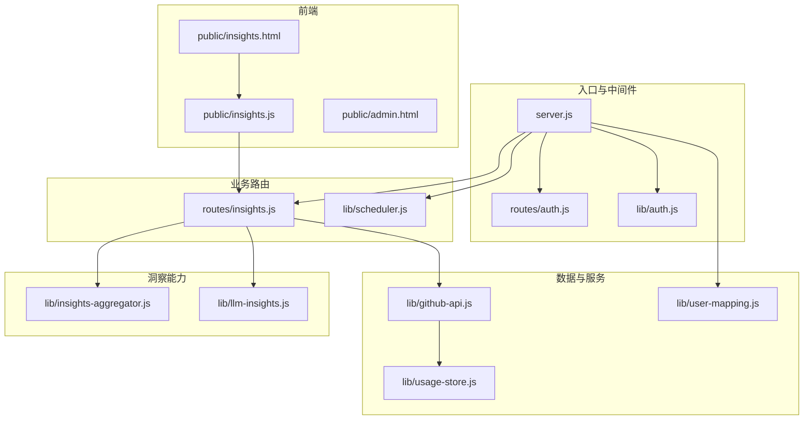
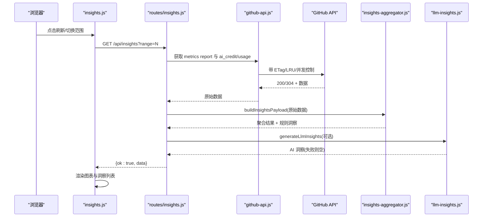
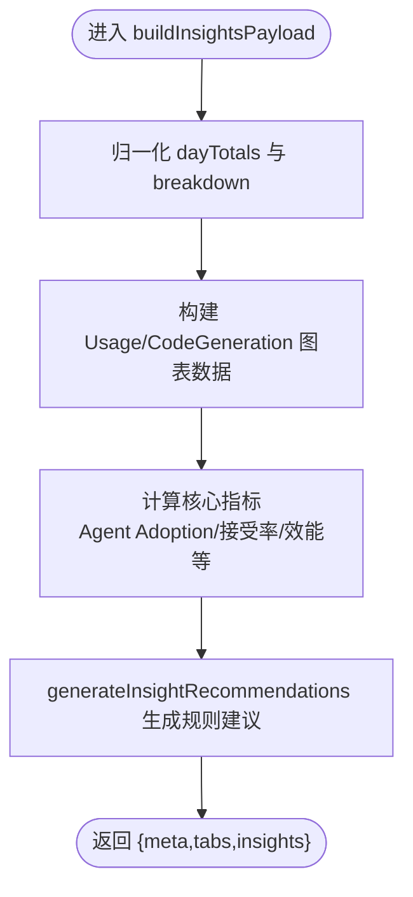
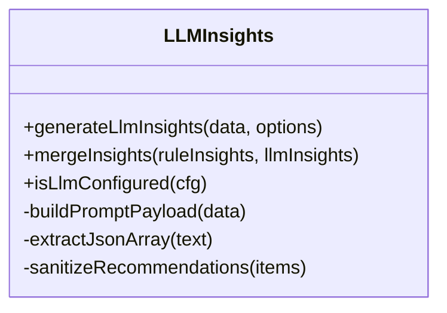
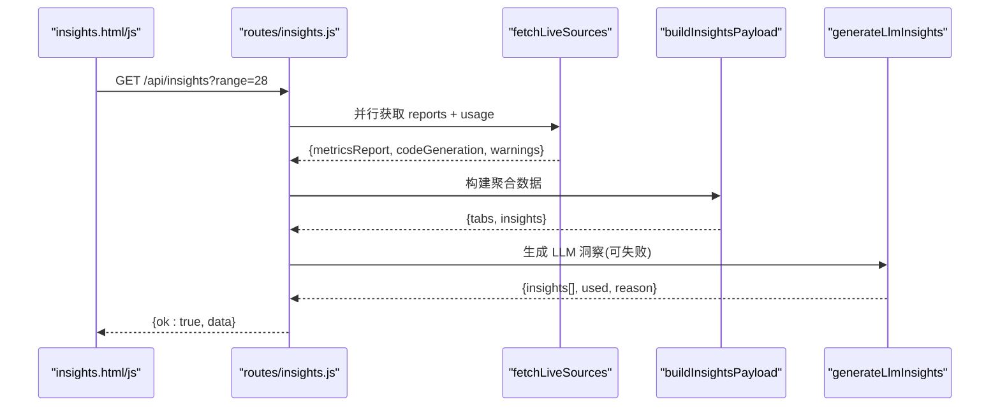
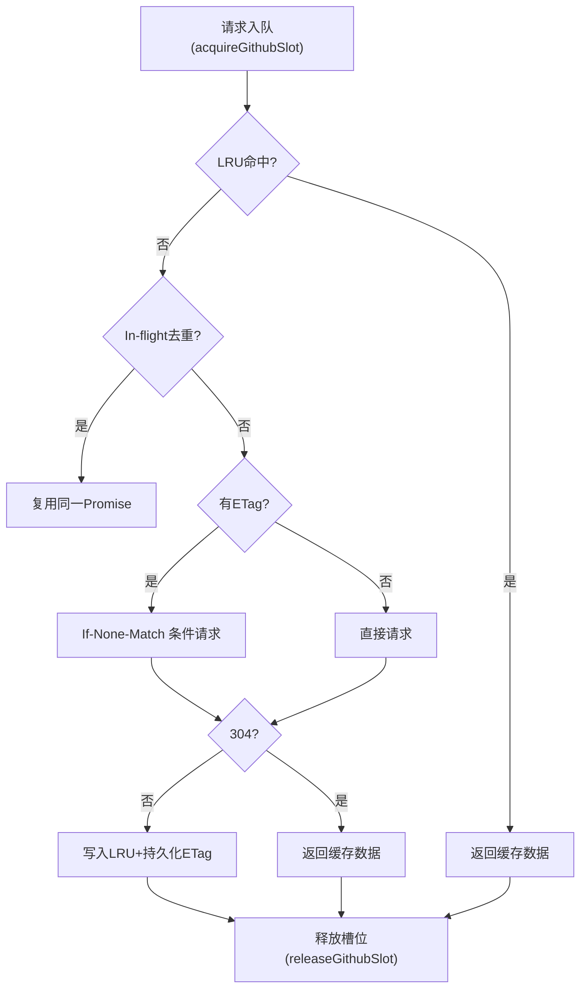
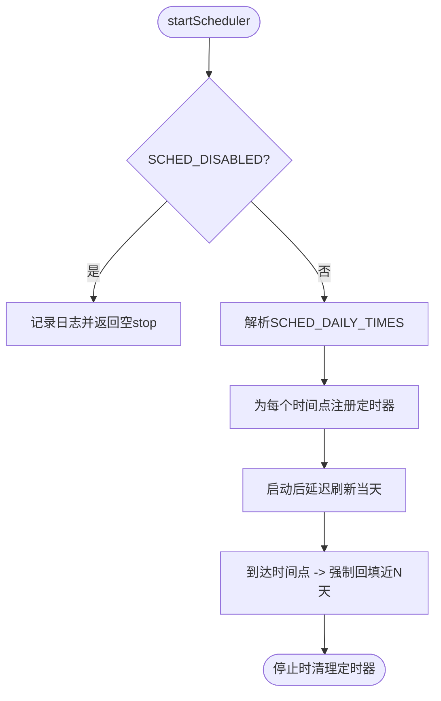
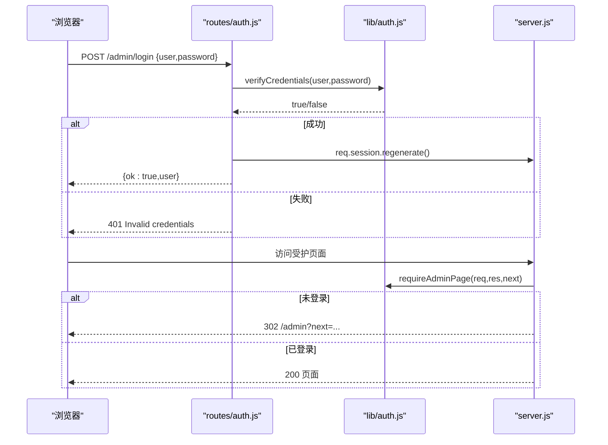
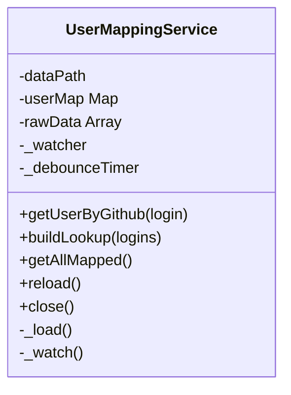
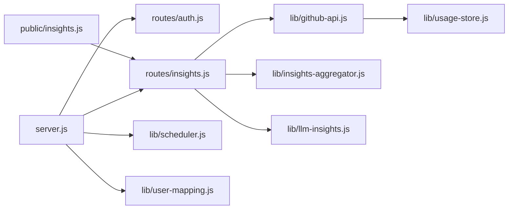

# LLM智能洞察系统

<cite>
**本文引用的文件**   
- [server.js](file://server.js)
- [README.md](file://README.md)
- [package.json](file://package.json)
- [lib/llm-insights.js](file://lib/llm-insights.js)
- [lib/insights-aggregator.js](file://lib/insights-aggregator.js)
- [routes/insights.js](file://routes/insights.js)
- [public/insights.html](file://public/insights.html)
- [public/insights.js](file://public/insights.js)
- [lib/github-api.js](file://lib/github-api.js)
- [lib/usage-store.js](file://lib/usage-store.js)
- [lib/auth.js](file://lib/auth.js)
- [routes/auth.js](file://routes/auth.js)
- [public/admin.html](file://public/admin.html)
- [lib/scheduler.js](file://lib/scheduler.js)
- [lib/user-mapping.js](file://lib/user-mapping.js)
</cite>

## 目录
1. [简介](#简介)
2. [项目结构](#项目结构)
3. [核心组件](#核心组件)
4. [架构总览](#架构总览)
5. [详细组件分析](#详细组件分析)
6. [依赖关系分析](#依赖关系分析)
7. [性能考量](#性能考量)
8. [故障排查指南](#故障排查指南)
9. [结论](#结论)
10. [附录](#附录)

## 简介
本系统为面向 GitHub Enterprise 管理员的“LLM 智能洞察”与用量可视化平台，提供：
- Copilot Insights 看板（Usage + Code Generation 双 Tab）
- 基于规则引擎与可选 LLM 的动态洞察建议
- 三层缓存、并发控制、ETag 条件请求与自动刷新调度
- 后台管理、访问控制与审计日志
- 多计费模型兼容（legacy_pru / ai_credits / auto）

## 项目结构
后端采用模块化分层架构：入口层（Express）、路由层、服务层（GitHub API 封装、持久化、调度器、鉴权等），前端通过 IIFE + 公共命名空间组织。Insights 页面由独立 HTML/JS 渲染图表并调用聚合接口。

图示来源
- [server.js:149-162](file://server.js#L149-L162)
- [routes/insights.js:105-129](file://routes/insights.js#L105-L129)
- [lib/github-api.js:237-275](file://lib/github-api.js#L237-L275)
- [lib/usage-store.js:10-20](file://lib/usage-store.js#L10-L20)
- [lib/insights-aggregator.js:530-646](file://lib/insights-aggregator.js#L530-L646)
- [lib/llm-insights.js:83-124](file://lib/llm-insights.js#L83-L124)
- [public/insights.html:1-81](file://public/insights.html#L1-L81)
- [public/insights.js:235-244](file://public/insights.js#L235-L244)
- [lib/auth.js:44-56](file://lib/auth.js#L44-L56)
- [routes/auth.js:14-61](file://routes/auth.js#L14-L61)
- [public/admin.html:157-206](file://public/admin.html#L157-L206)
- [lib/scheduler.js:54-157](file://lib/scheduler.js#L54-L157)
- [lib/user-mapping.js:7-22](file://lib/user-mapping.js#L7-L22)

章节来源
- [README.md:57-118](file://README.md#L57-L118)
- [package.json:1-28](file://package.json#L1-L28)

## 核心组件
- 洞察聚合器：将 GitHub Copilot Metrics Report 与 usage 明细归一化为统一指标与图表数据，并生成规则类洞察建议。
- LLM 动态洞察：在配置齐全时调用 OpenAI 兼容接口生成自然语言优化建议，失败或超时自动回退到规则引擎。
- GitHub API 基础设施：并发队列、指数退避重试、LRU 内存缓存、ETag 条件请求与 in-flight 去重。
- 持久化存储：SQLite 表用于 daily_usage、seats_snapshot、etag_cache、monthly_bill 等。
- 调度器：启动后延迟刷新当天；定时点强制回填近 N 天。
- 鉴权与会话：bcrypt 校验、会话固定防护、受护页面守卫。
- 用户映射：fs.watch + debounce 热重载，支持 AD 名优先展示。

章节来源
- [lib/insights-aggregator.js:530-646](file://lib/insights-aggregator.js#L530-L646)
- [lib/llm-insights.js:83-124](file://lib/llm-insights.js#L83-L124)
- [lib/github-api.js:237-275](file://lib/github-api.js#L237-L275)
- [lib/usage-store.js:24-87](file://lib/usage-store.js#L24-L87)
- [lib/scheduler.js:54-157](file://lib/scheduler.js#L54-L157)
- [lib/auth.js:21-37](file://lib/auth.js#L21-L37)
- [lib/user-mapping.js:98-116](file://lib/user-mapping.js#L98-L116)

## 架构总览
系统以 Express 为入口，挂载鉴权与业务路由；Insights 路由负责拉取 GitHub 报告与 usage 明细，经聚合器生成结构化数据，再并行触发 LLM 洞察（可降级）。前端使用 Chart.js 渲染多维图表与洞察列表。

图示来源
- [routes/insights.js:108-126](file://routes/insights.js#L108-L126)
- [lib/github-api.js:237-275](file://lib/github-api.js#L237-L275)
- [lib/insights-aggregator.js:530-646](file://lib/insights-aggregator.js#L530-L646)
- [lib/llm-insights.js:83-124](file://lib/llm-insights.js#L83-L124)
- [public/insights.js:235-244](file://public/insights.js#L235-L244)

## 详细组件分析

### 洞察聚合器（规则引擎）
职责：
- 解析 GitHub 28 天报表 day_totals，按 feature/mode/language/model 维度聚合
- 计算 Agent adoption、补全接受率、模型效能、语言分布等指标
- 输出两类图表数据（Usage / Code Generation）与规则洞察建议

关键流程（简化）：

图示来源
- [lib/insights-aggregator.js:530-646](file://lib/insights-aggregator.js#L530-L646)
- [lib/insights-aggregator.js:383-528](file://lib/insights-aggregator.js#L383-L528)

章节来源
- [lib/insights-aggregator.js:1-164](file://lib/insights-aggregator.js#L1-L164)
- [lib/insights-aggregator.js:530-646](file://lib/insights-aggregator.js#L530-L646)

### LLM 动态洞察
职责：
- 读取环境变量配置，构造提示词，调用 OpenAI 兼容 chat/completions
- 对返回 JSON 数组进行清洗与严重度归一化
- 与规则建议合并排序，失败/超时自动回退

图示来源
- [lib/llm-insights.js:83-124](file://lib/llm-insights.js#L83-L124)
- [lib/llm-insights.js:126-130](file://lib/llm-insights.js#L126-L130)
- [lib/llm-insights.js:22-34](file://lib/llm-insights.js#L22-L34)

章节来源
- [lib/llm-insights.js:1-139](file://lib/llm-insights.js#L1-L139)

### Insights 路由与前端
- 路由：解析 range，拉取 live sources，调用聚合器，并行触发 LLM，合并洞察并返回。
- 前端：选择时间范围与 Tab，调用 /api/insights，渲染指标卡片、Chart.js 图表与洞察列表。

图示来源
- [routes/insights.js:62-103](file://routes/insights.js#L62-L103)
- [routes/insights.js:108-126](file://routes/insights.js#L108-L126)
- [public/insights.js:235-244](file://public/insights.js#L235-L244)
- [public/insights.html:34-73](file://public/insights.html#L34-L73)

章节来源
- [routes/insights.js:1-137](file://routes/insights.js#L1-L137)
- [public/insights.html:1-81](file://public/insights.html#L1-L81)
- [public/insights.js:1-267](file://public/insights.js#L1-L267)

### GitHub API 基础设施
职责：
- 并发队列限制最大并发数
- 指数退避重试与速率限制处理
- LRU 内存缓存 + ETag 条件请求 + In-flight 去重
- 持久化 ETag 至 SQLite，重启恢复

图示来源
- [lib/github-api.js:23-48](file://lib/github-api.js#L23-L48)
- [lib/github-api.js:63-110](file://lib/github-api.js#L63-L110)
- [lib/github-api.js:114-174](file://lib/github-api.js#L114-L174)
- [lib/github-api.js:176-233](file://lib/github-api.js#L176-L233)
- [lib/github-api.js:237-275](file://lib/github-api.js#L237-L275)
- [lib/usage-store.js:249-286](file://lib/usage-store.js#L249-L286)

章节来源
- [lib/github-api.js:1-334](file://lib/github-api.js#L1-L334)
- [lib/usage-store.js:1-333](file://lib/usage-store.js#L1-L333)

### 调度器与自动刷新
职责：
- 启动后延迟刷新当天
- 每日指定时间点强制回填今天 + 最近 N 天
- 支持关闭与自定义时间点

图示来源
- [lib/scheduler.js:54-157](file://lib/scheduler.js#L54-L157)

章节来源
- [lib/scheduler.js:1-160](file://lib/scheduler.js#L1-L160)

### 鉴权与会话
职责：
- bcrypt 校验管理员凭据
- 登录成功后再生成 session ID 防固定攻击
- 页面守卫返回 302 重定向，API 守卫返回 401

图示来源
- [routes/auth.js:17-41](file://routes/auth.js#L17-L41)
- [lib/auth.js:21-37](file://lib/auth.js#L21-L37)
- [lib/auth.js:44-56](file://lib/auth.js#L44-L56)
- [server.js:44-65](file://server.js#L44-L65)
- [public/admin.html:167-199](file://public/admin.html#L167-L199)

章节来源
- [lib/auth.js:1-63](file://lib/auth.js#L1-L63)
- [routes/auth.js:1-62](file://routes/auth.js#L1-L62)
- [server.js:44-65](file://server.js#L44-L65)
- [public/admin.html:157-206](file://public/admin.html#L157-L206)

### 用户映射服务
职责：
- 从 data/user_mapping.json 加载映射，fs.watch 监听变更并 debounce 热重载
- 提供按 GitHub 用户名查询 AD 信息、批量构建查找表等能力

图示来源
- [lib/user-mapping.js:7-22](file://lib/user-mapping.js#L7-L22)
- [lib/user-mapping.js:98-116](file://lib/user-mapping.js#L98-L116)
- [lib/user-mapping.js:118-137](file://lib/user-mapping.js#L118-L137)

章节来源
- [lib/user-mapping.js:1-173](file://lib/user-mapping.js#L1-L173)

## 依赖关系分析
- server.js 作为入口，挂载 auth、usage、billing、teams、costcenter、analytics、insights、user-mapping 等路由，并初始化 UsageStore、UserMappingService、ETag 缓存恢复与调度器。
- routes/insights.js 依赖 github-api、insights-aggregator、llm-insights。
- github-api 依赖 usage-store（ETag 持久化）与 logger。
- scheduler 依赖 usageRouter.forceRefreshDay 回调。
- 前端 insights.js 仅依赖后端 /api/insights 与 Chart.js。

图示来源
- [server.js:149-162](file://server.js#L149-L162)
- [routes/insights.js:105-129](file://routes/insights.js#L105-L129)
- [lib/github-api.js:319-333](file://lib/github-api.js#L319-L333)
- [lib/usage-store.js:10-20](file://lib/usage-store.js#L10-L20)
- [lib/scheduler.js:54-72](file://lib/scheduler.js#L54-L72)
- [public/insights.js:235-244](file://public/insights.js#L235-L244)

章节来源
- [server.js:1-250](file://server.js#L1-L250)
- [routes/insights.js:1-137](file://routes/insights.js#L1-L137)
- [lib/github-api.js:1-334](file://lib/github-api.js#L1-L334)
- [lib/usage-store.js:1-333](file://lib/usage-store.js#L1-L333)
- [lib/scheduler.js:1-160](file://lib/scheduler.js#L1-L160)
- [public/insights.js:1-267](file://public/insights.js#L1-L267)

## 性能考量
- 并发控制：GITHUB_MAX_CONCURRENT 限制外部 API 并发，避免限流与过载。
- 缓存策略：LRU 内存缓存（按路径 TTL）+ ETag 条件请求 + SQLite 持久化，减少无效调用。
- In-flight 去重：同参数并发请求复用 Promise，降低重复网络开销。
- 指数退避重试：针对 429/403/5xx 自动重试，结合 retry-after/resetAt 提升稳定性。
- 前端渲染：按需销毁/重建 Chart.js 实例，避免内存泄漏与重绘抖动。
- 自动刷新：调度器在低峰期回填历史数据，保障首屏新鲜度。

[本节为通用性能指导，不直接分析具体文件]

## 故障排查指南
常见问题与定位要点：
- LLM 不可用/超时：检查 LLM_URL、LLM_API_KEY、LLM_MODEL、LLM_ENABLED、LLM_TIMEOUT_MS；查看 meta.llm.used/reason 字段。
- GitHub 限流：关注 rateLimit 信息与重试日志；必要时调整 GITHUB_MAX_RETRIES/GITHUB_MAX_CONCURRENT。
- 数据不一致：使用按月强制刷新或按日 force=true 回源；确认 SQLite 中 daily_usage/monthly_bill 是否被覆盖。
- 鉴权失败：确认 ADMIN_USER/ADMIN_PASSWORD_HASH 已配置且哈希有效；生产环境需设置 SESSION_SECRET。
- 用户映射未生效：检查 data/user_mapping.json 格式与 fs.watch 错误日志；手动触发 reload。

章节来源
- [lib/llm-insights.js:83-124](file://lib/llm-insights.js#L83-L124)
- [lib/github-api.js:176-233](file://lib/github-api.js#L176-L233)
- [lib/usage-store.js:288-329](file://lib/usage-store.js#L288-L329)
- [lib/auth.js:21-37](file://lib/auth.js#L21-L37)
- [lib/user-mapping.js:98-116](file://lib/user-mapping.js#L98-L116)

## 结论
本系统通过“规则引擎 + 可选 LLM”的双通道洞察机制，结合高可用的 GitHub API 基础设施与多层缓存，提供了稳定、可扩展的 Copilot 洞察与用量可视化能力。配合后台管理与自动刷新调度，可满足企业级运维与治理需求。

[本节为总结性内容，不直接分析具体文件]

## 附录
- 环境变量参考与部署说明详见 README。
- 测试套件覆盖鉴权、聚合器、Insights 路由、日期工具、计费配置等模块。

章节来源
- [README.md:243-284](file://README.md#L243-L284)
- [package.json:1-28](file://package.json#L1-L28)