# 依赖注入一致性改进

<cite>
**本文档引用的文件**
- [server.js](file://server.js)
- [package.json](file://package.json)
- [lib/billing-config.js](file://lib/billing-config.js)
- [lib/github-api.js](file://lib/github-api.js)
- [lib/usage-store.js](file://lib/usage-store.js)
- [lib/user-mapping.js](file://lib/user-mapping.js)
- [lib/scheduler.js](file://lib/scheduler.js)
- [lib/helpers.js](file://lib/helpers.js)
- [routes/usage.js](file://routes/usage.js)
- [routes/billing.js](file://routes/billing.js)
- [routes/teams.js](file://routes/teams.js)
- [routes/costcenter.js](file://routes/costcenter.js)
- [routes/analytics.js](file://routes/analytics.js)
- [routes/user-mapping.js](file://routes/user-mapping.js)
- [routes/bill.js](file://routes/bill.js)
</cite>

## 目录
1. [简介](#简介)
2. [项目结构](#项目结构)
3. [核心组件](#核心组件)
4. [架构概览](#架构概览)
5. [详细组件分析](#详细组件分析)
6. [依赖注入分析](#依赖注入分析)
7. [性能考虑](#性能考虑)
8. [故障排除指南](#故障排除指南)
9. [结论](#结论)

## 简介

这是一个基于 Node.js 和 Express 的 GitHub Copilot 企业版使用量仪表板系统。该项目实现了完整的依赖注入模式，通过统一的服务容器向各个路由模块提供共享的业务服务实例。

该系统的核心目标是提供一个可视化的仪表板，用于监控和分析 GitHub Copilot 在企业环境中的使用情况，包括每日使用量、月度账单、成本中心管理和用户映射等功能。

## 项目结构

项目采用模块化架构设计，主要分为以下几个层次：

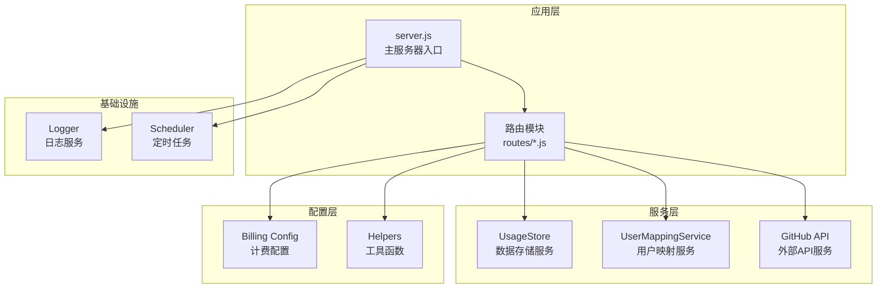

**图表来源**
- [server.js:1-182](file://server.js#L1-L182)
- [routes/usage.js:1-470](file://routes/usage.js#L1-L470)

**章节来源**
- [server.js:1-182](file://server.js#L1-L182)
- [package.json:1-26](file://package.json#L1-L26)

## 核心组件

### 服务容器初始化

系统在主入口文件中创建了统一的服务容器，包含以下核心服务：

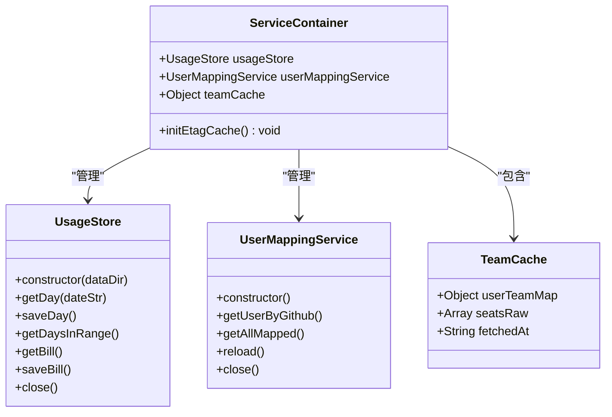

**图表来源**
- [server.js:40-52](file://server.js#L40-L52)
- [lib/usage-store.js:10-333](file://lib/usage-store.js#L10-L333)
- [lib/user-mapping.js:7-158](file://lib/user-mapping.js#L7-L158)

### 路由模块依赖注入

每个路由模块都遵循统一的依赖注入模式：

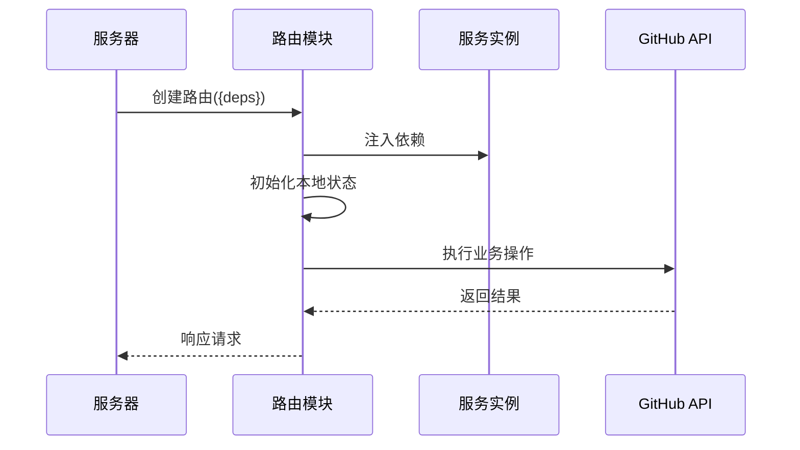

**图表来源**
- [server.js:88-99](file://server.js#L88-L99)
- [routes/usage.js:13-14](file://routes/usage.js#L13-L14)

**章节来源**
- [server.js:40-99](file://server.js#L40-L99)
- [lib/usage-store.js:10-333](file://lib/usage-store.js#L10-L333)
- [lib/user-mapping.js:7-158](file://lib/user-mapping.js#L7-L158)

## 架构概览

系统采用分层架构设计，实现了清晰的关注点分离：

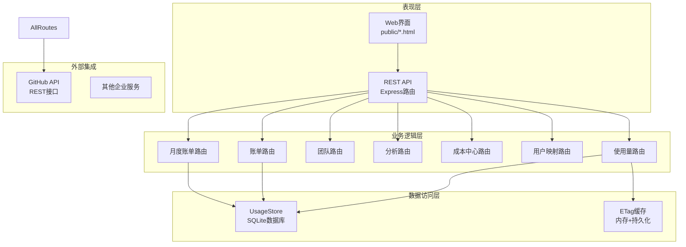

**图表来源**
- [server.js:88-99](file://server.js#L88-L99)
- [lib/usage-store.js:24-87](file://lib/usage-store.js#L24-L87)
- [lib/github-api.js:67-74](file://lib/github-api.js#L67-L74)

## 详细组件分析

### 使用量路由模块

使用量路由模块实现了复杂的依赖注入模式，提供了灵活的查询和刷新功能：

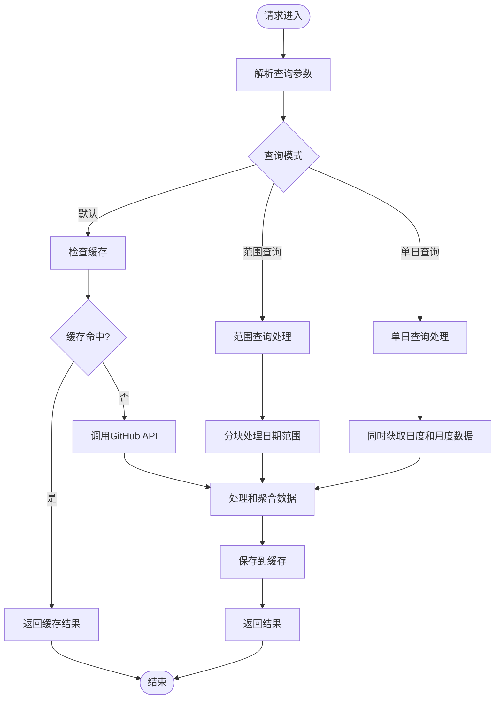

**图表来源**
- [routes/usage.js:378-462](file://routes/usage.js#L378-L462)
- [routes/usage.js:279-348](file://routes/usage.js#L279-L348)

#### 关键特性

1. **多级缓存策略**：内存缓存、SQLite 缓存和 ETag 缓存的三层缓存机制
2. **智能降级**：当 API 数据不完整时自动切换到用户级别的查询
3. **并发控制**：使用队列和去重机制避免重复请求
4. **数据完整性检查**：确保月度统计的准确性

**章节来源**
- [routes/usage.js:13-470](file://routes/usage.js#L13-L470)

### 账单路由模块

账单路由模块实现了企业级的计费计算功能：

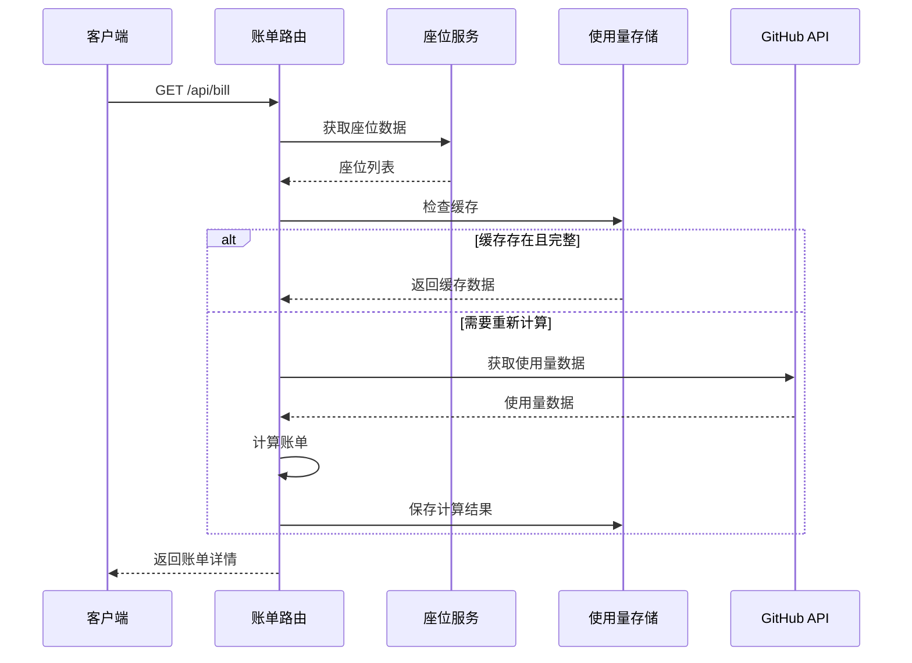

**图表来源**
- [routes/bill.js:237-322](file://routes/bill.js#L237-L322)
- [routes/bill.js:134-198](file://routes/bill.js#L134-L198)

#### 计费算法

系统实现了灵活的计费算法，支持不同的套餐类型：

| 套餐类型 | 包含配额 | 基础费用 | 超出单价 |
|---------|---------|---------|---------|
| Business | 300 请求/月 | $19 | $0.04/请求 |
| Enterprise | 1000 请求/月 | $39 | $0.04/请求 |

**章节来源**
- [routes/bill.js:134-198](file://routes/bill.js#L134-L198)
- [lib/billing-config.js:11-22](file://lib/billing-config.js#L11-L22)

### 用户映射服务

用户映射服务提供了 GitHub 用户名与企业 AD 用户名之间的映射功能：

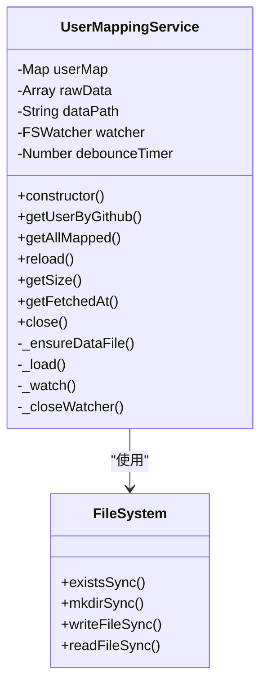

**图表来源**
- [lib/user-mapping.js:7-158](file://lib/user-mapping.js#L7-L158)

#### 自动重载机制

服务实现了智能的文件监控和自动重载功能：

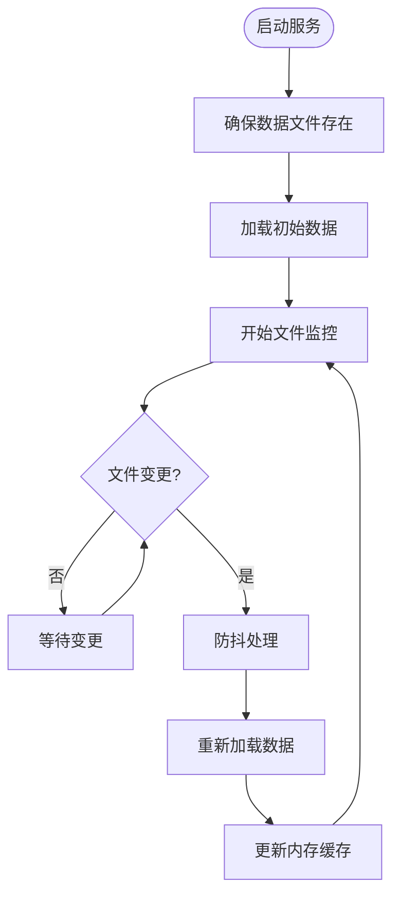

**图表来源**
- [lib/user-mapping.js:98-116](file://lib/user-mapping.js#L98-L116)
- [lib/user-mapping.js:140-154](file://lib/user-mapping.js#L140-L154)

**章节来源**
- [lib/user-mapping.js:7-158](file://lib/user-mapping.js#L7-L158)

## 依赖注入分析

### 依赖注入模式实现

系统采用了显式依赖注入模式，所有路由模块都通过工厂函数接收依赖参数：

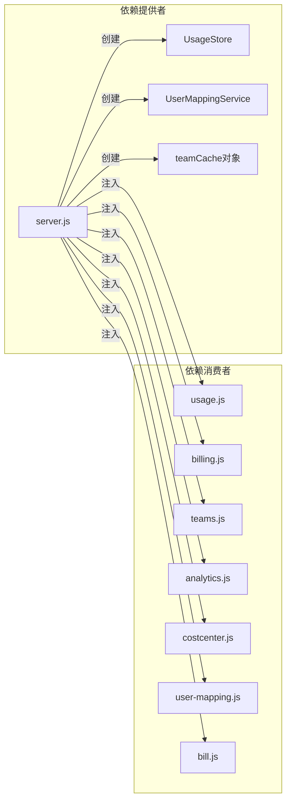

**图表来源**
- [server.js:88-99](file://server.js#L88-L99)
- [routes/usage.js:13](file://routes/usage.js#L13)
- [routes/billing.js:10](file://routes/billing.js#L10)

### 依赖注入的优势

1. **测试友好性**：可以轻松替换依赖进行单元测试
2. **解耦合**：路由模块不直接依赖具体实现
3. **可扩展性**：新增功能时不需要修改现有代码
4. **资源管理**：统一的生命周期管理

### 依赖注入的改进点

#### 当前实现的问题

1. **部分模块未完全遵循依赖注入**：某些模块仍然直接导入全局变量
2. **依赖传递复杂**：需要手动管理复杂的依赖关系
3. **类型安全缺失**：JavaScript 中缺乏编译时类型检查

#### 改进建议

```mermaid
graph TB
subgraph "改进后的依赖注入"
DIContainer[DI容器]
Factory[工厂模式]
Registry[注册表]
Resolver[解析器]
end
subgraph "服务定义"
UsageStore[UsageStore]
UserMapping[UserMappingService]
GitHubAPI[GitHub API]
Logger[Logger]
end
subgraph "服务注册"
Register1[register('usageStore', UsageStore)]
Register2[register('userMapping', UserMappingService)]
Register3[register('githubApi', GitHub API)]
Register4[register('logger', Logger)]
end
DIContainer --> Factory
Factory --> Registry
Registry --> Resolver
Register1 --> Registry
Register2 --> Registry
Register3 --> Registry
Register4 --> Registry
Resolver --> UsageStore
Resolver --> UserMapping
Resolver --> GitHubAPI
Resolver --> Logger
```

**图表来源**
- [server.js:88-99](file://server.js#L88-L99)

**章节来源**
- [server.js:88-99](file://server.js#L88-L99)
- [routes/usage.js:13-14](file://routes/usage.js#L13-L14)

## 性能考虑

### 缓存策略

系统实现了多层次的缓存机制来优化性能：

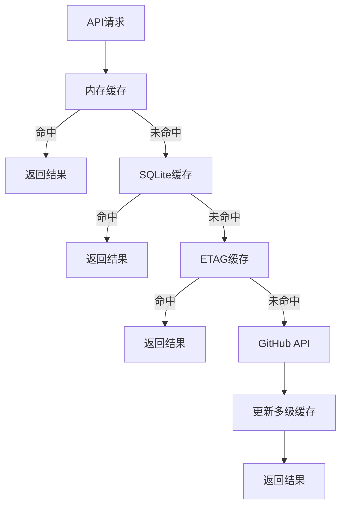

**图表来源**
- [lib/github-api.js:231-269](file://lib/github-api.js#L231-L269)
- [lib/usage-store.js:250-286](file://lib/usage-store.js#L250-L286)

### 并发控制

系统通过并发队列和去重机制控制 API 调用频率：

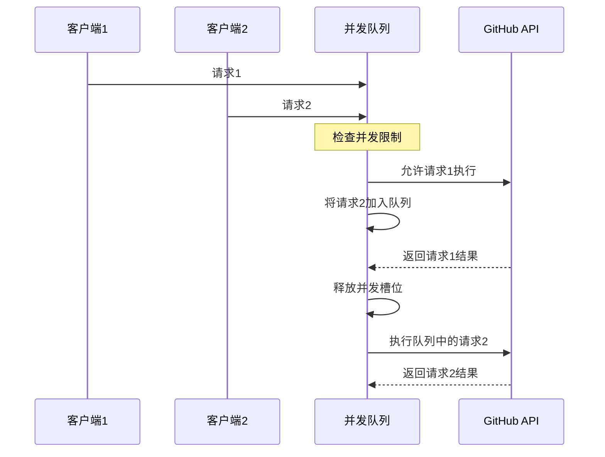

**图表来源**
- [lib/github-api.js:32-48](file://lib/github-api.js#L32-L48)

### 内存管理

系统实现了智能的内存清理和资源管理：

| 组件 | 清理策略 | 触发条件 |
|------|----------|----------|
| 使用量缓存 | LRU淘汰 | 缓存大小超限 |
| 座位快照 | 限制数量 | 快照数量超过阈值 |
| 文件监听器 | 主动关闭 | 服务停止 |
| 定时器 | 清除所有定时器 | 服务停止 |

**章节来源**
- [lib/usage-store.js:235-247](file://lib/usage-store.js#L235-L247)
- [lib/user-mapping.js:144-154](file://lib/user-mapping.js#L144-L154)
- [server.js:150-168](file://server.js#L150-L168)

## 故障排除指南

### 常见问题诊断

#### 依赖注入相关问题

1. **服务未正确注入**
   - 检查服务容器初始化顺序
   - 验证依赖参数传递是否完整
   - 确认模块导出格式正确

2. **循环依赖问题**
   - 分析模块间的导入关系
   - 使用延迟导入解决循环依赖
   - 重构共享逻辑到独立模块

#### 性能问题排查

1. **缓存命中率低**
   - 检查缓存键生成逻辑
   - 验证缓存过期策略
   - 分析缓存数据结构

2. **内存泄漏**
   - 监控内存使用趋势
   - 检查事件监听器清理
   - 验证定时器清理

### 错误处理机制

系统实现了完善的错误处理和恢复机制：

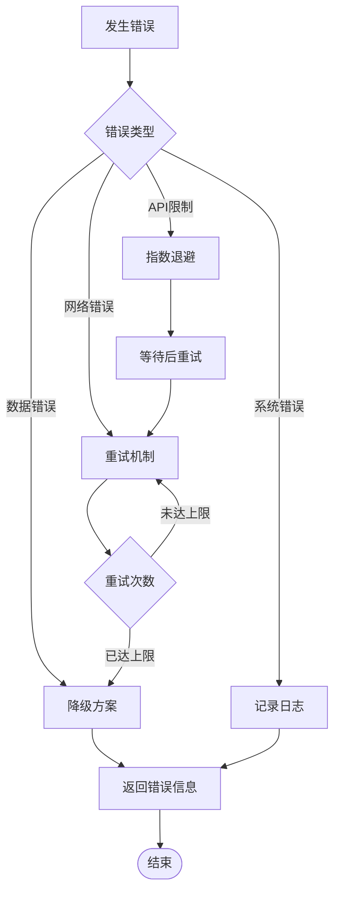

**图表来源**
- [lib/github-api.js:172-227](file://lib/github-api.js#L172-L227)

**章节来源**
- [lib/github-api.js:14-21](file://lib/github-api.js#L14-L21)
- [lib/github-api.js:172-227](file://lib/github-api.js#L172-L227)

## 结论

该系统展示了良好的依赖注入实践，通过统一的服务容器实现了模块间的松耦合和高内聚。主要优势包括：

1. **清晰的架构层次**：表现层、业务逻辑层、数据访问层职责分明
2. **灵活的依赖管理**：支持服务的替换和扩展
3. **完善的缓存策略**：多层次缓存提升系统性能
4. **健壮的错误处理**：全面的异常捕获和恢复机制

### 改进建议

为进一步提升系统的质量和可维护性，建议：

1. **引入类型系统**：使用 TypeScript 提供编译时类型检查
2. **实现依赖注入容器**：减少手动依赖管理的复杂性
3. **增强测试覆盖**：为关键业务逻辑添加单元测试
4. **优化配置管理**：集中管理环境变量和配置选项

该系统为类似的企业级监控平台提供了优秀的参考实现，其依赖注入模式和架构设计值得其他项目借鉴。