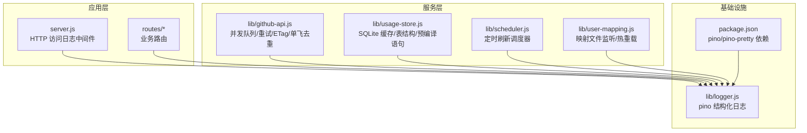
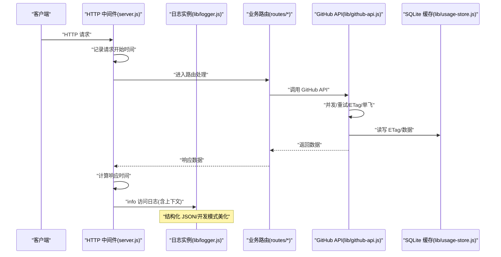
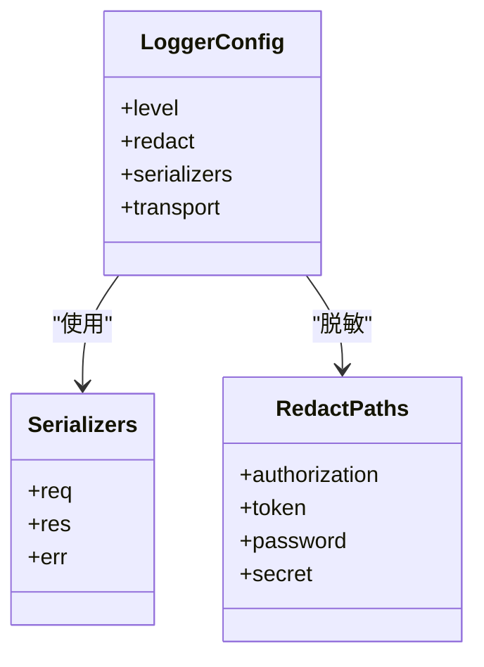
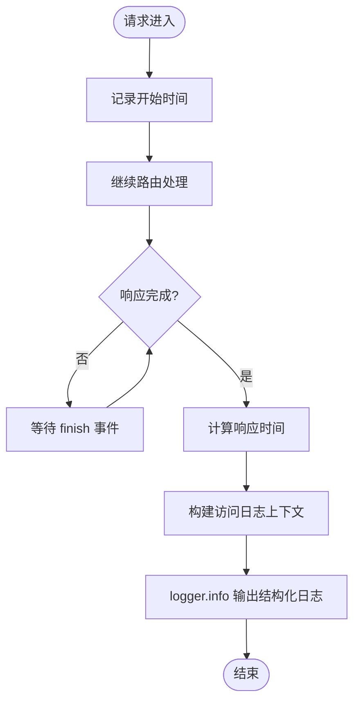
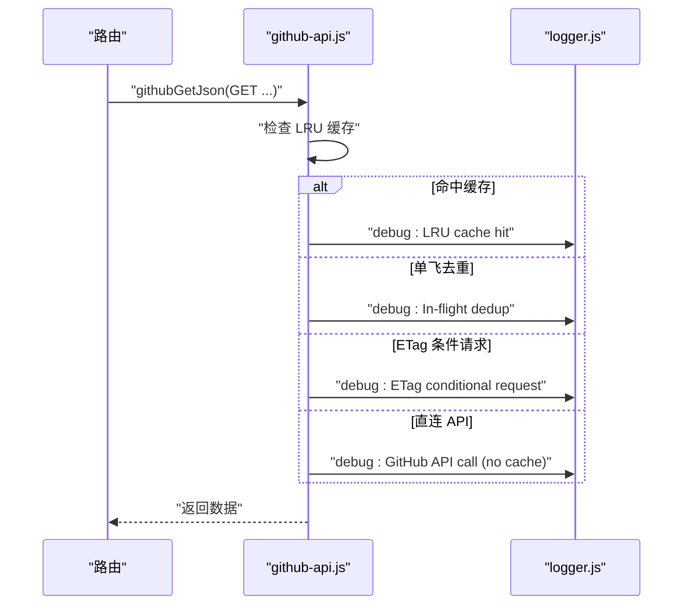
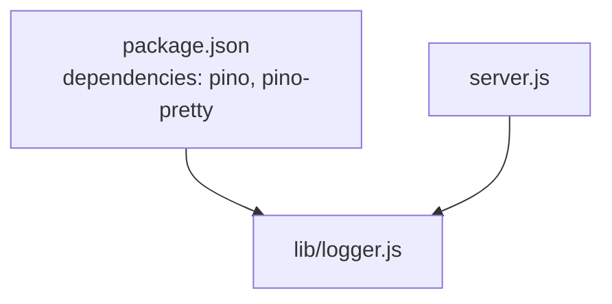

# 日志记录模块

<cite>
**本文引用的文件**
- [lib/logger.js](file://lib/logger.js)
- [server.js](file://server.js)
- [lib/github-api.js](file://lib/github-api.js)
- [lib/usage-store.js](file://lib/usage-store.js)
- [lib/scheduler.js](file://lib/scheduler.js)
- [lib/user-mapping.js](file://lib/user-mapping.js)
- [.env.example](file://.env.example)
- [package.json](file://package.json)
</cite>

## 目录
1. [简介](#简介)
2. [项目结构](#项目结构)
3. [核心组件](#核心组件)
4. [架构概览](#架构概览)
5. [详细组件分析](#详细组件分析)
6. [依赖分析](#依赖分析)
7. [性能考虑](#性能考虑)
8. [故障排查指南](#故障排查指南)
9. [结论](#结论)
10. [附录](#附录)

## 简介
本文件为日志记录模块的技术文档，围绕结构化日志系统的设计与实现展开，涵盖日志级别定义、格式规范、输出配置、API 接口、上下文传递、性能考量、配置选项、轮转与存储机制、使用示例、日志分析与调试方法、性能监控策略以及安全与隐私保护措施。目标是帮助开发者在不同模块中正确使用日志记录功能，并在生产环境中获得可观测性与可维护性。

## 项目结构
日志系统以独立模块形式提供，被多个子系统复用，包括 HTTP 访问日志中间件、GitHub API 层、SQLite 缓存层、调度器与用户映射服务等。核心文件如下：
- 日志模块：lib/logger.js
- 应用入口与访问日志中间件：server.js
- GitHub API 层：lib/github-api.js
- SQLite 缓存层：lib/usage-store.js
- 调度器：lib/scheduler.js
- 用户映射服务：lib/user-mapping.js
- 环境变量模板：.env.example
- 依赖声明：package.json

图表来源
- [server.js:16-38](file://server.js#L16-L38)
- [lib/logger.js:13-38](file://lib/logger.js#L13-L38)
- [package.json:19-20](file://package.json#L19-L20)

章节来源
- [lib/logger.js:1-41](file://lib/logger.js#L1-L41)
- [server.js:16-38](file://server.js#L16-L38)
- [package.json:19-20](file://package.json#L19-L20)

## 核心组件
- 结构化日志实例：基于 pino，提供多级日志、敏感信息脱敏、请求/响应/错误序列化器、开发模式美化输出等能力。
- HTTP 访问日志中间件：在响应完成时记录时间、来源、方法、URL、动作、成功与否、状态码、耗时等上下文。
- 全局错误处理：捕获未处理异常与未捕获拒绝，输出完整上下文与堆栈。
- 服务层日志：在 GitHub API 并发、重试、ETag 条件请求、单飞去重、SQLite 清理、调度器执行等关键路径输出 debug/warn/info 级日志。
- 日志级别策略：trace < debug < info < warn < error，按级别输出不同详细程度。

章节来源
- [lib/logger.js:5-12](file://lib/logger.js#L5-L12)
- [lib/logger.js:13-38](file://lib/logger.js#L13-L38)
- [server.js:121-139](file://server.js#L121-L139)

## 架构概览
日志系统贯穿应用入口、路由、服务与基础设施层，形成统一的结构化输出与上下文传递机制。

图表来源
- [server.js:17-35](file://server.js#L17-L35)
- [lib/logger.js:13-38](file://lib/logger.js#L13-L38)
- [lib/github-api.js:231-269](file://lib/github-api.js#L231-L269)
- [lib/usage-store.js:10-79](file://lib/usage-store.js#L10-L79)

## 详细组件分析

### 日志模块（lib/logger.js）
- 日志级别：通过环境变量 LOG_LEVEL 控制，默认开发为 debug，生产为 info。
- 敏感信息脱敏：对 authorization、token、password、secret 等字段进行脱敏处理。
- 序列化器：
  - req：记录 method、url、remoteAddress、remoteHostname、userAgent。
  - res：记录 statusCode。
  - err：标准错误序列化。
- 开发模式美化：使用 pino-pretty，彩色输出，包含时间格式化与忽略字段。
- 生产模式：输出 JSON，便于日志收集与分析。

图表来源
- [lib/logger.js:13-38](file://lib/logger.js#L13-L38)

章节来源
- [lib/logger.js:3-38](file://lib/logger.js#L3-L38)

### HTTP 访问日志中间件（server.js）
- 中间件在响应 finish 事件时记录访问日志，包含：
  - time、remoteAddress、remoteHostname、method、url、action、success、statusCode、responseTime。
- URL 到动作映射：将路径与方法映射为语义化动作标签，便于检索与分析。
- 全局错误中间件：捕获未处理异常与未捕获拒绝，输出完整上下文与堆栈，统一返回 JSON。

图表来源
- [server.js:17-35](file://server.js#L17-L35)
- [server.js:121-139](file://server.js#L121-L139)

章节来源
- [server.js:16-38](file://server.js#L16-L38)
- [server.js:54-86](file://server.js#L54-L86)
- [server.js:121-139](file://server.js#L121-L139)

### GitHub API 层日志（lib/github-api.js）
- 并发控制与重试：在请求失败或被限流时进行指数退避重试，并输出 warn 级日志，包含方法、路径、状态、尝试次数、等待时长、剩余配额等。
- 缓存与单飞去重：在命中 LRU 缓存、单飞去重、ETag 条件请求、无缓存直连等路径输出 debug 级日志。
- ETag 持久化：恢复/保存 ETag 时输出 info/warn 日志，便于追踪缓存状态。

图表来源
- [lib/github-api.js:231-269](file://lib/github-api.js#L231-L269)
- [lib/github-api.js:206-224](file://lib/github-api.js#L206-L224)

章节来源
- [lib/github-api.js:231-269](file://lib/github-api.js#L231-L269)
- [lib/github-api.js:206-224](file://lib/github-api.js#L206-L224)

### SQLite 缓存层日志（lib/usage-store.js）
- 数据库初始化与迁移：在添加 ranking 列等迁移过程中输出日志，便于追踪 schema 变更。
- 清理与修剪：在清理过期数据、修剪座位快照等操作中输出 info/warn 日志，便于审计与问题定位。

章节来源
- [lib/usage-store.js:73-79](file://lib/usage-store.js#L73-L79)
- [lib/usage-store.js:232-236](file://lib/usage-store.js#L232-L236)

### 调度器日志（lib/scheduler.js）
- 启动与停止：输出调度器启用/禁用、启动/停止、下次触发时间等信息。
- 刷新执行：在每日/启动刷新时输出触发标签、日期列表、结果模式与条目数量等上下文。
- 失败处理：在刷新失败时输出警告，包含触发标签、日期与错误信息。

章节来源
- [lib/scheduler.js:60-62](file://lib/scheduler.js#L60-L62)
- [lib/scheduler.js:83-99](file://lib/scheduler.js#L83-L99)
- [lib/scheduler.js:121-126](file://lib/scheduler.js#L121-L126)

### 用户映射服务日志（lib/user-mapping.js）
- 文件加载与校验：在确保数据文件、加载映射、校验数组格式、跳过无效条目等路径输出 info/error/warn 日志。
- 文件监听与热重载：在文件变更检测、去抖重载、监听错误等路径输出 info/warn 日志。

章节来源
- [lib/user-mapping.js:31-33](file://lib/user-mapping.js#L31-L33)
- [lib/user-mapping.js:81-84](file://lib/user-mapping.js#L81-L84)
- [lib/user-mapping.js:100-116](file://lib/user-mapping.js#L100-L116)

## 依赖分析
- pino：结构化日志核心，提供级别控制、序列化器、传输器（开发模式美化）。
- pino-pretty：开发模式美化输出。
- dotenv：在入口处加载环境变量，确保 LOG_LEVEL 等在模块初始化前可用。

图表来源
- [package.json:19-20](file://package.json#L19-L20)
- [lib/logger.js:13-38](file://lib/logger.js#L13-L38)
- [server.js:1](file://server.js#L1)

章节来源
- [package.json:19-20](file://package.json#L19-L20)
- [server.js:1](file://server.js#L1)

## 性能考虑
- 日志级别与开销：生产环境使用 info 级别，避免 trace/debug 的高开销；仅在诊断时临时提升级别。
- 结构化输出：JSON 输出利于日志收集系统解析与聚合，减少解析成本。
- 序列化器：仅记录必要字段，避免序列化大型对象，降低序列化开销。
- 敏感信息脱敏：在源头脱敏，避免重复处理与潜在泄露风险。
- 中间件时机：访问日志在响应完成时记录，避免阻塞请求处理主路径。
- 调度器与缓存：通过调度器与多层缓存减少对外部 API 的调用，间接降低日志风暴与网络开销。

## 故障排查指南
- 访问日志缺失：检查中间件是否注册、响应是否正常完成、日志级别是否过高。
- 敏感信息泄露：确认脱敏路径是否覆盖所需字段，避免在 info 级别输出敏感内容。
- GitHub API 重试频繁：关注 warn 日志中的重试次数、等待时长与剩余配额，必要时调整并发与重试上限。
- 调度器未执行：检查 SCHED_DISABLED、SCHED_DAILY_TIMES 等环境变量，确认调度器已启动与下次触发时间。
- SQLite 清理失败：关注 warn 日志中的错误信息，检查磁盘空间与权限。
- 用户映射文件异常：关注 error/warn 日志中的文件加载与监听错误，检查文件格式与权限。

章节来源
- [lib/github-api.js:206-224](file://lib/github-api.js#L206-L224)
- [lib/scheduler.js:60-62](file://lib/scheduler.js#L60-L62)
- [lib/usage-store.js:232-236](file://lib/usage-store.js#L232-L236)
- [lib/user-mapping.js:86-91](file://lib/user-mapping.js#L86-L91)

## 结论
日志记录模块通过结构化日志、统一上下文与多级日志策略，为系统提供了良好的可观测性与可维护性。结合中间件、服务层与基础设施层的日志输出，能够快速定位问题、评估性能并保障安全与隐私。建议在生产环境中坚持 info 级别与必要的脱敏策略，并利用调度器与缓存减少不必要的日志与外部调用。

## 附录

### 日志级别与使用场景
- trace：完整请求/响应体、SQL、原始 GitHub API 响应（开发时使用）。
- debug：缓存命中/未命中、ETag 条件请求、单飞去重、重试次数。
- info：HTTP 访问日志（默认生产级别）、调度器启动/停止、缓存清理结果。
- warn：API 速率限制接近阈值、重试等待、非关键性恢复、文件监听错误。
- error：未捕获异常、GitHub API 失败、数据库错误、堆栈追踪。

章节来源
- [lib/logger.js:5-12](file://lib/logger.js#L5-L12)
- [server.js:121-139](file://server.js#L121-L139)

### 配置选项与环境变量
- LOG_LEVEL：控制日志级别（trace/debug/info/warn/error），默认开发为 debug，生产为 info。
- NODE_ENV：影响默认日志级别与开发模式美化输出。
- 其他相关环境变量（与日志相关）：
  - PORT：服务端口（用于访问日志中的端口信息）。
  - SCHED_*：调度器相关（影响调度器日志）。
  - GITHUB_*：GitHub API 相关（影响 GitHub API 日志）。
  - CACHE_TTL：前端缓存 TTL（影响访问日志中的响应时间与缓存命中率）。

章节来源
- [.env.example:31-35](file://.env.example#L31-L35)
- [server.js:142-144](file://server.js#L142-L144)
- [lib/scheduler.js:14-19](file://lib/scheduler.js#L14-L19)
- [lib/github-api.js:25-27](file://lib/github-api.js#L25-L27)

### 输出格式规范
- 开发模式：彩色美化输出，包含时间、级别、消息与结构化字段。
- 生产模式：JSON 输出，包含 level、time、以及业务上下文字段（如 time、remoteAddress、method、url、action、success、statusCode、responseTime 等）。

章节来源
- [lib/logger.js:35-37](file://lib/logger.js#L35-L37)
- [server.js:24-34](file://server.js#L24-L34)

### 上下文信息传递
- 访问日志：time、remoteAddress、remoteHostname、method、url、action、success、statusCode、responseTime。
- 错误日志：err（message、stack）、time、remoteAddress、remoteHostname、method、url、action、success、statusCode。
- GitHub API 日志：方法、路径、状态、尝试次数、等待时长、剩余配额、ETag 等。
- 调度器日志：触发标签、日期列表、结果模式与条目数量、错误信息。
- SQLite 日志：清理条数、修剪结果、错误信息。
- 用户映射日志：有效条数、跳过条数、文件变更、错误信息。

章节来源
- [server.js:24-34](file://server.js#L24-L34)
- [server.js:122-135](file://server.js#L122-L135)
- [lib/github-api.js:206-224](file://lib/github-api.js#L206-L224)
- [lib/scheduler.js:83-99](file://lib/scheduler.js#L83-L99)
- [lib/usage-store.js:232-236](file://lib/usage-store.js#L232-L236)
- [lib/user-mapping.js:81-84](file://lib/user-mapping.js#L81-L84)

### 使用示例（在不同模块中正确使用日志记录）
- 在路由中记录业务事件：在关键业务路径输出 info/warn/error，包含业务上下文与结果。
- 在 GitHub API 层记录缓存与重试：在命中缓存、单飞去重、ETag 条件请求、直连 API、重试等路径输出 debug/warn。
- 在 SQLite 层记录清理与迁移：在清理过期数据、修剪快照、schema 迁移等路径输出 info/warn。
- 在调度器中记录执行与失败：在启动/停止、刷新执行、失败等路径输出 info/warn。
- 在用户映射服务中记录文件加载与监听：在确保文件、加载映射、监听错误等路径输出 info/error/warn。

章节来源
- [lib/github-api.js:231-269](file://lib/github-api.js#L231-L269)
- [lib/usage-store.js:232-236](file://lib/usage-store.js#L232-L236)
- [lib/scheduler.js:83-99](file://lib/scheduler.js#L83-L99)
- [lib/user-mapping.js:81-84](file://lib/user-mapping.js#L81-L84)

### 日志分析方法与调试技巧
- 使用日志级别：在开发时使用 debug，定位问题；在生产时使用 info，必要时临时提升到 warn/error。
- 利用结构化字段：通过 time、remoteAddress、method、url、action、statusCode、responseTime 等字段进行聚合与检索。
- 结合中间件与服务层日志：通过访问日志与服务层日志串联一次请求的完整轨迹。
- 关注 warn/error：优先处理警告与错误日志，结合堆栈与上下文定位根因。
- 使用 pino-pretty：在开发环境使用美化输出，快速识别异常。

章节来源
- [lib/logger.js:35-37](file://lib/logger.js#L35-L37)
- [server.js:24-34](file://server.js#L24-L34)

### 性能监控策略
- 监控响应时间：通过访问日志中的 responseTime 字段，观察平均值与分位数变化。
- 监控错误率：通过 error/warn 日志统计错误发生频率与趋势。
- 监控缓存命中：结合缓存层日志与前端缓存 TTL，评估缓存策略有效性。
- 监控调度器执行：通过调度器日志评估刷新频率与成功率。

章节来源
- [server.js:24-34](file://server.js#L24-L34)
- [lib/scheduler.js:83-99](file://lib/scheduler.js#L83-L99)

### 安全考虑与隐私保护
- 敏感信息脱敏：在日志中对 authorization、token、password、secret 等字段进行脱敏处理。
- 最小暴露原则：仅记录必要的上下文字段，避免记录完整请求/响应体（除非在 trace 级别）。
- 环境变量控制：通过 LOG_LEVEL 与 NODE_ENV 控制输出级别与格式，避免在生产环境输出过多细节。
- 错误日志：统一通过全局错误中间件输出，避免在业务代码中分散处理。

章节来源
- [lib/logger.js:16-19](file://lib/logger.js#L16-L19)
- [server.js:121-139](file://server.js#L121-L139)