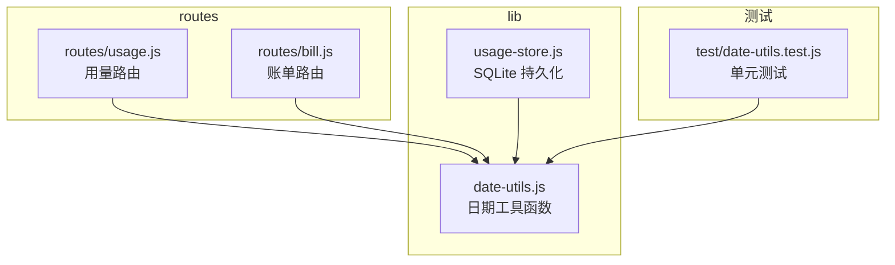
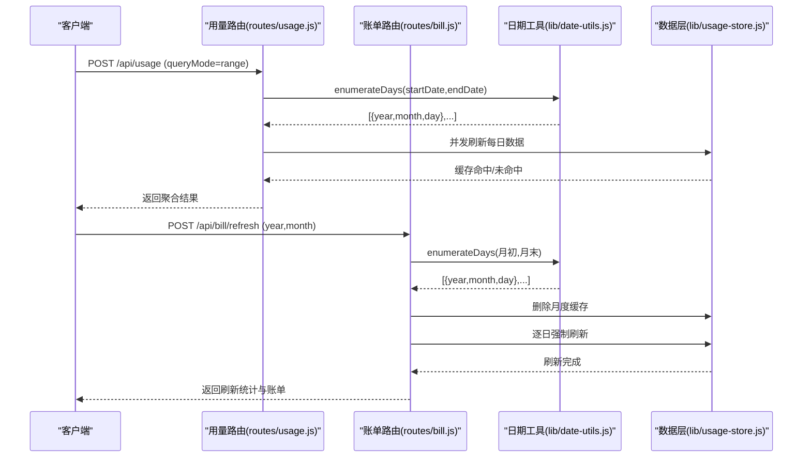
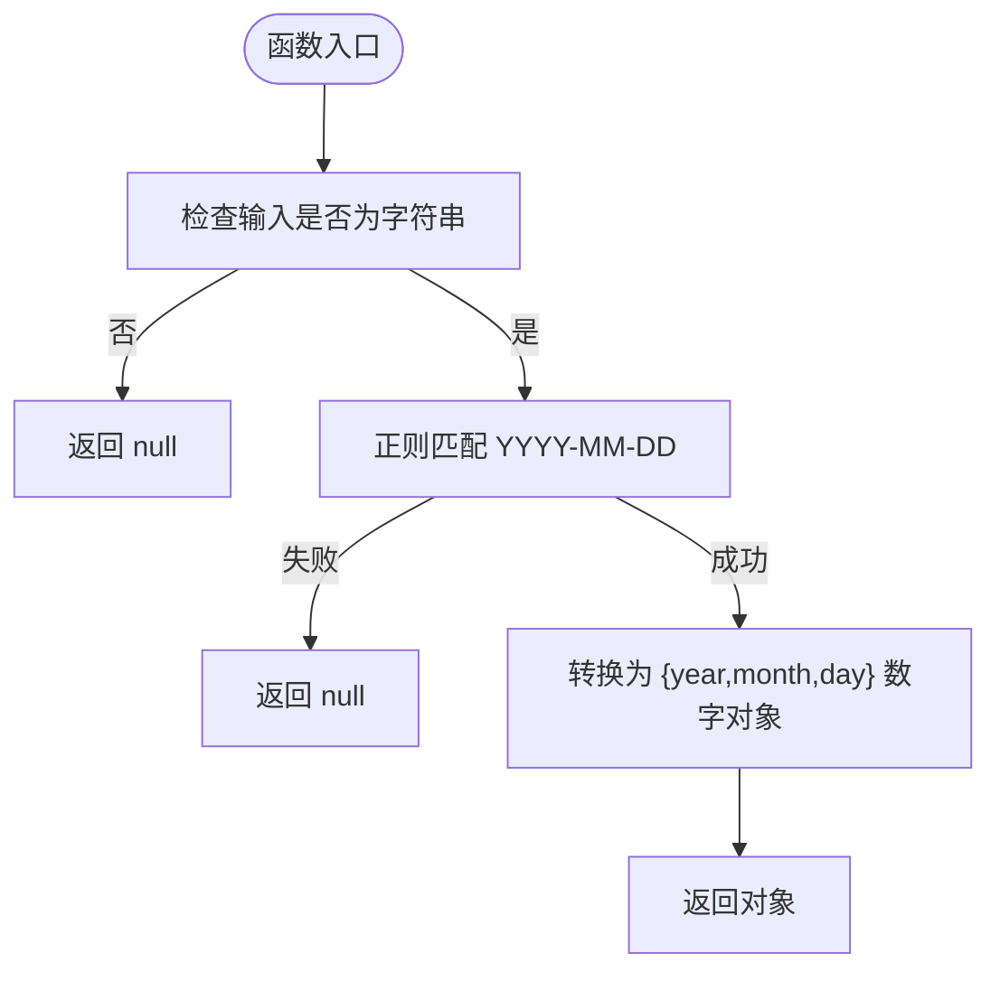
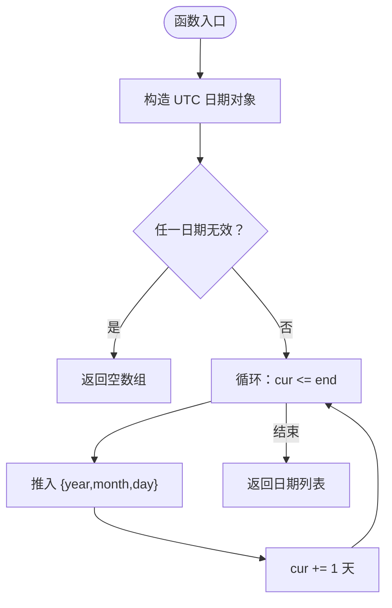
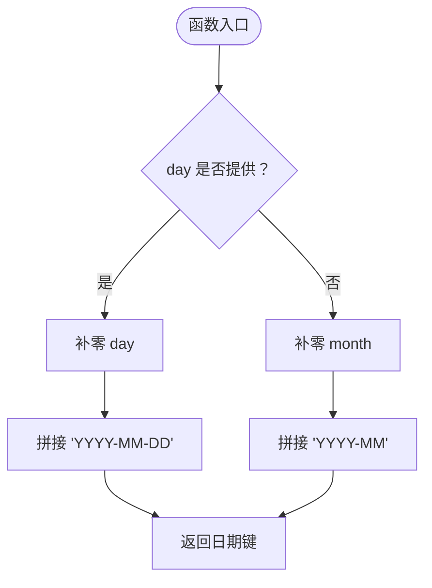
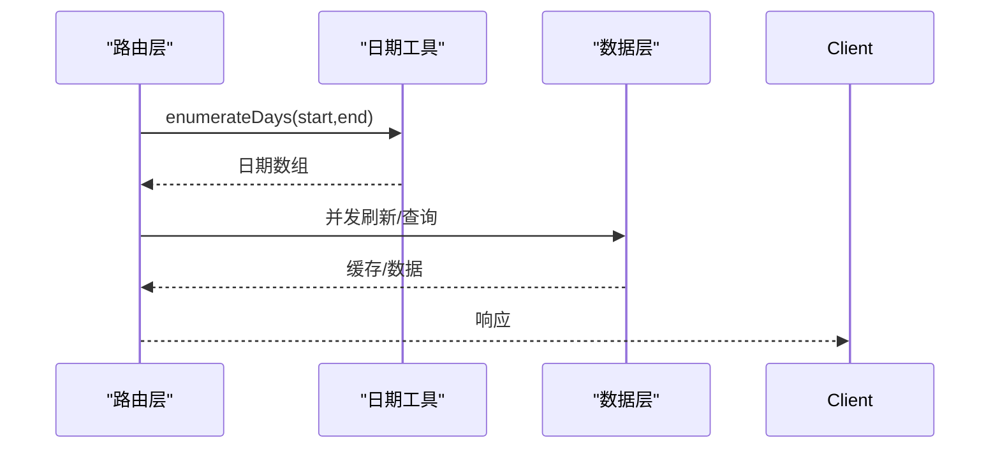
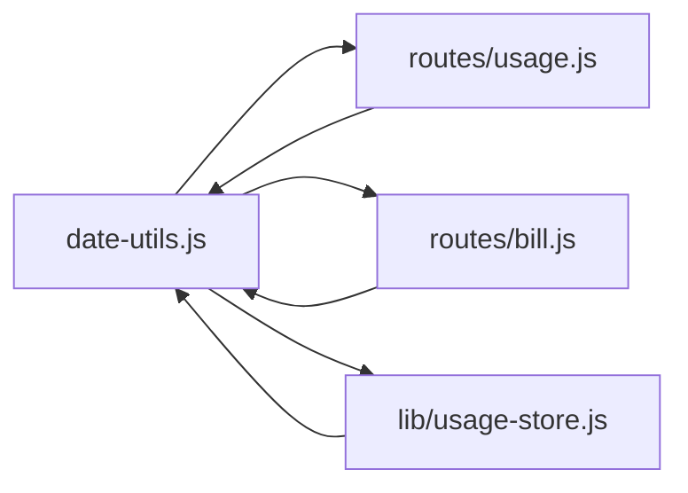

# 日期工具模块

<cite>
**本文档引用的文件**
- [lib/date-utils.js](file://lib/date-utils.js)
- [test/date-utils.test.js](file://test/date-utils.test.js)
- [routes/usage.js](file://routes/usage.js)
- [routes/bill.js](file://routes/bill.js)
- [lib/usage-store.js](file://lib/usage-store.js)
- [README.md](file://README.md)
</cite>

## 目录
1. [简介](#简介)
2. [项目结构](#项目结构)
3. [核心组件](#核心组件)
4. [架构概览](#架构概览)
5. [详细组件分析](#详细组件分析)
6. [依赖关系分析](#依赖关系分析)
7. [性能考量](#性能考量)
8. [故障排查指南](#故障排查指南)
9. [结论](#结论)

## 简介
本文件为日期工具模块的技术文档，聚焦于日期处理工具函数的设计与实现，涵盖日期格式转换、时间范围计算、日期验证与格式化功能。文档详细说明了 API 接口、参数验证与返回值格式，并阐述了日期计算的算法实现、时区处理与本地化支持。同时提供具体的使用示例、性能考虑、边界条件处理与错误处理机制，帮助开发者在项目中正确使用与扩展日期工具。

## 项目结构
日期工具模块位于 lib/date-utils.js，主要提供三个核心函数：
- parseDateStr：将 "YYYY-MM-DD" 字符串解析为包含年、月、日的对象或 null
- enumerateDays：枚举两个日期之间的所有天数（包含起止）
- buildDateKey：构建 "YYYY-MM-DD" 或 "YYYY-MM" 格式的日期键

这些函数被路由层（routes/usage.js、routes/bill.js）与数据层（lib/usage-store.js）广泛使用，支撑用量查询、账单计算与缓存管理等关键功能。

**图表来源**
- [lib/date-utils.js:1-46](file://lib/date-utils.js#L1-L46)
- [routes/usage.js:9](file://routes/usage.js#L9)
- [routes/bill.js:10](file://routes/bill.js#L10)
- [lib/usage-store.js:166-178](file://lib/usage-store.js#L166-L178)
- [test/date-utils.test.js:1-74](file://test/date-utils.test.js#L1-L74)

**章节来源**
- [lib/date-utils.js:1-46](file://lib/date-utils.js#L1-L46)
- [README.md:66](file://README.md#L66)

## 核心组件
本模块包含三个核心函数，分别负责日期解析、范围枚举与键生成：

- parseDateStr
  - 输入：字符串（期望 "YYYY-MM-DD"）
  - 输出：对象 { year, month, day } 或 null
  - 验证：非字符串、格式不符、非法数值均返回 null
- enumerateDays
  - 输入：起始与结束日期字符串（"YYYY-MM-DD"）
  - 输出：数组 [{ year, month, day }]
  - 边界：起止无效或结束早于起始时返回空数组
- buildDateKey
  - 输入：年、月、可选日
  - 输出："YYYY-MM-DD" 或 "YYYY-MM"
  - 行为：单数月/日自动补零

这些函数在路由层用于解析查询参数、构建日期范围与缓存键，在数据层用于缺失日期检测与缓存键生成。

**章节来源**
- [lib/date-utils.js:8-43](file://lib/date-utils.js#L8-L43)
- [test/date-utils.test.js:4-73](file://test/date-utils.test.js#L4-L73)

## 架构概览
日期工具在系统中的位置与交互如下：

**图表来源**
- [routes/usage.js:398-418](file://routes/usage.js#L398-L418)
- [routes/bill.js:342-375](file://routes/bill.js#L342-L375)
- [lib/date-utils.js:19-33](file://lib/date-utils.js#L19-L33)
- [lib/usage-store.js:205-207](file://lib/usage-store.js#L205-L207)

## 详细组件分析

### parseDateStr 函数
- 设计目标：安全地将 "YYYY-MM-DD" 字符串解析为结构化日期对象，避免隐式类型转换与格式歧义
- 算法实现：
  - 非字符串输入直接返回 null
  - 使用正则 /^(\d{4})-(\d{2})-(\d{2})$/ 匹配格式
  - 格式不符返回 null
  - 成功匹配后转换为数字对象 { year, month, day }
- 参数与返回值
  - 参数：str: string
  - 返回：{ year: number, month: number, day: number } | null
- 错误处理与边界条件
  - null/undefined/空字符串：返回 null
  - 非字符串类型：返回 null
  - 格式错误（如 "YYYY-M-D"、"YYYY/MM/DD"、"YYYYMMDD"）：返回 null
  - 数值越界（如 13 月、 32 日）：由正则约束，不会进入数字转换阶段
- 性能特征
  - O(1) 时间复杂度，常量空间
  - 正则匹配与两次 Number 转换为主要开销

**图表来源**
- [lib/date-utils.js:8-13](file://lib/date-utils.js#L8-L13)

**章节来源**
- [lib/date-utils.js:8-13](file://lib/date-utils.js#L8-L13)
- [test/date-utils.test.js:4-30](file://test/date-utils.test.js#L4-L30)

### enumerateDays 函数
- 设计目标：在给定起止日期之间（包含两端）生成连续的日期序列，支持跨月/跨年边界
- 算法实现：
  - 使用 "YYYY-MM-DDTHH:mm:ssZ" 形式构造 UTC 日期，避免本地时区影响
  - 若任一日期无效（NaN），直接返回空数组
  - 使用 UTC 方法 getUTCFullYear/getUTCMonth/getUTCDate 获取年月日
  - 逐日递增 setUTCDate，直到超过结束日期
- 参数与返回值
  - 参数：startStr: string, endStr: string（均为 "YYYY-MM-DD"）
  - 返回：[{ year: number, month: number, day: number }]
- 错误处理与边界条件
  - 无效日期字符串：返回空数组
  - 结束日期早于起始日期：返回空数组
  - 跨月/跨年：正确处理月末与年初边界
- 性能特征
  - 时间复杂度 O(N)，N 为天数数量
  - 空间复杂度 O(N)，用于存储结果数组
  - 递增使用 UTC 日期方法，避免本地时区跨日问题

**图表来源**
- [lib/date-utils.js:19-33](file://lib/date-utils.js#L19-L33)

**章节来源**
- [lib/date-utils.js:19-33](file://lib/date-utils.js#L19-L33)
- [test/date-utils.test.js:32-59](file://test/date-utils.test.js#L32-L59)

### buildDateKey 函数
- 设计目标：生成标准化的日期键，支持按日与按月两种粒度
- 算法实现：
  - day 存在时：返回 "YYYY-MM-DD"
  - day 不存在时：返回 "YYYY-MM"
  - 单数月/日自动使用 padStart 补零
- 参数与返回值
  - 参数：year: number, month: number, day?: number
  - 返回：string
- 错误处理与边界条件
  - month/day 越界：由调用方保证，函数不做额外校验
  - day 为 undefined/null：按月键处理
- 性能特征
  - O(1) 时间与空间复杂度

**图表来源**
- [lib/date-utils.js:38-43](file://lib/date-utils.js#L38-L43)

**章节来源**
- [lib/date-utils.js:38-43](file://lib/date-utils.js#L38-L43)
- [test/date-utils.test.js:61-73](file://test/date-utils.test.js#L61-L73)

### 在路由层的应用
- routes/usage.js
  - 使用 enumerateDays 构建日期范围，限制最大 31 天
  - 使用 parseDateStr 校验单日查询参数
  - 使用 buildDateKey 生成缓存键与日期标签
- routes/bill.js
  - 使用 enumerateDays 构建账单周期内的每日列表
  - 使用 lastDayOfMonth 与 resolveBillPeriod 计算月末日期

**图表来源**
- [routes/usage.js:398-418](file://routes/usage.js#L398-L418)
- [routes/bill.js:342-375](file://routes/bill.js#L342-L375)
- [lib/date-utils.js:19-33](file://lib/date-utils.js#L19-L33)

**章节来源**
- [routes/usage.js:398-418](file://routes/usage.js#L398-L418)
- [routes/usage.js:418-433](file://routes/usage.js#L418-L433)
- [routes/bill.js:342-375](file://routes/bill.js#L342-L375)

## 依赖关系分析
- 模块内依赖
  - 三个函数相互独立，无内部耦合
- 跨模块依赖
  - routes/usage.js：导入 enumerateDays、parseDateStr、buildDateKey
  - routes/bill.js：导入 enumerateDays
  - lib/usage-store.js：使用日期字符串与 UTC 日期方法进行范围查询与缺失日期检测
- 外部依赖
  - 无外部依赖，纯 JavaScript 实现

**图表来源**
- [lib/date-utils.js:45](file://lib/date-utils.js#L45)
- [routes/usage.js:9](file://routes/usage.js#L9)
- [routes/bill.js:10](file://routes/bill.js#L10)
- [lib/usage-store.js:166-178](file://lib/usage-store.js#L166-L178)

**章节来源**
- [lib/date-utils.js:45](file://lib/date-utils.js#L45)
- [routes/usage.js:9](file://routes/usage.js#L9)
- [routes/bill.js:10](file://routes/bill.js#L10)
- [lib/usage-store.js:166-178](file://lib/usage-store.js#L166-L178)

## 性能考量
- 时间复杂度
  - parseDateStr：O(1)
  - enumerateDays：O(N)，N 为天数数量
  - buildDateKey：O(1)
- 空间复杂度
  - parseDateStr：O(1)
  - enumerateDays：O(N)
  - buildDateKey：O(1)
- 优化建议
  - enumerateDays 的循环次数与范围大小直接相关，建议在上层限制最大范围（如 31 天）
  - 使用 UTC 日期方法避免本地时区差异带来的额外判断
  - 对于高频调用，可考虑缓存 parseDateStr 的结果（视业务场景）

[本节为通用性能讨论，不直接分析具体文件]

## 故障排查指南
- parseDateStr 常见问题
  - 输入非字符串：返回 null，检查调用方参数类型
  - 格式不匹配：返回 null，确认使用 "YYYY-MM-DD"
  - 数值越界：正则会阻止，检查调用方传入的数值
- enumerateDays 常见问题
  - 起止日期无效：返回空数组，检查日期字符串与时区
  - 结束日期早于起始日期：返回空数组，确认参数顺序
  - 跨月边界：使用 UTC 方法，避免本地时区跨日问题
- buildDateKey 常见问题
  - day 未提供：生成按月键，确认预期粒度
  - 单数月/日：自动补零，注意比较时的字符串格式

**章节来源**
- [test/date-utils.test.js:4-73](file://test/date-utils.test.js#L4-L73)

## 结论
日期工具模块提供了简洁、稳健的日期处理能力，通过严格的格式验证与 UTC 时区处理，确保在复杂的时间范围计算与缓存键生成场景中保持一致性与正确性。其 O(1) 的解析与键生成复杂度，以及 O(N) 的范围枚举复杂度，满足了项目在用量查询与账单计算中的性能需求。建议在上层调用中继续遵循格式规范与范围限制，以获得最佳的稳定性与性能表现。