# 核心模块

<cite>
**本文引用的文件**
- [server.js](file://server.js)
- [routes/usage.js](file://routes/usage.js)
- [routes/billing.js](file://routes/billing.js)
- [routes/auth.js](file://routes/auth.js)
- [lib/auth.js](file://lib/auth.js)
- [lib/github-api.js](file://lib/github-api.js)
- [lib/usage-store.js](file://lib/usage-store.js)
- [lib/scheduler.js](file://lib/scheduler.js)
- [lib/user-mapping.js](file://lib/user-mapping.js)
- [lib/billing-config.js](file://lib/billing-config.js)
- [lib/date-utils.js](file://lib/date-utils.js)
- [lib/helpers.js](file://lib/helpers.js)
- [lib/logger.js](file://lib/logger.js)
- [test/auth.test.js](file://test/auth.test.js)
- [test/billing-config.test.js](file://test/billing-config.test.js)
- [test/billing-models.test.js](file://test/billing-models.test.js)
- [test/date-utils.test.js](file://test/date-utils.test.js)
- [test/helpers.test.js](file://test/helpers.test.js)
- [package.json](file://package.json)
</cite>

## 目录
1. [简介](#简介)
2. [项目结构](#项目结构)
3. [核心组件](#核心组件)
4. [架构总览](#架构总览)
5. [详细组件分析](#详细组件分析)
6. [依赖关系分析](#依赖关系分析)
7. [性能考量](#性能考量)
8. [故障排查指南](#故障排查指南)
9. [结论](#结论)
10. [附录](#附录)

## 简介
本文件面向 CopilotEnterpriseUsageDisplay 的核心模块，围绕以下主题展开：GitHubAPI 的并发控制、重试与缓存（含 ETag）、单飞行去重；UsageStore 的 SQLite 持久化、预编译语句与缓存管理；Scheduler 的自动刷新调度器；UserMappingService 的用户映射服务与热重载；以及 BillingConfig、DateUtils、Helpers、Logger 的支撑功能。特别新增了认证辅助函数、AI Credits 支持和双源回退机制的详细说明。文档提供架构图、流程图、类图与最佳实践，帮助开发者快速理解与正确使用各模块。

## 项目结构
项目采用按职责分层的模块组织：
- 后端入口与中间件：server.js
- 路由层：routes 下各业务路由
- 核心库：lib 下各功能模块
- 测试：test 下单元测试
- 前端静态资源：public 下页面与脚本

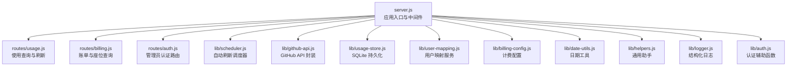

图表来源
- [server.js:1-182](file://server.js#L1-L182)
- [routes/usage.js:1-470](file://routes/usage.js#L1-L470)
- [routes/billing.js:1-106](file://routes/billing.js#L1-L106)
- [routes/auth.js:1-41](file://routes/auth.js#L1-L41)
- [lib/scheduler.js:1-160](file://lib/scheduler.js#L1-L160)
- [lib/github-api.js:1-320](file://lib/github-api.js#L1-L320)
- [lib/usage-store.js:1-324](file://lib/usage-store.js#L1-L324)
- [lib/user-mapping.js:1-158](file://lib/user-mapping.js#L1-L158)
- [lib/billing-config.js:1-25](file://lib/billing-config.js#L1-L25)
- [lib/date-utils.js:1-46](file://lib/date-utils.js#L1-L46)
- [lib/helpers.js:1-83](file://lib/helpers.js#L1-L83)
- [lib/logger.js:1-41](file://lib/logger.js#L1-L41)
- [lib/auth.js:1-62](file://lib/auth.js#L1-L62)

章节来源
- [server.js:1-182](file://server.js#L1-L182)
- [package.json:1-26](file://package.json#L1-L26)

## 核心组件
- GitHubAPI：并发队列、重试/退避、LRU GET 缓存、ETag 条件请求、单飞行去重、错误封装与速率限制追踪。
- UsageStore：SQLite 表结构、WAL 模式、预编译语句、每日用量、座位快照、ETag 缓存、月度账单。
- Scheduler：启动延迟、本地时间点触发、回填天数、多实例安全、停止与清理。
- UserMappingService：单例、文件热重载（带防抖）、数据校验与映射。
- BillingConfig：计划配置、包含配额、按周期请求计算金额、AI Credits 支持。
- DateUtils：日期解析、枚举、键构建。
- Helpers：数字转换、用户提取、错误响应、查询参数与端点构建、AI Credits 双源回退辅助函数。
- Logger：层级日志、字段序列化、敏感信息脱敏。
- Auth：管理员认证辅助函数、会话管理和安全验证。

章节来源
- [lib/github-api.js:1-320](file://lib/github-api.js#L1-L320)
- [lib/usage-store.js:1-324](file://lib/usage-store.js#L1-L324)
- [lib/scheduler.js:1-160](file://lib/scheduler.js#L1-L160)
- [lib/user-mapping.js:1-158](file://lib/user-mapping.js#L1-L158)
- [lib/billing-config.js:1-25](file://lib/billing-config.js#L1-L25)
- [lib/date-utils.js:1-46](file://lib/date-utils.js#L1-L46)
- [lib/helpers.js:1-83](file://lib/helpers.js#L1-L83)
- [lib/logger.js:1-41](file://lib/logger.js#L1-L41)
- [lib/auth.js:1-62](file://lib/auth.js#L1-L62)

## 架构总览
下图展示从路由到 API 层与存储层的数据流与交互关系，包括新增的认证流程和 AI Credits 双源回退机制。

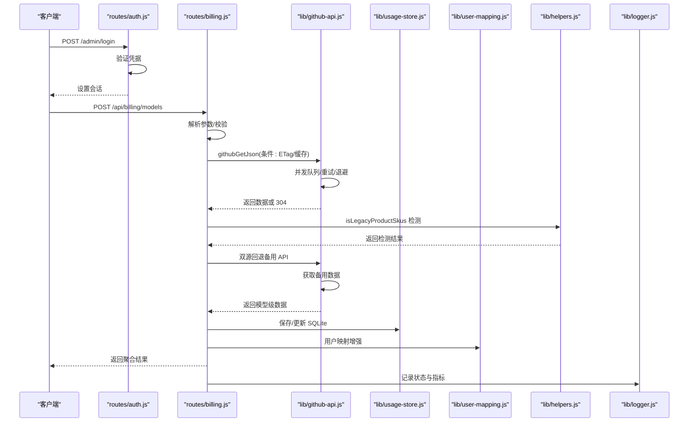

图表来源
- [routes/auth.js:17-41](file://routes/auth.js#L17-L41)
- [routes/billing.js:228-251](file://routes/billing.js#L228-L251)
- [lib/github-api.js:172-227](file://lib/github-api.js#L172-L227)
- [lib/usage-store.js:137-198](file://lib/usage-store.js#L137-L198)
- [lib/user-mapping.js:118-130](file://lib/user-mapping.js#L118-L130)
- [lib/helpers.js:156-173](file://lib/helpers.js#L156-L173)
- [lib/logger.js:13-38](file://lib/logger.js#L13-L38)

## 详细组件分析

### GitHubAPI 模块
设计理念
- 通过并发队列限制同时请求数，避免超限。
- 重试与指数退避，结合 GitHub 速率限制头与状态码智能决策。
- LRU GET 缓存与 ETag 条件请求，减少重复请求与带宽消耗。
- 单飞行去重，避免同一路径并发重复请求。
- 结构化错误封装，便于上层统一处理。

关键实现要点
- 并发控制：最大并发数来自环境变量，内部维护运行中的请求数与等待队列。
- 重试机制：支持 429/403（二次速率限制）与 5xx，优先使用 retry-after 或基于 x-ratelimit-reset 推算等待时间，上限受 MAX_RETRY_WAIT_MS 控制。
- ETag 缓存：内存镜像 + SQLite 持久化，初始化时从 SQLite 加载；GET 成功后写入；304 时不变更数据但返回缓存数据。
- 单飞行去重：同一 key 的请求在进行中时直接返回相同 Promise。
- 错误封装：统一抛出 ApiError，携带状态码与速率限制信息。

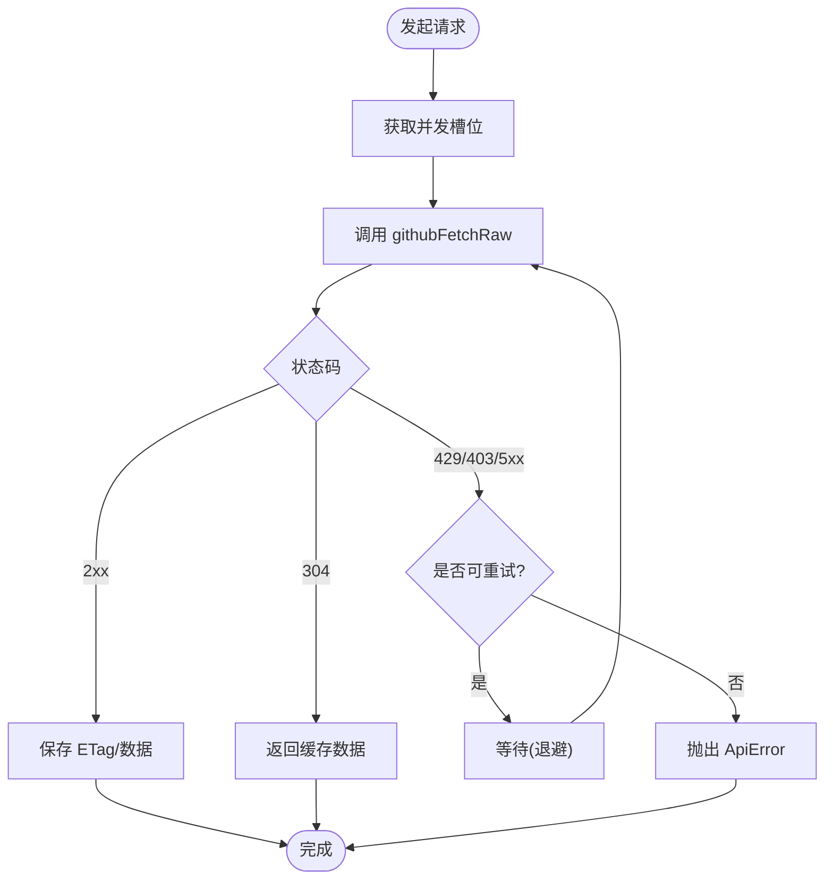

图表来源
- [lib/github-api.js:108-168](file://lib/github-api.js#L108-L168)
- [lib/github-api.js:172-227](file://lib/github-api.js#L172-L227)
- [lib/github-api.js:67-74](file://lib/github-api.js#L67-L74)
- [lib/github-api.js:111-112](file://lib/github-api.js#L111-L112)

使用示例与最佳实践
- 在路由中调用 githubGetJson 获取数据，自动处理 ETag 与缓存。
- 对于需要头部信息的场景，使用 githubGetWithHeaders。
- 对于写操作，使用 githubPostJson 或 githubDeleteJson，并注意会清理相关前缀缓存。
- 合理设置 GITHUB_MAX_CONCURRENT 与 GITHUB_MAX_RETRIES，避免触发速率限制。
- 使用 getLastRateLimit 获取最近一次速率限制状态，用于监控与告警。

章节来源
- [lib/github-api.js:14-21](file://lib/github-api.js#L14-L21)
- [lib/github-api.js:25-48](file://lib/github-api.js#L25-L48)
- [lib/github-api.js:59-64](file://lib/github-api.js#L59-L64)
- [lib/github-api.js:67-74](file://lib/github-api.js#L67-L74)
- [lib/github-api.js:108-168](file://lib/github-api.js#L108-L168)
- [lib/github-api.js:172-227](file://lib/github-api.js#L172-L227)
- [lib/github-api.js:231-269](file://lib/github-api.js#L231-L269)
- [lib/github-api.js:271-289](file://lib/github-api.js#L271-L289)
- [lib/github-api.js:291-301](file://lib/github-api.js#L291-L301)

### UsageStore 模块
设计理念
- 以 SQLite 作为本地缓存与持久化，采用 WAL 模式提升并发读写性能。
- 所有常用查询使用预编译语句，降低解析开销与 SQL 注入风险。
- 分层缓存策略：内存 LRU（GitHubAPI）、SQLite（每日用量/ETag/账单）。
- TTL 策略：近期（≤3 天）1 小时，历史 90 天；座位快照最多保留 N 条，防止无限增长。

关键实现要点
- 表结构：daily_usage、seats_snapshot、etag_cache、monthly_bill，含必要索引。
- 预编译语句：按功能拆分，如 getDay/saveDay、getDaysInRange、saveEtag、saveBillRow 等。
- 缓存管理：ETag 与每日用量分别有独立 TTL；座位快照定期裁剪。
- 事务：月度账单批量写入使用事务，保证一致性。

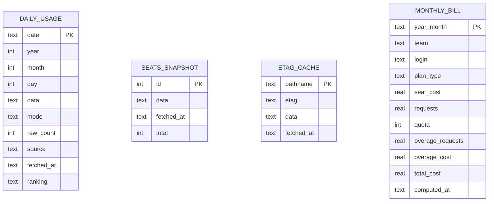

图表来源
- [lib/usage-store.js:24-71](file://lib/usage-store.js#L24-L71)
- [lib/usage-store.js:83-129](file://lib/usage-store.js#L83-L129)

使用示例与最佳实践
- 保存每日用量：调用 saveDay，传入 JSON 序列化后的 data、mode、raw_count、source、fetchedAt、ranking。
- 查询区间内缺失/新鲜度不足的日期：getMissingDays/getFreshDays。
- 清理过期数据：cleanupOldData/cleanupEtagCache。
- 月度账单：saveBill/deleteBill，注意批量写入使用事务。
- 配置数据目录：构造函数接收 dataDir，默认 data/usage.db。

章节来源
- [lib/usage-store.js:10-20](file://lib/usage-store.js#L10-L20)
- [lib/usage-store.js:24-79](file://lib/usage-store.js#L24-L79)
- [lib/usage-store.js:83-129](file://lib/usage-store.js#L83-L129)
- [lib/usage-store.js:137-198](file://lib/usage-store.js#L137-L198)
- [lib/usage-store.js:211-239](file://lib/usage-store.js#L211-L239)
- [lib/usage-store.js:243-278](file://lib/usage-store.js#L243-L278)
- [lib/usage-store.js:282-320](file://lib/usage-store.js#L282-L320)

### Scheduler 模块
设计理念
- 启动时延迟刷新今日数据，确保首次访问即有最新数据。
- 在本地时间点（默认 03:00、12:00）触发"回填刷新"，强制刷新最近 N 天（默认 2），绕过 TTL。
- 支持禁用（SCHED_DISABLED=true），适合只读副本或多实例场景。
- 提供 stop 方法优雅关闭所有定时器。

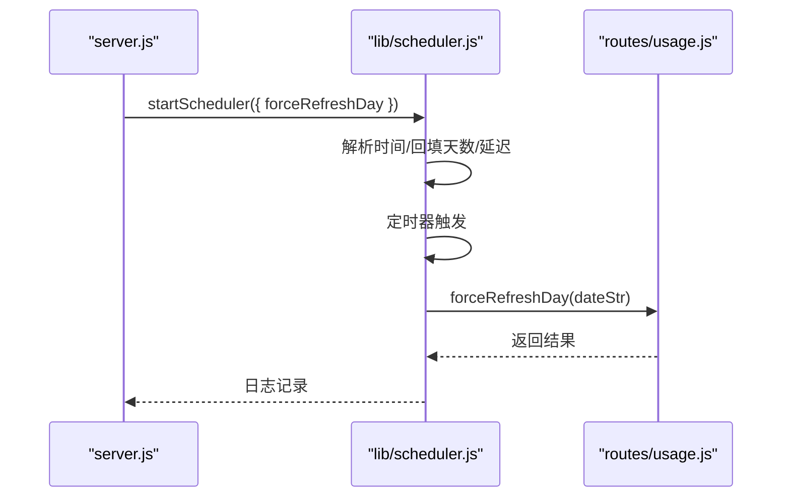

图表来源
- [server.js:146-148](file://server.js#L146-L148)
- [lib/scheduler.js:54-157](file://lib/scheduler.js#L54-L157)
- [routes/usage.js:273-277](file://routes/usage.js#L273-L277)

使用示例与最佳实践
- 环境变量：SCHED_DISABLED、SCHED_DAILY_TIMES、SCHED_BACKFILL_DAYS、SCHED_STARTUP_DELAY_MS。
- 回填天数建议：考虑 GitHub 24-48 小时延迟，通常 2 天即可覆盖。
- 多实例部署：在只读副本上设置 SCHED_DISABLED=true。
- 关闭：在进程退出时调用 scheduler.stop()。

章节来源
- [lib/scheduler.js:1-19](file://lib/scheduler.js#L1-L19)
- [lib/scheduler.js:54-157](file://lib/scheduler.js#L54-L157)
- [server.js:150-167](file://server.js#L150-L167)

### UserMappingService 模块
设计理念
- 单例模式，全局唯一映射实例。
- 文件热重载：使用 fs.watch（inotify/kqueue）监听变化，配合短防抖（300ms）避免频繁重载。
- 数据校验：仅接受包含"AD-name"和"Github-name"的有效条目，其余跳过并记录。
- 映射键：以 Github 名称小写规范化，便于快速查找。

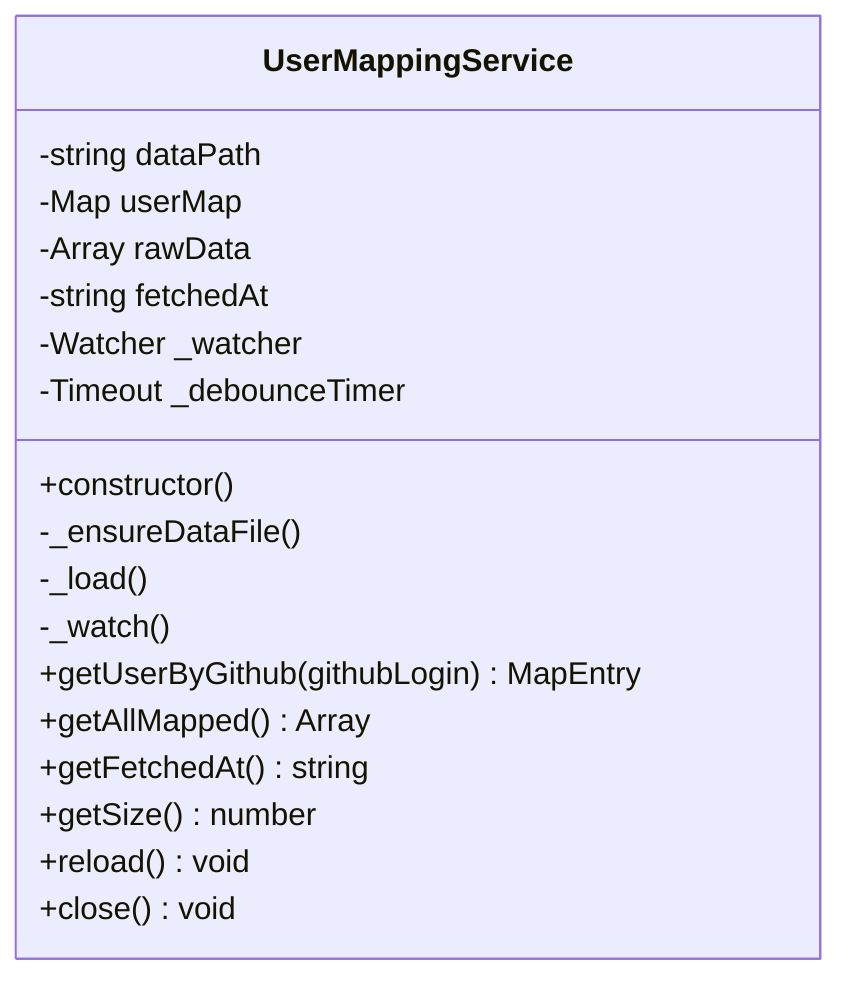

图表来源
- [lib/user-mapping.js:7-22](file://lib/user-mapping.js#L7-L22)
- [lib/user-mapping.js:36-92](file://lib/user-mapping.js#L36-L92)
- [lib/user-mapping.js:98-116](file://lib/user-mapping.js#L98-L116)
- [lib/user-mapping.js:118-130](file://lib/user-mapping.js#L118-L130)

使用示例与最佳实践
- 数据文件：data/user_mapping.json，不存在时自动创建空数组。
- 热重载：修改文件后等待约 300ms，服务自动加载新映射。
- 校验失败：非数组或缺少必要字段会被跳过，记录错误日志。
- 查询：getUserByGithub 支持大小写不敏感匹配。

章节来源
- [lib/user-mapping.js:1-158](file://lib/user-mapping.js#L1-L158)

### BillingConfig 模块
设计理念
- 计费配置集中管理，包含企业与商业计划的配额、基础费用与超量单价。
- 包含配额（INCLUDED_QUOTA）可从环境变量读取，未设置时使用默认值。
- 计费金额计算：若周期请求不超过配额则为基础费用，否则为基础费用 + 超量部分。
- **新增** AI Credits 支持：包含促销期间的信用额度配置和价格回退机制。

关键实现要点
- 标准计划配置：business 和 enterprise 类型的基础费用、配额和单价。
- **新增** AI Credits 配置：includedCredits 和 baseCost 字段，支持 2026 年第二季度的促销活动。
- **新增** 价格回退机制：AI_CREDIT_PRICE_FALLBACK 环境变量，允许自定义 AI Credits 单价。
- 计费计算：calcAmount 方法支持两种计费模式的金额计算。

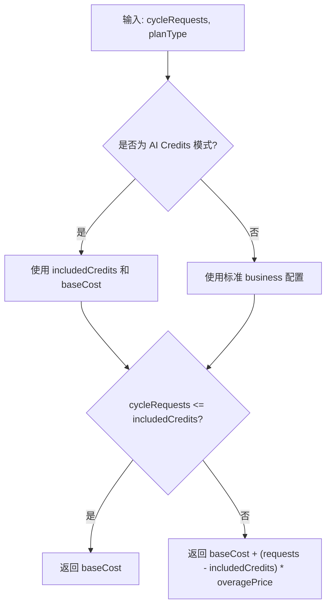

图表来源
- [lib/billing-config.js:18-22](file://lib/billing-config.js#L18-L22)
- [lib/billing-config.js:11-16](file://lib/billing-config.js#L11-L16)

使用示例与最佳实践
- 环境变量：INCLUDED_QUOTA、ENTERPRISE_SLUG、ORG_NAME、BILLING_YEAR/MONTH/DAY、PRODUCT/MODEL、AI_CREDIT_PRICE_FALLBACK 等。
- 计费计算：calcAmount 可用于估算月度账单。
- **新增** AI Credits：getIncludedCreditsPerSeat 支持促销期间的信用额度计算。
- 测试：参考单元测试覆盖不同场景。

章节来源
- [lib/billing-config.js:1-25](file://lib/billing-config.js#L1-L25)
- [test/billing-config.test.js:132-160](file://test/billing-config.test.js#L132-L160)

### DateUtils 模块
设计理念
- 提供日期字符串解析、日期范围枚举与日期键构建。
- 严格格式校验，避免错误输入导致异常。

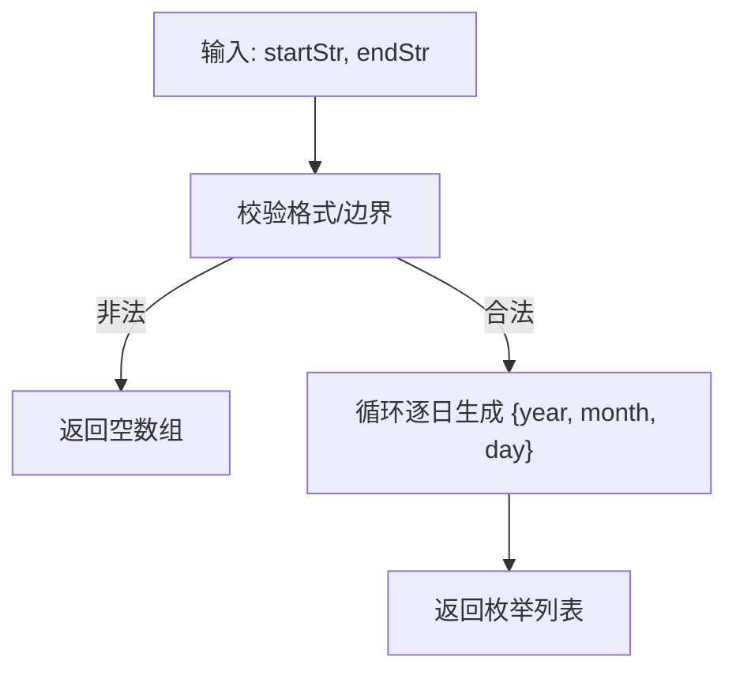

图表来源
- [lib/date-utils.js:19-33](file://lib/date-utils.js#L19-L33)

使用示例与最佳实践
- parseDateStr：严格匹配 YYYY-MM-DD。
- enumerateDays：支持跨月/跨年边界。
- buildDateKey：构建 YYYY-MM-DD 或 YYYY-MM。

章节来源
- [lib/date-utils.js:1-46](file://lib/date-utils.js#L1-L46)
- [test/date-utils.test.js:1-74](file://test/date-utils.test.js#L1-L74)

### Helpers 模块
设计理念
- 提供通用工具函数：数字转换、用户提取、错误响应、查询参数构建、端点选择。
- 与 BillingConfig 和 GitHubAPI 紧密协作，确保路由层调用一致。
- **新增** AI Credits 双源回退辅助函数：isLegacyProductSkus 用于检测 GitHub API 返回的产品级 SKU。

关键实现要点
- 数字转换：toNumber 支持安全的数值转换。
- 用户提取：pickUser 支持多种字段格式。
- 错误响应：writeError 统一错误格式。
- **新增** 产品级 SKU 检测：isLegacyProductSkus 识别传统产品分类而非实际 AI 模型名称。
- **新增** 金额标准化：normalizeBillingAmount 支持多种金额字段格式。

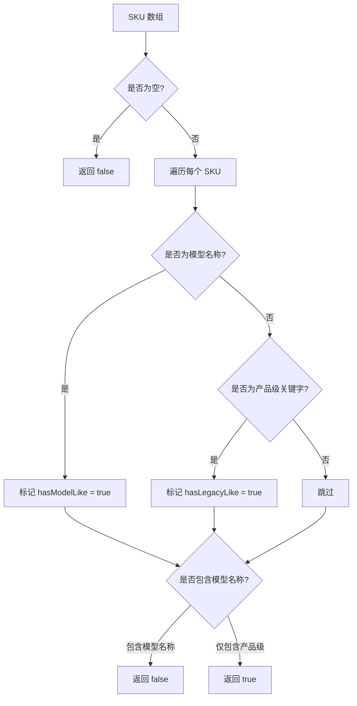

图表来源
- [lib/helpers.js:156-173](file://lib/helpers.js#L156-L173)

使用示例与最佳实践
- toNumber：安全地将字符串/数字转为数字，非法值归零。
- pickUser：从多种候选字段中提取用户名，支持对象嵌套。
- writeError：根据 ApiError 设置状态码与速率限制信息。
- buildQueryParams/buildEndpoint：从环境变量构建查询参数与端点路径。
- **新增** isLegacyProductSkus：检测 GitHub API 返回的 SKU 是否为产品级分类。

章节来源
- [lib/helpers.js:1-83](file://lib/helpers.js#L1-L83)
- [lib/helpers.js:156-173](file://lib/helpers.js#L156-L173)

### Logger 模块
设计理念
- 基于 pino，支持开发/生产不同传输与格式。
- 层级日志：trace/debug/info/warn/error。
- 敏感信息脱敏：对常见字段进行红名单过滤。
- 请求/响应序列化：标准化日志字段，便于检索与分析。

使用示例与最佳实践
- 设置 LOG_LEVEL 控制输出级别。
- 在路由与模块中统一使用 logger.info/warn/error 等接口。
- 开发环境启用 pino-pretty，生产环境保持简洁。

章节来源
- [lib/logger.js:1-41](file://lib/logger.js#L1-L41)

### Auth 模块
设计理念
- 管理员认证辅助函数，提供纯函数验证和 Express 中间件。
- 使用 bcrypt 进行密码哈希验证，支持会话管理和安全登录。
- 防止空配置绕过，确保部署安全性。

关键实现要点
- 凭据验证：verifyCredentials 支持用户名和密码验证，拒绝空配置。
- 会话管理：requireAdminPage 和 requireAdminApi 提供页面和 API 的权限保护。
- 安全措施：登录成功后重新生成会话 ID，防止会话固定攻击。

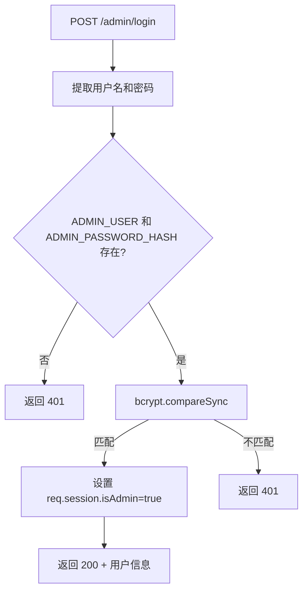

图表来源
- [routes/auth.js:17-41](file://routes/auth.js#L17-L41)
- [lib/auth.js:21-37](file://lib/auth.js#L21-L37)

使用示例与最佳实践
- 环境变量：ADMIN_USER、ADMIN_PASSWORD_HASH。
- 登录验证：verifyCredentials 支持纯函数测试。
- 权限保护：requireAdminPage 和 requireAdminApi 自动处理重定向和错误响应。
- 安全登录：登录成功后自动重新生成会话 ID。

章节来源
- [lib/auth.js:1-62](file://lib/auth.js#L1-L62)
- [routes/auth.js:1-41](file://routes/auth.js#L1-L41)
- [test/auth.test.js:1-21](file://test/auth.test.js#L1-L21)

## 依赖关系分析
- server.js 作为入口，负责中间件、单例初始化、路由挂载与调度器启动。
- routes/usage.js 依赖 GitHubAPI、UsageStore、UserMappingService、Helpers、DateUtils、Logger。
- routes/billing.js 依赖 GitHubAPI、UsageStore、Helpers、BillingConfig、Auth。
- routes/auth.js 依赖 Auth 模块，提供管理员登录和会话管理。
- lib/github-api.js 依赖 Logger、BillingConfig（环境校验）。
- lib/usage-store.js 依赖 better-sqlite3、Logger。
- lib/scheduler.js 依赖 Logger。
- lib/user-mapping.js 依赖 fs、path、Logger。
- lib/billing-config.js 依赖环境变量。
- lib/date-utils.js、lib/helpers.js、lib/logger.js 为纯工具模块。
- lib/auth.js 为认证核心模块，被 routes/auth.js 和其他需要权限验证的模块使用。

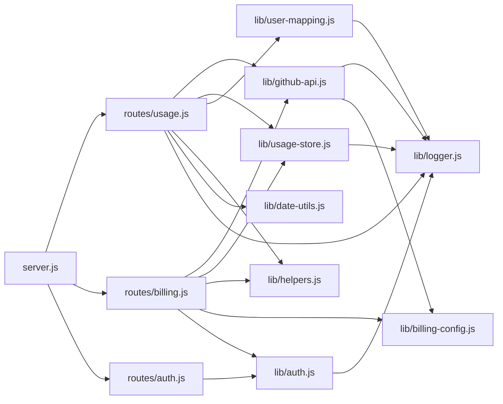

图表来源
- [server.js:88-98](file://server.js#L88-L98)
- [routes/usage.js:13-14](file://routes/usage.js#L13-L14)
- [routes/billing.js:10-11](file://routes/billing.js#L10-L11)
- [routes/auth.js:12](file://routes/auth.js#L12)
- [lib/auth.js:11](file://lib/auth.js#L11)

章节来源
- [server.js:1-182](file://server.js#L1-L182)
- [routes/usage.js:1-470](file://routes/usage.js#L1-L470)
- [routes/billing.js:1-106](file://routes/billing.js#L1-L106)
- [routes/auth.js:1-41](file://routes/auth.js#L1-L41)

## 性能考量
- 并发与重试：合理设置 GITHUB_MAX_CONCURRENT 与 GITHUB_MAX_RETRIES，避免触发 429/403。
- 缓存策略：利用 GitHubAPI 的 LRU 缓存与 ETag，结合 UsageStore 的 TTL，减少重复请求。
- 预编译语句：UsageStore 的预编译语句显著降低 SQL 解析成本。
- 调度频率：SCHED_BACKFILL_DAYS 与 SCHED_DAILY_TIMES 需结合业务需求与 GitHub 延迟设定。
- 文件热重载：UserMappingService 的防抖避免频繁 IO。
- **新增** 双源回退：AI Credits 模式的双源回退机制在检测到产品级 SKU 时自动切换 API，提高数据准确性。
- **新增** 认证安全：bcrypt 密码哈希和会话重新生成机制确保管理员访问安全。

## 故障排查指南
- GitHub API 失败
  - 检查 GITHUB_TOKEN 与 GITHUB_API_BASE 是否设置。
  - 观察速率限制头与 ApiError 中的 rateLimit 字段。
  - 查看日志中的重试与等待信息。
- SQLite 异常
  - WAL 模式下并发读写通常稳定，若出现锁冲突，检查事务与预编译语句使用。
  - 定期清理过期数据与 ETag，避免表膨胀。
- 调度器不工作
  - 确认 SCHED_DISABLED=false，SCHED_DAILY_TIMES 格式正确。
  - 查看日志中的"next slot scheduled"等信息。
- 用户映射不生效
  - 确认 data/user_mapping.json 存在且为数组。
  - 检查日志中"loaded mappings"统计与"skipped"数量。
- **新增** 认证问题
  - 检查 ADMIN_USER 和 ADMIN_PASSWORD_HASH 环境变量是否正确设置。
  - 验证 bcrypt 哈希格式和密码匹配。
  - 查看会话重新生成过程中的错误日志。
- **新增** AI Credits 双源回退问题
  - 检查 isLegacyProductSkus 函数的 SKU 检测逻辑。
  - 验证两个 API 端点的可用性和数据格式。
  - 查看双源回退的日志记录和切换条件。

章节来源
- [lib/github-api.js:14-21](file://lib/github-api.js#L14-L21)
- [lib/github-api.js:111-112](file://lib/github-api.js#L111-L112)
- [lib/usage-store.js:16-18](file://lib/usage-store.js#L16-L18)
- [lib/scheduler.js:59-69](file://lib/scheduler.js#L59-L69)
- [lib/user-mapping.js:36-92](file://lib/user-mapping.js#L36-L92)
- [lib/auth.js:21-37](file://lib/auth.js#L21-L37)
- [lib/helpers.js:156-173](file://lib/helpers.js#L156-L173)

## 结论
本项目通过模块化的架构实现了高效、可靠的 Copilot 企业用量可视化与计费支持。GitHubAPI 的并发与缓存策略、UsageStore 的本地持久化与预编译优化、Scheduler 的定时刷新、UserMappingService 的热重载与校验，共同构成了稳定的基础设施。配合 BillingConfig、DateUtils、Helpers 与 Logger，形成清晰的职责边界与可维护性。

**新增功能亮点**：
- **认证系统**：完整的管理员认证体系，包括凭据验证、会话管理和安全登录。
- **AI Credits 支持**：全面的 AI Credits 计费模式支持，包括促销期间的信用额度和价格回退机制。
- **双源回退机制**：智能的双向 API 回退系统，自动检测并切换到提供真实模型名称的数据源。

这些新增特性进一步增强了系统的功能完整性、数据准确性和安全性，为 Copilot 企业用户的用量监控和计费管理提供了更强大的支持。

## 附录
- 环境变量参考
  - GITHUB_TOKEN、GITHUB_API_BASE、GITHUB_MAX_CONCURRENT、GITHUB_MAX_RETRIES、LOG_LEVEL、SCHED_DISABLED、SCHED_DAILY_TIMES、SCHED_BACKFILL_DAYS、SCHED_STARTUP_DELAY_MS、ENTERPRISE_SLUG、ORG_NAME、BILLING_YEAR、BILLING_MONTH、BILLING_DAY、PRODUCT、MODEL、INCLUDED_QUOTA、AI_CREDIT_PRICE_FALLBACK、CACHE_TTL、ADMIN_USER、ADMIN_PASSWORD_HASH
- 常用路径
  - /api/usage、/api/usage/refresh、/api/seats、/api/billing/summary、/api/billing/models、/api/health、/admin/login、/admin/logout、/admin/session
- **新增** 认证相关
  - 管理员登录：POST /admin/login { user, password }
  - 会话检查：GET /admin/session
  - 页面权限：requireAdminPage 中间件
  - API权限：requireAdminApi 中间件
- **新增** AI Credits 功能
  - 双源回退：自动检测产品级 SKU 并切换到模型级数据源
  - 促销支持：2026 年第二季度的信用额度促销
  - 价格回退：AI_CREDIT_PRICE_FALLBACK 环境变量配置