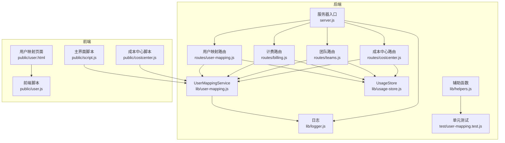
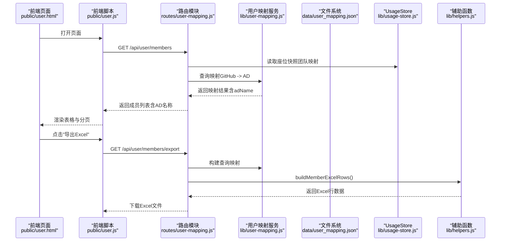
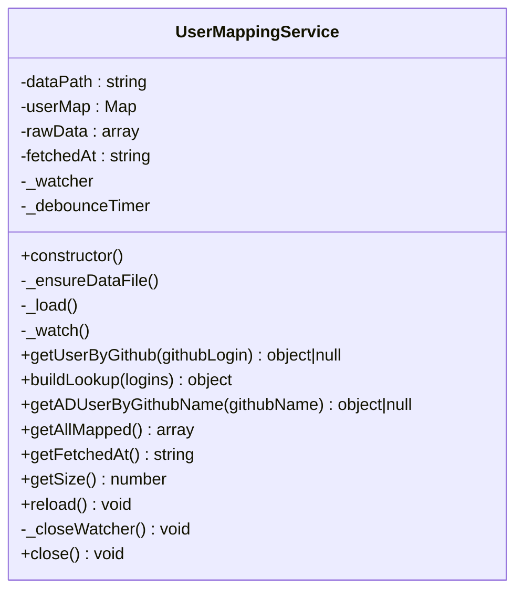
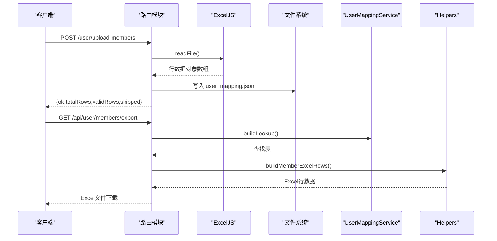
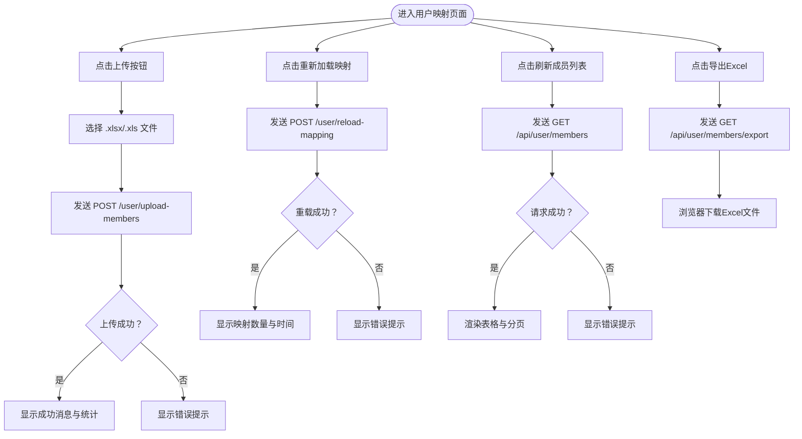
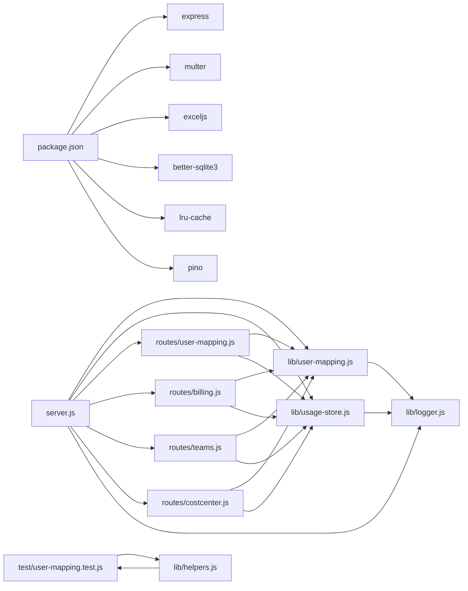

# 用户映射服务

<cite>
**本文档引用的文件**
- [lib/user-mapping.js](file://lib/user-mapping.js)
- [routes/user-mapping.js](file://routes/user-mapping.js)
- [routes/billing.js](file://routes/billing.js)
- [routes/teams.js](file://routes/teams.js)
- [routes/costcenter.js](file://routes/costcenter.js)
- [lib/helpers.js](file://lib/helpers.js)
- [test/user-mapping.test.js](file://test/user-mapping.test.js)
- [server.js](file://server.js)
- [lib/usage-store.js](file://lib/usage-store.js)
- [routes/seats.js](file://routes/seats.js)
- [lib/logger.js](file://lib/logger.js)
- [public/user.html](file://public/user.html)
- [public/user.js](file://public/user.js)
- [public/script.js](file://public/script.js)
- [public/costcenter.js](file://public/costcenter.js)
- [package.json](file://package.json)
</cite>

## 更新摘要
**变更内容**
- 新增Excel导出功能，支持将成员列表导出为Excel文件
- 扩展Active Directory用户名显示增强功能，覆盖更多路由模块
- 新增buildMemberExcelRows()函数实现和完整的单元测试
- 增强用户映射服务的数据结构，支持更多字段和导出需求

## 目录
1. [简介](#简介)
2. [项目结构](#项目结构)
3. [核心组件](#核心组件)
4. [架构总览](#架构总览)
5. [详细组件分析](#详细组件分析)
6. [Excel导出功能](#excel导出功能)
7. [Active Directory名称增强功能](#active-directory名称增强功能)
8. [依赖关系分析](#依赖关系分析)
9. [性能考虑](#性能考虑)
10. [故障排查指南](#故障排查指南)
11. [结论](#结论)
12. [附录](#附录)

## 简介
本文件为"用户映射服务"的技术文档，聚焦于用户名与显示名之间的映射机制设计与实现细节。内容涵盖：
- 映射文件格式规范与数据结构
- 文件热重载机制、数据验证规则与错误处理策略
- API接口设计、缓存策略与性能优化
- Excel导出功能的实现与使用
- Active Directory名称增强功能的实现与集成
- 使用示例：映射文件的读取、更新、查询与验证
- 与系统其他模块（座位数据、计费、成本中心）的集成方式、数据同步与一致性保障

## 项目结构
用户映射服务位于lib与routes两个目录中，并通过server.js挂载到Express应用中；前端页面与交互逻辑位于public目录。新增的Excel导出功能和AD名称增强功能在多个路由模块中实现，提供完整的用户信息管理体验。

**图表来源**
- [server.js:88-98](file://server.js#L88-L98)
- [routes/user-mapping.js:12-181](file://routes/user-mapping.js#L12-L181)
- [routes/billing.js:10-157](file://routes/billing.js#L10-L157)
- [routes/teams.js:36-118](file://routes/teams.js#L36-L118)
- [routes/costcenter.js:93-246](file://routes/costcenter.js#L93-L246)
- [lib/user-mapping.js:7-173](file://lib/user-mapping.js#L7-L173)
- [lib/helpers.js:84-149](file://lib/helpers.js#L84-149)
- [test/user-mapping.test.js:1-172](file://test/user-mapping.test.js#L1-L172)

**章节来源**
- [server.js:88-98](file://server.js#L88-L98)
- [routes/user-mapping.js:12-181](file://routes/user-mapping.js#L12-L181)
- [routes/billing.js:10-157](file://routes/billing.js#L10-L157)
- [routes/teams.js:36-118](file://routes/teams.js#L36-L118)
- [routes/costcenter.js:93-246](file://routes/costcenter.js#L93-L246)
- [lib/user-mapping.js:7-173](file://lib/user-mapping.js#L7-L173)
- [lib/helpers.js:84-149](file://lib/helpers.js#L84-149)
- [test/user-mapping.test.js:1-172](file://test/user-mapping.test.js#L1-L172)

## 核心组件
- 用户映射服务（UserMappingService）
  - 单例模式，负责映射数据的加载、缓存、热重载与查询
  - 数据来源为data/user_mapping.json，采用Map结构进行O(1)查询
  - 支持文件变更监控与防抖重载
  - 数据校验：严格要求"AD-name"和"Github-name"非空，其余字段可为空
  - 容错：文件不存在或解析失败时记录告警并回退到空映射
- 路由模块（routes/user-mapping.js）
  - 提供映射文件上传、手动重载、成员列表增强查询、按GitHub登录查询AD用户信息等接口
  - 内置Excel解析能力，支持.xlsx/.xls
  - 新增Excel导出功能，支持将成员列表导出为Excel文件
- Active Directory名称增强模块
  - 计费路由中的enrichSeatsWithAdName：非破坏性地为座位数据添加AD名称
  - 团队路由中的enrichMembersWithAdName：为团队成员列表添加AD名称
  - 成本中心路由中的enrichResourcesWithAdName：为资源列表添加AD名称
- 辅助函数模块（lib/helpers.js）
  - 新增buildMemberExcelRows函数：构建Excel导出所需的行数据
  - 新增classifyUserActivity函数：用户活跃度分类统计
- 单元测试模块（test/user-mapping.test.js）
  - 完整覆盖buildMemberExcelRows函数的测试用例
  - 测试Excel导出功能的各种场景和边界条件

**章节来源**
- [lib/user-mapping.js:7-173](file://lib/user-mapping.js#L7-L173)
- [routes/user-mapping.js:12-181](file://routes/user-mapping.js#L12-L181)
- [routes/billing.js:13-21](file://routes/billing.js#L13-L21)
- [routes/teams.js:36-44](file://routes/teams.js#L36-L44)
- [routes/costcenter.js:94-103](file://routes/costcenter.js#L94-L103)
- [lib/helpers.js:84-149](file://lib/helpers.js#L84-149)
- [test/user-mapping.test.js:1-172](file://test/user-mapping.test.js#L1-L172)

## 架构总览
用户映射服务在系统中的位置与交互如下，新增了Excel导出功能和AD名称增强功能：

**图表来源**
- [routes/user-mapping.js:125-168](file://routes/user-mapping.js#L125-L168)
- [lib/user-mapping.js:128-137](file://lib/user-mapping.js#L128-L137)
- [lib/helpers.js:90-113](file://lib/helpers.js#L90-L113)
- [public/user.js:210-212](file://public/user.js#L210-L212)

## 详细组件分析

### 用户映射服务（UserMappingService）
- 设计要点
  - 单例：避免重复实例导致的数据不一致
  - 内存缓存：Map结构存储映射，键为GitHub名称的小写化，值为包含AD/邮箱等字段的对象
  - 文件热重载：基于fs.watch的事件驱动监听，配合300ms防抖，避免频繁重载
  - 数据校验：严格要求"AD-name"和"Github-name"非空，其余字段可为空
  - 容错：文件不存在或解析失败时记录告警并回退到空映射
- 关键方法
  - 构造函数：初始化路径、确保数据文件存在、首次加载、启动监听
  - _ensureDataFile：若不存在则创建空数组文件
  - _load：读取JSON、校验类型、过滤无效条目、构建Map与原始数组、记录加载时间
  - _watch：启动文件监听，错误时优雅降级
  - getUserByGithub：按GitHub登录名查询映射（大小写不敏感）
  - buildLookup：批量查询映射，返回规范化登录名到映射对象的查找表
  - getADUserByGithubName：别名方法
  - getAllMapped/getFetchedAt/getSize：查询全量映射、加载时间、映射数量
  - reload/close：手动重载与资源释放

**图表来源**
- [lib/user-mapping.js:7-173](file://lib/user-mapping.js#L7-L173)

**章节来源**
- [lib/user-mapping.js:7-173](file://lib/user-mapping.js#L7-L173)

### 路由模块（routes/user-mapping.js）
- 功能概览
  - 上传映射文件：支持.xlsx/.xls，解析为JSON并写入data/user_mapping.json
  - 手动重载映射：触发UserMappingService.reload
  - 成员列表增强：结合座位数据与映射，返回包含AD字段的成员列表
  - 查询接口：按GitHub登录名查询对应的AD用户信息
  - **新增Excel导出**：将成员列表导出为Excel文件，支持7列数据格式
- 关键流程
  - 上传流程：Multer存储到uploads，ExcelJS解析，写入user_mapping.json，返回统计
  - 查询流程：ensureSeatsData -> teamCache.seatsRaw -> userMappingService.getUserByGithub
  - **Excel导出流程**：构建成员列表 -> buildMemberExcelRows -> ExcelJS生成文件 -> 下载响应
  - 错误处理：统一通过helpers.writeError输出

**图表来源**
- [routes/user-mapping.js:79-94](file://routes/user-mapping.js#L79-L94)
- [routes/user-mapping.js:125-168](file://routes/user-mapping.js#L125-L168)
- [lib/user-mapping.js:128-137](file://lib/user-mapping.js#L128-L137)
- [lib/helpers.js:90-113](file://lib/helpers.js#L90-L113)

**章节来源**
- [routes/user-mapping.js:12-181](file://routes/user-mapping.js#L12-L181)
- [routes/user-mapping.js:79-94](file://routes/user-mapping.js#L79-L94)
- [routes/user-mapping.js:125-168](file://routes/user-mapping.js#L125-L168)

### 辅助函数模块（lib/helpers.js）
- 功能概览
  - **新增buildMemberExcelRows**：构建Excel导出所需的行数据，包含7列标准格式
  - **新增classifyUserActivity**：根据最后活跃时间对用户进行活跃度分类
  - 其他通用辅助函数：数字转换、用户选择、错误处理、参数构建等
- 关键功能
  - buildMemberExcelRows：将成员数据转换为Excel格式，包含映射状态判断
  - classifyUserActivity：根据活跃天数将用户分为不同类别
  - 其他工具函数：pickUser、writeError、buildQueryParams、buildEndpoint

**章节来源**
- [lib/helpers.js:84-149](file://lib/helpers.js#L84-L149)

### 单元测试模块（test/user-mapping.test.js）
- 功能概览
  - **新增buildMemberExcelRows函数的完整测试套件**
  - 测试Excel导出功能的各种场景和边界条件
  - 测试用户活跃度分类功能
- 关键测试用例
  - Excel头部验证：确保7列标题正确
  - 完整数据映射：验证所有字段正确转换
  - 空值处理：验证null/undefined字段填充"--"
  - 映射状态判断：验证"已映射"/"未映射"状态
  - 多成员处理：验证批量数据处理
  - 用户活跃度分类：验证不同活跃度区间的正确分类

**章节来源**
- [test/user-mapping.test.js:1-172](file://test/user-mapping.test.js#L1-L172)

### 前端页面与交互（public/user.html, public/user.js）
- 页面功能
  - 上传映射文件（.xlsx/.xls），显示上传状态与统计
  - 手动重载映射，显示加载时间与数量
  - 刷新成员列表，展示GitHub用户名、Team、AD用户名/邮箱、计划类型、最后活跃时间与映射状态
  - **新增Excel导出按钮**，支持一键导出成员列表
  - 支持按列排序与分页
- 交互流程
  - 上传：FormData发送至/user/upload-members
  - 重载：POST /user/reload-mapping
  - 列表：GET /api/user/members
  - **导出**：GET /api/user/members/export，触发浏览器下载

**图表来源**
- [public/user.html:17-46](file://public/user.html#L17-L46)
- [public/user.js:210-212](file://public/user.js#L210-L212)

**章节来源**
- [public/user.html:1-54](file://public/user.html#L1-L54)
- [public/user.js:1-346](file://public/user.js#L1-L346)

### 数据模型与文件格式规范
- 映射文件（data/user_mapping.json）
  - 类型：数组（Array）
  - 元素对象字段：
    - AD-name：AD用户名（必填）
    - AD-mail：AD邮箱（可选）
    - Github-name：GitHub用户名（必填）
    - Github-mail：GitHub邮箱（可选）
  - 校验规则：
    - 必须为数组；否则忽略该文件
    - 每个条目必须同时包含AD-name与Github-name，否则跳过
    - 字段值将被trim后存储
- 缓存结构
  - userMap：Map，键为GitHub名称小写化，值为包含上述字段的对象
  - rawData：原始数组，用于导出与列表展示
  - fetchedAt：字符串，ISO时间戳，表示最近一次加载时间

**章节来源**
- [lib/user-mapping.js:36-92](file://lib/user-mapping.js#L36-L92)
- [routes/user-mapping.js:64-69](file://routes/user-mapping.js#L64-L69)

### API接口设计
- 上传映射文件
  - 方法：POST /user/upload-members
  - 请求体：multipart/form-data，字段file
  - 响应：包含成功条数、跳过条数、总条数与文件名
- 手动重载映射
  - 方法：POST /user/reload-mapping
  - 响应：包含映射数量与加载时间
- 成员列表（增强）
  - 方法：GET /api/user/members
  - 响应：包含loadedAt、total、mappedCount与members数组，members中包含login、team、adName、adMail、planType、lastActivityAt
- **Excel导出接口**
  - 方法：GET /api/user/members/export
  - 响应：application/vnd.openxmlformats-officedocument.spreadsheetml.sheet格式的Excel文件
  - 包含7列：Github用户名、Team、AD用户名、AD邮箱、计划、最后活跃、映射状态
- 查询AD用户信息
  - 方法：GET /api/user/info?github=...
  - 响应：包含githubName、adName、adMail、githubMail或未找到提示

**章节来源**
- [routes/user-mapping.js:79-94](file://routes/user-mapping.js#L79-L94)
- [routes/user-mapping.js:125-168](file://routes/user-mapping.js#L125-L168)
- [routes/user-mapping.js:170-178](file://routes/user-mapping.js#L170-L178)

### 缓存策略与性能优化
- 内存缓存
  - Map结构提供O(1)查找，适合高频查询场景
  - 缓存键为GitHub名称小写化，避免大小写差异带来的重复计算
  - **新增buildLookup方法**：批量查询映射，提高多用户查询效率
- 文件热重载
  - 使用fs.watch（inotify/kqueue）而非轮询，降低CPU开销
  - 防抖300ms，合并短时间内多次变更
- 数据持久化与一致性
  - 映射文件写入后立即触发重载，确保前端与后端一致
  - 与UsageStore的seats快照配合，避免重复拉取GitHub数据
- 前端分页与排序
  - 前端分页（每页固定数量）减少一次性传输与渲染压力
  - 本地排序避免重复网络请求
- **Excel导出性能**
  - 使用ExcelJS流式写入，避免大文件内存占用
  - 批量查询映射，减少数据库访问次数

**章节来源**
- [lib/user-mapping.js:128-137](file://lib/user-mapping.js#L128-L137)
- [routes/seats.js:37-75](file://routes/seats.js#L37-L75)
- [public/user.js:6-12](file://public/user.js#L6-L12)
- [public/user.js:170-203](file://public/user.js#L170-L203)

### 错误处理策略
- 文件系统错误
  - 确保数据文件失败：记录错误日志
  - 文件不存在：记录警告并回退空映射
  - 监听器错误：记录警告并关闭监听器，降级为无监听
- 解析与校验错误
  - 非数组文件：记录错误并跳过
  - 缺失必填字段：跳过该条目并统计跳过数量
- API层错误
  - 统一通过helpers.writeError输出，区分GitHubAPI错误与通用错误
  - 包含速率限制信息（如适用）
- **Excel导出错误**
  - Excel文件解析失败：返回400错误
  - 导出过程中异常：记录错误并返回标准错误响应

**章节来源**
- [lib/user-mapping.js:24-34](file://lib/user-mapping.js#L24-L34)
- [lib/user-mapping.js:85-91](file://lib/user-mapping.js#L85-L91)
- [lib/user-mapping.js:109-115](file://lib/user-mapping.js#L109-L115)
- [lib/helpers.js:30-36](file://lib/helpers.js#L30-L36)

## Excel导出功能

### buildMemberExcelRows函数实现
新增的buildMemberExcelRows函数负责将成员数据转换为Excel导出格式：

- **功能特性**
  - 生成标准7列Excel表格：Github用户名、Team、AD用户名、AD邮箱、计划、最后活跃、映射状态
  - 自动处理空值：null/undefined字段填充"--"
  - 智能映射状态判断：根据adName是否存在决定"已映射"/"未映射"
  - 日期格式化：将ISO时间转换为中文本地化格式
- **实现原理**
  - 定义固定表头数组
  - 遍历成员数组，逐行构建数据
  - 使用三元运算符处理空值和映射状态
  - 使用toLocaleString进行日期本地化

**章节来源**
- [lib/helpers.js:90-113](file://lib/helpers.js#L90-L113)
- [test/user-mapping.test.js:4-81](file://test/user-mapping.test.js#L4-L81)

### Excel导出API实现
用户映射路由新增了完整的Excel导出功能：

- **功能特性**
  - 支持标准Excel格式（.xlsx）
  - 自动设置列宽和表头样式
  - 流式下载，支持大数据量导出
  - 文件命名包含日期信息
- **实现流程**
  - 获取座位数据并构建查询映射
  - 调用buildMemberExcelRows生成行数据
  - 使用ExcelJS创建工作簿和工作表
  - 设置列宽和表头加粗
  - 设置响应头并下载文件

**章节来源**
- [routes/user-mapping.js:125-168](file://routes/user-mapping.js#L125-L168)
- [lib/helpers.js:90-113](file://lib/helpers.js#L90-L113)

### 单元测试覆盖
新增的单元测试确保Excel导出功能的可靠性：

- **测试场景**
  - 表头验证：确保7列标题正确
  - 完整数据映射：验证所有字段转换
  - 空值处理：验证null/undefined字段填充
  - 映射状态判断：验证"已映射"/"未映射"状态
  - 多成员处理：验证批量数据处理
- **测试方法**
  - 使用Vitest框架
  - 每个测试用例独立验证特定功能
  - 包含边界条件和异常情况

**章节来源**
- [test/user-mapping.test.js:1-172](file://test/user-mapping.test.js#L1-L172)

## Active Directory名称增强功能

### 计费路由中的AD名称增强
在计费路由中实现了非破坏性的AD名称增强功能，通过`enrichSeatsWithAdName`函数为座位数据添加AD名称信息：

- **功能特性**
  - 非破坏性：不修改原始teamCache.seatsRaw数据
  - 安全处理：使用try-catch包装，异常时返回空AD名称
  - 智能回退：当映射不存在时自动回退到GitHub用户名
  - **批量查询优化**：使用buildLookup方法进行批量映射查询
- **实现原理**
  - 对每个座位数据调用userMappingService.buildLookup
  - 如果存在映射且包含adName，则添加到返回结果中
  - 异常情况下保持原数据不变

**章节来源**
- [routes/billing.js:13-21](file://routes/billing.js#L13-L21)
- [lib/user-mapping.js:128-137](file://lib/user-mapping.js#L128-L137)

### 团队路由中的AD名称增强
团队路由提供了`enrichMembersWithAdName`函数，专门用于增强团队成员列表的AD名称：

- **功能特性**
  - 简洁高效：直接返回增强后的成员列表
  - 安全处理：检查userMappingService和登录名有效性
  - 异常容错：任何异常都返回原始成员数据
  - **批量查询优化**：使用buildLookup方法进行批量映射查询
- **应用场景**
  - 团队成员列表显示
  - 用户头像下方的名称显示
  - 用户信息弹窗展示

**章节来源**
- [routes/teams.js:36-44](file://routes/teams.js#L36-L44)
- [routes/teams.js:73-98](file://routes/teams.js#L73-L98)

### 成本中心路由中的AD名称增强
成本中心路由实现了`enrichResourcesWithAdName`函数，专门为用户类型的资源添加AD名称：

- **功能特性**
  - 类型过滤：仅对type为"user"的资源进行增强
  - 非破坏性：保持原始资源数据不变，只添加adName字段
  - 智能显示：当资源为用户类型且存在AD名称时显示AD名称
  - **批量查询优化**：使用buildLookup方法进行批量映射查询
- **实现逻辑**
  - 检查资源类型是否为用户
  - 获取用户映射并提取AD名称
  - 返回增强后的资源对象

**章节来源**
- [routes/costcenter.js:94-103](file://routes/costcenter.js#L94-L103)
- [routes/costcenter.js:129-130](file://routes/costcenter.js#L129-L130)

### 前端显示逻辑更新
前端多个页面都更新了显示逻辑，优先显示AD名称：

- **主界面显示**
  - 用户名显示：`displayName = row.adName || row.user`
  - 团队成员显示：`display = m.adName || m.login`
  - 座位用户显示：`display = s.adName || s.login`
- **成本中心显示**
  - 用户资源显示：`display = (section.key === "user" && r.adName) ? r.adName : name`
- **用户体验提升**
  - AD名称优先显示，提供更直观的用户识别
  - 当AD名称不存在时自动回退到GitHub用户名
  - 保持向后兼容性，不影响现有功能

**章节来源**
- [public/script.js:114-131](file://public/script.js#L114-L131)
- [public/script.js:444-449](file://public/script.js#L444-L449)
- [public/script.js:461-469](file://public/script.js#L461-L469)
- [public/costcenter.js:74-77](file://public/costcenter.js#L74-L77)

## 依赖关系分析

**图表来源**
- [package.json:12-21](file://package.json#L12-L21)
- [server.js:40-48](file://server.js#L40-L48)
- [routes/user-mapping.js:12-181](file://routes/user-mapping.js#L12-L181)
- [routes/billing.js:10-157](file://routes/billing.js#L10-L157)
- [routes/teams.js:36-118](file://routes/teams.js#L36-L118)
- [routes/costcenter.js:93-246](file://routes/costcenter.js#L93-L246)
- [lib/user-mapping.js:1-3](file://lib/user-mapping.js#L1-L3)
- [lib/usage-store.js:1-4](file://lib/usage-store.js#L1-L4)
- [lib/helpers.js:1-3](file://lib/helpers.js#L1-L3)
- [lib/logger.js:1-2](file://lib/logger.js#L1-L2)
- [test/user-mapping.test.js:1-3](file://test/user-mapping.test.js#L1-L3)

**章节来源**
- [package.json:12-21](file://package.json#L12-L21)
- [server.js:40-48](file://server.js#L40-L48)
- [routes/user-mapping.js:12-181](file://routes/user-mapping.js#L12-L181)
- [routes/billing.js:10-157](file://routes/billing.js#L10-L157)
- [routes/teams.js:36-118](file://routes/teams.js#L36-L118)
- [routes/costcenter.js:93-246](file://routes/costcenter.js#L93-L246)
- [lib/user-mapping.js:1-3](file://lib/user-mapping.js#L1-L3)
- [lib/usage-store.js:1-4](file://lib/usage-store.js#L1-L4)
- [lib/helpers.js:1-3](file://lib/helpers.js#L1-L3)
- [lib/logger.js:1-2](file://lib/logger.js#L1-L2)
- [test/user-mapping.test.js:1-3](file://test/user-mapping.test.js#L1-L3)

## 性能考虑
- 查询性能
  - Map键查找为O(1)，适合高并发查询
  - **新增buildLookup方法**：批量查询映射，提高多用户查询效率
  - 避免在每次查询中重复解析文件
- I/O优化
  - 使用fs.watch替代轮询，降低CPU占用
  - 防抖机制减少频繁重载
  - **Excel导出使用流式写入**，避免大文件内存占用
- 前端体验
  - 分页与本地排序减少网络与渲染压力
  - 骨架屏提升加载体验
  - **Excel导出支持后台下载**，不阻塞UI线程
- 数据一致性
  - 上传后立即重载，避免脏读
  - 与seats快照配合，避免重复拉取GitHub数据
- **AD名称增强性能**
  - 非破坏性增强避免数据复制开销
  - 批量查询映射减少数据库访问次数
  - 异常处理确保操作的原子性
  - 前端显示逻辑优化，减少DOM操作

## 故障排查指南
- 上传文件后页面未更新
  - 检查data/user_mapping.json是否正确写入
  - 在控制台查看/user/reload-mapping是否返回成功
  - 查看日志中关于文件变更与重载的信息
- 查询不到映射
  - 确认映射文件中包含AD-name与Github-name
  - 检查GitHub名称大小写是否与登录名一致
- 服务器启动后映射为空
  - 检查data/user_mapping.json是否存在且为数组
  - 查看日志中关于"数据文件不存在"或"数据文件必须包含数组"的提示
- 监听器失效
  - 查看日志中关于fs.watch错误与降级的记录
  - 尝试手动重载映射
- **Excel导出问题**
  - 检查ExcelJS依赖是否正确安装
  - 确认成员数据格式正确
  - 查看导出过程中的错误日志
- **AD名称显示问题**
  - 检查映射文件中是否存在AD-name字段
  - 确认userMappingService正常工作
  - 查看前端控制台是否有相关错误信息

**章节来源**
- [lib/user-mapping.js:85-91](file://lib/user-mapping.js#L85-L91)
- [lib/user-mapping.js:109-115](file://lib/user-mapping.js#L109-L115)
- [lib/user-mapping.js:140-142](file://lib/user-mapping.js#L140-L142)
- [lib/logger.js:13-38](file://lib/logger.js#L13-L38)
- [routes/user-mapping.js:125-168](file://routes/user-mapping.js#L125-L168)

## 结论
用户映射服务以简洁可靠的方式实现了用户名与显示名之间的映射与查询，具备以下特点：
- 明确的文件格式规范与严格的校验规则
- 基于事件驱动的热重载与防抖机制
- 高效的内存缓存与良好的错误处理
- 与座位数据、前端的良好集成，提供完整的成员列表增强体验
- **新增Excel导出功能**，支持批量数据导出和分析
- **扩展的Active Directory名称增强功能**，覆盖更多路由场景
- **完整的单元测试覆盖**，确保功能稳定性和可靠性
- 支持多路由场景下的AD名称显示，提升用户体验

## 附录

### 使用示例（步骤说明）
- 上传映射文件
  - 在前端页面点击"上传用户映射文件"，选择.xlsx/.xls文件
  - 提交后查看上传统计与成功提示
- 手动重载映射
  - 在前端点击"重新加载映射"，查看映射数量与加载时间
- 查询成员列表
  - 在前端点击"刷新成员列表"，查看包含AD用户名/邮箱的表格
- **Excel导出**
  - 在前端点击"导出Excel"按钮，下载包含7列数据的Excel文件
  - 文件包含：Github用户名、Team、AD用户名、AD邮箱、计划、最后活跃、映射状态
- 查询单个用户
  - 调用/api/user/info?github=用户名，获取对应AD用户信息
- AD名称显示
  - 在计费、团队、成本中心等页面查看AD名称优先显示效果

**章节来源**
- [public/user.html:17-46](file://public/user.html#L17-L46)
- [public/user.js:210-212](file://public/user.js#L210-L212)
- [routes/user-mapping.js:79-94](file://routes/user-mapping.js#L79-L94)
- [routes/user-mapping.js:125-168](file://routes/user-mapping.js#L125-L168)
- [routes/billing.js:25-33](file://routes/billing.js#L25-L33)
- [routes/teams.js:72-95](file://routes/teams.js#L72-L95)
- [routes/costcenter.js:125-154](file://routes/costcenter.js#L125-L154)