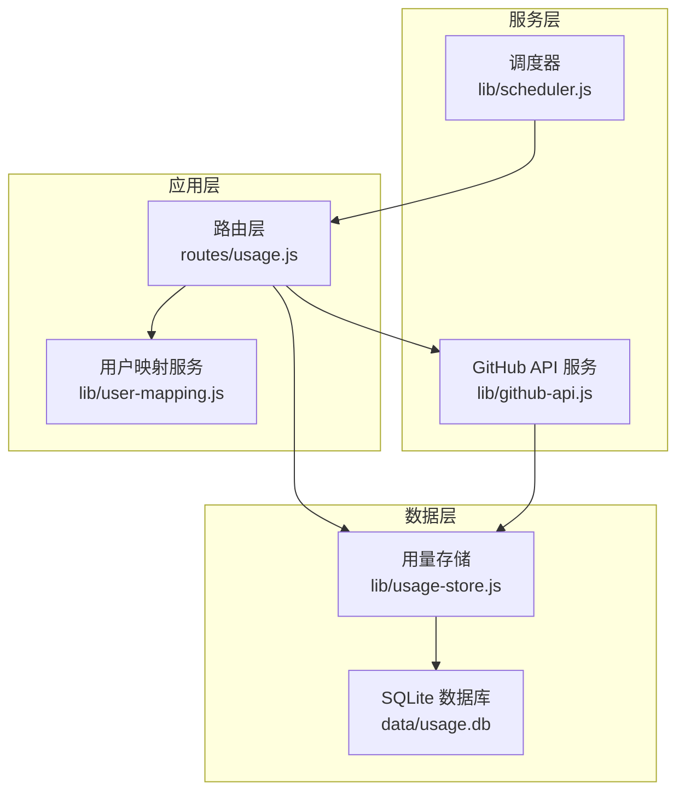
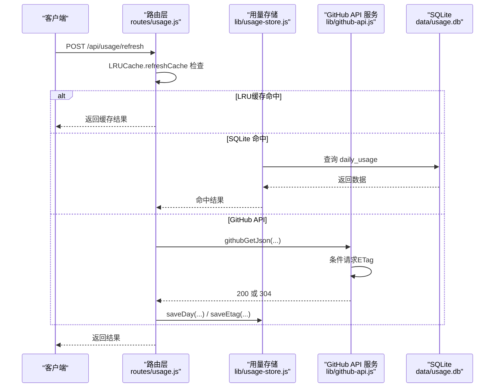
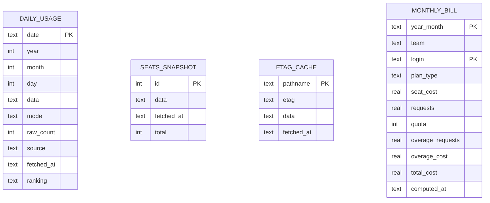
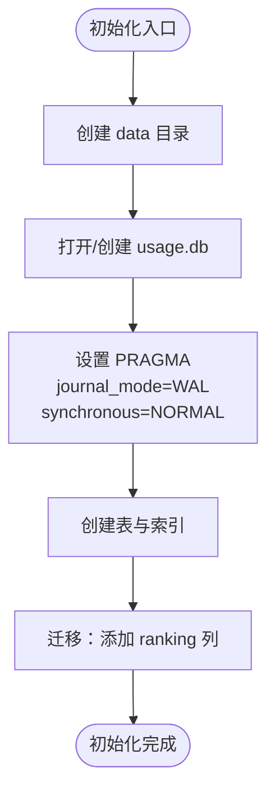
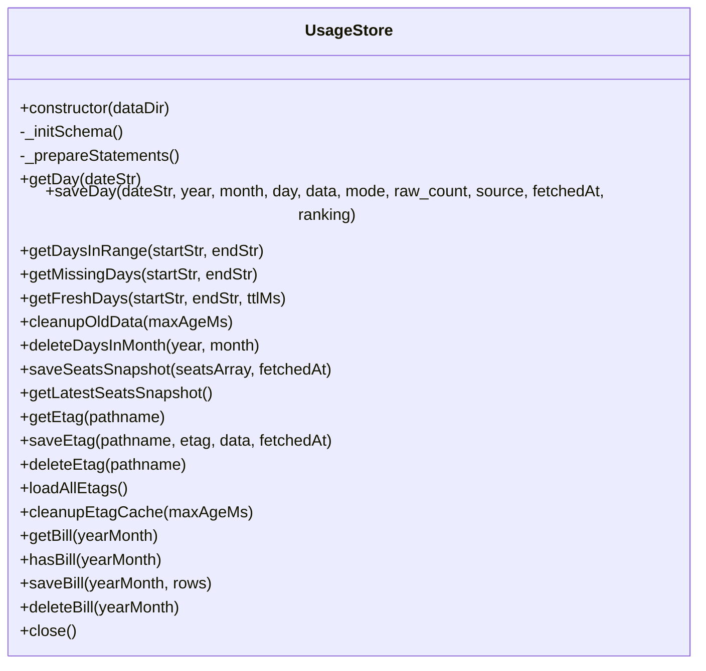
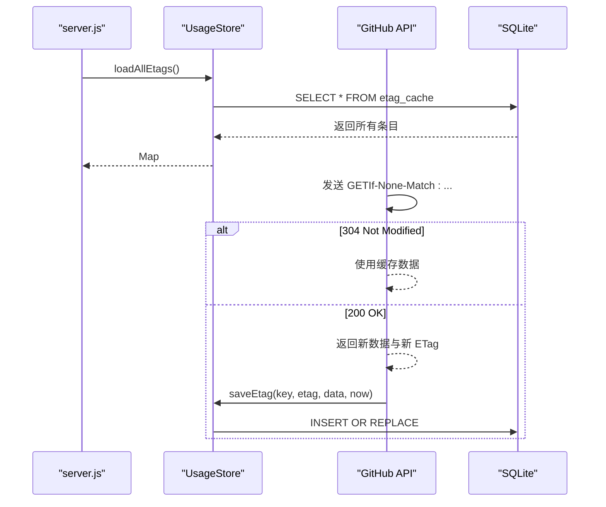
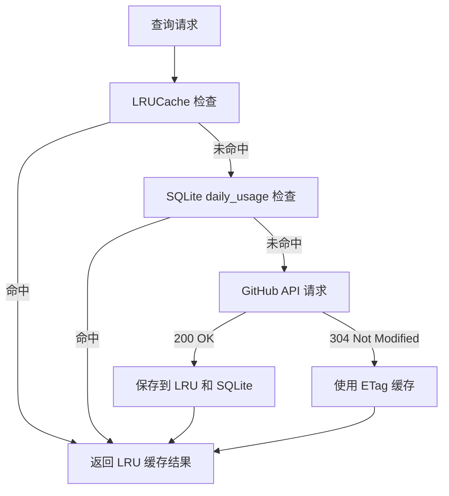
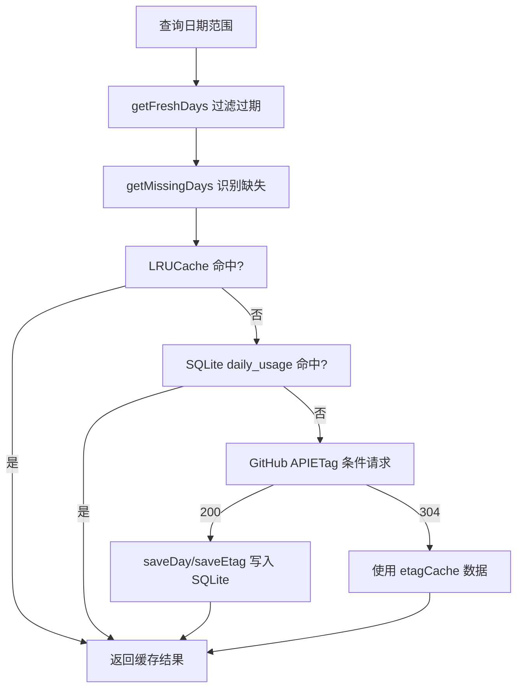
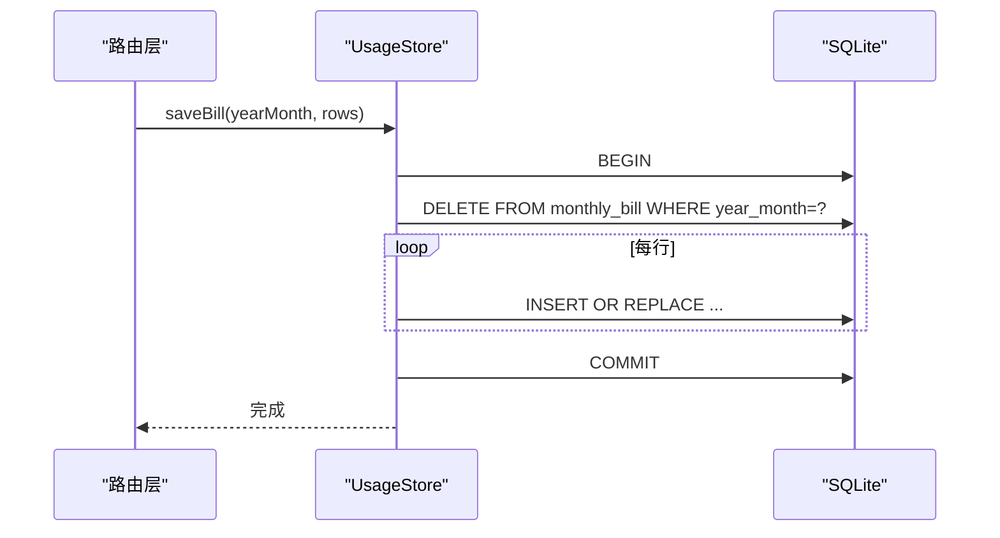
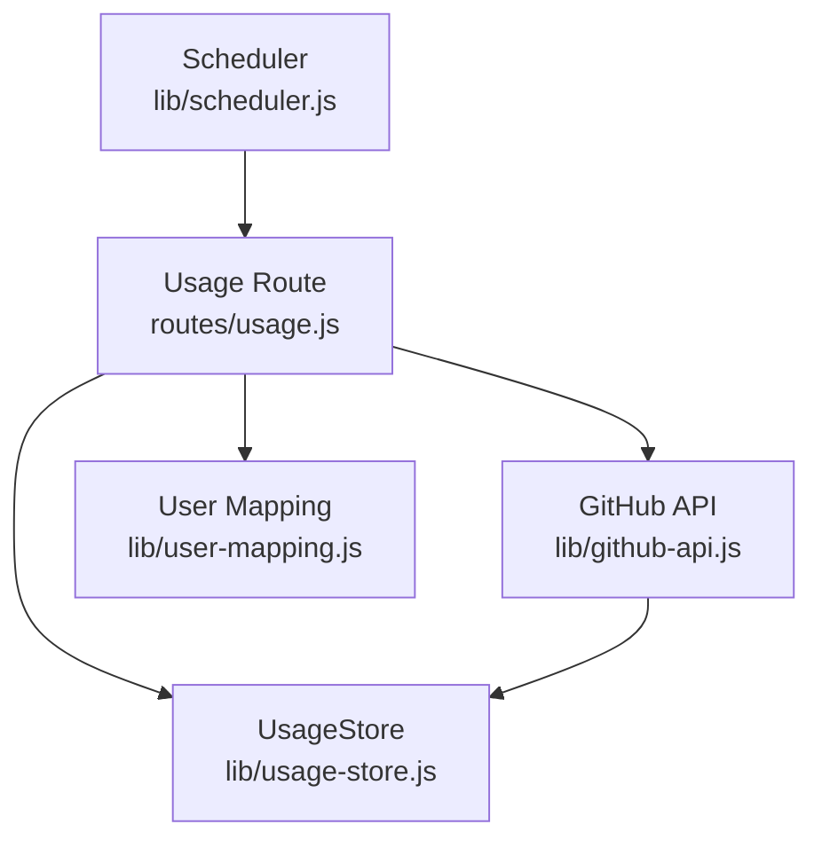

# 用量存储模块

<cite>
**本文引用的文件**
- [lib/usage-store.js](file://lib/usage-store.js)
- [lib/github-api.js](file://lib/github-api.js)
- [routes/usage.js](file://routes/usage.js)
- [server.js](file://server.js)
- [docs/sqlite-cache-design.md](file://docs/sqlite-cache-design.md)
- [README.md](file://README.md)
- [lib/user-mapping.js](file://lib/user-mapping.js)
- [routes/user-mapping.js](file://routes/user-mapping.js)
- [lib/scheduler.js](file://lib/scheduler.js)
- [lib/billing-config.js](file://lib/billing-config.js)
</cite>

## 更新摘要
**变更内容**
- 使用LRUCache替换用量刷新缓存，防止高负载操作时的内存泄漏
- 更新缓存管理策略，采用LRU算法控制内存使用
- 优化缓存容量和TTL配置，提升系统稳定性

## 目录
1. [简介](#简介)
2. [项目结构](#项目结构)
3. [核心组件](#核心组件)
4. [架构总览](#架构总览)
5. [详细组件分析](#详细组件分析)
6. [依赖关系分析](#依赖关系分析)
7. [性能考量](#性能考量)
8. [故障排查指南](#故障排查指南)
9. [结论](#结论)
10. [附录](#附录)

## 简介
本技术文档聚焦于用量存储模块，系统性阐述基于 SQLite 的数据持久化层设计与实现，涵盖 DailyUsage、SeatSnapshot、MonthlyBill、UserMapping 等核心数据表的结构与索引策略，数据库初始化流程、预编译语句的性能优化、ETag 缓存的持久化机制，以及数据访问模式、缓存管理策略、事务处理与数据一致性保障。文档还提供 saveEtag、loadAllEtags、saveDailyUsage、getDailyUsage 等核心方法的使用示例与参数说明，并解释数据库迁移路径、版本管理与性能考虑。

**更新** 本版本重点介绍了LRUCache缓存机制的引入，该机制有效防止了高负载操作时的内存泄漏问题，提升了系统的稳定性和可扩展性。

## 项目结构
用量存储模块位于 lib/usage-store.js，围绕 SQLite 数据库提供统一的数据访问接口，配合 routes/usage.js 的业务逻辑与 server.js 的生命周期管理，形成"内存缓存 → SQLite 持久缓存 → GitHub API"的三层缓存架构。

**图表来源**
- [server.js:40-52](file://server.js#L40-L52)
- [routes/usage.js:13](file://routes/usage.js#L13)
- [lib/usage-store.js:10-20](file://lib/usage-store.js#L10-L20)
- [lib/github-api.js:67-74](file://lib/github-api.js#L67-L74)

**章节来源**
- [server.js:40-52](file://server.js#L40-L52)
- [routes/usage.js:13](file://routes/usage.js#L13)
- [lib/usage-store.js:10-20](file://lib/usage-store.js#L10-L20)
- [lib/github-api.js:67-74](file://lib/github-api.js#L67-L74)

## 核心组件
- UsageStore：SQLite 封装类，负责数据库初始化、表结构与索引、预编译语句、数据读写、清理与事务。
- GitHub API 服务：提供 ETag 条件请求、LRU 缓存、单次飞行去重、重试与并发控制，并与 SQLite 的 etag_cache 表联动。
- 调度器：定时强制刷新近期数据，提升缓存新鲜度，避免 GitHub API 延迟导致的"锁死"。
- 用户映射服务：提供 GitHub 用户名到 AD 名称的映射，支持热重载与文件监听。
- **LRUCache 缓存**：使用 lru-cache 库实现的内存缓存，替代原有的简单内存缓存，防止高负载时的内存泄漏。

**更新** 新增LRUCache缓存组件，采用LRU算法管理内存使用，确保系统在高并发场景下的稳定性。

**章节来源**
- [lib/usage-store.js:10-324](file://lib/usage-store.js#L10-L324)
- [lib/github-api.js:67-74](file://lib/github-api.js#L67-L74)
- [lib/scheduler.js:54-157](file://lib/scheduler.js#L54-L157)
- [lib/user-mapping.js:7-158](file://lib/user-mapping.js#L7-L158)
- [routes/usage.js:17-19](file://routes/usage.js#L17-L19)

## 架构总览
用量存储模块采用"内存缓存 + SQLite 持久缓存 + GitHub API"的分层缓存策略，其中 SQLite 作为本地持久化层，承担历史用量、席位快照与 ETag 缓存的持久化，显著降低 API 调用频率与响应延迟。**更新** 新的LRUCache缓存机制确保了在高并发场景下内存使用的可控性。

**图表来源**
- [routes/usage.js:279-348](file://routes/usage.js#L279-L348)
- [lib/github-api.js:231-269](file://lib/github-api.js#L231-L269)
- [lib/usage-store.js:137-160](file://lib/usage-store.js#L137-L160)

**章节来源**
- [routes/usage.js:279-348](file://routes/usage.js#L279-L348)
- [lib/github-api.js:231-269](file://lib/github-api.js#L231-L269)
- [lib/usage-store.js:137-160](file://lib/usage-store.js#L137-L160)

## 详细组件分析

### 数据表设计与索引策略
- daily_usage
  - 主键：date（YYYY-MM-DD）
  - 字段：year、month、day、data（JSON）、mode、raw_count、source、fetched_at、ranking（JSON）
  - 索引：idx_daily_usage_date(date)
  - TTL：默认 90 天，近 3 天采用 1 小时 TTL，避免 GitHub API 24–48h 延迟写入不完整数据被"锁死"
- seats_snapshot
  - 主键：id（自增）
  - 字段：data（JSON）、fetched_at、total
  - 索引：idx_seats_snapshot_fetched(fetched_at)
  - TTL：10 分钟，用于席位列表的快照恢复
- etag_cache
  - 主键：pathname
  - 字段：etag、data（JSON）、fetched_at
  - 索引：idx_etag_cache_fetched(fetched_at)
  - 作用：实现 GitHub API 的条件请求（304 Not Modified），减少配额消耗
- monthly_bill
  - 主键：(year_month, login)
  - 字段：team、plan_type、seat_cost、requests、quota、overage_requests、overage_cost、total_cost、computed_at
  - 索引：idx_monthly_bill_ym(year_month)
  - 作用：持久化 Team 月度账单计算结果

**图表来源**
- [lib/usage-store.js:24-71](file://lib/usage-store.js#L24-L71)

**章节来源**
- [lib/usage-store.js:24-71](file://lib/usage-store.js#L24-L71)
- [docs/sqlite-cache-design.md:51-121](file://docs/sqlite-cache-design.md#L51-L121)

### 数据库初始化流程
- 创建数据库目录与文件
- 初始化 WAL 与同步模式
- 创建数据表与索引
- 迁移：为 daily_usage 表添加 ranking 列（若不存在）

**图表来源**
- [lib/usage-store.js:11-19](file://lib/usage-store.js#L11-L19)
- [lib/usage-store.js:24-79](file://lib/usage-store.js#L24-L79)

**章节来源**
- [lib/usage-store.js:11-19](file://lib/usage-store.js#L11-L19)
- [lib/usage-store.js:24-79](file://lib/usage-store.js#L24-L79)

### 预编译语句的性能优化
- 在构造函数中一次性 prepare 常用查询与写入语句，避免重复解析 SQL
- 使用 INSERT OR REPLACE 保证幂等写入，简化逻辑
- 通过事务批量写入月度账单，减少 I/O 次数

**图表来源**
- [lib/usage-store.js:83-129](file://lib/usage-store.js#L83-L129)
- [lib/usage-store.js:137-321](file://lib/usage-store.js#L137-L321)

**章节来源**
- [lib/usage-store.js:83-129](file://lib/usage-store.js#L83-L129)
- [lib/usage-store.js:137-321](file://lib/usage-store.js#L137-L321)

### ETag 缓存的持久化机制
- 启动时从 SQLite 的 etag_cache 表加载所有条目到内存 etagCache Map
- 每次收到 GitHub API 200 响应时，同步写入 SQLite 与内存
- 条件请求：若内存中有 etag，则在请求头 If-None-Match 中携带，命中 304 时不消耗配额
- 提供清理接口，按时间戳删除过期条目

**图表来源**
- [server.js:50-51](file://server.js#L50-L51)
- [lib/github-api.js:67-74](file://lib/github-api.js#L67-L74)
- [lib/github-api.js:154-159](file://lib/github-api.js#L154-L159)
- [lib/usage-store.js:243-278](file://lib/usage-store.js#L243-L278)

**章节来源**
- [server.js:50-51](file://server.js#L50-L51)
- [lib/github-api.js:67-74](file://lib/github-api.js#L67-L74)
- [lib/github-api.js:154-159](file://lib/github-api.js#L154-L159)
- [lib/usage-store.js:243-278](file://lib/usage-store.js#L243-L278)

### 缓存管理策略与LRUCache优化
**更新** 本节详细介绍新的LRUCache缓存机制及其优势。

- **LRUCache 替代传统缓存**
  - 使用 lru-cache 库实现的内存缓存，容量限制为 200 个条目
  - TTL 设置为 CACHE_TTL_MS（默认 300 秒），自动清理过期数据
  - noDisposeOnSet: true 配置确保缓存项在更新时不会被释放
- **内存泄漏防护**
  - LRU算法自动淘汰最长时间未使用的缓存项
  - 固定容量上限防止内存无限增长
  - 在高并发场景下保持稳定的内存使用
- **缓存层次结构**
  - LRU 缓存（内存）：容量小但访问速度快
  - SQLite 缓存：容量大但访问速度较慢
  - GitHub API：最终数据源，受速率限制约束
- **缓存键生成**
  - 基于日期覆盖参数的 JSON 序列化生成唯一键
  - 支持单日查询和整月查询的不同缓存策略
- **缓存命中优先级**
  - LRU 缓存命中 → SQLite 缓存命中 → GitHub API 请求
  - 单次飞行去重（refreshInFlight）避免重复请求

**图表来源**
- [routes/usage.js:258-272](file://routes/usage.js#L258-L272)
- [routes/usage.js:300-369](file://routes/usage.js#L300-L369)

**章节来源**
- [routes/usage.js:17-19](file://routes/usage.js#L17-L19)
- [routes/usage.js:258-272](file://routes/usage.js#L258-L272)
- [routes/usage.js:300-369](file://routes/usage.js#L300-L369)

### 数据访问模式与缓存管理策略
- refreshForDateOverride：LRU 缓存 → SQLite daily_usage → GitHub API（带 ETag）
- buildCycleFromSQLite：从 SQLite 聚合当月 ranking，避免 per-user fallback
- getEffectiveTTL：根据日期距离当前时间动态调整 TTL（≤3 天 1 小时，否则 90 天）
- getFreshDays/getMissingDays：基于 SQLite 数据与 TTL 过滤过期或缺失日期
- cleanupOldData/cleanupEtagCache：定期清理过期数据，防止数据库膨胀

**图表来源**
- [routes/usage.js:180-193](file://routes/usage.js#L180-L193)
- [routes/usage.js:279-348](file://routes/usage.js#L279-L348)
- [lib/usage-store.js:137-198](file://lib/usage-store.js#L137-L198)

**章节来源**
- [routes/usage.js:180-193](file://routes/usage.js#L180-L193)
- [routes/usage.js:279-348](file://routes/usage.js#L279-L348)
- [lib/usage-store.js:137-198](file://lib/usage-store.js#L137-L198)

### 事务处理与数据一致性
- 月度账单写入使用事务：先删除当月旧记录，再批量插入新记录，保证原子性
- INSERT OR REPLACE 用于 daily_usage 的幂等写入，避免重复键冲突
- seats_snapshot 通过限制最大快照数量（默认 20）与定期清理，维持表大小可控

**图表来源**
- [lib/usage-store.js:304-316](file://lib/usage-store.js#L304-L316)

**章节来源**
- [lib/usage-store.js:304-316](file://lib/usage-store.js#L304-L316)

### 使用示例与方法说明
- saveEtag(pathname, etag, data, fetchedAt)
  - 用途：保存 ETag 及对应数据，写入 SQLite 与内存
  - 参数：pathname（API 路径+查询参数）、etag、data（JSON）、fetchedAt（ISO 时间）
- loadAllEtags()
  - 用途：启动时从 SQLite 加载所有 ETag 条目到内存 Map
  - 返回：{ [pathname]: { etag, data, fetched_at } }
- saveDailyUsage(dateStr, year, month, day, data, mode, raw_count, source, fetchedAt, ranking)
  - 用途：写入每日用量与 per-user 排名
  - 参数：dateStr（YYYY-MM-DD）、year/month/day、data（原始 JSON）、mode（direct/per-user-fallback）、raw_count、source、fetchedAt、ranking（JSON）
- getDailyUsage(dateStr)
  - 用途：按日期查询已缓存的每日用量
  - 返回：包含 date/year/month/day/data/mode/raw_count/source/fetched_at/ranking 的对象

**章节来源**
- [lib/usage-store.js:254-256](file://lib/usage-store.js#L254-L256)
- [lib/usage-store.js:262-273](file://lib/usage-store.js#L262-L273)
- [lib/usage-store.js:154-160](file://lib/usage-store.js#L154-L160)
- [lib/usage-store.js:137-152](file://lib/usage-store.js#L137-L152)

### 数据库迁移路径与版本管理
- daily_usage 表迁移：新增 ranking 列（若不存在），兼容历史数据
- 版本演进要点：动态 TTL、Cycle 聚合完整性校验、UTC 时区统一、自动刷新调度器、按月强制刷新接口、LRUCache 缓存优化

**更新** 新增LRUCache缓存优化作为版本演进要点之一，显著提升了系统的内存使用效率和稳定性。

**章节来源**
- [lib/usage-store.js:73-79](file://lib/usage-store.js#L73-L79)
- [README.md:485-514](file://README.md#L485-L514)

## 依赖关系分析
用量存储模块与 GitHub API 服务、路由层、调度器之间存在明确的依赖关系与协作：

**图表来源**
- [routes/usage.js:13](file://routes/usage.js#L13)
- [lib/github-api.js:67-74](file://lib/github-api.js#L67-L74)
- [lib/scheduler.js:54-157](file://lib/scheduler.js#L54-L157)
- [lib/user-mapping.js:7-22](file://lib/user-mapping.js#L7-L22)

**章节来源**
- [routes/usage.js:13](file://routes/usage.js#L13)
- [lib/github-api.js:67-74](file://lib/github-api.js#L67-L74)
- [lib/scheduler.js:54-157](file://lib/scheduler.js#L54-L157)
- [lib/user-mapping.js:7-22](file://lib/user-mapping.js#L7-L22)

## 性能考量
- 预编译语句：减少 SQL 解析开销，提高查询吞吐
- WAL 模式：读写分离，避免阻塞
- 索引策略：针对高频查询字段建立索引，加速过滤与排序
- TTL 动态化：近端数据短 TTL，远端数据长 TTL，平衡新鲜度与性能
- 事务批量写入：降低 I/O 次数，提升吞吐
- 自动刷新调度器：定时回填近期数据，减少人工干预
- **LRUCache 优化**：固定容量上限防止内存泄漏，LRU算法确保热点数据的高效访问

**更新** 新增LRUCache优化作为性能考量的重要组成部分，显著提升了系统在高并发场景下的稳定性。

**章节来源**
- [lib/usage-store.js:83-129](file://lib/usage-store.js#L83-L129)
- [lib/usage-store.js:16-18](file://lib/usage-store.js#L16-L18)
- [lib/scheduler.js:54-157](file://lib/scheduler.js#L54-L157)
- [routes/usage.js:17-19](file://routes/usage.js#L17-L19)

## 故障排查指南
- SQLite 初始化失败
  - 检查 data 目录权限与磁盘空间
  - 确认 WAL 与同步模式设置
- ETag 缓存异常
  - 核对 pathname 是否唯一且规范化（排序查询参数）
  - 检查 etag_cache 表结构与索引
- per-user fallback 未触发
  - 确认 daily_usage.ranking 列为空且 raw_count > 0
  - 检查 GitHub API 返回的 usageItems 是否包含用户字段
- 账单计算不一致
  - 使用按月强制刷新接口清理并重新计算
  - 核对 monthly_bill 表的主键与 computed_at 字段
- **LRUCache 内存泄漏**
  - 检查 LRU 缓存容量配置是否合理
  - 监控缓存命中率和淘汰率
  - 确认 noDisposeOnSet 配置正确设置

**更新** 新增LRUCache相关故障排查指南，帮助定位和解决缓存相关的性能问题。

**章节来源**
- [lib/usage-store.js:24-79](file://lib/usage-store.js#L24-L79)
- [lib/usage-store.js:243-278](file://lib/usage-store.js#L243-L278)
- [routes/usage.js:297-308](file://routes/usage.js#L297-L308)
- [routes/usage.js:17-19](file://routes/usage.js#L17-L19)

## 结论
用量存储模块通过 SQLite 持久化层与三层缓存策略，有效降低了 GitHub API 调用频率与响应延迟，提升了系统的稳定性与用户体验。**更新** 新引入的LRUCache缓存机制进一步增强了系统在高并发场景下的稳定性，通过LRU算法有效防止了内存泄漏问题。预编译语句、WAL 模式、索引与事务等优化手段进一步增强了性能与一致性保障。配合调度器与按月强制刷新机制，系统能够在保证数据新鲜度的同时，最大化地节省 API 配额。

## 附录
- 运维操作
  - 清理过期数据：cleanupOldData(90 天)、cleanupEtagCache(30 天)
  - 重置缓存：删除 data/usage.db 后重启服务
  - 查看缓存状态：统计 daily_usage、seats_snapshot、etag_cache 条目数量
  - **监控LRUCache**：检查缓存容量、命中率、淘汰率等指标
- 环境变量
  - SCHED_DISABLED、SCHED_DAILY_TIMES、SCHED_BACKFILL_DAYS、SCHED_STARTUP_DELAY_MS
  - LOG_LEVEL、GITHUB_MAX_CONCURRENT、GITHUB_MAX_RETRIES、GITHUB_API_BASE
  - **CACHE_TTL**：LRUCache TTL配置（默认 300 秒）

**更新** 新增LRUCache监控和环境变量配置说明。

**章节来源**
- [docs/sqlite-cache-design.md:544-587](file://docs/sqlite-cache-design.md#L544-L587)
- [README.md:213-217](file://README.md#L213-L217)
- [README.md:537-542](file://README.md#L537-L542)
- [routes/usage.js:12](file://routes/usage.js#L12)