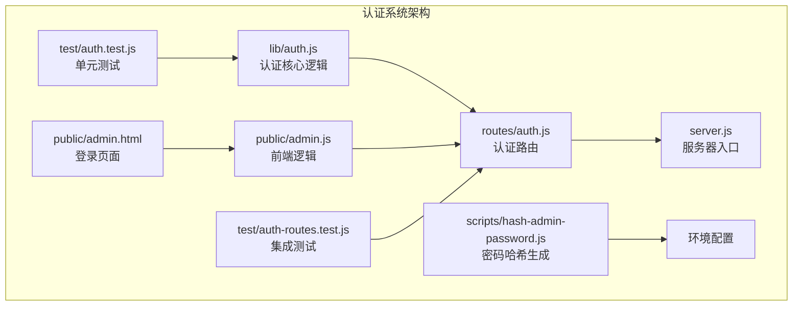
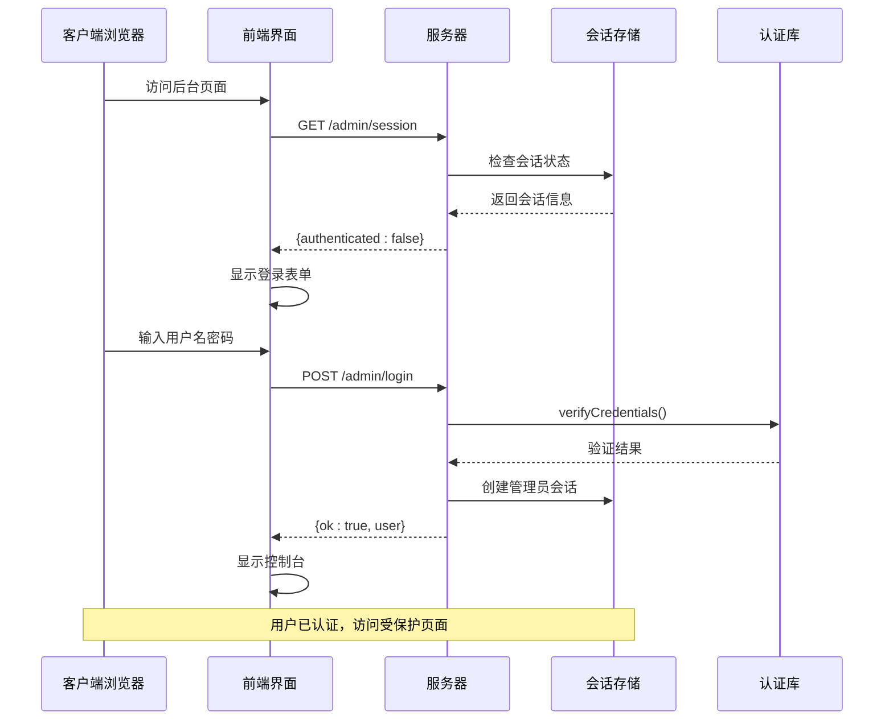
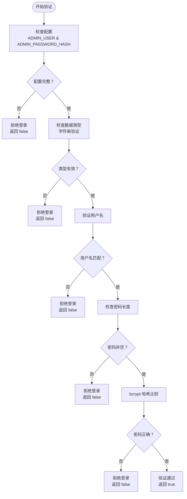
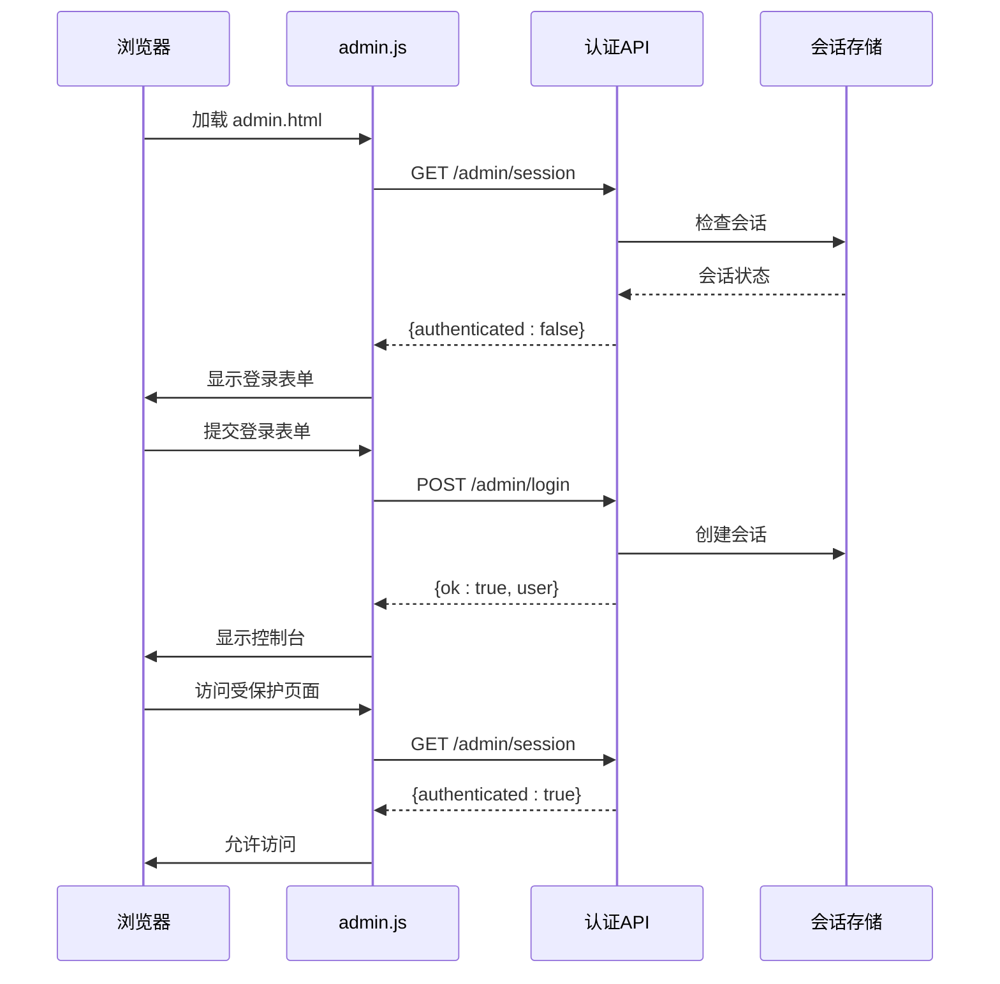
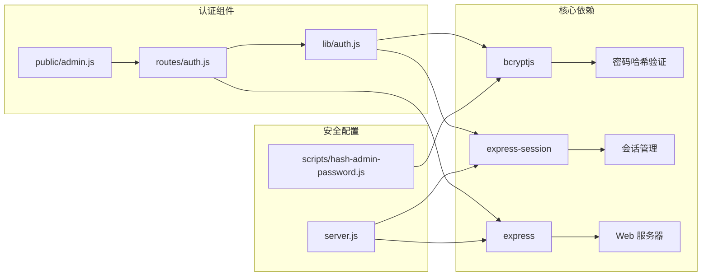

# 管理员认证系统

<cite>
**本文档引用的文件**
- [lib/auth.js](file://lib/auth.js)
- [routes/auth.js](file://routes/auth.js)
- [public/admin.html](file://public/admin.html)
- [public/admin.js](file://public/admin.js)
- [server.js](file://server.js)
- [scripts/hash-admin-password.js](file://scripts/hash-admin-password.js)
- [test/auth.test.js](file://test/auth.test.js)
- [test/auth-routes.test.js](file://test/auth-routes.test.js)
- [package.json](file://package.json)
- [README.md](file://README.md)
</cite>

## 目录
1. [简介](#简介)
2. [项目结构](#项目结构)
3. [核心组件](#核心组件)
4. [架构概览](#架构概览)
5. [详细组件分析](#详细组件分析)
6. [依赖关系分析](#依赖关系分析)
7. [性能考虑](#性能考虑)
8. [故障排除指南](#故障排除指南)
9. [结论](#结论)

## 简介

管理员认证系统是 Copilot Enterprise Usage Display 项目的核心安全组件，负责保护后台管理页面和敏感功能。该系统采用基于会话的认证机制，结合 bcrypt 密码哈希验证和 Express.js 中间件实现完整的访问控制。

系统的主要功能包括：
- 管理员凭据验证（用户名和密码）
- 基于会话的用户状态管理
- HTML 页面和 API 接口的双重访问控制
- 安全的会话固定攻击防护
- 前端登录态的实时检测

## 项目结构

管理员认证系统主要分布在以下几个核心文件中：

**图表来源**
- [lib/auth.js:1-63](file://lib/auth.js#L1-L63)
- [routes/auth.js:1-62](file://routes/auth.js#L1-L62)
- [server.js:1-234](file://server.js#L1-L234)

**章节来源**
- [lib/auth.js:1-63](file://lib/auth.js#L1-L63)
- [routes/auth.js:1-62](file://routes/auth.js#L1-L62)
- [server.js:1-234](file://server.js#L1-L234)

## 核心组件

### 认证核心模块 (lib/auth.js)

认证核心模块提供了三个关键功能：

1. **凭据验证函数** (`verifyCredentials`)
   - 验证用户名和密码的正确性
   - 使用 bcrypt 进行密码哈希比较
   - 防止空配置绕过攻击

2. **页面访问守卫** (`requireAdminPage`)
   - 保护 HTML 页面路由
   - 未授权用户重定向到登录页面
   - 支持 `next` 参数实现登录后跳转

3. **API 访问守卫** (`requireAdminApi`)
   - 保护 JSON API 路由
   - 返回 401 状态码而非重定向

**章节来源**
- [lib/auth.js:13-62](file://lib/auth.js#L13-L62)

### 认证路由模块 (routes/auth.js)

认证路由模块实现了三个 REST API 端点：

1. **POST /admin/login**
   - 接收用户名和密码
   - 验证凭据并创建会话
   - 实施会话固定攻击防护

2. **POST /admin/logout**
   - 销毁当前会话
   - 清除连接 cookie

3. **GET /admin/session**
   - 返回当前会话状态
   - 供前端检测登录态

**章节来源**
- [routes/auth.js:14-61](file://routes/auth.js#L14-L61)

### 前端认证界面 (public/admin.html & public/admin.js)

前端系统提供了完整的登录体验：

1. **登录页面** (`admin.html`)
   - 响应式设计的登录表单
   - 实时错误反馈
   - 用户友好的界面

2. **前端逻辑** (`admin.js`)
   - 自动检测登录状态
   - 处理登录和登出操作
   - 支持 `next` 参数跳转

**章节来源**
- [public/admin.html:1-206](file://public/admin.html#L1-L206)
- [public/admin.js:1-139](file://public/admin.js#L1-L139)

## 架构概览

管理员认证系统采用分层架构设计，确保安全性和可维护性：

**图表来源**
- [routes/auth.js:17-41](file://routes/auth.js#L17-L41)
- [lib/auth.js:21-37](file://lib/auth.js#L21-L37)
- [public/admin.js:53-106](file://public/admin.js#L53-L106)

## 详细组件分析

### 凭据验证算法

凭据验证过程采用多层安全检查：

**图表来源**
- [lib/auth.js:21-37](file://lib/auth.js#L21-L37)

**章节来源**
- [lib/auth.js:21-37](file://lib/auth.js#L21-L37)

### 会话固定攻击防护

系统实施了多重防护措施防止会话固定攻击：

1. **特权提升时的会话再生**
   - 登录成功后调用 `req.session.regenerate()`
   - 生成全新的会话 ID
   - 防止攻击者利用已知会话 ID

2. **会话安全配置**
   - `httpOnly: true` 防止 XSS 读取
   - `sameSite: 'lax'` 防止 CSRF 攻击
   - 生产环境 `secure: true` 仅 HTTPS 传输

3. **会话生命周期管理**
   - 8 小时滑动过期
   - 闲置自动退出
   - 明确的会话销毁机制

**章节来源**
- [routes/auth.js:25-41](file://routes/auth.js#L25-L41)
- [server.js:30-42](file://server.js#L30-L42)

### 访问控制中间件

系统提供了两种访问控制模式：

1. **HTML 页面守卫** (`requireAdminPage`)
   - 未授权用户重定向到 `/admin?next=原URL`
   - 支持登录后自动跳转
   - 保护静态资源和动态路由

2. **API 接口守卫** (`requireAdminApi`)
   - 返回 401 状态码而非重定向
   - 适用于 AJAX 请求和移动端应用
   - 保持 API 的无状态特性

**章节来源**
- [lib/auth.js:39-56](file://lib/auth.js#L39-L56)

### 前端认证流程

前端认证系统提供了无缝的用户体验：

**图表来源**
- [public/admin.js:124-138](file://public/admin.js#L124-L138)
- [public/admin.js:67-106](file://public/admin.js#L67-L106)

**章节来源**
- [public/admin.js:1-139](file://public/admin.js#L1-L139)

## 依赖关系分析

管理员认证系统的关键依赖关系如下：

**图表来源**
- [package.json:12-22](file://package.json#L12-L22)
- [lib/auth.js:11](file://lib/auth.js#L11)
- [routes/auth.js:11](file://routes/auth.js#L11)

**章节来源**
- [package.json:12-22](file://package.json#L12-L22)
- [lib/auth.js:11](file://lib/auth.js#L11)
- [routes/auth.js:11](file://routes/auth.js#L11)

## 性能考虑

管理员认证系统在设计时充分考虑了性能和可扩展性：

### 缓存策略
- **会话存储**：使用内存中的会话存储，支持高并发访问
- **密码验证**：bcrypt 哈希验证在服务器端进行，避免客户端计算负担
- **会话状态**：前端通过 `/admin/session` 端点快速检测认证状态

### 安全性能平衡
- **哈希成本**：使用适当的 bcrypt 成本因子（12）在安全性与性能间取得平衡
- **会话再生**：仅在特权提升时进行，避免频繁的会话重建
- **Cookie 配置**：合理设置 Cookie 属性，平衡安全性和性能

### 可扩展性设计
- **模块化架构**：认证逻辑独立于业务逻辑，便于维护和测试
- **中间件模式**：支持灵活的访问控制策略
- **配置驱动**：通过环境变量控制认证行为，便于部署配置

## 故障排除指南

### 常见问题诊断

1. **登录失败问题**
   - 检查 `ADMIN_USER` 和 `ADMIN_PASSWORD_HASH` 环境变量配置
   - 验证密码哈希是否正确生成
   - 确认会话存储配置正确

2. **会话丢失问题**
   - 检查 `SESSION_SECRET` 环境变量设置
   - 验证会话存储的可用性和配置
   - 确认 Cookie 配置符合浏览器要求

3. **页面重定向问题**
   - 检查 `next` 参数的 URL 编码
   - 验证受保护页面的路由配置
   - 确认中间件的挂载顺序

### 调试技巧

1. **启用详细日志**
   - 设置 `LOG_LEVEL=debug` 获取认证相关的详细信息
   - 监控会话创建和销毁事件
   - 跟踪认证失败的原因

2. **单元测试运行**
   - 运行 `npm test` 验证认证逻辑
   - 检查 `test/auth.test.js` 和 `test/auth-routes.test.js`
   - 验证各种边界条件和错误情况

**章节来源**
- [test/auth.test.js:1-22](file://test/auth.test.js#L1-L22)
- [test/auth-routes.test.js:1-146](file://test/auth-routes.test.js#L1-L146)

## 结论

管理员认证系统通过精心设计的安全架构和清晰的模块划分，为 Copilot Enterprise Usage Display 提供了可靠的访问控制机制。系统的主要优势包括：

### 安全特性
- 多层凭据验证和安全检查
- 会话固定攻击防护
- 完善的 Cookie 安全配置
- 防止空配置绕过攻击

### 架构优势
- 模块化设计便于维护和测试
- 灵活的访问控制策略
- 前后端协同的用户体验
- 可扩展的配置机制

### 最佳实践
- 使用 bcrypt 进行密码哈希存储
- 实施会话固定攻击防护
- 采用中间件模式实现访问控制
- 提供完善的错误处理和日志记录

该认证系统为整个仪表盘提供了坚实的安全基础，确保只有授权用户才能访问敏感的管理功能，同时保持了良好的用户体验和系统性能。