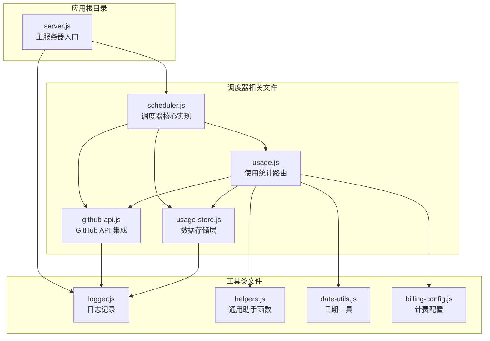
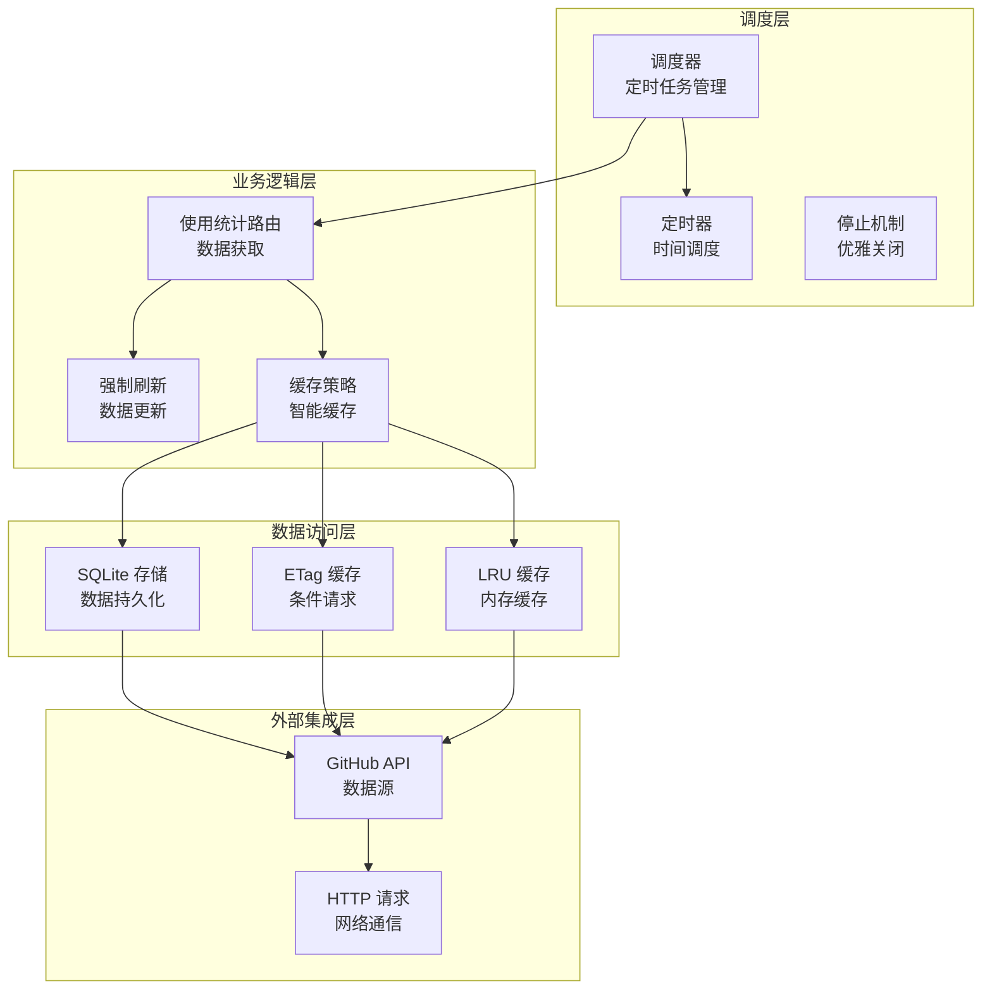
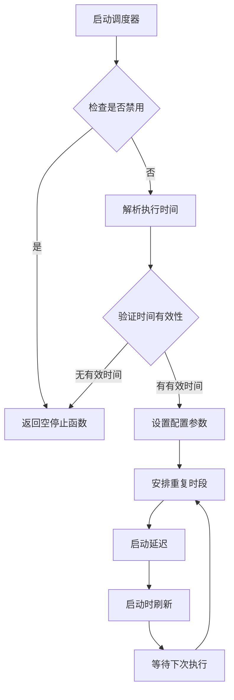
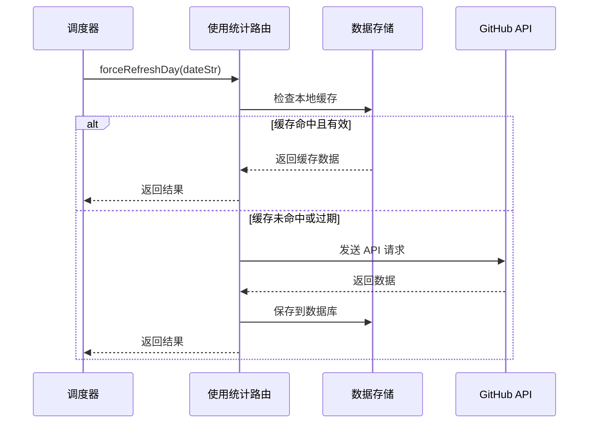
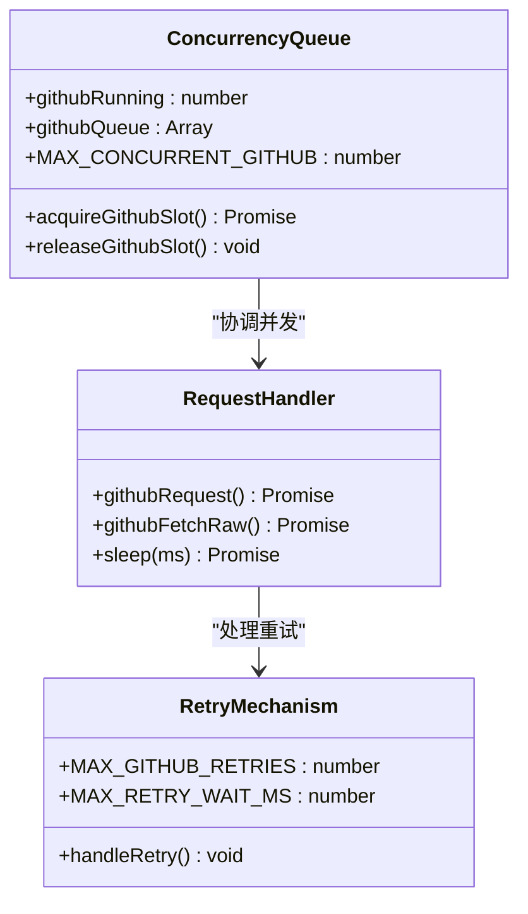
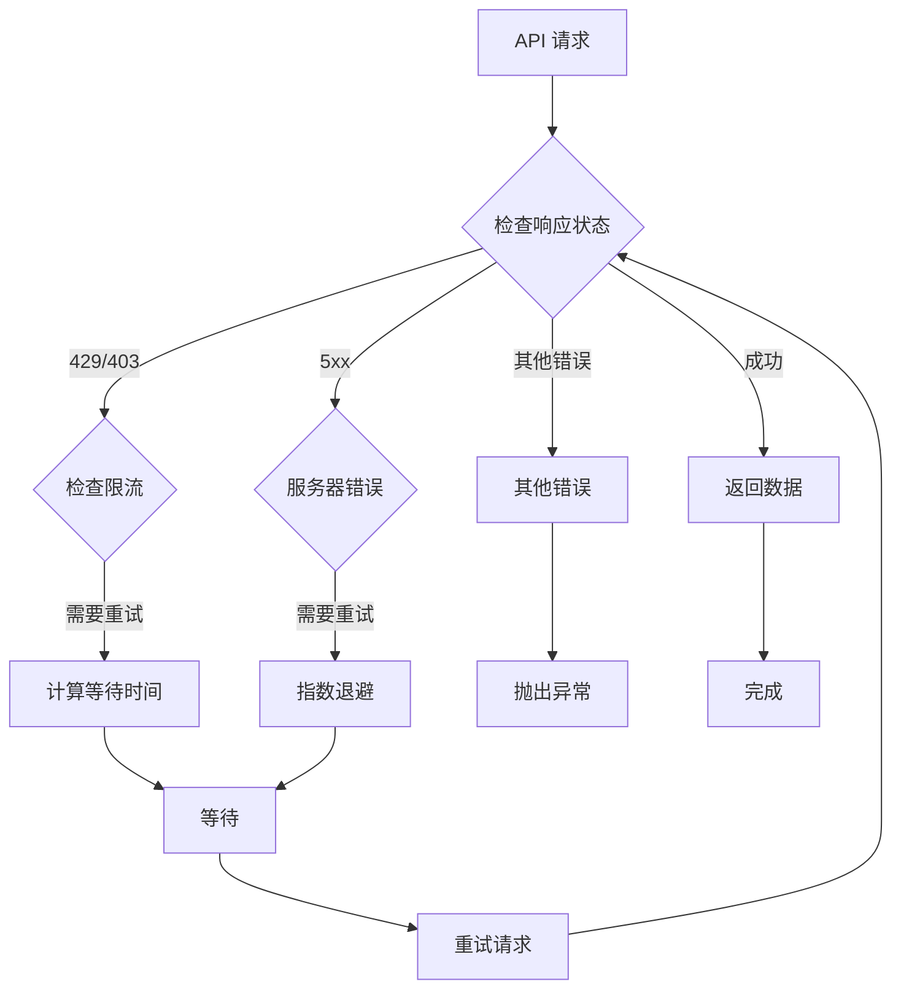
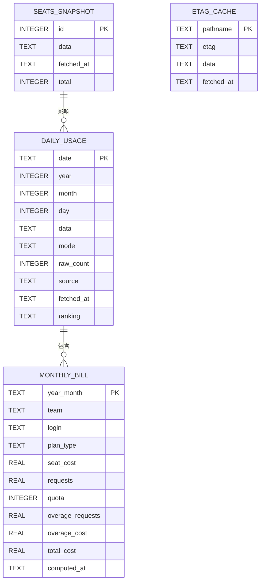
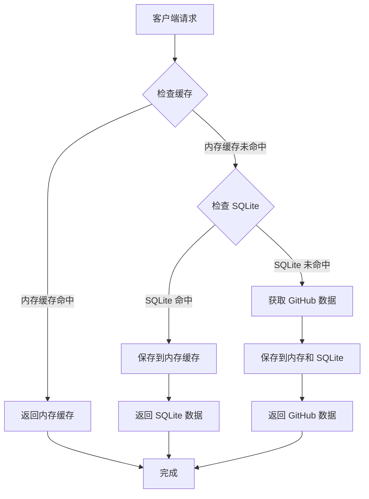
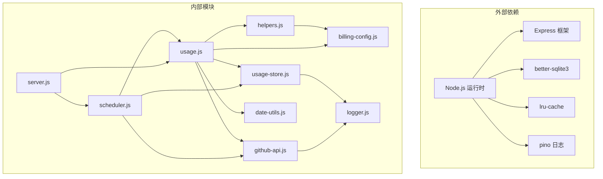

# 调度器模块

<cite>
**本文档引用的文件**
- [scheduler.js](file://lib/scheduler.js)
- [github-api.js](file://lib/github-api.js)
- [usage-store.js](file://lib/usage-store.js)
- [usage.js](file://routes/usage.js)
- [server.js](file://server.js)
- [logger.js](file://lib/logger.js)
- [helpers.js](file://lib/helpers.js)
- [date-utils.js](file://lib/date-utils.js)
- [billing-config.js](file://lib/billing-config.js)
</cite>

## 目录
1. [简介](#简介)
2. [项目结构](#项目结构)
3. [核心组件](#核心组件)
4. [架构概览](#架构概览)
5. [详细组件分析](#详细组件分析)
6. [依赖关系分析](#依赖关系分析)
7. [性能考虑](#性能考虑)
8. [故障排除指南](#故障排除指南)
9. [结论](#结论)

## 简介

调度器模块是 Copilot Enterprise Usage Display 应用程序的核心组件之一，负责自动化地从 GitHub API 获取和更新使用统计数据。该模块实现了轻量级的定时任务系统，能够在指定的时间点自动刷新最近的数据，确保仪表板显示最新、最准确的使用统计信息。

调度器的主要特点包括：
- 基于环境变量的灵活配置
- 多实例安全的调度机制
- 智能缓存策略和数据回填
- 完善的错误处理和重试机制
- 并发控制和资源管理

## 项目结构

调度器模块在项目中的位置和组织方式如下：

**图表来源**
- [server.js:146-148](file://server.js#L146-L148)
- [scheduler.js:1-21](file://lib/scheduler.js#L1-L21)

**章节来源**
- [server.js:146-148](file://server.js#L146-L148)
- [scheduler.js:1-21](file://lib/scheduler.js#L1-L21)

## 核心组件

调度器模块由以下核心组件构成：

### 1. 调度器核心 (Scheduler Core)
- **功能**：管理定时任务的创建、执行和停止
- **特性**：支持多实例安全、可配置的执行时间、智能回填策略
- **接口**：`startScheduler({ forceRefreshDay })` 返回控制对象

### 2. GitHub API 集成 (GitHub API Integration)
- **功能**：提供并发控制、重试机制、缓存管理
- **特性**：基于 ETag 的条件请求、LRU 缓存、单次飞行去重
- **接口**：`githubGetJson()`, `githubRequest()` 等

### 3. 数据存储层 (Data Storage Layer)
- **功能**：持久化使用统计数据、ETag 缓存、月度账单
- **特性**：SQLite 数据库、WAL 模式、索引优化
- **接口**：`saveDay()`, `getDay()`, `saveEtag()` 等

### 4. 使用统计路由 (Usage Statistics Routes)
- **功能**：处理使用统计的获取和刷新请求
- **特性**：智能缓存、数据聚合、错误处理
- **接口**：`forceRefreshDay()`, `refreshForDateOverride()`

**章节来源**
- [scheduler.js:54-157](file://lib/scheduler.js#L54-L157)
- [github-api.js:108-227](file://lib/github-api.js#L108-L227)
- [usage-store.js:10-321](file://lib/usage-store.js#L10-L321)
- [usage.js:273-348](file://routes/usage.js#L273-L348)

## 架构概览

调度器模块采用分层架构设计，各组件职责明确，耦合度低：

**图表来源**
- [scheduler.js:114-132](file://lib/scheduler.js#L114-L132)
- [usage.js:279-348](file://routes/usage.js#L279-L348)
- [github-api.js:108-168](file://lib/github-api.js#L108-L168)

## 详细组件分析

### 调度器核心组件

调度器核心实现了轻量级的定时任务管理系统，具有以下关键特性：

#### 1. 配置解析和验证

调度器通过环境变量进行配置，支持多种配置选项：

| 配置项 | 默认值 | 描述 |
|--------|--------|------|
| SCHED_DISABLED | false | 是否禁用调度器 |
| SCHED_DAILY_TIMES | "03:00,12:00" | 重复执行时间列表 |
| SCHED_BACKFILL_DAYS | 2 | 回填天数 |
| SCHED_STARTUP_DELAY_MS | 5000 | 启动延迟毫秒数 |

#### 2. 时间计算和调度

**图表来源**
- [scheduler.js:59-71](file://lib/scheduler.js#L59-L71)
- [scheduler.js:114-132](file://lib/scheduler.js#L114-L132)

#### 3. 数据刷新策略

调度器采用智能的数据刷新策略，确保数据的时效性和完整性：

**图表来源**
- [scheduler.js:84-99](file://lib/scheduler.js#L84-L99)
- [usage.js:279-348](file://routes/usage.js#L279-L348)

**章节来源**
- [scheduler.js:23-46](file://lib/scheduler.js#L23-L46)
- [scheduler.js:76-99](file://lib/scheduler.js#L76-L99)
- [scheduler.js:101-112](file://lib/scheduler.js#L101-L112)

### GitHub API 集成组件

GitHub API 集成组件提供了完整的 API 访问基础设施，包括并发控制、重试机制和缓存管理：

#### 1. 并发控制机制

**图表来源**
- [github-api.js:25-48](file://lib/github-api.js#L25-L48)
- [github-api.js:172-227](file://lib/github-api.js#L172-L227)

#### 2. 缓存策略

GitHub API 集成实现了多层次的缓存策略：

| 缓存类型 | 实现方式 | TTL | 用途 |
|----------|----------|-----|------|
| LRU 缓存 | lru-cache | 可配置 | 内存中快速访问 |
| ETag 缓存 | 内存映射 | 与 SQLite 同步 | 条件请求 |
| SQLite 缓存 | 数据库存储 | 90天 | 持久化数据 |

#### 3. 错误处理和重试

**图表来源**
- [github-api.js:190-227](file://lib/github-api.js#L190-L227)

**章节来源**
- [github-api.js:25-48](file://lib/github-api.js#L25-L48)
- [github-api.js:58-98](file://lib/github-api.js#L58-L98)
- [github-api.js:172-227](file://lib/github-api.js#L172-L227)

### 数据存储组件

数据存储组件基于 SQLite 实现，提供了高效的数据持久化能力：

#### 1. 数据库模式设计

**图表来源**
- [usage-store.js:24-71](file://lib/usage-store.js#L24-L71)

#### 2. 性能优化策略

| 优化措施 | 实现方式 | 效果 |
|----------|----------|------|
| WAL 模式 | `journal_mode = WAL` | 提高并发读取性能 |
| 索引优化 | 多个索引 | 加速查询速度 |
| 预编译语句 | Prepared statements | 减少解析开销 |
| 数据清理 | 定期清理旧数据 | 控制数据库大小 |

**章节来源**
- [usage-store.js:16-19](file://lib/usage-store.js#L16-L19)
- [usage-store.js:83-129](file://lib/usage-store.js#L83-L129)
- [usage-store.js:195-207](file://lib/usage-store.js#L195-L207)

### 使用统计路由组件

使用统计路由组件处理所有与使用统计相关的请求，实现了智能缓存和数据聚合：

#### 1. 缓存层次结构

**图表来源**
- [usage.js:237-251](file://routes/usage.js#L237-L251)
- [usage.js:279-348](file://routes/usage.js#L279-L348)

#### 2. 数据聚合算法

使用统计路由实现了复杂的聚合算法，能够处理不同类型的使用数据：

| 聚合类型 | 处理逻辑 | 输出格式 |
|----------|----------|----------|
| 用户级别 | 按用户汇总请求数量和金额 | 排名列表 |
| 月度周期 | 从 SQLite 日数据聚合 | 月度总览 |
| 单日统计 | 直接从 GitHub API 获取 | 详细数据 |
| 范围查询 | 批量处理多个日期 | 组合结果 |

**章节来源**
- [usage.js:28-53](file://routes/usage.js#L28-L53)
- [usage.js:134-235](file://routes/usage.js#L134-L235)
- [usage.js:237-348](file://routes/usage.js#L237-L348)

## 依赖关系分析

调度器模块的依赖关系呈现清晰的分层结构：

**图表来源**
- [server.js:1-15](file://server.js#L1-L15)
- [scheduler.js:21](file://lib/scheduler.js#L21)
- [github-api.js:8](file://lib/github-api.js#L8)

**章节来源**
- [server.js:1-15](file://server.js#L1-L15)
- [scheduler.js:21](file://lib/scheduler.js#L21)
- [github-api.js:8](file://lib/github-api.js#L8)

## 性能考虑

调度器模块在设计时充分考虑了性能优化，采用了多种策略来提升系统的整体性能：

### 1. 缓存策略优化

- **多级缓存**：内存缓存、SQLite 缓存、ETag 缓存形成完整的缓存层次
- **智能 TTL**：根据数据新鲜度动态调整缓存时间
- **预热机制**：启动时立即刷新当天数据，确保首次访问的时效性

### 2. 并发控制

- **令牌桶算法**：通过并发槽位限制同时进行的 API 请求数量
- **队列管理**：当达到并发上限时，请求进入队列等待
- **优雅降级**：在高负载情况下自动调整并发度

### 3. 数据库优化

- **WAL 模式**：提高并发读取性能，避免写入阻塞
- **索引优化**：为常用查询字段建立索引
- **批量操作**：使用事务批量处理数据插入和更新

### 4. 网络优化

- **条件请求**：利用 ETag 实现 304 Not Modified 响应
- **单次飞行去重**：防止同一请求的重复并发执行
- **智能重试**：基于指数退避的重试策略

## 故障排除指南

### 常见问题及解决方案

#### 1. 调度器不工作

**症状**：调度器启动后没有执行任何任务

**可能原因**：
- `SCHED_DISABLED=true` 环境变量设置
- `SCHED_DAILY_TIMES` 格式不正确
- 应用程序无法连接到 GitHub API

**解决步骤**：
1. 检查环境变量配置
2. 验证时间格式（HH:MM）
3. 查看日志输出确认启动状态

#### 2. GitHub API 限流

**症状**：频繁出现 429 或 403 错误

**可能原因**：
- API 速率限制触发
- 并发请求过多
- 缺少适当的重试机制

**解决步骤**：
1. 检查 `GITHUB_MAX_CONCURRENT` 设置
2. 增加重试次数 (`GITHUB_MAX_RETRIES`)
3. 实施更长的等待时间

#### 3. 数据不一致

**症状**：仪表板显示的数据与预期不符

**可能原因**：
- 缓存过期时间设置不当
- SQLite 数据库损坏
- ETag 缓存不同步

**解决步骤**：
1. 清理缓存数据
2. 检查数据库完整性
3. 重新初始化 ETag 缓存

#### 4. 内存泄漏

**症状**：应用程序内存使用持续增长

**可能原因**：
- 定时器未正确清理
- 缓存数据未及时清理
- 事件监听器未移除

**解决步骤**：
1. 确保调用 `scheduler.stop()`
2. 检查缓存清理机制
3. 监控内存使用情况

**章节来源**
- [scheduler.js:149-157](file://lib/scheduler.js#L149-L157)
- [github-api.js:190-227](file://lib/github-api.js#L190-L227)
- [usage-store.js:195-207](file://lib/usage-store.js#L195-L207)

## 结论

调度器模块是一个设计精良、功能完备的自动化数据刷新系统。它通过以下关键特性确保了系统的稳定性和可靠性：

### 核心优势

1. **灵活性**：通过环境变量实现完全可配置的调度行为
2. **健壮性**：完善的错误处理和重试机制
3. **性能**：多层次缓存和并发控制优化
4. **可维护性**：清晰的代码结构和详细的日志记录

### 技术亮点

- **智能调度**：基于 UTC 时间的精确调度机制
- **数据一致性**：通过 ETag 和 SQLite 缓存保证数据准确性
- **资源管理**：优雅的启动和关闭流程
- **监控能力**：全面的日志记录和状态跟踪

### 改进建议

1. **监控增强**：添加更详细的性能指标和健康检查
2. **配置管理**：实现运行时配置更新能力
3. **扩展性**：支持更复杂的时间调度规则
4. **测试覆盖**：增加单元测试和集成测试覆盖率

调度器模块为 Copilot Enterprise Usage Display 提供了可靠的数据基础，确保用户能够获得最新、最准确的使用统计信息。其设计原则和实现细节为构建类似的数据同步系统提供了优秀的参考模板。