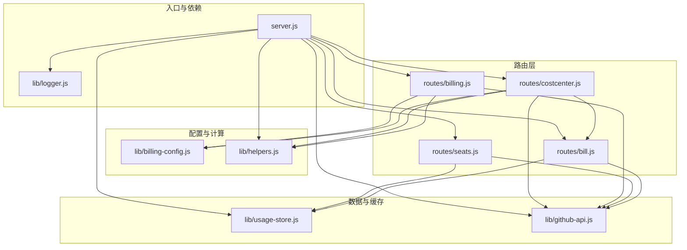
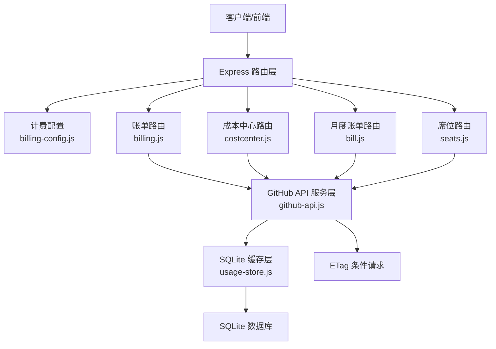
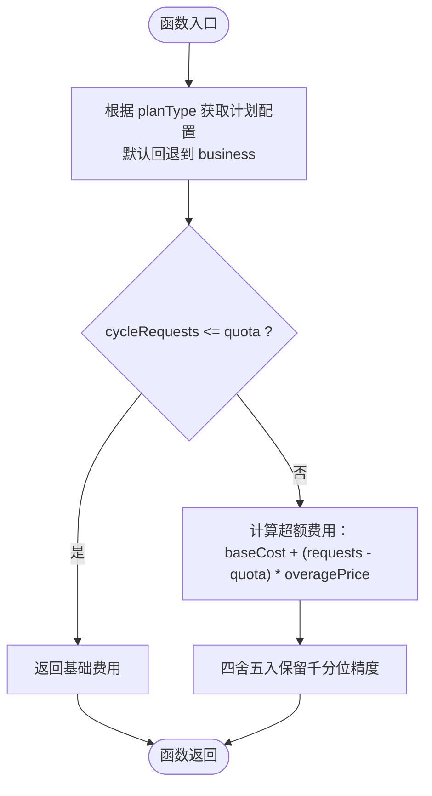
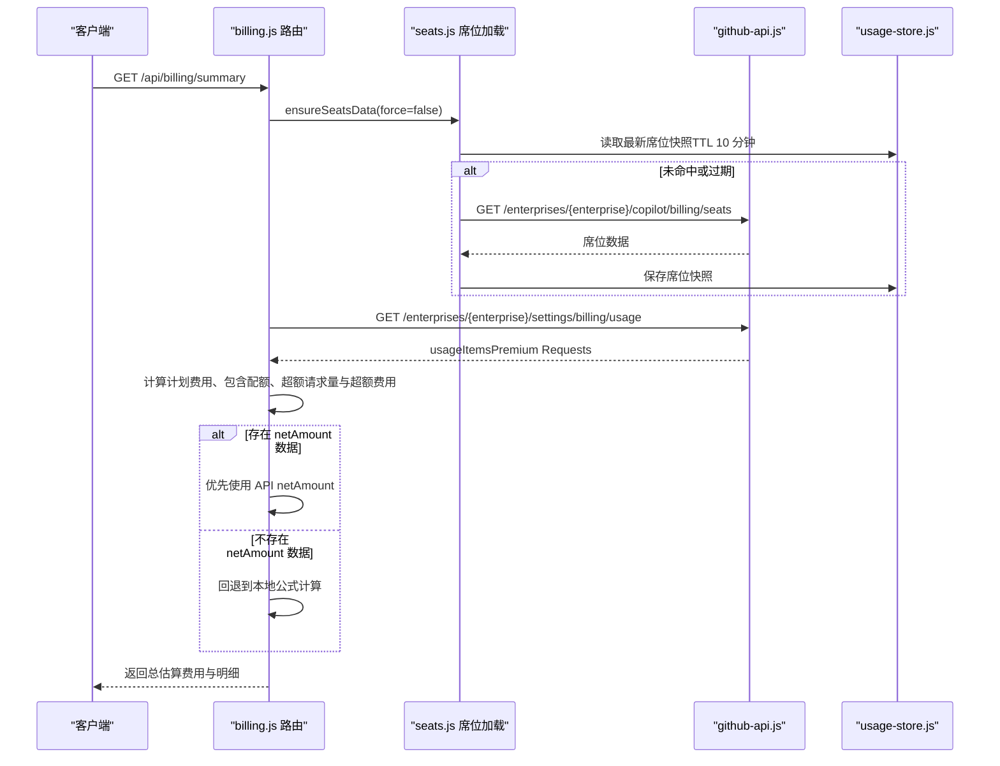
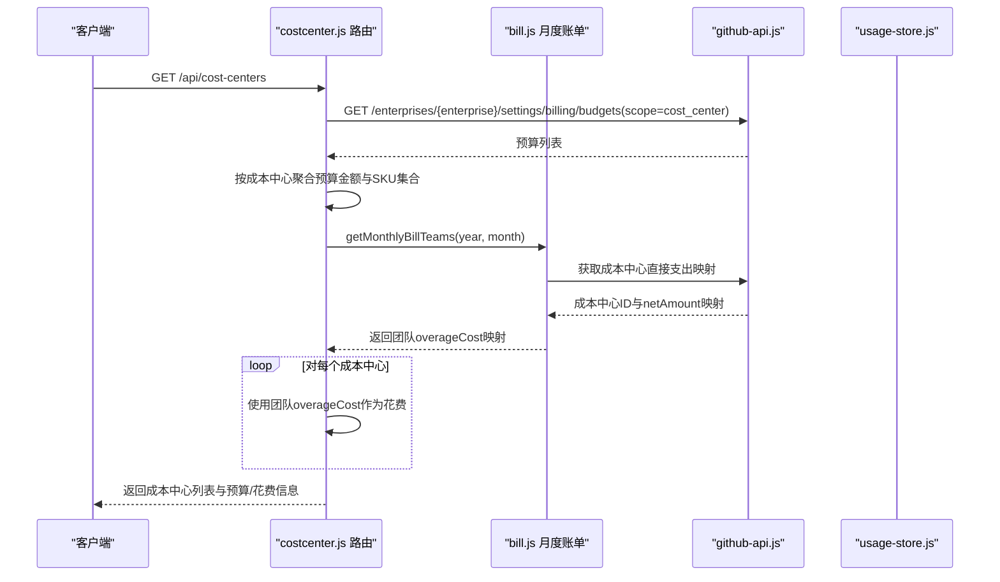
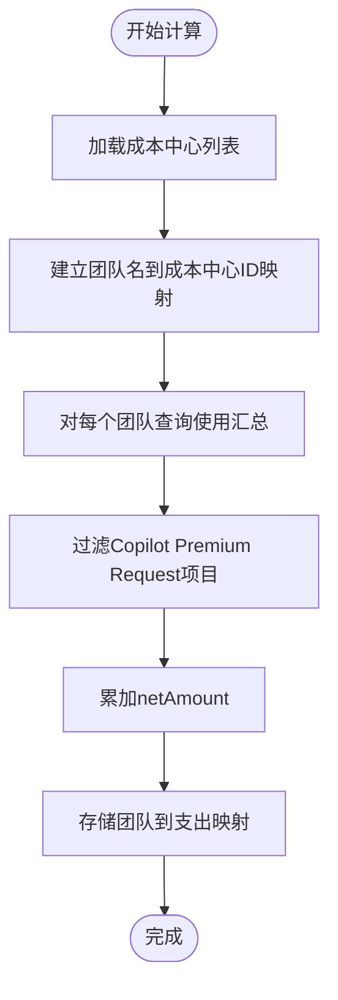
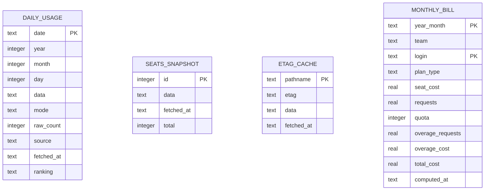
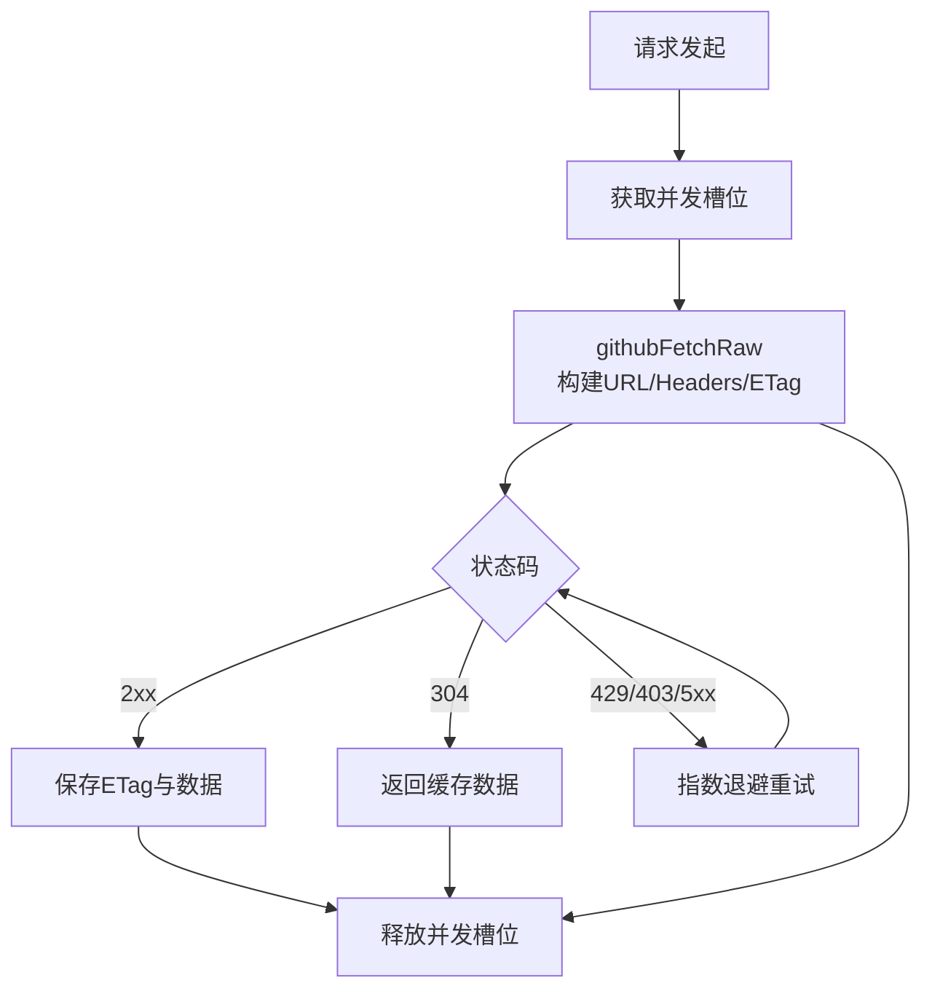
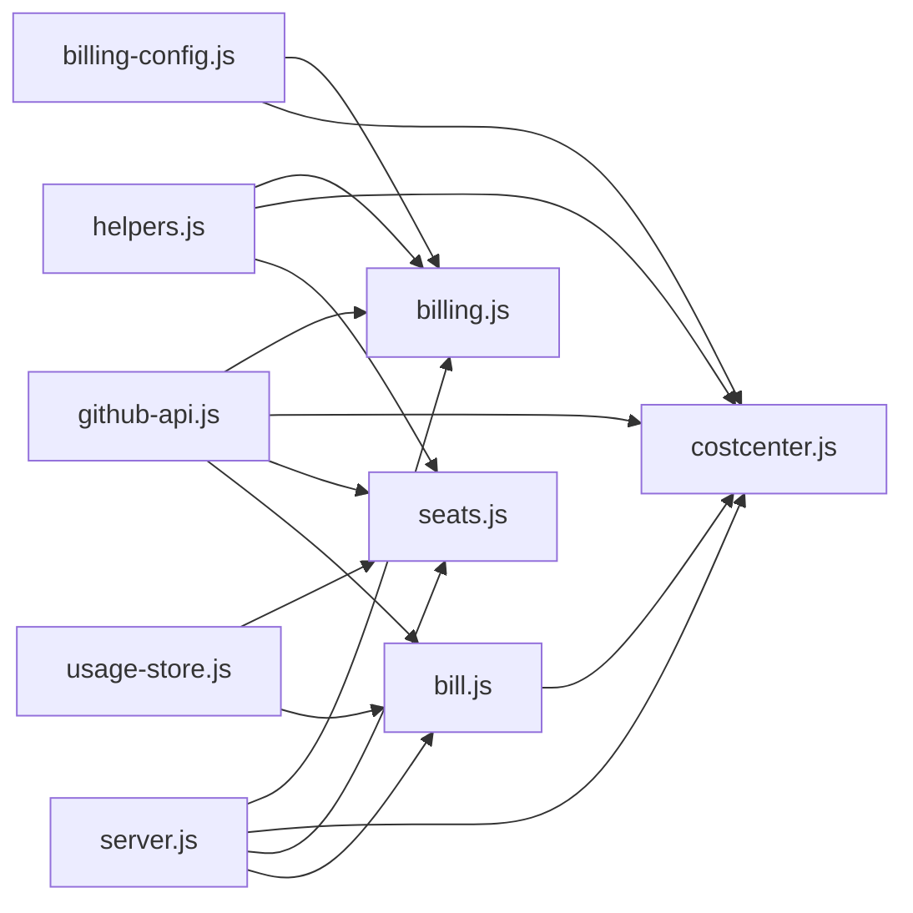

# 费用配置模块

<cite>
**本文引用的文件**
- [billing-config.js](file://lib/billing-config.js)
- [billing.js](file://routes/billing.js)
- [costcenter.js](file://routes/costcenter.js)
- [usage-store.js](file://lib/usage-store.js)
- [helpers.js](file://lib/helpers.js)
- [seats.js](file://routes/seats.js)
- [github-api.js](file://lib/github-api.js)
- [server.js](file://server.js)
- [logger.js](file://lib/logger.js)
- [README.md](file://README.md)
- [billing-config.test.js](file://test/billing-config.test.js)
- [bill.js](file://routes/bill.js)
</cite>

## 更新摘要
**变更内容**
- 更新成本中心支出计算逻辑：从本地公式计算改为直接使用 GitHub API 的 netAmount 数据
- 新增成本中心直接支出映射功能，提供更准确的计费信息
- 完善成本中心路由中的支出计算机制，确保与账单页面保持一致

## 目录
1. [简介](#简介)
2. [项目结构](#项目结构)
3. [核心组件](#核心组件)
4. [架构概览](#架构概览)
5. [详细组件分析](#详细组件分析)
6. [依赖关系分析](#依赖关系分析)
7. [性能考虑](#性能考虑)
8. [故障排查指南](#故障排查指南)
9. [结论](#结论)
10. [附录](#附录)

## 简介
本文件为费用配置模块的详细技术文档，聚焦于费用计算逻辑的设计与实现，涵盖以下主题：
- 不同计划类型的定价策略与费用计算算法
- 成本中心的费用分配机制与预算控制
- 预算超支提醒与报告生成
- 配置参数定义、验证规则与默认值处理
- 算法实现细节、精度处理与性能优化
- 使用示例：配置加载、费用计算、预算检查与报告生成
- 动态更新机制、缓存策略与错误处理

## 项目结构
费用配置模块位于 lib 与 routes 目录中，围绕计费配置、路由处理、数据存储与 API 交互展开。核心文件如下：
- 计费配置与计算：lib/billing-config.js
- 账单汇总与模型排行：routes/billing.js
- 成本中心与预算：routes/costcenter.js
- 月度账单计算：routes/bill.js
- 数据持久化与缓存：lib/usage-store.js
- 辅助函数与端点构建：lib/helpers.js
- 席位数据加载：routes/seats.js
- GitHub API 服务层：lib/github-api.js
- 服务器入口与依赖注入：server.js
- 日志与错误处理：lib/logger.js

**图表来源**
- [server.js:1-182](file://server.js#L1-L182)
- [billing-config.js:1-25](file://lib/billing-config.js#L1-L25)
- [billing.js:1-157](file://routes/billing.js#L1-L157)
- [costcenter.js:1-246](file://routes/costcenter.js#L1-L246)
- [bill.js:1-615](file://routes/bill.js#L1-L615)
- [usage-store.js:1-333](file://lib/usage-store.js#L1-L333)
- [helpers.js:1-83](file://lib/helpers.js#L1-L83)
- [seats.js:1-78](file://routes/seats.js#L1-L78)
- [github-api.js:1-320](file://lib/github-api.js#L1-L320)

**章节来源**
- [server.js:1-182](file://server.js#L1-L182)
- [README.md:46-96](file://README.md#L46-L96)

## 核心组件
- 计费配置与计算：提供计划配置、环境变量读取与费用计算函数，支持业务与企业两种计划类型。
- 账单路由：汇总席位订阅费与 Premium Requests 超额费用，计算总费用并返回结构化报表。
- 成本中心路由：查询成本中心预算、按成本中心汇总实际花费，并支持批量添加用户资源。
- 月度账单计算：提供可重用的账单计算功能，用于成本中心路由与账单页面对齐。
- 数据存储与缓存：SQLite 持久化、ETag 条件请求、LRU 缓存与 TTL 策略，保障数据新鲜度与性能。
- GitHub API 服务层：并发队列、重试退避、单飞行去重、条件请求与缓存镜像。
- 辅助函数：数值转换、端点构建、错误封装与查询参数组装。

**章节来源**
- [billing-config.js:1-25](file://lib/billing-config.js#L1-L25)
- [billing.js:1-157](file://routes/billing.js#L1-L157)
- [costcenter.js:1-246](file://routes/costcenter.js#L1-L246)
- [bill.js:1-615](file://routes/bill.js#L1-L615)
- [usage-store.js:1-333](file://lib/usage-store.js#L1-L333)
- [github-api.js:1-320](file://lib/github-api.js#L1-L320)
- [helpers.js:1-83](file://lib/helpers.js#L1-L83)

## 架构概览
费用配置模块的整体架构围绕"配置层 → 路由层 → 服务层 → 数据层"的分层设计展开，通过 GitHub API 服务层与 SQLite 缓存层实现高可用与高性能。

**图表来源**
- [billing.js:1-157](file://routes/billing.js#L1-L157)
- [costcenter.js:1-246](file://routes/costcenter.js#L1-L246)
- [bill.js:1-615](file://routes/bill.js#L1-L615)
- [seats.js:1-78](file://routes/seats.js#L1-L78)
- [github-api.js:1-320](file://lib/github-api.js#L1-L320)
- [usage-store.js:1-333](file://lib/usage-store.js#L1-L333)

## 详细组件分析

### 计费配置与费用计算
- 计划配置：包含业务与企业两种计划，每种计划定义配额、基础费用与超额单价。
- 环境变量：通过 requiredEnv 读取 INCLUDED_QUOTA，未设置时默认 300。
- 费用计算：当请求量不超过配额时返回基础费用；超过配额时按超额单价累加，并进行千分位四舍五入保留精度。

**图表来源**
- [billing-config.js:18-22](file://lib/billing-config.js#L18-L22)

**章节来源**
- [billing-config.js:1-25](file://lib/billing-config.js#L1-L25)
- [billing-config.test.js:1-70](file://test/billing-config.test.js#L1-L70)

### 账单路由（席位订阅费 + 超额费用）
- 数据来源：席位数据来自 GitHub API，Premium Requests 使用企业账单汇总数据。
- 计算流程：
  - 统计各计划类型的席位数量，计算总基础费用与总包含配额。
  - 从企业账单汇总中提取 Premium Requests 数量、单价与折扣信息。
  - 计算超额请求量与超额费用，并累加得到总估算费用。
- 精度处理：对金额与数量进行千分位四舍五入，确保前端展示一致性。
- **更新**：优先使用 API 权威的 netAmount 数据，若存在则直接采用，否则回退到本地公式计算。

**图表来源**
- [billing.js:35-112](file://routes/billing.js#L35-L112)
- [seats.js:37-75](file://routes/seats.js#L37-L75)
- [github-api.js:231-269](file://lib/github-api.js#L231-L269)
- [usage-store.js:211-240](file://lib/usage-store.js#L211-L240)

**章节来源**
- [billing.js:1-157](file://routes/billing.js#L1-L157)
- [seats.js:1-78](file://routes/seats.js#L1-L78)

### 成本中心路由（预算与花费）
- 预算聚合：遍历企业预算，按成本中心名称聚合预算金额与允许的 SKU 集合。
- **更新**：花费计算采用直接映射方式，从月度账单计算结果中获取每个团队的 overageCost，确保与账单页面保持一致。
- 用户批量同步：根据所选 Team 成员集合与现有资源集合，计算新增与可删除用户，支持预览与执行。

**图表来源**
- [costcenter.js:106-135](file://routes/costcenter.js#L106-L135)
- [bill.js:129-186](file://routes/bill.js#L129-L186)
- [github-api.js:291-301](file://lib/github-api.js#L291-L301)

**章节来源**
- [costcenter.js:1-246](file://routes/costcenter.js#L1-L246)

### 月度账单计算与成本中心直接支出映射
- **新增功能**：提供可重用的月度账单计算功能，用于成本中心路由与账单页面对齐。
- **成本中心直接支出映射**：通过 GitHub API 获取每个成本中心的 netAmount 数据，直接映射到团队级别。
- **数据来源**：从成本中心列表获取 ID，然后查询对应的成本中心使用汇总，过滤 Copilot Premium Request 项目并累加 netAmount。

**图表来源**
- [bill.js:129-186](file://routes/bill.js#L129-L186)

**章节来源**
- [bill.js:1-615](file://routes/bill.js#L1-L615)

### 数据存储与缓存策略
- SQLite 表结构：
  - daily_usage：每日用量与 per-user 排名
  - seats_snapshot：席位快照（最多保留最近 20 条）
  - etag_cache：ETag 条件请求缓存
  - monthly_bill：月度账单结果（按年月+登录名复合主键）
- TTL 策略：
  - 用量数据：近 3 天 1 小时，更老 90 天
  - 席位数据：10 分钟
  - ETag：按路径动态 TTL
- 预编译语句与事务：提升查询与写入性能，保证一致性。

**图表来源**
- [usage-store.js:24-79](file://lib/usage-store.js#L24-L79)
- [usage-store.js:121-129](file://lib/usage-store.js#L121-L129)

**章节来源**
- [usage-store.js:1-333](file://lib/usage-store.js#L1-L333)

### GitHub API 服务层与错误处理
- 并发控制：最大并发与重试次数可配置，指数退避与最大等待时间保护。
- 缓存与条件请求：LRU 缓存 + ETag + 单飞行去重，显著减少 API 调用。
- 错误封装：统一 ApiError，包含状态码与速率限制信息，路由层统一处理。

**图表来源**
- [github-api.js:108-168](file://lib/github-api.js#L108-L168)
- [github-api.js:172-227](file://lib/github-api.js#L172-L227)
- [github-api.js:231-269](file://lib/github-api.js#L231-L269)

**章节来源**
- [github-api.js:1-320](file://lib/github-api.js#L1-L320)
- [helpers.js:30-36](file://lib/helpers.js#L30-L36)

## 依赖关系分析
- billing-config.js 被 billing.js 与 costcenter.js 直接依赖，提供计划配置与费用计算。
- routes 层通过 helpers.js 构建查询参数与端点，统一环境变量读取。
- GitHub API 服务层被 routes 与 seats.js 调用，提供稳定的数据来源。
- usage-store.js 为 routes 与 seats.js 提供缓存与持久化能力。
- server.js 作为入口，负责依赖注入与路由挂载。
- **更新**：costcenter.js 现在依赖 bill.js 的 getMonthlyBillTeams 函数，实现成本中心支出计算的一致性。

**图表来源**
- [server.js:88-98](file://server.js#L88-L98)
- [billing.js:5-8](file://routes/billing.js#L5-L8)
- [costcenter.js:5-8](file://routes/costcenter.js#L5-L8)
- [seats.js:6-7](file://routes/seats.js#L6-L7)
- [bill.js:311-370](file://routes/bill.js#L311-L370)

**章节来源**
- [server.js:1-182](file://server.js#L1-L182)

## 性能考虑
- 缓存分层：内存 LRU 缓存（5 分钟）→ SQLite 持久缓存（动态 TTL）→ GitHub API，显著降低 API 调用。
- 预编译语句与事务：减少 SQL 解析开销，保证批量写入一致性。
- 并发与去重：GitHub API 并发队列与单飞行去重，避免重复请求与限流风险。
- 精度控制：千分位四舍五入统一金额精度，避免浮点误差累积。
- 自动刷新调度：按日回填与强制刷新兜底，缓解 GitHub Billing API 延迟带来的数据不完整问题。
- **更新**：成本中心支出计算采用直接映射方式，避免重复计算，提高性能。

## 故障排查指南
- 环境变量缺失：requiredEnv 会在未设置时返回空字符串，需检查 INCLUDED_QUOTA、ENTERPRISE_SLUG、GITHUB_TOKEN 等。
- GitHub API 限流：路由层捕获 ApiError 并返回友好错误，必要时通过重试与退避缓解。
- 数据不新鲜：确认 TTL 设置与自动刷新调度是否正常，必要时使用按月强制刷新接口。
- 日志级别：开发模式建议 debug，生产模式 info，通过日志追踪缓存命中、ETag 条件请求与错误信息。
- **更新**：成本中心支出计算失败时会记录警告日志，检查 GitHub API 权限与网络连接。

**章节来源**
- [billing-config.js:6-9](file://lib/billing-config.js#L6-L9)
- [github-api.js:14-21](file://lib/github-api.js#L14-L21)
- [helpers.js:30-36](file://lib/helpers.js#L30-L36)
- [logger.js:1-41](file://lib/logger.js#L1-L41)

## 结论
费用配置模块通过清晰的分层设计与完善的缓存策略，在保证数据新鲜度的同时显著降低了 API 调用频率。计划配置与费用计算逻辑简洁明确，成本中心预算与花费聚合提供了精细化的成本控制能力。配合严格的错误处理与日志体系，模块具备良好的可维护性与可观测性。**最新的成本中心支出计算改进**通过直接使用 GitHub API 的 netAmount 数据，提供了更准确的计费信息，确保了跨功能模块间的一致性。

## 附录

### 配置参数定义、验证规则与默认值
- INCLUDED_QUOTA：每用户每周期包含请求配额，默认 300。
- BILLING_YEAR/BILLING_MONTH：账单年月，未设置时取当前年月。
- GITHUB_TOKEN/GITHUB_API_BASE：GitHub API 访问凭据与基础地址。
- GITHUB_MAX_CONCURRENT/GITHUB_MAX_RETRIES：并发与重试配置。
- LOG_LEVEL：日志级别，开发默认 debug，生产默认 info。

**章节来源**
- [billing-config.js:11](file://lib/billing-config.js#L11)
- [helpers.js:58-80](file://lib/helpers.js#L58-L80)
- [README.md:196-217](file://README.md#L196-L217)

### 使用示例（方法调用路径）
- 配置加载：读取环境变量与计划配置
  - [billing-config.js:6-9](file://lib/billing-config.js#L6-L9)
  - [billing-config.js:11-16](file://lib/billing-config.js#L11-L16)
- 费用计算：按计划类型与请求量计算
  - [billing-config.js:18-22](file://lib/billing-config.js#L18-L22)
- 预算检查与报告生成：
  - 成本中心列表与预算/花费：[costcenter.js:106-135](file://routes/costcenter.js#L106-L135)
  - 按名称查询成本中心详情：[costcenter.js:137-165](file://routes/costcenter.js#L137-L165)
  - 按 Team 批量添加用户：[costcenter.js:167-242](file://routes/costcenter.js#L167-L242)
- 账单汇总与模型排行：
  - 账单汇总：[billing.js:35-112](file://routes/billing.js#L35-L112)
  - 模型排行：[billing.js:115-153](file://routes/billing.js#L115-L153)
- 席位数据加载：
  - 读取/缓存席位：[seats.js:37-75](file://routes/seats.js#L37-L75)
- **新增**：月度账单计算与成本中心直接支出映射：
  - 月度账单计算：[bill.js:311-370](file://routes/bill.js#L311-L370)
  - 成本中心直接支出映射：[bill.js:129-186](file://routes/bill.js#L129-L186)

**章节来源**
- [billing-config.js:1-25](file://lib/billing-config.js#L1-L25)
- [costcenter.js:1-246](file://routes/costcenter.js#L1-L246)
- [billing.js:1-157](file://routes/billing.js#L1-L157)
- [seats.js:1-78](file://routes/seats.js#L1-L78)
- [bill.js:1-615](file://routes/bill.js#L1-L615)

### 动态更新机制与缓存策略
- 动态 TTL：用量数据近 3 天 1 小时，更老 90 天，避免 GitHub Billing API 延迟导致的缓存锁死。
- 强制刷新：按月强制刷新接口与自动调度器，确保数据新鲜度。
- ETag 条件请求：未变化时返回 304，不消耗配额。
- 单飞行去重：同一参数的并发请求复用同一 Promise。
- **更新**：成本中心支出计算采用直接映射方式，通过 getMonthlyBillTeams 函数获取权威的 overageCost 数据。

**章节来源**
- [usage-store.js:6-8](file://lib/usage-store.js#L6-L8)
- [github-api.js:88-98](file://lib/github-api.js#L88-L98)
- [github-api.js:231-269](file://lib/github-api.js#L231-L269)
- [bill.js:311-370](file://routes/bill.js#L311-L370)