# 辅助工具模块

<cite>
**本文档引用的文件**
- [helpers.js](file://lib/helpers.js)
- [helpers.test.js](file://test/helpers.test.js)
- [date-utils.js](file://lib/date-utils.js)
- [billing-config.js](file://lib/billing-config.js)
- [logger.js](file://lib/logger.js)
- [github-api.js](file://lib/github-api.js)
- [usage-store.js](file://lib/usage-store.js)
- [scheduler.js](file://lib/scheduler.js)
- [user-mapping.js](file://lib/user-mapping.js)
- [analytics.js](file://routes/analytics.js)
- [bill.js](file://routes/bill.js)
- [seats.js](file://routes/seats.js)
- [package.json](file://package.json)
</cite>

## 目录
1. [简介](#简介)
2. [项目结构](#项目结构)
3. [核心组件](#核心组件)
4. [架构总览](#架构总览)
5. [详细组件分析](#详细组件分析)
6. [依赖关系分析](#依赖关系分析)
7. [性能考量](#性能考量)
8. [故障排查指南](#故障排查指南)
9. [结论](#结论)
10. [附录](#附录)

## 简介
本文件聚焦于"辅助工具模块"，系统性梳理并解释项目中的通用工具函数与基础设施，包括：
- 数据验证与类型转换（数值解析）
- 字符串与用户标识提取（用户名提取）
- 错误处理与统一响应（HTTP 错误封装）
- 查询参数构建与端点选择（企业/组织维度）
- 日期工具（日期解析、天数枚举、日期键生成）
- 配置与计费（计划配置、费用计算）
- 日志记录（结构化日志、敏感信息脱敏）
- 调度器（定时刷新任务）
- 用户映射服务（GitHub 用户名到 AD 映射，**新增批量 O(1) 查找功能**）
- GitHub API 封装（并发控制、缓存、重试、ETag 条件请求）
- **新增配额使用分类功能（QUOTA_USAGE_BUCKET_NAMES、getQuotaUsageBucketName、classifyQuotaUsage）**

目标是帮助读者快速理解各工具函数的设计原则、参数与返回值、错误处理策略、性能优化与实际使用场景，并掌握它们之间的依赖关系与组合使用方式。

## 项目结构
辅助工具模块主要分布在以下文件中：
- lib/helpers.js：共享的通用工具函数
- lib/date-utils.js：日期处理工具
- lib/billing-config.js：计费配置与费用计算
- lib/logger.js：日志记录器
- lib/github-api.js：GitHub API 抽象层（并发、缓存、重试、ETag）
- lib/usage-store.js：SQLite 持久化存储（每日用量、席位快照、ETag 缓存、月账单）
- lib/scheduler.js：轻量级调度器
- lib/user-mapping.js：用户映射服务（**新增 buildLookup 批量查找功能**）
- routes/analytics.js：分析数据加载（复用辅助工具，**新增配额使用分类统计**）
- routes/bill.js：账单数据加载（复用辅助工具）
- routes/seats.js：席位数据加载（复用辅助工具）

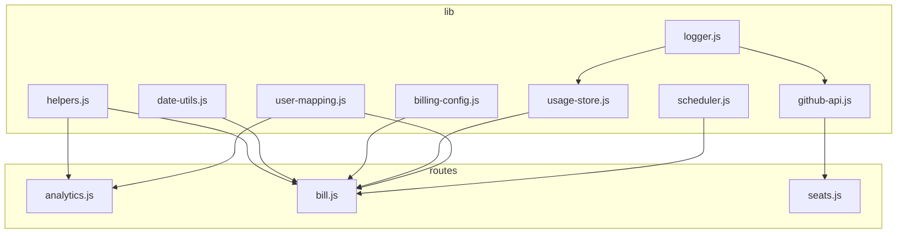

**图表来源**
- [helpers.js:1-185](file://lib/helpers.js#L1-L185)
- [date-utils.js:1-46](file://lib/date-utils.js#L1-L46)
- [billing-config.js:1-25](file://lib/billing-config.js#L1-L25)
- [logger.js:1-41](file://lib/logger.js#L1-L41)
- [github-api.js:1-320](file://lib/github-api.js#L1-L320)
- [usage-store.js:1-324](file://lib/usage-store.js#L1-L324)
- [scheduler.js:1-160](file://lib/scheduler.js#L1-L160)
- [user-mapping.js:1-158](file://lib/user-mapping.js#L1-L158)
- [analytics.js:1-297](file://routes/analytics.js#L1-L297)
- [bill.js:1-407](file://routes/bill.js#L1-L407)
- [seats.js:1-78](file://routes/seats.js#L1-L78)

## 核心组件
本节对关键辅助函数进行深入分析，涵盖功能、参数、返回值、设计原则、性能与错误处理策略，并给出使用示例与最佳实践。

### 数值解析工具：toNumber
- 功能：将输入安全地转换为有限数字；非数字或非法输入返回默认值 0。
- 参数：
  - value：任意类型（数字、字符串、null、undefined、NaN、Infinity）
- 返回值：number（有限数值，否则 0）
- 设计原则：
  - 容错性强，避免抛出异常
  - 对字符串进行 trim 后解析，提升健壮性
- 性能：O(1)，常量时间
- 错误处理：非法输入直接返回 0，不抛异常
- 使用示例：在统计请求量与金额时，优先取 netQuantity/grossQuantity/quantity/requests，若为空则回退到其他字段
- 最佳实践：与 pickUser 组合使用，确保聚合计算稳定

**章节来源**
- [helpers.js:5-12](file://lib/helpers.js#L5-L12)
- [helpers.test.js:4-29](file://test/helpers.test.js#L4-L29)

### 用户名提取工具：pickUser
- 功能：从复杂对象中提取可用的用户名，支持多字段与嵌套对象
- 参数：
  - item：包含用户信息的对象（可含 user、username、userName、login、actor、actorLogin、actor_login、user_login 或嵌套对象）
- 返回值：string（去空格后的用户名，若均不可用返回 "(unknown)"）
- 设计原则：
  - 多字段优先级明确，先尝试 user 再 login 等
  - 支持嵌套对象（如 user.login、user.name）
- 性能：线性扫描候选字段，O(k)，k 为候选数量（固定小常数）
- 错误处理：空字符串与空对象被跳过，最终失败返回 "(unknown)"
- 使用示例：在 top-users 统计中，从 usageItem 中提取用户标识
- 最佳实践：与 toNumber 结合，先提取用户再累加请求量

**章节来源**
- [helpers.js:14-28](file://lib/helpers.js#L14-L28)
- [helpers.test.js:31-65](file://test/helpers.test.js#L31-L65)

### 错误处理与统一响应：writeError
- 功能：根据传入错误类型构造统一的 JSON 错误响应
- 参数：
  - res：Express 响应对象
  - error：Error 实例或 ApiError
- 返回值：通过 res 发送 JSON 响应（ok=false，message，可能包含 rateLimit）
- 设计原则：
  - 区分 ApiError 与普通错误，设置不同状态码
  - 透传 rateLimit 信息用于前端提示
- 性能：O(1)
- 错误处理：捕获所有异常路径，保证接口稳定性
- 使用示例：在 analytics 与 bill 路由中统一错误处理
- 最佳实践：在所有异步处理流程末尾调用，避免裸抛异常

**章节来源**
- [helpers.js:30-36](file://lib/helpers.js#L30-L36)
- [analytics.js:41](file://routes/analytics.js#L41)
- [bill.js:311](file://routes/bill.js#L311)

### 查询参数构建：buildQueryParams
- 功能：基于环境变量与额外参数构建 GitHub API 查询参数
- 参数：
  - extra：可选对象，支持 year、month、day、product、model、user、cost_center_id
- 返回值：URLSearchParams 实例
- 设计原则：
  - 优先使用 extra，其次使用环境变量，最后回退到当前时间
- 性能：O(1)，常量时间
- 错误处理：缺失字段返回空字符串，不影响整体流程
- 使用示例：在按月查询 Copilot 使用时，动态拼接查询参数
- 最佳实践：与 buildEndpoint 组合使用，确保端点与参数一致

**章节来源**
- [helpers.js:38-58](file://lib/helpers.js#L38-L58)

### 端点选择：buildEndpoint
- 功能：根据环境变量选择企业或组织维度的端点
- 返回值：包含 path、scope、kind、enterprise/org 的对象；若均未设置则抛错
- 设计原则：
  - 企业优先于组织
  - 提供 scope 便于权限与审计
- 性能：O(1)
- 错误处理：缺少必要环境变量时抛出错误，阻止后续流程
- 使用示例：在查询使用与席位数据时确定 API 路径
- 最佳实践：在应用启动阶段校验环境变量，避免运行期报错

**章节来源**
- [helpers.js:60-82](file://lib/helpers.js#L60-L82)

### 配额使用分类工具：QUOTA_USAGE_BUCKET_NAMES、getQuotaUsageBucketName、classifyQuotaUsage
- 功能：
  - QUOTA_USAGE_BUCKET_NAMES：定义配额使用分类的桶名称数组
  - getQuotaUsageBucketName：根据使用百分比获取对应的分类桶名称
  - classifyQuotaUsage：将用户按配额使用百分比进行分类统计
- 参数与返回值：
  - getQuotaUsageBucketName：usagePercent → 分类桶名称字符串
  - classifyQuotaUsage：users（包含 user 和 usagePercent）→ 按桶分组的对象
- 设计原则：
  - 使用中文命名，符合中文用户习惯
  - 分类区间采用左闭右开区间，确保边界值正确处理
  - 支持完整的用户数据分类统计
- 性能：getQuotaUsageBucketName O(1)，classifyQuotaUsage O(n)
- 错误处理：使用 toNumber 进行安全转换，避免非法输入
- 使用示例：在用户使用量分析中，按配额使用情况对用户进行分组统计
- 最佳实践：与 analytics 路由结合，提供直观的配额使用分布视图

**更新** 新增配额使用分类功能，提供用户使用量分析的分类统计能力

**章节来源**
- [helpers.js:148-183](file://lib/helpers.js#L148-L183)
- [helpers.test.js:76-105](file://test/helpers.test.js#L76-L105)
- [analytics.js:169-175](file://routes/analytics.js#L169-L175)

### 日期工具：parseDateStr、enumerateDays、buildDateKey
- 功能：
  - parseDateStr：将 "YYYY-MM-DD" 解析为 { year, month, day } 或 null
  - enumerateDays：枚举起止日期之间的每一天
  - buildDateKey：生成 "YYYY-MM-DD" 或 "YYYY-MM" 键
- 参数与返回值：
  - parseDateStr：输入字符串 → { year, month, day } | null
  - enumerateDays：startStr、endStr → [{ year, month, day }]
  - buildDateKey：year、month、day → "YYYY-MM-DD"/"YYYY-MM"
- 设计原则：
  - 使用 UTC 时间处理，避免时区偏差
  - 输入校验严格，非法输入返回空结果
- 性能：enumerateDays 为 O(n)，n 为天数；其余 O(1)
- 错误处理：非法日期返回空数组或 null
- 使用示例：在账单周期计算与日粒度数据枚举中使用
- 最佳实践：与 UsageStore 的日期索引配合，提高查询效率

**章节来源**
- [date-utils.js:8-43](file://lib/date-utils.js#L8-L43)

### 计费配置与费用计算：PLAN_CONFIG、calcAmount、requiredEnv
- 功能：
  - requiredEnv：读取并清理环境变量
  - PLAN_CONFIG：定义业务与企业计划的配额与价格
  - calcAmount：计算周期内费用（含封顶与舍入）
- 参数与返回值：
  - calcAmount：cycleRequests、planType → number（元）
- 设计原则：
  - 配额与单价可配置，支持扩展新计划
  - 舍入保留精度，避免浮点误差
- 性能：O(1)
- 错误处理：未知计划类型回退到 business
- 使用示例：在账单计算中按用户与计划类型计算座上成本与超支费用
- 最佳实践：在部署时通过环境变量调整配额与单价

**章节来源**
- [billing-config.js:6-24](file://lib/billing-config.js#L6-L24)

### 日志记录：logger
- 功能：结构化日志输出，支持级别、脱敏与序列化
- 特性：
  - 层级化日志级别（trace/debug/info/warn/error）
  - 自动脱敏敏感字段（authorization、token、password、secret 等）
  - 开发模式美化输出
- 设计原则：
  - 生产环境默认 info，开发环境默认 debug
  - 序列化请求/响应，便于审计
- 性能：pino 优化的结构化日志，开销低
- 错误处理：日志异常不影响主流程
- 使用示例：在 GitHub API、调度器、账单计算等关键路径记录事件
- 最佳实践：在错误处理与关键路径埋点，避免过度日志

**章节来源**
- [logger.js:13-38](file://lib/logger.js#L13-L38)

### GitHub API 封装：github-api
- 功能：并发队列、重试/退避、LRU 缓存、ETag 条件请求、单飞去重
- 关键能力：
  - 并发控制：MAX_CONCURRENT_GITHUB
  - 重试策略：指数退避，尊重 retry-after 与速率限制重置时间
  - 缓存：LRU + ETag + 单飞去重
  - 错误模型：ApiError，携带状态码与速率限制信息
- 设计原则：
  - 优雅降级：304 时返回缓存数据
  - 可观测性：记录重试、缓存命中、速率限制
- 性能：缓存命中显著降低 API 调用；并发队列避免过载
- 错误处理：区分速率限制、5xx 与业务错误，统一包装为 ApiError
- 使用示例：在账单与席位数据拉取中使用
- 最佳实践：合理设置并发与重试次数，结合 ETag 减少重复请求

**章节来源**
- [github-api.js:14-227](file://lib/github-api.js#L14-L227)

### SQLite 存储：UsageStore
- 功能：持久化每日用量、席位快照、ETag 缓存、月账单
- 关键表与索引：
  - daily_usage：按日期主键
  - seats_snapshot：席位快照，限制最大条目数
  - etag_cache：ETag 缓存
  - monthly_bill：月账单，按年月复合主键
- 设计原则：
  - TTL 控制数据新鲜度
  - 预编译语句减少解析开销
  - 事务批量写入月账单
- 性能：WAL 模式 + 索引，查询高效
- 错误处理：异常记录日志，不影响主流程
- 使用示例：在账单计算后保存结果，供前端查询
- 最佳实践：定期清理旧数据，保持数据库健康

**章节来源**
- [usage-store.js:24-129](file://lib/usage-store.js#L24-L129)

### 调度器：startScheduler
- 功能：在指定本地时间点触发最近 N 天的数据刷新
- 配置：
  - SCHED_DISABLED、SCHED_DAILY_TIMES、SCHED_BACKFILL_DAYS、SCHED_STARTUP_DELAY_MS
- 设计原则：
  - 多实例安全：可通过环境变量禁用
  - 延迟启动避免冷启动竞争
- 性能：定时器管理，避免阻塞主线程
- 错误处理：异常记录日志，继续下一次调度
- 使用示例：在启动后延迟刷新今日数据，随后按配置时间点刷新最近 N 天
- 最佳实践：根据 GitHub 数据更新节奏调整 backfill 天数

**章节来源**
- [scheduler.js:54-157](file://lib/scheduler.js#L54-L157)

### 用户映射服务：UserMappingService
- 功能：GitHub 用户名到 AD 的映射，支持热加载与去抖
- 特性：
  - 文件监控（fs.watch），变更后去抖重载
  - 校验与清洗：去除空值，仅保留有效映射
  - **新增批量查找功能**：buildLookup() 实现 O(1) 查找性能
- 设计原则：
  - 单例模式，全局共享
  - 快速查询：Map 结构
  - **批量优化**：一次性构建查找表，避免多次单次查询
- 性能：O(1) 查找，去抖避免频繁 IO；**批量查找 O(n) 构建 + O(1) 每项查找**
- 错误处理：文件不存在或格式错误时记录警告并回退
- 使用示例：在统计与账单中显示 AD 名称
- 最佳实践：确保数据文件存在且格式正确

**更新** 新增 buildLookup() 函数，实现批量 O(1) 查找，显著提升大规模用户映射性能

**章节来源**
- [user-mapping.js:7-155](file://lib/user-mapping.js#L7-L155)

## 架构总览
辅助工具模块贯穿数据采集、缓存、计算与展示的全链路，形成如下协作关系：
- helpers.js 提供通用工具（数值解析、用户名提取、错误封装、查询参数与端点构建、**配额使用分类**）
- date-utils.js 与 billing-config.js 为账单计算提供基础
- logger.js 为所有模块提供统一日志
- github-api.js 为外部 API 访问提供抽象（并发、缓存、重试）
- usage-store.js 为本地持久化提供支撑
- scheduler.js 为定时刷新提供调度
- user-mapping.js 为用户映射提供服务（**支持批量查找优化**）
- routes/analytics.js 与 routes/bill.js 在业务层组合上述工具（**analytics 路由新增配额使用分类统计**）

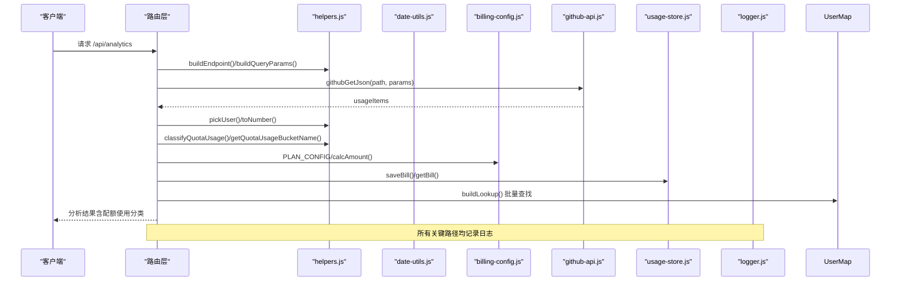

**图表来源**
- [analytics.js:169-175](file://routes/analytics.js#L169-L175)
- [helpers.js:38-82](file://lib/helpers.js#L38-L82)
- [helpers.js:148-183](file://lib/helpers.js#L148-L183)
- [date-utils.js:19-33](file://lib/date-utils.js#L19-L33)
- [billing-config.js:18-22](file://lib/billing-config.js#L18-L22)
- [github-api.js:231-269](file://lib/github-api.js#L231-L269)
- [usage-store.js:282-320](file://lib/usage-store.js#L282-L320)
- [logger.js:13-38](file://lib/logger.js#L13-L38)

## 详细组件分析

### 组件一：数值解析与用户提取（toNumber 与 pickUser）
- 设计模式：纯函数 + 容错策略
- 数据结构：输入为任意类型，输出为标准化数值或字符串
- 复杂度：toNumber O(1)，pickUser O(k)
- 错误处理：空值与非法输入统一归零/unknown
- 组合使用：在 analytics 与 bill 路由中，先提取用户，再累加请求量与金额

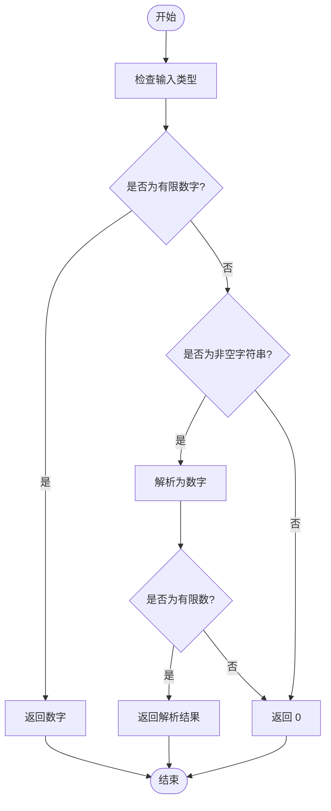

**图表来源**
- [helpers.js:5-12](file://lib/helpers.js#L5-L12)

**章节来源**
- [helpers.js:5-28](file://lib/helpers.js#L5-L28)
- [helpers.test.js:4-65](file://test/helpers.test.js#L4-L65)

### 组件二：错误处理与统一响应（writeError）
- 设计模式：统一错误响应格式
- 数据结构：JSON 响应体 { ok, message, rateLimit? }
- 复杂度：O(1)
- 错误处理：区分 ApiError 与普通错误，透传速率限制信息
- 组合使用：在所有路由的 try/catch 中调用

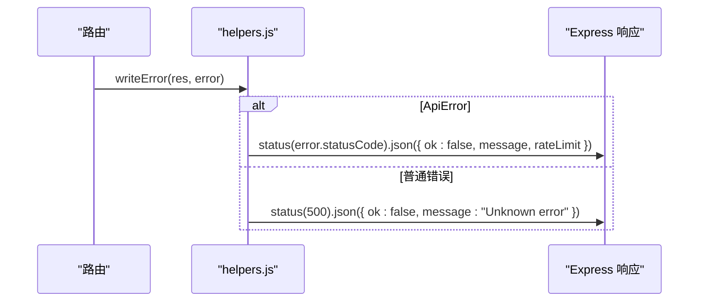

**图表来源**
- [helpers.js:30-36](file://lib/helpers.js#L30-L36)

**章节来源**
- [helpers.js:30-36](file://lib/helpers.js#L30-L36)
- [analytics.js:41](file://routes/analytics.js#L41)
- [bill.js:311](file://routes/bill.js#L311)

### 组件三：查询参数与端点构建（buildQueryParams 与 buildEndpoint）
- 设计模式：配置驱动 + 环境变量优先
- 数据结构：URLSearchParams 与 { path, scope, kind, enterprise/org }
- 复杂度：O(1)
- 错误处理：缺少必要环境变量时抛错，阻止后续流程
- 组合使用：在账单与席位数据拉取中，先构建端点，再拼接查询参数

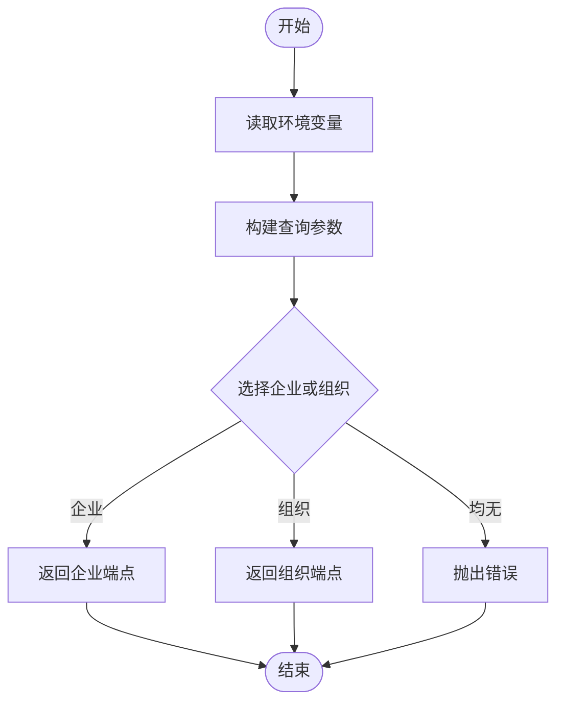

**图表来源**
- [helpers.js:38-82](file://lib/helpers.js#L38-L82)

**章节来源**
- [helpers.js:38-82](file://lib/helpers.js#L38-L82)

### 组件四：配额使用分类工具（QUOTA_USAGE_BUCKET_NAMES、getQuotaUsageBucketName、classifyQuotaUsage）
- 设计模式：分类统计 + 安全数值转换
- 数据结构：中文分类桶名称数组与按桶分组的对象
- 复杂度：getQuotaUsageBucketName O(1)，classifyQuotaUsage O(n)
- 错误处理：使用 toNumber 进行安全转换，确保边界值正确处理
- 组合使用：在 analytics 路由中，对用户使用量进行分类统计，提供直观的配额使用分布视图

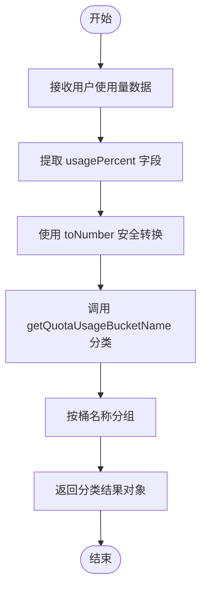

**图表来源**
- [helpers.js:148-183](file://lib/helpers.js#L148-L183)

**章节来源**
- [helpers.js:148-183](file://lib/helpers.js#L148-L183)
- [helpers.test.js:76-105](file://test/helpers.test.js#L76-L105)
- [analytics.js:169-175](file://routes/analytics.js#L169-L175)

### 组件五：日期工具（parseDateStr、enumerateDays、buildDateKey）
- 设计模式：UTC 时间处理 + 严格输入校验
- 数据结构：{ year, month, day } 与日期字符串
- 复杂度：enumerateDays O(n)
- 错误处理：非法输入返回空结果
- 组合使用：在账单周期计算与日粒度数据枚举中使用

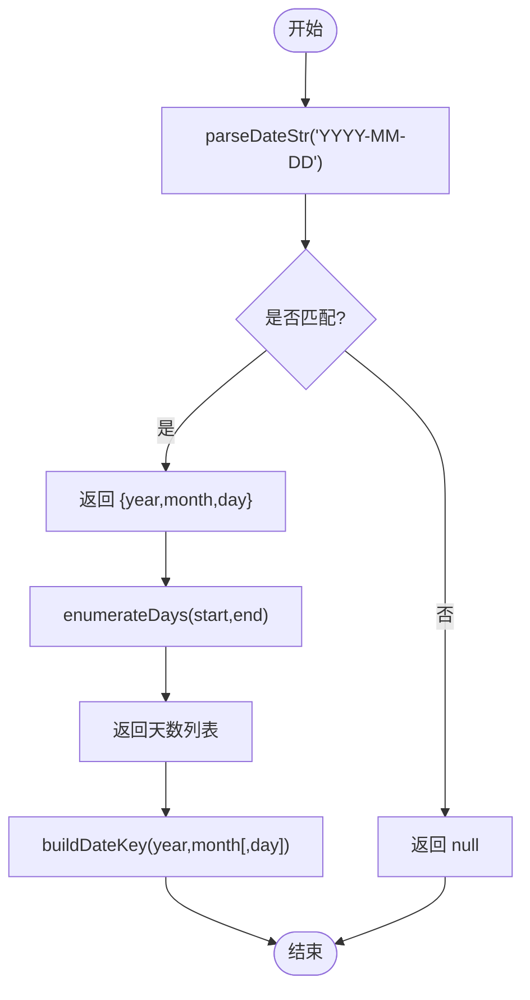

**图表来源**
- [date-utils.js:8-43](file://lib/date-utils.js#L8-L43)

**章节来源**
- [date-utils.js:8-43](file://lib/date-utils.js#L8-L43)

### 组件六：计费配置与费用计算（PLAN_CONFIG、calcAmount、requiredEnv）
- 设计模式：配置驱动 + 精度控制
- 数据结构：PLAN_CONFIG 与 calcAmount 输出（元）
- 复杂度：O(1)
- 错误处理：未知计划类型回退到 business
- 组合使用：在账单计算中按用户与计划类型计算座上成本与超支费用

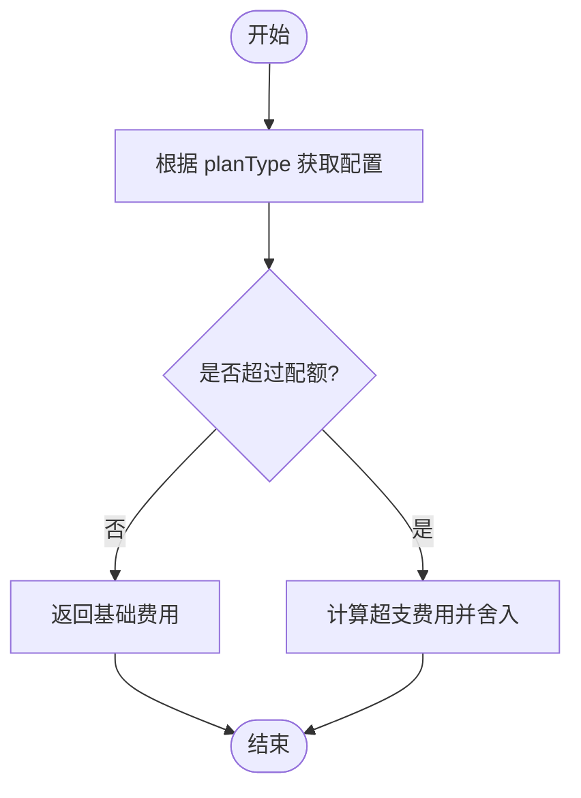

**图表来源**
- [billing-config.js:18-22](file://lib/billing-config.js#L18-L22)

**章节来源**
- [billing-config.js:6-24](file://lib/billing-config.js#L6-L24)

### 组件七：GitHub API 封装（并发、缓存、重试、ETag）
- 设计模式：并发队列 + LRU 缓存 + ETag 条件请求 + 单飞去重
- 数据结构：ApiError、LRUCache、Map(etagCache)
- 复杂度：缓存命中 O(1)，网络请求受限于 GitHub 速率限制
- 错误处理：区分速率限制、5xx 与业务错误，统一包装为 ApiError
- 组合使用：在账单与席位数据拉取中使用

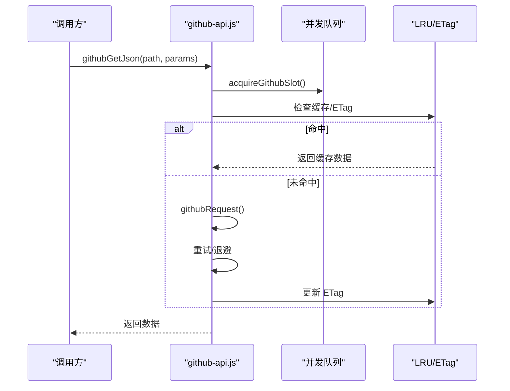

**图表来源**
- [github-api.js:231-269](file://lib/github-api.js#L231-L269)
- [github-api.js:172-227](file://lib/github-api.js#L172-L227)

**章节来源**
- [github-api.js:14-319](file://lib/github-api.js#L14-L319)

### 组件八：SQLite 存储（UsageStore）
- 设计模式：预编译语句 + 事务 + TTL 策略
- 数据结构：表结构与索引，事务批量写入
- 复杂度：查询 O(log n)（带索引），批量写入 O(m)
- 错误处理：异常记录日志，不影响主流程
- 组合使用：在账单计算后保存结果，供前端查询

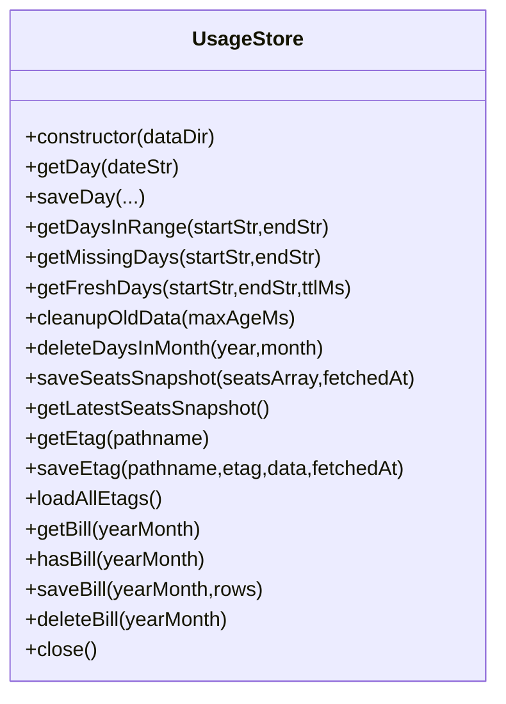

**图表来源**
- [usage-store.js:10-321](file://lib/usage-store.js#L10-L321)

**章节来源**
- [usage-store.js:24-321](file://lib/usage-store.js#L24-L321)

### 组件九：调度器（startScheduler）
- 设计模式：定时器 + 去抖 + 多实例安全
- 数据结构：定时器集合、下次触发时间
- 复杂度：O(1) 触发，批量刷新 O(N)
- 错误处理：异常记录日志，继续下一次调度
- 组合使用：在启动后延迟刷新今日数据，随后按配置时间点刷新最近 N 天

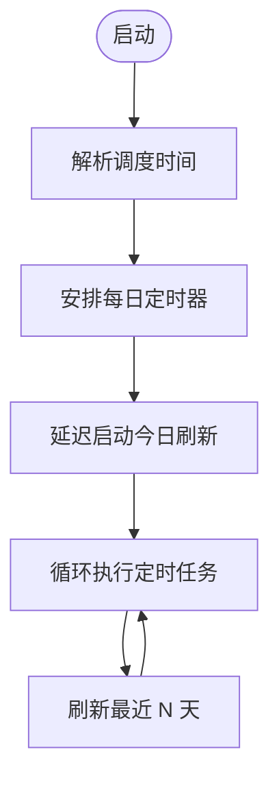

**图表来源**
- [scheduler.js:54-157](file://lib/scheduler.js#L54-L157)

**章节来源**
- [scheduler.js:23-157](file://lib/scheduler.js#L23-L157)

### 组件十：用户映射服务（UserMappingService）
- 设计模式：单例 + 文件监控 + 去抖 + **批量查找优化**
- 数据结构：Map(githubName->AD 映射) + **批量查找表**
- 复杂度：查找 O(1)，加载 O(n)，**批量查找 O(n) 构建 + O(1) 每项查找**
- 错误处理：文件不存在或格式错误时记录警告并回退
- 组合使用：在统计与账单中显示 AD 名称
- **新增功能**：buildLookup() 函数实现批量 O(1) 查找，替代多个 getUserByGithub 调用

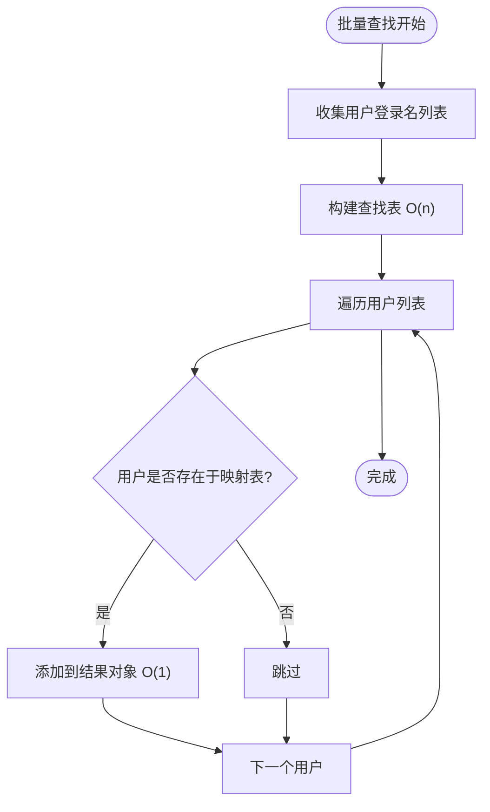

**图表来源**
- [user-mapping.js:124-137](file://lib/user-mapping.js#L124-L137)

**章节来源**
- [user-mapping.js:7-155](file://lib/user-mapping.js#L7-L155)

## 依赖关系分析
- helpers.js 被 routes/analytics.js 与 routes/bill.js 直接依赖
- date-utils.js 被 routes/bill.js 间接依赖（通过 routes/analytics.js 引入）
- billing-config.js 被 routes/bill.js 与 routes/seats.js 依赖
- logger.js 被 github-api.js、usage-store.js、scheduler.js 等广泛依赖
- github-api.js 被 routes/seats.js、routes/bill.js 依赖
- usage-store.js 被 routes/bill.js、routes/analytics.js 依赖
- user-mapping.js 被 routes/analytics.js、routes/bill.js 依赖（**支持批量查找**）
- scheduler.js 通过回调注入刷新逻辑，被 routes/bill.js 使用
- **新增依赖**：analytics.js 依赖 helpers.js 中的配额使用分类工具

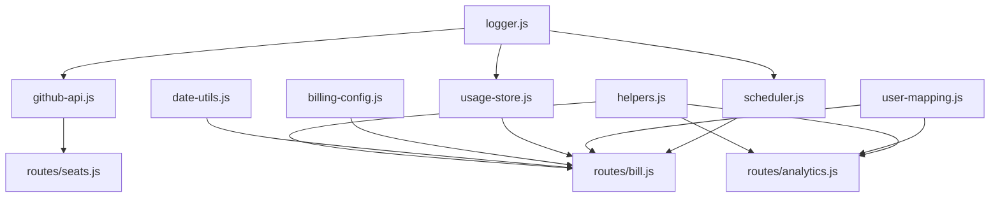

**图表来源**
- [helpers.js:1-185](file://lib/helpers.js#L1-L185)
- [analytics.js:1-297](file://routes/analytics.js#L1-L297)
- [bill.js:1-407](file://routes/bill.js#L1-L407)
- [date-utils.js:1-46](file://lib/date-utils.js#L1-L46)
- [billing-config.js:1-25](file://lib/billing-config.js#L1-L25)
- [logger.js:1-41](file://lib/logger.js#L1-L41)
- [github-api.js:1-320](file://lib/github-api.js#L1-L320)
- [usage-store.js:1-324](file://lib/usage-store.js#L1-L324)
- [scheduler.js:1-160](file://lib/scheduler.js#L1-L160)
- [user-mapping.js:1-158](file://lib/user-mapping.js#L1-L158)
- [seats.js:1-78](file://routes/seats.js#L1-L78)

**章节来源**
- [helpers.js:1-185](file://lib/helpers.js#L1-L185)
- [analytics.js:1-297](file://routes/analytics.js#L1-L297)
- [bill.js:1-407](file://routes/bill.js#L1-L407)
- [date-utils.js:1-46](file://lib/date-utils.js#L1-L46)
- [billing-config.js:1-25](file://lib/billing-config.js#L1-L25)
- [logger.js:1-41](file://lib/logger.js#L1-L41)
- [github-api.js:1-320](file://lib/github-api.js#L1-L320)
- [usage-store.js:1-324](file://lib/usage-store.js#L1-L324)
- [scheduler.js:1-160](file://lib/scheduler.js#L1-L160)
- [user-mapping.js:1-158](file://lib/user-mapping.js#L1-L158)
- [seats.js:1-78](file://routes/seats.js#L1-L78)

## 性能考量
- 并发控制：github-api.js 通过 MAX_CONCURRENT_GITHUB 控制并发，避免 GitHub 限流
- 缓存策略：LRU 缓存 + ETag 条件请求，显著减少重复请求
- 预编译语句：usage-store.js 使用预编译语句，降低 SQL 解析开销
- TTL 策略：usage-store.js 与 github-api.js 的 TTL 控制数据新鲜度
- 去抖与文件监控：user-mapping.js 的去抖避免频繁 IO
- 舍入与精度：billing-config.js 的舍入避免浮点误差累积
- 定时刷新：scheduler.js 的 backfill 天数与延迟启动平衡新鲜度与资源消耗
- **批量查找优化**：user-mapping.js 的 buildLookup() 函数将多个 getUserByGithub 调用合并为 O(n) 构建 + O(1) 每项查找的批量操作，显著提升大规模用户映射性能
- **配额使用分类优化**：classifyQuotaUsage 采用单次遍历 + 字典查找的方式，避免重复计算，提升大数据集处理效率

## 故障排查指南
- 速率限制：检查 github-api.js 的 ApiError 与 rateLimit 字段，确认 GITHUB_TOKEN 与 GITHUB_API_BASE 设置
- 端点错误：确认 ENTERPRISE_SLUG 或 ORG_NAME 是否设置，否则 buildEndpoint 会抛错
- 缓存问题：检查 githubGetCache 与 etagCache 的命中率，必要时清理缓存
- 数据库异常：查看 usage-store.js 的日志，确认表结构与索引是否存在
- 日志脱敏：确认敏感字段是否被正确脱敏，避免泄露
- 用户映射：检查 user_mapping.json 格式与内容，确保包含必需字段
- **批量查找问题**：如果 buildLookup() 返回空结果，检查输入的用户列表是否正确，确认用户映射文件是否正确加载
- **配额使用分类问题**：如果分类结果异常，检查 usagePercent 字段是否为有效数值，确认 QUOTA_USAGE_BUCKET_NAMES 的中文命名是否正确显示

**章节来源**
- [github-api.js:14-227](file://lib/github-api.js#L14-L227)
- [helpers.js:60-82](file://lib/helpers.js#L60-L82)
- [usage-store.js:24-79](file://lib/usage-store.js#L24-L79)
- [logger.js:16-38](file://lib/logger.js#L16-L38)
- [user-mapping.js:36-92](file://lib/user-mapping.js#L36-L92)
- [helpers.js:148-183](file://lib/helpers.js#L148-L183)

## 结论
辅助工具模块通过一组高内聚、低耦合的通用函数与基础设施，为整个 Copilot 使用量仪表盘提供了稳定、可扩展、可观测的支撑。其设计遵循"容错优先、配置驱动、缓存优先、可观测性"的原则，既满足了生产环境的可靠性需求，也为后续扩展（如新增计划类型、新的数据源）预留了空间。

**最新改进**：新增的配额使用分类功能提供了用户使用量分析的分类统计能力，通过 QUOTA_USAGE_BUCKET_NAMES、getQuotaUsageBucketName 和 classifyQuotaUsage 三个函数，实现了对用户配额使用情况的直观分类展示。同时，新增的 buildLookup() 函数实现了批量 O(1) 查找功能，将多个 getUserByGithub 调用优化为一次性批量操作，显著提升了大规模用户映射场景下的性能表现。

建议在实际使用中：
- 明确各工具的职责边界，避免跨模块滥用
- 充分利用缓存与 TTL，减少对外部依赖的压力
- 在关键路径埋点日志，结合速率限制与重试策略优化用户体验
- **优先使用 buildLookup() 进行批量用户映射查找，避免多次单次查询**
- **在用户分析中使用配额使用分类功能，提供更直观的使用量分布视图**
- 通过环境变量与配置文件灵活调整行为，适应不同部署场景

## 附录
- 依赖版本：项目使用 better-sqlite3、pino、lru-cache、express 等核心依赖，建议在升级时关注兼容性与性能变化
- 测试覆盖：helpers.test.js 覆盖 toNumber 与 pickUser 的关键分支，**新增配额使用分类测试**，建议为其他工具增加单元测试

**章节来源**
- [package.json:12-24](file://package.json#L12-L24)
- [helpers.test.js:1-106](file://test/helpers.test.js#L1-L106)