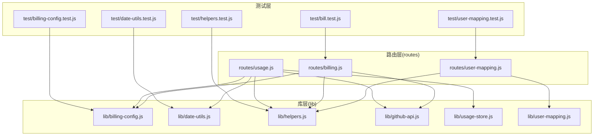
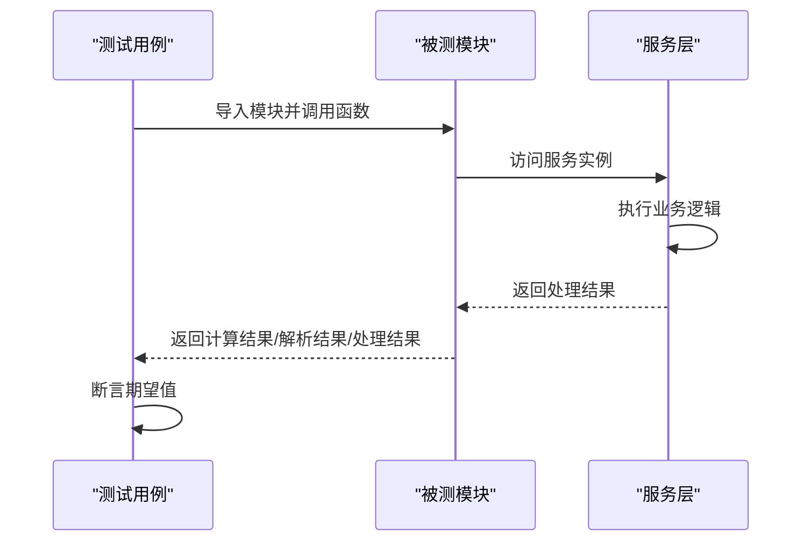
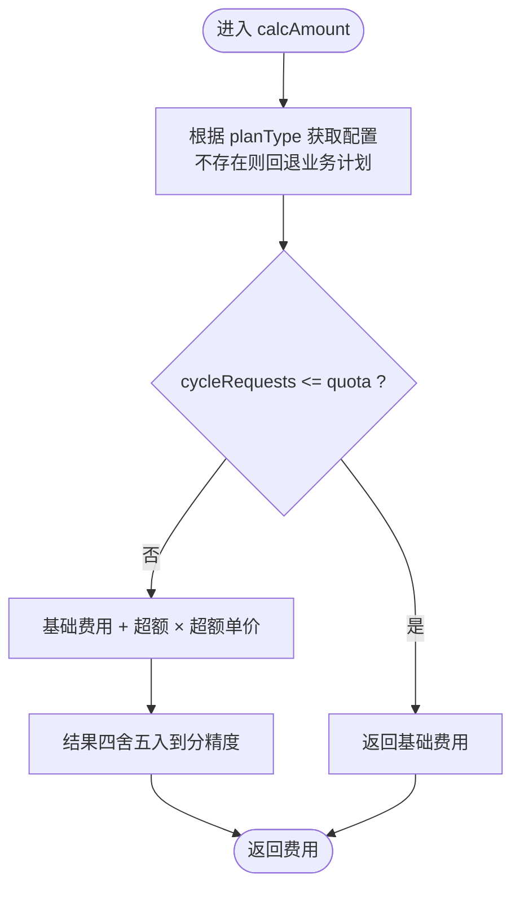
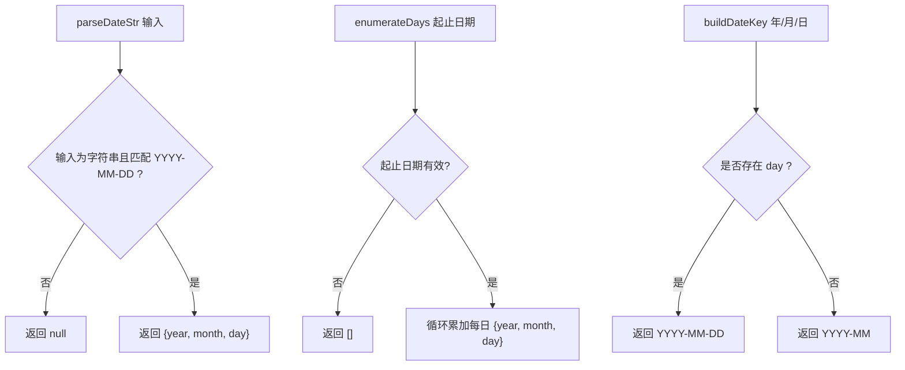
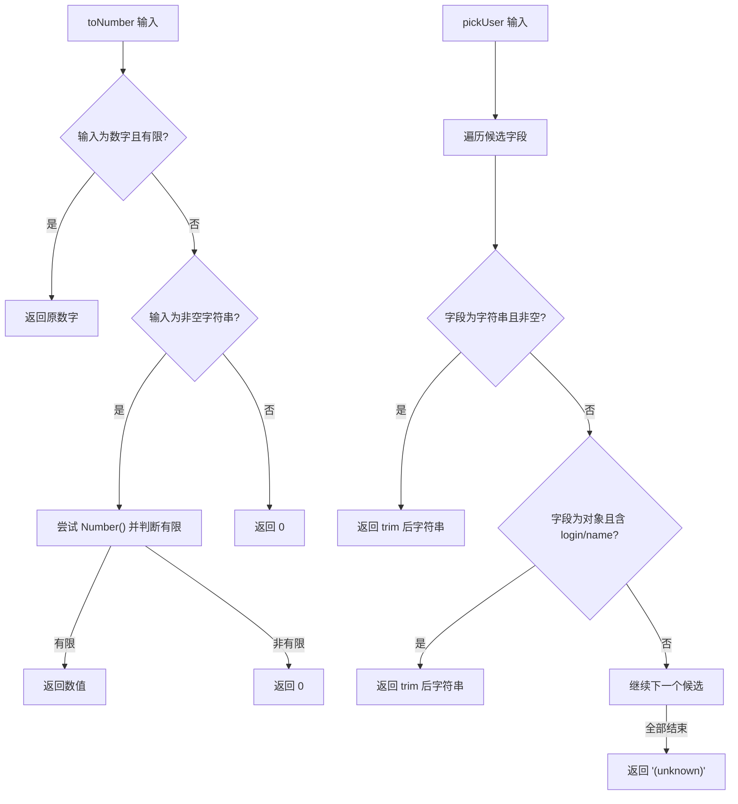
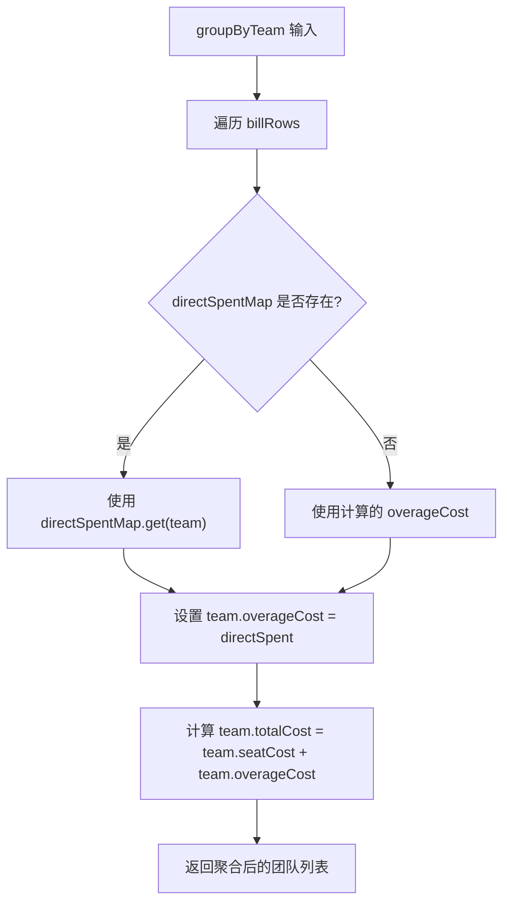
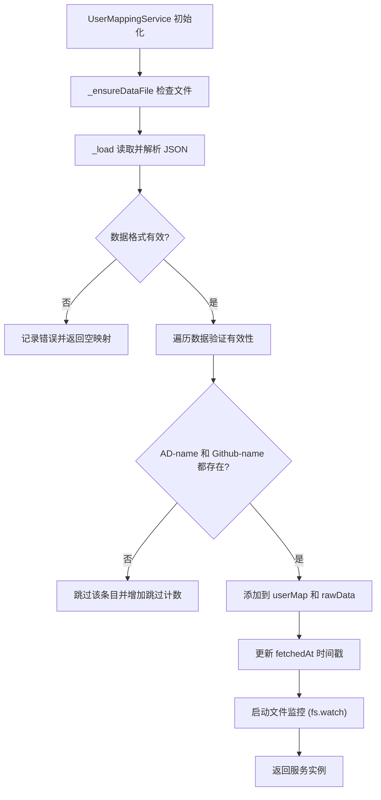
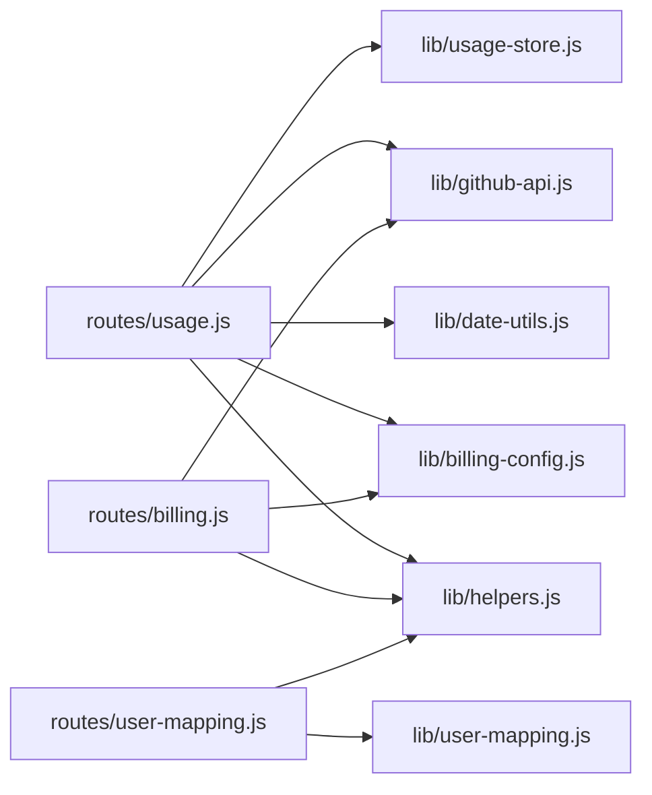

# 测试策略

<cite>
**本文引用的文件**
- [package.json](file://package.json)
- [README.md](file://README.md)
- [lib/billing-config.js](file://lib/billing-config.js)
- [lib/date-utils.js](file://lib/date-utils.js)
- [lib/helpers.js](file://lib/helpers.js)
- [lib/github-api.js](file://lib/github-api.js)
- [lib/usage-store.js](file://lib/usage-store.js)
- [lib/user-mapping.js](file://lib/user-mapping.js)
- [routes/usage.js](file://routes/usage.js)
- [routes/billing.js](file://routes/billing.js)
- [routes/user-mapping.js](file://routes/user-mapping.js)
- [test/billing-config.test.js](file://test/billing-config.test.js)
- [test/date-utils.test.js](file://test/date-utils.test.js)
- [test/helpers.test.js](file://test/helpers.test.js)
- [test/bill.test.js](file://test/bill.test.js)
- [test/user-mapping.test.js](file://test/user-mapping.test.js)
</cite>

## 目录
1. [简介](#简介)
2. [项目结构](#项目结构)
3. [核心组件](#核心组件)
4. [架构总览](#架构总览)
5. [详细组件分析](#详细组件分析)
6. [依赖分析](#依赖分析)
7. [性能考虑](#性能考虑)
8. [故障排查指南](#故障排查指南)
9. [结论](#结论)
10. [附录](#附录)

## 简介
本测试策略文档围绕 CopilotEnterpriseUsageDisplay 的单元测试设计与实施进行全面梳理，重点覆盖 vitest 测试框架的配置与使用、计费配置模块、日期工具模块、辅助函数模块、账单聚合模块和用户映射模块的功能测试与用例覆盖情况，并给出测试数据准备、断言验证方法、测试环境搭建与持续集成建议、测试驱动开发最佳实践、代码质量保障措施以及新测试用例编写指导与调试技巧。目标是确保测试策略能有效保障代码质量与功能稳定性。

## 项目结构
项目采用模块化分层架构，后端按职责拆分为入口层、路由层、服务层、数据层，前端通过 IIFE + 公共命名空间组织。测试集中在 test 目录，分别针对 lib 层的纯函数模块和新增的账单聚合与用户映射模块进行单元测试，覆盖计费配置、日期工具、辅助函数、账单聚合和用户映射五大核心模块。

**图表来源**
- [test/billing-config.test.js:1-70](file://test/billing-config.test.js#L1-L70)
- [test/date-utils.test.js:1-74](file://test/date-utils.test.js#L1-L74)
- [test/helpers.test.js:1-75](file://test/helpers.test.js#L1-L75)
- [test/bill.test.js:1-31](file://test/bill.test.js#L1-L31)
- [test/user-mapping.test.js:1-172](file://test/user-mapping.test.js#L1-L172)
- [lib/billing-config.js:1-25](file://lib/billing-config.js#L1-L25)
- [lib/date-utils.js:1-46](file://lib/date-utils.js#L1-L46)
- [lib/helpers.js:1-83](file://lib/helpers.js#L1-L83)
- [lib/github-api.js:1-320](file://lib/github-api.js#L1-L320)
- [lib/usage-store.js:1-324](file://lib/usage-store.js#L1-L324)
- [lib/user-mapping.js:1-173](file://lib/user-mapping.js#L1-L173)
- [routes/usage.js:1-470](file://routes/usage.js#L1-L470)
- [routes/billing.js:1-106](file://routes/billing.js#L1-L106)
- [routes/user-mapping.js:1-181](file://routes/user-mapping.js#L1-L181)

**章节来源**
- [README.md:77-80](file://README.md#L77-L80)
- [package.json:6-11](file://package.json#L6-L11)

## 核心组件
- 计费配置模块：负责计划配置与费用计算，包含计划常量、环境变量读取与费用计算函数。
- 日期工具模块：提供日期字符串解析、日期范围枚举与日期键构建等纯函数。
- 辅助函数模块：提供数值转换、用户识别、错误写回、查询参数构建与端点构建等通用能力。
- GitHub API 模块：封装并发队列、重试退避、LRU 缓存、ETag 条件请求与单飞去重等。
- UsageStore 模块：SQLite 持久化层，提供每日用量、席位快照、ETag 缓存与月度账单的读写与清理。
- UserMappingService 模块：用户映射服务，提供用户映射数据的加载、监控、查找与批量查询功能。
- 路由模块：用量路由、账单路由与用户映射路由，依赖上述模块实现业务逻辑。

**章节来源**
- [lib/billing-config.js:1-25](file://lib/billing-config.js#L1-L25)
- [lib/date-utils.js:1-46](file://lib/date-utils.js#L1-L46)
- [lib/helpers.js:1-83](file://lib/helpers.js#L1-L83)
- [lib/github-api.js:1-320](file://lib/github-api.js#L1-L320)
- [lib/usage-store.js:1-324](file://lib/usage-store.js#L1-L324)
- [lib/user-mapping.js:1-173](file://lib/user-mapping.js#L1-L173)
- [routes/usage.js:1-470](file://routes/usage.js#L1-L470)
- [routes/billing.js:1-106](file://routes/billing.js#L1-L106)
- [routes/user-mapping.js:1-181](file://routes/user-mapping.js#L1-L181)

## 架构总览
测试策略以 vitest 为核心，针对纯函数模块和新增模块进行独立单元测试，确保：
- 计费配置：计划结构、配额、基础费用与超额价格的正确性，以及费用计算逻辑。
- 日期工具：日期解析、范围枚举与键构建的健壮性与边界条件。
- 辅助函数：数值转换、用户识别与查询参数构建的准确性与容错性。
- 账单聚合：团队级别账单聚合逻辑，包括直接花费与计算超额费用的优先级处理。
- 用户映射：用户映射数据的加载、验证、监控与查询功能的完整性。

**图表来源**
- [lib/billing-config.js:6-11](file://lib/billing-config.js#L6-L11)
- [lib/helpers.js:38-56](file://lib/helpers.js#L38-L56)
- [lib/user-mapping.js:118-122](file://lib/user-mapping.js#L118-L122)

## 详细组件分析

### 计费配置模块测试策略
- 测试目标
  - 验证 PLAN_CONFIG 的结构与字段完整性（业务与企业计划）。
  - 验证 INCLUDED_QUOTA 的环境变量读取与默认值。
  - 验证 calcAmount 在不同计划、不同用量下的正确计费逻辑，包括"在配额内"、"恰好配额"、"超额"与"未知计划类型"的回退行为。
- 测试设计原则
  - 环境隔离：通过 beforeEach 重新导入模块，确保 INCLUDED_QUOTA 在每次测试前从环境变量读取，避免跨用例污染。
  - 边界覆盖：覆盖配额边界、零用量、超额、未知计划类型等场景。
  - 精度控制：对浮点计算结果进行四舍五入到分精度的断言。
- 用例覆盖
  - 业务与企业计划结构断言。
  - 业务与企业计划的费用计算断言。
  - 未知计划类型的回退断言。
  - 零用量断言。
- 断言验证方法
  - 使用 toBe 与 toEqual 对标量与对象进行精确断言。
  - 使用 Math.round 对浮点结果进行精度控制。
- 测试数据准备
  - 通过环境变量设置 INCLUDED_QUOTA 以验证业务计划配额。
  - 准备不同用量场景（低于配额、等于配额、高于配额）与不同计划类型。
- 覆盖率要求
  - 行覆盖率与分支覆盖率均达到高水位，确保所有路径被覆盖。

**图表来源**
- [lib/billing-config.js:18-22](file://lib/billing-config.js#L18-L22)

**章节来源**
- [test/billing-config.test.js:1-70](file://test/billing-config.test.js#L1-L70)
- [lib/billing-config.js:1-25](file://lib/billing-config.js#L1-L25)

### 日期工具模块测试策略
- 测试目标
  - 验证 parseDateStr 对合法与非法输入的解析行为。
  - 验证 enumerateDays 对单日、多日、跨月边界与无效范围的处理。
  - 验证 buildDateKey 对完整日期与月份键的生成。
- 测试设计原则
  - 输入多样性：覆盖合法字符串、空值、非字符串、格式错误等。
  - 边界与异常：跨月边界、无效日期、反向范围、空数组返回等。
  - 日期键生成：补零与月份/日期格式化。
- 用例覆盖
  - parseDateStr：合法日期、首日、空值、格式错误、类型错误。
  - enumerateDays：单日、多日、跨月、反向范围、无效日期。
  - buildDateKey：完整日期与月份键、补零处理。
- 断言验证方法
  - 使用 toEqual、toBeNull、toHaveLength 等断言。
- 测试数据准备
  - 准备多种日期字符串与日期范围，覆盖跨月与跨年场景。
- 覆盖率要求
  - 行与分支覆盖率均达到高水位，确保异常路径与边界条件被覆盖。

**图表来源**
- [lib/date-utils.js:8-13](file://lib/date-utils.js#L8-L13)
- [lib/date-utils.js:19-33](file://lib/date-utils.js#L19-L33)
- [lib/date-utils.js:38-43](file://lib/date-utils.js#L38-L43)

**章节来源**
- [test/date-utils.test.js:1-74](file://test/date-utils.test.js#L1-L74)
- [lib/date-utils.js:1-46](file://lib/date-utils.js#L1-L46)

### 辅助函数模块测试策略
- 测试目标
  - 验证 toNumber 对数字、字符串与非数值输入的转换行为。
  - 验证 pickUser 对多字段与嵌套对象的用户识别优先级与空字符串跳过。
  - 验证 buildQueryParams 对查询参数构建的环境变量依赖与默认值。
  - 验证 buildMemberExcelRows 对成员数据到 Excel 行的转换。
  - 验证 classifyUserActivity 对用户活跃度分类的逻辑。
- 测试设计原则
  - 类型与边界：数字、字符串、null、undefined、NaN、Infinity、空字符串、空白字符串。
  - 优先级与容错：用户字段优先于登录字段，嵌套对象中 login 与 name 的识别。
  - 环境变量注入：通过环境变量模拟真实运行时配置。
  - 数据格式化：Excel 行转换与用户活跃度分类的准确性。
- 用例覆盖
  - toNumber：数字原样、字符串解析、空字符串与空白字符串、非数值与特殊值。
  - pickUser：.user、.login、.username、嵌套 login/name、空对象、空字符串跳过、优先级。
  - buildQueryParams：year/month/cost_center_id 的组合与默认值。
  - buildMemberExcelRows：标题行、完整成员映射、空值填充、映射状态判断。
  - classifyUserActivity：活跃度分类、显示名称选择、时间计算、多成员分布。
- 断言验证方法
  - 使用 toBe、toBeNull、toHaveLength、toEqual、toThrow 等断言。
- 测试数据准备
  - 准备多样的输入对象与环境变量组合。
  - 准备用户活跃度分类的时间基准。
- 覆盖率要求
  - 行与分支覆盖率均达到高水位，确保所有优先级与默认值路径被覆盖。

**图表来源**
- [lib/helpers.js:5-12](file://lib/helpers.js#L5-L12)
- [lib/helpers.js:14-28](file://lib/helpers.js#L14-L28)
- [lib/helpers.js:38-56](file://lib/helpers.js#L38-L56)
- [lib/helpers.js:58-80](file://lib/helpers.js#L58-L80)

**章节来源**
- [test/helpers.test.js:1-75](file://test/helpers.test.js#L1-L75)
- [lib/helpers.js:1-83](file://lib/helpers.js#L1-L83)

### 账单聚合模块测试策略
- 测试目标
  - 验证团队级别账单聚合逻辑，特别是直接花费与计算超额费用的优先级处理。
  - 验证 groupByTeam 函数在存在直接花费映射时的行为。
- 测试设计原则
  - 优先级验证：直接花费优先于计算超额费用。
  - 数据完整性：确保团队信息、用户列表与费用计算的准确性。
  - 映射验证：验证直接花费映射表的大小写不敏感处理。
- 用例覆盖
  - 直接花费优先级：当存在直接花费映射时，overageCost 应使用直接花费而非计算值。
  - 团队总数：确保团队数量与用户数量的正确性。
  - 费用计算：验证 totalCost 包含直接花费与基础费用的正确组合。
  - 用户明细：验证用户级别的 overageCost 不受影响。
- 断言验证方法
  - 使用 toBe、toHaveLength、toEqual 等断言。
- 测试数据准备
  - 准备包含直接花费映射的账单数据。
  - 准备不同团队与用户的组合场景。
- 覆盖率要求
  - 行与分支覆盖率均达到高水位，确保优先级逻辑与边界条件被覆盖。

**图表来源**
- [test/bill.test.js:5-30](file://test/bill.test.js#L5-L30)

**章节来源**
- [test/bill.test.js:1-31](file://test/bill.test.js#L1-L31)

### 用户映射模块测试策略
- 测试目标
  - 验证 UserMappingService 的数据加载、验证与监控功能。
  - 验证用户映射查询与批量查找功能。
  - 验证 Excel 数据转换与用户活跃度分类功能。
- 测试设计原则
  - 数据完整性：确保映射数据的有效性验证与过滤。
  - 错误处理：验证文件不存在、格式错误等异常情况。
  - 性能优化：验证防抖机制与文件监控功能。
  - 数据一致性：验证大小写不敏感的用户名查找。
- 用例覆盖
  - 数据加载：JSON 文件解析、数据验证、过滤无效条目。
  - 用户查询：getUserByGithub 的大小写不敏感查找。
  - 批量查询：buildLookup 的批量映射功能。
  - 文件监控：防抖机制与错误处理。
  - Excel 转换：buildMemberExcelRows 的数据格式化。
  - 活跃度分类：classifyUserActivity 的时间计算与分类。
- 断言验证方法
  - 使用 toBe、toHaveLength、toEqual、toBeNull、toBeTruthy 等断言。
- 测试数据准备
  - 准备有效的用户映射 JSON 数据。
  - 准备不同大小写的用户名查询场景。
  - 准备 Excel 数据转换的测试用例。
- 覆盖率要求
  - 行与分支覆盖率均达到高水位，确保所有数据处理路径被覆盖。

**图表来源**
- [lib/user-mapping.js:24-92](file://lib/user-mapping.js#L24-L92)
- [lib/user-mapping.js:98-116](file://lib/user-mapping.js#L98-L116)

**章节来源**
- [test/user-mapping.test.js:1-172](file://test/user-mapping.test.js#L1-L172)
- [lib/user-mapping.js:1-173](file://lib/user-mapping.js#L1-L173)

### 路由层与服务层测试建议
- 用量路由（routes/usage.js）
  - 功能测试要点：聚合逻辑（按用户聚合、合并排名）、按日期/范围/默认模式的刷新流程、SQLite 缓存命中与回源逻辑、per-user fallback 的触发与回写。
  - 测试策略：使用 Mock 与 Stub 模拟 GitHub API 与 UsageStore，验证不同查询模式下的返回结构与缓存命中率计算。
  - 用例覆盖：单日查询、日期范围查询、默认查询、缓存命中、per-user fallback、错误处理。
- 账单路由（routes/billing.js）
  - 功能测试要点：席位数据获取、企业整体账单汇总、模型使用排行、费用估算与超额计算。
  - 测试策略：Mock GitHub API 返回值，验证计划汇总、总座位成本、总配额、超额请求与总估算费用的计算。
  - 用例覆盖：席位查询、账单汇总、模型排行、错误处理。
- 用户映射路由（routes/user-mapping.js）
  - 功能测试要点：Excel 文件上传与转换、用户映射数据管理、成员列表导出、用户信息查询。
  - 测试策略：使用 Mock 与 Stub 模拟文件系统操作与 ExcelJS 处理，验证文件上传、数据转换与 API 响应。
  - 用例覆盖：文件上传、数据转换、成员列表、Excel 导出、用户查询、错误处理。

**章节来源**
- [routes/usage.js:1-470](file://routes/usage.js#L1-L470)
- [routes/billing.js:1-106](file://routes/billing.js#L1-L106)
- [routes/user-mapping.js:1-181](file://routes/user-mapping.js#L1-L181)

## 依赖分析
- 模块耦合关系
  - 计费配置模块被路由层与辅助函数模块共同依赖，用于费用计算与查询参数构建。
  - 日期工具模块被用量路由用于日期范围枚举与日期解析。
  - GitHub API 与 UsageStore 模块在路由层中被调用，但单元测试应通过 Mock 隔离外部依赖。
  - UserMappingService 与 UsageStore、TeamCache 在用户映射路由中协同工作。
- 依赖链
  - routes/usage.js 依赖 billing-config、date-utils、helpers、github-api、usage-store。
  - routes/billing.js 依赖 billing-config、helpers、github-api。
  - routes/user-mapping.js 依赖 helpers、user-mapping service。
- 循环依赖风险
  - 当前模块间无显式循环依赖，但 helpers 中的 buildQueryParams 与 buildEndpoint 间接依赖 billing-config 的 requiredEnv，属于单向依赖，风险可控。

**图表来源**
- [routes/usage.js:6-9](file://routes/usage.js#L6-L9)
- [routes/billing.js:5-7](file://routes/billing.js#L5-L7)
- [routes/user-mapping.js:9-12](file://routes/user-mapping.js#L9-L12)
- [lib/helpers.js:38-60](file://lib/helpers.js#L38-L60)

**章节来源**
- [routes/usage.js:1-470](file://routes/usage.js#L1-L470)
- [routes/billing.js:1-106](file://routes/billing.js#L1-L106)
- [routes/user-mapping.js:1-181](file://routes/user-mapping.js#L1-L181)
- [lib/helpers.js:1-83](file://lib/helpers.js#L1-L83)

## 性能考虑
- 测试性能
  - 使用 vitest 的 watch 模式与并行执行提升反馈速度。
  - 通过 Mock 外部依赖减少 I/O 与网络调用，提高测试执行效率。
- 覆盖率
  - 通过覆盖率报告识别未覆盖路径，补充边界与异常场景用例。
- 缓存与重试
  - 在测试中避免真实 GitHub API 调用，使用 Mock 与 Stub 控制重试与并发，确保测试稳定与可重复。

## 故障排查指南
- 常见问题
  - 环境变量未设置导致 INCLUDED_QUOTA 为默认值，影响业务计划配额断言。
  - 日期格式不规范导致 parseDateStr 返回 null，进而影响 enumerateDays 的范围枚举。
  - pickUser 未正确识别嵌套对象中的 login/name，导致用户识别失败。
  - 用户映射文件格式错误或缺少必需字段，导致数据加载失败。
  - Excel 文件格式不支持或为空文件，导致转换失败。
- 解决方案
  - 在测试前显式设置环境变量，确保模块加载时读取到预期值。
  - 使用严格格式的日期字符串与边界测试，验证 parseDateStr 与 enumerateDays 的行为。
  - 通过多字段与嵌套对象的测试用例，验证 pickUser 的优先级与容错。
  - 准备符合格式的用户映射 JSON 文件，确保包含必需字段。
  - 使用标准的 Excel 文件格式，确保文件有数据行且格式正确。
- 调试技巧
  - 使用 vitest 的 watch 模式与单测文件粒度运行，快速定位问题。
  - 通过 Mock 与 Stub 精确控制外部依赖，隔离问题来源。
  - 检查文件系统权限与路径，确保用户映射文件可读写。

**章节来源**
- [test/billing-config.test.js:7-14](file://test/billing-config.test.js#L7-L14)
- [test/date-utils.test.js:5-30](file://test/date-utils.test.js#L5-L30)
- [test/helpers.test.js:31-75](file://test/helpers.test.js#L31-L75)
- [test/user-mapping.test.js:84-172](file://test/user-mapping.test.js#L84-L172)

## 结论
本测试策略以 vitest 为核心，围绕计费配置、日期工具、辅助函数、账单聚合和用户映射五大模块建立了完善的单元测试体系，明确了测试设计原则、用例覆盖、断言方法与环境准备要求。通过 Mock 与 Stub 隔离外部依赖，确保测试的稳定性与可重复性。新增的账单聚合与用户映射测试进一步完善了测试覆盖范围，特别是团队级别费用计算与用户映射管理功能。建议在后续迭代中逐步扩展路由层与服务层的单元测试，进一步提升整体覆盖率与质量保障水平。

## 附录

### 测试环境搭建与持续集成
- 运行命令
  - 运行所有单元测试：npm test
  - 监听模式：npm run test:watch
- 持续集成建议
  - 在 CI 中执行 npm test 并生成覆盖率报告。
  - 设置覆盖率阈值门禁，确保关键模块的覆盖率达标。
  - 使用缓存加速依赖安装，缩短流水线时间。

**章节来源**
- [package.json:6-11](file://package.json#L6-L11)
- [README.md:173-178](file://README.md#L173-L178)

### 测试驱动开发最佳实践
- 先写失败用例：明确期望行为后再实现代码。
- 小步提交：每次只实现一个最小可行功能，及时运行测试。
- 重构与回归：在保证测试通过的前提下进行重构，确保行为不变。
- 文档化测试：为复杂逻辑补充注释与测试说明，便于他人理解。

### 新测试用例编写指导与模板
- 模板结构
  - describe：模块/函数名称
  - beforeEach：重置环境与导入模块
  - it：用例描述与断言
- 指导原则
  - 用例单一职责：每个 it 只验证一个行为。
  - 输入清晰：明确输入与期望输出。
  - 边界覆盖：包含正常、异常与边界场景。
  - 断言明确：使用 toBe、toEqual、toThrow 等断言方法。
- 示例参考
  - 计费配置：参考 [test/billing-config.test.js:1-70](file://test/billing-config.test.js#L1-L70)
  - 日期工具：参考 [test/date-utils.test.js:1-74](file://test/date-utils.test.js#L1-L74)
  - 辅助函数：参考 [test/helpers.test.js:1-75](file://test/helpers.test.js#L1-L75)
  - 账单聚合：参考 [test/bill.test.js:1-31](file://test/bill.test.js#L1-L31)
  - 用户映射：参考 [test/user-mapping.test.js:1-172](file://test/user-mapping.test.js#L1-L172)