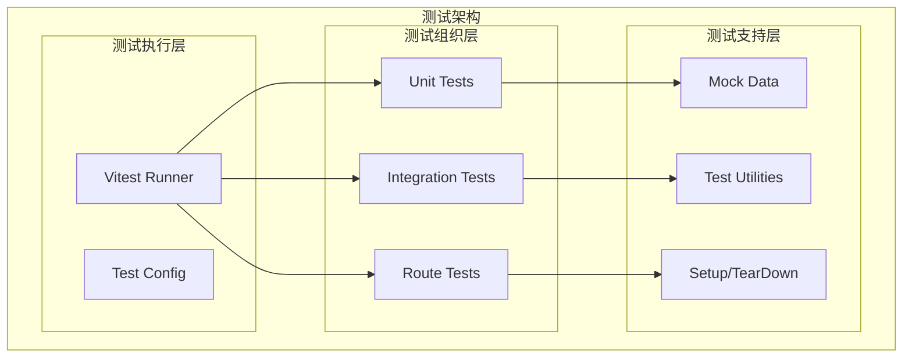
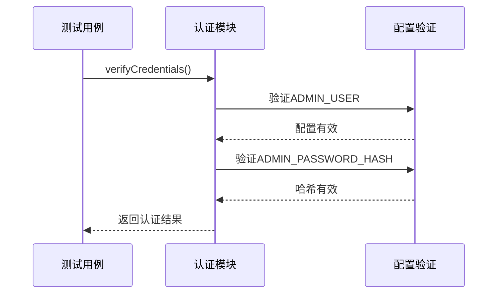
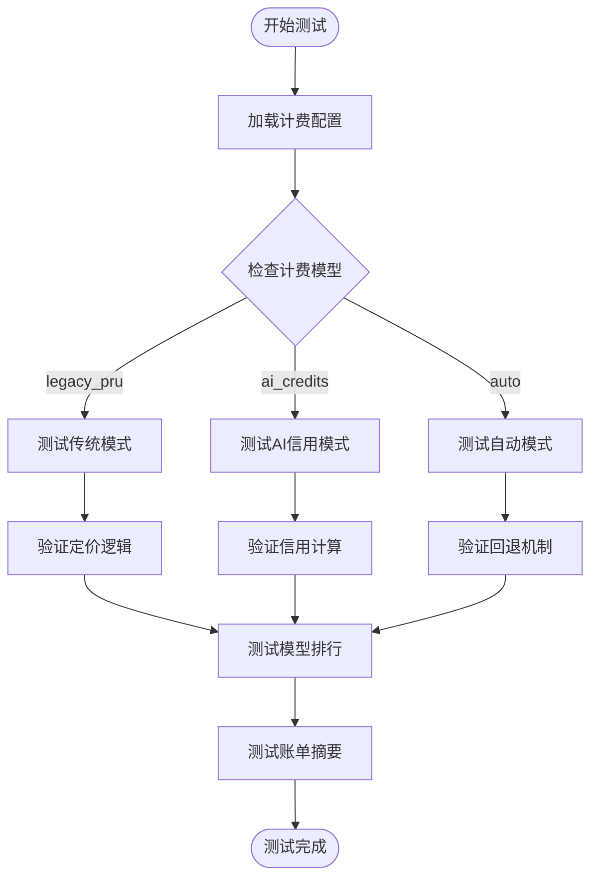
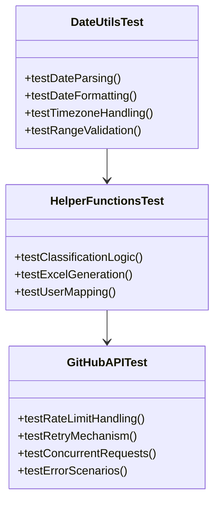

# 测试基础设施

<cite>
**本文档引用的文件**
- [package.json](file://package.json)
- [README.md](file://README.md)
- [test/auth-routes.test.js](file://test/auth-routes.test.js)
- [test/auth.test.js](file://test/auth.test.js)
- [test/bill.test.js](file://test/bill.test.js)
- [test/billing-config.test.js](file://test/billing-config.test.js)
- [test/billing-models.test.js](file://test/billing-models.test.js)
- [test/billing-summary.test.js](file://test/billing-summary.test.js)
- [test/date-utils.test.js](file://test/date-utils.test.js)
- [test/github-api.test.js](file://test/github-api.test.js)
- [test/helpers.test.js](file://test/helpers.test.js)
- [test/user-mapping.test.js](file://test/user-mapping.test.js)
</cite>

## 目录
1. [简介](#简介)
2. [项目结构](#项目结构)
3. [核心组件](#核心组件)
4. [架构概览](#架构概览)
5. [详细组件分析](#详细组件分析)
6. [依赖分析](#依赖分析)
7. [性能考虑](#性能考虑)
8. [故障排除指南](#故障排除指南)
9. [结论](#结论)

## 简介

本项目采用 Vitest 作为测试框架，建立了全面的测试基础设施，覆盖了认证、计费、数据处理、GitHub API 集成等多个核心模块。测试套件包含 20 个测试文件，提供了从单元测试到集成测试的多层次保障。

## 项目结构

项目采用模块化的测试架构，按照功能领域划分测试文件：

```mermaid
graph TB
subgraph "测试目录结构"
TestRoot[test/] --> UnitTests[单元测试]
TestRoot --> IntegrationTests[集成测试]
TestRoot --> RouteTests[路由测试]
UnitTests --> AuthTest[认证测试]
UnitTests --> BillingTest[计费测试]
UnitTests --> UtilsTest[工具函数测试]
IntegrationTests --> GitHubAPITest[GitHub API 测试]
IntegrationTests --> UserMappingTest[用户映射测试]
RouteTests --> AuthRoutesTest[认证路由测试]
RouteTests --> BillRoutesTest[账单路由测试]
</subgraph>
```

**图表来源**
- [test/](file://test/)
- [package.json](file://package.json)

**章节来源**
- [test/](file://test/)
- [package.json:6-11](file://package.json#L6-L11)

## 核心组件

### 测试框架配置

项目使用 Vitest 作为主要测试框架，配置简洁高效：

- **测试运行器**: Vitest 3.1.3
- **开发依赖**: vitest@^3.1.3
- **测试脚本**: 
  - `npm test`: 运行所有测试
  - `npm run test:watch`: 监听模式运行测试

### 测试覆盖范围

测试套件覆盖了以下核心功能模块：

| 测试类别 | 文件数量 | 覆盖功能 |
|---------|---------|---------|
| 认证测试 | 2 | 凭据验证、路由守卫 |
| 计费测试 | 4 | 配置、模型、摘要、账单 |
| 工具函数测试 | 3 | 日期工具、辅助函数 |
| 集成测试 | 2 | GitHub API、用户映射 |
| 路由测试 | 1 | 认证路由 |

**章节来源**
- [package.json:24-26](file://package.json#L24-L26)
- [README.md:89-98](file://README.md#L89-L98)

## 架构概览

测试基础设施采用分层架构，确保测试的可维护性和可扩展性：



**图表来源**
- [test/](file://test/)
- [package.json:6-11](file://package.json#L6-L11)

## 详细组件分析

### 认证测试组件

认证测试涵盖了管理员凭据验证和路由守卫机制：

#### 认证凭据测试



**图表来源**
- [test/auth.test.js](file://test/auth.test.js)
- [test/auth-routes.test.js](file://test/auth-routes.test.js)

#### 路由守卫测试

认证路由测试确保受保护页面的安全访问控制：

| 测试场景 | 预期行为 | 测试断言 |
|---------|---------|---------|
| 未登录访问受保护页面 | 302 重定向到 /admin | 状态码 302 |
| 登录后访问受保护页面 | 200 正常访问 | 状态码 200 |
| 302 重定向携带 next 参数 | 重定向到原始路径 | URL 参数验证 |
| 登出后访问受保护页面 | 302 重定向 | 302 状态码 |

**章节来源**
- [test/auth.test.js](file://test/auth.test.js)
- [test/auth-routes.test.js](file://test/auth-routes.test.js)

### 计费测试组件

计费测试模块覆盖了多种计费模式和数据源：

#### 计费配置测试



**图表来源**
- [test/billing-config.test.js](file://test/billing-config.test.js)
- [test/billing-models.test.js](file://test/billing-models.test.js)
- [test/billing-summary.test.js](file://test/billing-summary.test.js)

#### 账单测试

账单测试确保月度账单计算的准确性：

| 测试类型 | 关键测试点 | 验证内容 |
|---------|-----------|---------|
| 月度账单 | daily_usage 表 | 数据完整性、缓存策略 |
| 账单摘要 | monthly_bill 表 | 计算准确性、金额聚合 |
| 强制刷新 | 缓存失效 | 数据回源、重新计算 |

**章节来源**
- [test/bill.test.js](file://test/bill.test.js)
- [test/billing-summary.test.js](file://test/billing-summary.test.js)

### 工具函数测试组件

工具函数测试确保核心业务逻辑的正确性：

#### 日期工具测试

日期工具测试覆盖了时间处理和格式化功能：



**图表来源**
- [test/date-utils.test.js](file://test/date-utils.test.js)
- [test/helpers.test.js](file://test/helpers.test.js)
- [test/github-api.test.js](file://test/github-api.test.js)

**章节来源**
- [test/date-utils.test.js](file://test/date-utils.test.js)
- [test/helpers.test.js](file://test/helpers.test.js)
- [test/github-api.test.js](file://test/github-api.test.js)

### 用户映射测试组件

用户映射测试确保用户名称映射功能的完整性：

#### Excel 文件处理测试

用户映射测试覆盖了 Excel 文件的上传、解析和导出功能：

| 测试场景 | 验证内容 | 测试数据 |
|---------|---------|---------|
| Excel 文件上传 | 文件格式验证、列名检查 | .xlsx, .xls 文件 |
| 数据解析 | 字段映射、数据验证 | AD-name, Github-name 等 |
| 导出功能 | Excel 生成、格式正确性 | 7 列标准结构 |
| 热重载功能 | 文件变更检测、自动更新 | fs.watch 机制 |

**章节来源**
- [test/user-mapping.test.js](file://test/user-mapping.test.js)

## 依赖分析

测试基础设施的依赖关系清晰明确：

```mermaid
graph LR
subgraph "运行时依赖"
Vitest[vitest] --> TestFramework
Pino[pino] --> Logging
BetterSqlite3[better-sqlite3] --> Database
end
subgraph "开发依赖"
VitestDev[vitest@^3.1.3] --> DevTestFramework
Express[express] --> WebFramework
Multer[multer] --> FileUpload
end
subgraph "测试依赖"
Vitest --> Mocking
Vitest --> Assertions
Vitest --> TestingUtilities
end
```

**图表来源**
- [package.json:12-26](file://package.json#L12-L26)

**章节来源**
- [package.json:12-26](file://package.json#L12-L26)

## 性能考虑

测试基础设施在性能方面采用了多项优化策略：

### 测试执行优化

- **并行测试**: Vitest 支持测试间的并行执行，提高测试覆盖率
- **智能缓存**: 利用测试缓存机制，避免重复执行相同测试
- **增量测试**: 支持仅运行变更相关的测试文件

### 内存管理

- **垃圾回收**: 测试结束后自动清理内存资源
- **数据库连接**: 测试后正确关闭数据库连接
- **文件句柄**: 确保测试过程中打开的文件正确关闭

## 故障排除指南

### 常见测试问题

| 问题类型 | 症状 | 解决方案 |
|---------|------|---------|
| 测试超时 | 测试执行时间过长 | 检查异步操作、添加超时配置 |
| 内存泄漏 | 测试后内存占用过高 | 确保清理定时器、事件监听器 |
| 数据库连接失败 | SQLite 连接错误 | 检查数据库文件权限、连接池配置 |
| 环境变量问题 | 测试配置错误 | 验证 .env 文件、环境变量设置 |

### 调试技巧

- **详细日志**: 使用 `console.log` 输出中间状态
- **断点调试**: 在 Vitest 中设置断点进行调试
- **隔离测试**: 将问题测试单独运行以快速定位
- **依赖检查**: 确保所有依赖正确安装和配置

**章节来源**
- [README.md:203-222](file://README.md#L203-L222)

## 结论

本项目的测试基础设施展现了现代 Node.js 应用的最佳实践：

### 主要优势

1. **全面覆盖**: 涵盖了从认证到计费的各个核心功能模块
2. **架构清晰**: 按功能领域组织测试文件，便于维护
3. **配置简洁**: 使用标准的 Vitest 配置，易于理解和扩展
4. **性能优化**: 采用并行执行和智能缓存机制

### 改进建议

1. **测试数据管理**: 考虑使用专门的测试数据库管理工具
2. **模拟策略**: 进一步完善第三方服务的模拟策略
3. **持续集成**: 集成自动化测试流水线
4. **覆盖率报告**: 添加代码覆盖率统计和报告功能

测试基础设施为项目的稳定性和可靠性提供了坚实保障，是项目质量管理体系的重要组成部分。