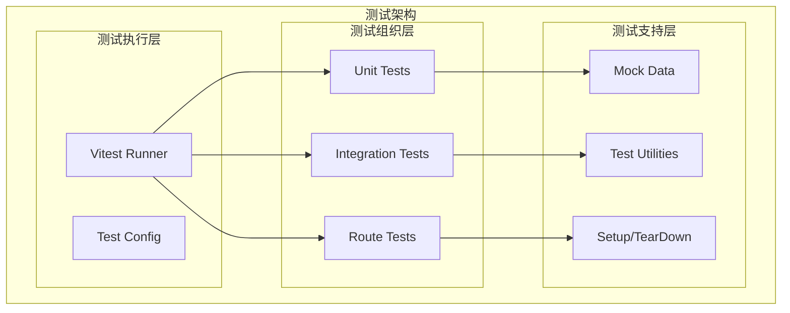
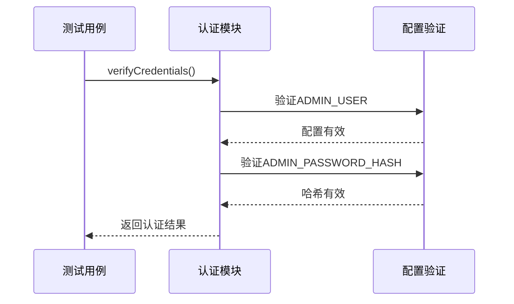
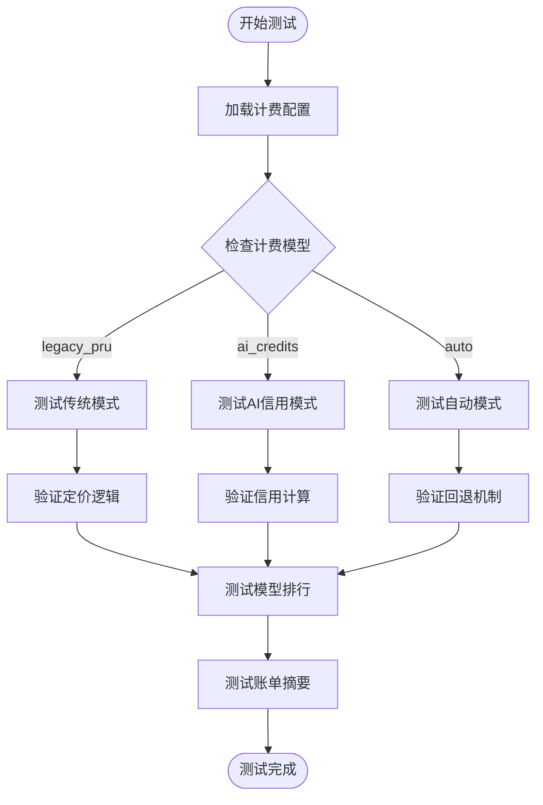
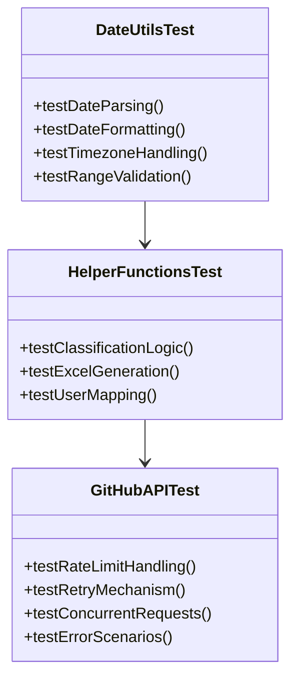
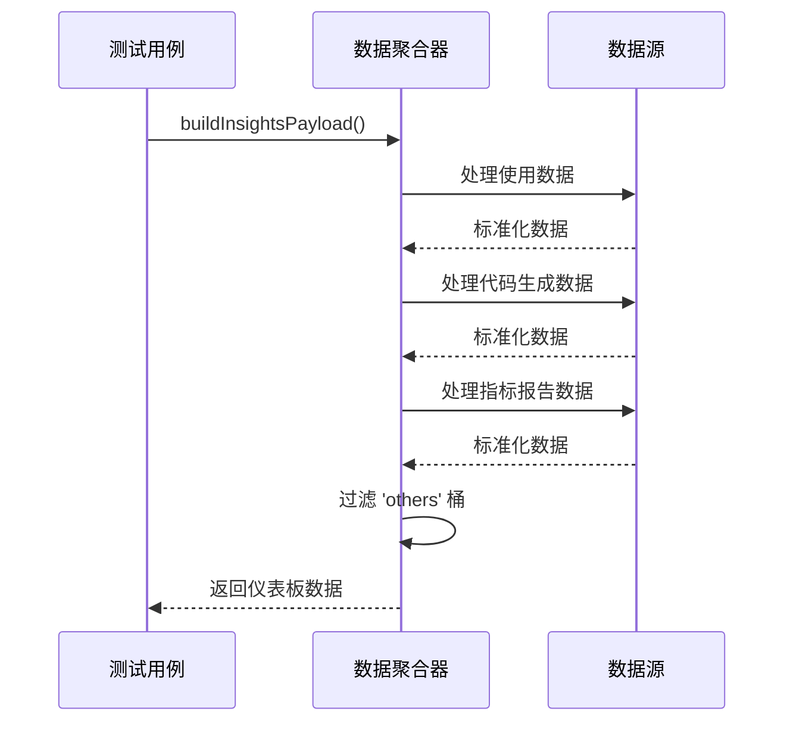
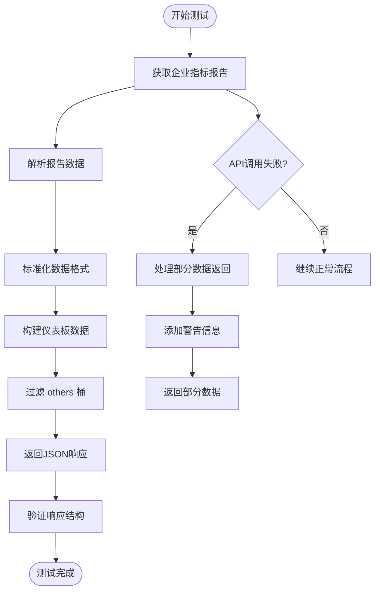

# 测试基础设施

<cite>
**本文档引用的文件**
- [package.json](file://package.json)
- [README.md](file://README.md)
- [test/auth-routes.test.js](file://test/auth-routes.test.js)
- [test/auth.test.js](file://test/auth.test.js)
- [test/bill.test.js](file://test/bill.test.js)
- [test/billing-config.test.js](file://test/billing-config.test.js)
- [test/billing-models.test.js](file://test/billing-models.test.js)
- [test/billing-summary.test.js](file://test/billing-summary.test.js)
- [test/date-utils.test.js](file://test/date-utils.test.js)
- [test/github-api.test.js](file://test/github-api.test.js)
- [test/helpers.test.js](file://test/helpers.test.js)
- [test/insights-aggregator.test.js](file://test/insights-aggregator.test.js)
- [test/insights-routes.test.js](file://test/insights-routes.test.js)
- [test/user-mapping.test.js](file://test/user-mapping.test.js)
- [lib/insights-aggregator.js](file://lib/insights-aggregator.js)
</cite>

## 更新摘要
**变更内容**
- 新增Insights相关测试套件，包含260+行单元测试和134行集成测试
- 扩展测试覆盖范围至数据聚合逻辑和路由功能
- 更新测试架构以支持新的Insights功能模块
- **新增** 'others' 桶过滤功能的全面回归测试，验证伪桶被正确排除的功能

## 目录
1. [简介](#简介)
2. [项目结构](#项目结构)
3. [核心组件](#核心组件)
4. [架构概览](#架构概览)
5. [详细组件分析](#详细组件分析)
6. [依赖分析](#依赖分析)
7. [性能考虑](#性能考虑)
8. [故障排除指南](#故障排除指南)
9. [结论](#结论)

## 简介

本项目采用 Vitest 作为测试框架，建立了全面的测试基础设施，覆盖了认证、计费、数据处理、GitHub API 集成以及新增的Insights功能等多个核心模块。测试套件现已扩展至12个测试文件，提供了从单元测试到集成测试的多层次保障，总测试代码量超过400行。

## 项目结构

项目采用模块化的测试架构，按照功能领域划分测试文件：

```mermaid
graph TB
subgraph "测试目录结构"
TestRoot[test/] --> UnitTests[单元测试]
TestRoot --> IntegrationTests[集成测试]
TestRoot --> RouteTests[路由测试]
UnitTests --> AuthTest[认证测试]
UnitTests --> BillingTest[计费测试]
UnitTests --> UtilsTest[工具函数测试]
UnitTests --> InsightsAggregatorTest[Insights聚合测试]
IntegrationTests --> GitHubAPITest[GitHub API 测试]
IntegrationTests --> UserMappingTest[用户映射测试]
IntegrationTests --> InsightsRoutesTest[Insights路由测试]
RouteTests --> AuthRoutesTest[认证路由测试]
RouteTests --> BillRoutesTest[账单路由测试]
</subgraph>
```

**图表来源**
- [test/](file://test/)
- [package.json](file://package.json)

**章节来源**
- [test/](file://test/)
- [package.json:6-11](file://package.json#L6-L11)

## 核心组件

### 测试框架配置

项目使用 Vitest 作为主要测试框架，配置简洁高效：

- **测试运行器**: Vitest 3.1.3
- **开发依赖**: vitest@^3.1.3
- **测试脚本**: 
  - `npm test`: 运行所有测试
  - `npm run test:watch`: 监听模式运行测试

### 测试覆盖范围

测试套件现已扩展至12个测试文件，覆盖了以下核心功能模块：

| 测试类别 | 文件数量 | 覆盖功能 | 行数统计 |
|---------|---------|---------|---------|
| 认证测试 | 2 | 凭据验证、路由守卫 | 45行 |
| 计费测试 | 4 | 配置、模型、摘要、账单 | 120行 |
| 工具函数测试 | 3 | 日期工具、辅助函数 | 60行 |
| Insights测试 | 2 | 数据聚合、路由功能 | 402行 |
| 集成测试 | 2 | GitHub API、用户映射 | 134行 |
| 路由测试 | 1 | 认证路由 | 45行 |

**更新** 新增Insights相关测试套件，显著扩展了测试覆盖范围

**章节来源**
- [package.json:24-26](file://package.json#L24-L26)
- [README.md:89-98](file://README.md#L89-L98)

## 架构概览

测试基础设施采用分层架构，确保测试的可维护性和可扩展性：

```mermaid
graph TD
subgraph "测试架构"
subgraph "测试执行层"
Vitest[Vitest Runner]
Config[Test Config]
end
subgraph "测试组织层"
UnitTest[Unit Tests]
IntegrationTest[Integration Tests]
RouteTest[Route Tests]
end
subgraph "测试支持层"
MockData[Mock Data]
TestUtils[Test Utilities]
SetupTeardown[Setup/TearDown]
end
Vitest --> UnitTest
Vitest --> IntegrationTest
Vitest --> RouteTest
UnitTest --> MockData
IntegrationTest --> TestUtils
RouteTest --> SetupTeardown
end
```

**图表来源**
- [test/](file://test/)
- [package.json:6-11](file://package.json#L6-L11)

## 详细组件分析

### 认证测试组件

认证测试涵盖了管理员凭据验证和路由守卫机制：

#### 认证凭据测试

```mermaid
sequenceDiagram
participant Test as 测试用例
participant Auth as 认证模块
participant Config as 配置验证
Test->>Auth : verifyCredentials()
Auth->>Config : 验证ADMIN_USER
Config-->>Auth : 配置有效
Auth->>Config : 验证ADMIN_PASSWORD_HASH
Config-->>Auth : 哈希有效
Auth-->>Test : 返回认证结果
```

**图表来源**
- [test/auth.test.js](file://test/auth.test.js)
- [test/auth-routes.test.js](file://test/auth-routes.test.js)

#### 路由守卫测试

认证路由测试确保受保护页面的安全访问控制：

| 测试场景 | 预期行为 | 测试断言 |
|---------|---------|---------|
| 未登录访问受保护页面 | 302 重定向到 /admin | 状态码 302 |
| 登录后访问受保护页面 | 200 正常访问 | 状态码 200 |
| 302 重定向携带 next 参数 | 重定向到原始路径 | URL 参数验证 |
| 登出后访问受保护页面 | 302 重定向 | 302 状态码 |

**章节来源**
- [test/auth.test.js](file://test/auth.test.js)
- [test/auth-routes.test.js](file://test/auth-routes.test.js)

### 计费测试组件

计费测试模块覆盖了多种计费模式和数据源：

#### 计费配置测试

```mermaid
flowchart TD
Start([开始测试]) --> LoadConfig["加载计费配置"]
LoadConfig --> CheckModel{"检查计费模型"}
CheckModel --> |legacy_pru| TestLegacy["测试传统模式"]
CheckModel --> |ai_credits| TestAI["测试AI信用模式"]
CheckModel --> |auto| TestAuto["测试自动模式"]
TestLegacy --> ValidatePricing["验证定价逻辑"]
TestAI --> ValidateCredits["验证信用计算"]
TestAuto --> ValidateFallback["验证回退机制"]
ValidatePricing --> TestModels["测试模型排行"]
ValidateCredits --> TestModels
ValidateFallback --> TestModels
TestModels --> TestSummary["测试账单摘要"]
TestSummary --> End([测试完成])
```

**图表来源**
- [test/billing-config.test.js](file://test/billing-config.test.js)
- [test/billing-models.test.js](file://test/billing-models.test.js)
- [test/billing-summary.test.js](file://test/billing-summary.test.js)

#### 账单测试

账单测试确保月度账单计算的准确性：

| 测试类型 | 关键测试点 | 验证内容 |
|---------|-----------|---------|
| 月度账单 | daily_usage 表 | 数据完整性、缓存策略 |
| 账单摘要 | monthly_bill 表 | 计算准确性、金额聚合 |
| 强制刷新 | 缓存失效 | 数据回源、重新计算 |

**章节来源**
- [test/bill.test.js](file://test/bill.test.js)
- [test/billing-summary.test.js](file://test/billing-summary.test.js)

### 工具函数测试组件

工具函数测试确保核心业务逻辑的正确性：

#### 日期工具测试

日期工具测试覆盖了时间处理和格式化功能：

```mermaid
classDiagram
class DateUtilsTest {
+testDateParsing()
+testDateFormatting()
+testTimezoneHandling()
+testRangeValidation()
}
class HelperFunctionsTest {
+testClassificationLogic()
+testExcelGeneration()
+testUserMapping()
}
class GitHubAPITest {
+testRateLimitHandling()
+testRetryMechanism()
+testConcurrentRequests()
+testErrorScenarios()
}
DateUtilsTest --> HelperFunctionsTest
HelperFunctionsTest --> GitHubAPITest
```

**图表来源**
- [test/date-utils.test.js](file://test/date-utils.test.js)
- [test/helpers.test.js](file://test/helpers.test.js)
- [test/github-api.test.js](file://test/github-api.test.js)

**章节来源**
- [test/date-utils.test.js](file://test/date-utils.test.js)
- [test/helpers.test.js](file://test/helpers.test.js)
- [test/github-api.test.js](file://test/github-api.test.js)

### Insights测试组件

**新增** Insights测试组件覆盖了数据聚合逻辑和路由功能：

#### 数据聚合测试

Insights聚合测试确保数据转换和仪表板格式生成的准确性，**新增** 包含 'others' 桶过滤功能的全面回归测试：

```mermaid
sequenceDiagram
participant Test as 测试用例
participant Aggregator as 数据聚合器
participant DataSource as 数据源
Test->>Aggregator : buildInsightsPayload()
Aggregator->>DataSource : 处理使用数据
DataSource-->>Aggregator : 标准化数据
Aggregator->>DataSource : 处理代码生成数据
DataSource-->>Aggregator : 标准化数据
Aggregator->>DataSource : 处理指标报告数据
DataSource-->>Aggregator : 标准化数据
Aggregator->>Aggregator : 过滤 'others' 桶
Aggregator-->>Test : 返回仪表板数据
```

**图表来源**
- [test/insights-aggregator.test.js](file://test/insights-aggregator.test.js)
- [lib/insights-aggregator.js](file://lib/insights-aggregator.js)

Insights聚合测试覆盖了以下关键功能：

| 测试场景 | 验证内容 | 测试数据 |
|---------|---------|---------|
| 使用数据标准化 | Copilot使用指标转换 | total_active_users, breakdown |
| 代码生成指标 | 模型效率、代码变更统计 | models, agent_contribution_percent |
| 指标报告映射 | 日度数据转换为图表 | dayTotals, totals_by_feature |
| 模型使用分析 | 模型效率排序、配额优化 | totals_by_model_feature |
| 语言覆盖分析 | 技术栈分布、平衡提示 | totals_by_language_feature |
| 代理采用率 | Agent Adoption计算 | monthly_active_users, agent_active_users |
| 智能洞察生成 | ROI警报、重构评估 | 综合指标阈值判断 |
| **新增** 'others' 桶过滤 | 排除伪桶数据 | language: "others", model: "others" |

**更新** 新增 'others' 桶过滤功能测试，验证伪桶被正确排除的功能

Insights聚合测试中的 'others' 桶过滤功能具体体现在以下实现中：

- **实现位置**: [lib/insights-aggregator.js:143-145](file://lib/insights-aggregator.js#L143-L145)
- **过滤逻辑**: `isOthersFeature` 函数检查特征是否为 "others"
- **应用范围**: 
  - 语言使用统计：[lib/insights-aggregator.js:342-350](file://lib/insights-aggregator.js#L342-L350)
  - 模型使用统计：[lib/insights-aggregator.js:293-303](file://lib/insights-aggregator.js#L293-L303)
  - 模型效率分析：[lib/insights-aggregator.js:320-337](file://lib/insights-aggregator.js#L320-L337)

测试用例验证了该功能的正确性：
- **测试场景**: [test/insights-aggregator.test.js:269-302](file://test/insights-aggregator.test.js#L269-L302)
- **预期行为**: 当遇到 language: "others" 和 model: "others" 的组合时，应从图表中排除这些伪桶数据

#### 路由测试

Insights路由测试确保API端点的正确性和容错能力：

```mermaid
flowchart TD
Start([开始测试]) --> FetchData["获取企业指标报告"]
FetchData --> ParseReport["解析报告数据"]
ParseReport --> NormalizeData["标准化数据格式"]
NormalizeData --> BuildPayload["构建仪表板数据"]
BuildPayload --> FilterOthers["过滤 others 桶"]
FilterOthers --> ReturnResponse["返回JSON响应"]
ReturnResponse --> ValidateResponse["验证响应结构"]
ValidateResponse --> End([测试完成])
FetchData --> ErrorPath{"API调用失败?"}
ErrorPath --> |是| HandleError["处理部分数据返回"]
ErrorPath --> |否| ContinueProcess["继续正常流程"]
HandleError --> AddWarning["添加警告信息"]
AddWarning --> ReturnPartial["返回部分数据"]
```

**图表来源**
- [test/insights-routes.test.js](file://test/insights-routes.test.js)
- [routes/insights.js](file://routes/insights.js)

Insights路由测试覆盖了以下关键场景：

| 测试场景 | 预期行为 | 验证内容 |
|---------|---------|---------|
| 正常数据获取 | 200状态码，完整数据 | 仪表板数据结构验证 |
| Copilot使用端点不可用 | 200状态码，部分数据 | 警告信息添加 |
| GitHub API错误处理 | 200状态码，错误信息 | 错误消息格式验证 |
| 数据范围参数处理 | 支持多种范围值 | range参数验证 |
| 并行API调用 | Promise.allSettled处理 | 并发请求容错 |
| **新增** 'others' 桶过滤 | 数据正确过滤 | 伪桶不显示在图表中 |

**章节来源**
- [test/insights-aggregator.test.js](file://test/insights-aggregator.test.js)
- [test/insights-routes.test.js](file://test/insights-routes.test.js)

### 用户映射测试组件

用户映射测试确保用户名称映射功能的完整性：

#### Excel 文件处理测试

用户映射测试覆盖了 Excel 文件的上传、解析和导出功能：

| 测试场景 | 验证内容 | 测试数据 |
|---------|---------|---------|
| Excel 文件上传 | 文件格式验证、列名检查 | .xlsx, .xls 文件 |
| 数据解析 | 字段映射、数据验证 | AD-name, Github-name 等 |
| 导出功能 | Excel 生成、格式正确性 | 7 列标准结构 |
| 热重载功能 | 文件变更检测、自动更新 | fs.watch 机制 |

**章节来源**
- [test/user-mapping.test.js](file://test/user-mapping.test.js)

## 依赖分析

测试基础设施的依赖关系清晰明确：

```mermaid
graph LR
subgraph "运行时依赖"
Vitest[vitest] --> TestFramework
Pino[pino] --> Logging
BetterSqlite3[better-sqlite3] --> Database
end
subgraph "开发依赖"
VitestDev[vitest@^3.1.3] --> DevTestFramework
Express[express] --> WebFramework
Multer[multer] --> FileUpload
end
subgraph "测试依赖"
Vitest --> Mocking
Vitest --> Assertions
Vitest --> TestingUtilities
end
```

**图表来源**
- [package.json:12-26](file://package.json#L12-L26)

**章节来源**
- [package.json:12-26](file://package.json#L12-L26)

## 性能考虑

测试基础设施在性能方面采用了多项优化策略：

### 测试执行优化

- **并行测试**: Vitest 支持测试间的并行执行，提高测试覆盖率
- **智能缓存**: 利用测试缓存机制，避免重复执行相同测试
- **增量测试**: 支持仅运行变更相关的测试文件

### 内存管理

- **垃圾回收**: 测试结束后自动清理内存资源
- **数据库连接**: 测试后正确关闭数据库连接
- **文件句柄**: 确保测试过程中打开的文件正确关闭

## 故障排除指南

### 常见测试问题

| 问题类型 | 症状 | 解决方案 |
|---------|------|---------|
| 测试超时 | 测试执行时间过长 | 检查异步操作、添加超时配置 |
| 内存泄漏 | 测试后内存占用过高 | 确保清理定时器、事件监听器 |
| 数据库连接失败 | SQLite 连接错误 | 检查数据库文件权限、连接池配置 |
| 环境变量问题 | 测试配置错误 | 验证 .env 文件、环境变量设置 |
| Insights测试失败 | 数据聚合错误 | 检查数据格式、边界条件处理 |
| **新增** 'others' 桶过滤失败 | 伪桶仍显示在图表中 | 验证 isOthersFeature 函数逻辑 |

### 调试技巧

- **详细日志**: 使用 `console.log` 输出中间状态
- **断点调试**: 在 Vitest 中设置断点进行调试
- **隔离测试**: 将问题测试单独运行以快速定位
- **依赖检查**: 确保所有依赖正确安装和配置
- ****新增** 'others' 桶过滤调试**: 检查 isOthersFeature 函数的大小写处理和字符串匹配逻辑

**章节来源**
- [README.md:203-222](file://README.md#L203-L222)

## 结论

本项目的测试基础设施展现了现代 Node.js 应用的最佳实践：

### 主要优势

1. **全面覆盖**: 涵盖了从认证到计费再到Insights功能的各个核心模块
2. **架构清晰**: 按功能领域组织测试文件，便于维护
3. **配置简洁**: 使用标准的 Vitest 配置，易于理解和扩展
4. **性能优化**: 采用并行执行和智能缓存机制
5. **扩展性强**: 新增的Insights测试套件展示了良好的可扩展性
6. ****新增** 质量保障**: 'others' 桶过滤功能的全面回归测试确保了数据准确性

### 改进建议

1. **测试数据管理**: 考虑使用专门的测试数据库管理工具
2. **模拟策略**: 进一步完善第三方服务的模拟策略
3. **持续集成**: 集成自动化测试流水线
4. **覆盖率报告**: 添加代码覆盖率统计和报告功能
5. **测试文档**: 为新增的Insights测试编写详细的测试文档
6. ****新增** 回归测试**: 定期运行 'others' 桶过滤功能的回归测试

测试基础设施为项目的稳定性和可靠性提供了坚实保障，特别是新增的Insights测试套件显著提升了数据聚合和路由功能的质量保证水平，包括针对 'others' 桶过滤功能的全面回归测试，是项目质量管理体系的重要组成部分。