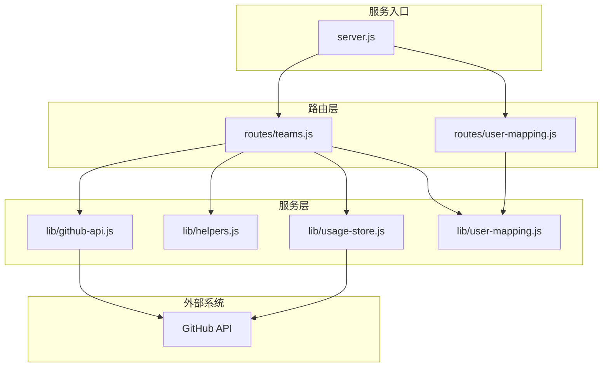
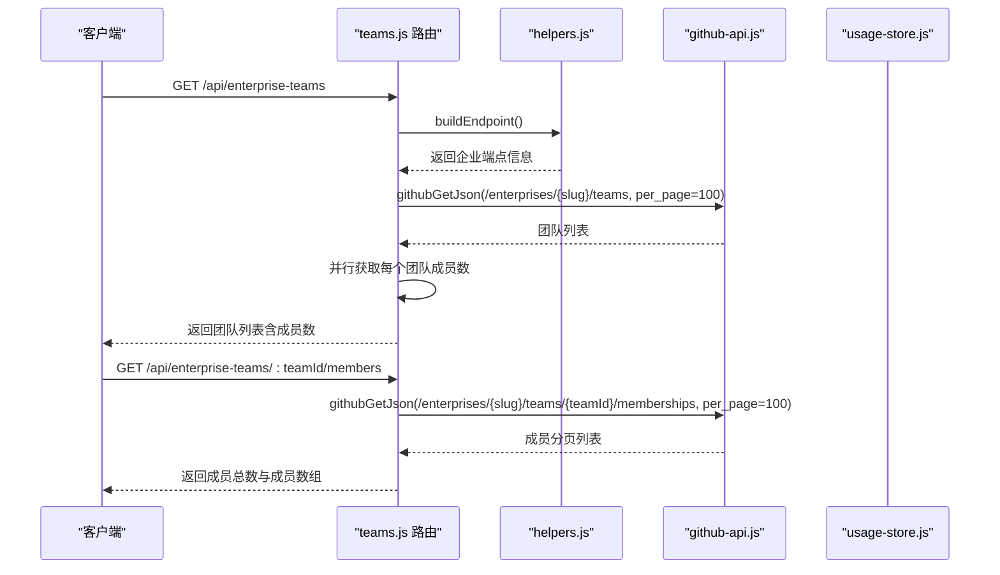
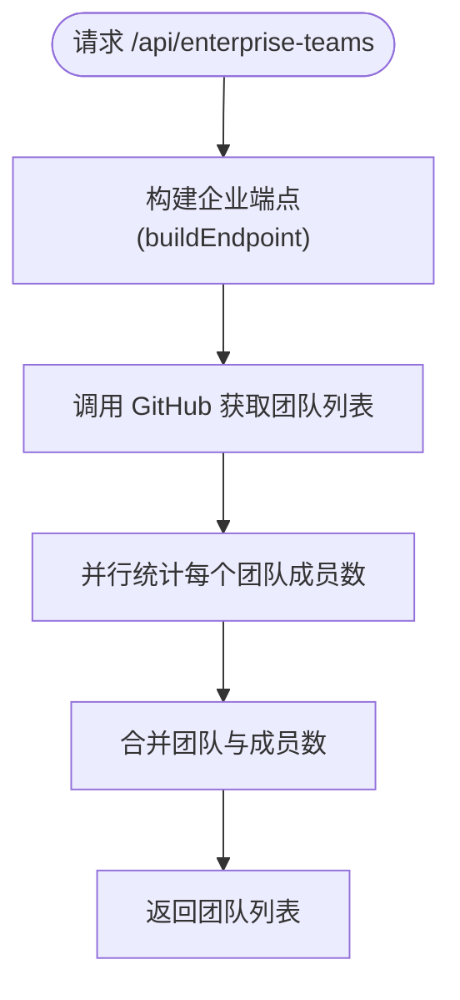
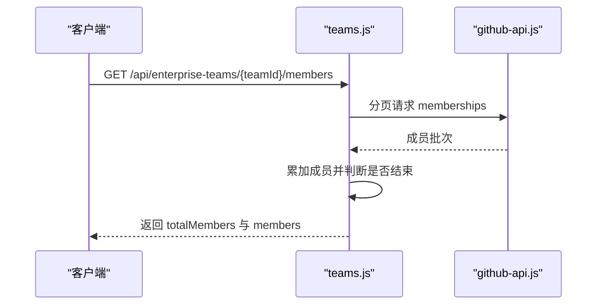
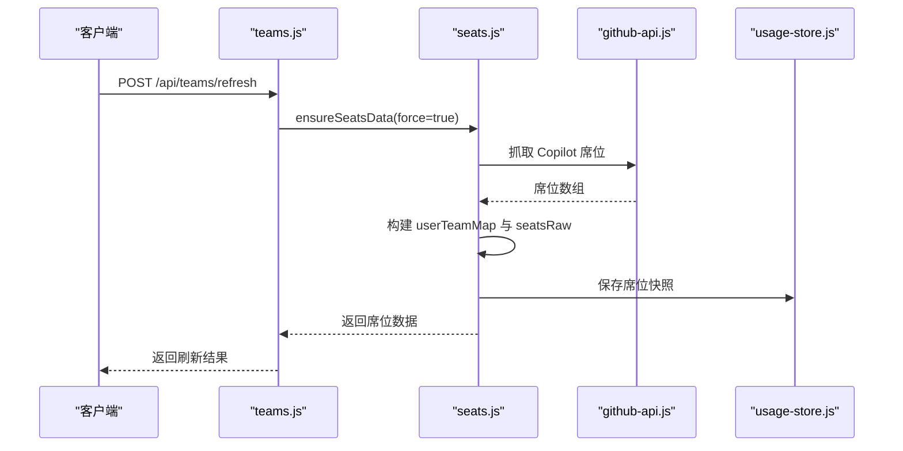
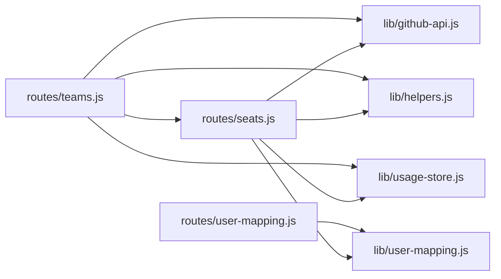

# 团队管理路由

<cite>
**本文引用的文件**
- [teams.js](file://routes/teams.js)
- [github-api.js](file://lib/github-api.js)
- [helpers.js](file://lib/helpers.js)
- [seats.js](file://routes/seats.js)
- [usage-store.js](file://lib/usage-store.js)
- [server.js](file://server.js)
- [README.md](file://README.md)
- [user-mapping.js](file://lib/user-mapping.js)
- [user-mapping-route.js](file://routes/user-mapping.js)
</cite>

## 目录
1. [简介](#简介)
2. [项目结构](#项目结构)
3. [核心组件](#核心组件)
4. [架构总览](#架构总览)
5. [详细组件分析](#详细组件分析)
6. [依赖关系分析](#依赖关系分析)
7. [性能考量](#性能考量)
8. [故障排查指南](#故障排查指南)
9. [结论](#结论)
10. [附录](#附录)

## 简介
本文件聚焦“团队管理路由”的实现与使用，涵盖以下主题：
- 团队信息获取与成员列表管理
- 席位状态查询与团队归属映射
- 团队层级结构、成员权限控制与席位分配机制
- 与 GitHub 组织结构的同步策略、成员变更检测与实时更新
- 团队维度的用量统计、成员贡献度分析与团队绩效评估
- 团队管理 API 的端点说明、数据格式与使用示例
- 团队数据的安全访问控制与权限验证机制

## 项目结构
团队管理路由位于 routes/teams.js，围绕以下关键模块协作：
- 路由层：teams.js 提供团队信息、成员列表与刷新接口
- GitHub API 层：github-api.js 提供并发控制、重试、ETag 条件请求与缓存
- 辅助工具：helpers.js 提供构建端点、参数组装与错误封装
- 席位数据：seats.js 提供 Copilot 席位数据抓取与缓存恢复
- 数据持久化：usage-store.js 提供 SQLite 缓存与 ETag 持久化
- 服务入口：server.js 注入 teamCache、usageStore、userMappingService，并挂载路由

图表来源
- [server.js:88-98](file://server.js#L88-L98)
- [teams.js:36-103](file://routes/teams.js#L36-L103)
- [github-api.js:108-168](file://lib/github-api.js#L108-L168)
- [helpers.js:58-80](file://lib/helpers.js#L58-L80)
- [usage-store.js:10-79](file://lib/usage-store.js#L10-L79)
- [user-mapping.js:1-158](file://lib/user-mapping.js#L1-L158)

章节来源
- [server.js:88-98](file://server.js#L88-L98)
- [README.md:46-96](file://README.md#L46-L96)

## 核心组件
- 团队路由模块：提供团队列表、成员列表与刷新接口
- GitHub API 适配层：并发队列、重试退避、ETag 条件请求、LRU 缓存与单飞去重
- 辅助工具：端点构建、参数组装、错误封装
- 席位数据加载器：抓取 Copilot 席位、构建用户-团队映射、SQLite 快照恢复
- 数据持久化：SQLite 表结构与 ETag 持久化，支持席位快照清理
- 用户映射服务：提供 GitHub 用户到 AD 信息的映射，支持热重载

章节来源
- [teams.js:36-103](file://routes/teams.js#L36-L103)
- [github-api.js:25-48](file://lib/github-api.js#L25-L48)
- [helpers.js:58-80](file://lib/helpers.js#L58-L80)
- [seats.js:9-75](file://routes/seats.js#L9-L75)
- [usage-store.js:10-79](file://lib/usage-store.js#L10-L79)
- [user-mapping.js:1-158](file://lib/user-mapping.js#L1-L158)

## 架构总览
团队管理路由通过以下链路实现：
- 路由层接收请求，校验运行模式（企业/组织），调用 GitHub API 获取团队与成员数据
- 使用 LRU 缓存与 ETag 条件请求减少 API 调用，提升性能与稳定性
- 席位数据通过 seats.js 抓取并构建 userTeamMap，供团队与成员信息展示
- 数据持久化层（SQLite）用于缓存与恢复，保障服务重启后的可用性
- 前端通过 /api/teams 与 /api/enterprise-teams 等端点获取团队与成员信息

图表来源
- [teams.js:43-84](file://routes/teams.js#L43-L84)
- [helpers.js:58-80](file://lib/helpers.js#L58-L80)
- [github-api.js:231-269](file://lib/github-api.js#L231-L269)

## 详细组件分析

### 团队信息获取
- 端点：GET /api/teams
  - 作用：返回当前内存中的团队映射与刷新时间戳
  - 数据来源：teamCache.userTeamMap 与 teamCache.fetchedAt
  - 适用场景：前端快速展示团队列表与成员数
- 端点：GET /api/enterprise-teams
  - 作用：获取企业下所有团队的基本信息，并补充成员数量
  - 数据来源：GitHub /enterprises/{enterprise}/teams，成员数通过 /memberships 分页统计
  - 缓存策略：团队列表与成员数分别缓存，成员数缓存 TTL 为 10 分钟
  - 返回字段：id、name、slug、description、membersCount、createdAt、htmlUrl

图表来源
- [teams.js:43-62](file://routes/teams.js#L43-L62)
- [teams.js:12-34](file://routes/teams.js#L12-L34)

章节来源
- [teams.js:39-62](file://routes/teams.js#L39-L62)
- [teams.js:12-34](file://routes/teams.js#L12-L34)

### 成员列表管理
- 端点：GET /api/enterprise-teams/:teamId/members
  - 作用：分页获取团队成员列表（登录名、头像、个人主页）
  - 数据来源：GitHub /enterprises/{enterprise}/teams/{teamId}/memberships
  - 分页策略：per_page=100，循环直到不足 100 条
  - 返回字段：ok、totalMembers、members（login、avatarUrl、htmlUrl）

图表来源
- [teams.js:64-84](file://routes/teams.js#L64-L84)
- [github-api.js:231-269](file://lib/github-api.js#L231-L269)

章节来源
- [teams.js:64-84](file://routes/teams.js#L64-L84)

### 席位状态查询与团队归属映射
- 端点：POST /api/teams/refresh
  - 作用：强制刷新团队与席位映射，重建 teamCache.userTeamMap
  - 数据来源：Copilot 席位数据（/enterprises/{enterprise}/copilot/billing/seats）
  - 处理逻辑：遍历席位，按 login 聚合 team 列表，去重并写入 teamCache
  - 返回字段：ok、fetchedAt、totalUsers、teams（用户-团队映射）
- 席位数据加载器：seats.js
  - 从 GitHub 抓取席位，构建 userTeamMap 与 seatsRaw
  - 支持 SQLite 快照恢复，避免每次启动都拉取 GitHub
  - TTL：10 分钟

图表来源
- [teams.js:86-100](file://routes/teams.js#L86-L100)
- [seats.js:37-75](file://routes/seats.js#L37-L75)
- [github-api.js:231-269](file://lib/github-api.js#L231-L269)
- [usage-store.js:211-239](file://lib/usage-store.js#L211-L239)

章节来源
- [teams.js:86-100](file://routes/teams.js#L86-L100)
- [seats.js:9-75](file://routes/seats.js#L9-L75)
- [usage-store.js:211-239](file://lib/usage-store.js#L211-L239)

### 团队层级结构、成员权限控制与席位分配机制
- 团队层级结构
  - 企业维度：/enterprises/{enterprise}/teams 获取团队列表
  - 团队维度：/enterprises/{enterprise}/teams/{teamId}/memberships 获取成员
- 成员权限控制
  - 企业模式：需要 ENTERPRISE_SLUG 与企业级权限（billing manager）
  - 组织模式：需要 ORG_NAME 与组织级权限
  - 端点构建：helpers.js 的 buildEndpoint() 根据环境变量选择企业或组织路径
- 席位分配机制
  - Copilot 席位数据包含 assignee、assigning_team、plan_type、last_activity 等字段
  - 通过席位数据构建 userTeamMap，用于团队与成员的关联展示

章节来源
- [helpers.js:58-80](file://lib/helpers.js#L58-L80)
- [README.md:196-217](file://README.md#L196-L217)
- [seats.js:9-35](file://routes/seats.js#L9-L35)

### 与 GitHub 组织结构的同步策略、成员变更检测与实时更新
- 同步策略
  - 团队与成员：通过 /teams 与 /memberships 分页拉取，支持 per_page=100
  - 成员数缓存：fetchEnterpriseTeamMemberCount() 循环分页统计，缓存 10 分钟
  - 席位数据：Copilot 席位数据按 10 分钟 TTL 缓存，SQLite 快照恢复
- 成员变更检测
  - ETag 条件请求：github-api.js 对 GET 请求使用 ETag，未变化返回 304，节省 API 配额
  - 单飞去重：github-api.js 的 in-flight 去重，避免并发重复请求
- 实时更新
  - 前端通过 /api/teams 获取内存映射，刷新频率受缓存 TTL 限制
  - POST /api/teams/refresh 强制刷新团队与席位映射

章节来源
- [teams.js:12-34](file://routes/teams.js#L12-L34)
- [github-api.js:231-269](file://lib/github-api.js#L231-L269)
- [github-api.js:108-168](file://lib/github-api.js#L108-L168)

### 团队维度的用量统计、成员贡献度分析与团队绩效评估
- 团队维度用量统计
  - 通过 /api/teams 获取团队映射，结合 per-user 用量聚合（routes/usage.js）计算团队维度指标
  - routes/usage.js 提供按用户聚合、排名与百分比计算，团队维度可由 userTeamMap 推导
- 成员贡献度分析
  - routes/usage.js 的聚合逻辑将 per-user 用量转换为排名与百分比，团队维度可按团队聚合
  - routes/user-mapping.js 提供 /api/user/members，结合 userMappingService 显示映射后的名称
- 团队绩效评估
  - 基于配额与超额计算（billing-config.js），团队维度可按团队成员聚合请求量与费用

章节来源
- [usage.js:28-118](file://routes/usage.js#L28-L118)
- [user-mapping-route.js:104-134](file://routes/user-mapping.js#L104-L134)
- [billing-config.js:18-22](file://lib/billing-config.js#L18-L22)

### 团队管理 API 端点说明、数据格式与使用示例
- GET /api/teams
  - 用途：获取当前内存中的团队映射与刷新时间
  - 返回：ok、fetchedAt、teams（用户-团队映射）
- GET /api/enterprise-teams
  - 用途：获取企业团队列表与成员数
  - 返回：ok、teams（包含 id、name、slug、description、membersCount、createdAt、htmlUrl）
- GET /api/enterprise-teams/:teamId/members
  - 用途：获取团队成员列表
  - 返回：ok、totalMembers、members（login、avatarUrl、htmlUrl）
- POST /api/teams/refresh
  - 用途：强制刷新团队与席位映射
  - 返回：ok、fetchedAt、totalUsers、teams

使用示例（以 curl 为例）
- 获取企业团队列表
  - curl -H "Authorization: Bearer $GITHUB_TOKEN" https://localhost:3000/api/enterprise-teams
- 获取团队成员
  - curl -H "Authorization: Bearer $GITHUB_TOKEN" https://localhost:3000/api/enterprise-teams/{teamId}/members
- 刷新团队映射
  - curl -X POST -H "Authorization: Bearer $GITHUB_TOKEN" https://localhost:3000/api/teams/refresh

章节来源
- [teams.js:39-100](file://routes/teams.js#L39-L100)
- [README.md:111-127](file://README.md#L111-L127)

### 团队数据的安全访问控制与权限验证机制
- 端点访问控制
  - 企业模式：/api/enterprise-* 端点要求 ENTERPRISE_SLUG 设置
  - 组织模式：/api/enterprise-* 端点要求 ORG_NAME 设置
  - 端点构建：helpers.js 的 buildEndpoint() 根据环境变量返回企业或组织端点
- 权限验证
  - GitHub PAT 需具备企业级 billing manager 权限
  - 环境变量校验：README.md 提供最小权限与 preflight 检查
- 错误处理
  - helpers.js 的 writeError() 统一封装错误响应，包含 rateLimit 信息（如触发限流）

章节来源
- [helpers.js:58-80](file://lib/helpers.js#L58-L80)
- [README.md:196-217](file://README.md#L196-L217)
- [helpers.js:30-36](file://lib/helpers.js#L30-L36)

## 依赖关系分析
- 路由层依赖
  - teams.js 依赖 github-api.js（GitHub API 调用）、helpers.js（端点构建）、seats.js（席位数据）
  - server.js 注入 teamCache、usageStore、userMappingService，挂载路由
- 数据持久化
  - usage-store.js 提供 SQLite 表结构与 ETag 持久化，支持席位快照清理
- 缓存与重试
  - github-api.js 提供并发队列、重试退避、ETag 条件请求与单飞去重

图表来源
- [teams.js:36-103](file://routes/teams.js#L36-L103)
- [seats.js:9-75](file://routes/seats.js#L9-L75)
- [github-api.js:231-269](file://lib/github-api.js#L231-L269)
- [usage-store.js:10-79](file://lib/usage-store.js#L10-L79)
- [user-mapping.js:1-158](file://lib/user-mapping.js#L1-L158)

章节来源
- [server.js:88-98](file://server.js#L88-L98)
- [teams.js:36-103](file://routes/teams.js#L36-L103)
- [seats.js:9-75](file://routes/seats.js#L9-L75)

## 性能考量
- 缓存策略
  - 团队与成员数缓存 TTL：10 分钟
  - GitHub API GET LRU 缓存与 ETag 条件请求，减少 API 调用
  - SQLite 持久化缓存与席位快照，服务重启后快速恢复
- 并发与重试
  - GitHub API 并发队列与单飞去重，避免重复请求
  - 指数退避重试，应对速率限制与临时错误
- 分页与批量
  - per_page=100 分页拉取团队与成员，避免一次性请求过大
  - 席位数据批量写入 SQLite，限制快照数量防止膨胀

章节来源
- [teams.js:9-10](file://routes/teams.js#L9-L10)
- [github-api.js:25-48](file://lib/github-api.js#L25-L48)
- [github-api.js:172-227](file://lib/github-api.js#L172-L227)
- [usage-store.js:227-239](file://lib/usage-store.js#L227-L239)

## 故障排查指南
- 常见错误与处理
  - 企业模式缺失：/api/enterprise-* 端点要求 ENTERPRISE_SLUG 或 ORG_NAME 设置
  - 速率限制：触发 429/403 secondary rate limit 时，自动指数退避重试
  - 数据未变化：ETag 304 Not Modified，前端可利用缓存继续展示
- 日志与诊断
  - server.js 的 HTTP 访问日志与全局错误中间件，提供请求上下文与堆栈
  - github-api.js 的 debug 级日志输出缓存命中、ETag 条件请求与重试信息
- 刷新与恢复
  - POST /api/teams/refresh 强制刷新团队与席位映射
  - SQLite 快照恢复：seats.js 从 usage-store.js 读取最新席位快照

章节来源
- [helpers.js:30-36](file://lib/helpers.js#L30-L36)
- [github-api.js:172-227](file://lib/github-api.js#L172-L227)
- [server.js:120-139](file://server.js#L120-L139)
- [seats.js:37-75](file://routes/seats.js#L37-L75)

## 结论
团队管理路由通过清晰的分层设计与完善的缓存/重试机制，实现了高效稳定的团队信息与成员管理能力。结合 Copilot 席位数据与用户映射服务，可进一步支撑团队维度的用量统计、贡献度分析与绩效评估。企业模式下的权限控制与错误处理确保了系统的安全与可观测性。

## 附录
- 环境变量与最小权限
  - GITHUB_TOKEN：企业级 billing manager 权限
  - ENTERPRISE_SLUG 或 ORG_NAME：决定端点模式
  - 参考 README.md 的环境变量说明与最小权限模板
- 相关端点与数据格式
  - 团队列表：/api/enterprise-teams
  - 成员列表：/api/enterprise-teams/:teamId/members
  - 刷新映射：/api/teams/refresh
  - 成员列表（含映射）：/api/user/members

章节来源
- [README.md:196-217](file://README.md#L196-L217)
- [README.md:111-127](file://README.md#L111-L127)
- [user-mapping-route.js:104-134](file://routes/user-mapping.js#L104-L134)