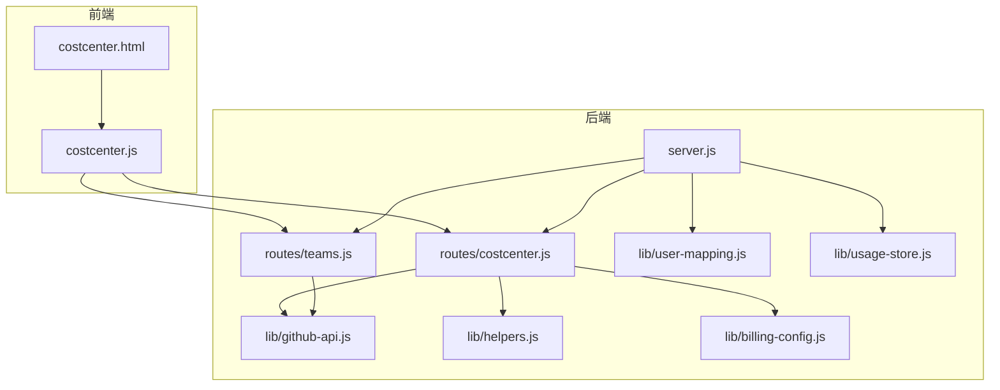
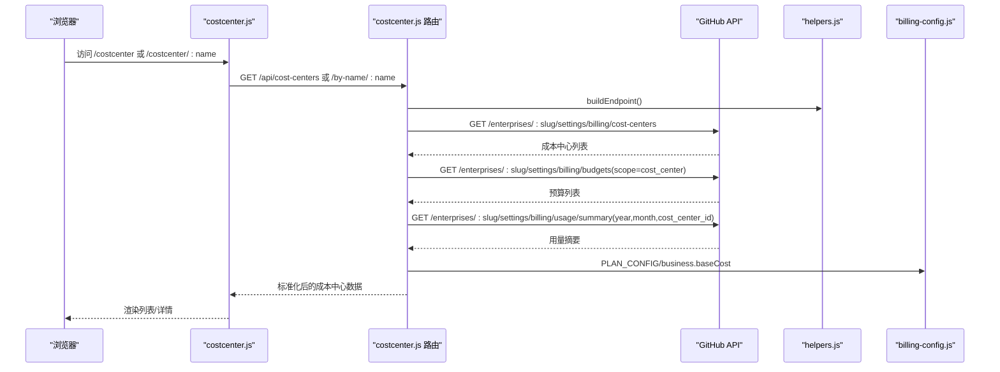
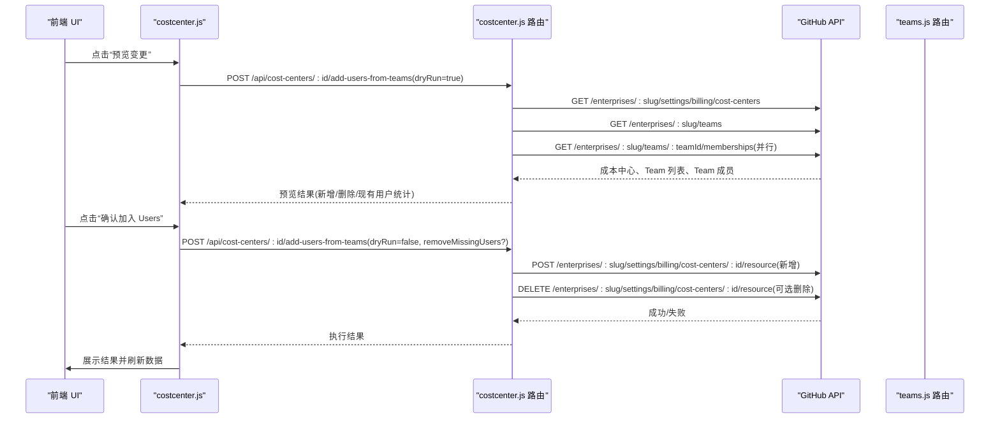
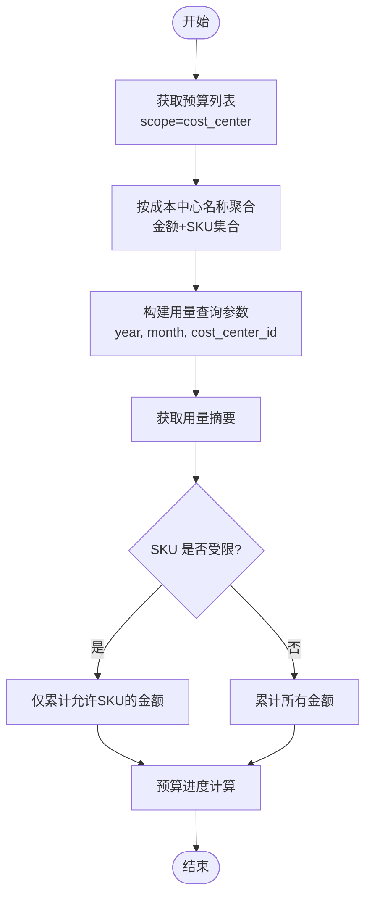
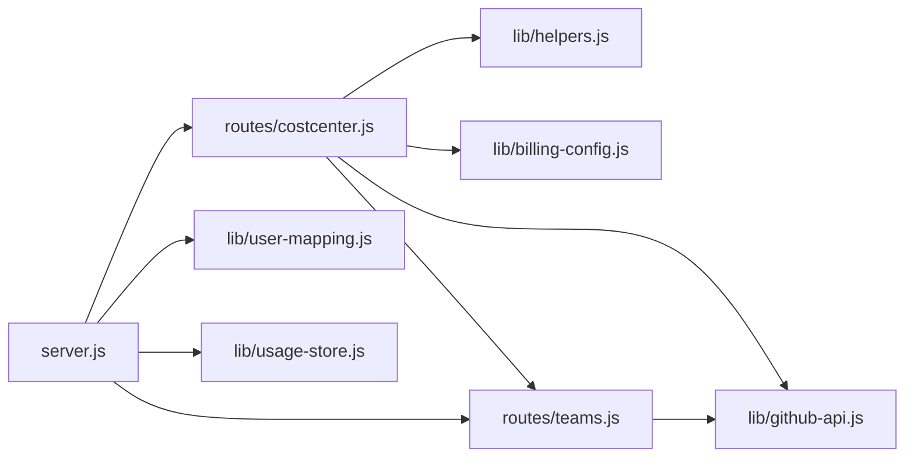

# 成本中心路由

<cite>
**本文档引用的文件**
- [routes/costcenter.js](file://routes/costcenter.js)
- [public/costcenter.js](file://public/costcenter.js)
- [public/costcenter.html](file://public/costcenter.html)
- [lib/github-api.js](file://lib/github-api.js)
- [lib/helpers.js](file://lib/helpers.js)
- [lib/billing-config.js](file://lib/billing-config.js)
- [lib/user-mapping.js](file://lib/user-mapping.js)
- [lib/usage-store.js](file://lib/usage-store.js)
- [routes/teams.js](file://routes/teams.js)
- [server.js](file://server.js)
- [README.md](file://README.md)
</cite>

## 目录
1. [简介](#简介)
2. [项目结构](#项目结构)
3. [核心组件](#核心组件)
4. [架构总览](#架构总览)
5. [详细组件分析](#详细组件分析)
6. [依赖关系分析](#依赖关系分析)
7. [性能考量](#性能考量)
8. [故障排查指南](#故障排查指南)
9. [结论](#结论)
10. [附录](#附录)

## 简介
本文件面向成本中心路由的实现与使用，系统性梳理成本中心的创建、管理与查询机制，重点覆盖：
- 成本中心与团队的批量用户同步（按 Team 批量加入 Users）
- 预算分配与费用归集逻辑（预算聚合、用量汇总、预算进度展示）
- 成本中心维度的用量统计与费用分析
- 成本中心管理 API 的端点设计、请求格式与响应结构
- 用户映射服务的集成方式与数据一致性保障机制

## 项目结构
成本中心路由位于后端路由模块中，前端页面与交互脚本负责渲染与用户操作，底层通过 GitHub API 与企业级账单/用量接口进行数据拉取与更新。

图表来源
- [server.js:95](file://server.js#L95)
- [routes/costcenter.js:110](file://routes/costcenter.js#L110)
- [routes/teams.js:36](file://routes/teams.js#L36)
- [lib/github-api.js:307](file://lib/github-api.js#L307)
- [lib/helpers.js:58](file://lib/helpers.js#L58)
- [lib/billing-config.js:13](file://lib/billing-config.js#L13)
- [lib/user-mapping.js:7](file://lib/user-mapping.js#L7)
- [lib/usage-store.js:10](file://lib/usage-store.js#L10)

章节来源
- [server.js:95](file://server.js#L95)
- [routes/costcenter.js:110](file://routes/costcenter.js#L110)
- [routes/teams.js:36](file://routes/teams.js#L36)

## 核心组件
- 成本中心路由模块：提供成本中心列表查询、详情查询、按 Team 批量加入 Users 的能力。
- GitHub API 封装：统一处理并发、重试、ETag 条件请求、缓存与去重。
- 辅助工具：构建查询参数、端点信息、数字转换与错误处理。
- 计费配置：计划类型与单价、预算与用量计算。
- 用户映射服务：本地持久化用户映射数据，支持热重载与文件监控。
- 使用存储：SQLite 存储每日用量、座位快照与 ETag 缓存，支撑账单与趋势分析。

章节来源
- [routes/costcenter.js:110](file://routes/costcenter.js#L110)
- [lib/github-api.js:307](file://lib/github-api.js#L307)
- [lib/helpers.js:58](file://lib/helpers.js#L58)
- [lib/billing-config.js:13](file://lib/billing-config.js#L13)
- [lib/user-mapping.js:7](file://lib/user-mapping.js#L7)
- [lib/usage-store.js:10](file://lib/usage-store.js#L10)

## 架构总览
成本中心路由通过 Express 路由器暴露 REST 接口，前端页面通过 AJAX 调用后端接口，后端再调用 GitHub API 获取企业级成本中心、预算与用量数据，并进行聚合与格式化返回。

图表来源
- [routes/costcenter.js:113](file://routes/costcenter.js#L113)
- [routes/costcenter.js:143](file://routes/costcenter.js#L143)
- [lib/helpers.js:58](file://lib/helpers.js#L58)
- [lib/billing-config.js:13](file://lib/billing-config.js#L13)

## 详细组件分析

### 成本中心路由 API 设计
- 列出成本中心
  - 方法：GET
  - 路径：/api/cost-centers
  - 查询参数：state（active/deleted）
  - 返回字段：ok、fetchedAt、enterprise、seatBaseCost、total、costCenters[]
  - costCenters[] 字段：id、name、budgetAmount、spentAmount、state、azureSubscription、resources[]
- 按名称查询成本中心
  - 方法：GET
  - 路径：/api/cost-centers/by-name/:name
  - 参数：name（URL 路径参数）
  - 返回字段：ok、fetchedAt、enterprise、seatBaseCost、costCenter
- 按 Team 批量加入 Users
  - 方法：POST
  - 路径：/api/cost-centers/:id/add-users-from-teams
  - 请求体：teamIds[]、dryRun、removeMissingUsers
  - 返回字段：ok、dryRun、removeMissingUsers、costCenter、selectedTeams[]、unresolvedTeams[]、requestedUsersCount、existingUsersCount、newUsersCount、usersToRemoveCount、existingUsers[]、newUsers[]、usersToRemove[]、addedBatches、removedBatches、batchSize

章节来源
- [routes/costcenter.js:113](file://routes/costcenter.js#L113)
- [routes/costcenter.js:143](file://routes/costcenter.js#L143)
- [routes/costcenter.js:173](file://routes/costcenter.js#L173)
- [README.md:350](file://README.md#L350)

### 成本中心与团队的批量用户同步
- 步骤概览
  - 选择一个或多个 Team，前端发起预览请求（dryRun=true）
  - 后端拉取目标成本中心现有 Users 资源集合
  - 并行拉取所选 Team 的成员集合，去重合并为请求用户集合
  - 计算新增用户与需要删除的用户（存在于成本中心但不在 Team 中）
  - 若执行（dryRun=false），按批提交新增与可选删除
- 关键实现要点
  - 并发与分页：Team 成员分页拉取，Promise.all 并行处理多个 Team
  - 批量提交：新增/删除按固定批次大小分批提交，减少单次请求负载
  - 二次确认：当存在可删除用户时，前端弹窗二次确认是否删除
  - 错误处理：对 Team 解析失败、成本中心不存在等情况返回明确错误

图表来源
- [public/costcenter.js:218](file://public/costcenter.js#L218)
- [routes/costcenter.js:173](file://routes/costcenter.js#L173)
- [routes/teams.js:64](file://routes/teams.js#L64)

章节来源
- [public/costcenter.js:218](file://public/costcenter.js#L218)
- [routes/costcenter.js:173](file://routes/costcenter.js#L173)
- [routes/teams.js:64](file://routes/teams.js#L64)

### 预算分配与费用归集逻辑
- 预算聚合
  - 通过 GitHub API 获取企业级预算列表，筛选 scope=cost_center 的预算，按成本中心名称聚合金额与允许的 SKU 列表
- 用量汇总
  - 读取 BILLING_YEAR/BILLING_MONTH 环境变量或当前 UTC 年月
  - 对每个成本中心，按成本中心 ID 查询用量摘要，仅计入允许的 SKU，按 netAmount/grossAmount/amount 累加
- 预算进度展示
  - 前端根据预算总额与已花费金额计算百分比，按阈值分级（正常/预警/超预算）

图表来源
- [routes/costcenter.js:31](file://routes/costcenter.js#L31)
- [routes/costcenter.js:64](file://routes/costcenter.js#L64)
- [routes/costcenter.js:18](file://routes/costcenter.js#L18)
- [lib/helpers.js:38](file://lib/helpers.js#L38)

章节来源
- [routes/costcenter.js:31](file://routes/costcenter.js#L31)
- [routes/costcenter.js:64](file://routes/costcenter.js#L64)
- [routes/costcenter.js:18](file://routes/costcenter.js#L18)
- [lib/helpers.js:38](file://lib/helpers.js#L38)

### 成本中心维度的用量统计与费用分析
- 用量统计
  - 通过用量摘要接口按成本中心聚合，支持按年/月筛选
  - 支持按 SKU 过滤，仅统计受预算约束的产品 SKU
- 费用分析
  - 基于计划类型与额度内/超额单价计算月度费用
  - 前端展示预算进度条与超支提示，辅助成本控制

章节来源
- [routes/costcenter.js:64](file://routes/costcenter.js#L64)
- [lib/billing-config.js:13](file://lib/billing-config.js#L13)

### 用户映射服务集成与数据一致性
- 用户映射服务
  - 本地 JSON 文件持久化映射，支持文件监控与防抖重载
  - 提供按 GitHub 用户名查询 AD 信息的能力
- 数据一致性保障
  - 前端缓存：成本中心页面具备本地缓存与 TTL，减少重复请求
  - 后端缓存：GitHub API GET 结果通过 LRU 缓存与 ETag 条件请求降低调用频率
  - SQLite 缓存：用量与账单数据持久化，支持按月强制刷新与清理

章节来源
- [lib/user-mapping.js:7](file://lib/user-mapping.js#L7)
- [public/costcenter.js:20](file://public/costcenter.js#L20)
- [lib/github-api.js:57](file://lib/github-api.js#L57)
- [lib/usage-store.js:10](file://lib/usage-store.js#L10)

## 依赖关系分析

图表来源
- [routes/costcenter.js:4](file://routes/costcenter.js#L4)
- [routes/teams.js:5](file://routes/teams.js#L5)
- [server.js:95](file://server.js#L95)

章节来源
- [routes/costcenter.js:4](file://routes/costcenter.js#L4)
- [routes/teams.js:5](file://routes/teams.js#L5)
- [server.js:95](file://server.js#L95)

## 性能考量
- 并发与限流
  - GitHub API 并发队列与重试机制，避免速率限制与抖动
  - GET 请求 LRU 缓存与 ETag 条件请求，减少重复网络开销
- 分页与批处理
  - 成本中心与预算列表分页拉取
  - Team 成员分页拉取，Promise.all 并行处理
  - 批量资源操作按固定批次大小提交，避免单次请求过大
- 缓存策略
  - 前端成本中心页面缓存与 TTL 控制
  - 后端 GitHub API 缓存与 SQLite ETag 缓存
- 计算优化
  - 用量汇总时按 SKU 过滤，减少无效计算
  - 数字转换与舍入在聚合阶段一次性完成，避免重复计算

章节来源
- [lib/github-api.js:25](file://lib/github-api.js#L25)
- [lib/github-api.js:57](file://lib/github-api.js#L57)
- [routes/costcenter.js:68](file://routes/costcenter.js#L68)
- [routes/costcenter.js:198](file://routes/costcenter.js#L198)
- [routes/costcenter.js:218](file://routes/costcenter.js#L218)

## 故障排查指南
- 常见错误与处理
  - 企业模式校验失败：确保设置 ENTERPRISE_SLUG，否则路由会抛出错误
  - 缺少参数：如成本中心 ID、Team ID、名称等，需在请求中提供
  - GitHub API 速率限制：后端会自动重试与退避，必要时等待冷却或降低并发
  - 预算/用量接口异常：用量汇总阶段对异常进行容错，返回 null 以避免中断
- 日志与可观测性
  - 服务端中间件记录访问日志与错误日志，便于定位问题
  - GitHub API 层输出缓存命中/未命中、ETag 条件请求等调试信息
- 前端交互
  - 预览与执行分离，先预览再确认，减少误操作风险
  - 当存在可删除用户时，二次确认弹窗避免误删

章节来源
- [routes/costcenter.js:116](file://routes/costcenter.js#L116)
- [routes/costcenter.js:178](file://routes/costcenter.js#L178)
- [lib/github-api.js:172](file://lib/github-api.js#L172)
- [lib/helpers.js:30](file://lib/helpers.js#L30)
- [public/costcenter.js:287](file://public/costcenter.js#L287)

## 结论
成本中心路由通过清晰的 API 设计与完善的前端交互，实现了成本中心的查询、预算与用量聚合、以及按 Team 的批量用户同步。结合 GitHub API 的缓存与重试机制、前端缓存与批处理策略，系统在可用性与性能上达到平衡。用户映射服务与 SQLite 缓存进一步增强了数据一致性与可观测性，为成本控制与费用分析提供了可靠支撑。

## 附录

### API 端点一览
- GET /api/cost-centers
  - 查询参数：state（可选）
  - 返回：ok、fetchedAt、enterprise、seatBaseCost、total、costCenters[]
- GET /api/cost-centers/by-name/:name
  - 路径参数：name
  - 返回：ok、fetchedAt、enterprise、seatBaseCost、costCenter
- POST /api/cost-centers/:id/add-users-from-teams
  - 路径参数：id
  - 请求体：teamIds[]、dryRun、removeMissingUsers
  - 返回：ok、dryRun、removeMissingUsers、costCenter、selectedTeams[]、unresolvedTeams[]、requestedUsersCount、existingUsersCount、newUsersCount、usersToRemoveCount、existingUsers[]、newUsers[]、usersToRemove[]、addedBatches、removedBatches、batchSize

章节来源
- [routes/costcenter.js:113](file://routes/costcenter.js#L113)
- [routes/costcenter.js:143](file://routes/costcenter.js#L143)
- [routes/costcenter.js:173](file://routes/costcenter.js#L173)
- [README.md:350](file://README.md#L350)