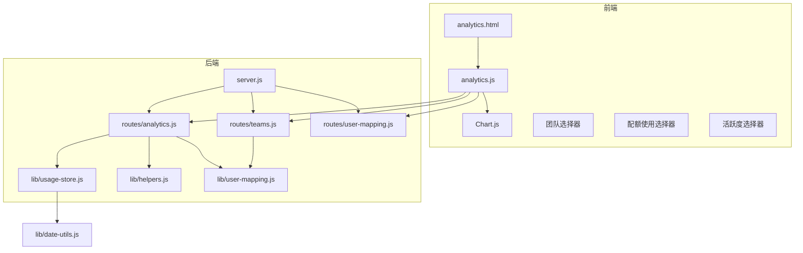
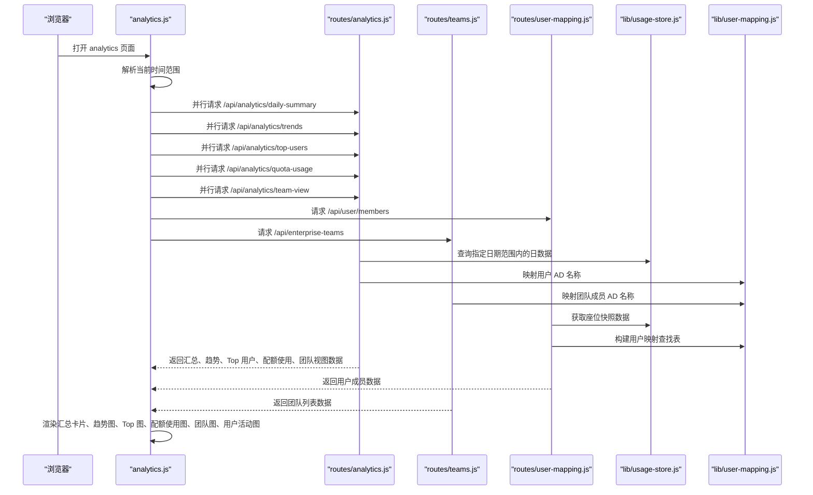
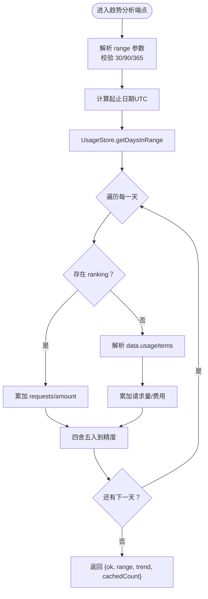
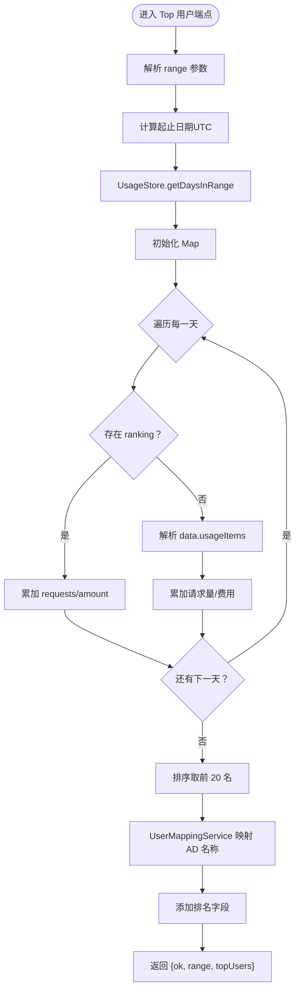
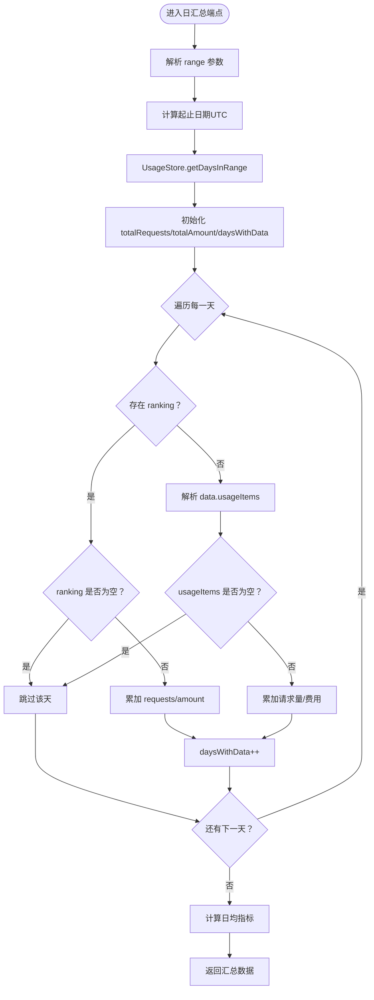
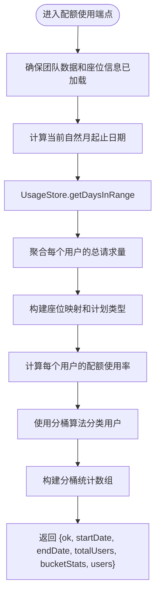
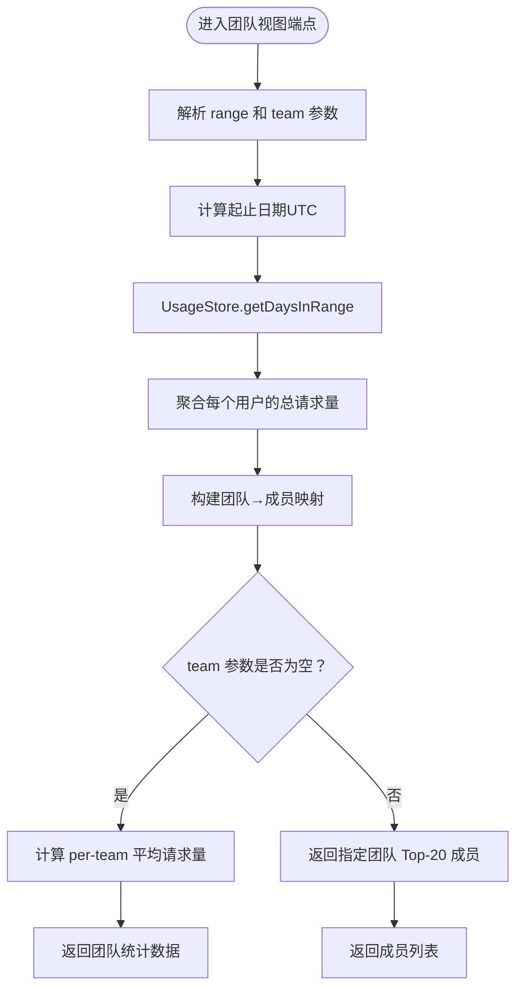
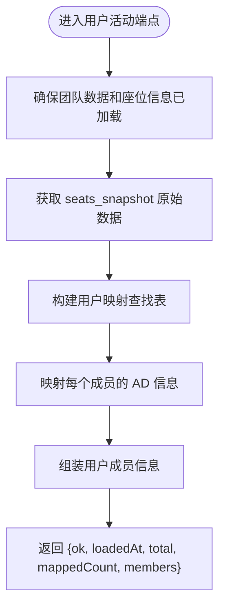
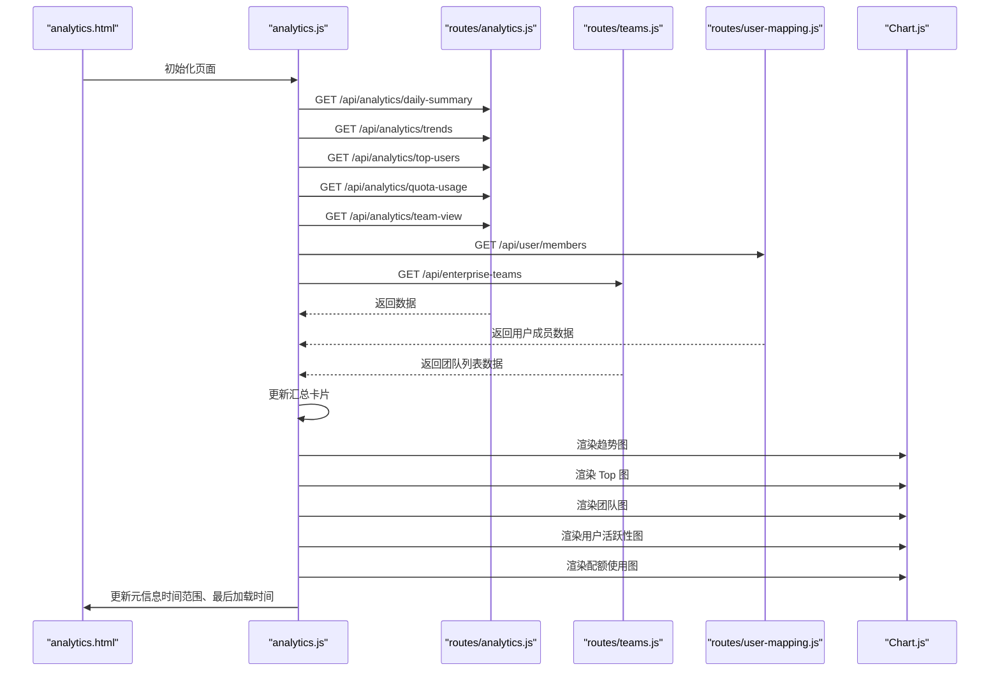
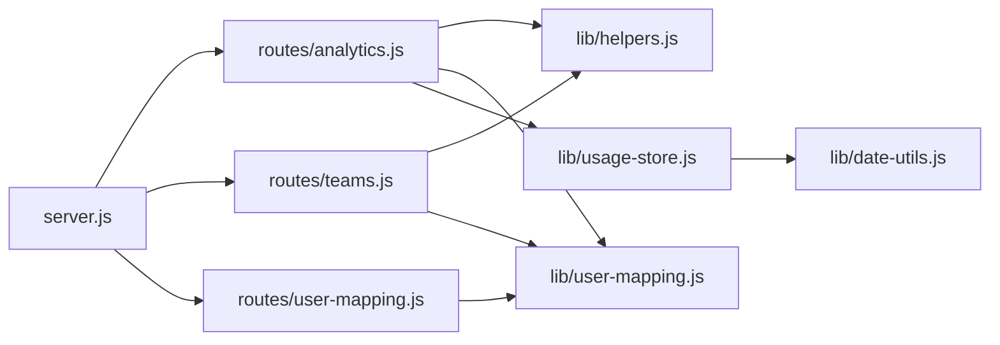

# 数据分析路由

<cite>
**本文引用的文件列表**
- [routes/analytics.js](file://routes/analytics.js)
- [routes/teams.js](file://routes/teams.js)
- [routes/user-mapping.js](file://routes/user-mapping.js)
- [public/analytics.html](file://public/analytics.html)
- [public/analytics.js](file://public/analytics.js)
- [lib/usage-store.js](file://lib/usage-store.js)
- [lib/date-utils.js](file://lib/date-utils.js)
- [lib/helpers.js](file://lib/helpers.js)
- [lib/user-mapping.js](file://lib/user-mapping.js)
- [server.js](file://server.js)
- [lib/scheduler.js](file://lib/scheduler.js)
- [package.json](file://package.json)
- [README.md](file://README.md)
</cite>

## 更新摘要
**变更内容**
- 新增配额使用分析功能，提供当前日历月的配额使用数据聚合
- 新增配额使用分桶算法，支持5个使用率区间分类
- 更新前端界面，增加配额使用标签页和配额使用图表
- 新增配额使用数据可视化，支持环形图和用户列表展示
- 扩展团队视图功能，支持按团队筛选配额使用数据

## 目录
1. [简介](#简介)
2. [项目结构](#项目结构)
3. [核心组件](#核心组件)
4. [架构概览](#架构概览)
5. [详细组件分析](#详细组件分析)
6. [依赖关系分析](#依赖关系分析)
7. [性能考虑](#性能考虑)
8. [故障排除指南](#故障排除指南)
9. [结论](#结论)
10. [附录](#附录)

## 简介
本文件详细说明数据分析路由的实现机制，涵盖趋势分析、统计图表生成、数据聚合等核心功能。系统通过 Express 路由提供五个主要端点：
- 获取趋势数据：按日聚合请求量和费用
- 获取 Top 用户：按用户维度统计请求量和费用
- 获取日汇总：计算总请求量、总费用及日均指标
- **新增** 获取配额使用：按当前自然月统计全量席位用户的配额使用率
- 获取团队视图：按团队维度统计平均请求量和成员活跃度
- 获取用户活动：按活跃度分类统计用户分布

同时，前端通过 Chart.js 将后端返回的数据渲染为趋势图、柱状图、饼图和环形图，并支持多时间粒度（30/90/365天）切换。新增的配额使用功能提供了更深入的资源使用监控能力，支持5个配额使用率区间分类。

## 项目结构
数据分析路由位于 routes/analytics.js，配合公共页面 public/analytics.html 和前端脚本 public/analytics.js 实现完整的数据展示流程。数据存储层由 lib/usage-store.js 提供，包含 SQLite 数据库和索引优化；辅助工具包括日期处理 lib/date-utils.js、通用帮助函数 lib/helpers.js 和用户映射服务 lib/user-mapping.js。新增的配额使用功能通过独立的路由端点提供专门的数据接口。

**图表来源**
- [server.js:88-98](file://server.js#L88-L98)
- [routes/analytics.js:7-297](file://routes/analytics.js#L7-L297)
- [routes/teams.js:36-117](file://routes/teams.js#L36-L117)
- [routes/user-mapping.js:104-123](file://routes/user-mapping.js#L104-L123)
- [lib/usage-store.js:10-79](file://lib/usage-store.js#L10-L79)
- [lib/helpers.js:1-185](file://lib/helpers.js#L1-L185)
- [lib/date-utils.js:1-46](file://lib/date-utils.js#L1-L46)
- [lib/user-mapping.js:7-22](file://lib/user-mapping.js#L7-L22)

**章节来源**
- [server.js:88-98](file://server.js#L88-L98)
- [routes/analytics.js:7-297](file://routes/analytics.js#L7-L297)
- [public/analytics.html:1-102](file://public/analytics.html#L1-L102)
- [public/analytics.js:1-651](file://public/analytics.js#L1-L651)

## 核心组件
- 趋势分析端点：/api/analytics/trends
  - 功能：按日返回请求量和费用的时间序列
  - 时间范围：支持 30、90、365 天，默认 30 天
  - 数据来源：UsageStore.getDaysInRange 返回的每日记录
  - 聚合逻辑：优先使用 ranking 字段（若存在），否则解析 data.usageItems 计算
  - 输出格式：包含日期、请求量、费用的对象数组

- Top 用户端点：/api/analytics/top-users
  - 功能：按用户统计请求量和费用，取前 20 名
  - 聚合逻辑：Map 按用户累加请求量和费用，再排序取前 20
  - 用户映射：通过 UserMappingService 将 GitHub 用户名映射到 AD 名称
  - 输出格式：包含排名、用户名、AD 名称、请求量、费用的数组

- 日汇总端点：/api/analytics/daily-summary
  - 功能：计算总请求量、总费用、日均请求量、日均费用
  - 统计口径：仅统计包含有效数据的天数（ranking 非空或 usageItems 非空）
  - 输出格式：包含总请求量、总费用、日均指标、有数据天数和总天数

- **新增** 配额使用端点：/api/analytics/quota-usage
  - 功能：按当前自然月统计全量席位用户的配额使用率
  - 时间范围：自动计算当月起止日期
  - 数据来源：结合 daily_usage 缓存和 seats_snapshot 座位信息
  - 聚合逻辑：计算每个用户的请求总量，结合席位计划类型计算使用率
  - 分桶算法：5个使用率区间分类（<5%、5-50%、50-100%、100-200%、>200%）
  - 输出格式：包含开始日期、结束日期、用户总数、分桶统计和用户列表

- 团队视图端点：/api/analytics/team-view
  - 功能：支持两种模式
    - 全部模式：按团队统计平均请求量（per-team avg requests）
    - 明细模式：按团队返回 Top-20 成员（Top-20 members）
  - 查询参数：range（30/90/365，默认 30）、team（可选，团队名称）
  - 数据来源：结合 daily_usage 缓存和 seats_snapshot 团队信息
  - 输出格式：根据模式返回团队统计数据或成员列表

- 用户活动端点：/api/user/members
  - 功能：获取所有用户成员信息，包含活跃度、团队、AD 映射等
  - 数据来源：teamCache.seatsRaw 和 userMappingService
  - 输出格式：包含用户登录名、团队、AD 名称、最后活跃时间等信息

**章节来源**
- [routes/analytics.js:12-44](file://routes/analytics.js#L12-L44)
- [routes/analytics.js:46-94](file://routes/analytics.js#L46-L94)
- [routes/analytics.js:258-293](file://routes/analytics.js#L258-L293)
- [routes/analytics.js:96-179](file://routes/analytics.js#L96-L179)
- [routes/analytics.js:188-256](file://routes/analytics.js#L188-L256)
- [routes/user-mapping.js:104-123](file://routes/user-mapping.js#L104-L123)

## 架构概览
后端通过 server.js 挂载 analytics、teams 和 user-mapping 路由模块，路由模块依赖 UsageStore 进行数据库查询，使用 helpers.js 中的工具函数进行数值转换和错误处理，使用 user-mapping.js 进行用户名称映射。前端 analytics.html 提供页面结构，analytics.js 负责发起并行请求、渲染图表和状态管理。新增的配额使用功能通过独立的路由端点提供专门的数据接口，并与现有的团队视图和用户活动功能协同工作。

**图表来源**
- [public/analytics.js:603-615](file://public/analytics.js#L603-L615)
- [routes/analytics.js:96-179](file://routes/analytics.js#L96-L179)
- [routes/teams.js:36-117](file://routes/teams.js#L36-L117)
- [routes/user-mapping.js:104-123](file://routes/user-mapping.js#L104-L123)
- [lib/usage-store.js:162-164](file://lib/usage-store.js#L162-L164)
- [lib/user-mapping.js:118-122](file://lib/user-mapping.js#L118-L122)

**章节来源**
- [server.js:88-98](file://server.js#L88-L98)
- [public/analytics.js:603-615](file://public/analytics.js#L603-L615)
- [routes/analytics.js:96-179](file://routes/analytics.js#L96-L179)

## 详细组件分析

### 趋势分析组件
- 输入参数
  - range：时间范围（30、90、365），默认 30
- 处理流程
  - 计算起止日期（UTC）
  - 从 UsageStore 查询指定范围内的日数据
  - 对每一天：
    - 若存在 ranking：累加 requests 和 amount
    - 否则：解析 data.usageItems，累加 netQuantity/grossQuantity/quantity/requests 作为请求量，netAmount/grossAmount/amount 作为费用
  - 四舍五入保留精度（请求量保留两位小数，费用保留四位小数）
- 输出结构
  - ok：布尔值
  - range：输入的时间范围
  - trend：对象数组，包含 date、requests、amount
  - cachedCount：返回的天数计数

**图表来源**
- [routes/analytics.js:12-44](file://routes/analytics.js#L12-L44)
- [lib/helpers.js:5-12](file://lib/helpers.js#L5-L12)

**章节来源**
- [routes/analytics.js:12-44](file://routes/analytics.js#L12-L44)
- [lib/helpers.js:5-12](file://lib/helpers.js#L5-L12)

### Top 用户组件
- 输入参数
  - range：时间范围（30、90、365），默认 30
- 处理流程
  - 计算起止日期（UTC）
  - 查询日数据，构建 Map 按用户累加请求量和费用
  - 排序取前 20 名，映射用户 AD 名称
  - 添加排名字段
- 输出结构
  - ok：布尔值
  - range：输入的时间范围
  - topUsers：对象数组，包含 rank、user、adName、requests、amount

**图表来源**
- [routes/analytics.js:46-94](file://routes/analytics.js#L46-L94)
- [lib/user-mapping.js:118-122](file://lib/user-mapping.js#L118-L122)

**章节来源**
- [routes/analytics.js:46-94](file://routes/analytics.js#L46-L94)
- [lib/user-mapping.js:118-122](file://lib/user-mapping.js#L118-L122)

### 日汇总组件
- 输入参数
  - range：时间范围（30、90、365），默认 30
- 处理流程
  - 计算起止日期（UTC）
  - 查询日数据，仅统计包含有效数据的天数（ranking 非空或 usageItems 非空）
  - 累加总请求量和总费用
  - 计算日均请求量和日均费用（基于有数据天数）
- 输出结构
  - ok：布尔值
  - range：输入的时间范围
  - totalRequests：总请求量
  - totalAmount：总费用
  - avgDailyRequests：日均请求量
  - avgDailyAmount：日均费用
  - daysWithData：有数据天数
  - totalDaysInRange：总天数

**图表来源**
- [routes/analytics.js:258-293](file://routes/analytics.js#L258-L293)

**章节来源**
- [routes/analytics.js:258-293](file://routes/analytics.js#L258-L293)

### **新增** 配额使用组件
- 输入参数
  - 无查询参数
- 处理流程
  - 确保团队数据和座位信息已加载
  - 计算当前自然月的起止日期（UTC）
  - 从 daily_usage 缓存聚合每个用户的总请求量
  - 从 seats_snapshot 获取团队成员映射和计划类型
  - 计算每个用户的配额使用率：usagePercent = (requests / quota) × 100
  - 使用分桶算法将用户分为5个使用率区间
  - 输出用户列表和分桶统计
- 分桶算法
  - 配额使用小于 5%
  - 配额使用 大于 5% 小于 50%
  - 配额使用 大于 50% 小于 100%
  - 配额使用 大于 100% 小于 200%
  - 配额使用 大于 200%
- 输出结构
  - ok：布尔值
  - startDate：统计开始日期
  - endDate：统计结束日期
  - totalUsers：用户总数
  - bucketStats：分桶统计数组，包含名称、数量和用户列表
  - users：用户数组，包含登录名、AD 名称、团队、计划类型、请求量、配额、使用率

**图表来源**
- [routes/analytics.js:96-179](file://routes/analytics.js#L96-L179)
- [lib/helpers.js:148-185](file://lib/helpers.js#L148-L185)

**章节来源**
- [routes/analytics.js:96-179](file://routes/analytics.js#L96-L179)
- [lib/helpers.js:148-185](file://lib/helpers.js#L148-L185)

### 团队视图组件
- 输入参数
  - range：时间范围（30、90、365），默认 30
  - team：团队名称（可选），为空时返回 per-team 平均请求量
- 处理流程
  - 计算起止日期（UTC）
  - 从 daily_usage 缓存聚合每个用户的总请求量
  - 从 seats_snapshot 获取团队成员映射
  - 两种模式：
    - 全部模式：按团队统计总请求量和平均请求量
    - 明细模式：返回指定团队的 Top-20 成员
- 输出结构
  - 全部模式：{ ok, range, mode: "teams", teamStats: [{ team, members, totalRequests, avgRequests }] }
  - 明细模式：{ ok, range, mode: "members", team, teamMembers: [{ rank, user, requests }] }

**图表来源**
- [routes/analytics.js:188-256](file://routes/analytics.js#L188-L256)

**章节来源**
- [routes/analytics.js:188-256](file://routes/analytics.js#L188-L256)

### 用户活动组件
- 输入参数
  - 无查询参数
- 处理流程
  - 确保团队数据和座位信息已加载
  - 从 teamCache.seatsRaw 获取座位快照
  - 使用 userMappingService 构建用户映射查找表
  - 组装用户成员信息：登录名、团队、AD 名称、邮件、计划类型、最后活跃时间
- 输出结构
  - ok：布尔值
  - loadedAt：数据加载时间
  - total：总成员数
  - mappedCount：已映射成员数
  - members：用户成员数组

**图表来源**
- [routes/user-mapping.js:104-123](file://routes/user-mapping.js#L104-L123)

**章节来源**
- [routes/user-mapping.js:104-123](file://routes/user-mapping.js#L104-L123)

### 前端集成与数据可视化
- 页面结构：analytics.html 提供查询标签页（30/90/365天）、刷新按钮、汇总卡片容器、趋势图、Top 用户图、团队视图图、用户活跃性图和**新增**配额使用图容器
- 数据获取：analytics.js 并行请求四个后端端点，更新页面状态和元信息
- 图表渲染：
  - 趋势图：双轴线图，左侧为请求量，右侧为费用（USD）
  - Top 图：水平柱状图，显示前 20 用户的请求量
  - 团队图：水平柱状图，显示团队平均请求量或团队成员请求量
  - 用户活跃性图：环形图，显示用户活跃度分类分布
  - **新增** 配额使用图：环形图，显示5个配额使用率区间的用户分布
- 用户体验：支持自动刷新、数据新鲜度提示、错误处理、团队筛选和用户列表展开

**图表来源**
- [public/analytics.html:35-41](file://public/analytics.html#L35-L41)
- [public/analytics.js:603-615](file://public/analytics.js#L603-L615)
- [public/analytics.js:485-565](file://public/analytics.js#L485-L565)
- [public/analytics.js:567-584](file://public/analytics.js#L567-L584)

**章节来源**
- [public/analytics.html:35-41](file://public/analytics.html#L35-L41)
- [public/analytics.js:603-615](file://public/analytics.js#L603-L615)
- [public/analytics.js:485-565](file://public/analytics.js#L485-L565)
- [public/analytics.js:567-584](file://public/analytics.js#L567-L584)

## 依赖关系分析
- 路由依赖
  - routes/analytics.js 依赖：
    - lib/helpers.js：数值转换、用户提取、错误处理、配额使用分桶算法
    - lib/user-mapping.js：用户名称映射
    - lib/usage-store.js：数据库查询（按日期范围获取日数据）
  - routes/teams.js 依赖：
    - lib/github-api.js：GitHub API 调用
    - lib/helpers.js：端点构建、错误处理
    - lib/user-mapping.js：用户映射
  - routes/user-mapping.js 依赖：
    - lib/user-mapping.js：用户映射服务
    - lib/usage-store.js：座位数据获取
- 数据库设计
  - daily_usage 表包含 date、year、month、day、data、mode、raw_count、source、fetched_at、ranking 等字段
  - seats_snapshot 表包含 id、data、fetched_at、total 等字段
  - 索引：idx_daily_usage_date、idx_seats_snapshot_fetched、idx_etag_cache_fetched
- 服务器挂载
  - server.js 在启动时挂载 analytics、teams 和 user-mapping 路由模块

**图表来源**
- [routes/analytics.js:5-6](file://routes/analytics.js#L5-L6)
- [server.js:95-98](file://server.js#L95-L98)
- [lib/usage-store.js:10-79](file://lib/usage-store.js#L10-L79)

**章节来源**
- [routes/analytics.js:5-6](file://routes/analytics.js#L5-L6)
- [server.js:95-98](file://server.js#L95-L98)
- [lib/usage-store.js:10-79](file://lib/usage-store.js#L10-L79)

## 性能考虑
- 数据库查询优化
  - 使用按日期范围的查询语句，配合索引 idx_daily_usage_date
  - getDaysInRange 返回有序结果，避免额外排序
  - 团队视图使用 Map 数据结构进行高效聚合
  - **新增** 配额使用功能通过分桶算法减少重复计算
- 内存与缓存
  - 通过 helpers.js 的 toNumber 函数统一数值转换，减少无效计算
  - 前端通过 Promise.all 并行请求四个端点，降低总等待时间
  - 用户映射查找表缓存，避免重复映射操作
  - **新增** 配额使用数据的团队筛选缓存
- 精度控制
  - 请求量保留两位小数，费用保留四位小数，避免浮点误差累积
  - **新增** 配额使用率保留两位小数，确保显示精度
- 自动刷新与新鲜度
  - 前端定时器每 30 秒更新数据新鲜度徽章
  - 后端通过 lib/scheduler.js 定期刷新最近几天数据，确保趋势图数据及时性

**章节来源**
- [lib/usage-store.js:90-92](file://lib/usage-store.js#L90-L92)
- [public/analytics.js:631-646](file://public/analytics.js#L631-L646)
- [lib/scheduler.js:54-157](file://lib/scheduler.js#L54-L157)

## 故障排除指南
- 常见错误与处理
  - range 参数非法：返回 400 错误，提示 range 必须为 30、90 或 365
  - GitHub API 速率限制：writeError 会将 rateLimit 信息写入响应体
  - 数据库异常：捕获异常并返回统一的错误响应
  - **新增** 配额使用数据缺失：检查 teamCache 是否正确加载座位信息
- 前端错误处理
  - analytics.js 中 setError 用于显示错误信息
  - 刷新按钮禁用/启用状态管理，防止重复请求
  - 团队选择器和用户活跃度选择器的错误处理
  - **新增** 配额使用图表的错误处理和用户列表展开
- 调试建议
  - 检查 UsageStore 是否正确连接数据库
  - 确认用户映射文件 user_mapping.json 格式正确
  - 查看服务器日志以定位具体错误
  - 验证 GitHub API 访问权限和企业模式配置
  - **新增** 检查配额使用分桶算法的边界条件

**章节来源**
- [routes/analytics.js:15](file://routes/analytics.js#L15)
- [lib/helpers.js:30-36](file://lib/helpers.js#L30-L36)
- [public/analytics.js:32-36](file://public/analytics.js#L32-L36)
- [public/analytics.js:547-560](file://public/analytics.js#L547-L560)

## 结论
数据分析路由提供了完整的时间序列分析能力，包括趋势分析、Top 用户统计、日汇总指标、新增的配额使用分析和团队视图与用户活动分析。通过 SQLite 数据库的高效查询、前端并行请求和 Chart.js 可视化，系统能够快速呈现关键业务指标。新增的配额使用功能提供了更深入的资源使用监控能力，支持5个配额使用率区间分类，帮助管理员及时发现资源使用异常。当前实现未包含数据导出功能，但具备良好的扩展基础，可在现有路由基础上增加导出端点。

## 附录

### API 端点定义
- GET /api/analytics/trends
  - 查询参数：range（30/90/365，默认 30）
  - 响应：{ ok: boolean, range: number, trend: Array<{ date: string, requests: number, amount: number }>, cachedCount: number }

- GET /api/analytics/top-users
  - 查询参数：range（30/90/365，默认 30）
  - 响应：{ ok: boolean, range: number, topUsers: Array<{ rank: number, user: string, adName: string|null, requests: number, amount: number }> }

- GET /api/analytics/daily-summary
  - 查询参数：range（30/90/365，默认 30）
  - 响应：{ ok: boolean, range: number, totalRequests: number, totalAmount: number, avgDailyRequests: number, avgDailyAmount: number, daysWithData: number, totalDaysInRange: number }

- **新增** GET /api/analytics/quota-usage
  - 查询参数：无
  - 响应：{ ok: boolean, startDate: string, endDate: string, totalUsers: number, bucketStats: Array<{ name: string, count: number, users: Array }> }

- GET /api/analytics/team-view
  - 查询参数：range（30/90/365，默认 30）、team（可选，团队名称）
  - 响应（全部模式）：{ ok: boolean, range: number, mode: "teams", teamStats: Array<{ team: string, members: number, totalRequests: number, avgRequests: number }> }
  - 响应（明细模式）：{ ok: boolean, range: number, mode: "members", team: string, teamMembers: Array<{ rank: number, user: string, requests: number }> }

- GET /api/user/members
  - 查询参数：无
  - 响应：{ ok: boolean, loadedAt: string, total: number, mappedCount: number, members: Array<{ login: string, team: string, adName: string|null, adMail: string|null, planType: string, lastActivityAt: string|null }> }

**章节来源**
- [routes/analytics.js:12-293](file://routes/analytics.js#L12-L293)
- [routes/user-mapping.js:104-123](file://routes/user-mapping.js#L104-L123)

### 数据导出与 Excel 转换
- 当前实现未提供直接的导出端点
- 项目依赖 exceljs（版本 ^3.4.0），可用于后续扩展导出功能
- 建议在现有路由中新增导出端点，将趋势数据、Top 用户、日汇总数据、配额使用数据、团队视图数据转换为 Excel 格式

**章节来源**
- [package.json:15](file://package.json#L15)

### 时间序列与聚合策略
- 日级别聚合：按日期字符串分组，累加请求量和费用
- 用户级别聚合：按用户分组，累加请求量和费用，取前 20 名
- **新增** 配额使用聚合：按用户分组，计算配额使用率并进行区间分类
- 团队级别聚合：按团队分组，计算平均请求量和成员活跃度
- 移动平均：当前实现未包含移动平均计算，可在趋势端点返回的数组上增加 MA 计算逻辑
- 月级别统计：可通过日期工具函数构建 YYYY-MM 键进行月度聚合（需扩展）

**章节来源**
- [lib/date-utils.js:38-43](file://lib/date-utils.js#L38-L43)
- [routes/analytics.js:25-44](file://routes/analytics.js#L25-L44)
- [routes/analytics.js:106-131](file://routes/analytics.js#L106-L131)

### **新增** 配额使用分桶算法
系统实现了基于配额使用率的用户分桶分类，支持5个使用率区间：
- 配额使用小于 5%：使用率低于5%的用户
- 配额使用 大于 5% 小于 50%：使用率在5%-50%之间的用户
- 配额使用 大于 50% 小于 100%：使用率在50%-100%之间的用户
- 配额使用 大于 100% 小于 200%：使用率在100%-200%之间的用户
- 配额使用 大于 200%：使用率超过200%的用户

分桶算法使用数值比较确定区间，确保边界值的正确分类。每个用户根据其配额使用率精确分配到相应的区间中，支持管理员进行资源使用情况的快速评估和预警。

**章节来源**
- [lib/helpers.js:148-185](file://lib/helpers.js#L148-L185)
- [public/analytics.js:486-502](file://public/analytics.js#L486-L502)
- [public/analytics.js:504-511](file://public/analytics.js#L504-L511)