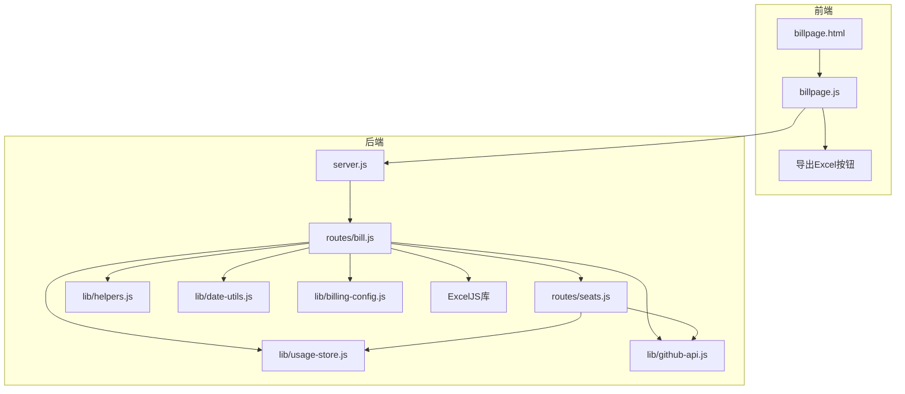
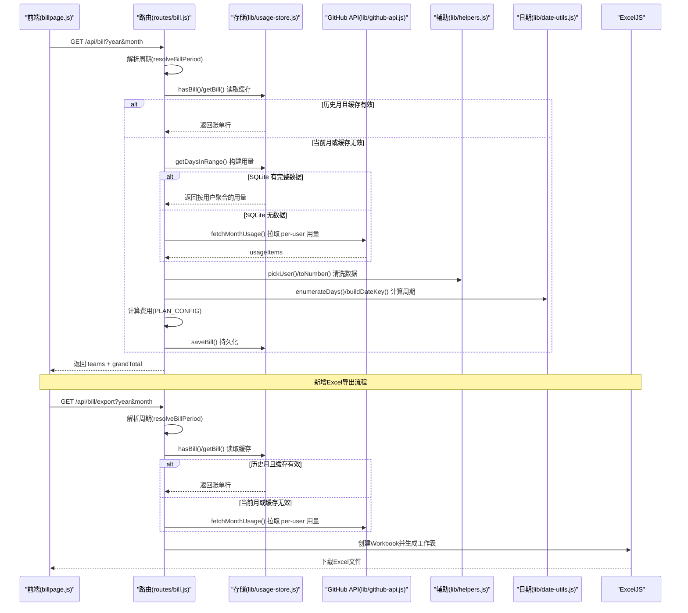
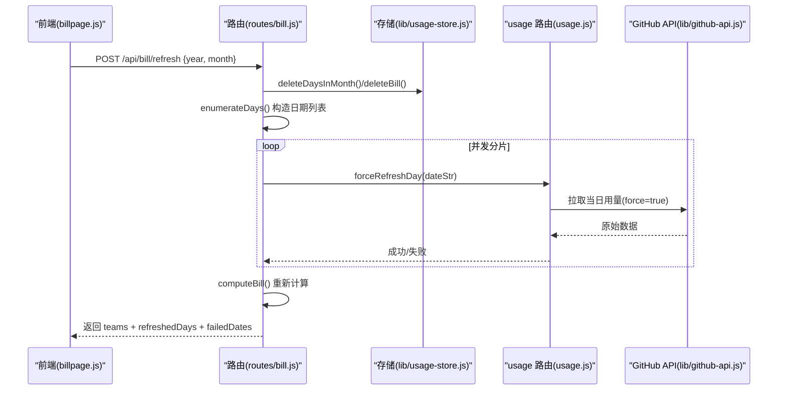
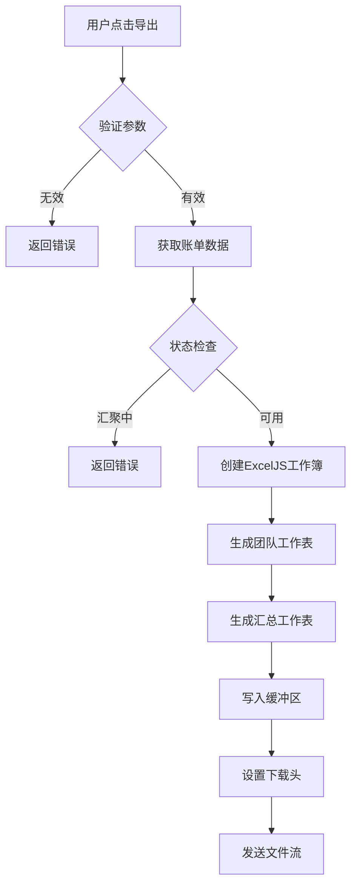
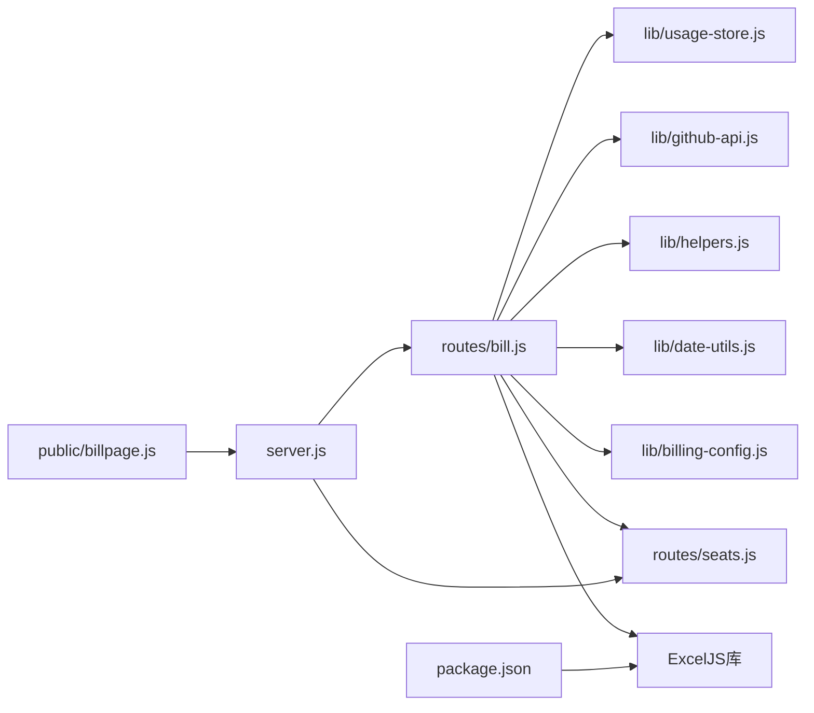

# 月度账单路由

<cite>
**本文引用的文件**
- [routes/bill.js](file://routes/bill.js)
- [lib/usage-store.js](file://lib/usage-store.js)
- [lib/github-api.js](file://lib/github-api.js)
- [lib/helpers.js](file://lib/helpers.js)
- [lib/billing-config.js](file://lib/billing-config.js)
- [lib/date-utils.js](file://lib/date-utils.js)
- [routes/seats.js](file://routes/seats.js)
- [public/billpage.html](file://public/billpage.html)
- [public/billpage.js](file://public/billpage.js)
- [server.js](file://server.js)
- [package.json](file://package.json)
- [test/bill.test.js](file://test/bill.test.js)
</cite>

## 更新摘要
**变更内容**
- 新增Excel导出功能，支持按团队生成报告和汇总表
- 使用ExcelJS实现流式导出，包含多工作表结构
- 前端新增导出按钮和交互逻辑
- 添加Excel文件下载和格式化处理

## 目录
1. [简介](#简介)
2. [项目结构](#项目结构)
3. [核心组件](#核心组件)
4. [架构概览](#架构概览)
5. [详细组件分析](#详细组件分析)
6. [Excel导出功能](#excel导出功能)
7. [依赖关系分析](#依赖关系分析)
8. [性能考量](#性能考量)
9. [故障排查指南](#故障排查指南)
10. [结论](#结论)
11. [附录](#附录)

## 简介
本文件聚焦于"月度账单路由"的实现与使用，系统性阐述以下内容：
- 月度账单的生成逻辑、数据聚合与报表展示机制
- 账单数据来源、计算精度与格式化处理
- 强制刷新功能、数据完整性检查与异常处理
- **新增** Excel导出功能与流式下载机制
- 月度账单 API 的端点设计、查询参数与响应格式
- 与用量存储的集成方式与数据一致性保障

## 项目结构
围绕月度账单的核心文件与职责如下：
- 路由层：routes/bill.js 提供账单查询、强制刷新和Excel导出 API，并负责账单计算与缓存交互
- 数据层：lib/usage-store.js 提供 SQLite 存储、ETag 缓存与账单持久化
- API 层：lib/github-api.js 提供 GitHub API 并发控制、重试与条件请求
- 辅助层：lib/helpers.js、lib/date-utils.js、lib/billing-config.js 提供通用工具与计费配置
- 前端：public/billpage.html 与 public/billpage.js 提供账单页面、交互和Excel导出功能
- 入口：server.js 挂载路由、注入依赖并启动服务

**图表来源**
- [server.js:88-99](file://server.js#L88-L99)
- [routes/bill.js:13-615](file://routes/bill.js#L13-L615)
- [routes/seats.js:37-78](file://routes/seats.js#L37-L78)
- [lib/usage-store.js:10-324](file://lib/usage-store.js#L10-L324)
- [lib/github-api.js:1-320](file://lib/github-api.js#L1-L320)
- [lib/helpers.js:1-83](file://lib/helpers.js#L1-L83)
- [lib/date-utils.js:1-46](file://lib/date-utils.js#L1-L46)
- [lib/billing-config.js:1-25](file://lib/billing-config.js#L1-L25)
- [public/billpage.html:1-68](file://public/billpage.html#L1-L68)
- [public/billpage.js:288-299](file://public/billpage.js#L288-L299)

**章节来源**
- [server.js:88-99](file://server.js#L88-L99)
- [routes/bill.js:13-615](file://routes/bill.js#L13-L615)

## 核心组件
- 路由模块 routes/bill.js
  - 提供 GET /api/bill 查询月度账单
  - 提供 POST /api/bill/refresh 强制刷新整月账单
  - **新增** 提供 GET /api/bill/export Excel导出功能
  - 负责账单周期判定、缓存命中、数据聚合与团队维度汇总
- 数据存储 lib/usage-store.js
  - daily_usage 表：每日原始用量与 per-user 排名
  - monthly_bill 表：月度账单结果（按年月键）
  - etag_cache 表：GitHub API ETag 条件请求缓存
  - seats_snapshot 表：Copilot 席位快照
- API 层 lib/github-api.js
  - 并发队列、重试退避、ETag 条件请求、单飞去重
  - 为账单查询提供 per-user premium request 用量
- 辅助模块
  - lib/helpers.js：构建查询参数、端点路径、数值转换、错误写回
  - lib/date-utils.js：日期枚举、日期键构建
  - lib/billing-config.js：计划配置与费用计算

**章节来源**
- [routes/bill.js:13-615](file://routes/bill.js#L13-L615)
- [lib/usage-store.js:10-324](file://lib/usage-store.js#L10-L324)
- [lib/github-api.js:1-320](file://lib/github-api.js#L1-L320)
- [lib/helpers.js:1-83](file://lib/helpers.js#L1-L83)
- [lib/date-utils.js:1-46](file://lib/date-utils.js#L1-L46)
- [lib/billing-config.js:1-25](file://lib/billing-config.js#L1-L25)

## 架构概览
月度账单的端到端流程如下：
- 前端发起查询、强制刷新或Excel导出请求
- 后端解析账单周期，优先读取 SQLite 缓存
- 若缓存缺失或不完整，则回源 GitHub API 拉取 per-user 用量
- 与席位数据合并，按计划配置计算费用
- **新增** Excel导出：使用ExcelJS生成多工作表报表
- 持久化月度账单，返回团队维度汇总与总计

**图表来源**
- [routes/bill.js:237-313](file://routes/bill.js#L237-L313)
- [routes/bill.js:134-198](file://routes/bill.js#L134-L198)
- [routes/bill.js:67-85](file://routes/bill.js#L67-L85)
- [routes/bill.js:479-607](file://routes/bill.js#L479-L607)
- [lib/usage-store.js:282-320](file://lib/usage-store.js#L282-L320)
- [lib/github-api.js:231-269](file://lib/github-api.js#L231-L269)
- [lib/helpers.js:14-28](file://lib/helpers.js#L14-L28)
- [lib/date-utils.js:19-33](file://lib/date-utils.js#L19-L33)

## 详细组件分析

### 1) 账单周期与状态判定
- resolveBillPeriod(year, month)
  - 当前月且日期在前两日：返回"汇聚中"状态，禁止查询
  - 当前月：返回"部分"状态，截止昨日
  - 历史月：返回"完整"状态，覆盖整月
- 作用：避免月初数据不完整导致的错误账单

**章节来源**
- [routes/bill.js:29-102](file://routes/bill.js#L29-L102)

### 2) 用量数据来源与聚合
- buildUsageFromSQLite(startStr, endStr)
  - 从 daily_usage 表读取指定日期范围
  - 若存在 ranking 字段则优先累加 per-user 排名；否则回退到原始 data.usageItems
  - 计算每个用户的总请求量
- fetchMonthUsage(year, month)
  - 通过 GitHub API 拉取整月 per-user premium request 用量
  - 使用 helpers.pickUser()/toNumber() 清洗与归一化
- 作用：优先使用 SQLite 缓存，必要时回源 GitHub API

**章节来源**
- [routes/bill.js:192-229](file://routes/bill.js#L192-L229)
- [routes/bill.js:108-122](file://routes/bill.js#L108-L122)
- [lib/helpers.js:14-28](file://lib/helpers.js#L14-L28)

### 3) 账单计算与持久化
- computeBill(year, month, period)
  - 依赖 ensureSeatsData() 获取席位数据（含团队归属与计划类型）
  - 对每个席位：计算 requests、quota、overageRequests、overageCost、totalCost
  - 使用 billing-config.PLAN_CONFIG 与 calcAmount() 进行费用计算
  - 保存到 monthly_bill 表，键为 yearMonth
- groupByTeam(billRows)
  - 将账单行按团队聚合，计算团队维度的 seatCost、overageCost、totalCost 与成员数
  - 返回 teams 数组与 grandTotal

**章节来源**
- [routes/bill.js:235-301](file://routes/bill.js#L235-L301)
- [routes/bill.js:13-48](file://routes/bill.js#L13-L48)
- [lib/billing-config.js:11-22](file://lib/billing-config.js#L11-L22)
- [routes/seats.js:37-78](file://routes/seats.js#L37-L78)

### 4) 缓存策略与一致性
- hasBill()/getBill() 用于历史月缓存读取
- getDaysInRange() 与 getMissingDays()/getFreshDays() 用于完整性检查
- deleteDaysInMonth()/deleteBill() 用于强制刷新时的缓存清理
- ETag 条件请求与 LRU 缓存减少不必要的 API 调用

**章节来源**
- [lib/usage-store.js:282-320](file://lib/usage-store.js#L282-L320)
- [lib/usage-store.js:162-193](file://lib/usage-store.js#L162-L193)
- [lib/usage-store.js:205-207](file://lib/usage-store.js#L205-L207)
- [lib/github-api.js:67-74](file://lib/github-api.js#L67-L74)

### 5) 强制刷新流程
- POST /api/bill/refresh
  - 清理该月 daily_usage 与 monthly_bill
  - 枚举账单周期内的每一天，受并发限制逐日回源 GitHub API
  - 重新计算并返回 refreshedDays 与 failedDates

**图表来源**
- [routes/bill.js:392-475](file://routes/bill.js#L392-L475)
- [lib/usage-store.js:205-207](file://lib/usage-store.js#L205-L207)
- [lib/date-utils.js:19-33](file://lib/date-utils.js#L19-L33)

### 6) 前端展示与交互
- billpage.html 提供查询输入、筛选与表格容器
- billpage.js
  - 查询：GET /api/bill?year&month
  - 强制刷新：POST /api/bill/refresh
  - **新增** Excel导出：GET /api/bill/export?year&month
  - 渲染：按团队展开/折叠、筛选、合计行
  - 格式化：美元金额、百分比、状态横幅

**章节来源**
- [public/billpage.html:1-68](file://public/billpage.html#L1-L68)
- [public/billpage.js:288-299](file://public/billpage.js#L288-L299)

## Excel导出功能

### 1) 导出API设计
- GET /api/bill/export
  - 查询参数
    - year: 数字，年份
    - month: 数字，1-12
  - 响应：Excel文件流（application/vnd.openxmlformats-officedocument.spreadsheetml.sheet）
  - 文件名：copilot-bill-{year-month}.xlsx

### 2) 导出数据结构
- **按团队工作表**：每个团队一个工作表，标题为TEAM名称
- **汇总工作表**："Total"工作表包含所有团队的汇总信息
- **列定义**：
  - 用户名、TEAM名、用量信息、套餐外附加费(USD)、总费用

### 3) 导出流程
- 验证账单周期状态（禁止在汇聚期导出）
- 获取账单数据（与查询接口相同的逻辑）
- 使用ExcelJS创建工作簿
- 生成多工作表结构
- 写入缓冲区并发送下载

**图表来源**
- [routes/bill.js:479-607](file://routes/bill.js#L479-L607)

### 4) 前端导出交互
- 新增导出按钮（disabled状态）
- 点击后验证月份选择
- 跳转到导出API获取Excel文件
- 自动下载并保存为.xlsx格式

**章节来源**
- [routes/bill.js:479-607](file://routes/bill.js#L479-L607)
- [public/billpage.html:26](file://public/billpage.html#L26)
- [public/billpage.js:288-299](file://public/billpage.js#L288-L299)

## 依赖关系分析
- 路由依赖
  - routes/bill.js 依赖 usage-store、github-api、helpers、date-utils、billing-config、seats
  - 通过 server.js 注入 usageRouter（提供 forceRefreshDay）以支持强制刷新
  - **新增** 依赖 ExcelJS 库进行Excel文件生成
- 存储依赖
  - SQLite better-sqlite3，WAL + NORMAL 模式提升并发与可靠性
  - 预编译语句减少 SQL 解析开销
- 前端依赖
  - package.json 中包含 exceljs（用于导出）、multer（文件上传）、lru-cache（缓存）

**图表来源**
- [routes/bill.js:13-615](file://routes/bill.js#L13-L615)
- [server.js:88-99](file://server.js#L88-L99)
- [package.json:12-21](file://package.json#L12-L21)

**章节来源**
- [routes/bill.js:13-615](file://routes/bill.js#L13-L615)
- [server.js:88-99](file://server.js#L88-L99)
- [package.json:12-21](file://package.json#L12-L21)

## 性能考量
- 并发控制
  - GitHub API 并发上限由环境变量控制，避免触发二级限流
- 缓存策略
  - 三层缓存：内存 LRU + SQLite 持久缓存 + ETag 条件请求
  - 月度账单结果持久化，历史查询 O(1) 命中
- 计算精度
  - 费用计算使用定点运算，避免浮点误差累积
- **新增** Excel导出性能
  - 使用ExcelJS流式写入，避免大文件内存占用
  - 多工作表并行生成，提升导出效率
- 前端渲染
  - 分页与骨架屏优化长表渲染体验

## 故障排查指南
- 常见错误与处理
  - 无效年月：路由对 year/month 进行范围校验，非法参数抛出错误
  - 汇聚中状态：月初前两日返回"汇聚中"，前端显示提示横幅
  - 缓存空数据：若 SQLite 无数据或全 0，路由会清理"空月"缓存并回源 GitHub
  - 强制刷新失败：记录失败日期列表，前端展示失败详情
  - **新增** Excel导出失败：检查ExcelJS依赖、网络连接和权限
- 日志与可观测性
  - server.js 中间件记录访问日志与动作映射
  - GitHub API 层记录重试、ETag 条件请求与速率限制
- 建议排查步骤
  - 确认环境变量（GITHUB_TOKEN、ENTERPRISE_SLUG 等）
  - 检查 SQLite 表是否存在与数据是否完整
  - 使用强制刷新接口验证回源 GitHub API 是否正常
  - 查看前端错误横幅与后端日志定位问题
  - **新增** 验证ExcelJS库版本兼容性和磁盘空间

**章节来源**
- [routes/bill.js:243-244](file://routes/bill.js#L243-L244)
- [routes/bill.js:250-260](file://routes/bill.js#L250-L260)
- [routes/bill.js:274-279](file://routes/bill.js#L274-L279)
- [routes/bill.js:332-340](file://routes/bill.js#L332-L340)
- [routes/bill.js:493-495](file://routes/bill.js#L493-L495)
- [lib/github-api.js:172-227](file://lib/github-api.js#L172-L227)
- [server.js:17-38](file://server.js#L17-L38)

## 结论
月度账单路由通过"SQLite 缓存优先 + GitHub API 回源兜底"的策略，在保证数据准确性的同时显著降低 API 调用成本。**新增的Excel导出功能**进一步增强了系统的实用性，支持按团队生成详细的报告和汇总表。强制刷新与数据完整性检查提升了系统的鲁棒性，而ExcelJS实现的流式导出确保了大文件处理的性能。前端提供直观的筛选与汇总展示，便于团队与财务人员快速掌握账单情况。

## 附录

### A. 月度账单 API 设计
- GET /api/bill
  - 查询参数
    - year: 数字，年份
    - month: 数字，1-12
  - 响应字段
    - ok: 布尔
    - yearMonth: 字符串，格式 YYYY-MM
    - status: 字符串，aggregating/partial/complete
    - message: 字符串，状态提示
    - dateRange: { start, end } 或 null
    - teams: 数组，团队维度账单
    - grandTotal: { seatCost, overageCost, totalCost, totalMembers }
- POST /api/bill/refresh
  - 请求体
    - year: 数字
    - month: 数字
  - 响应字段
    - ok: 布尔
    - yearMonth: 字符串
    - status: 字符串
    - message: 字符串
    - dateRange: { start, end } 或 null
    - refreshedDays: 数字
    - failedDates: 字符串数组
    - teams: 数组
    - grandTotal: { seatCost, overageCost, totalCost, totalMembers }
    - fetchedAt: ISO 时间戳
- **新增** GET /api/bill/export
  - 查询参数
    - year: 数字，年份
    - month: 数字，1-12
  - 响应：Excel文件流（application/vnd.openxmlformats-officedocument.spreadsheetml.sheet）
  - 文件名：copilot-bill-{year-month}.xlsx

**章节来源**
- [routes/bill.js:374-384](file://routes/bill.js#L374-L384)
- [routes/bill.js:392-475](file://routes/bill.js#L392-L475)
- [routes/bill.js:479-607](file://routes/bill.js#L479-L607)

### B. 数据来源与一致性
- 数据来源
  - daily_usage：每日原始用量与 per-user 排名（SQLite）
  - GitHub API：per-user premium request 用量（回源）
  - seats_snapshot：Copilot 席位快照（SQLite）
- 一致性保障
  - 强制刷新删除该月缓存并逐日回源，确保账单结果与上游数据一致
  - ETag 条件请求避免重复下载相同数据
  - 月度账单持久化，历史查询稳定可靠
  - **新增** Excel导出使用与查询相同的计算逻辑，确保数据一致性

**章节来源**
- [lib/usage-store.js:24-79](file://lib/usage-store.js#L24-L79)
- [lib/usage-store.js:282-320](file://lib/usage-store.js#L282-L320)
- [lib/github-api.js:67-74](file://lib/github-api.js#L67-L74)

### C. Excel导出功能详解
- **工作表结构**
  - 每个团队一个工作表，标题为TEAM名称（最大31字符）
  - "Total"汇总工作表包含所有团队的统计信息
- **列格式**
  - 用户名：显示AD姓名或登录名
  - TEAM名：团队名称
  - 用量信息：格式如"business (520/300)"
  - 套餐外附加费：美元格式或"--"
  - 总费用：美元格式
- **文件特性**
  - 流式写入，支持大文件导出
  - 自动设置Content-Type和Content-Disposition头
  - 文件名为copilot-bill-{year-month}.xlsx

**章节来源**
- [routes/bill.js:526-607](file://routes/bill.js#L526-L607)
- [package.json:15](file://package.json#L15)

### D. 前端导出交互
- **HTML结构**
  - 新增导出按钮（id="exportBtn"），初始disabled状态
  - 支持团队筛选和月份选择
- **JavaScript逻辑**
  - exportExcel()函数处理导出请求
  - 验证月份选择有效性
  - 跳转到/api/bill/export获取Excel文件
  - 自动下载并保存为.xlsx格式

**章节来源**
- [public/billpage.html:26](file://public/billpage.html#L26)
- [public/billpage.js:288-299](file://public/billpage.js#L288-L299)