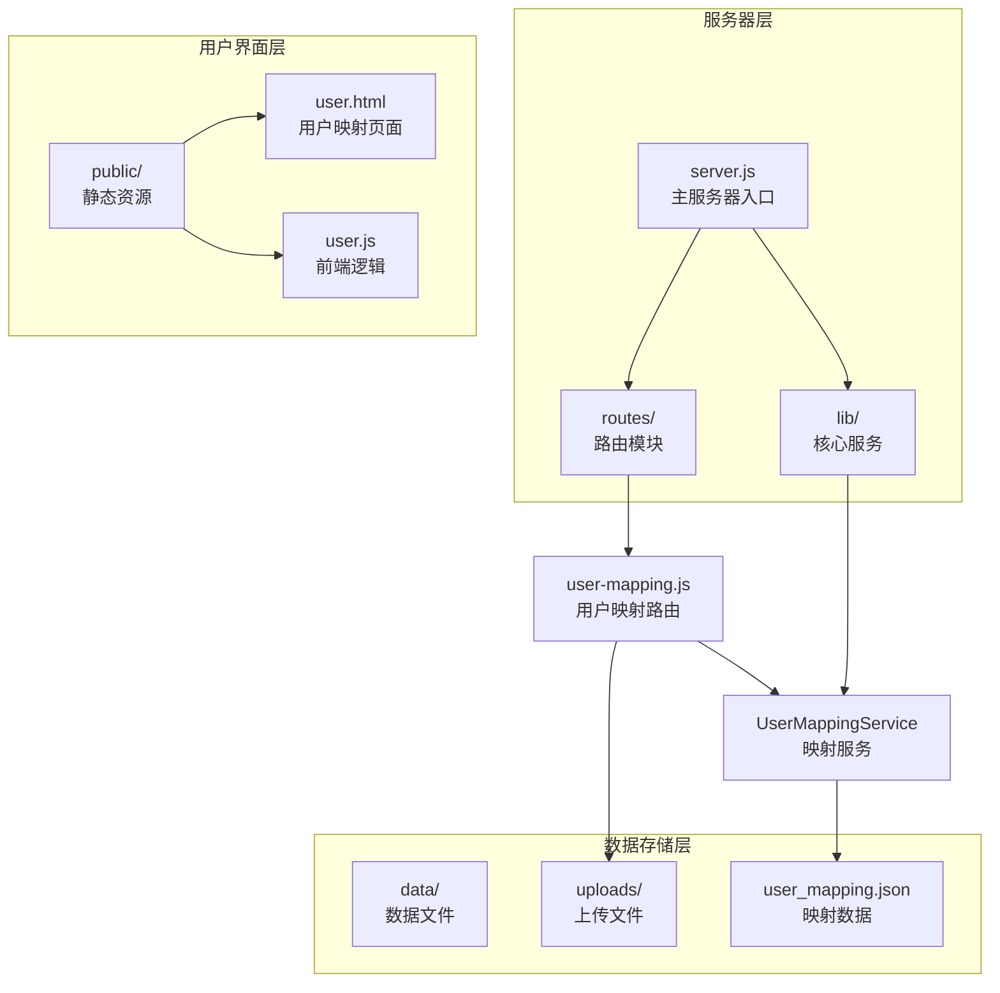
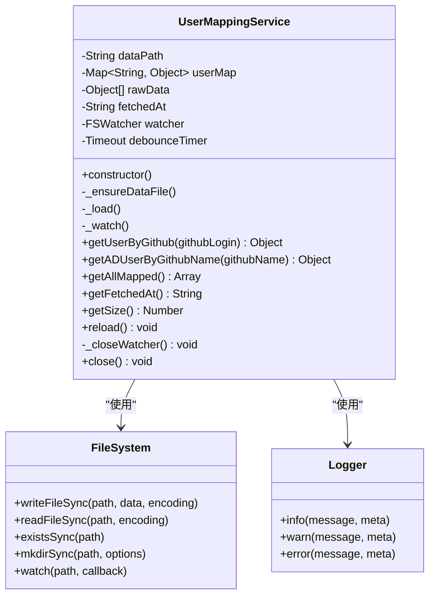
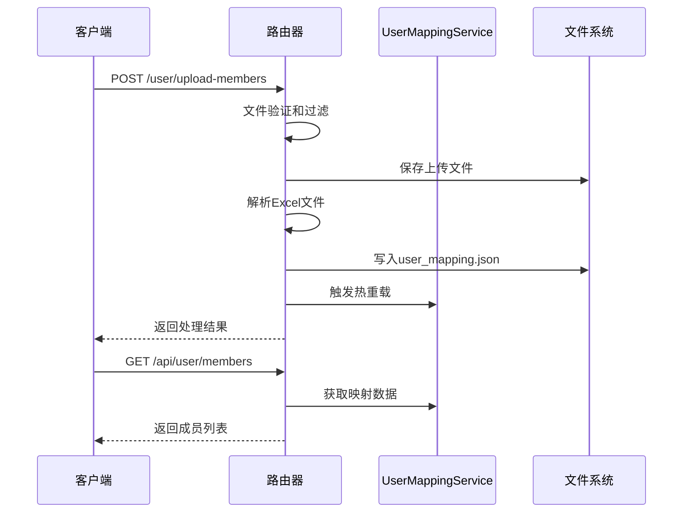
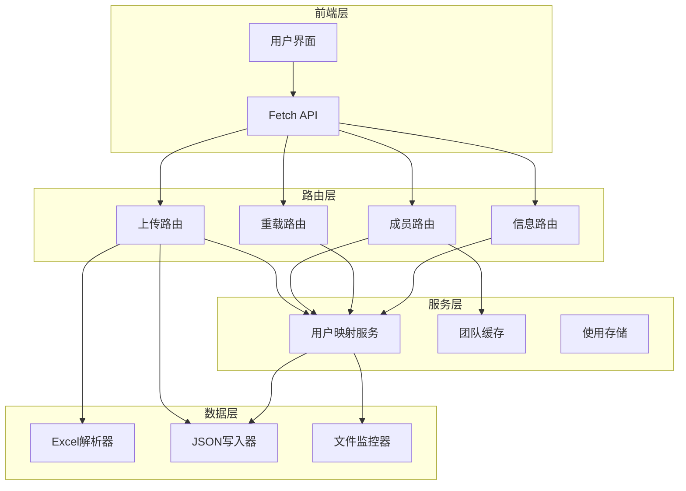
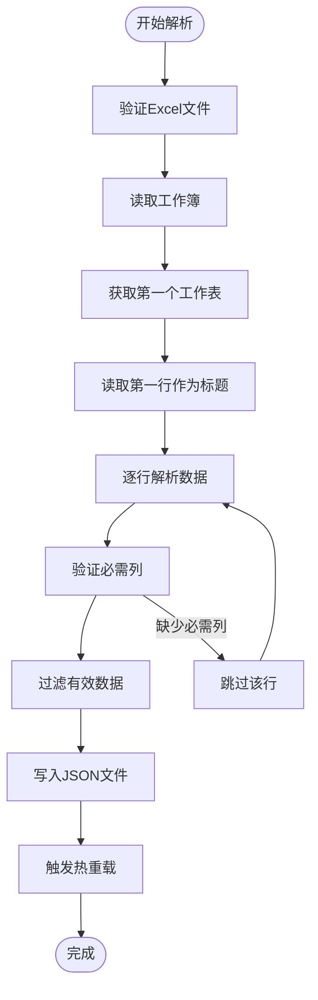
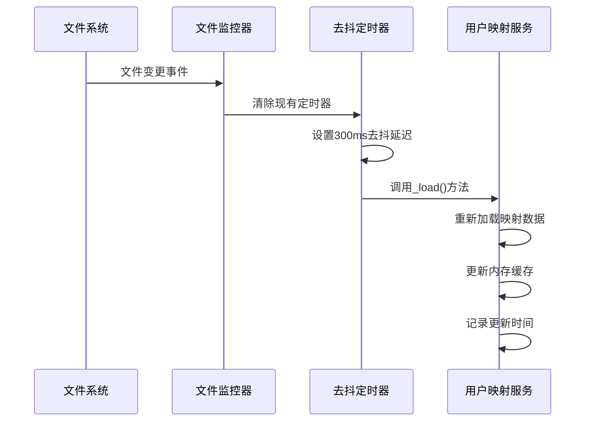
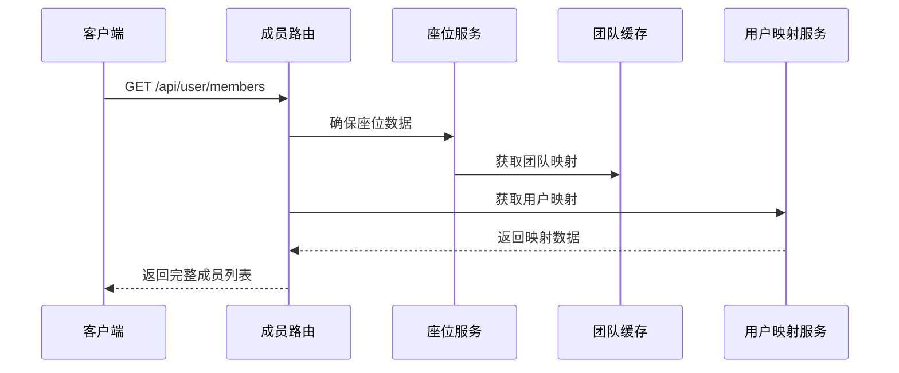
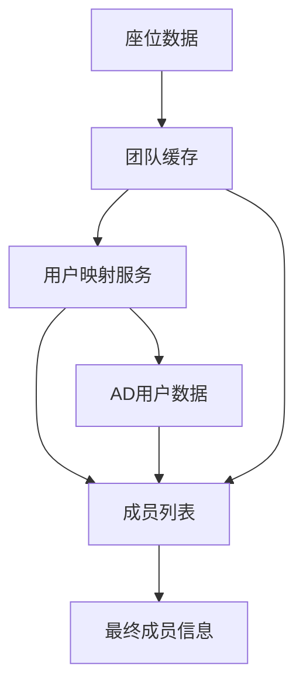
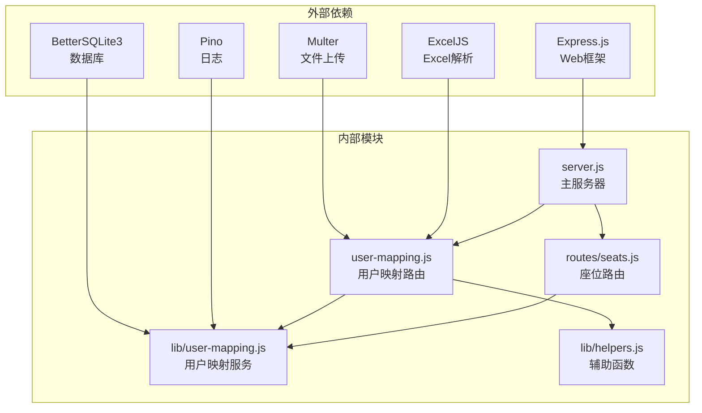
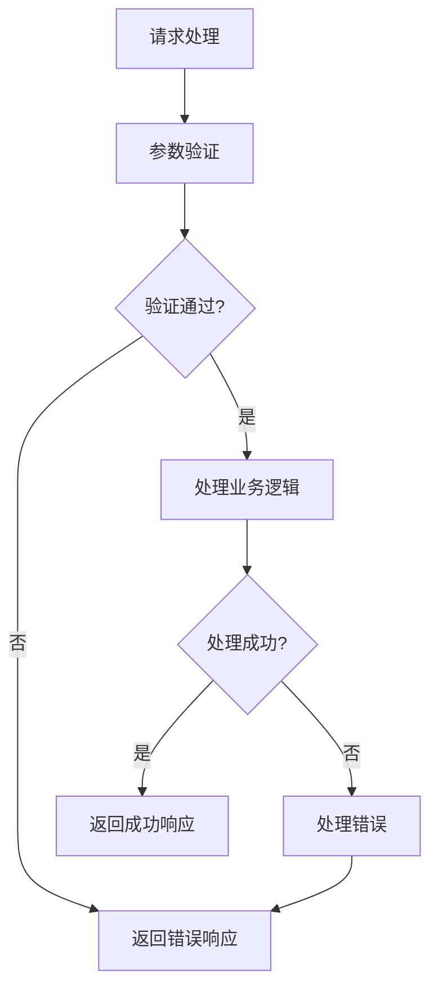

# 用户映射路由

<cite>
**本文档引用的文件**
- [server.js](file://server.js)
- [routes/user-mapping.js](file://routes/user-mapping.js)
- [lib/user-mapping.js](file://lib/user-mapping.js)
- [lib/helpers.js](file://lib/helpers.js)
- [routes/seats.js](file://routes/seats.js)
- [public/user.html](file://public/user.html)
- [public/user.js](file://public/user.js)
- [package.json](file://package.json)
</cite>

## 目录
1. [简介](#简介)
2. [项目结构](#项目结构)
3. [核心组件](#核心组件)
4. [架构概览](#架构概览)
5. [详细组件分析](#详细组件分析)
6. [依赖关系分析](#依赖关系分析)
7. [性能考虑](#性能考虑)
8. [故障排除指南](#故障排除指南)
9. [结论](#结论)

## 简介

用户映射路由是 Copilot Enterprise Usage Display 项目中的一个关键模块，负责管理用户名和显示名之间的映射关系。该系统支持从 Excel 文件批量导入用户映射数据，提供实时热重载功能，并与团队缓存系统深度集成，为用户提供完整的用户映射管理能力。

该模块主要解决以下问题：
- 用户名和显示名之间的双向映射管理
- 批量导入和数据验证机制
- 实时数据热重载和缓存策略
- 与团队缓存的数据同步和集成
- 提供 RESTful API 接口供前端调用

## 项目结构

用户映射路由在项目中的组织结构如下：



**图表来源**
- [server.js:1-182](file://server.js#L1-L182)
- [routes/user-mapping.js:1-135](file://routes/user-mapping.js#L1-L135)
- [lib/user-mapping.js:1-158](file://lib/user-mapping.js#L1-L158)

**章节来源**
- [server.js:88-99](file://server.js#L88-L99)
- [routes/user-mapping.js:12-135](file://routes/user-mapping.js#L12-L135)

## 核心组件

### 用户映射服务 (UserMappingService)

用户映射服务是整个系统的核心组件，采用单例模式设计，提供完整的用户映射管理功能：



**图表来源**
- [lib/user-mapping.js:7-158](file://lib/user-mapping.js#L7-L158)

### 路由处理器

路由处理器提供了完整的 RESTful API 接口，包括文件上传、数据查询和状态管理功能：



**图表来源**
- [routes/user-mapping.js:79-131](file://routes/user-mapping.js#L79-L131)

**章节来源**
- [lib/user-mapping.js:1-158](file://lib/user-mapping.js#L1-L158)
- [routes/user-mapping.js:1-135](file://routes/user-mapping.js#L1-L135)

## 架构概览

用户映射路由的整体架构采用分层设计，确保了良好的可维护性和扩展性：



**图表来源**
- [server.js:40-48](file://server.js#L40-L48)
- [routes/user-mapping.js:12-135](file://routes/user-mapping.js#L12-L135)

## 详细组件分析

### 文件上传处理机制

文件上传处理是用户映射路由的核心功能之一，支持 Excel 文件的批量导入：

#### 上传配置

系统使用 Multer 中间件进行文件上传处理，配置包括：

- **文件大小限制**: 10MB
- **文件类型验证**: 支持 `.xlsx` 和 `.xls` 格式
- **存储策略**: 使用磁盘存储，自动创建上传目录
- **文件命名**: 基于时间戳的唯一文件名

#### Excel 文件解析

Excel 文件解析过程遵循严格的格式要求：



**图表来源**
- [routes/user-mapping.js:39-70](file://routes/user-mapping.js#L39-L70)

#### 数据验证规则

系统对上传的数据实施严格验证：

1. **必需字段验证**: 必须包含 `AD-name` 和 `Github-name` 字段
2. **数据清理**: 自动去除首尾空格
3. **大小写处理**: GitHub 名称转换为小写作为键值
4. **数据类型**: 所有值转换为字符串类型

**章节来源**
- [routes/user-mapping.js:24-35](file://routes/user-mapping.js#L24-L35)
- [routes/user-mapping.js:39-70](file://routes/user-mapping.js#L39-L70)
- [lib/user-mapping.js:50-76](file://lib/user-mapping.js#L50-L76)

### 热重载功能

热重载功能确保用户映射数据的实时更新，采用文件系统监控机制：

#### 文件监控机制



**图表来源**
- [lib/user-mapping.js:98-116](file://lib/user-mapping.js#L98-L116)

#### 去抖机制

系统实现 300ms 的去抖机制，防止频繁的文件变更触发多次重载：

- **去抖延迟**: 300 毫秒
- **错误处理**: 监控器错误时优雅降级
- **资源管理**: 正确关闭监控器句柄

**章节来源**
- [lib/user-mapping.js:5](file://lib/user-mapping.js#L5)
- [lib/user-mapping.js:98-116](file://lib/user-mapping.js#L98-L116)

### 缓存策略

用户映射服务采用内存缓存策略，确保快速的数据访问：

#### 内存缓存结构

```mermaid
graph LR
subgraph "内存缓存"
Map[Map<String, Object><br/>用户映射表]
RawData[Array<Object><br/>原始数据数组]
FetchedAt[String]<br/>更新时间戳>
end
subgraph "持久化存储"
JSON[JSON文件<br/>user_mapping.json]
end
Map --> JSON
RawData --> JSON
FetchedAt --> JSON
JSON --> Map
JSON --> RawData
JSON --> FetchedAt
```

**图表来源**
- [lib/user-mapping.js:13-15](file://lib/user-mapping.js#L13-L15)

#### 缓存更新策略

1. **启动时加载**: 应用启动时自动加载映射数据
2. **文件监控**: 文件变更时自动触发重载
3. **手动重载**: 提供 API 接口进行手动重载
4. **数据验证**: 重载时进行数据完整性检查

**章节来源**
- [lib/user-mapping.js:36-92](file://lib/user-mapping.js#L36-L92)

### 查询接口

系统提供多个查询接口，满足不同的数据访问需求：

#### 成员列表查询



**图表来源**
- [routes/user-mapping.js:105-122](file://routes/user-mapping.js#L105-L122)

#### 用户信息查询

用户信息查询接口支持通过 GitHub 用户名查找对应的 AD 用户信息：

- **输入参数**: `github` 查询参数
- **返回数据**: 包含 GitHub 和 AD 用户信息的完整对象
- **错误处理**: 未找到映射记录时返回明确的错误信息

**章节来源**
- [routes/user-mapping.js:124-131](file://routes/user-mapping.js#L124-L131)

### 与团队缓存的集成

用户映射路由与团队缓存系统深度集成，提供完整的成员信息展示：

#### 数据同步策略



**图表来源**
- [routes/user-mapping.js:107-119](file://routes/user-mapping.js#L107-L119)

#### 团队信息合并

系统通过 `ensureSeatsData` 函数确保团队信息的及时更新：

1. **优先使用缓存**: 首先尝试从 SQLite 缓存中恢复数据
2. **GitHub API 获取**: 缓存失效时从 GitHub API 获取最新数据
3. **数据转换**: 将座位数据转换为用户团队映射
4. **持久化存储**: 将获取的数据保存到 SQLite 缓存

**章节来源**
- [routes/user-mapping.js:107-119](file://routes/user-mapping.js#L107-L119)
- [routes/seats.js:37-75](file://routes/seats.js#L37-L75)

## 依赖关系分析

用户映射路由的依赖关系体现了清晰的分层架构：



**图表来源**
- [package.json:12-21](file://package.json#L12-L21)
- [server.js:1-10](file://server.js#L1-L10)

### 关键依赖说明

1. **Express.js**: 提供 Web 服务器和路由功能
2. **Multer**: 处理文件上传请求
3. **ExcelJS**: 解析 Excel 文件格式
4. **BetterSQLite3**: 提供 SQLite 数据库存储
5. **Pino**: 提供结构化日志记录

**章节来源**
- [package.json:12-21](file://package.json#L12-L21)
- [server.js:1-10](file://server.js#L1-L10)

## 性能考虑

用户映射路由在设计时充分考虑了性能优化：

### 内存使用优化

- **增量加载**: 仅在需要时加载和解析数据
- **内存映射**: 使用 Map 结构提供 O(1) 的查找性能
- **数据压缩**: 原始数据和映射数据分离存储

### I/O 性能优化

- **文件监控**: 使用原生文件系统监控替代轮询
- **去抖机制**: 防止频繁的文件变更触发多次重载
- **异步处理**: 所有 I/O 操作都采用异步方式

### 缓存策略

- **多级缓存**: 内存缓存 + SQLite 持久化缓存
- **智能失效**: 基于时间戳的缓存失效机制
- **预加载策略**: 应用启动时预加载必要的数据

## 故障排除指南

### 常见问题及解决方案

#### 文件上传失败

**问题症状**: 上传 Excel 文件时出现错误

**可能原因**:
1. 文件格式不支持
2. 文件大小超过限制
3. Excel 文件结构不符合要求

**解决方案**:
1. 确认文件格式为 `.xlsx` 或 `.xls`
2. 检查文件大小是否超过 10MB 限制
3. 验证 Excel 文件包含必需的列 (`AD-name`, `Github-name`)

#### 映射数据不更新

**问题症状**: 修改映射文件后，系统未反映最新数据

**可能原因**:
1. 文件监控器异常
2. 文件权限问题
3. 去抖机制导致延迟

**解决方案**:
1. 手动触发重载接口
2. 检查文件权限设置
3. 等待去抖机制完成（约 300ms）

#### 数据查询为空

**问题症状**: 查询用户映射信息时返回空结果

**可能原因**:
1. 映射数据文件不存在或为空
2. 用户名大小写不匹配
3. 数据未正确加载

**解决方案**:
1. 检查映射数据文件是否存在
2. 确认用户名大小写一致性
3. 重新加载映射数据

**章节来源**
- [lib/user-mapping.js:85-91](file://lib/user-mapping.js#L85-L91)
- [routes/user-mapping.js:90-94](file://routes/user-mapping.js#L90-L94)

### 错误处理机制

系统实现了完善的错误处理机制：



**图表来源**
- [lib/helpers.js:30-36](file://lib/helpers.js#L30-L36)

## 结论

用户映射路由模块为 Copilot Enterprise Usage Display 提供了完整的用户映射管理解决方案。通过精心设计的架构和实现，该模块实现了以下目标：

### 主要成就

1. **完整的功能覆盖**: 支持文件上传、数据验证、热重载、查询接口等完整功能
2. **高性能设计**: 采用内存缓存和文件监控机制，确保快速响应
3. **良好的用户体验**: 提供直观的用户界面和清晰的状态反馈
4. **健壮的错误处理**: 实现了全面的错误捕获和处理机制

### 技术亮点

- **实时热重载**: 通过文件监控实现实时数据更新
- **智能缓存策略**: 多级缓存确保最佳性能
- **严格的验证机制**: 确保数据质量和完整性
- **优雅的错误处理**: 提供友好的错误信息和恢复机制

### 未来改进方向

1. **并发控制**: 添加并发访问控制机制
2. **审计日志**: 记录所有数据变更操作
3. **数据备份**: 实现自动备份和恢复功能
4. **性能监控**: 添加详细的性能指标监控

该模块的设计充分体现了现代 Web 应用的最佳实践，为用户提供了可靠、高效的用户映射管理能力。