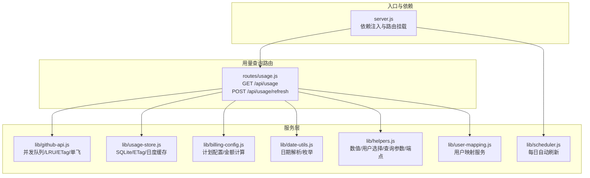
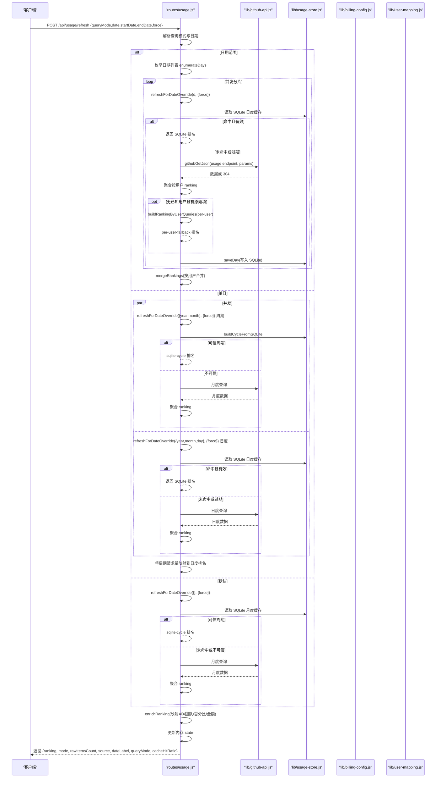
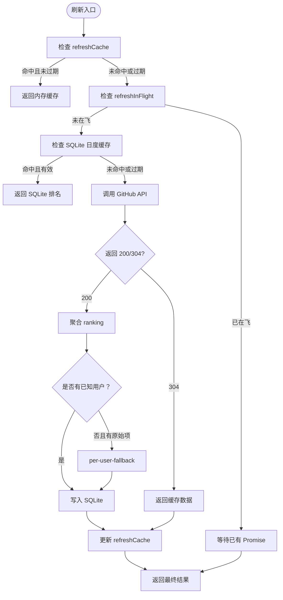
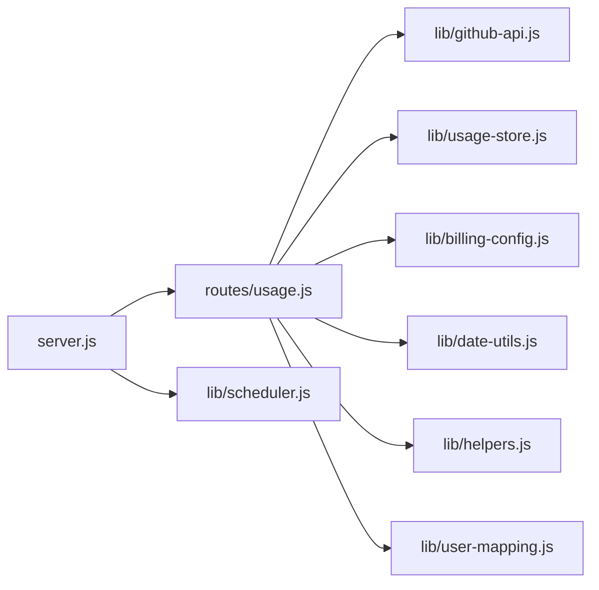

# 用量查询路由

<cite>
**本文引用的文件**
- [routes/usage.js](file://routes/usage.js)
- [lib/usage-store.js](file://lib/usage-store.js)
- [lib/github-api.js](file://lib/github-api.js)
- [lib/billing-config.js](file://lib/billing-config.js)
- [lib/date-utils.js](file://lib/date-utils.js)
- [lib/helpers.js](file://lib/helpers.js)
- [lib/user-mapping.js](file://lib/user-mapping.js)
- [lib/scheduler.js](file://lib/scheduler.js)
- [server.js](file://server.js)
- [README.md](file://README.md)
</cite>

## 目录
1. [简介](#简介)
2. [项目结构](#项目结构)
3. [核心组件](#核心组件)
4. [架构总览](#架构总览)
5. [详细组件分析](#详细组件分析)
6. [依赖关系分析](#依赖关系分析)
7. [性能考量](#性能考量)
8. [故障排查指南](#故障排查指南)
9. [结论](#结论)
10. [附录](#附录)

## 简介
本文件聚焦于用量查询路由，系统提供两个核心端点：
- GET /api/usage：返回当前内存缓存中的用量排行与元信息
- POST /api/usage/refresh：根据查询模式（默认、单日、日期范围）刷新并聚合用量数据，支持强制回源与 per-user-fallback 降级策略

本文将深入解释：
- 用量数据聚合算法与按用户聚合逻辑
- 缓存策略（内存 Map、SQLite 持久化、ETag 条件请求）
- 数据刷新机制与 per-user-fallback 降级
- 百分比计算方法与金额计算规则
- 单日查询、日期范围查询、整月查询的差异
- 错误处理、性能优化与调试方法
- 实际 API 调用示例与响应数据格式说明

## 项目结构
用量查询路由位于 routes/usage.js，围绕以下模块协作：
- lib/usage-store.js：SQLite 持久化存储与 ETag 缓存
- lib/github-api.js：GitHub API 并发队列、LRU 缓存、ETag 条件请求、单次飞行去重
- lib/billing-config.js：计划配置与金额计算
- lib/date-utils.js：日期解析与日期枚举
- lib/helpers.js：通用工具（数值转换、用户选择、查询参数构建、端点构建）
- lib/user-mapping.js：用户映射服务（AD 名称等）
- lib/scheduler.js：每日自动刷新调度器
- server.js：入口与依赖注入

**图表来源**
- [server.js:88-98](file://server.js#L88-L98)
- [routes/usage.js:13-468](file://routes/usage.js#L13-L468)
- [lib/github-api.js:1-320](file://lib/github-api.js#L1-L320)
- [lib/usage-store.js:10-324](file://lib/usage-store.js#L10-L324)
- [lib/billing-config.js:1-25](file://lib/billing-config.js#L1-L25)
- [lib/date-utils.js:1-46](file://lib/date-utils.js#L1-L46)
- [lib/helpers.js:1-83](file://lib/helpers.js#L1-L83)
- [lib/user-mapping.js:1-158](file://lib/user-mapping.js#L1-L158)
- [lib/scheduler.js:1-160](file://lib/scheduler.js#L1-L160)

**章节来源**
- [server.js:88-98](file://server.js#L88-L98)
- [routes/usage.js:13-468](file://routes/usage.js#L13-L468)

## 核心组件
- 用量路由模块：负责路由定义、刷新流程、聚合与降级策略、状态缓存与响应
- GitHub API 服务：并发队列、LRU 缓存、ETag 条件请求、单次飞行去重
- SQLite 存储：每日用量、ETag、席位快照、月度账单
- 计费配置：计划类型、配额、基础价、超额单价、金额计算
- 日期工具：日期解析、日期范围枚举
- 辅助工具：数值转换、用户选择、查询参数构建、端点构建
- 用户映射：AD 名称映射、团队归属
- 调度器：每日自动刷新最近 N 天

**章节来源**
- [routes/usage.js:13-468](file://routes/usage.js#L13-L468)
- [lib/github-api.js:1-320](file://lib/github-api.js#L1-L320)
- [lib/usage-store.js:10-324](file://lib/usage-store.js#L10-L324)
- [lib/billing-config.js:1-25](file://lib/billing-config.js#L1-L25)
- [lib/date-utils.js:1-46](file://lib/date-utils.js#L1-L46)
- [lib/helpers.js:1-83](file://lib/helpers.js#L1-L83)
- [lib/user-mapping.js:1-158](file://lib/user-mapping.js#L1-L158)
- [lib/scheduler.js:1-160](file://lib/scheduler.js#L1-L160)

## 架构总览
用量查询的刷新与聚合流程如下：

**图表来源**
- [routes/usage.js:387-462](file://routes/usage.js#L387-L462)
- [lib/github-api.js:231-269](file://lib/github-api.js#L231-L269)
- [lib/usage-store.js:137-160](file://lib/usage-store.js#L137-L160)
- [lib/billing-config.js:18-22](file://lib/billing-config.js#L18-L22)

**章节来源**
- [routes/usage.js:387-462](file://routes/usage.js#L387-L462)
- [lib/github-api.js:231-269](file://lib/github-api.js#L231-L269)
- [lib/usage-store.js:137-160](file://lib/usage-store.js#L137-L160)
- [lib/billing-config.js:18-22](file://lib/billing-config.js#L18-L22)

## 详细组件分析

### GET /api/usage
- 功能：返回当前内存中的最新用量排行与元信息
- 响应字段
  - ok：布尔，请求是否成功
  - fetchedAt：字符串，最近一次刷新时间
  - source：字符串，数据来源（企业或组织）
  - rawItemsCount：整数，原始用量项数量
  - mode：字符串，数据来源模式（direct/per-user-fallback/sqlite-cycle）
  - dateLabel：字符串，日期标签（默认为账单月，单日为具体日期，范围为“开始 ~ 结束 (N天)”）
  - queryMode：字符串，查询模式（default/single/range）
  - ranking：数组，每用户用量排行
  - includedQuota：整数，包含配额
- 注意：该端点不触发刷新，仅返回内存 state 中的最新结果

**章节来源**
- [routes/usage.js:378-385](file://routes/usage.js#L378-L385)

### POST /api/usage/refresh
- 查询模式
  - default：默认模式，使用当前账单年月（可选 BILLING_DAY）
  - single：单日模式，同时刷新该日与该月周期
  - range：日期范围模式，最多 31 天，按天枚举并发刷新
- 请求体参数
  - queryMode：字符串，default/single/range
  - date：字符串，YYYY-MM-DD，单日模式必填
  - startDate/endDate：字符串，YYYY-MM-DD，范围模式必填
  - force：布尔，true/false，跳过内存与 SQLite TTL 检查
- 响应字段
  - ok：布尔
  - fetchedAt/source/rawItemsCount/mode/dateLabel/queryMode：同 GET
  - ranking：数组，每用户用量排行（含百分比、金额）
  - includedQuota：整数
  - cacheHitRatio：整数，缓存命中百分比

- 刷新流程要点
  - 日期范围：枚举日期列表，按最大并发分片并发调用 refreshForDateOverride
  - 单日：并发获取日度与月度结果，将月度周期请求量映射到日度排名
  - 默认：获取当前账单月度结果
  - refreshForDateOverride：内存 Map refreshCache + Map refreshInFlight 去重；SQLite 日度缓存；GitHub API 回源；per-user-fallback 降级
  - buildCycleFromSQLite：对月度周期进行三重完整性校验，不可信则降级到 GitHub 月度查询
  - enrichRanking：映射 AD 名称、团队、百分比、金额

**章节来源**
- [routes/usage.js:387-462](file://routes/usage.js#L387-L462)
- [lib/date-utils.js:19-33](file://lib/date-utils.js#L19-L33)

### 用量数据聚合算法与按用户聚合逻辑
- 按用户聚合
  - 输入：usageItems 数组
  - 用户识别：pickUser 从多种候选键中提取用户（user/username/userName/login/actor 等）
  - 数值累加：requests 与 amount 分别累加 netQuantity/grossQuantity/quantity/requests 与 netAmount/grossAmount/amount
  - 过滤：过滤 "(unknown)" 用户
  - 排序：按 requests 降序，生成 rank 序号
  - 精度：requests 保留两位小数，amount 保留四位小数
- 单用户用量
  - 对单用户查询，将 usageItems 累加为 requests/amount
- 合并聚合
  - mergeRankings：按用户合并多个日期的 ranking，再排序并重排 rank

**章节来源**
- [routes/usage.js:28-57](file://routes/usage.js#L28-L57)
- [routes/usage.js:59-67](file://routes/usage.js#L59-L67)
- [routes/usage.js:350-367](file://routes/usage.js#L350-L367)
- [lib/helpers.js:14-28](file://lib/helpers.js#L14-L28)

### 百分比计算方法与金额计算规则
- 百分比
  - reqsForPct = 若存在 cycleRequests 则用 cycleRequests，否则用 requests
  - percentage = Math.round(reqsForPct / quota * 10000) / 100
- 金额
  - planType 由团队缓存中的 seat.planType 决定，若不存在默认 "business"
  - calcAmount(cycleRequests, planType)：若 requests <= quota，则返回基础价；否则返回基础价 + 超额 × 单价
- 额度与计划
  - INCLUDED_QUOTA 默认 300
  - PLAN_CONFIG：business 基础价 19，quota 300；enterprise 基础价 39，quota 1000

**章节来源**
- [routes/usage.js:74-91](file://routes/usage.js#L74-L91)
- [lib/billing-config.js:11-22](file://lib/billing-config.js#L11-L22)

### 缓存策略
- 内存缓存（refreshCache）
  - 类型：Map，键为 JSON.stringify(dateOverride)，值为 { ts, result }
  - TTL：CACHE_TTL_MS（默认 5 分钟）
  - 作用：最近查询结果的短期缓存，提升并发请求命中率
- 单次飞行去重（refreshInFlight）
  - 类型：Map，键为缓存键，值为 Promise
  - 作用：避免相同参数的并发刷新重复打 GitHub API
- SQLite 持久化缓存（daily_usage）
  - 结构：date/year/month/day/data/mode/raw_count/source/fetched_at/ranking
  - 月度周期缓存：buildCycleFromSQLite 从 SQLite 读取并聚合
  - 动态 TTL：近 3 天 1 小时，更老 90 天
- ETag 条件请求（github-api + usage-store）
  - 内存 ETag 缓存：Map，键为缓存 key，值为 { etag, data, ts }
  - SQLite ETag 表：persisted，启动时恢复
  - 条件请求：若命中 304 Not Modified，返回缓存数据，不消耗配额

**图表来源**
- [routes/usage.js:237-348](file://routes/usage.js#L237-L348)
- [lib/github-api.js:231-269](file://lib/github-api.js#L231-L269)
- [lib/usage-store.js:137-160](file://lib/usage-store.js#L137-L160)

**章节来源**
- [routes/usage.js:11-24](file://routes/usage.js#L11-L24)
- [routes/usage.js:237-348](file://routes/usage.js#L237-L348)
- [lib/github-api.js:67-74](file://lib/github-api.js#L67-L74)
- [lib/github-api.js:231-269](file://lib/github-api.js#L231-L269)
- [lib/usage-store.js:137-160](file://lib/usage-store.js#L137-L160)

### per-user-fallback 降级策略
- 何时触发
  - 当聚合结果中没有已知用户（全部为 "(unknown)"），但原始 usageItems 非空时
  - 单日模式下，若 SQLite 日度缓存 ranking 为空且有原始项，触发 per-user-fallback
- 如何触发
  - 并发对每个用户发起 usage 查询，聚合单用户用量
  - 并发大小：chunkSize = 8
  - 失败处理：单用户失败不中断，记录首个错误消息
- 降级模式
  - mode = "per-user-fallback"
  - 写入 SQLite 时保存新的 ranking

**章节来源**
- [routes/usage.js:297-307](file://routes/usage.js#L297-L307)
- [routes/usage.js:332-337](file://routes/usage.js#L332-L337)
- [routes/usage.js:93-118](file://routes/usage.js#L93-L118)

### 整月查询与周期聚合（buildCycleFromSQLite）
- 目标：从 SQLite 日度缓存聚合出整月周期的 ranking
- 三重完整性校验
  1) 覆盖完整性：查询范围内每一天在 SQLite 中均存在记录
  2) 近端新鲜度：最近 3 天 fetched_at 必须在 1 小时内，且 mode 必须为 "per-user-fallback"
  3) Ranking 非空：某天 raw_count > 0 但 ranking 为空，视为聚合异常，拒绝使用该周期缓存
- 聚合方式：按用户累加 requests/amount，再排序并重排 rank

**章节来源**
- [routes/usage.js:134-235](file://routes/usage.js#L134-L235)

### 单日查询、日期范围查询与整月查询
- 单日查询（single）
  - 并发获取日度与月度结果，将月度周期请求量映射到日度排名
- 日期范围查询（range）
  - 枚举日期列表（最多 31 天），按最大并发分片并发刷新
  - mergeRankings：按用户合并多个日期的 ranking
- 默认查询（default）
  - 使用当前账单年月（可选 BILLING_DAY），优先走 SQLite 月度缓存，不可信则回源 GitHub

**章节来源**
- [routes/usage.js:398-443](file://routes/usage.js#L398-L443)
- [lib/date-utils.js:19-33](file://lib/date-utils.js#L19-L33)

### 错误处理机制
- 写入错误响应
  - writeError：根据 ApiError.statusCode 返回 429/500 等，并携带 rateLimit 信息
- GitHub API 错误
  - ApiError：封装状态码与速率限制信息
  - 重试与退避：指数退避，最大等待 60 秒
  - 429/403 速率限制：自动等待 resetAt 或 retry-after
- per-user-fallback 失败
  - 记录错误日志，不中断主流程
- 调度器失败
  - 仅记录 warning，不影响主流程

**章节来源**
- [lib/helpers.js:30-36](file://lib/helpers.js#L30-L36)
- [lib/github-api.js:14-21](file://lib/github-api.js#L14-L21)
- [lib/github-api.js:172-227](file://lib/github-api.js#L172-L227)
- [routes/usage.js:106-110](file://routes/usage.js#L106-L110)
- [lib/scheduler.js:92-97](file://lib/scheduler.js#L92-L97)

## 依赖关系分析
- 路由依赖注入
  - usageStore：SQLite 存储
  - teamCache：团队与席位缓存
  - userMappingService：用户映射服务
- 路由内部依赖
  - githubGetJson：GitHub API 调用
  - usageStore：SQLite 读写
  - billing-config：计划配置
  - date-utils：日期工具
  - helpers：通用工具
  - user-mapping：AD 名称映射
- 调度器依赖
  - startScheduler：依赖 usageRouter.forceRefreshDay

**图表来源**
- [server.js:88-98](file://server.js#L88-L98)
- [routes/usage.js:13-468](file://routes/usage.js#L13-L468)

**章节来源**
- [server.js:88-98](file://server.js#L88-L98)
- [routes/usage.js:13-468](file://routes/usage.js#L13-L468)

## 性能考量
- 并发控制
  - GitHub API 并发队列：MAX_CONCURRENT_GITHUB（默认 3）
  - per-user 查询分片：chunkSize = 8
- 缓存命中
  - 内存 Map + SQLite + ETag 三层缓存，显著减少 API 调用
  - 动态 TTL：近 3 天 1 小时，更老 90 天，避免 GitHub 24–48h 延迟导致的“锁死”
- 单次飞行去重
  - 避免相同参数的并发刷新重复打 GitHub API
- 合并渲染
  - 前端采用 requestAnimationFrame 分片渲染，避免主线程阻塞
- 日志与可观测性
  - debug 级日志记录缓存命中/ETag/条件请求/in-flight 去重，便于定位性能瓶颈

**章节来源**
- [lib/github-api.js:25-48](file://lib/github-api.js#L25-L48)
- [routes/usage.js:97-118](file://routes/usage.js#L97-L118)
- [routes/usage.js:258-267](file://routes/usage.js#L258-L267)
- [README.md:35-44](file://README.md#L35-L44)

## 故障排查指南
- 常见问题
  - 429 速率限制：检查 GITHUB_MAX_RETRIES 与 GITHUB_MAX_CONCURRENT，关注 rateLimit 字段
  - 304 未修改：确认 ETag 是否正确持久化与恢复
  - per-user-fallback 失败：查看日志中 per-user-fallback 失败记录
  - 月度周期不可信：检查 SQLite 中最近 3 天 fetched_at 是否在 1 小时内且 mode 为 "per-user-fallback"
- 调试方法
  - 设置 LOG_LEVEL=debug，观察缓存命中与条件请求日志
  - 使用 force:true 强制回源，验证 GitHub API 正常
  - 检查 SQLite 表 daily_usage 与 etag_cache 的数据
- 自动刷新
  - 检查 SCHED_DISABLED、SCHED_DAILY_TIMES、SCHED_BACKFILL_DAYS 等环境变量
  - 观察调度器日志，确认每日定时刷新是否正常

**章节来源**
- [lib/github-api.js:172-227](file://lib/github-api.js#L172-L227)
- [lib/github-api.js:67-74](file://lib/github-api.js#L67-L74)
- [routes/usage.js:155-199](file://routes/usage.js#L155-L199)
- [lib/scheduler.js:59-69](file://lib/scheduler.js#L59-L69)

## 结论
用量查询路由通过三层缓存与条件请求、动态 TTL、per-user-fallback 降级与调度器自动刷新，实现了高可靠、高性能的用量排行查询能力。开发者可依据查询模式灵活选择默认、单日或日期范围模式，并通过 force 参数在必要时强制回源。系统在错误处理与可观测性方面提供了完善的保障，便于在生产环境中稳定运行。

## 附录

### API 调用示例与响应格式
- GET /api/usage
  - 请求：无请求体
  - 响应：包含 ranking、mode、source、rawItemsCount、dateLabel、queryMode、includedQuota 等字段
- POST /api/usage/refresh
  - 请求体（默认模式）
    - queryMode: "default"
    - force: true/false
  - 请求体（单日模式）
    - queryMode: "single"
    - date: "YYYY-MM-DD"
    - force: true/false
  - 请求体（日期范围模式）
    - queryMode: "range"
    - startDate: "YYYY-MM-DD"
    - endDate: "YYYY-MM-DD"
    - force: true/false
  - 响应：包含 ranking、mode、source、rawItemsCount、dateLabel、queryMode、includedQuota、cacheHitRatio 等字段

**章节来源**
- [routes/usage.js:378-385](file://routes/usage.js#L378-L385)
- [routes/usage.js:387-462](file://routes/usage.js#L387-L462)

### 环境变量与配置
- GITHUB_TOKEN：GitHub PAT
- ENTERPRISE_SLUG 或 ORG_NAME：企业或组织标识
- BILLING_YEAR/BILLING_MONTH/BILLING_DAY：账单年月日
- PRODUCT/MODEL：产品与模型过滤
- INCLUDED_QUOTA：包含配额
- CACHE_TTL：前端缓存 TTL（秒）
- GITHUB_MAX_CONCURRENT/GITHUB_MAX_RETRIES：GitHub API 并发与重试
- SCHED_DISABLED/SCHED_DAILY_TIMES/SCHED_BACKFILL_DAYS/SCHED_STARTUP_DELAY_MS：调度器配置

**章节来源**
- [README.md:196-217](file://README.md#L196-L217)