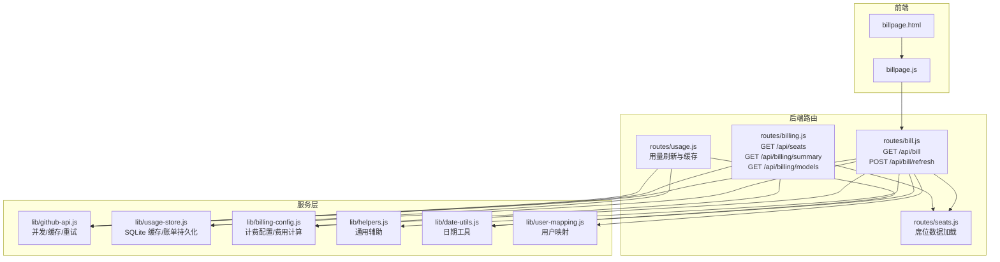
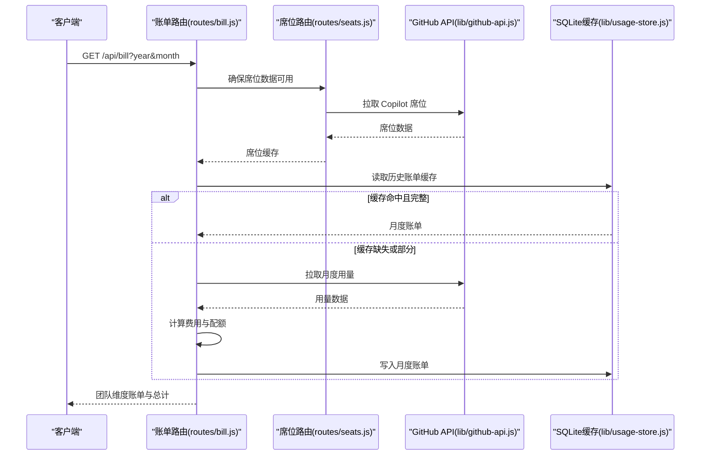
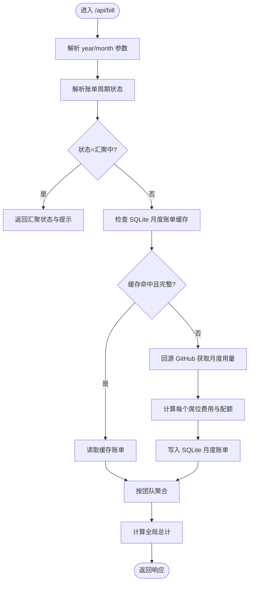
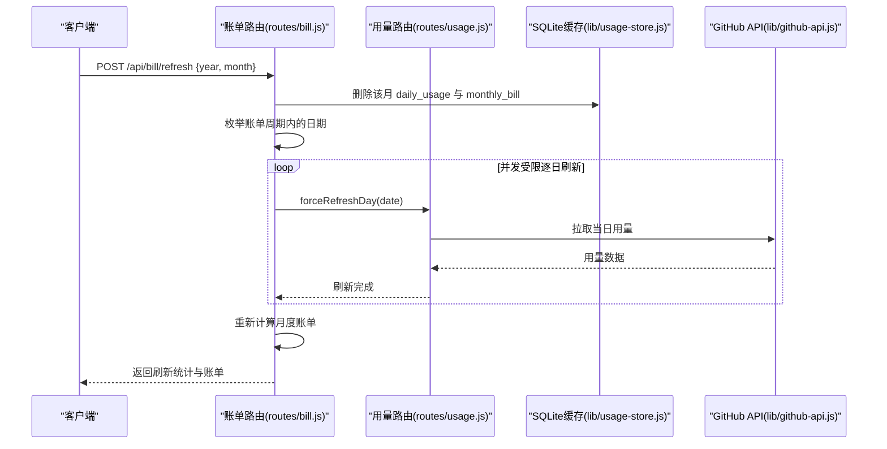
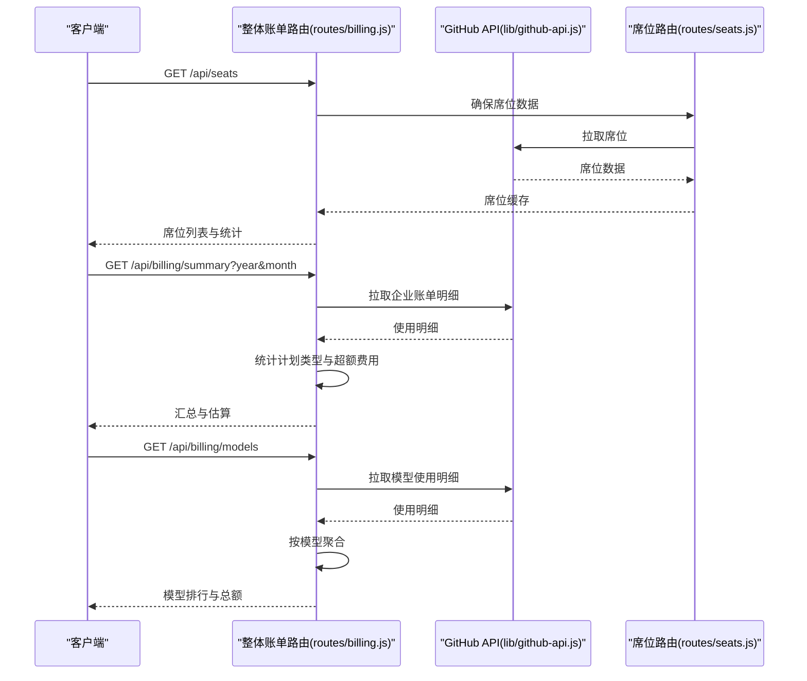
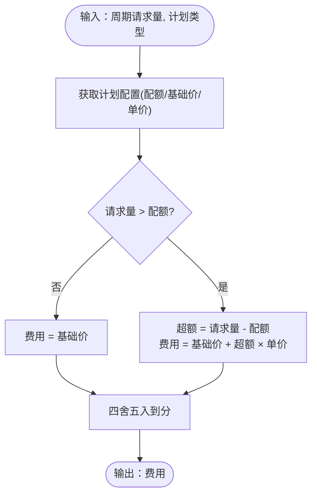
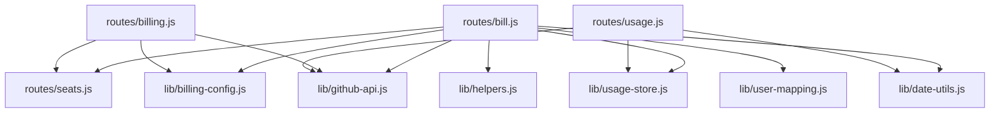

# 账单管理路由

<cite>
**本文档引用的文件**
- [routes/bill.js](file://routes/bill.js)
- [routes/billing.js](file://routes/billing.js)
- [lib/billing-config.js](file://lib/billing-config.js)
- [lib/usage-store.js](file://lib/usage-store.js)
- [lib/github-api.js](file://lib/github-api.js)
- [lib/helpers.js](file://lib/helpers.js)
- [routes/seats.js](file://routes/seats.js)
- [routes/usage.js](file://routes/usage.js)
- [lib/date-utils.js](file://lib/date-utils.js)
- [lib/user-mapping.js](file://lib/user-mapping.js)
- [public/billpage.js](file://public/billpage.js)
- [public/billpage.html](file://public/billpage.html)
- [README.md](file://README.md)
- [package.json](file://package.json)
</cite>

## 更新摘要
**变更内容**
- 新增历史周期支持：`GET /api/bill` 现支持 `year` 和 `month` 查询参数查询历史账单
- 增强强制刷新机制：`POST /api/bill/refresh` 提供完整的月度强制刷新功能
- 新增 `overageCostSource` 字段：在整体账单路由中标识超额费用计算来源
- 更新 API 端点设计：完善历史账单查询和强制刷新的响应结构

## 目录
1. [简介](#简介)
2. [项目结构](#项目结构)
3. [核心组件](#核心组件)
4. [架构概览](#架构概览)
5. [详细组件分析](#详细组件分析)
6. [依赖关系分析](#依赖关系分析)
7. [性能考虑](#性能考虑)
8. [故障排查指南](#故障排查指南)
9. [结论](#结论)
10. [附录](#附录)

## 简介
本文件聚焦于账单管理路由的实现与使用，深入解释成本计算逻辑、费用分配机制与账单生成流程，涵盖不同计划类型的计费规则、配额计算与超额费用处理，以及团队维度的费用汇总、用户级别费用明细与历史账单查询功能。文档还包含预算控制、超支提醒与成本预警机制的设计思路，并提供账单 API 的端点设计、请求参数格式与响应数据结构说明，以及与 GitHub Enterprise 计费系统的集成方式与数据同步策略。

**更新** 新增历史周期支持和强制刷新机制增强，提供更灵活的账单查询和数据刷新能力。

## 项目结构
账单管理相关的核心文件分布如下：
- 路由层：`routes/bill.js`（团队月度账单）、`routes/billing.js`（整体账单汇总与模型排行）、`routes/seats.js`（席位数据加载）
- 服务层：`lib/github-api.js`（GitHub API 封装，含并发控制、缓存与重试）、`lib/usage-store.js`（SQLite 缓存与账单持久化）
- 配置与工具：`lib/billing-config.js`（计费配置与费用计算）、`lib/helpers.js`（通用辅助函数）、`lib/date-utils.js`（日期工具）
- 前端页面：`public/billpage.html`（账单页面）、`public/billpage.js`（账单页面交互逻辑）
- 入口与文档：`server.js`（Express 入口）、`README.md`（功能与 API 列表）

**图表来源**
- [routes/bill.js:1-416](file://routes/bill.js#L1-L416)
- [routes/billing.js:1-157](file://routes/billing.js#L1-L157)
- [routes/seats.js:1-78](file://routes/seats.js#L1-L78)
- [routes/usage.js:1-470](file://routes/usage.js#L1-L470)
- [lib/github-api.js:1-320](file://lib/github-api.js#L1-L320)
- [lib/usage-store.js:1-333](file://lib/usage-store.js#L1-L333)
- [lib/billing-config.js:1-25](file://lib/billing-config.js#L1-L25)
- [lib/helpers.js:1-83](file://lib/helpers.js#L1-L83)
- [lib/date-utils.js:1-46](file://lib/date-utils.js#L1-L46)
- [lib/user-mapping.js:1-158](file://lib/user-mapping.js#L1-L158)
- [public/billpage.html:1-67](file://public/billpage.html#L1-L67)
- [public/billpage.js:1-285](file://public/billpage.js#L1-L285)

## 核心组件
- 账单路由（团队月度账单）：负责按月生成团队维度账单，支持历史缓存读取与强制刷新。
- 整体账单路由：提供席位汇总、Premium Request 超额费用估算与模型使用排行，支持历史周期查询。
- GitHub API 服务：封装并发控制、ETag 条件请求、LRU 缓存与重试机制。
- SQLite 缓存与账单持久化：提供每日用量、席位快照与月度账单的持久化存储。
- 计费配置与费用计算：定义计划类型、配额与单价，提供费用计算函数。
- 席位数据加载：从 GitHub 拉取 Copilot 席位信息并缓存。
- 前端账单页面：提供账单查询、筛选与强制刷新交互。

**更新** 新增历史周期支持和强制刷新机制增强功能。

## 架构概览
账单管理路由的总体架构围绕"路由层-服务层-数据层"分层设计，前端通过 REST API 与后端交互，后端通过 GitHub API 获取用量与席位数据，使用 SQLite 缓存与账单持久化提升性能与可靠性。

**图表来源**
- [routes/bill.js:134-198](file://routes/bill.js#L134-L198)
- [routes/seats.js:37-75](file://routes/seats.js#L37-L75)
- [lib/github-api.js:231-269](file://lib/github-api.js#L231-L269)
- [lib/usage-store.js:282-320](file://lib/usage-store.js#L282-L320)

## 详细组件分析

### 账单路由（团队月度账单）
- 功能概述
  - 按年月查询团队维度账单，支持历史缓存读取与强制刷新。
  - 自动判断账单周期状态（汇聚中/部分/完整），并给出相应提示。
  - 将用户级账单按团队聚合，输出团队成员数、席位费、超额费用与总费用。
- 关键流程
  - 解析查询参数与账单周期，决定缓存策略与数据来源。
  - 优先从 SQLite 月度账单表读取，否则回源 GitHub API 获取月度用量并计算。
  - 对每个席位计算配额内费用与超额费用，累加生成团队与全局总计。
  - 支持强制刷新：删除该月缓存，逐日回源 GitHub 并重新计算。
- 数据结构
  - 请求参数：year（年）、month（月）。
  - 响应字段：yearMonth、status、message、dateRange、teams（团队级汇总）、grandTotal（全局总计）。
  - 团队明细：team、members、seatCost、overageCost、totalCost、users（用户级明细）。
  - 用户明细：login、adName、planType、seatCost、requests、quota、overageRequests、overageCost、totalCost。

**图表来源**
- [routes/bill.js:237-313](file://routes/bill.js#L237-L313)
- [routes/bill.js:134-198](file://routes/bill.js#L134-L198)
- [lib/usage-store.js:282-320](file://lib/usage-store.js#L282-L320)

**章节来源**
- [routes/bill.js:237-313](file://routes/bill.js#L237-L313)
- [routes/bill.js:134-198](file://routes/bill.js#L134-L198)
- [lib/usage-store.js:282-320](file://lib/usage-store.js#L282-L320)

### 强制刷新流程（按月）
- 功能概述
  - 清空该月 SQLite 缓存（daily_usage 与 monthly_bill），逐日回源 GitHub API，重新计算并返回刷新结果。
- 关键流程
  - 删除该月 daily_usage 与 monthly_bill。
  - 按账单周期枚举日期，受并发限制逐日回源并刷新。
  - 重新计算月度账单并返回 refreshedDays 与 failedDates。
- 前端交互
  - 账单页面提供"强制刷新"按钮，二次确认后调用 /api/bill/refresh。

**图表来源**
- [routes/bill.js:321-403](file://routes/bill.js#L321-L403)
- [routes/usage.js:273-277](file://routes/usage.js#L273-L277)
- [lib/usage-store.js:205-207](file://lib/usage-store.js#L205-L207)

**章节来源**
- [routes/bill.js:321-403](file://routes/bill.js#L321-L403)
- [routes/usage.js:273-277](file://routes/usage.js#L273-L277)

### 整体账单路由（席位与模型）
- 席位汇总（GET /api/seats）
  - 获取 Copilot 席位数据，支持强制刷新。
  - 返回 fetchedAt、totalSeats 与 seats 列表。
- 整体账单汇总（GET /api/billing/summary）
  - 从 GitHub 获取企业整体使用明细，结合席位计划类型统计席位成本与包含配额。
  - 计算 Premium Request 总请求量、单价、折扣与超额费用，输出估算总成本。
  - **新增** 支持历史周期查询：year、month 查询参数。
- 模型排行（GET /api/billing/models）
  - 按模型聚合月度用量与金额，返回模型维度的总数量与总金额。

**图表来源**
- [routes/billing.js:13-102](file://routes/billing.js#L13-L102)
- [routes/seats.js:37-75](file://routes/seats.js#L37-L75)
- [lib/github-api.js:231-269](file://lib/github-api.js#L231-L269)

**章节来源**
- [routes/billing.js:13-102](file://routes/billing.js#L13-L102)
- [routes/seats.js:37-75](file://routes/seats.js#L37-L75)

### 计费配置与费用计算
- 计费配置
  - 计划类型：business（配额 300，基础价 $19，超额单价 $0.04）、enterprise（配额 1000，基础价 $39，超额单价 $0.04）。
  - 配额与单价通过环境变量可配置。
- 费用计算
  - 额度内：费用 = 基础价。
  - 超额：费用 = 基础价 + 超出请求数 × 单价。
  - 每用户月度费用按周期请求量计算，团队维度为用户费用之和。

**图表来源**
- [lib/billing-config.js:11-22](file://lib/billing-config.js#L11-L22)

**章节来源**
- [lib/billing-config.js:11-22](file://lib/billing-config.js#L11-L22)

### SQLite 缓存与账单持久化
- 表结构
  - daily_usage：每日原始数据与 per-user 排名。
  - monthly_bill：月度账单（year_month, team, login, plan_type, seat_cost, requests, quota, overage_requests, overage_cost, total_cost, computed_at）。
  - seats_snapshot：席位快照。
  - etag_cache：ETag 条件请求缓存镜像。
- TTL 策略
  - 近 3 天：1 小时（应对 GitHub Billing API 24–48h 延迟）。
  - 更老：90 天。
- 事务与一致性
  - 月度账单写入使用事务，确保原子性。

**章节来源**
- [lib/usage-store.js:24-79](file://lib/usage-store.js#L24-L79)
- [lib/usage-store.js:282-320](file://lib/usage-store.js#L282-L320)

### 前端账单页面
- 功能
  - 选择年月查询账单，显示团队维度汇总与用户明细。
  - 支持 Team 筛选、展开/折叠团队、强制刷新。
  - 展示状态横幅（汇聚中/部分/完成）与刷新统计。
- 交互
  - 查询：GET /api/bill。
  - 强制刷新：POST /api/bill/refresh。

**章节来源**
- [public/billpage.html:19-67](file://public/billpage.html#L19-L67)
- [public/billpage.js:194-281](file://public/billpage.js#L194-L281)

## 依赖关系分析
- 路由层依赖
  - 账单路由依赖席位路由、GitHub API、SQLite 缓存、计费配置、日期工具与用户映射服务。
  - 整体账单路由依赖 GitHub API、席位路由与计费配置。
- 服务层依赖
  - GitHub API 服务提供并发控制、ETag 条件请求与 LRU 缓存。
  - SQLite 缓存提供持久化与事务支持。
- 前端依赖
  - 通过公共命名空间与 API 交互，使用 Skeleton Screen 与缓存命中率提示优化体验。

**图表来源**
- [routes/bill.js:13-12](file://routes/bill.js#L13-L12)
- [routes/billing.js:10-8](file://routes/billing.js#L10-L8)
- [routes/usage.js:13-9](file://routes/usage.js#L13-L9)

**章节来源**
- [routes/bill.js:13-12](file://routes/bill.js#L13-L12)
- [routes/billing.js:10-8](file://routes/billing.js#L10-L8)
- [routes/usage.js:13-9](file://routes/usage.js#L13-L9)

## 性能考虑
- 缓存策略
  - 三层缓存：内存缓存（5 分钟）→ SQLite（动态 TTL：近 3 天 1 小时，更老 90 天）→ GitHub API。
  - ETag 条件请求：数据未变化返回 304，节省 API 配额。
- 并发与重试
  - GitHub API 并发上限可配置，默认 3；遇限流与 5xx 自动指数退避重试。
- 数据新鲜度
  - 近 3 天采用 1 小时 TTL，避免 GitHub Billing API 延迟导致的空/不完整数据被长期缓存锁死。
- 前端体验
  - 骨架屏与缓存命中率展示，SWR 策略提升刷新体验。

**章节来源**
- [lib/github-api.js:25-319](file://lib/github-api.js#L25-L319)
- [lib/usage-store.js:6-8](file://lib/usage-store.js#L6-L8)
- [README.md:218-242](file://README.md#L218-L242)

## 故障排查指南
- 常见问题
  - 速率限制：GitHub API 返回 429 或 403（次级限流），系统自动退避重试；前端显示恢复时间提示。
  - 缓存不一致：使用"强制刷新"清除该月缓存并逐日回源，重新计算账单。
  - 环境变量缺失：缺少 GITHUB_TOKEN、ENTERPRISE_SLUG 等，启动前自检脚本会报错。
- 定位方法
  - 查看日志级别（开发：debug，生产：info），关注缓存命中、ETag 条件请求与重试记录。
  - 检查 SQLite 表是否存在、数据是否完整（daily_usage、monthly_bill、seats_snapshot）。
- 相关端点
  - 健康检查：GET /api/health。
  - 强制刷新：POST /api/bill/refresh（账单页）与 POST /api/usage/refresh（用量页）。

**章节来源**
- [lib/github-api.js:172-227](file://lib/github-api.js#L172-L227)
- [README.md:115-128](file://README.md#L115-L128)

## 结论
账单管理路由通过清晰的分层设计与完善的缓存策略，在保证数据准确性的同时显著降低了 GitHub API 调用频率。团队维度的费用汇总与用户级别的明细展示满足了企业对成本透明化的需求；强制刷新机制有效解决了数据延迟与缓存不一致问题。结合整体账单汇总与模型排行，系统提供了从宏观到微观的全面成本视图。

**更新** 新增的历史周期支持和强制刷新机制增强了系统的灵活性和可靠性，为用户提供更精确的历史数据分析和数据质量保障。

## 附录

### API 端点设计与响应结构
- GET /api/bill
  - 查询参数：year（年）、month（月）。
  - 响应：yearMonth、status、message、dateRange、teams、grandTotal。
  - teams：team、members、seatCost、overageCost、totalCost、users。
  - users：login、adName、planType、seatCost、requests、quota、overageRequests、overageCost、totalCost。
- POST /api/bill/refresh
  - 请求体：{ year, month }。
  - 响应：yearMonth、status、message、dateRange、refreshedDays、failedDates、teams、grandTotal、fetchedAt。
- GET /api/seats
  - 查询参数：refresh（可选，1/true 刷新）。
  - 响应：fetchedAt、totalSeats、seats。
- GET /api/billing/summary
  - 查询参数：year（可选，历史周期查询）、month（可选，历史周期查询）、force（可选，强制刷新）。
  - 响应：planSummary（计划类型统计）、totalSeats、totalSeatsCost、totalIncludedQuota、totalPremiumRequests、premiumUnitPrice、grossPremiumCost、discountPremiumCost、overageRequests、overageCost、overageCostSource、totalEstimatedCost。
- GET /api/billing/models
  - 查询参数：year、month。
  - 响应：year、month、models（model、grossQuantity、grossAmount、pricePerUnit）、totalQuantity、totalAmount。

**更新** 新增了 `overageCostSource` 字段用于标识超额费用计算来源，以及 `force` 查询参数支持强制刷新功能。

**章节来源**
- [routes/bill.js:237-403](file://routes/bill.js#L237-L403)
- [routes/billing.js:13-102](file://routes/billing.js#L13-L102)
- [README.md:115-127](file://README.md#L115-L127)

### 预算控制、超支提醒与成本预警机制
- 预算控制
  - 通过 GitHub Enterprise 的预算与成本中心能力进行预算设定与资源分配。
- 超支提醒
  - 整体账单汇总计算超额费用与估算总成本，可用于超支预警。
- 成本预警
  - 前端可基于预算与实际使用计算进度条颜色（<75% 蓝色，75%-100% 黄色，>=100% 红色），实现可视化预警。

**章节来源**
- [routes/billing.js:22-62](file://routes/billing.js#L22-L62)
- [README.md:31-36](file://README.md#L31-L36)

### 与 GitHub Enterprise 计费系统的集成
- 数据来源
  - 席位数据：GET /enterprises/{enterprise}/copilot/billing/seats。
  - Premium Request 用量：GET /enterprises/{enterprise}/settings/billing/premium_request/usage。
  - 企业整体账单：GET /enterprises/{enterprise}/settings/billing/usage。
- 权限与作用域
  - 推荐最小权限：PAT classic + manage_billing:copilot + read:enterprise。
  - 部分端点不支持 fine-grained PAT 或 GitHub App token。

**章节来源**
- [README.md:98-110](file://README.md#L98-L110)
- [docs/github-enterprise-copilot-billing-scope-checklist.md:14-21](file://docs/github-enterprise-copilot-billing-scope-checklist.md#L14-L21)

### 超额费用计算来源标识
**新增** 在整体账单路由中引入了 `overageCostSource` 字段来标识超额费用的计算来源：

- **api-netAmount**：使用 GitHub API 返回的权威 netAmount 数据进行计算
- **local-formula**：使用本地公式计算超额费用（当 API 中没有 netAmount 数据时）

这种设计确保了与 GitHub 计费系统的数据一致性，同时提供了本地计算作为后备方案。

**章节来源**
- [routes/billing.js:84-91](file://routes/billing.js#L84-L91)