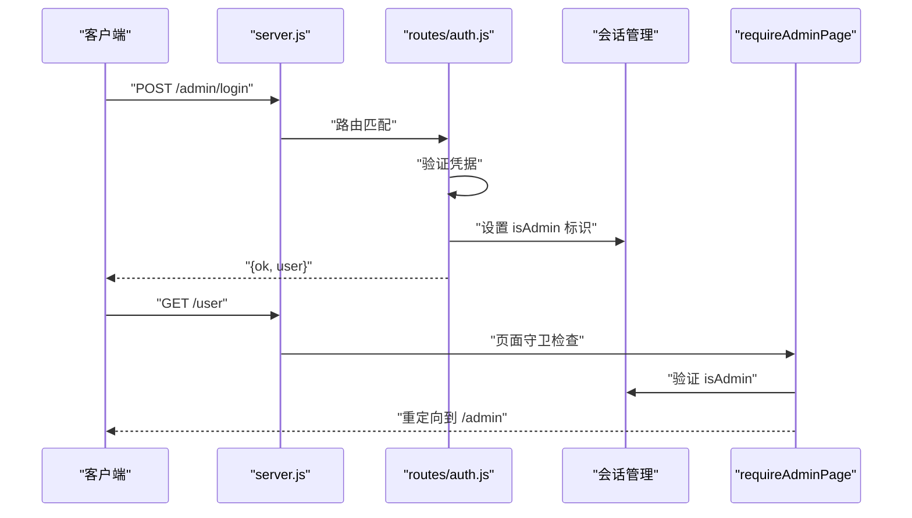
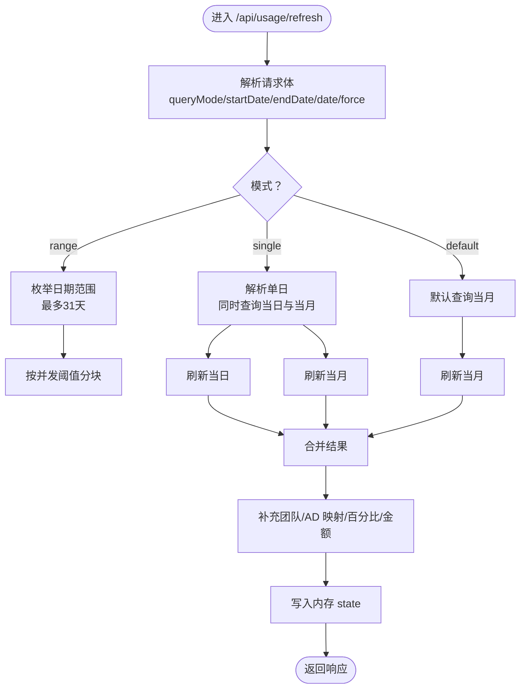
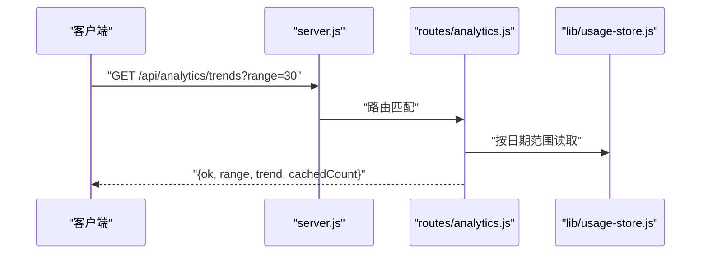
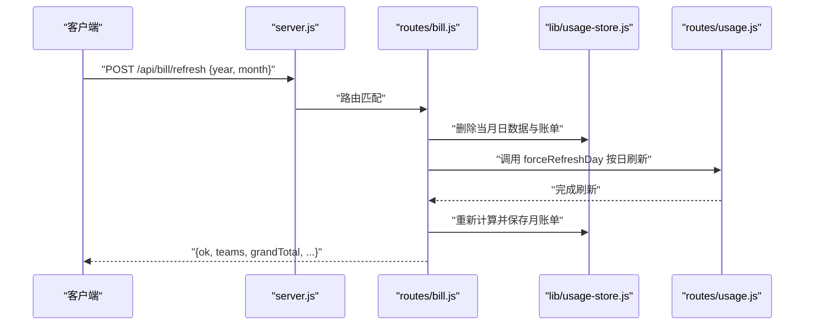
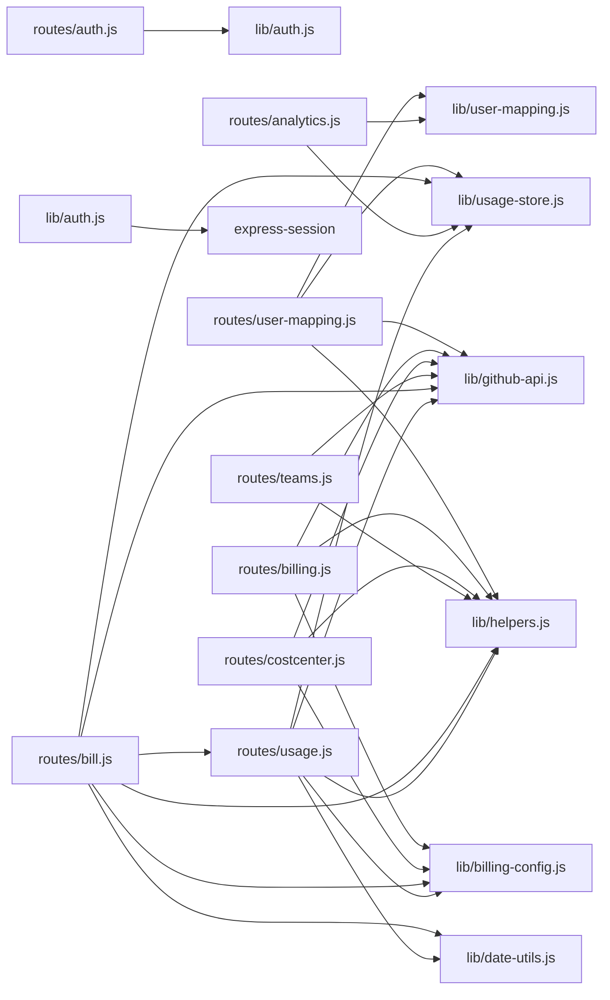

# 路由系统

<cite>
**本文档引用的文件**
- [server.js](file://server.js)
- [routes/usage.js](file://routes/usage.js)
- [routes/analytics.js](file://routes/analytics.js)
- [routes/bill.js](file://routes/bill.js)
- [routes/billing.js](file://routes/billing.js)
- [routes/costcenter.js](file://routes/costcenter.js)
- [routes/teams.js](file://routes/teams.js)
- [routes/user-mapping.js](file://routes/user-mapping.js)
- [routes/auth.js](file://routes/auth.js)
- [routes/seats.js](file://routes/seats.js)
- [lib/usage-store.js](file://lib/usage-store.js)
- [lib/user-mapping.js](file://lib/user-mapping.js)
- [lib/github-api.js](file://lib/github-api.js)
- [lib/helpers.js](file://lib/helpers.js)
- [lib/billing-config.js](file://lib/billing-config.js)
- [lib/date-utils.js](file://lib/date-utils.js)
- [lib/auth.js](file://lib/auth.js)
</cite>

## 目录
1. [简介](#简介)
2. [项目结构](#项目结构)
3. [核心组件](#核心组件)
4. [架构总览](#架构总览)
5. [详细组件分析](#详细组件分析)
6. [依赖关系分析](#依赖关系分析)
7. [性能考量](#性能考量)
8. [故障排查指南](#故障排查指南)
9. [结论](#结论)
10. [附录](#附录)

## 简介
本文件对 CopilotEnterpriseUsageDisplay 的路由系统进行全面技术文档化，覆盖以下模块：
- 用量查询路由：提供按日/周期的 Copilot 使用排名与统计
- 数据分析路由：趋势、Top 用户、日汇总等分析接口
- 账单管理路由：团队级月度账单计算与刷新，支持 AI Credits 和传统 PRU 计费模式
- 认证路由：管理员登录、登出、会话管理
- 团队管理路由：团队列表、成员数缓存与刷新
- 成本中心路由：企业成本中心查询、预算与资源批量同步
- 用户映射路由：成员映射文件上传、重载与信息查询

**更新** 新增认证路由模块和 AI Credits 账单路由支持，增强了路由系统的安全性和计费灵活性。

文档重点阐述各模块的 API 设计、参数处理、响应格式、错误处理、路由与服务层交互、数据校验与安全控制、缓存策略与性能优化，以及扩展与二次开发指导。

## 项目结构
路由系统采用"按功能域分层"的组织方式，入口在 server.js 中集中挂载各路由模块；核心服务通过依赖注入的方式在路由构造函数中传入（如 UsageStore、TeamCache、UserMappingService），实现高内聚低耦合。

```mermaid
graph TB
subgraph "应用入口"
S["server.js<br/>Express 应用启动"]
end
subgraph "认证路由"
A["routes/auth.js<br/>管理员认证"]
end
subgraph "业务路由"
R1["routes/usage.js"]
R2["routes/analytics.js"]
R3["routes/bill.js"]
R4["routes/billing.js"]
R5["routes/costcenter.js"]
R6["routes/teams.js"]
R7["routes/user-mapping.js"]
end
subgraph "服务与存储"
U["lib/usage-store.js<br/>SQLite 存储"]
M["lib/user-mapping.js<br/>用户映射服务"]
GH["lib/github-api.js<br/>GitHub API 封装"]
H["lib/helpers.js<br/>通用工具"]
C["lib/billing-config.js<br/>计费配置"]
D["lib/date-utils.js<br/>日期工具"]
AUTH["lib/auth.js<br/>认证工具"]
END
S --> A
S --> R1
S --> R2
S --> R3
S --> R4
S --> R5
S --> R6
S --> R7
A --> AUTH
R1 --> U
R1 --> GH
R1 --> H
R1 --> C
R1 --> D
R2 --> U
R2 --> M
R3 --> U
R3 --> GH
R3 --> H
R3 --> C
R3 --> D
R3 --> R1
R4 --> GH
R4 --> H
R4 --> C
R5 --> GH
R5 --> H
R5 --> C
R6 --> GH
R6 --> H
R7 --> M
R7 --> U
R7 --> GH
R7 --> H
```

**图表来源**
- [server.js:44-45](file://server.js#L44-L45)
- [server.js:140-150](file://server.js#L140-L150)
- [routes/auth.js:14-61](file://routes/auth.js#L14-L61)
- [routes/bill.js:61-618](file://routes/bill.js#L61-L618)

**章节来源**
- [server.js:44-45](file://server.js#L44-L45)
- [server.js:140-150](file://server.js#L140-L150)

## 核心组件
- 用量查询路由（/api/usage, /api/usage/refresh）
  - 功能：按日或周期聚合 Copilot 使用量，支持内存与 SQLite 缓存、并发去重、按用户回退策略
  - 关键特性：多级缓存（内存/SQLite/GitHub）、周期完整性校验、未知用户过滤、配额与超支计算
- 数据分析路由（/api/analytics/*）
  - 功能：趋势、Top 用户、日汇总，基于 SQLite 日常缓存聚合
- 账单管理路由（/api/bill, /api/bill/refresh, /api/bill/export）
  - 功能：团队级月度账单计算、历史缓存与当前期状态判断、强制刷新整月、Excel 导出
  - **新增** 支持 AI Credits 和传统 PRU 双重计费模式，智能切换计费模型
- 认证路由（/admin/login, /admin/logout, /admin/session）
  - 功能：管理员身份验证、会话管理和权限控制
  - **新增** 基于 bcrypt 的密码验证和安全的会话管理
- 团队管理路由（/api/teams, /api/enterprise-teams, /api/teams/refresh）
  - 功能：团队映射、成员数缓存、企业团队列表与成员分页
- 成本中心路由（/api/cost-centers*）
  - 功能：成本中心列表/详情、预算与花费聚合、批量添加/移除用户
- 用户映射路由（/user/*, /api/user/*）
  - 功能：映射文件上传与重载、成员列表增强、按 GitHub 登录查询 AD 信息

**章节来源**
- [routes/usage.js:377-462](file://routes/usage.js#L377-L462)
- [routes/analytics.js:10-128](file://routes/analytics.js#L10-L128)
- [routes/bill.js:383-484](file://routes/bill.js#L383-L484)
- [routes/auth.js:17-58](file://routes/auth.js#L17-L58)
- [routes/teams.js:39-100](file://routes/teams.js#L39-L100)
- [routes/costcenter.js:113-248](file://routes/costcenter.js#L113-L248)
- [routes/user-mapping.js:78-131](file://routes/user-mapping.js#L78-L131)

## 架构总览
路由层通过依赖注入与共享缓存（内存 Map、SQLite）实现高性能与一致性；服务层封装 GitHub API 并提供并发控制、重试、ETag 条件请求与 LRU 缓存；前端静态页面通过 SPA 方式访问。**新增** 认证中间件确保受保护页面的安全访问。



**图表来源**
- [server.js:44-45](file://server.js#L44-L45)
- [server.js:52-63](file://server.js#L52-L63)
- [routes/auth.js:17-58](file://routes/auth.js#L17-L58)
- [lib/auth.js:44-48](file://lib/auth.js#L44-L48)

## 详细组件分析

### 用量查询路由（/api/usage, /api/usage/refresh）
- 设计要点
  - 内存态聚合：维护最近一次查询结果（fetchedAt、ranking、mode、source、rawItemsCount、queryMode、dateLabel）
  - 多级缓存：内存 Map（refreshCache）、并发去重（refreshInFlight）、SQLite（daily_usage 表）
  - 周期完整性校验：按月从 SQLite 聚合时检查覆盖天数、近三日新鲜度、非空排名
  - 按用户回退：当已知用户为空且存在原始条目时，逐用户查询并回填
  - 配额与金额：结合计划类型与配额计算每用户金额
- API 定义
  - GET /api/usage
    - 响应字段：ok、fetchedAt、source、rawItemsCount、mode、ranking、includedQuota、dateLabel、queryMode
  - POST /api/usage/refresh
    - 请求体字段：queryMode（default/range/single）、startDate、endDate、date（YYYY-MM-DD）、force（布尔）
    - 响应字段：ok、fetchedAt、source、rawItemsCount、mode、ranking、includedQuota、dateLabel、queryMode、cacheHitRatio
- 错误处理
  - 参数校验失败返回 400
  - GitHub API 异常按 ApiError 抛出，统一写入错误响应
- 性能优化
  - 并发抓取：按最大并发阈值分块 Promise.all
  - 缓存命中率统计：返回 cacheHitRatio
  - SQLite TTL：近期 1 小时，历史 90 天
- 扩展建议
  - 新增查询模式时，在解析逻辑与缓存键上保持一致
  - 对未知用户占比高的场景，可考虑增加日志阈值与告警



**图表来源**
- [routes/usage.js:387-462](file://routes/usage.js#L387-L462)
- [lib/date-utils.js:19-33](file://lib/date-utils.js#L19-L33)
- [lib/usage-store.js:137-160](file://lib/usage-store.js#L137-L160)

**章节来源**
- [routes/usage.js:28-91](file://routes/usage.js#L28-L91)
- [routes/usage.js:134-235](file://routes/usage.js#L134-L235)
- [routes/usage.js:377-462](file://routes/usage.js#L377-L462)

### 数据分析路由（/api/analytics/*）
- 设计要点
  - 趋势：按日聚合 requests/amount，支持 30/90/365 天
  - Top 用户：按用户聚合请求量，取前 20
  - 日汇总：统计总请求量/金额、平均日请求量/金额、有数据天数
- API 定义
  - GET /api/analytics/trends?range=30|90|365
    - 响应字段：ok、range、trend[{date, requests, amount}]、cachedCount
  - GET /api/analytics/top-users?range=30|90|365
    - 响应字段：ok、range、topUsers[...]
  - GET /api/analytics/daily-summary?range=30|90|365
    - 响应字段：ok、range、totalRequests、totalAmount、avgDailyRequests、avgDailyAmount、daysWithData、totalDaysInRange
- 错误处理
  - range 非法返回 400
  - 其他异常统一写入错误响应



**图表来源**
- [routes/analytics.js:10-42](file://routes/analytics.js#L10-L42)
- [lib/usage-store.js:162-164](file://lib/usage-store.js#L162-L164)

**章节来源**
- [routes/analytics.js:10-128](file://routes/analytics.js#L10-L128)

### 账单管理路由（/api/bill, /api/bill/refresh, /api/bill/export）
- 设计要点
  - 账单周期判定：当前月前两日为"汇聚中"，其余返回"完整"或"部分"
  - **新增** AI Credits 计费模式：2026年6月起自动启用，支持促销期特殊定价
  - **新增** 传统 PRU 模式：$0.04/请求的按量付费
  - 优先从 SQLite 读取月度使用，否则调用 GitHub API
  - 月度账单持久化：按年月键保存到 monthly_bill 表
  - 强制刷新：清理当月日数据与月账单，按日强制刷新后重新计算
  - **新增** Excel 导出：生成详细的账单报表
- API 定义
  - GET /api/bill?year&month
    - 响应字段：ok、yearMonth、status、message、dateRange、teams、grandTotal
  - POST /api/bill/refresh
    - 请求体：{year, month}
    - 响应字段：ok、yearMonth、status、message、dateRange、refreshedDays、failedDates、teams、grandTotal、fetchedAt
  - GET /api/bill/export?year&month
    - 响应：Excel 文件流
- 错误处理
  - 参数非法返回 400
  - 期间处于"汇聚中"直接返回空账单
  - 异常统一写入错误响应



**图表来源**
- [routes/bill.js:401-484](file://routes/bill.js#L401-L484)
- [routes/usage.js:273-277](file://routes/usage.js#L273-L277)
- [lib/usage-store.js:282-320](file://lib/usage-store.js#L282-L320)

**章节来源**
- [routes/bill.js:383-618](file://routes/bill.js#L383-L618)

### 认证路由（/admin/login, /admin/logout, /admin/session）
- 设计要点
  - **新增** 基于 bcrypt 的密码验证，支持环境变量配置
  - **新增** 安全的会话管理，防止会话固定攻击
  - **新增** 页面守卫和 API 守卫，区分 HTML 和 JSON 请求
  - **新增** 会话 Cookie 配置，生产环境启用 HTTPS
- API 定义
  - POST /admin/login
    - 请求体：{user, password}
    - 响应：{ok, user} 或 {ok: false, message: "Invalid credentials"}
  - POST /admin/logout
    - 响应：{ok: true}
  - GET /admin/session
    - 响应：{authenticated: boolean, user: string|null}
- 安全控制
  - 凭据验证：bcrypt 密码比较
  - 会话固定防护：登录成功后重新生成会话 ID
  - Cookie 安全：httpOnly、sameSite、secure（生产环境）
  - 页面保护：受保护路由必须先登录

**章节来源**
- [routes/auth.js:17-58](file://routes/auth.js#L17-L58)
- [lib/auth.js:21-37](file://lib/auth.js#L21-L37)

### 团队管理路由（/api/teams, /api/enterprise-teams, /api/teams/refresh）
- 设计要点
  - 团队映射：基于 Copilot 席位数据构建 userTeamMap
  - 成员数缓存：Map + TTL（10 分钟）
  - 企业团队列表：分页获取并补充成员数
- API 定义
  - GET /api/teams
    - 响应字段：ok、fetchedAt、teams（用户->团队数组映射）
  - GET /api/enterprise-teams
    - 响应字段：ok、teams[...]
  - GET /api/enterprise-teams/:teamId/members
    - 响应字段：ok、totalMembers、members[...]
  - POST /api/teams/refresh
    - 响应字段：ok、fetchedAt、totalUsers、teams

**章节来源**
- [routes/teams.js:39-100](file://routes/teams.js#L39-L100)

### 成本中心路由（/api/cost-centers*）
- 设计要点
  - 企业模式限定：仅 ENTERPRISE_SLUG 生效
  - 预算聚合：跨页拉取预算，按成本中心名称聚合预算与 SKU
  - 花费聚合：按成本中心 ID 查询当月使用并按允许 SKU 汇总
  - 批量操作：将团队成员加入/移除成本中心资源（分批提交）
- API 定义
  - GET /api/cost-centers?state=active|deleted
    - 响应字段：ok、fetchedAt、enterprise、seatBaseCost、total、costCenters[...]
  - GET /api/cost-centers/by-name/:name
    - 响应字段：ok、fetchedAt、enterprise、seatBaseCost、costCenter
  - POST /api/cost-centers/:id/add-users-from-teams
    - 请求体：{teamIds[], dryRun, removeMissingUsers}
    - 响应字段：ok、dryRun、removeMissingUsers、costCenter、selectedTeams、unresolvedTeams、counts、lists、批次统计

**章节来源**
- [routes/costcenter.js:113-248](file://routes/costcenter.js#L113-L248)

### 用户映射路由（/user/*, /api/user/*）
- 设计要点
  - 映射文件上传：.xlsx/.xls，转换为 JSON 并写入 data/user_mapping.json
  - 自动重载：文件变更自动触发加载（带防抖）
  - 成员列表增强：结合席位与映射输出 AD 名称/邮箱
  - 信息查询：按 GitHub 登录查询 AD 信息
- API 定义
  - GET /user
  - GET /analytics
  - GET /costcenter
  - GET /costcenter/:name
  - POST /user/upload-members
    - 响应字段：ok、message、totalRows、validRows、skipped、fileName
  - POST /user/reload-mapping
    - 响应字段：ok、message、count、fetchedAt
  - GET /api/user/members
    - 响应字段：ok、loadedAt、total、mappedCount、members[...]
  - GET /api/user/info?github=
    - 响应字段：ok/false、githubName、adName、adMail、githubMail

**章节来源**
- [routes/user-mapping.js:78-131](file://routes/user-mapping.js#L78-L131)
- [lib/user-mapping.js:7-22](file://lib/user-mapping.js#L7-L22)

## 依赖关系分析
- 路由到服务
  - usage/bill/analytics 依赖 UsageStore（SQLite）
  - usage/bill 依赖 GitHub API（并发/重试/ETag/LRU）
  - user-mapping 依赖 UserMappingService（文件监控/防抖）
  - teams/costcenter 依赖 GitHub API
  - **新增** auth 依赖认证工具（bcrypt、会话管理）
- 关键依赖图



**图表来源**
- [routes/auth.js:12](file://routes/auth.js#L12)
- [lib/auth.js:11](file://lib/auth.js#L11)
- [routes/usage.js:13](file://routes/usage.js#L13)
- [routes/analytics.js:7](file://routes/analytics.js#L7)
- [routes/bill.js:7-11](file://routes/bill.js#L7-L11)
- [routes/teams.js:36](file://routes/teams.js#L36)
- [routes/costcenter.js:110](file://routes/costcenter.js#L110)
- [routes/billing.js:10](file://routes/billing.js#L10)
- [routes/user-mapping.js:12](file://routes/user-mapping.js#L12)

## 性能考量
- 并发与去重
  - GitHub API 并发队列：MAX_CONCURRENT_GITHUB 控制并发
  - 单飞行去重：同一查询键避免重复请求
  - 内存去重：/api/usage/refresh 的并发刷新去重
- 缓存策略
  - LRU 缓存：不同路径设定不同 TTL（如 seats/teams 10 分钟，usage 3 分钟）
  - ETag 条件请求：命中 304 直接返回缓存数据
  - SQLite 缓存：daily_usage 与 monthly_bill，按 TTL 管理新鲜度
- 计算优化
  - SQLite 聚合：周期聚合优先走 SQLite，缺失或不新鲜则回源 GitHub
  - 合并排序：多日聚合使用 Map 聚合后一次性排序
  - **新增** AI Credits 模式优化：智能选择计费模型，减少计算开销
- I/O 与磁盘
  - SQLite WAL + NORMAL 提升并发写入稳定性
  - 定期清理旧数据与 ETag，防止膨胀

**章节来源**
- [lib/github-api.js:25-48](file://lib/github-api.js#L25-L48)
- [lib/github-api.js:58-98](file://lib/github-api.js#L58-L98)
- [lib/github-api.js:231-269](file://lib/github-api.js#L231-L269)
- [lib/usage-store.js:6-18](file://lib/usage-store.js#L6-L18)
- [routes/usage.js:17-18](file://routes/usage.js#L17-L18)
- [routes/usage.js:237-251](file://routes/usage.js#L237-L251)

## 故障排查指南
- 常见错误与定位
  - 参数校验失败：检查 query/body 字段是否符合要求（日期格式、范围限制）
  - GitHub API 速率限制：查看响应中的 rateLimit 字段，等待重置或降低并发
  - 304 未修改：确认 ETag 是否正确，必要时清理缓存
  - 未知用户占比高：关注日志提示，确认团队映射与用户映射是否齐全
  - **新增** 认证失败：检查 ADMIN_USER 和 ADMIN_PASSWORD_HASH 环境变量配置
  - **新增** 会话问题：确认 SESSION_SECRET 设置和 Cookie 配置
- 统一错误处理
  - 所有路由均通过 writeError 输出标准化错误响应（含 message、statusCode）
  - 全局中间件捕获未处理异常，记录堆栈并返回 500
- 排查步骤
  - 查看 server 日志中的 action 字段（URL 映射）
  - 检查 SQLite 表（daily_usage、monthly_bill、etag_cache、seats_snapshot）
  - 清理 ETag 缓存或禁用 LRU 缓存进行对比测试
  - **新增** 验证认证配置：检查 .env 文件中的管理员凭据设置

**章节来源**
- [lib/helpers.js:30-36](file://lib/helpers.js#L30-L36)
- [server.js:172-191](file://server.js#L172-L191)
- [lib/github-api.js:14-21](file://lib/github-api.js#L14-L21)

## 结论
该路由系统通过"路由层 + 服务层 + 存储层"的清晰分层，结合多级缓存与并发控制，实现了高可用、可观测、可扩展的企业级用量与账单管理能力。**新增** 的认证路由和 AI Credits 账单路由进一步增强了系统的安全性、灵活性和现代化程度。建议在新增路由时遵循：
- 明确的参数校验与错误响应
- 优先使用 SQLite 缓存与条件请求
- 严格控制并发与单飞行去重
- 保持缓存键与 TTL 的一致性
- 在全局中间件中统一记录与上报
- **新增** 实施安全最佳实践，包括强密码策略、会话管理和访问控制

## 附录

### API 端点一览与规范
- 用量查询
  - GET /api/usage
    - 响应：包含 ranking、mode、source、includedQuota 等
  - POST /api/usage/refresh
    - 请求体：queryMode、startDate、endDate、date、force
    - 响应：包含 cacheHitRatio、dateLabel、ranking
- 数据分析
  - GET /api/analytics/trends?range=30|90|365
  - GET /api/analytics/top-users?range=30|90|365
  - GET /api/analytics/daily-summary?range=30|90|365
- 账单管理
  - GET /api/bill?year&month
  - POST /api/bill/refresh {year, month}
  - GET /api/bill/export?year&month
- **新增** 认证管理
  - POST /admin/login {user, password}
  - POST /admin/logout
  - GET /admin/session
- 团队管理
  - GET /api/teams
  - GET /api/enterprise-teams
  - GET /api/enterprise-teams/:teamId/members
  - POST /api/teams/refresh
- 成本中心
  - GET /api/cost-centers?state=active|deleted
  - GET /api/cost-centers/by-name/:name
  - POST /api/cost-centers/:id/add-users-from-teams {teamIds[], dryRun, removeMissingUsers}
- 用户映射
  - GET /user | /analytics | /costcenter | /costcenter/:name
  - POST /user/upload-members（multipart/form-data）
  - POST /user/reload-mapping
  - GET /api/user/members
  - GET /api/user/info?github=

**章节来源**
- [routes/usage.js:377-462](file://routes/usage.js#L377-L462)
- [routes/analytics.js:10-128](file://routes/analytics.js#L10-L128)
- [routes/bill.js:383-618](file://routes/bill.js#L383-L618)
- [routes/auth.js:17-58](file://routes/auth.js#L17-L58)
- [routes/teams.js:39-100](file://routes/teams.js#L39-L100)
- [routes/costcenter.js:113-248](file://routes/costcenter.js#L113-L248)
- [routes/user-mapping.js:78-131](file://routes/user-mapping.js#L78-L131)